# 如何使用盖茨比与 Netlify CMS 

> 原文：<https://blog.logrocket.com/how-to-use-gatsby-netlify-cms/>

***编者按**:这篇文章于 2022 年 3 月 4 日更新，添加了用户界面的截屏，以增加清晰度，并验证教程的步骤仍然准确。*

## 什么是 Jamstack？

Jamstack 指的是没有服务器端组件的 web 应用程序；相反，它依赖于通过客户端 JavaScript API 请求的模板化标记文件来呈现页面上的内容。所有的模板化标记都是在部署之前生成的，因此不需要像动态网站那样等待页面即时构建。

Jamstack 因其令人印象深刻的性能、低成本、高安全性和积极的开发者体验而越来越受欢迎。

使用 Jamstack 构建站点的一个很好的解决方案是将 Gatsby 与 Netlify CMS 结合使用。在本帖中，我们将使用一个由 Gatsby 和 Netlify CMS 构建的演示 web 应用程序来解释 Gatsby 和 Netlify CMS 是如何工作的。

## 盖茨比是什么？

Gatsby 是一个使用 React 和 GraphQL 的静态站点生成器。Gatsby 生成了一堆 JavaScript 和 CSS 文件，这些文件以这样的方式分开，即一个页面将加载尽可能少的代码，以保持加载时间最短。GraphQL 用于将标记文件中的数据查询到 React 组件文件中。


## 什么是 Netlify CMS？

Netlify CMS 可以为 Gatsby 网站提供标记数据，并允许用户通过直观且易于使用的界面输入内容，然后 Gatsby 使用该界面为 web 应用程序创建适当的页面。

在 Netlify CMS 上保存内容时，数据会作为降价文件保存到 web 应用程序的 Git 存储库中。

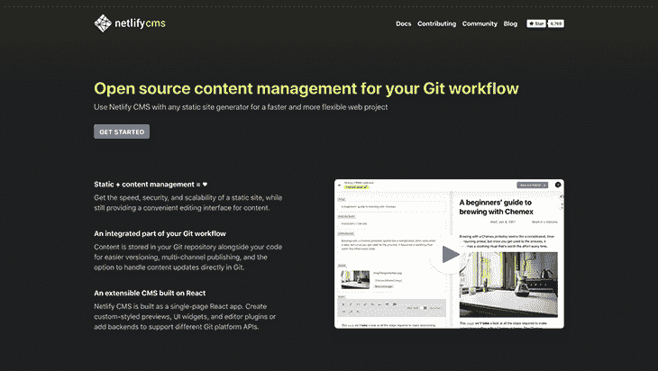

在 Gatsby 从其构建过程中生成所有 web 应用程序文件后，web 应用程序可以部署到静态网站主机，如 [Netlify](https://www.netlify.com/) 、 [Now](https://zeit.co/now) 或[亚马逊 S3](https://aws.amazon.com/s3/) 。

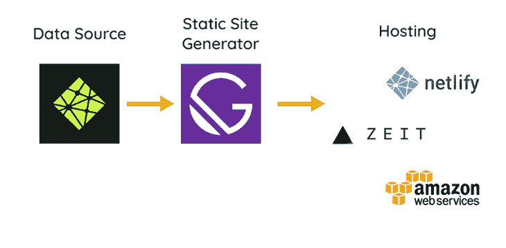

Netlify CMS provides the data to Gatsby, which then generates a static website that can be deployed to Netlify, Now, Amazon S3, or another static web host

## 入门指南

本演练将解释用 Gatsby 和 Netlify CMS 构建的 web 应用程序的主要部分。本演练基于为一个虚构的 JavaScript meetup 组创建的示例 web 应用程序。

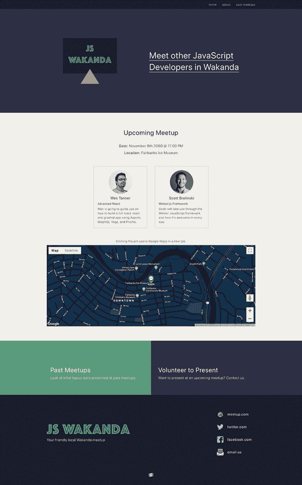

我们将讨论以下内容:

让我们开始吧。

## 用 Netlify CMS 和 Gatsby 构建应用程序

您可以[在 GitHub 上查看 web 应用程序](https://github.com/robertcoopercode/gatsby-netlify-cms)的源代码，并通过点击自述文件中的 **Deploy to Netlify** 按钮轻松部署您自己的应用程序实例。

点击 **Deploy to Netlify** 将会把你带到 Netlify 的网站，在那里它会要求你连接你的 GitHub 帐户，这样它就可以克隆存储库并部署 web 应用程序的实例。如果您想自己访问和探索 Netlify CMS，我建议您在跟随本演练时使用这个函数。

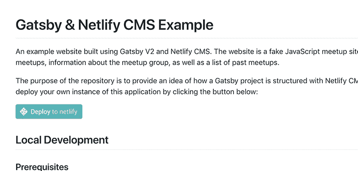

The **Deploy to Netlify** button is found in the example repository’s README and allows a user to quickly deploy the web app to a randomly generated URL

重定向到 Netlify 后，您将看到一个包含各种步骤的屏幕，如下图所示:

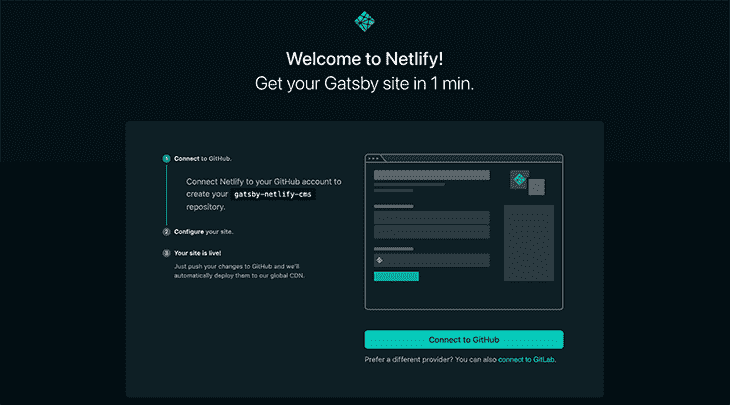

点击**连接到 GitHub** ，以便 Netlify 可以在您的 GitHub 帐户中为此项目创建一个存储库；我们将使用 GitHub，但是如果您希望继续使用 GitLab，您仍然可以这样做。

在您点击**连接到 GitHub** 之后，您应该会看到一个 GitHub 授权弹出窗口，授权 Netlify 创建存储库。点击**授权网络生活**。如果出现提示，请输入您的 GitHub 密码，然后您应该会看到以下屏幕:

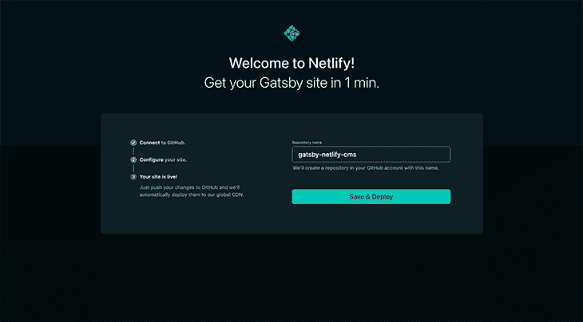

You can save and deploy your site once you authenticate into Netlify

现在提供一个存储库名称。在这种情况下，我将保留默认值，但是您可以提供自己选择的任何名称。然后点击**保存&部署**。该页面应重定向到您的网络生活仪表板:

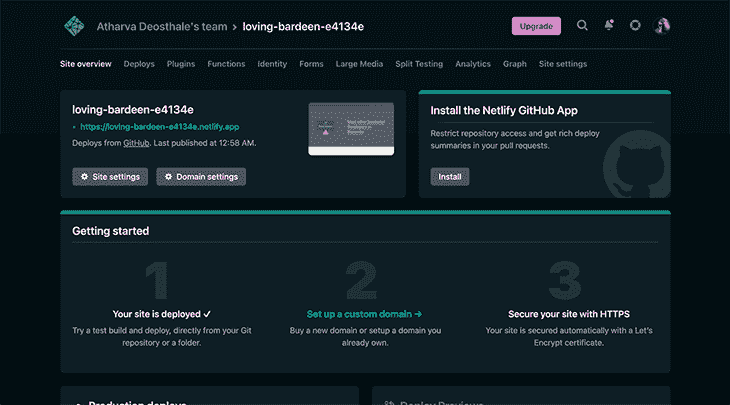

## 通过`/admin`访问 Netlify CMS

为了能够在网站的`/admin`路线访问 Netlify CMS，我们需要通过他们的[身份服务](https://www.netlify.com/docs/identity/)启用 Netlify 的 [Git 网关](https://github.com/netlify/git-gateway)。Git Gateway 允许用户将贡献者添加到 CMS，而无需授予他们对代码库的完全访问权限，而 Netlify 的身份服务处理所有的身份验证，并提供用户管理界面。

接下来的步骤将在 Netlify 仪表板中启用身份；邀请自己成为用户，然后启用 Git 网关。

点击顶部导航栏上的**身份**。

继续点击 Netlify 仪表板中 **Enable Identity** 按钮。


接下来，单击**邀请用户**按钮，输入您的电子邮件地址，邀请您成为用户并访问 CMS 管理面板。


现在，点击顶部导航栏上的**站点设置**。选择**身份**，然后在工具条上选择**服务**。确保您点击了 **Enable Git Gateway** 以允许 Netlify 与您的 GitHub 库接口。

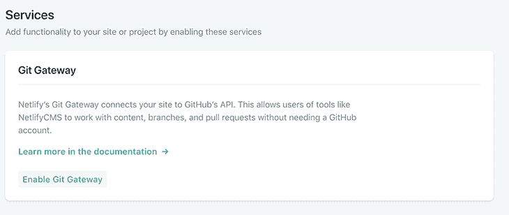

邀请自己并启用 Git 网关后，您应该会收到一封电子邮件，邀请您为该应用程序创建一个用户配置文件。单击电子邮件中的链接接受邀请，然后系统会提示您创建密码。

创建密码后，您应该能够通过访问您网站的`/admin`路径，然后使用您刚刚注册的电子邮件和密码登录，来访问 web 应用程序的 Netlify CMS。

您使用 Netlify 部署的 web 应用程序所使用的域名可以在 Netlify 仪表板的概览页面顶部找到。在我的情况下，我已经在**设置**中将域定制为`gatsby-netlify-cms-example.netlify.cms`，所以我可以通过进入 [`https://gatsby-netlify-cms-example.netlify.com/admin`](https://gatsby-netlify-cms-example.netlify.com/admin) 来访问我的应用程序的管理。

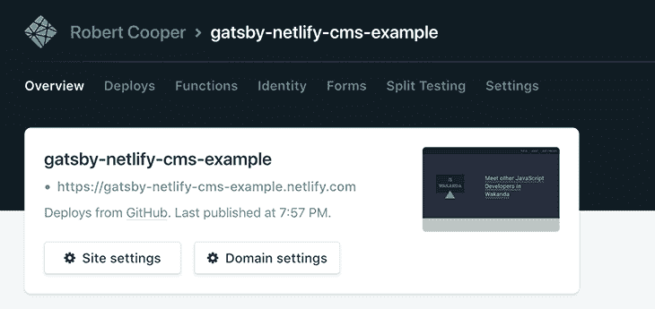

The domain for the deployed web app is display in the overview section of the Netlify dashboard

访问 web 应用程序的[https://gatsby-netlify-cms-example.netlify.com/admin](https://gatsby-netlify-cms-example.netlify.com/admin)会提示用户使用用户名和密码登录，如下所示。

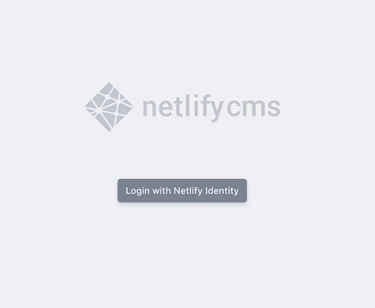

## 检查我们的盖茨比项目结构

让我们看一下代码。我们的项目有两个文件夹:`src/`和`static/`。

`src/`目录包含所有决定应用程序 UI 的 React 组件和 Sass 文件。`src/`目录还保存着 Markdown 文件，其中包含我们输入到 CMS 中的所有文本和数据。当新数据保存在 CMS 中时，它会以降价文件的形式添加到这个`src/`目录中。

`static/`目录包含通过 CMS 上传的图像或文件，以及 CMS `config.yaml`文件，该文件决定了可以通过 CMS 界面添加的数据类型。

例如，`config.yaml`是您指定想要定义一个名为“meetup”的集合，并且每个 meetup 都应该有一个标题、日期、演示者列表以及与之关联的位置。阅读文档了解更多关于[配置文件](https://www.netlifycms.org/docs/configuration-options/)的信息。

```
...

collections:
  - name: "meetups"
    label: "Meetups"
    description: "Meetup dates, location, and presenter information."
    folder: "src/pages/meetups"
    create: true
    fields:
      - { label: "Template Key", name: "templateKey", widget: "hidden", default: "meetup" }
      - { label: "Title", name: "title", widget: "string" }
      - { label: "Date", name: "date", widget: "datetime" }
      - {
          label: Presenters,
          name: presenters,
          required: true,
          widget: list,
          fields:
            [
              { label: Name, name: name, required: true, widget: string },
              {
                label: Presentation Title,
                name: presentationTitle,
                required: false,
                widget: string,
              },

              ...

```

## 使用 GraphiQL 在 React 组件中获取数据

Gatsby 设置为[使用 GraphQL](https://blog.logrocket.com/tag/graphql) 查询 JavaScript 文件中的数据，并将其传递给 React 组件。在查看 React 页面模板文件时，您会在文件的底部看到一个 GraphQL 查询，它查询页面所需的所有数据。

```
...

export const aboutPageQuery = graphql`
  query AboutPage($id: String!) {
    markdownRemark(id: { eq: $id }) {
      html
      frontmatter {
        title
        mainImage {
          image
          imageAlt
        }
        gallery {
          image
          imageAlt
        }
        developerGroups
        organizers {
          title
          gallery {
            image
            imageAlt
            name
          }
        }
        seo {
          browserTitle
          title
          description
        }
      }
    }
    ...LayoutFragment
  }
`

```

GraphQL 查询中被查询数据的名称基于`config.yaml`文件中提供的字段名称。然而，有些字段名不太直观，比如`frontmatter`和`markdownRemark`。

幸运的是，Gatsby 附带了[GraphQL](https://github.com/graphql/graphiql)，它可以帮助您通过 graph QL 查询探索 Gatsby 应用程序中所有可用的数据。GraphQL 还可以通过其文档浏览器发现所有 graph QL 字段的名称。

使用`yarn develop`并访问 [`http://localhost:8000/___graphql`](http://localhost:8000/___graphql) 可以在本地运行 web app 时访问 GraphiQL。

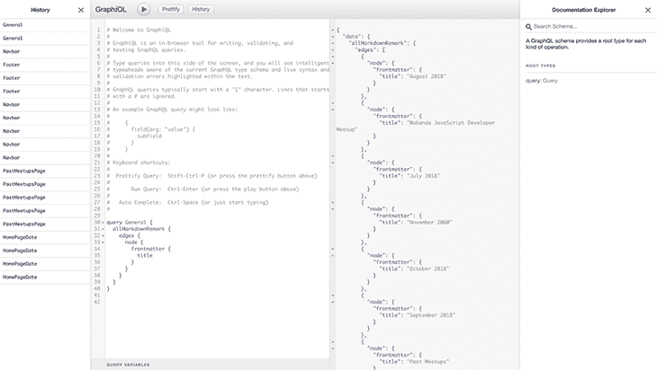

GraphiQL is a handy tool to allow a user to explore the available GraphQL queries and see what data gets returned from running different queries

React 组件文件中使用 GraphQL 查询的数据允许通过传递给文件的导出 React 组件的对象来访问所有查询的数据。

下面，导出的`AboutPage`组件接收 GraphQL 查询提供的数据。

```
...

const AboutPage = ({ data }) => {
  const { markdownRemark: page, footerData, navbarData } = data;
  const {
    frontmatter: {
      seo: { title: seoTitle, description: seoDescription, browserTitle },
    },
  } = page;

  return (
    <Layout footerData={footerData} navbarData={navbarData}>
      <Helmet>
        <meta name="title" content={seoTitle} />
        <meta name="description" content={seoDescription} />
        <title>{browserTitle}</title>
      </Helmet>
      <AboutPageTemplate page={{ ...page, bodyIsMarkdown: false }} />
    </Layout>
  );
};

AboutPage.propTypes = {
  data: PropTypes.object.isRequired,
};

export default AboutPage;

...

```

注意上面的`AboutPage`模板的 React 组件有一个子组件`AboutPageTemplate`？这样你就可以导出`AboutPageTemplate`组件，并使用它来设置关于页面的预览，显示在 CMS 中。我们将在查看 CMS 及其预览功能时更详细地介绍这一点，这需要在 React 项目中进行适当的设置。

## 在本地开发并部署到网络

在本地运行 web 应用程序就像安装项目依赖项并运行启动脚本(`yarn develop`)一样简单。

运行启动脚本可以在 [http://localhost:8000/](http://localhost:8000/) 访问站点。

开发时要记住的一点是，一旦通过 CMS 添加或修改了内容，您将需要在本地运行`git pull`来从 CMS 获取最新的更改。

部署任何代码更新就像将新的提交推送到您的远程 Git 存储库一样简单，因为 Netlify 将通过`yarn build`命令自动构建应用并提供更新的代码。

在部署时，确保构建脚本成功运行是一个好主意，因为如果对 CMS 被告知期待的数据结构进行了[修改，可能会出现一些错误。如果构建失败，您将需要阅读错误消息以了解脚本构建失败的原因，然后做出相应的调整。](https://blog.logrocket.com/fetching-dynamically-structured-data-cms-graphql/)

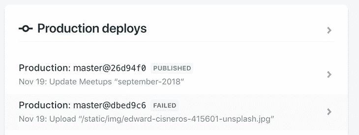

Netlify will report the status of running the build script after new changes have been detected on the master branch of the application’s git repository

## 通过 Netlify CMS 编辑内容

如上所述，在认证进入 Netlify CMS 后，您将看到一个页面，在左侧显示该网站的收藏，在右侧显示最近的聚会列表。通过 CMS 输入的所有数据在保存时都将存储在 Git 存储库中。一旦对 Git 存储库有了新的提交，Netlify 将触发应用程序的 Gatsby 构建，然后用新内容部署它(这称为[连续部署](https://www.netlify.com/docs/continuous-deployment/))。

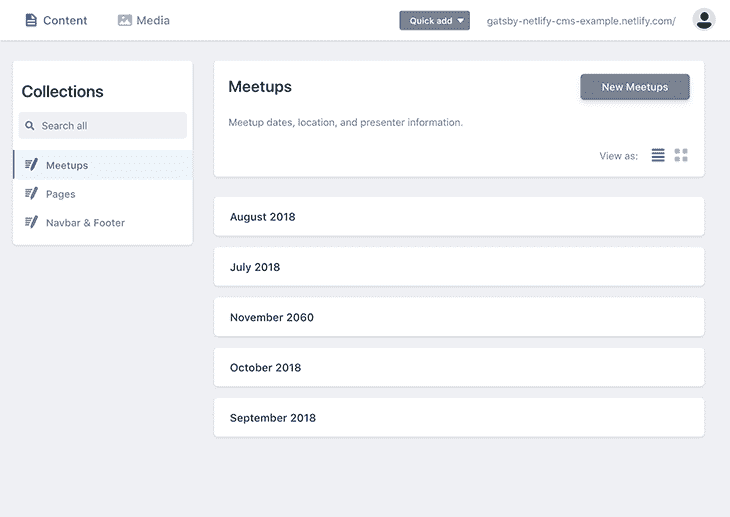

该应用程序已经以这样的方式编码，网站上显示的所有内容都可以在 CMS 中配置(甚至导航条和页脚内容)！

这里，我们将通过 CMS 添加/编辑一个新的 meetup 条目。

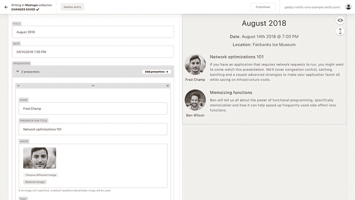

现在，我们可以通过 CMS 编辑页脚。

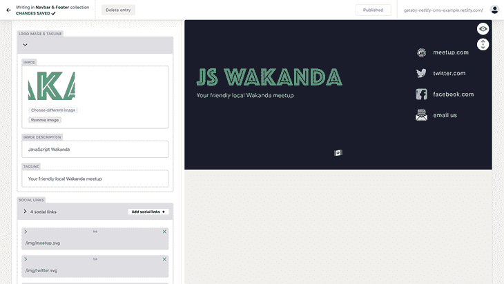

正如我们上面提到的，Netlify CMS 允许您在编辑 CMS 中的内容时查看页面的实时预览。在设置 React 代码时，设置预览需要一点思考，我没有在上传图像后立即显示图像的运气，但考虑到显示静态站点的实时预览所涉及的复杂性，它工作得相当好。

## 结论

如果您有兴趣了解更多关于 Gatsby 和 Netlify CMS 如何协同工作的信息，您可以探索上述示例应用程序的源代码，参考 [Gatsby](https://www.gatsbyjs.org/docs/) 和 [Netlify CMS](https://www.netlifycms.org/docs/intro/) 文档，以及查看用于 Gatsby 和 Netlify CMS 的[入门模板](https://github.com/netlify-templates/gatsby-starter-netlify-cms)。

## 使用 LogRocket 消除传统反应错误报告的噪音

[LogRocket](https://lp.logrocket.com/blg/react-signup-issue-free)

是一款 React analytics 解决方案，可保护您免受数百个误报错误警报的影响，只针对少数真正重要的项目。LogRocket 告诉您 React 应用程序中实际影响用户的最具影响力的 bug 和 UX 问题。

[ ](https://lp.logrocket.com/blg/react-signup-general) [  ](https://lp.logrocket.com/blg/react-signup-general) [LogRocket](https://lp.logrocket.com/blg/react-signup-issue-free)

自动聚合客户端错误、反应错误边界、还原状态、缓慢的组件加载时间、JS 异常、前端性能指标和用户交互。然后，LogRocket 使用机器学习来通知您影响大多数用户的最具影响力的问题，并提供您修复它所需的上下文。

关注重要的 React bug—[今天就试试 LogRocket】。](https://lp.logrocket.com/blg/react-signup-issue-free)