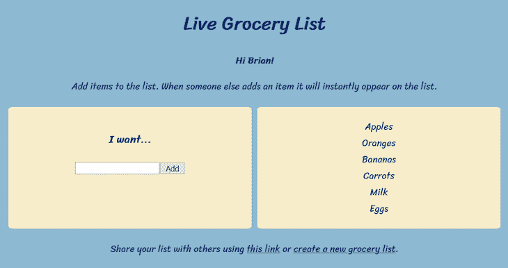
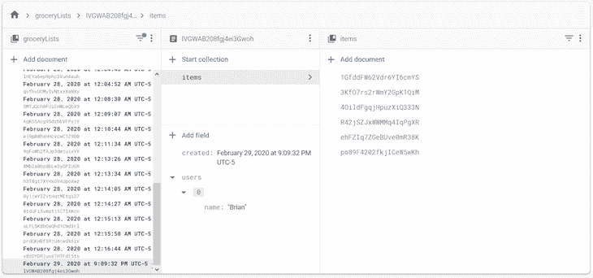

# 如何使用 Firebase Firestore - LogRocket 博客的 React 挂钩

> 原文：<https://blog.logrocket.com/how-to-use-react-hooks-firebase-firestore/>

***编者按**:这篇文章最后更新于 2022 年 2 月 2 日，以反映[对 Firebase 的最新更新](https://firebase.google.com/support/releases)。*

React 钩子和 Firebase 有什么共同点？它们都加速了开发，减少了构建复杂的东西所需的代码量。

当您将 Firestore 的强大和简单与简单高效的 React 功能组件和挂钩结合起来时，您可以非常快速地将 web 应用程序与数据持久性结合起来，这实际上是非常令人难以置信的。在本文中，我们将学习如何将 Firestore 和 React Hooks 结合起来，创建一个简单高效的购物清单应用程序。

您可以通过此目录跳转到教程的特定部分:

## 钩子如何加速开发？

首先，快速复习一下 React 钩子。钩子允许您将有状态逻辑定义为可重用的函数，可以在整个 React 应用程序中使用。钩子还使功能组件能够绑定到组件生命周期中，这在以前只有类组件才有可能。

当创建需要处理生命周期事件的组件时，React 没有规定是否应该使用功能组件和钩子。或者更传统的类组件。

也就是说，函数组件和钩子已经迅速成为 React 开发者社区的一大亮点——这是有充分理由的。与类组件相比，函数组件和钩子大大减少了 React 应用程序的代码量和冗长性。

## Firestore 如何加速发展？

Firebase 是一个服务和工具的集合，开发人员可以将它们组合在一起，快速创建具有高级功能的 web 和移动应用程序。Firebase 服务运行在谷歌云平台之上，这意味着高度的可靠性和可扩展性。

Firestore 是 Firebase 中包含的服务之一。Firestore 是一个基于云的、可扩展的 NoSQL 文档数据库。它最显著的特点之一是能够轻松地将数据的变化实时传输到网络和移动应用程序中。您将很快在一个示例应用程序中看到这一点。

Firestore 身份验证和安全规则模型进一步加速了 Web 应用程序的开发。Firestore web API 允许您的 web 应用程序直接从浏览器与 Firestore 数据库进行交互，而无需服务器端配置或代码。这实际上就像建立一个 Firebase 项目，将 API 集成到客户端 JavaScript 代码中，然后读取和写入数据一样简单。

React 功能组件、钩子和 Firestore web API 相互补充得非常好。是时候看看所有这些是如何运作的了。让我们来看看一个示例杂货清单 web 应用程序及其部分代码。

## 如何将 Firebase 与 React 挂钩一起使用:杂货清单 web 应用程序

为了探索在 Firebase 中使用 React 钩子，我们需要一些示例代码。让我们以购物清单 web 应用程序为例。



你可以[亲自尝试一下购物清单网络应用](https://fir-with-react-hooks.firebaseapp.com/)。请忽略从 20 世纪 90 年代网站墓地复活的 CSS 样式——UI 设计显然不是我的强项。

如果你还没有试用过这个应用，你可能会想知道它是如何工作的。本质上，它允许你创建一个新的购物清单。杂货列表的 URL 可以与其他用户共享，然后他们可以加入该列表并添加自己的杂货项目。

食品清单上的商品一旦被添加到数据库中，就会立即出现在屏幕上。这就创造了一个共享的体验，多个用户可以同时向列表中添加项目，并看到彼此的添加内容。

杂货清单 web 应用程序完全是使用 React 函数组件和钩子构建的。杂货清单和用户数据被保存到 Firestore。web 应用程序本身使用 Firebase 主机托管。

在 GitHub [的这个库](https://github.com/Tammibriggs/firebase-with-react-hooks)中可以找到杂货清单应用程序的完整源代码。

## Firebase web 应用程序配置和初始化

所有调用 Firebase web API 来检索或更新 Firestore 上的数据的调用都被集中在`src/services/firestore.js`中。在该文件的顶部，您会看到 Firebase 应用程序的初始化代码，如下所示:

```
const firebaseConfig = {
    apiKey: process.env.REACT_APP_FIREBASE_API_KEY,
    authDomain: process.env.REACT_APP_FIREBASE_AUTH_DOMAIN,
    projectId: process.env.REACT_APP_FIREBASE_PROJECT_ID
};

const app = initializeApp(firebaseConfig);
const db = getFirestore(app)

```

在模块化 Firebase SDK 中，函数从各自的模块中独立导入，而不是像在 Firebase v8 中那样从一个名称空间链接。你会注意到`initializeApp`和`getFirestore`的用法。

为了使用 Firebase 服务，您必须为`initializeApp`函数提供一些配置，并初始化您想要使用的服务的一个实例(在本例中是 Firestore)。每个服务的初始化都需要不同的函数，对于 Firestore 来说，就是`getFirestore`。

您需要向`initializeApp`函数提供的配置取决于您正在使用的 Firebase 服务。在本例中，我只使用 Firestore，所以只需要一个 API 密钥、认证域和项目 ID。一旦你创建了一个 Firebase 项目并添加了一个 web 应用程序，你可以在 [Firebase 控制台](https://console.firebase.google.com/)的项目设置屏幕的 **General** 选项卡上找到你独特的配置设置。

乍一看，Firebase 配置设置似乎应该是私有的，不应该在浏览器中公开。然而，事实并非如此；将它们包含在客户端 JavaScript 中是安全的。使用 [Firebase 认证](https://blog.logrocket.com/user-authentication-firebase-react-apps/)和 Firestore 安全规则来保护您的应用程序。我不会进入那些细节，但你可以在这里阅读更多关于它的[。](https://firebase.google.com/docs/firestore/security/get-started)

您可能还注意到，我用全局`process.env`对象上定义的 React 环境变量替换了配置值。您可能不希望在您的源代码存储库中包含这种配置，尤其是如果您的存储库是公开可用的，并且打算由其他开发人员共享和克隆。

开发人员一定会下载并运行您的代码，而不会意识到他们正在消耗您的 Firebase 资源。相反，我选择了包含一个样本[。env](https://github.com/Tammibriggs/firebase-with-react-hooks/blob/main/.env) 文件，记录运行应用程序之前必须提供的配置设置。当我自己在本地运行应用程序时，我有自己的`.env.local`文件，它没有被签入源代码控制。

## 将数据写入 firestorm

一旦设置好 Firebase 配置，开始从 Firestore 数据库读写数据只需要很少的代码。

在其基本形式中，Firestore 数据库由文档集合组成。一个文档可以包含多个不同类型的字段，包括一个允许您嵌套文档集合的子集合类型。所有这些结构都是在 JavaScript 代码调用 Firebase API 写入数据时动态生成的。

* * *

### 更多来自 LogRocket 的精彩文章:

* * *

向 Firestore 写入数据的函数有`setDoc`和`addDoc`。这两个函数在幕后做同样的事情，但区别在于它们的使用方式。当您使用`setDoc`创建文档时，您必须为该文档指定一个 ID，而对于`addDoc`，Firestore 会在提供收藏参考和文档数据时自动为您生成一个 ID。

例如，下面的代码使用`addDoc`在`groceryLists`集合中创建新的杂货列表文档:

```
export const createGroceryList = (userName) => {
    const groceriesColRef = collection(db, 'groceryLists')
    return addDoc(groceriesColRef, {
            created: serverTimestamp(),
            users: [{ name: userName }]
        });
};

```

你可以在找到如何使用`setDoc` [的例子。](https://firebase.google.com/docs/firestore/manage-data/add-data#add_a_document)

使用上面的代码，当创建一个杂货列表文档时，我存储了创建该列表的用户的名字和创建该列表时的时间戳。当用户将他们的第一个商品添加到列表中时，文档中会创建一个`items`子集合来保存杂货列表中的商品。

Firebase 控制台的数据库屏幕很好地显示了 Firestore 中您的收藏和文档的结构。



接下来，让我们看看杂货清单数据是如何存储在 React 组件状态中的。

## 管理杂货清单状态

反应组件可以有状态。在钩子出现之前，如果你想使用 React 状态 API，你的 React 组件必须是类组件。现在您可以创建一个使用内置`useState`钩子的函数组件。

在杂货清单 web 应用程序中，您会在`App`组件中找到一个这样的例子:

```
function App() {
  const [user, setUser] = useState()
  const [groceryList, setGroceryList] = useState();

```

`App`组件是杂货清单 web 应用程序的 React 组件层次结构中的顶级组件。它保持当前用户和杂货列表的状态，并在必要时与子组件共享该状态的各个部分。

钩子很容易理解和使用。它接受一个可选参数，该参数定义当组件的实例被挂载(或者，换句话说，被初始化)时要使用的初始状态。

它返回一对值，为此我使用了[析构赋值](https://developer.mozilla.org/en-US/docs/Web/JavaScript/Reference/Operators/Destructuring_assignment)来创建两个局部变量。例如，`user`让组件访问当前的用户状态，这恰好是一个包含用户名的字符串。然后`setUser`变量是一个函数，用于用新的用户名更新用户状态。

好的，太棒了——`useState`钩子让我们向函数组件添加状态。让我们更深入一点，看看如何将 Firestore 中现有的杂货列表对象加载到`App`组件的状态中，作为副作用。

## 装载状态从火风暴作为副作用

当一个杂货列表的链接与另一个用户共享时，该链接的 URL 使用`listId`查询参数标识该杂货列表。稍后我们将看一下如何访问该查询参数，但首先我们想看看当安装了`App`组件时，如何使用它从 Firestore 加载一个现有的杂货列表。

从后端获取数据是组件副作用的一个很好的例子。这就是内置的`useEffect`钩子发挥作用的地方。`useEffect`钩子告诉 React 在浏览器中呈现一个组件后执行一些动作或“副作用”。

我希望首先加载`App`组件，从 Firestore 获取杂货清单数据，并且只在该数据可用时才显示它。这样，即使 Firestore 调用很慢，用户也能很快在浏览器中看到一些内容。这种方法对提高用户对应用程序在浏览器中加载速度的感知有很大帮助。

下面是`useEffect`钩子在`App`组件中的样子:

```
  useEffect(() => {
    if (groceryListId) {
      FirestoreService.getGroceryList(groceryListId)
        .then(groceryList => {
          if (groceryList.exists) {
            setError(null);
            setGroceryList(groceryList.data());
          } else {
            setError('grocery-list-not-found');
            setGroceryListId();
          }
        })
        .catch(() => setError('grocery-list-get-fail'));
    }
  }, [groceryListId, setGroceryListId]);

```

`useEffect`钩子接受两个参数。第一个函数不接受任何参数，它定义了副作用的实际作用。我使用来自`firestore.js`脚本的`getGroceryList`函数来包装对 Firebase API 的调用，以从 Firestore 中检索杂货列表对象。

Firebase API 返回一个承诺，该承诺解析一个`[DocumentSnapshot](https://firebase.google.com/docs/reference/js/firebase.firestore.DocumentSnapshot)`对象，该对象可能包含也可能不包含杂货列表，这取决于是否找到了该列表。如果 promise 拒绝，我会在组件的状态中存储一个错误代码，最终会在屏幕上显示一条友好的错误消息。

第二个参数是依赖项数组。从第一个参数开始，函数中使用的任何属性或状态变量都需要作为依赖项列出。

我们刚刚看到的副作用是从 Firestore 加载一个文档的单个实例，但是如果我们希望在文档发生变化时将所有的变化传输到文档中，该怎么办呢？

## 副作用是从 Firestore 获得实时反应的流数据

React 类组件提供了对各种生命周期函数的访问，比如`componentDidMount`和`componentWillUnmount`。如果您想在组件安装后订阅从 Firestore web API 返回的数据流，并在组件卸载前取消订阅(清理),这些函数是必需的。

同样的功能在带有`useEffect`钩子的 React 函数组件中也是可能的，它可以选择返回一个模仿`componentWillUnmount`的清理函数。

让我们以`Itemlist`组件中的副作用为例:

```
useEffect(() => {
        const unsubscribe = FirestoreService.streamGroceryListItems(groceryListId,
            (querySnapshot) => {
                const updatedGroceryItems = 
                querySnapshot.docs.map(docSnapshot => docSnapshot.data());
                setGroceryItems(updatedGroceryItems);
            },
            (error) => setError('grocery-list-item-get-fail')
        );
        return unsubscribe;
    }, [groceryListId, setGroceryItems]);

```

当 Firestore 上的数据发生变化时，`streamGrocerylistItems`函数用于将变化传输到杂货列表文档的`items`子集合。它接受两个回调并返回一个`unsubscribe`函数。

第一个回调将包含一个`querySnapshot`，这是一个在`items`子集合中监听的文档数组。每次`items`子集合中的文档发生变化时，它都会更新，第二个回调用于处理监听错误。

在卸载`ItemList`组件之前，`unsubscribe`函数可以从停止 Firestore 数据流的效果中返回。例如，当用户单击链接创建一个新的杂货列表时，我想在显示“创建杂货列表”场景之前停止该流。

让我们仔细看看`streamGrocerylistItems`函数:

```
export const streamGroceryListItems = (groceryListId, snapshot, error) => {
    const itemsColRef = collection(db, 'groceryLists', groceryListId, 'items')
    const itemsQuery = query(itemsColRef, orderBy('created'))
    return onSnapshot(itemsQuery, snapshot, error);
};

```

这里实时处理数据流的函数是`onSnapshot`。它可以接收一个查询、集合或文档的文档引用，作为第一个参数。

在这种情况下，我传递的是`itemsQuery`，它引用了`items`子集合。我传递的其他参数是我们前面提到的回调，它返回一个用于停止流的取消订阅函数。你可以在这里了解更多关于实时流是如何工作的[。](https://firebase.google.com/docs/firestore/query-data/listen#web-version-9_5)

接下来，让我们看看如何创建一个定制钩子来封装一些共享状态和逻辑。

## 将查询字符串处理逻辑包装到自定义挂钩中

我们希望杂货清单应用程序使用清单 ID 查询参数，并对更改做出反应。这对于封装杂货清单 ID 状态并使其与查询参数的值保持同步的自定义挂钩来说是一个很好的机会。

以下是自定义挂钩:

```
function useQueryString(key) {
    const [ paramValue, setParamValue ] = useState(getQueryParamValue(key));

    const onSetValue = useCallback(
        newValue => {
            setParamValue(newValue);
            updateQueryStringWithoutReload(newValue ? `${key}=${newValue}` : '');
        },
        [key, setParamValue]
    );

    function getQueryParamValue(key) {
        return new URLSearchParams(window.location.search).get(key);
    }

    function updateQueryStringWithoutReload(queryString) {
        const { protocol, host, pathname } = window.location;
        const newUrl = `${protocol}//${host}${pathname}?${queryString}`;
        window.history.pushState({ path: newUrl }, '', newUrl);
    }
    return [paramValue, onSetValue];
}

```

我将`useQueryString`设计成一个通用钩子，可以重用它将任何状态与任何查询参数链接在一起，并保持两者同步。钩子有两个内部函数，用于获取和设置查询字符串参数。

`getQueryParamValue`函数接受参数名并检索其值。`updateQueryStringWithoutReload`使用[历史 API](https://developer.mozilla.org/en-US/docs/Web/API/History_API) 来更新参数值，而不会导致浏览器重新加载。这很重要，因为我们想要一个无缝的用户体验，在创建新的购物清单时，不需要重新加载整个页面。

我使用`useState`钩子在钩子的状态中存储购物清单 ID。我从钩子返回这个状态，方式类似于内置的`useState`钩子的工作方式。然而，我没有返回标准的`setParamValue`函数，而是返回了`onSetValue`，它充当了一个拦截器，只在状态值改变时才调用。

`onSetValue`函数本身是内置`useCallback`钩子的一个实例。`useCallback`钩子返回一个记忆化的函数，只有当它的一个依赖关系改变时才会被调用。一个`useCallback`钩子使用的任何属性或状态变量必须包含在创建钩子时传递的第二个参数中提供的依赖数组中。
最终结果是一个定制的钩子，它最初根据查询参数设置自己的状态，并在状态改变时更新参数。

`useQueryParameter`钩子是一个高度可重用的定制钩子。如果我想定义一种新的状态类型，并存储在 URL 查询字符串中，我可以在以后重用它。唯一需要注意的是，状态必须是一种可以与字符串相互转换的原始数据类型。

## 回顾和下一步探索的领域

我们已经探索了一些内置的 React 钩子，比如`useState`、`useEffect`和`useCallback`，但是还有其他的钩子可以在你构建应用程序的时候帮助你。 [React 文档](https://reactjs.org/docs/hooks-reference.html)非常清晰地涵盖了所有内置钩子。

我们已经研究了一些 Firebase web APIs，它们允许您从 Firestore 创建、检索和传输数据，但是您还可以使用该 API 做许多其他事情。尝试亲自探索 Firestore SDK 文档。

购物清单网络应用程序也有很多可以改进的地方。尝试从 GitHub 下载[源代码，自己运行。不要忘记，您将需要创建自己的 Firebase 项目并填充。env 文件，然后运行应用程序。克隆或分叉回购，并从中获得乐趣！](https://github.com/Tammibriggs/firebase-with-react-hooks/tree/main)

## 使用 LogRocket 消除传统反应错误报告的噪音

[LogRocket](https://lp.logrocket.com/blg/react-signup-issue-free)

是一款 React analytics 解决方案，可保护您免受数百个误报错误警报的影响，只针对少数真正重要的项目。LogRocket 告诉您 React 应用程序中实际影响用户的最具影响力的 bug 和 UX 问题。

[ ](https://lp.logrocket.com/blg/react-signup-general) [  ](https://lp.logrocket.com/blg/react-signup-general) [LogRocket](https://lp.logrocket.com/blg/react-signup-issue-free)

自动聚合客户端错误、反应错误边界、还原状态、缓慢的组件加载时间、JS 异常、前端性能指标和用户交互。然后，LogRocket 使用机器学习来通知您影响大多数用户的最具影响力的问题，并提供您修复它所需的上下文。

关注重要的 React bug—[今天就试试 LogRocket】。](https://lp.logrocket.com/blg/react-signup-issue-free)