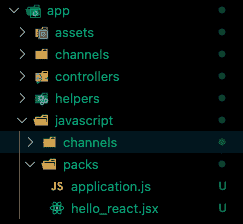
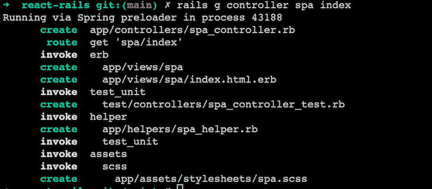

# 如何使用 React 与 Ruby on Rails 

> 原文：<https://blog.logrocket.com/how-to-use-react-ruby-on-rails/>

前端开发已经不是八年前的样子了，用户界面的新趋势使得用普通 JavaScript 构建变得乏味。幸运的是，像 React 和 Ruby on Rails 这样的 JavaScript 框架的出现使得构建高度交互的应用程序变得令人愉快。

在本文中，我们将探讨如何将流行的 JavaScript 库 React 与 Ruby on Rails 应用程序结合使用。

在 Rails 上使用 React 和 Ruby 有两种方式。第一种是构建两个独立的应用程序，React 应用程序位于不同的存储库，并通过 API 与后端通信。这可以通过使用 [Create React App](https://blog.logrocket.com/getting-started-with-create-react-app-d93147444a27/) 和 Rails CLI 分别创建两个应用程序来实现。

另一种方法是将两个应用程序放在一个存储库中，并排运行。

选择上述选项取决于您的架构偏好，但我们将着眼于第二种，因为它是最常见和最困难的方法。

## 先决条件

在开始之前，你需要在你的
机器上安装一些工具，以便跟随本教程:

*   [红宝石](https://blog.logrocket.com/why-you-should-switch-from-ruby-to-crystal/)
*   SQLite3，它预装在许多基于 UNIX 的机器上。运行`sqlite3 --version`进行确认
*   Node.js 和 Yarn (Rails 使用 Yarn 作为包管理器)
*   Rails，可以用`gem install rails`安装

您还应该掌握 React 和 Javascript 的工作知识。

## 用 React 创建新的 Rails 应用程序

如果您刚刚开始应用程序开发，可以使用以下命令同时设置 React 和 Rails:

```
rails new react-app --webpack=react

```

这告诉 Rails CLI 也要安装 React。

成功安装后，在编辑器中打开新项目。`packs`文件夹应该是这样的:



我们需要创建一个控制器，负责使用 React 为索引页面提供服务。为此，请运行以下命令:

```
rails g controller pages index

```

这会在`app/controllers`中创建一个带有`index`动作的`pages_controller.rb`文件。

接下来，我们需要将`/config/routes.rb`中的根设置为新生成的索引页面:

```
Rails.application.routes.draw do
  root 'pages#index'
end

```

使用下面的命令启动服务器，并导航到`[http://localhost:3000](http://localhost:3000)`。您应该会看到`index`页面的内容:

```
rails s #start the development server

```

此时，React 仍然没有在我们的应用程序中使用。我们现在需要做的是使用 JavaScript pack 标签链接到条目 React 文件(`hello_react`)。

清除`app/views/pages/index.html.erb`的内容，然后在`app/views/layouts/applcation.html.erb`中的结束`head`标签之前添加下面的代码片段:

```
<%= javascript_pack_tag 'hello_react' %>

```

这样，我们可以在前端使用 React 开始开发。

创建一个在`/app/javascript`中包含`components/Counter.jsx`的文件，然后将下面的代码片段粘贴到组件中:

```
import React, { useState} from 'react'
const Counter = () => {
  const [count, setCount] = useState(0);
  const increase = () => setCount(count+1);
  const decrease = () => setCount(count-1);
  return (
    <div>
      <button onClick={decrease}>-</button>
      <span>{count}</span>
      <button onClick={increase}>+</button>
    </div>
  )
}
export default Counter;

```

正如你所看到的，这个应用程序将是一个简单的计数器应用程序。

最后一步是用下面的内容替换`hello_react.jsx`的内容:

```
import React from 'react'
import ReactDOM from 'react-dom'

import Counter from '../components/Counter';

document.addEventListener('DOMContentLoaded', () => {
  ReactDOM.render(
    <Counter/>,
    document.body.appendChild(document.createElement('div')),
  )
})

```

瞧啊。现在，您已经准备好使用 React 创建令人惊叹的应用程序。

## 向现有的 Rails 应用程序添加 React

如果您已经有了一个 Rails 应用程序，安装 React 也很容易。

为此，运行以下命令，使用 webpacker 设置 React:

```
rails webpacker:install:react

```

现在 React 已经在应用程序中设置好了，可以开始开发了。如果你检查`app/javascript/packs`，你会看到一个`hello_react.jsx`文件，就像上面的例子一样。

因为您要将 React 添加到现有的应用程序中，所以您应该确定是要将现有的 Rails 前端完全迁移到 React，还是只想将 React 单独添加到特定的页面中。接下来，我们将讨论在每个场景中应该做什么。

## 迁移 Rails 前端以作出反应

使用这种方法，您希望创建一个新的控制器和布局，以便于迁移。

运行以下命令创建新的控制器和索引页面:

```
rails g controller spa index

```

这将在`views/spa/index.html.erb`中创建一个`spa_controller.rb`文件和一个`view`文件，如下图所示:



接下来，在`app/views/layouts`中创建一个`spa.html.erb`文件，并粘贴以下代码:

```
<!DOCTYPE html>
<html>
  <head>
    <title>ReactRails</title>
    <%= csrf_meta_tags %>
    <%= csp_meta_tag %>
    <%= stylesheet_link_tag 'application', media: 'all', 'data-turbolinks-track': 'reload' %>
    <%= javascript_pack_tag 'application', 'data-turbolinks-track': 'reload' %>
    <%= javascript_pack_tag 'hello_react' %>
  </head>
  <body>
    <%= yield %>
  </body>
</html>

```

这个文件将是新的 React 前端的基本布局。

接下来，用下面的代码更新新创建的`spa_controller.rb`文件:

```
class SpaController < ApplicationController
  layout 'spa'

  def index
  end
end

```

设置好布局后，我们需要在`config/routes.rb`中设置一个新的路线匹配器，以使用`spa`布局来渲染 React 前端。

替换以下行:

```
get 'spa/index'

```

使用以下代码:

```
get 'app', to: 'spa#index'
get 'app/*path', to: 'spa#index'

```

上面的新线路使用`spa`控制器为`/app`上的 React 前端的所有请求提供服务。该技术还在前端捕获所有注册的 React 路由，并将它们重定向回 React 进行处理。

现在一切都设置好了，使用`rails s`启动您的开发服务器，并尝试在浏览器中用`/app/*`打开任何 URL。

您可以通过创建您的组件来恢复 React 的开发，就像我们创建一个新的 Rails 应用程序的例子一样。

## 将 React 添加到特定的 Rails 页面

假设您已经有了一个成熟的应用程序，并且只想在特定页面上使用 React，您可以使用以下说明来实现这一点。

在`app/javascript/packs/`中创建新的`jsx`文件；我在这个例子中使用了`main_list.jsx`。

该文件的内容应该如下所示:

```
import React, { useState} from 'react'
import ReactDOM from 'react-dom'

const App = props => {
  const [tasks] = useState(['laundry', 'shopping']);
  return (
    <div>
      <h1>Tasks</h1>
      <ul>{tasks.map((task, index) => <li key={index}>{task}</li>)}</ul>
    </div>
  )
}

document.addEventListener('DOMContentLoaded', () => {
  ReactDOM.render(
    <App />,
    document.body.appendChild(document.createElement('div')),
  )
})

```

您也可以使用现有组件或创建新组件进行添加。

下一步是在您想要 React 的 Rails 视图文件中添加 pack 标记。例如，我正在使用一个`list.html.erb`文件:


我可以简单地添加 pack 标签并在`jsx`文件中继续开发:

```
# views/main/list.html.erb
<%= javascript_pack_tag 'main_list' %>

```

最后要注意的一点是，当你在 Rails 应用的前端使用 JavaScript 框架时，你不能再以传统的方式处理数据，即在`.erb`文件中进行查询。在这种情况下，React 前端必须通过一个 [JSON API](https://guides.rubyonrails.org/api_app.html) 与后端通信。

# 结论

在本文中，我们介绍了使用 React 和 Ruby on Rails 的最佳方式。

正如我在本文开头提到的，利用 React 等 JavaScript 框架的优势，您可以更快地构建强大的现代前端应用程序。

通过在 Ruby on Rails 应用程序中使用 React，您可以做的不仅仅是构建复杂的 ui；例如，将两者结合起来允许您为 React 组件编写单元测试。

## [LogRocket](https://lp.logrocket.com/blg/react-signup-general) :全面了解您的生产 React 应用

调试 React 应用程序可能很困难，尤其是当用户遇到难以重现的问题时。如果您对监视和跟踪 Redux 状态、自动显示 JavaScript 错误以及跟踪缓慢的网络请求和组件加载时间感兴趣，

[try LogRocket](https://lp.logrocket.com/blg/react-signup-general)

.

[ ](https://lp.logrocket.com/blg/react-signup-general) [](https://lp.logrocket.com/blg/react-signup-general) 

LogRocket 结合了会话回放、产品分析和错误跟踪，使软件团队能够创建理想的 web 和移动产品体验。这对你来说意味着什么？

LogRocket 不是猜测错误发生的原因，也不是要求用户提供截图和日志转储，而是让您回放问题，就像它们发生在您自己的浏览器中一样，以快速了解哪里出错了。

不再有嘈杂的警报。智能错误跟踪允许您对问题进行分类，然后从中学习。获得有影响的用户问题的通知，而不是误报。警报越少，有用的信号越多。

LogRocket Redux 中间件包为您的用户会话增加了一层额外的可见性。LogRocket 记录 Redux 存储中的所有操作和状态。

现代化您调试 React 应用的方式— [开始免费监控](https://lp.logrocket.com/blg/react-signup-general)。