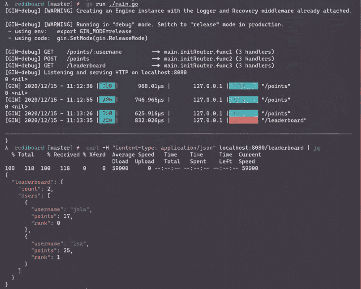

# 如何使用 Redis 作为 go-redis - LogRocket 博客的数据库

> 原文：<https://blog.logrocket.com/how-to-use-redis-as-a-database-with-go-redis/>

[Redis](http://redis.io) 是一个内存中的数据存储，用作数据库、缓存或消息代理。 [Go-redis/redis](https://github.com/go-redis/redis) 是一个类型安全的 redis 客户端库，支持像 [Pub/Sub](https://redis.io/topics/pubsub) 、 [sentinel](https://redis.io/topics/sentinel) 和[流水线](https://redis.io/topics/pipelining)这样的特性。

> 注意:我们将客户端库称为“go-redis ”,以帮助将其与 redis 本身区分开来。

在本文中，我们将探索 go-redis，并使用它的管道特性来构建一个排行榜 API。API 将使用 [Gin](https://github.com/gin-gonic/gin) 和 Redis’[排序集合](https://redis.io/commands/zadd)。它将公开以下端点:

*   `GET /points/:username` —获取用户的分数及其在总排行榜中的排名
*   `POST /points` —添加或更新用户及其分数。该端点还将返回用户的新排名
*   `GET /leaderboard` —返回当前排行榜，用户按排名升序排序

## 先决条件

要跟进这篇文章，你需要:

*   支持模块的 Go 安装
*   Redis 安装在您的本地计算机上(或者，如果您安装了 Docker，您可以使用 [Docker 映像](http://hub.docker.com/_/redis))
*   体验写围棋

## 入门指南

首先，在您的首选位置为项目创建一个文件夹，并初始化 Go 模块:

```
$ mkdir rediboard && cd rediboard
$ go mod init gitlab.com/idoko/rediboard
```

使用以下命令安装应用程序依赖项(gin-gonic/gin 和 go-redis/redis ):

```
$ go get github.com/gin-gonic/gin github.com/go-redis/redis
```

接下来，创建一个`main.go`文件作为项目的入口点。与此同时，我们还将在项目根目录下创建一个 db 文件夹来保存负责与 Redis 交互的代码:

```
$ touch main.go
$ mkdir db
```

## 熟悉 go-redis

有了我们的应用程序框架，让我们复习一些 go-redis 的基础知识。到 Redis 数据库的连接由“客户端”处理——一个可以由多个 [goroutines](https://tour.golang.org/concurrency/1) 共享的[线程安全](https://github.com/go-redis/redis/issues/166)值，通常存在于应用程序的整个生命周期中。下面的代码创建了一个新的客户端:

```
client := redis.NewClient(&redis.Options{
   Addr:     "localhost:6379", // host:port of the redis server
   Password: "", // no password set
   DB:       0,  // use default DB
})
```

Go-redis 通过`redis.Options`参数提供了许多配置选项。一些选项包括设置最大连接数的`PoolSize`和连接到受 [TLS 保护的](https://en.wikipedia.org/wiki/Transport_Layer_Security) Redis 服务器的`TLSConfig`。

然后，客户端将命令公开为[接收器方法](https://tour.golang.org/methods/4)。例如，代码显示了我们如何设置和获取 Redis 数据库中的值:

```
ctx := context.TODO()
client.Set(ctx, "language", "Go", 0)
language := client.Get(ctx, "language")
year := client.Get(ctx, "year")

fmt.Println(language.Val()) // "Go"
fmt.Println(year.Val()) // ""
```

该库需要一个[上下文](https://golang.org/pkg/context/#Context)参数，以允许像基于上下文取消正在运行的命令这样的事情。因为我们不需要它在这里提供的好处，所以我们用`context.TODO()`创建一个空的上下文。接下来，我们将语言设置为“Go ”,并且不给它设置截止日期(通过传入一个值 0)。我们继续获取语言和年份的值，但是因为我们没有为`year`设置值，所以它是`nil`，并且`year.Val()`返回一个空字符串。

## 用 Go 连接到 Redis

要为我们的应用程序创建 Redis 客户端，在我们之前创建的`db`文件夹中创建一个新的`db.go`文件，并将下面的代码片段添加到其中:

```
package db

import (
   "context"
   "errors"
   "github.com/go-redis/redis/v8"
)

type Database struct {
   Client *redis.Client
}

var (
   ErrNil = errors.New("no matching record found in redis database")
   Ctx    = context.TODO()
)

func NewDatabase(address string) (*Database, error) {
   client := redis.NewClient(&redis.Options{
      Addr: address,
      Password: "",
      DB: 0,
   })
   if err := client.Ping(Ctx).Err(); err != nil {
      return nil, err
   }
   return &Database{
      Client: client,
   }, nil
}
```

上面的代码创建了一个`Database`结构来包装 redis 客户端，并将其暴露给应用程序的其他部分(路由器等)。).它还设置了两个包级变量——`ErrNil`,用于告诉调用代码 Redis 操作返回了`nil`和`Ctx`,这是一个供客户端使用的空上下文。我们还创建了一个`NewDatabase`函数，使用 [PING](https://redis.io/commands/ping) 命令设置客户端并检查连接是否活跃。

打开`main.go`文件，调用`NewDatabase()`函数，如下面的代码所示:

```
package main

import (
   "github.com/gin-gonic/gin"
   "gitlab.com/idoko/rediboard/db"
   "log"
   "net/http"
)

var (
   ListenAddr = "localhost:8080"
   RedisAddr = "localhost:6379"
)
func main() {
   database, err := db.NewDatabase(RedisAddr)
   if err != nil {
      log.Fatalf("Failed to connect to redis: %s", err.Error())
   }

   router := initRouter(database)
   router.Run(ListenAddr)
}
```

上面的代码片段试图连接到数据库，并打印在此过程中遇到的任何错误。它也指一个`initRouter`函数。我们将在下一节中进行设置。

## 含杜松子酒的 API 路线

接下来，创建用于创建和注册应用程序路由的`initRouter`函数。将 main.go 中的代码添加到现有的`main`函数下:

```
func initRouter(database *db.Database) *gin.Engine {
   r := gin.Default()
   return r
}
```

目前，该函数返回一个`gin.Engine`的实例。稍后我们将添加特定于路由的处理程序。

## go-redis 中的交易管道

一个 [Redis 事务](https://redis.io/topics/transactions)对操作进行排队，并保证要么执行所有操作，要么不执行任何操作。Redis 的另一个有趣的特性是[管道化，](https://redis.io/topics/pipelining)一种网络优化，它允许 Redis 客户机向服务器发送多个请求，而无需等待回复并一次读取所有请求。

Go-redis 在 [TxPipeline](https://pkg.go.dev/github.com/go-redis/redis/v8#example-Client-TxPipeline) 方法中包装了事务和管道。下面是在 redis-cli 上执行的一组事务命令示例:

```
127.0.0.1:6379> MULTI
OK
127.0.0.1:6379> SET language "golang"
QUEUED
127.0.0.1:6379> SET year 2009
QUEUED
127.0.0.1:6379> EXEC
1) OK
2) OK
127.0.0.1:6379>
```

上面的命令可以翻译成下面的 Go 代码:

```
pipe := db.Client.TxPipeline()
pipe.Set(Ctx, "language", "golang")
pipe.Set(Ctx, "year", 2009)
results, err := pipe.Exec()
```

## 将用户保存到已排序的集合

在`db`文件夹中创建一个`user.go`文件，并将下面的代码添加到其中:

```
package db

import (
   "fmt"
   "github.com/go-redis/redis/v8"
)

type User struct {
   Username string `json:"username" binding:"required"`
   Points   int `json:"points" binding:"required"`
   Rank     int    `json:"rank"`
}

func (db *Database) SaveUser(user *User) error {
   member := &redis.Z{
      Score: float64(user.Points),
      Member: user.Username,
   }
   pipe := db.Client.TxPipeline()
   pipe.ZAdd(Ctx, "leaderboard", member)
   rank := pipe.ZRank(Ctx, leaderboardKey, user.Username)
   _, err := pipe.Exec(Ctx)
   if err != nil {
      return err
   }
   fmt.Println(rank.Val(), err)
   user.Rank = int(rank.Val())
   return nil
}
```

上面的代码创建了一个`User`结构来包装排行榜中的用户。该结构包括我们希望字段在转换成 JSON 时如何表示，以及在使用 Gin 的[绑定](https://github.com/gin-gonic/gin/blob/master/binding/binding.go)从 HTTP 请求转换过来时如何表示。然后，它利用管道将新成员添加到已排序的集合中，并获得该成员的新排名。因为`user`参数是一个指针，所以当我们从`SaveUser()`函数中改变`Rank`值时，它会被全面更新。

接下来，修改`main.go`以在收到对`/points`的 POST 请求时调用上面声明的`SaveUser`函数。打开`main.go`并将下面的路线处理器添加到`initRouter`功能中(就在`return r`线之前):

```
r.POST("/points", func (c *gin.Context) {
   var userJson db.User
   if err := c.ShouldBindJSON(&userJson); err != nil {
      c.JSON(http.StatusBadRequest, gin.H{"error": err.Error()})
      return
   }
   err := database.SaveUser(&userJson)
   if err != nil {
      c.JSON(http.StatusInternalServerError, gin.H{"error": err.Error()})
      return
   }
   c.JSON(http.StatusOK, gin.H{"user": userJson})
})
```

## 获取用户的分数和排名

类似地，将下面的代码添加到`user.go`中，以获取单个用户的排名及其分数:

```
func (db *Database) GetUser(username string) (*User, error) {
   pipe := db.Client.TxPipeline()
   score := pipe.ZScore(Ctx, leaderboardKey, username)
   rank := pipe.ZRank(Ctx, leaderboardKey, username)
   _, err := pipe.Exec(Ctx)
   if err != nil {
      return nil, err
   }
   if score == nil {
      return nil, ErrNil
   }
   return &User{
      Username: username,
      Points: int(score.Val()),
      Rank: int(rank.Val()),
   }, nil
}
```

这里，我们还利用管道来获取用户的分数和排名，以他们的用户名作为关键字。

如果没有找到匹配的记录，我们也向调用者发出信号(使用`ErrNil`)，以便由调用者单独处理这种情况(例如，他们可以选择显示 404 响应)。

接下来，在`main.go`中添加相应的路线处理程序，如下所示:

```
r.GET("/points/:username", func (c *gin.Context) {
   username := c.Param("username")
   user, err := database.GetUser(username)
   if err != nil {
      if err == db.ErrNil {
         c.JSON(http.StatusNotFound, gin.H{"error": "No record found for " + username})
         return
      }
      c.JSON(http.StatusInternalServerError, gin.H{"error": err.Error()})
      return
   }
   c.JSON(http.StatusOK, gin.H{"user": user})
})
```

上面的代码片段检索用户名路径参数，并将其传递给前面声明的`GetUser`函数。它还检查返回的错误类型为`ErrNil`的情况，并在这种情况下显示 404 响应。

## 使用`ZRangeWithScores`获取完整的排行榜

为了获得完整的排行榜，Redis 提供了 ZRange 命令，用于按照分数的升序检索排序集合的成员。ZRange 还接受一个可选的`WITHSCORES`参数，告诉它返回每个成员的分数。另一方面，Go-redis 将命令一分为二，分别提供 ZRange 和 ZRangeWithScores。

在`db`文件夹中创建一个名为`leaderboard.go`的新文件，内容如下:

```
package db

var leaderboardKey = "leaderboard"

type Leaderboard struct {
   Count int `json:"count"`
   Users []*User
}

func (db *Database) GetLeaderboard() (*Leaderboard, error) {
   scores := db.Client.ZRangeWithScores(Ctx, leaderboardKey, 0, -1)
   if scores == nil {
      return nil, ErrNil
   }
   count := len(scores.Val())
   users := make([]*User, count)
   for idx, member := range scores.Val() {
      users[idx] = &User{
         Username: member.Member.(string),
         Points: int(member.Score),
         Rank: idx,
      }
   }
   leaderboard := &Leaderboard{
      Count: count,
      Users: users,
   }
   return leaderboard, nil
}
```

`leaderboardKey`表示用于识别 Redis 数据库中集合的键。因为我们现在只运行一个命令(`ZRangeWithScores`)，所以不再需要用事务管道批处理命令，所以我们将结果直接存储在`scores`变量中。存储在`scores`中的值包含一个 Go maps 切片，其长度是存储在集合中的成员数。

要运行我们的应用程序，请确保您已经安装并运行了 Redis。或者，您可以获取 Redis Docker 映像，并使用下面的命令运行它:

```
$ docker run --name=rediboard -p 6379:6379 redis
```

现在，您可以使用下面的命令构建并运行(或直接运行)该`main.go`文件，以测试示例项目:

```
$ go build ./main.go
$ ./main
```

下面是一些示例 cURL 命令及其响应。

> 请随意使用 cURL、Postman、HTTPie 或您最喜欢的 API 客户端来尝试这个 API。

#### 卷曲命令:

```
$ curl -H "Content-type: application/json" -d '{"username": "isa", "points": 25}' localhost:8080/points
```

#### 回应:

```
{
  "user": {
    "username": "isa",
    "points": 25,
    "rank": 3
  }
}
```

#### 卷曲命令:

```
$ curl -H "Content-type: application/json" localhost:8080/points/mchl
```

#### 回应:

```
{
  "user": {
    "username": "jude",
    "points": 22,
    "rank": 0
  }
}
```

#### 卷曲命令:

```
$ curl -H "Content-type: application/json" localhost:8080/leaderboard
```

#### 回应:

```
{
  "leaderboard": {
    "count": 7,
    "Users": [
      {
        "username": "ene",
        "points": 22,
        "rank": 0
      },
      {
        "username": "ben",
        "points": 23,
        "rank": 2
      },
      {
        "username": "isa",
        "points": 25,
        "rank": 3
      },
      {
        "username": "jola",
        "points": 39,
        "rank": 5
      }
    ]
  }
}
```

下面是终端中运行的应用和 cURL 响应的截图:

## 结论

如果你想进一步探索，Redis 和 Go-redis 文档是你的起点。对于不支持的命令，go-redis 还提供了通用的`Send()`和`Do()`方法。

在本文中，我们讨论了如何使用 go-redis 库与 Redis 数据库进行交互。示例项目的代码可在 [GitLab](http://gitlab.com/idoko/rediboard) 上获得。

## 使用 [LogRocket](https://lp.logrocket.com/blg/signup) 消除传统错误报告的干扰

[](https://lp.logrocket.com/blg/signup)

[LogRocket](https://lp.logrocket.com/blg/signup) 是一个数字体验分析解决方案，它可以保护您免受数百个假阳性错误警报的影响，只针对几个真正重要的项目。LogRocket 会告诉您应用程序中实际影响用户的最具影响力的 bug 和 UX 问题。

然后，使用具有深层技术遥测的会话重放来确切地查看用户看到了什么以及是什么导致了问题，就像你在他们身后看一样。

LogRocket 自动聚合客户端错误、JS 异常、前端性能指标和用户交互。然后 LogRocket 使用机器学习来告诉你哪些问题正在影响大多数用户，并提供你需要修复它的上下文。

关注重要的 bug—[今天就试试 LogRocket】。](https://lp.logrocket.com/blg/signup-issue-free)