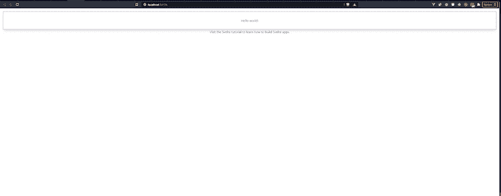
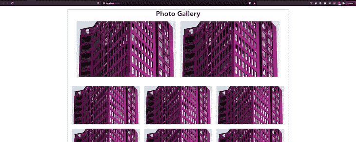
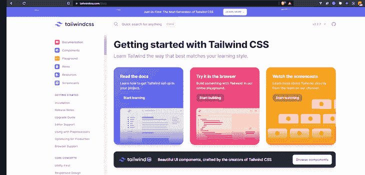

# 如何将 Tailwind CSS 用于 svelet-log rocket 博客

> 原文：<https://blog.logrocket.com/how-to-use-tailwind-css-with-svelte/>

Tailwind 是一个实用优先的 CSS 框架，这意味着，与 Bootstrap 或 Materialize CSS 等其他 CSS 框架不同，它没有现成的组件。相反，Tailwind CSS 为您提供了一组 CSS 助手类，允许您轻松快速地实现定制设计，因此您不必再使用通用的预构建组件。

有了 Tailwind，你可以用预定义的 CSS 类轻松实现你的定制设计。

在这篇文章中，我们将进一步了解如何在你的应用程序中设置和使用 Tailwind。我们将学习如何安装 Tailwind 库，初始化它，并使用它来设计我们的组件。

为了跟上进度，你应该有 JavaScript 和[svelet](https://blog.logrocket.com/whats-new-svelte-summer-2021/)的工作知识。

## 装置

要创建一个苗条的应用程序，首先要确保你的电脑上安装了 Node.js。您可以通过在终端中键入以下命令来进行检查:

```
node -v

```

如果还没有安装，只需到 Node 网站[下载最新版本](https://nodejs.org/en/download/)。

此外，您需要安装 degit 库，这样您就可以克隆苗条模板:

```
npm install -g degit

```

完成后，我们可以通过创建一个空文件夹并将模板克隆到我们名为`tailwind`的项目中来开始我们的苗条应用程序:

```
npx degit sveltejs/template tailwind      

```

然后，我们转到终端上的项目文件夹:

```
cd tailwind

```

现在我们已经设置好了，我们可以安装项目的依赖项了:

```
npm install

```

然后，我们用以下代码运行这个苗条的应用程序:

```
npm run dev

```

## 在一个苗条的应用程序中安装顺风

既然我们的苗条应用程序已经准备好了，我们必须使用下面的命令安装 [Tailwind](https://blog.logrocket.com/tailwind-css-vs-bootstrap-ui-kits/) :

```
npm install [email protected]:@tailwindcss/postcss7-compat [email protected]^7 [email protected]^9 concurrently cross-env --save-dev

```

对于大多数项目来说(为了利用 Tailwind 的定制特性)，您需要通过 npm 来安装 Tailwind 及其对等依赖项。`concurrently`允许我们运行多个命令，稍后我们将在 npm 脚本中使用这些命令。

因为我们没有使用 Tailwind CLI 将 Tailwind 集成到我们的项目中，并且 [Tailwind CSS 没有提供任何厂商前缀](https://tailwindcss.com/docs/browser-support#vendor-prefixes)，所以推荐使用 Autoprefixer。Autoprefixer 跟踪 caniuse.com 的[来查看哪些 CSS 属性需要加前缀，以确保跨浏览器的一致性。](https://caniuse.com/)

## PostCSS config

接下来，我们将在我们的基本目录中手动创建一个 PostCSS 配置文件(`postcss.config.js`)。

将下列代码行添加到文件中:

```
const tailwindcss = require('tailwindcss');
const autoprefixer = require("autoprefixer");
module.exports = {
  plugins: [ 
    require("tailwindcss"), 
    require("autoprefixer")
  ]
} 

```

PostCSS 是 lint 我们的 CSS 所必需的，因此有了这个配置。

## 顺风配置

像上一步一样，我们现在将在基本目录中手动创建一个顺风配置文件(`tailwind.config.js`)。

我们现在可以设置自己的配置选项。目前，下面的配置文件使用`purge`删除生产中所有未使用的 CSS:

```
const production = !process.env.ROLLUP_WATCH;
module.exports = {
  future: {
    purgeLayersByDefault: true,
    removeDeprecatedGapUtilities: true,
  },
  plugins: [
  ],
  purge: {
    content: [
     "./src/App.svelte",
    ],
    enabled: production // disable purge in dev
  },
};

```

## 创建 CSS 文件

现在让我们在`public`文件夹中创建实际的`tailwind.css`和`index.css`文件。

在`tailwind.css`文件中，我们将添加这些指令:

```
@tailwind base;
@tailwind components;
@tailwind utilities;

```

仍然在我们的`public`文件夹中，我们将导航到我们的`index.html`并在我们的`head`标签中导入`index.css`:

```
<link rel='stylesheet' href='/index.css'>

```

现在，进入我们的`package.json`并使用下面的`scripts`:

```
"scripts": {
    "watch:tailwind": "postcss public/tailwind.css -o public/index.css -w",
    "build:tailwind": "cross-env NODE_ENV=production postcss public/tailwind.css -o public/index.css",
    "build": "npm run build:tailwind && rollup -c",
    "start": "sirv public",
    "serve": "serve public -p 80",
    "dev": "concurrently \"rollup -c -w\" \"npm run watch:tailwind\""
  },

```

现在运行:

```
npm run dev

```

我们已经成功地将顺风整合到我们的苗条项目中！

我们可以通过将以下顺风类添加到我们的`App.svelte`文件中来确认这一点:

```
<main>
  <h1 class="py-8 px-4 border border-indigo-900 shadow-lg">Hello {name}!</h1>
  <p>Visit the <a href="https://svelte.dev/tutorial">Svelte tutorial</a> to learn how to build Svelte apps.</p>
</main>

```

您现在应该会看到:



## 建立一个照片画廊

现在，让我们使用新创建的 CSS 库来构建一个照片库。我们将清除`App.svelte`中现有的 HTML，并按照此指南创建一个如图所示的图库:



首先，我们将创建一个环绕的 div:

```
<div class="container mx-auto border border-indigo-500 px-4">

</div>

```

`container`类将我们的`div`的`max-width`设置为当前断点的`min-width`。如果您更喜欢为一组固定的屏幕尺寸进行设计，而不是试图适应完全流动的视口，这将非常有用。

当`mx-auto`使`div`居中时，`border`创建边框，`border-indigo-500`添加边框颜色和其他样式细节:

```
<div class="container mx-auto border border-indigo-500 px-4">
  <h1 class="font-bold text-5xl">Photo Gallery</h1> 
</div>

```

然后我们在一个`h1`标签中添加我们的“照片库”标题。`font-bold`帮助将`font-weight`增加到`700`，`text-5xl`将字体大小设置为`3rem`。

## 图像部分

上图中有两个`section`元素。第一个`section`包含两个图像，而第二个`section`包含六个图像(每行三个图像):

```
<main>
  <div class="container mx-auto border border-indigo-500 px-4">    
    <h1 class="font-bold text-5xl">Photo Gallery</h1> 

    <section class="py-8 px-4">
      <div class="flex flex-wrap mx-4">
        <div class="md:w-1/2 px-4 mb-8 md:mb-0"></div>
        <div class="md:w-1/2 px-4 mb-8 md:mb-0"></div>
      </div>
    </section>

    <section class="pt-8 px-4">
      <div class="flex flex-wrap mx-4">
        <div class="md:w-1/3 px-4 mb-8"></div>
        <div class="md:w-1/3 px-4 mb-8"></div>
        <div class="md:w-1/3 px-4 mb-8"></div>
        <div class="md:w-1/3 px-4 mb-8"></div>
        <div class="md:w-1/3 px-4 mb-8"></div>
        <div class="md:w-1/3 px-4 mb-8"></div>
      </div>
    </section>

  </div>
</main>

```

第一个`section`有向顶部和底部添加填充的类`py-8`，和向左右填充的类`px-4`。

然后，有一个内部的环绕的`div`包含顺风类`flex`、`flex-wrap`和`mx-4`。这些类将显示设置为`flex`，将`flex-wrap`设置为`wrap`，并在左右两侧添加一个`margin`。

对于图像本身，它们分别被一个带有顺风类别的`div`包围。这决定了每张图片的宽度，也就是父图片`div`的`1/2`。它还设置填充和边距的样式。

图像本身现在有了`rounded`类，它应用边框半径大小。`shadow-md`给元素添加方框阴影。

第二个`section`也是同样的风格。唯一的区别是每个图像周围的直接`div`有一个 Tailwind 类`md:w-1/3`，它确保每个图像的宽度是父`div`的`1/3`，使得每行有三个图像。

## 结论

如果你能走到这一步，恭喜你。你已经成功地学会了如何设置你的苗条项目，并用顺风添加美丽的风格。所有这些代码都在 GitHub 上。

如果你想更进一步，添加更多的 CSS 类，使照片库更漂亮。例如，您可以添加更多的页面、组件，甚至过渡。Tailwind 文档将显示您希望创建的任何样式的正确类别:



## 使用 [LogRocket](https://lp.logrocket.com/blg/signup) 消除传统错误报告的干扰

[](https://lp.logrocket.com/blg/signup)

[LogRocket](https://lp.logrocket.com/blg/signup) 是一个数字体验分析解决方案，它可以保护您免受数百个假阳性错误警报的影响，只针对几个真正重要的项目。LogRocket 会告诉您应用程序中实际影响用户的最具影响力的 bug 和 UX 问题。

然后，使用具有深层技术遥测的会话重放来确切地查看用户看到了什么以及是什么导致了问题，就像你在他们身后看一样。

LogRocket 自动聚合客户端错误、JS 异常、前端性能指标和用户交互。然后 LogRocket 使用机器学习来告诉你哪些问题正在影响大多数用户，并提供你需要修复它的上下文。

关注重要的 bug—[今天就试试 LogRocket】。](https://lp.logrocket.com/blg/signup-issue-free)