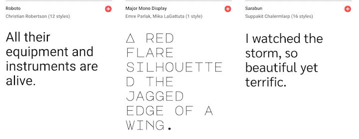
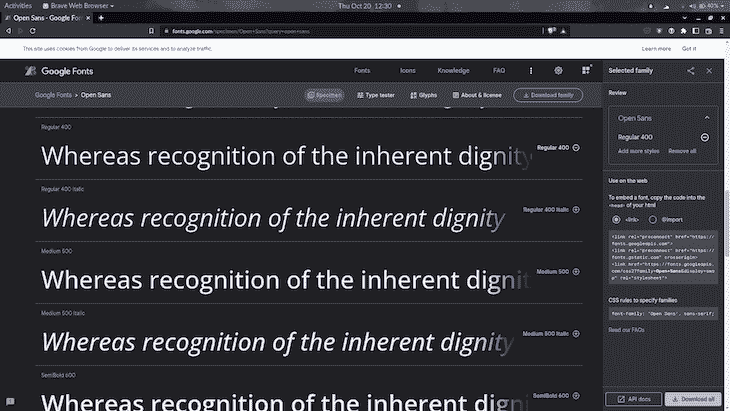
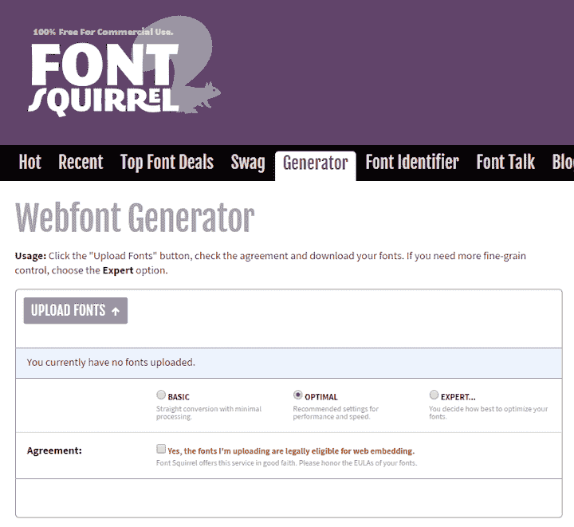

# 如何在 CSS - LogRocket 博客中使用 web 字体

> 原文：<https://blog.logrocket.com/how-to-use-web-fonts-css/>

***编者按**:CSS 教程中的这个 web 字体最后一次更新是在 2022 年 10 月 20 日。*

在早期，设计师仅限于流行的系统字体，如 Arial，Verdana 和 Times New Roman。这些字体保证可以在所有浏览器和平台上使用——它们就是所谓的[网络安全字体](https://developer.mozilla.org/en-US/docs/Learn/CSS/Styling_text/Fundamentals#web_safe_fonts)。只有使用图像替换或插件(如 Flash)时，才可能使用可靠的自定义字体。

这个自定义字体问题的解决方案是 web 字体。Web 字体使您能够使用 web 上可用的字体为 CSS 中的文本设置字体，这些字体是在访问您的网站时随网站一起下载的。1997 年发布的 Internet Explorer 4.0 引入了对 web 字体的基本支持。然而，通过`[@font-face](https://developer.mozilla.org/en/docs/Web/CSS/@font-face)`规则集实现对 web 字体的跨浏览器支持花了十多年的时间。

开源字体的广泛可用性鼓励人们使用各种各样的字体，以前人们不愿意使用带有限制性许可的商业字体。

在本教程中，我们将讨论为 CSS 网页添加自定义字体的各种技术和最佳实践。

向前跳:

## 你真的需要网络字体吗？

仅仅因为你可以在每一页上添加几十种字体，并不意味着你应该这样做。原因如下:

*   设计师建议节约使用字体，每个文档只使用一到两种字体
*   自定义字体通常需要几百 KB。添加的越多，页面权重越大，页面性能越差。这在移动设备和较慢的网络上尤其成问题
*   每个网站都使用标准操作系统字体的日子已经一去不复返了，比如 Helvetica 字体或泰晤士新罗马字体



## CSS 中可以使用哪些字体？

您可以通过`[font-family](https://developer.mozilla.org/en-US/docs/Web/CSS/font-family)` [属性](https://developer.mozilla.org/en-US/docs/Web/CSS/font-family)设置文本的字体——这允许您为浏览器指定一种字体(或字体列表)以应用于所选元素。浏览器将只应用在访问网站的机器上可用的字体；如果不可用，它将使用浏览器[默认字体](https://developer.mozilla.org/en-US/docs/Learn/CSS/Styling_text/Fundamentals#default_fonts)。这是最基本的例子:

```
body {
  font-family: Arial;
}

```

因为你不能保证你想在网页上使用的字体的可用性(甚至一个网页字体也可能失败)，你可以提供一个[字体堆栈](https://developer.mozilla.org/en-US/docs/Learn/CSS/Styling_text/Fundamentals#default_fonts:~:text=to%20be%20decorative.-,Font%20stacks,-Since%20you%20can%27t)，这样浏览器就有多种字体可供选择。你可以指定一个或多个字体系列作为逗号分隔的列表给`font-family`。当显示网页时，浏览器将沿着字体系列值的列表向下移动，直到它在运行它的系统上找到可用的字体。

CSS 为字体定义了五个通用名称:`serif`、`sans-serif`、`monospace`、`cursive`和`fantasy`。这些通用名称所使用的确切字体会因浏览器和操作系统的不同而有所不同。它代表了最坏的情况，浏览器尽力提供一种看起来适合该字体类别的字体。以下是字体堆栈的典型示例:

```
body {
  font-family: Arial, Helvetica, sans-serif;
}

```

如果 Web 应用程序使用标准的系统字体，它们可能会感觉更自然。例如，在 [GitHub](https://github.com/) 上实现的以下堆栈针对 MacOS、iOS、Windows、Linux 和 Android 平台上可用的系统字体:

```
body {
  font-family: -apple-system, BlinkMacSystemFont, "Segoe UI", Roboto, Helvetica, Arial, sans-serif, "Apple Color Emoji", "Segoe UI Emoji", "Segoe UI Symbol";
}

```

Medium 和 WordPress 管理面板使用相似的版本:

```
body {
  font-family: -apple-system,BlinkMacSystemFont,"Segoe UI",Roboto,Oxygen-Sans,Ubuntu,Cantarell,"Helvetica Neue",sans-serif;
}

```

您可以使用 Arial 之类的 web 安全字体，它可以提供显著的性能提升，因为它是保证在本地可用的少数字体之一。网页安全字体的列表会随着操作系统的发展而变化，但至少目前认为以下字体是网页安全字体是合理的:

*   Arial 字体(无衬线)
*   信使新闻(等宽)
*   格鲁吉亚语(衬线)
*   Times New Roman(衬线)
*   投石机 MS(无衬线)
*   Verdana(无衬线)

cssfontstack.com 网站维护了一个在 Windows 和 macOS 操作系统上可用的网页安全字体列表，这可以帮助你决定什么是安全的。

如果你想使用不同的字体，那么你需要使用网络字体。你可以从字体库中获得这些字体，比如谷歌字体，你也可以直接从字体铸造厂(字体设计工作室)购买，比如 T2 霍夫勒字体公司，或者找到一些开源字体项目，比如 T4 Fira 代码。

## 如何在 CSS 中使用 web 字体

使用`@font-face` [CSS](https://developer.mozilla.org/en-US/docs/Web/CSS) [at-rule](https://developer.mozilla.org/en-US/docs/Web/CSS/At-rule) ，可以为用户电脑上没有安装的网站指定字体。该字体可以位于远程服务器上，也可以安装在本地。

`@font-face`有许多[描述符](https://developer.mozilla.org/en-US/docs/Web/CSS/@font-face#descriptors)来识别和描述字体。您希望指定的最常见的描述符是:

*   `[font-family](https://developer.mozilla.org/en-US/docs/Web/CSS/@font-face/font-family)`:指定将用作`font`属性值的名称。
*   [`font-weight`](https://developer.mozilla.org/en-US/docs/Web/CSS/@font-face/font-weight) :指定字体的粗细(或粗细)。接受两个值来指定字体支持的范围，例如`font-weight: 100 400;`
*   [`font-style`](https://developer.mozilla.org/en-US/docs/Web/CSS/@font-face/font-style) :指定字体从 [`font-family`](https://developer.mozilla.org/en-US/docs/Web/CSS/font-family) 开始是正体、斜体还是斜体字
*   [`src`](https://developer.mozilla.org/en-US/docs/Web/CSS/@font-face/src) :指定包含字体数据的资源。这可以是远程字体文件位置的 URL，也可以是用户计算机上的字体名称

下面是一个使用拉托字体作为整个网站字体的基本示例(用于`body`):

```
@font-face {
  font-family: Lato;
  font-style: normal;
  font-weight: 400;
  src: url("https://mdn.github.io/web-fonts/LatoReg.ttf");
}

body {
  font-family: Lato, sans-serif;
}

```

该文件的源在远程服务器上。如果要告诉浏览器使用用户本地拷贝的“Lato”字体，可以使用`local()`函数。

`src`属性的工作方式类似于`font-family`属性，您可以提供一个逗号分隔的源列表，浏览器将遍历该列表，直到找到一个。例如，我们可以修改前面的示例，指示浏览器首先查找本地副本。

如果用户没有安装该字体，则使用名为`LatoRef.ttf`的可下载字体:

```
@font-face {
  font-family: Lato;
  font-style: normal;
  font-weight: 400;
  src: local("Lato"), url("https://mdn.github.io/web-fonts/LatoReg.ttf");
}

body {
  font-family: Lato, sans-serif;
}

```

## 如何在 CSS 中使用字体库中的 web 字体

如果一种系统字体让你的营销经理畏缩不前，有几个存储库提供了广泛的开源字体，这些字体由 CDN 提供。常见选项包括:

Google Fonts 可能是最受欢迎的字体库，因为所有的字体都是免费的，并且有开源许可。它提供了可搜索、可过滤的字体列表:


谷歌字体有一个 [CSS API](https://developers.google.com/fonts/docs/css2) ，可以让你直接从谷歌服务器上使用网络字体。让我们讨论一下如何从谷歌字体中添加一种字体到你的网站上。

### 示例:如何在 CSS 中添加开放的 Sans 字体

当你在谷歌字体上选择你想要的字体时，它会显示一个字体类型和字体粗细的列表。您可以选择您感兴趣的变体，它会将它们添加到购物车中。点击右上角的图标即可访问购物车:



在购物车里(上面截图的右边)，你有两个选择来嵌入你选择的字体到你的网页。您可以使用`link`元素将它添加到 HTML 中，或者您可以将`@import`语句添加到 CSS 中。选择该选项将显示您可以复制的代码片段。

要在页面中嵌入字体，在 HTML 头中使用标准的`<link>`标签。它看起来会像这样:

```
<link rel="preconnect" href="https://fonts.googleapis.com">
<link rel="preconnect" href="https://fonts.gstatic.com" crossorigin>
<link href="https://fonts.googleapis.com/css2?family=Open+Sans&display=swap" rel="stylesheet">

```

这包含一些额外的`link`元素，这些元素包含 [`preconnect`](https://developer.mozilla.org/en-US/docs/Web/HTML/Link_types/preconnect) [关键字为](https://developer.mozilla.org/en-US/docs/Web/HTML/Link_types/preconnect) [`rel`](https://developer.mozilla.org/en-US/docs/Web/HTML/Link_types/preconnect) [属性](https://developer.mozilla.org/en-US/docs/Web/HTML/Link_types/preconnect)。这些向浏览器提示用户需要来自目标资源源的资源，因此浏览器可以抢先启动到该源的连接。这可以加速字体文件的下载。

或者，您可以使用 CSS `@import`:

```
<style>
@import url('https://fonts.googleapis.com/css2?family=Open+Sans&display=swap');
</style>

```

这种方法的缺点是，在字体样式被解析之前，它会阻止进一步的样式表处理，但这是可以减轻的。

URL 中有一个`display`参数，用于设置字体的[字体显示](https://www.w3.org/TR/css-fonts-4/#font-display-desc)描述符。这使您可以控制字体不可用时发生的情况。值`swap`赋予字体极小的[块周期](https://www.w3.org/TR/css-fonts-4/#font-block-period)(大多数情况下建议 100 毫秒或更短)和无限的[交换周期](https://www.w3.org/TR/css-fonts-4/#font-swap-period)。指定一个不同于默认值`auto`的值通常是合适的，因为它不会阻塞处理。

然后可以通过`font-family`或`font`属性在 CSS 中使用该字体:

```
body {
  font-family: "Open Sans", sans-serif;
}

```

您可以通过修改 URL 来优化请求。例如，您可以使用`family`参数请求多个字体系列:

```
https://fonts.googleapis.com/css2?family=Crimson+Pro&family=Literata

```

您还可以使用特殊的符号请求其他单独的样式，例如特定的权重。例如，要为 Crimson Pro 字体请求权重 400 和 700，URL 如下所示:

```
https://fonts.googleapis.com/css2?family=Crimson+Pro:[email protected];700

```

您最有可能通过 web 应用程序生成这些 URL，所以我不会担心深入学习 API。可以参考[谷歌字体 API](https://developers.google.com/fonts/docs/css2) [v2 快速入门](https://developers.google.com/fonts/docs/css2) [指南](https://developers.google.com/fonts/docs/css2)了解更多信息。

## 如何在 CSS 中使用自己的 web 字体文件

任何字体文件都可以在您的网页中使用，但请确保您已经获得字体所有者的许可。所有现代浏览器都支持 [WOFF](https://developer.mozilla.org/en-US/docs/Web/Guide/WOFF) 和 [WOFF2](https://en.wikipedia.org/wiki/Web_Open_Font_Format) 格式。WOFF2 通常可节省 30%的压缩成本。对于较老或较模糊的应用程序，可以选择 TTF、EOT 或 SVG。

字体松鼠 web 字体生成器提供了一个简单的工具来上传一种或多种字体，调整设置，并下载包含转换后的字体和 CSS 代码的工具包:



默认情况下，Webfont Generator 提供 WOFF2 字体、WOFF 回退和适当的 CSS `@font-face`设置。例如:

```
@font-face {
  font-family: 'mytypeface';
  src: url('mytypeface-webfont.woff2') format('woff2'),
       url('mytypeface-webfont.woff') format('woff');
  font-weight: normal;
  font-style: normal;
}

body {
  font-family: mytypeface, serif;
}

```

## 疯了，疯了，疯了，疯了，疯了

下载 web 字体可能需要几秒钟，尤其是在较慢的设备或网络上。关于处理这个加载周期的策略是一个相当深入的话题。Zach Leatherman 写了一个广泛分享的字体加载策略的综合列表。我将在这里概述一下大致情况。

下载字体时，浏览器可以选择:

*   **显示无样式文本的闪烁(FOUT)** 。将立即使用第一个可用的备用字体，然后在加载后由 web 字体替换。IE、Edge 18 及以下版本，以及 Firefox 和 Opera 的旧版本都使用这一过程
*   **显示一闪而过的隐形文字(FOIT)。**在加载网络字体之前，不会显示任何文本。所有现代浏览器都使用这一过程，通常在返回到回退之前等待三秒钟
*   **显示一闪而过的仿文字(FOFT)** 。这里的想法是我们将字体加载分为三个阶段:
    *   步骤 1:当网页字体还没有加载时，使用备用字体
    *   第二步:首先加载字体的常规(也称为“book”或“roman”)变体。这将替换大部分文本。粗体和斜体将被浏览器伪造(因此“假文本”)。
    *   第三步:加载其余的字体

扎克在他的文章中推荐了两个策略:

1.  **FOUT 和等级**–这是大多数情况下的最佳方法。如果我们使用字体托管公司或自己托管字体，这是可行的。
2.  **关键的 FOFT**–最有效的方法。这只有在我们拥有自己的字体时才有效。

你可以阅读 Zell Liew 的文章，[最佳字体加载策略以及如何执行它们](https://css-tricks.com/the-best-font-loading-strategies-and-how-to-execute-them/) **，**来了解如何执行这些策略。

## 在 CSS 中处理字体粗细和样式

每个字体文件都有自己的粗细(粗细)、风格(斜体倾斜)、拉伸和变体。如果您在没有加载相关字体的情况下对 CSS 进行调整，浏览器将尝试自己的插值。渲染速度会变慢，字体看起来会更差，可读性会受到影响，宽度会有很大的不同，会破坏布局。例如:

```
/* load font with a weight of 300 */
@import url('https://fonts.googleapis.com/css?family=Open+Sans:300')
body {
  font-family: "Open Sans", serif;
}
/* but use a weight of 600 - do not do this! */
strong {
  font-weight: 600;
}

```

解决方案是为您需要的每种粗细和样式加载一个单独的字体文件，然后相应地显式设置所有样式:

```
/* load font with weights of 300 and 600 */
@import url('https://fonts.googleapis.com/css?family=Open+Sans:300,600');
/* weight 300 for all elements */
* {
  font-weight: 300;
}
body {
  font-family: "Open Sans", serif;
}
/* weight 600 for bold elements */
h1, h2, h3, strong {
  font-weight: 600;
}

```

## 可变字体

可变字体是 OpenType 字体规范的一种发展，它可以将一种字样的多种变体合并到一个文件中，而不是为每种宽度、粗细或样式创建一个单独的字体文件。现在，[浏览器对可变字体的支持几乎无处不在](https://caniuse.com/variable-fonts)。

可变字体格式的核心概念是描述字体设计特定方面的允许范围的变化轴的概念。所以“重量轴”描述了字体可以有多轻或多粗；“宽度轴”描述了它们可以有多窄或多宽；“斜体轴”描述斜体字体是否存在，可以打开或关闭等等:


轴可以是一个范围或二进制选择。权重的范围可能从 1 到 999，而斜体可能是 0 或 1(关闭或打开)。对于一个范围，可以使用这两个极端值之间的任何值，从而实现对文本外观的精细控制。

这里有一些你可以用 CSS 属性控制的轴。

### 重量

重量轴是字体的粗细。可以使用以下方法将其设置在 1 到 1000 之间:

```
font-weight: 400;

```

也可以使用`font-variation-settings: "wght" 400;`，但是浏览器不支持[。](https://caniuse.com/?search=%20font-variation-settings)

### 意大利语族的

斜体轴可以打开也可以关闭，因为标准字符和斜体字符可能不同:

```
font-style: italic;

```

也可以使用`font-variation-settings: 'ital' 1;`，但是浏览器不支持[。](https://caniuse.com/?search=%20font-variation-settings)

### 宽度

字体可以拉伸以产生压缩或扩展的变化。100%通常被认为是默认值，相应地，对于更窄或更宽的宽度，范围高于或低于该值:

```
font-stretch: 80%;

```

也可以使用`font-variation-settings: 'wdth' 80;`，但是浏览器不支持[。](https://caniuse.com/?search=%20font-variation-settings)

### 倾斜

斜体字与斜体的不同之处在于，其字体不变，但可以在 0 到 20 度之间的轴上变化:

```
font-style: oblique 10deg;

```

可以使用`font-variation-settings: 'slnt' 10;`，但是[不被浏览器](https://caniuse.com/?search=%20font-variation-settings)支持。

## 使用可变字体文件

现在大部分字体库都可以找到可变字体文件，比如 [Google Fonts](https://fonts.google.com/) 。有一些网站是专门针对可变字体的，比如 [v 字形](https://v-fonts.com/)和[轴实践](https://www.axis-praxis.org/specimens/)。

可变字体文件可使用带有`woff2-variations`格式和允许范围的`@font-face`加载。例如:

```
@font-face {
  font-family: 'MyVariableFont';
  src: 'myvariablefont.woff2' format('woff2-variations');
  font-weight: 200 800;
  font-stretch: 75% 125%;
  font-style: oblique 0deg 20deg;
}

```

然后，可以在任何具有多个 CSS 属性的选择器中设置特定的样式:

```
p {
  font-family: 'MyVariableFont';
  font-weight: 300;
  font-stretch: 100%;
  font-style: oblique 0deg;
}

```

您还可以使用简写的`[font-variation-settings](https://developer.mozilla.org/en-US/docs/Web/CSS/font-variation-settings)`属性(不太支持):

```
p {
  font-family: 'MyVariableFont';
  font-variation-settings: 'wght' 300, 'wdth' 100, 'slnt' 0;
}

```

因为现在对可变字体的支持如此之好，所以没有必要有一个后备。

## 结论

网络字体彻底改变了网络上的排版。设计人员现在对使用自定义字体的限制更少了，并且对文本的外观有了更高级的控制。

但是，关于使用 web 字体的性能和 UX，有一些重要的注意事项需要理解。下载字体时，您应该意识到未设置样式的文本的含义，并减轻它对布局和外观的影响。拥有如此多的字体选择和使用可变字体的能力为 web 开发人员提供了更多的选择，但是在期望的设计和期望的性能之间做出正确的权衡仍然是一个挑战。

## 你的前端是否占用了用户的 CPU？

随着 web 前端变得越来越复杂，资源贪婪的特性对浏览器的要求越来越高。如果您对监控和跟踪生产环境中所有用户的客户端 CPU 使用、内存使用等感兴趣，

[try LogRocket](https://lp.logrocket.com/blg/css-signup)

.

[](https://lp.logrocket.com/blg/css-signup)[https://logrocket.com/signup/](https://lp.logrocket.com/blg/css-signup)

LogRocket 就像是网络和移动应用的 DVR，记录你的网络应用或网站上发生的一切。您可以汇总和报告关键的前端性能指标，重放用户会话和应用程序状态，记录网络请求，并自动显示所有错误，而不是猜测问题发生的原因。

现代化您调试 web 和移动应用的方式— [开始免费监控](https://lp.logrocket.com/blg/css-signup)。