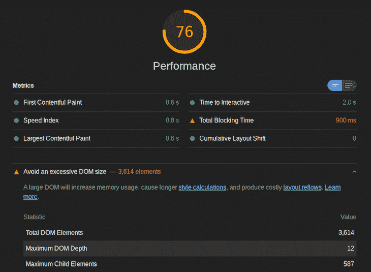

# 如何使用 react-window 虚拟化大型列表

> 原文：<https://blog.logrocket.com/how-to-virtualize-large-lists-using-react-window/>

在这个由 JavaScript 支持的 web 页面的现代领域，DOM 可能是一个昂贵的抽象。如果没有合适的工具来提高性能，React 应用程序中的一个单独的道具更改就会导致元素不必要的重新渲染。

但是，即使没有 JavaScript 的参与，拥有一个大的 DOM 树也会减慢你的页面速度，破坏你的核心网络活力，给你的网络请求、运行时间和内存性能带来负担。

## DOM 大小的标准



重要的是要记住，尽管浏览器可以处理更大的 DOM 树，但建议将 DOM 节点总数限制为 1500，DOM 深度限制为 32，单个父元素的 DOM 节点数限制为 60。

通过网络发送一个相当大的 HTML 文件，或者在运行时生成元素，直到超出性能预算，我们最终会得到一个过大的 DOM。

## 使用原样、无限滚动和分页作为虚拟化的替代方案

当显示一大组数据时，有许多方法可以实现可视化。呈现数据集最著名的方式是通过原样、分页或无限滚动。

我们可以这样设想这三个选项:


当我们的页面上有连续的内容时，比如多个段落，我们会使用“原样”策略来呈现内容。为了优化我们的页面性能，我们求助于 CSS `content-visibility`属性。详见[这篇博文](https://blog.logrocket.com/using-css-content-visibility-to-boost-your-rendering-performance/)。

然而，使用`content-visibility`只会有助于初始渲染。当我们向下滚动页面到浏览器跳过渲染的区域时，我们将再次看到一个缓慢移动的页面。

无限滚动也是如此。不同之处在于，我们只在需要时请求内容。但是，我们最终会遇到同样的性能问题。

另一方面，分页是最具性能的呈现方式。它在初始呈现时只显示必要的内容，根据需要请求内容，并且 DOM 不会因为不必要的内容而膨胀。

但是，分页是一种不适合在网页上显示每个大型数据集的模式。相反，我们可以使用虚拟化。

## 什么是虚拟化？

虚拟化是一个渲染概念，它专注于跟踪用户的位置，并且在任何给定的滚动位置只提交与 DOM 视觉相关的内容。本质上，它为我们提供了分页的所有好处以及无限滚动的 UX。


为了虚拟化列表，我们使用给定列表项的维度预先计算列表的总高度，并将其乘以列表项的计数。

然后，我们定位项目以创建一个用户可以滚动浏览的列表。正确定位我们的元素是虚拟化效率的关键，因为可以添加或删除单个项目，而不会影响其他项目或导致它们回流(即，重新计算元素在页面上的位置的过程)。

然而，还有另一种方法来呈现数据。

## 如何使用`react-window`虚拟化大型列表

为了实现虚拟化，我们将使用`[react-windo](https://github.com/bvaughn/react-window)`，它是对`react-virtualized`的重写。你可以在这里阅读两个图书馆[的比较](https://blog.logrocket.com/windowing-wars-react-virtualized-vs-react-window/)。

要安装`react-window`，请运行以下命令:

```
$ yarn add react-window # the library
$ yarn add -D @types/react-window # auto-completion

```

`react-window`将作为依赖项安装，而它的类型将作为`devDependency`安装，即使我们没有使用 TypeScript。我们还需要`[faker.js](https://github.com/marak/Faker.js/)`来生成我们的大型数据集。

```
$ yarn add faker

```

在我们的`App.js`中，我们将导入`faker`和`useState`，并用`faker`的`address.city`函数初始化我们的`data`状态。在我们的代码中，它将创建一个`length`为`10000`的数组。

```
import React, { useState } from "react";
import * as faker from "faker";

const App = () => {
  const [data, setData] = useState(() =>
    Array.from({ length: 10000 }, faker.address.city)
  );

  return (
    <main>
      <ul style={{ width: "400px", height: "700px", overflowY: "scroll" }}>
        {data.map((city, i) => (
          <li key={i + city}>{city}</li>
        ))}
      </ul>
    </main>
  );
};

```

接下来，我们使用函数[对我们的状态进行惰性初始化，以优化性能](https://blog.logrocket.com/a-guide-to-usestate-in-react-ecb9952e406c/)。然后，我们给列表一个宽度和高度，并将`overflowY`设置为`scroll`，使列表可以滚动。

为了比较虚拟化前后的性能，我们将添加一个`reverse`按钮来反转我们的`data`数组。

```
const App = () => {
  const [data, setData] = useState(() =>
    Array.from({ length: 10000 }, faker.address.city)
  );

  const reverse = () => {
    setData((data) => data.slice().reverse());
  };

  return (
    <main>
      <button onClick={reverse}>Reverse</button>
      <ul style={{ width: "400px", height: "700px", overflowY: "scroll" }}>
        {data.map((city, i) => (
          <li style={{ height: "20px" }} key={i + city}>{city}</li>
        ))}
      </ul>
    </main>
  );
};

```

参见 [CodePen](https://codepen.io) 上 Simohamed ( [@smhmd](https://codepen.io/smhmd) )
的 React 中的 Pen [)非虚拟化列表。](https://codepen.io/smhmd/pen/yLbaPvO)

现在，尝试反向按钮，并注意更新是如何潜伏。

为了虚拟化这个列表，我们将使用`react-window`的`FixedSizeList`。

```
import { FixedSizeList as List } from "react-window";

const App = () => {
  const [data, setData] = useState(() =>
    Array.from({ length: 10000 }, faker.address.city)
  );
  const reverse = () => {
    setData((data) => data.slice().reverse());
  };

  return (
    <main>
      <button onClick={reverse}>Reverse</button>
      <List
        innerElementType="ul"
        itemCount={data.length}
        itemSize={20}
        height={700}
        width={400}
      >
        {({ index, style }) => {
          return (
            <li style={style}>
              {data[index]}
            </li>
          );
        }}
      </List>
    </main>
  );
};

```

我们可以以多种方式使用`FixedSizeList`。在这个实例中，我们创建了一个与我们的`data`(通过`itemCount`)长度相同的虚拟数组，并用它来索引我们的`data`。

* * *

### 更多来自 LogRocket 的精彩文章:

* * *

的孩子展示了一个渲染道具，它有每个索引和必要的样式(绝对定位样式等)。)传进去的。

我们也可以显式地传递我们的数据，并通过`itemData`在渲染道具中接收它，就像这样:

```
<List
  itemData={data}
  innerElementType="ul"
  itemCount={data.length}
  itemSize={20}
  height={700}
  width={400}
>
  {({ data, index, style }) => {
    return <li style={style}>{data[index]}</li>;
  }}
</List>

```

注意，我们之前的内联样式现在被替换成了`width`和`height`道具。`overflowY`由`layout`道具控制，默认为`vertical`。

将`style` render prop 参数传递给最外层的元素(在我们的例子中是`li`)很重要。如果没有它，所有的元素将一个堆叠在另一个之上，没有任何东西可以滚动。

`FixedSizeList`元素呈现两个默认为`div` s 的包装器元素，可以使用`innerElementType`和`outerElementType`进行定制。

在我们的例子中，出于可访问性的原因，我们将`innerElementType`设置为`ul`。但是，只能使用预定义的道具。添加`role`或`data-*`等道具不会有任何效果。

默认情况下，`FixedSizeList`将使用数据索引作为反应键。但是因为我们正在修改我们的数据数组，所以我们必须为我们的键使用唯一的值。为此，`FixedSizeList`公开了`itemKey`属性，该属性接受一个应该返回字符串或数字的函数。我们将使用`faker`的`datatype.uuid`功能。

```
<List
  itemKey={faker.datatype.uuid}
  itemData={data}
  innerElementType="ul"
  itemCount={data.length}
  itemSize={20}
  height={700}
  width={400}
>
  {({ data, index, style }) => {
    return <li style={style}>{data[index]}</li>;
  }}
</List>

```

参见 [CodePen](https://codepen.io) 上 Simohamed ( [@smhmd](https://codepen.io/smhmd) )
的 React 中的 Pen [虚拟化列表。](https://codepen.io/smhmd/pen/QWvKPdG)

正如我提到的，我们可以使用 reverse 按钮即时比较虚拟化列表和非虚拟化列表。但是性能优化并没有就此结束。如果我们有一个昂贵的元素来呈现每个列表项，而不是单个的`li`，`react-window`允许我们在滚动时呈现一个简单的 UI。

为此，我们首先需要通过将`useIsScrolling`传递给我们的`FixedSizeList`来启用`isScrolling`布尔值。

```
<List
  useIsScrolling={true}
  itemCount={data.length}
  itemSize={20}
  height={700}
  width={400}
>
  {({ index, style, isScrolling }) =>
    isScrolling ? (
      <Skeleton style={style} />
    ) : (
      <ExpensiveItem index={index} style={style} />
    )
  }
</List>;

```

这可能是这样的:


在 [CodePen](https://codepen.io) 上看到 Simohamed ( [@smhmd](https://codepen.io/smhmd) )
的笔[React 窗口滚动](https://codepen.io/smhmd/pen/zYwoYrq)。

## 如何使用`react-window`虚拟化网格

现在我们知道了如何虚拟化列表，让我们学习虚拟化网格。这是一个类似的过程，但是不同之处在于，您必须在两个方向上添加数据的数量和维度:垂直方向(列)和水平方向(行)。

```
import { FixedSizeGrid as Grid } from "react-window";
import * as faker from "faker";

const COLUMNS = 18;
const ROWS = 30;

const data = Array.from({ length: ROWS }, () =>
  Array.from({ length: COLUMNS }, faker.internet.avatar)
);

function App() {
  return (
    <Grid
      columnCount={COLUMNS}
      rowCount={ROWS}
      columnWidth={50}
      rowHeight={50}
      height={500}
      width={600}
    >
      {({ rowIndex, columnIndex, style }) => {
        return ;
      }}
    </Grid>
  );
}

```

见 [CodePen](https://codepen.io) 上 Simohamed ( [@smhmd](https://codepen.io/smhmd) )
的笔 [反应窗口网格](https://codepen.io/smhmd/pen/MWmbPeX)。

很简单，对吧？

结论

## 在本文中，我们讨论了 DOM 的性能限制，以及如何使用多种呈现策略优化精益 DOM。我们还讨论了虚拟化如何通过使用`react-window`高效地显示大型数据集，以满足我们的性能目标。

[LogRocket](https://lp.logrocket.com/blg/react-signup-general) :全面了解您的生产 React 应用

## 调试 React 应用程序可能很困难，尤其是当用户遇到难以重现的问题时。如果您对监视和跟踪 Redux 状态、自动显示 JavaScript 错误以及跟踪缓慢的网络请求和组件加载时间感兴趣，

.

[try LogRocket](https://lp.logrocket.com/blg/react-signup-general)

LogRocket 结合了会话回放、产品分析和错误跟踪，使软件团队能够创建理想的 web 和移动产品体验。这对你来说意味着什么？

[ ](https://lp.logrocket.com/blg/react-signup-general) [](https://lp.logrocket.com/blg/react-signup-general) 

LogRocket 不是猜测错误发生的原因，也不是要求用户提供截图和日志转储，而是让您回放问题，就像它们发生在您自己的浏览器中一样，以快速了解哪里出错了。

不再有嘈杂的警报。智能错误跟踪允许您对问题进行分类，然后从中学习。获得有影响的用户问题的通知，而不是误报。警报越少，有用的信号越多。

LogRocket Redux 中间件包为您的用户会话增加了一层额外的可见性。LogRocket 记录 Redux 存储中的所有操作和状态。

现代化您调试 React 应用的方式— [开始免费监控](https://lp.logrocket.com/blg/react-signup-general)。

Modernize how you debug your React apps — [start monitoring for free](https://lp.logrocket.com/blg/react-signup-general).