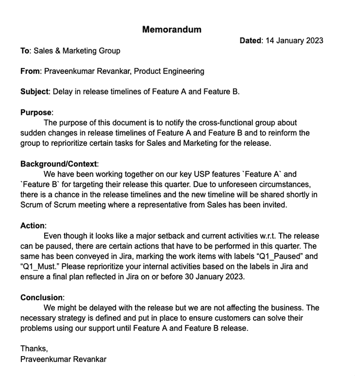

# 如何写一份有效的备忘录:举例说明

> 原文：<https://blog.logrocket.com/product-management/how-to-write-a-memo-format-examples/>

如果你必须向你的同事、老板或工作环境中的一群人传达一些信息，你会怎么做？想想吧！！很多方法，对吧？

也许你打电话给他们。你可以发一封信、一封电子邮件或一条短信。Skype 聊天、Slack 或 WhatsApp 怎么样？你甚至可以在他们的办公桌上放一张便条！

嗯，所有这些方式都属于两类沟通中的任何一类——正式的和非正式的。有时，非正式的交流被称为随意的交流。

我们只说形式类。一封电子邮件，一封信，或一封正式的邀请函，传达一条信息。有一种方法可以追溯到 19 世纪的商业时代——备忘录！

你听说过吗？肯定是这样或那样的。但这是什么呢？你什么时候使用一个？里面应该有什么？作为正式交流的有力工具，我们能有效地使用它吗？我们在这里深入学习一下吧…

* * *

## 目录

* * *

## 什么是备忘录？

备忘录是“备忘录”的简称在拉丁语中，备忘录的意思是“要记住的事情”

在商业中，你可能需要发送许多信息——给你的团队，[给利益相关者](https://blog.logrocket.com/product-management/what-stakeholder-management-tools-techniques/)，给客户团体，等等。—需要被记住的。你也可能从你的人力资源部门、财务团队、高管、董事会等那里获得重要信息。

这些消息也可能是紧急的。一天下来，它们只不过是备忘录。让我们来定义这是什么意思:

> 备忘录是一份简短的正式文件，通常与内部一组人共享，以传达信息，使该组立即注意到信息，并立即生效。

备忘录可以是你希望你的小组记住并采取行动的任何信息。可能是操作流程的更新、财务报销政策的更新、项目时间表的延迟、正在发生且不可预见的风险等。

你看，所有这些信息都需要被与你分享的观众记住，并需要相应地采取行动。在法律上，你会看到 MOUs 或 MOAs。它们实际上是外部文件，而在商业中，备忘录主要用于内部团体。

## 不同类型的备忘录

如果你在网上搜索或者与组织中的一些老领导交谈，你可能会看到或听到以下类型的备忘录:

*   会议纪要或总结备忘录
*   报告备忘录
*   事件或根本原因备忘录
*   询问或回复备忘录
*   指令或程序备忘录
*   进度或状态备忘录
*   警告或通知备忘录

它们不言自明。如果你试着给你的备忘录分类，你的清单上肯定会有以上这些(也许更多)。

> 写备忘录是一门艺术，而不是一种标准。

不需要遵循任何标准。相反，你应该知道什么时候写备忘录，备忘录里应该包括什么。让我们现在谈论那个。

## 何时写备忘录

你应该写一份备忘录

*   信息应该立即引起观众/团体的注意
*   需要根据信息采取行动

你可能会想，这难道不是我们发送和接收“供你参考”、“供你参考”或“供立即行动”的电子邮件的原因吗？对现代交流的一个简短想法是肯定的。但是，备忘录有更多的含义，因为它更正式。

上面提到的所有类型的备忘录都属于这里提到的一种或两种情况。

## 一份好的备忘录有什么？

既然我们知道了什么时候写备忘录，下一个非常重要的步骤就是学习如何写备忘录，以及备忘录中应该包含哪些内容才能称之为好的备忘录。你可能会想，应该有一些格式来写备忘录，是的，有一个。但这并不限制你遵循同样的。

让我们写一个示例备忘录，看看它看起来究竟如何，并为您提供一个流行格式的基础:

以上是我不久前写给我的销售团队的备忘录。我对它进行了编辑，删除了实际的功能名称，只称它们为功能 A 和 B，将实际日期更改为当前日期，并添加了粗体标记文本，以便您识别每个部分。我还添加了标题来向您展示更正式的信息，尽管这是我发送给销售部门的一封电子邮件。

你认为我写了一份好备忘录吗？🙂

嗯，没那么重要。重要的是它的不同部分。让我们一个一个来看:

当你在纸上或 PDF 文档中写一份硬拷贝时，你可能会看到它更明显。但是在电子邮件中，你可能不会注意到。

* * *

订阅我们的产品管理简讯
将此类文章发送到您的收件箱

* * *

标题是备忘录的第一部分。它有以下内容:

*   **日期**——除非另有说明，否则为发送日期或生效日期
*   **至** —收件人；通常是信息或行动适用的群体
*   **From** —通常是自己。发送备忘录的是个人、明确定义的团体或实体
*   **Subject** —讲述备忘录中大部分信息的一行。它实际上预览了备忘录的内容

### 目的/介绍

名字说明了一切。这是对我们将要在整个备忘录中涉及的内容的简要解释。这是备忘录最有力的部分。它给读者一个客观清晰的理解。一份好的备忘录可以确保这一部分包括:

*   写作的明确目的
*   写作的目标，也可以成为可操作的

### 背景/上下文

备忘录的这一部分取决于你所写的备忘录的类型。很多时候，你需要听众有一定的背景或语境才能理解备忘录。

也许在你向你自己的团队发送一个他们已经知道的行项目的信息时，你可以跳过它，这绝对没问题。但是一份好的备忘录总是在发布故事和行动之前给读者一个背景和背景。

### 实际消息

不管你怎么称呼它，它都是备忘录的主要部分——你向听众传达的实际信息。

在我上面的例子中，我把它放在背景段落中，这绝对没问题。目的是确保将意图传达给观众。

### 行动

观众可以采取或不采取任何行动。但是如果有，你应该在你的备忘录中把它作为一个单独的部分(段落)来传达。

### 总结/结论

总是结束你的文章。写结论的两个主要原因是:

*   **总结** —这确保了信息被重复并被很好地记住。这也是为了让读者从这份备忘录中知道需要采取或记住的重要步骤
*   **放松**——这可以确保信息以正确的方式被理解，并且不会留下恐慌或担心

在上面的例子中，我写了“封面”风格的结论而不是摘要。这是因为我分享的消息不是积极的，我需要减少恐慌。总结什么取决于你，但是一份好的备忘录总是以给听众的正确信息结尾。

## 写好备忘录的小贴士

你可以使用你所有的创意，你在网上或从微软 Office 找到的模板，然后想“我已经用最好的方式写好了”当然，这可能是最适合你的。但是，对观众来说可能不是最好的。可能他们没有好好接受，有疑问。你认为最好的备忘录是什么？简单来说，什么是好的备忘录？

你可以在网上找到很多保持简洁的技巧，只写要点，不要使用情绪化的词语等等。

我不觉得这些不好，但这些都是主观的，有语境的。知道这些建议很好，但最好根据你的背景来决定。

来学习一下我一直遵循的。我个人关于写好备忘录的建议是:

*   千万不要忘记在开头写上目的。目的总是给读者一个清晰的目标，告诉他们你写这份备忘录的意图
*   永远不要详述你的主题。我见过冗长的主题行说明了一切。有些人觉得这很容易，读者可能觉得他们甚至不需要打开信件/电子邮件。那很糟糕。确保你的主题行在一行中总结了备忘录。它应该鼓励读者打开你的信/邮件阅读，而不是认为他们已经知道邮件的内容，可以跳过它
*   你可以根据上下文跳过某些部分，但永远不要排除备忘录的结论。这是一个重要的部分，读者需要知道它对他们意味着什么
*   永远不要忘记你写备忘录的情况。你正在处理的情况对你如何引导你的话语有很大的重要性。这很重要，你是在向一群人讲话，他们必须带着正确的意图接受
*   永远不要写一个长达数页的故事。在我的整个职业生涯中，我没有必要写超过一页的东西。你的备忘录应该简短，只传达实际的信息和行动

此外，还有一些常见的、必须遵循的提示。您应该确保:

*   你面对的是正确的人群(观众)
*   你写的日期是正确的。此外，请明确说明该日期是否从(插入日期)开始生效
*   你有一个主题。有些人真的很怀念这部分
*   在阅读完你的信息后，你理解了这些异议，并在备忘录中提前提出
*   你已经正确干净地格式化了备忘录

## 你能在备忘录里写任何东西吗？

有一次，我另一个团队的同事给我的团队成员写了一份感谢备忘录。我从没想过 MOA 也能忍受这个🙂

没有要采取的行动，也没有需要立即关注的信息。

感谢信可以是电子邮件或信件，但不能是备忘录。同样，当人们向一群人传达一条信息时，他们常常会搞不清自己。即使你是写给一群人，也不是所有的东西都能放进备忘录里。

感谢、请求、号召、假期计划等。不要成为备忘录。你必须明白，备忘录是为了让听众在上述背景下记住，并据此采取行动。只有当你有那种信息要发布时，才使用备忘录作为工具。

## 产品经理什么时候需要备忘录？

如果你是一个产品经理，并且在想“为什么产品经理需要写备忘录？”我有，而且多年来一直用备忘录来交流。

同样，产品经理在很多情况下会向利益相关者、管理组、执行组、客户组等传达状态、进度、[和风险。而这些都有需要沟通的行动。](https://blog.logrocket.com/product-management/effectively-manage-product-risks-product-manager/)

一份格式良好的备忘录有助于项目经理正确传达意图，并向他们的听众提供一套正确的行动。当产品经理学会有效地写备忘录并知道何时正确使用它们时，备忘录就成了他们强有力的工具。

## 结论

让我们结束吧。你读到现在还说你已经理解了备忘录的艺术！备忘录是帮助你写下需要立即关注的关键信息的文件。

如果你知道如何以及何时使用它，它将是一个强大的工具。你不局限于以特定的格式写作，而是一份好的备忘录，它能清楚地给出你想要传达的信息，并达到你的目标。它应该有标题、目的、背景、实际信息、行动和结论。请记住:

> 写备忘录是一门艺术，而不是一种标准。

因此，写下你的情况来传达你的信息，而不是跟随或复制一个模板。

暂时停止…谢谢！

*精选图片来源:[icon scout](https://iconscout.com/icon/file-3250251)*

## [LogRocket](https://lp.logrocket.com/blg/pm-signup) 产生产品见解，从而导致有意义的行动

[LogRocket](https://lp.logrocket.com/blg/pm-signup) 确定用户体验中的摩擦点，以便您能够做出明智的产品和设计变更决策，从而实现您的目标。

使用 LogRocket，您可以[了解影响您产品的问题的范围](https://logrocket.com/for/analytics-for-web-applications)，并优先考虑需要做出的更改。LogRocket 简化了工作流程，允许工程和设计团队使用与您相同的[数据进行工作](https://logrocket.com/for/web-analytics-solutions)，消除了对需要做什么的困惑。

让你的团队步调一致——今天就试试 [LogRocket](https://lp.logrocket.com/blg/pm-signup) 。

[Praveenkumar Revankar Follow](https://blog.logrocket.com/author/praveenkumarrevankar/) With a decade and half into Product Engineering building and scaling value driven products, I help organizations to build Product Engineering groups and drive value creation via enforcing best practices, defining standard processes and aligning people towards the organization’s vision. I also in spare time write my experience in Product Management, Engineering and Technology.