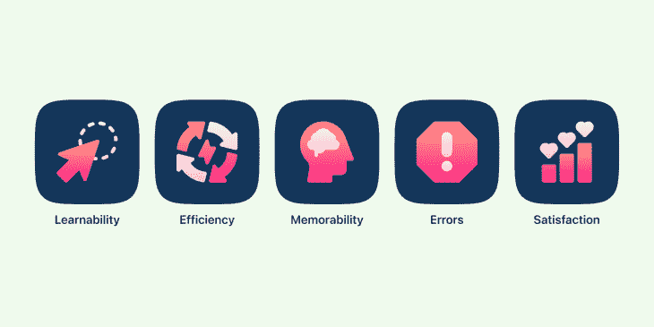
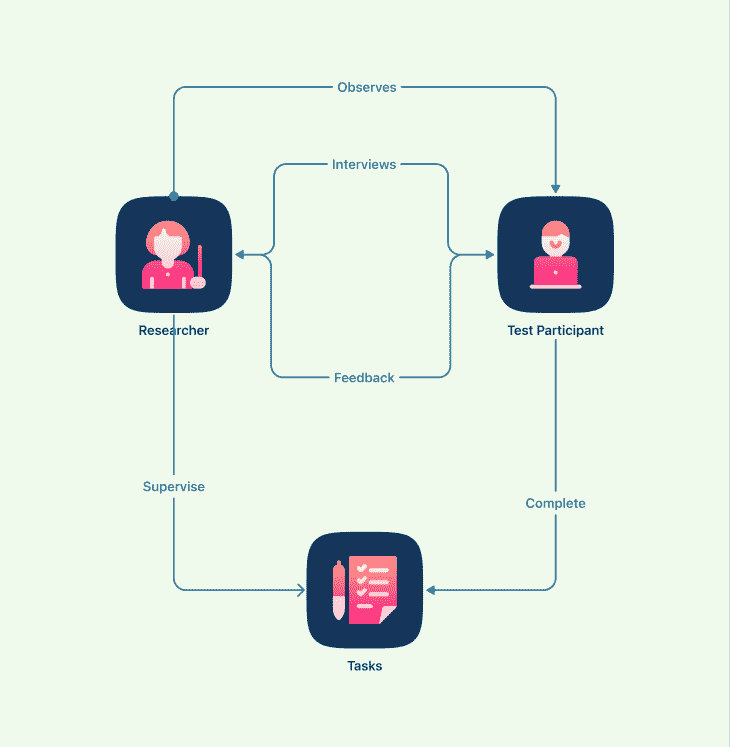
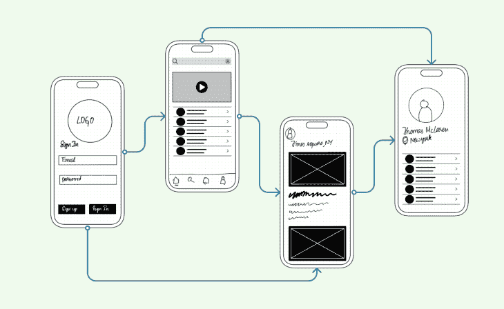
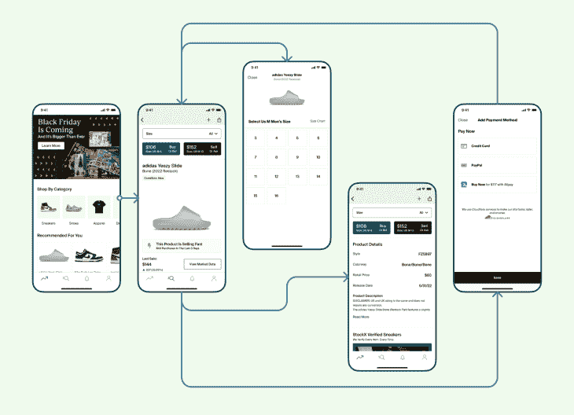

# 可用性测试如何通知 UX 团队

> 原文：<https://blog.logrocket.com/ux-design/how-usability-testing-can-inform-ux-teams/>

您的组织在设计上投入了大量资金，团队设计了一个解决方案。现在是测试解决方案的时候了，以确定设计团队的假设是否正确。

有几种框架用于测试，可用性测试(或用户测试)是最广泛使用的一种。

在深入研究可用性测试之前，理解可用性和工作原理是非常重要的。让我们进一步了解这一测试流程，以及如何最有效地应用它来获得深刻的见解:

## 什么是可用性？

可用性描述了产品或用户界面使用的容易程度。UX 设计领域的先驱尼尔森诺曼集团设计了五个评估产品可用性的标准。

1.  **可学性**:用户在完成基本任务时学习和理解界面所需的初始努力量被称为可学性
2.  效率:既然用户已经了解了产品的工作原理和使用方法，效率就是他们完成任务的速度
3.  可记忆性:经过长时间的休息后，用户能回忆起多少关于产品或界面的事情？
4.  **错误**:接口是否容易出错，如果是，出错的频率和严重程度如何，是否有方法从错误中恢复？
5.  **满意度**:指使用产品的整体体验

## 为什么可用性很重要？

全球产品市场竞争异常激烈。如果你的产品难以使用；如果用户难以找到相关信息；如果你的产品不能帮助用户完成任务；如果你的产品审美或者界面很差；或者，如果用户在使用你的产品时迷失了方向，市场上总会有另一种产品可供用户选择。

如果你正在为你的组织内部开发产品，记住员工的生产力是很重要的。员工在没有完成任何工作的情况下浪费的时间就是混日子。

构建解决方案的同时将用户放在心上是保持甚至领先的众多策略之一。

## 关于可用性测试

测试一个产品的可用性是一种评估使用该产品简单或容易程度的方法。首先，测试是通过分析目标受众的参与者如何执行给定的任务来进行的。

在进行可用性测试时，研究人员观察、分析和倾听参与者如何使用产品。来自用户的反馈使设计团队能够对用户体验做出重大改进。

在下图中，您可以看到研究人员和测试参与者是如何执行任务的:

可用性测试可以在设计过程的不同阶段进行。

测试可以在你的产品还是一个想法的时候进行，研究人员使用低保真度的交互原型进行测试。这被称为概念测试。

下图显示了设计师用低保真度线框制作原型来测试创意的可用性:

你也可以用一个高度交互的原型来进行可用性测试。这通常被称为高保真线框，与低保真度线框相比更加详细。

高保真线框可能看起来更像这样:

这是最常见的可用性测试类型，因为它让设计团队对产品发布前需要修改或添加的内容有了更有意义的了解。

## 可用性测试的类型

可用性测试可以大致分为三类:适度的和非适度的；远程和亲自；探索和比较测试。

### 适度和非适度测试

有主持的可用性测试是在主持人的帮助下进行的，主持人指导用户完成任务。

适度的可用性测试通常比非适度的测试更加昂贵和耗时。然而，它提供了更多的见解，因为版主可以提出试探性的问题来理解用户的思维过程。

另一方面，无节制的可用性测试不需要主持人在场。通常会给用户一组要完成的任务，并要求用户在最后提供反馈。

不受控制的可用性测试比受控制的可用性测试更便宜和耗时，但它可能不会提供太多的洞察力，因为用户没有受控制者的指导。

### 远程和现场测试

远程可用性测试可以在工具的帮助下进行，这些工具允许用户从他们自己的位置测试产品。这种类型的测试很方便，因为它不需要用户前往特定的位置。然而，在远程环境中可能很难复制真实世界的条件。

现场可用性测试要求用户到一个特定的地点来测试产品。这种类型的测试允许对测试条件进行更好的控制，但是对于必须旅行才能参与的用户来说可能不方便。

### 探索和比较测试

我们可以使用探索性测试来深入了解用户如何与产品交互。这种类型的测试通常在设计阶段的产品开发的初始阶段使用，此时设计师正在寻找关于如何改进产品的想法和反馈。

另一类是比较型。比较可用性测试用于比较两个或更多产品的可用性。当公司正在开发现有产品的新版本时，或者当他们正在考虑完全转向新产品时，通常会使用这种类型的测试。

## 规划可用性测试

一旦你准备好了一个原型，就该测试它了。由于可用性测试没有放之四海而皆准的方法或模板，所以我建议你在准备时制定一个计划。

在计划可用性测试时，有一些事情要记住:

*   目标用户:谁会使用它？考虑谁将使用产品或系统是很重要的，因为这将告知你需要进行什么样的可用性测试
*   您希望用户完成哪些任务？可用性测试应该关注用户在使用产品时需要完成的特定任务。这可能包括从注册账户到购物的任何事情
*   您希望收集哪种反馈？在可用性测试过程中，可以收集许多不同类型的反馈，比如口头评论、书面回复，甚至视频记录。考虑什么对你的目的最有帮助
*   需要测试多少用户？您需要测试的用户数量将取决于各种因素，例如您的用户基数的大小和被测试任务的复杂性。一般来说，我建议至少有 5-10 个用户进行测试

## 选择您的测试环境

进行可用性测试有两种主要方式:远程或现场。

每种方法都有其优点和缺点。与现场测试相比，远程可用性测试可以更快更便宜地进行，因为不需要旅行或提供测试的物理空间。然而，在远程进行测试时，很难与测试参与者建立良好的关系，并且可能存在影响所收集数据质量的技术问题。

现场可用性测试需要更多的时间和精力来建立，但可以提供一个更真实的测试环境。这是因为用户在他们的自然环境中接受测试，被同事、电话和电子邮件等干扰所包围。现场测试还允许与参与者进行更多的非正式对话，这可以为他们的思维过程提供有价值的见解。

最终，是进行远程还是现场可用性测试的决定取决于项目的需求。如果时间和预算有限，那么远程测试可能是最好的选择。然而，如果真实性是优先考虑的，那么现场测试是值得额外努力的。

## 招募参与者

进行可用性测试时，一定要从目标受众中招募参与者。这将确保可用性测试的结果能够代表产品的目标用户群。

从目标受众中招募参与者有几种不同的方式。一种方法是联系代表目标受众的个人或团体，询问他们是否有兴趣参与可用性测试。另一种方法是在目标受众经常光顾的社交媒体或在线论坛上发布消息，询问是否有人有兴趣参与研究。

此外，考虑要招募多少参与者。正如我们之前提到的，在可用性测试中，你应该至少有五个参与者。这将允许收集和分析足够的数据，同时仍然保持研究的可管理性。

如果你很难从目标受众中招募参与者，你可以做一些事情来增加你成功的机会。首先，为参与研究提供奖励，如礼品卡或免费产品。第二，确保你提前解释了这项研究需要什么以及需要投入多少时间。最后，尝试接触多个团体或个人，而不是一两个；外联越多，回应的可能性就越大。

## 测试概念和脚本

来自非结构化用户测试的结果是有价值的，但这不是从用户那里学习的唯一方式。测试需要一个特定的过程来产生有意义的结果。因此，重要的是要考虑:

1.  测试情境是自然产生的
2.  参与者的行为与他们不参与研究时的正常行为一样
3.  结果是真实世界用例的指示
4.  您正在观察用户会做的第一件事

成为一名优秀的研究人员意味着通过具体的任务来指导测试对象。每当有人向你提出与任务目标相矛盾的东西时，抛弃它，回到目标上去。通过这样做，你将有希望在可用性问题困扰你的访问者之前发现它们。

主持人的武器库中最重要的工具是测试脚本。该脚本包括:

1.  通过测试此功能/组件/系统，您想了解什么？
2.  你对此有什么想法？
3.  目标受众和参与者人数
4.  测试时间(通常需要 15 到 30 分钟)
5.  用户的任务列表(例如，对您最近的订单提出退货请求或对您最近的订单留下评论)
6.  你会问参与者什么问题？
    1.  例 1:我们注意到你要求换货，而不是提出退货要求。你能告诉我们为什么吗？
    2.  例 2:你有没有注意到还有另外一种方式来提出退货要求？
    3.  例 3:你觉得最近的订单退货的体验怎么样？

重要的是从最简单的任务开始，逐渐进入更复杂的任务，因为这给了受试者适应环境的时间。从复杂的任务开始会让受试者不知所措，这可能会导致他们责备自己，并对自己完成剩余任务的能力失去信心。

## 在可用性测试期间

作为一名可用性测试人员，在进行测试时记住几件事是很重要的。首先，你必须是一个积极的倾听者。这意味着不仅要注意用户在说什么，还要注意他们是如何说的。他们犹豫了吗？迷茫？激动吗？您的观察可以为用户体验提供有价值的见解。

除了倾听，你还应该在整个测试过程中观察用户。他们在做什么？他们似乎在纠结什么？他们觉得什么容易或有趣？同样，您的见解有助于改善用户体验。

最后，不要忘记可用性测试只是设计和开发产品的大过程中的一个工具。其他来源(如市场研究或焦点小组)的见解也有助于最终产品的形成。

## 评估测试结果

评估测试结果的整个过程可以归结为将定性和定量的数据观察转化为可用性问题的可操作点。

在你开始评估结果之前，回顾一下你最初测试的所有目标。这将有助于你获得洞察力，并专注于你寻求的相关结果。

接下来，通过回顾测试会话来组织您的测试数据。在这方面，你应该寻找遇到的问题，测试对象采取的行动，应付时间，以及测试期间的评论。根据类别、任务、他们面临的问题以及受试者的情绪记录数据(如有必要)。

评估定性和定量数据的结果。定性数据为您提供对问题的洞察。例如，找不到客户代表电话号码的受试者人数或面临结账问题的受试者人数。

定量数据为您提供了有助于确定问题严重性的数字。比如成功率、错误率、完成所用时间等等。可用性研究中的大多数测试结果都是定性的，但是定量数据为你的研究提供了重要的可信度，以供将来修改。

最后，根据反馈和发现的影响对其进行优先排序。例如，危急、严重、温和或 P1、P2、P3 等等。

## 记录见解和测试结果

进行可用性测试后，记录结果以改进产品设计。一份理想的可用性测试报告记录了以下几个部分:

1.  **背景**:在这一部分，你必须包括研究背景、测试原因、测试对象的描述、产品以及进行测试的有价值的背景信息
2.  **测试目标**:列出你想要了解的目标、难点和边缘案例
3.  **测试环境和方法**:这里的目标是详细概述用于测试的方法(A/B 测试、多元测试、眼球追踪、热图等)。这一部分对读者理解测试非常重要，所以要尽可能清晰。一定要包括你如何接触用户，人口统计，使用的技术和设备，参与者的数量，筛选过程，以及你如何分析数据
4.  **结果**:报告中呈现的结果必须激发利益相关者眼中的变化。理想的报告结果必须是:按优先级从高到低列出问题和痛点，包括截图、照片和视频剪辑链接
5.  **问题**:包括测试过程中可能发生的影响测试的任何产品问题。这可以看作是对产品和测试过程中可能出现的技术问题的真实测试
6.  **行动项目**:参照结果列出所有行动项目。描述每个行动项目，并给出你做出决定的理由。并非列出的每个行动项目都会实施，因此首先按最高优先级列出行动项目，即最有可能实施的行动项目
7.  **附加信息**:在这一部分，您可以包括不适合报告中任何先前部分的任何信息。你也可以写下你在研究过程中发现的与测试无关的见解

## 可用性测试的局限性

可用性测试是获得产品用户体验反馈的一个很好的方法，但是要记住有一些限制。

首先，可用性测试可能很耗时。您需要为参与者安排时间，设置测试环境，然后在测试完成后听取汇报。根据测试的范围，这可能需要几个小时到几天的时间。

其次，可用性测试可能很昂贵。你需要支付参与者的时间，以及测试本身所需的任何设备或软件。

第三，可用性测试只提供有限的反馈。你会对用户如何与你的产品互动有所了解，但你不会对他们的体验有一个完整的了解。例如，你将无法看到用户随着时间的推移对你的产品变化的反应，或者他们如何在不同的环境中使用它。

可用性测试也会有偏差。同意参与可用性测试的人可能并不代表你的目标受众。此外，您设计测试本身的方式可能会引入偏差。例如，如果你在测试过程中给参与者分配特定的任务，你可能会无意中影响他们的行为。

最后，可用性测试只能在一个时间点上提供对用户体验的洞察。你的产品会继续发展，用户的需求和期望也会随之改变。可用性测试可以帮助你评估当前的状态。

## 可用性测试的替代方法

当你不能运行可用性测试时，仍然有很多方法可以收集用户如何与你的产品交互的数据。

启发式评估是一种评估产品的方法，它通过观察和对照一套启发式规则或指导方针对产品进行评论。调查是从用户那里收集数据的另一种方式，可用于询问关于满意度的一般问题或关于特定功能的特定问题。击键级建模是一种更具技术性的观察用户行为的方法，可用于跟踪用户如何浏览网站或应用程序以及他们采取了什么行动。

## 结束语

可用性测试是产品开发过程的一个重要部分，因为它可以帮助改善最终产品的用户体验。通过对真实用户的测试，你可以确定产品在可用性和功能性方面可以改进的地方。为了创造一个成功的产品或服务，这种反馈是至关重要的。

*精选图片来源:* [IconScout](https://iconscout.com/icon/global-team-1543500)

## [LogRocket](https://lp.logrocket.com/blg/signup) :无需采访即可获得 UX 洞察的分析

[LogRocket](https://lp.logrocket.com/blg/signup) 让您可以回放用户的产品体验，以可视化竞争，了解影响采用的问题，并结合定性和定量数据，以便您可以创建令人惊叹的数字体验。

查看设计选择、交互和问题如何影响您的用户— [立即尝试 LogRocket】。](hhttps://lp.logrocket.com/blg/signup)