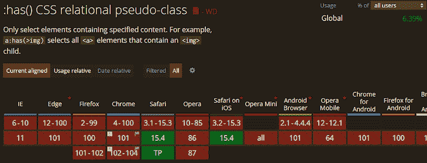

# 如何以及何时使用 CSS :has selector 

> 原文：<https://blog.logrocket.com/how-when-use-css-has-selector/>

CSS `:has()`选择器允许我们根据一个元素的后代或者任何后续元素来设计它的样式。在本教程中，我们将讨论何时以及如何使用`:has()`选择器。

我们将涵盖的内容:

## 何时使用 CSS `:has()`

通常，当我们编写针对 HTML 元素的 CSS 规则时，浏览器的引擎会从右到左评估规则以应用它们。例如，下面的 CSS 规则针对的是`<section>`中的`<p>`元素:

```
section p {
  color: red;
}

```

现在，假设我们希望基于元素的内容或后续元素来定位元素——例如，定位包含`<p>`元素的`<section>`元素。通常，我们会手动添加 CSS 类来设计和修改目标元素。

另一个场景涉及到定位一个元素以前的兄弟元素，比如一个有效或无效输入之前的表单标签。

在这种情况下，设计标签的样式需要编写比通常所需更多的 CSS 规则。有时，我们可能需要 JavaScript 根据某些元素的状态来定位前面的元素。

然而，有了`:has()`伪类选择器，我们可以更干净、清晰、简洁地用 CSS 完成上述所有任务。

## CSS `:has()`选择器的浏览器兼容性

在我们深入研究之前，让我们看看哪些[浏览器与 CSS](https://caniuse.com/css-has) `[:has](https://caniuse.com/css-has)` [选择器](https://caniuse.com/css-has)兼容:



目前，CSS `:has()`选择器仅在最新的 Safari 上默认启用。其他浏览器尚未启用对它的支持。

然而，在最新的 Chrome 版本中，我们可以通过实验功能标志启用 CSS `:has()`支持。出于本教程的考虑，我们将从那开始。

### 如何在 Chrome 中启用 CSS `:has()`支持

对于我们这些不使用 Safari 的人来说，让我们打开 Chrome 浏览器，通过在浏览器中键入以下内容来访问 Chrome 的实验性功能列表:chrome://flags/

然后，搜索“实验性 Web 平台功能”并启用此标志，如下图所示:


启用实验性 Web 平台功能后，重新启动浏览器以激活它们。

## CSS `:has()`语法

`:has()`伪类接受一个 [CSS 选择器列表](https://blog.logrocket.com/level-up-your-css-selector-skills/)作为参数:

```
<target>:has(<selector>)

```

像其他 CSS 伪类一样，选择器列表是“宽容的”换句话说，CSS `:has`忽略任何作为参数传递的无效选择器。

## CSS `:has()`选择器示例

在将这个选择器应用到现实场景之前，让我们先熟悉一下如何使用 CSS `:has()`。我们将重温我们之前使用的[样式规则示例](#when-use-css-has)，看看`:has()`如何让我们定位父元素。

下面的规则使用了`:has()`选择器，我们的目标是一个`<section>`元素，它有一个`<p>`元素作为子元素:

```
section:has(p) {
  color: red
}

```

在上面的规则中，我们看到`section`是样式`color: red`应用到的目标元素，但是只有当它包含一个`p`元素时。

### 在`:has()`中传递 CSS 组合选择器作为参数

到目前为止，我们在`:has()`中只传递了简单的选择器作为参数。然而，我们也可以使用更高级的 CSS 选择器。

比如，我们也可以传递一些[正则组合子选择器](https://developer.mozilla.org/en-US/docs/Learn/CSS/Building_blocks/Selectors/Combinators)作为参数。下面，下面的选择器匹配将段落元素作为同级的`h2`元素:

```
h2:has(+ p) {
  color: yellow;
}

```

与简单的 CSS 选择器不同，`h2 + p`将匹配紧随`h2`之后的`p`元素。

我们必须理解组合子选择器在`:has()`中作为参数传递时是如何工作的。让我们再看几个例子。

在下面的代码中，选择器匹配一个段落后跟另一个段落的列表项:

```
li:has(p + p) {
  color: grey;
}

```

下面的选择器匹配直接包含`span`子元素的`p`元素:

```
p:has(> span) {
  color: blue;
}

```

### 将 CSS `:has()`与`:not()`伪类相结合

有时，我们可能希望将与某些选择器不匹配的元素作为目标。在这种情况下，我们可以将`:has()`选择器与`[:not()](https://developer.mozilla.org/en-US/docs/Web/CSS/:not)` [伪类](https://developer.mozilla.org/en-US/docs/Web/CSS/:not)一起使用。在下面的示例中，规则的目标是不包含任何段落的`li`元素:

```
li:not(:has(p)) {
  font-weight: 700;
}

```

我们也可以传递多个选择器作为参数。下面，规则的目标是不包含任何段落或`span`元素的`li`元素:

```
li:not(:has(p, span)) {
  font-weight: 700;
}

```

## CSS `:has()`选择器的特异性

有时，在使用`:has()`选择器时，我们可能会遇到规则冲突的问题。了解[CSS 如何处理其整体选择器的特异性](https://blog.logrocket.com/deep-dive-css-specificity/)可以帮助你[解决 CSS 规则](https://blog.logrocket.com/css-important-declaration-when-why/)冲突的问题。

让我们来看看下面的代码块:

以下是我们正在设计的 HTML 元素:

```
<ul>
  <!-- other items -->
  <li>
    <h3 id="h3">Heading III</h3> <!-- blue color -->
    <p class="cls">paragraph</p> <!-- blue color -->
  </li>
</ul>

```

以下是我们在 CSS 中的样式规则:

```
li:has(p, #h3) {
  color: blue; /* this declaration is applied */
}

li:has(p.cls) {
  color: green;
}

```

我们可能期望级联中最后出现的样式规则将被应用于`p`元素。但实际上，在这个例子中，应用了第一个规则。

这是因为 CSS 中的特殊性——`:has()`选择器遵从其最具体的参数。在上面的规则中，`#h3`是最具体的，因此浏览器也将其样式声明应用于`p`元素。

## CSS `:has()`选择器的实际例子

为了理解如何在现实世界的项目中实现`:has()`伪类，让我们考虑下面的用例。

### 用特定子代设计父代:构建定价卡

下面的设计在展示定价方案的网站上很常见。请注意,“推荐”卡片的风格不同，并且被放大以引起更多注意:


我们可以使用`:has()`选择器轻松实现这一点。

下面是卡片的 HTML 标记。我们将以不同的方式设计包含嵌套的`recommend`类的卡片:

```
<section class="card-container">
 <div class="pricing-card">
  <!-- card content -->
 </div>
 <div class="pricing-card">
  <div class="recommend">Recommended</div>
   <!-- card content -->
 </div>
 <div class="pricing-card">
   <!-- card content -->
 </div>
</section>

```

注意，为了简洁起见，我们删除了上面代码中的卡片内容。参见 CodePen 上的[完成标记。](https://codepen.io/ibaslogic/pen/dydWWeo?editors=1000)

然后，有了基本样式，卡片看起来像这样:


使用`:has()`选择器，我们可以定位并设计只有`recommend`类作为子类的卡片:

```
.pricing-card:has(div.recommend) {
 box-shadow: 0 0 0 2px #4b4bf0, 0 1rem 2rem rgba(0, 0, 0, 0.1);
 transform: scale(1.1);
 z-index: 1;
}

```

上述规则以推荐的卡片为目标，并根据需要对其进行缩放，同时对其应用投影。

如果我们想在不使用`:has()`选择器的情况下实现这个设计，我们就必须在“推荐的”卡片容器上手动应用一个单独的类来设计不同的样式。不利的一面是，我们必须在使用相同设计的每个部分中添加这个类。

我们继续吧。如果我们看看最终的项目，推荐卡的“立即购买”按钮也与其他两张卡的风格不同。为此，我们将使用`:not()`和`:has()`选择器，如下所示:

```
.pricing-card:not(:has(.recommend)) a {
 color: #000;
 background: #d5ddeb;
}

```

在上面的代码中，我们的目标是卡片中没有`recommend`类的按钮，给它们不同颜色的文本和背景。

### 样式化以前的同级:有效/无效的输入标签

在下一个例子中，我们将根据相应输入的有效性来设计输入标签的样式。我们的最终结果将是这样的:


我们开始吧。下面的代码在一个`form`元素中呈现表单控件:

```
<form> 
  <div>
   <label for="email">Email: </label>
   <input type="email" id="email" required/>
  </div> 
  <!-- other input -->
</form>

```

注意，为了简洁起见，我们在上面的代码中只显示了一个输入容器。参见 CodePen 上的[完成标记。](https://codepen.io/ibaslogic/pen/gOvRKaY?editors=1000)

像前面的项目一样，让我们看看如何在不使用`:has()`选择器的情况下定位输入标签。

记住，我们之前说过浏览器通常从右边评估样式规则。因此，我们可以将`label`放在`input`元素之后:

```
<div> 
 <input type="email" id="email" required/>
 <label for="email">Email: </label>
</div>

```

然后，我们可以使用一般的`~`或相邻的`+`兄弟组合符来选择和样式化标签:

```
input:invalid ~ label, 
input:invalid ~ label::before { 
 content: '✖ ';
 color: red; 
}

input:valid ~ label, 
input:valid ~ label::before { 
 content: '✓ ';
 color: green; 
}

```

之后，我们将使用 CSS `position: absolute;`将标签放回输入上方:

```
form > div {
 position: relative;
 margin-bottom: 30px;
}

label {
 position: absolute;
 top: -30px;
 left: 0;
 right: 0;
}

```

然而，使用`:has()`选择器，我们不必将标签放在输入之后或者使用 CSS `position: absolute;`声明。我们可以很容易地像这样瞄准以前的兄弟姐妹:

```
label:has(+ input:invalid), 
label:has(+ input:invalid)::before {
 content: '✖ ';
 color: red;
}

label:has(+ input:valid), 
label:has(+ input:valid)::before {
 content: '✓ ';
 color: green;
}

```

在第一个和第二个代码块中，我们分别将具有无效输入和有效输入的`label`作为下一个兄弟。

正如我们所见，使用`:has()`选择器使我们的代码更加清晰和简洁。参见 CodePen 上的[完整代码。](https://codepen.io/ibaslogic/pen/gOvRKaY?editors=0100)

## 结论

在本教程中，我们通过实际例子了解了`:has()`选择器如何让我们根据元素的后代或后续元素来设计元素的样式。这个选择器提供了许多在 CSS 中难以实现的可能性。

目前，CSS `:has()`选择器没有得到浏览器的广泛支持；该选择器仅在最新版本的 Safari 中工作，或者通过最新版本的 Chrome 中的实验功能标志工作。

所以就目前而言，我们一定不能在生产中使用`:has()`。我们只能在等待其他浏览器支持的同时，探索它是如何工作的。

我希望你喜欢阅读本教程。如果你有问题或贡献，请在评论区分享你的想法，记得在网络上分享这篇文章。

## 你的前端是否占用了用户的 CPU？

随着 web 前端变得越来越复杂，资源贪婪的特性对浏览器的要求越来越高。如果您对监控和跟踪生产环境中所有用户的客户端 CPU 使用、内存使用等感兴趣，

[try LogRocket](https://lp.logrocket.com/blg/css-signup)

.

[](https://lp.logrocket.com/blg/css-signup)[https://logrocket.com/signup/](https://lp.logrocket.com/blg/css-signup)

LogRocket 就像是网络和移动应用的 DVR，记录你的网络应用或网站上发生的一切。您可以汇总和报告关键的前端性能指标，重放用户会话和应用程序状态，记录网络请求，并自动显示所有错误，而不是猜测问题发生的原因。

现代化您调试 web 和移动应用的方式— [开始免费监控](https://lp.logrocket.com/blg/css-signup)。