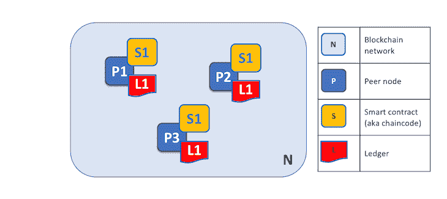
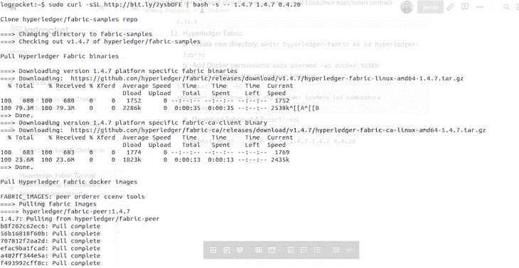
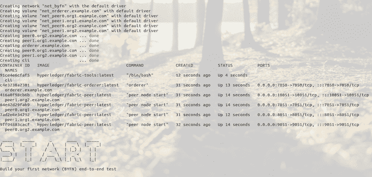
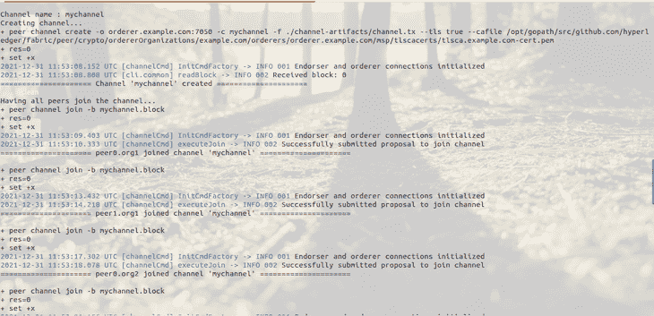
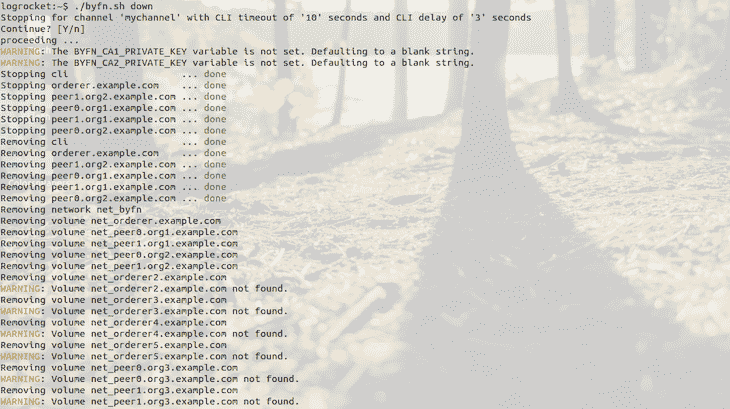
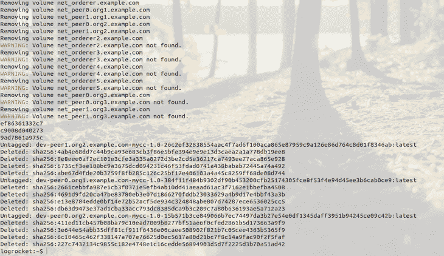
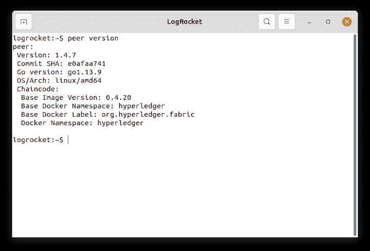

# 超级账本结构:开发许可的区块链智能合约

> 原文：<https://blog.logrocket.com/hyperledger-fabric-develop-blockchain-smart-contracts/>

Hyperledger 是 Linux 基金会的一个伞式项目，它提供分布式分类帐、开源区块链实现和相关工具，如分布式分类帐框架、智能合同引擎、客户端库、图形界面、实用程序库和示例应用程序。

区块链是一个点对点的分布式交易分类账，它是由共识形成的，结合了智能合约和其他辅助技术的系统。这些交易被复制并分布在区块链上的整个参与计算机系统网络中。换句话说，区块链是一个合法的市场、数据共享网络、微型货币和去中心化数字社区的操作系统。

[Hyperledger Fabric](https://www.hyperledger.org/use/fabric) 是一个许可的区块链基础设施，主要针对需要分布式分类帐技术(DLT)的集成项目。除了 Node.js、JavaScript 和 Go 的 SDK 之外，它没有提供任何面向用户的服务。它提供了节点之间的模块化架构、智能合约的执行以及可配置的共识和成员服务。

在本文中，我们将创建第一个许可的区块链应用程序，探索智能合同并讨论 Hyperledger Fabric 的一些重要功能。我们开始吧！

### 目录

## 关于 Hyperledger 结构

Hyperledger 结构网络由三个主要组件组成。

对等节点执行链码、访问分类帐数据、签署交易以及与应用程序交互。对等节点可以在区块链生命周期的任何时候启动、停止、重新配置和删除。

订购者节点确保区块链的一致性，并将认可的事务交付给网络中的对等节点。订购者节点负责订购事务，形成订购服务，将事务打包成块，并将这些块分发到网络上的锚定对等点。

成员资格服务提供商(MSPs)节点通常作为证书颁发机构来实现，它管理 X.509 证书并用于验证成员身份和角色。MSPs 节点是颁发证书、验证证书和验证用户身份背后的所有加密机制和协议的抽象层。



Interconnection between peer nodes, smart contract, ledger, and blockchain network

[图像来源](https://hyperledger-fabric.readthedocs.io/en/release-2.2/_images/peers.diagram.1.png)

在 Hyperledger Fabric 中，您可以使用不同的一致性算法，但是，实用的拜占庭容错(PBFT)是最常用的。

### 功能

Hyperledger Fabric 有五个主要功能。

#### 身份管理

对于许可网络，成员身份服务管理用户 id，对区块链网络上的参与者进行身份验证。此外，开发人员可以通过使用访问控制列表的附加层来启用和限制特定的网络操作。例如，可以允许特定的用户 ID 调用链代码应用程序，但禁止部署新的链代码。

#### 高效处理

为了向网络提供并发性和并行性，Hyperledger 结构包括交易排序，例如，通过节点权限的类型。开发人员可以通过同一节点执行多个事务，并通过节点类型分配网络角色。

#### 标准设计

Hyperledger Fabric 实现模块化架构，以向网络设计者提供功能选择，例如通过不同加密算法、算法或身份、加密、排序和加密的可用性，实现通用设计。

#### 隐私和保密

Hyperledger Fabric 使相互竞争的企业或任何需要私人、机密交易的团体能够在同一个许可网络上共存。它支持诸如针对特定网络成员子集的受限消息传递路径之类的功能。例如，包括交易、成员和渠道信息的数据对于任何没有被明确授权访问的网络成员来说是不可见和不可访问的。

#### 链码功能

编码逻辑由通道上特定类型的事务调用，例如，系统链码、生命周期和配置系统链码以及认可和验证系统链码。

## 超级分类帐结构体系

现在我们已经熟悉了 Hyperledger Fabric 的功能，让我们回顾一下组成它的组件。

### 结节

在 Hyperledger 结构中，任何在网络上通信的计算设备都被称为节点。

### 客户

客户端是可以代表最终用户的节点。

* * *

### 更多来自 LogRocket 的精彩文章:

* * *

### 同龄人

Hyperledger Fabric 具有对等网络，其中对等节点负责分类帐的状态并优化性能。同伴有两种类型。首先，背书者模拟并背书交易。交易背书是对模拟交易结果的签名响应。另一方面，在向区块链提交事务之前，提交者验证背书并确认事务结果

### 处理

超级分类帐结构事务处理有两种类型。部署事务创建一个带参数的新链码作为程序，并在区块链上安装链码。调用事务在以前的链代码或智能合约部署的上下文中执行。

### 数据结构

键值存储(KVS)是区块链的基本数据结构。通常，键是名称，值是 blobs。KVS 支持两种操作，`PUT`和`GET`。数据结构被视为在给定时间点的状态。默认的状态数据库 LevelDB 可以用 [CouchDB](https://couchdb.apache.org) 代替。

### 分类帐

在所谓的有序 hashchain 事务块中，状态变化按照发生的顺序存储，便于以后引用。区块链在分类账中记录交易。分类帐包含有序块，有序块包含有序交易数组。分类帐存储每一个状态变化，不管是成功的还是不成功的。

### 结构数据库

在 Hyperledger Fabric 中，数据存储在两个地方，状态数据库和分类帐数据库。

当前状态数据表示分类帐中所有资产的最新值。因为当前状态表示通道上所有提交的事务，所以它有时被称为世界状态。

分类帐数据库存储序列化块，其中每个块有一个或多个事务处理。每个事务包含一个读写集，它修改一个或多个键/值对。分类帐是数据的决定性来源，并且是不可改变的。

### 订购机制

Hyperledger Fabric 提供了三种订购机制。

SOLO 订购机制涉及单个订购节点，最常用于试验 Hyperledger 结构网络的开发人员。

建议生产使用 Kafka 订购机制。该数据由背书交易和 RW 集合组成。因为它使用 Apache Kafka，所以这种类型的排序是崩溃容错的。

最后，简化的拜占庭容错排序机制同时具有崩溃容错和拜占庭容错，这意味着它甚至可以在存在恶意或故障节点的情况下达成一致。

### 共识；一致

在分布式分类账系统中，共识是就下一组要添加到分类账中的交易达成一致的过程。Hyperledger Fabric 由三个不同的步骤组成。

首先，在交易背书步骤中，背书对等体执行链码，如果成功，就会产生分类帐的实际交易。然后，签署方签署交易并将其返回给提议方。

排序服务支持严格排序，这意味着如果事务`T1`已经被写入块`B1`中，那么同一个事务`T1`不能被重写到不同的块中，如`B2`或`B3`。最后，验证和承诺包括事务处理验证和分类帐承诺。

### 智能合同

智能协定定义了控制全局状态中包含的业务对象的生命周期的事务逻辑。在 Hyperledger Fabric 中，智能合同执行被称为链码。Hyperledger Fabric 用户经常互换使用术语智能合同和链码。

Hyperledger Fabric 智能合约也称为 chaincode，用 Go 编写。chaincode 充当 Hyperledger 结构网络的业务逻辑，智能合约指导相关节点如何操作网络中的资产。

## 应用程序如何与网络交互

在 Hyperledger Fabric 中，智能合同和链码托管在网络上，由名称和版本标识。为了运行链码或智能合约，应用程序使用由 SDK 实现的 SDK APIs。

Hyperledger Fabric 为开发人员创建应用程序提供了三个选项:Node.js SDK、Java SDK 和 CLI。此外，Hyperledger 还提供了 [Hyperledger Fabric 示例](https://github.com/hyperledger/fabric-samples)，供用户探索 Hyperledger Fabric 的功能。

## 开发许可的区块链应用程序

现在我们已经了解了 Hyperledger Fabric 架构，让我们创建一个许可的区块链应用程序。首先，让我们阐明开发 Hyperledger Fabric 应用程序时要遵循的主要步骤。

首先，我们需要设置开发环境，包括运行智能合约的网络安装。接下来，我们需要了解 Node.js SDK 和我们应用程序背后的核心编程。Hyperledger Fabric 提供了多个 SDK，如 Go、JavaScript 和 Java。在本教程中，我们将使用一点 Go 和大量的 JavaScript。

此外，我们需要理解样本智能合同，包括交易。我们将运行应用程序模拟的查询，并更新分类帐。最后，我们将使用智能契约开发一个示例区块链应用程序。

## 设置开发环境

### 先决条件

要使用 Hyperledger Fabric 设置开发环境，我们需要以下内容

1.  cURL 的最新版本
2.  坞站和坞站组成≥v17.06.2-ce
3.  Go v1.12.x 版
4.  Node.js ≥v8.9 或 v10.15.3

### 装置

在我们的例子中，我们将使用基于 Linux 的发行版 Ubuntu 20.04 和 18.04。首先，用`sudo apt-get update`更新你当前的机器。然后，我们用`sudo apt instal curl`安装 cURL，用`curl --version`检查 cURL 版本，如下图所示:

```
 curl --version
curl 7.68.0 (x86_64-pc-linux-gnu) libcurl/7.68.0 OpenSSL/1.1.1f zlib/1.2.11 brotli/1.0.7 libidn2/2.2.0 libpsl/0.21.0 (+libidn2/2.2.0) libssh/0.9.3/openssl/zlib nghttp2/1.40.0 librtmp/2.3
Release-Date: 2020-01-08
Protocols: dict file ftp ftps gopher http https imap imaps ldap ldaps pop3 pop3s rtmp rtsp scp sftp smb smbs smtp smtps telnet tftp 
Features: AsynchDNS brotli GSS-API HTTP2 HTTPS-proxy IDN IPv6 Kerberos Largefile libz NTLM NTLM_WB PSL SPNEGO SSL TLS-SRP UnixSockets

```

#### 码头工人

我们需要安装所需的 Docker 包，如下所示:

```
sudo apt-get install apt-transport-https ca-certificates gnupg-agent software-properties-common

```

接下来，我们将添加 Docker 的官方 GPG 键:

```
curl -fsSL https://download.docker.com/linux/ubuntu/gpg | sudo apt-key add -

```


Check OK

要设置 Docker，请运行以下代码:

```
sudo add-apt-repository "deb [arch=amd64] https://download.docker.com/linux/ubuntu  $(lsb_release -cs)  stable"

```

用下面的代码安装 Docker:

```
sudo apt-get install docker-ce docker-ce-cli containerd.io`

```

我们将在下面的代码片段中用`docker --version`检查 Docker 版本:

```
logrocket:~$ docker --version
Docker version 20.10.12, build e91ed57

```

接下来，我们将测试运行 Docker 引擎:

```
docker run hello-world

```

#### 复合坞站

要下载 Docker Compose 的最新版本，请运行以下代码:

```
sudo curl -L "https://github.com/docker/compose/releases/download/1.25.5/docker-compose-$(uname -s)-$(uname -m)" -o /usr/local/bin/docker-compose

```

使用`sudo chmod +x /usr/local/bin/docker-compose`将权限更改为可执行。要检查 Docker 编写版本，请按如下方式运行`docker-compose --version`:

```
logrocket:~$ docker-compose --version
docker-compose version 1.25.5, build 8a1c60f6

```

#### 去

下载`tar`文件:

```
curl -O https://storage.googleapis.com/golang/go1.12.9.linux-amd64.tar.gz

```

移动 Go 目录:

```
sudo mv go1.12.9.linux-amd64.tar.gz /usr/local/

```

用下面的代码提取`tar`文件:

```
sudo tar -xvzpf /usr/local/go1.12.9.linux-amd64.tar.gz

```

您可以使用以下代码删除`tar`文件:

```
sudo rm -rf /usr/local/go1.12.9.linux-amd64.tar.gz

```

#### 环境变量

用`vim .profile`打开轮廓，并在`.profile`文件的末尾添加`PATH`变量:

```
export GOPATH=$HOME/go
export PATH=$PATH:/usr/local/go/bin:$GOPATH/bin

```

使用`source ~/.profile`导航到源概要文件，并使用以下代码检查当前 Go 版本:

```
logrocket:~$ go version
go version go1.12.9 linux/amd64

```

#### 节点. js

运行以下代码以获取 Node.js v10.x:

```
curl -sL https://deb.nodesource.com/setup_10.x | sudo -E bash -`

```

使用以下命令安装 Node.js:

```
sudo apt-get install -y nodejs

```

若要检查 Node.js 的当前版本，请运行以下代码:

```
nodejs --version
logrocket:~$ nodejs --version
v10.19.0

```

现在，用`npm -v`检查 npm 版本:

```
logrocket:~$ npm -v
6.14.4

```

#### 超分类帐结构

通过运行以下代码创建一个新目录:

```
mkdir hyperledger-fabric && cd hyperledger-fabric

```

添加 Docker 权限:

```
sudo usermod -aG docker $USER

```

检查权限并刷新终端:

```
logrocket:~$ id -nG
tapasweni adm cdrom sudo dip plugdev lpadmin lxd sambashare
newgrp docker

```

下载 Fabric 1 . 4 . 7 版:

```
curl -sSL https://raw.githubusercontent.com/hyperledger/fabric/master/scripts/bootstrap.sh  | bash -s -- 1.4.7 1.4.7 0.4.20

logrocket:~$ curl -sSL https://raw.githubusercontent.com/hyperledger/fabric/master/scripts/bootstrap.sh  | bash -s -- 1.4.7 1.4.7 0.4.20

Clone hyperledger/fabric-samples repo

===> Cloning hyperledger/fabric-samples repo
Cloning into 'fabric-samples'...
remote: Enumerating objects: 9165, done.
remote: Counting objects: 100% (1/1), done.
remote: Total 9165 (delta 0), reused 1 (delta 0), pack-reused 9164
Receiving objects: 100% (9165/9165), 5.21 MiB | 3.71 MiB/s, done.
Resolving deltas: 100% (4898/4898), done.
===> Checking out v1.4.7 of hyperledger/fabric-samples

Pull Hyperledger Fabric binaries

===> Downloading version 1.4.7 platform specific fabric binaries
===> Downloading:  https://github.com/hyperledger/fabric/releases/download/v1.4.7/hyperledger-fabric-linux-amd64-1.4.7.tar.gz
  % Total    % Received % Xferd  Average Speed   Time    Time     Time  Current
                                 Dload  Upload   Total   Spent    Left  Speed
100   680  100   680    0     0   1683      0 --:--:-- --:--:-- --:--:--  1679
100 79.3M  100 79.3M    0     0  4614k      0  0:00:17  0:00:17 --:--:-- 4762k
==> Done.
===> Downloading version 1.4.7 platform specific fabric-ca-client binary
===> Downloading:  https://github.com/hyperledger/fabric-ca/releases/download/v1.4.7/hyperledger-fabric-ca-linux-amd64-1.4.7.tar.gz
  % Total    % Received % Xferd  Average Speed   Time    Time     Time  Current
                                 Dload  Upload   Total   Spent    Left  Speed
100   683  100   683    0     0   1876      0 --:--:-- --:--:-- --:--:--  1876
100 23.6M  100 23.6M    0     0  3962k      0  0:00:06  0:00:06 --:--:-- 4904k
==> Done.

Pull Hyperledger Fabric docker images

FABRIC_IMAGES: peer orderer ccenv tools
===> Pulling fabric Images
====> hyperledger/fabric-peer:1.4.7
1.4.7: Pulling from hyperledger/fabric-peer
Digest: sha256:a395036c83125ccf3820eb1752ac9ba8017e4432768b59d658bfba91a311d154
Status: Image is up to date for hyperledger/fabric-peer:1.4.7
docker.io/hyperledger/fabric-peer:1.4.7
====> hyperledger/fabric-orderer:1.4.7
1.4.7: Pulling from hyperledger/fabric-orderer
Digest: sha256:aef31580eee468e08eb8354bb5f2ec23e0fc12f9b638bd41d207dd5e4d6c6e60
Status: Image is up to date for hyperledger/fabric-orderer:1.4.7
docker.io/hyperledger/fabric-orderer:1.4.7
====> hyperledger/fabric-ccenv:1.4.7
1.4.7: Pulling from hyperledger/fabric-ccenv
Digest: sha256:11dbbdce7f3f789d7bbc758b593005e9aeccd991ed64a3f296e824aaf67f07c6
Status: Image is up to date for hyperledger/fabric-ccenv:1.4.7
docker.io/hyperledger/fabric-ccenv:1.4.7
====> hyperledger/fabric-tools:1.4.7
1.4.7: Pulling from hyperledger/fabric-tools
Digest: sha256:59328549b3384f565cb5bd19b74c977820781e4709158666ead74fcd970c11e1
Status: Image is up to date for hyperledger/fabric-tools:1.4.7
docker.io/hyperledger/fabric-tools:1.4.7
===> Pulling fabric ca Image
====> hyperledger/fabric-ca:1.4.7
1.4.7: Pulling from hyperledger/fabric-ca
Digest: sha256:9418ea351bfbef4bf2bca34bcd77305bdb9a45d2c1aab3237c08c17da0b4d1dd
Status: Image is up to date for hyperledger/fabric-ca:1.4.7
docker.io/hyperledger/fabric-ca:1.4.7
===> List out hyperledger docker images
hyperledger/fabric-ca        1.4            743a758fae29   19 months ago   154MB
hyperledger/fabric-ca        1.4.7          743a758fae29   19 months ago   154MB
hyperledger/fabric-ca        latest         743a758fae29   19 months ago   154MB
hyperledger/fabric-tools     1.4            a026b435e575   19 months ago   1.49GB
hyperledger/fabric-tools     1.4.7          a026b435e575   19 months ago   1.49GB
hyperledger/fabric-tools     latest         a026b435e575   19 months ago   1.49GB
hyperledger/fabric-ccenv     1.4            c5fbec1827ad   19 months ago   1.36GB
hyperledger/fabric-ccenv     1.4.7          c5fbec1827ad   19 months ago   1.36GB
hyperledger/fabric-ccenv     latest         c5fbec1827ad   19 months ago   1.36GB
hyperledger/fabric-orderer   1.4            df155b01ed80   19 months ago   123MB
hyperledger/fabric-orderer   1.4.7          df155b01ed80   19 months ago   123MB
hyperledger/fabric-orderer   latest         df155b01ed80   19 months ago   123MB
hyperledger/fabric-peer      1.4            5d5fbecd1efe   19 months ago   131MB
hyperledger/fabric-peer      1.4.7          5d5fbecd1efe   19 months ago   131MB
hyperledger/fabric-peer      latest         5d5fbecd1efe   19 months ago   131MB
hyperledger/fabric-baseos    amd64-0.4.20   121a92cc3fc0   22 months ago   85MB
logrocket:~$ 

```



cURL hyperledger/fabric-samples

现在，更新环境变量:

```
vim .profile
export PATH=/home/$USER/hyperledger/fabric-samples/bin:$PATH
source ~/.profile

```

## 运行 Hyperledger 结构

进去`fabric-samples/first-network`:


Hyperledger Fabric first network directory

使用`./byfn.sh up`启动网络:

```
logrocket:~$ cd first-network/
logrocket:~$ ls
base               channel-artifacts     connection-org2.yaml    docker-compose-cli.yaml           docker-compose-kafka.yaml  scripts
byfn.sh            configtx.yaml         connection-org3.json    docker-compose-couch-org3.yaml    docker-compose-org3.yaml
ccp-generate.sh    connection-org1.json  connection-org3.yaml    docker-compose-couch.yaml         eyfn.sh
ccp-template.json  connection-org1.yaml  crypto-config.yaml      docker-compose-e2e-template.yaml  org3-artifacts
ccp-template.yaml  connection-org2.json  docker-compose-ca.yaml  docker-compose-etcdraft2.yaml     README.md
logrocket:~$ ./byfn.sh -m up
Starting for channel 'mychannel' with CLI timeout of '10' seconds and CLI delay of '3' seconds
Continue? [Y/n] 
proceeding ...
LOCAL_VERSION=1.4.7
DOCKER_IMAGE_VERSION=1.4.7
/home/tapasweni/hyperledger/fabric-samples/first-network/../bin/cryptogen

##########################################################
##### Generate certificates using cryptogen tool #########
##########################################################
+ cryptogen generate --config=./crypto-config.yaml
org1.example.com
org2.example.com
+ res=0
+ set +x

Generate CCP files for Org1 and Org2
/home/tapasweni/hyperledger/fabric-samples/first-network/../bin/configtxgen
##########################################################
#########  Generating Orderer Genesis block ##############
##########################################################
CONSENSUS_TYPE=solo
+ '[' solo == solo ']'
+ configtxgen -profile TwoOrgsOrdererGenesis -channelID byfn-sys-channel -outputBlock ./channel-artifacts/genesis.block
2021-12-31 17:52:52.853 IST [common.tools.configtxgen] main -> INFO 001 Loading configuration
2021-12-31 17:52:53.051 IST [common.tools.configtxgen.localconfig] completeInitialization -> INFO 002 orderer type: solo
2021-12-31 17:52:53.051 IST [common.tools.configtxgen.localconfig] Load -> INFO 003 Loaded configuration: /home/tapasweni/hyperledger/fabric-samples/first-network/configtx.yaml

```


Network start



Network Start continued..



Network start: Channel creation


Network start completed

用`docker ps -a`验证 Docker:

```
logrocket:~$ docker ps -a
CONTAINER ID   IMAGE                                                                                                  COMMAND                  CREATED              STATUS              PORTS                                           NAMES
ef86361332c7   dev-peer1.org2.example.com-mycc-1.0-26c2ef32838554aac4f7ad6f100aca865e87959c9a126e86d764c8d01f8346ab   "chaincode -peer.add…"   About a minute ago   Up About a minute                                                   dev-peer1.org2.example.com-mycc-1.0
c9008d040273   dev-peer0.org1.example.com-mycc-1.0-384f11f484b9302df90b453200cfb25174305fce8f53f4e94d45ee3b6cab0ce9   "chaincode -peer.add…"   2 minutes ago        Up 2 minutes                                                        dev-peer0.org1.example.com-mycc-1.0
9ad7861a975c   dev-peer0.org2.example.com-mycc-1.0-15b571b3ce849066b7ec74497da3b27e54e0df1345daff3951b94245ce09c42b   "chaincode -peer.add…"   4 minutes ago        Up 4 minutes                                                        dev-peer0.org2.example.com-mycc-1.0
91ce4e6cfaf5   hyperledger/fabric-tools:latest                                                                        "/bin/bash"              5 minutes ago        Up 5 minutes                                                        cli
c4e3238a2301   hyperledger/fabric-orderer:latest                                                                      "orderer"                6 minutes ago        Up 5 minutes        0.0.0.0:7050->7050/tcp, :::7050->7050/tcp       orderer.example.com
416a0f98cb6b   hyperledger/fabric-peer:latest                                                                         "peer node start"        6 minutes ago        Up 5 minutes        0.0.0.0:10051->10051/tcp, :::10051->10051/tcp   peer1.org2.example.com
84e42d29fab9   hyperledger/fabric-peer:latest                                                                         "peer node start"        6 minutes ago        Up 5 minutes        0.0.0.0:7051->7051/tcp, :::7051->7051/tcp       peer0.org1.example.com
7ad2e6e34292   hyperledger/fabric-peer:latest                                                                         "peer node start"        6 minutes ago        Up 5 minutes        0.0.0.0:8051->8051/tcp, :::8051->8051/tcp       peer1.org1.example.com
9ff94883cacf   hyperledger/fabric-peer:latest                                                                         "peer node start"        6 minutes ago        Up 5 minutes        0.0.0.0:9051->9051/tcp, :::9051->9051/tcp       peer0.org2.example.com
logrocket:~$ 

```

用`./byfn.sh down`关闭网络:

```
logrocket:~$ ./byfn.sh -m down
Stopping for channel 'mychannel' with CLI timeout of '10' seconds and CLI delay of '3' seconds
Continue? [Y/n] 
proceeding ...
WARNING: The BYFN_CA1_PRIVATE_KEY variable is not set. Defaulting to a blank string.
WARNING: The BYFN_CA2_PRIVATE_KEY variable is not set. Defaulting to a blank string.
Stopping cli                    ... done
Stopping peer0.org2.example.com ... done
Stopping peer0.org1.example.com ... done
Stopping peer1.org2.example.com ... done
Stopping peer1.org1.example.com ... done
Stopping orderer.example.com    ... done
Removing cli                    ... done
Removing peer0.org2.example.com ... done
Removing peer0.org1.example.com ... done
Removing peer1.org2.example.com ... done
Removing peer1.org1.example.com ... done
Removing orderer.example.com    ... done
Removing network net_byfn
Removing volume net_orderer.example.com
Removing volume net_peer0.org1.example.com
Removing volume net_peer1.org1.example.com
Removing volume net_peer0.org2.example.com
Removing volume net_peer1.org2.example.com
Removing volume net_orderer2.example.com
WARNING: Volume net_orderer2.example.com not found.
Removing volume net_orderer3.example.com
WARNING: Volume net_orderer3.example.com not found.
Removing volume net_orderer4.example.com
WARNING: Volume net_orderer4.example.com not found.
Removing volume net_orderer5.example.com
WARNING: Volume net_orderer5.example.com not found.
Removing volume net_peer0.org3.example.com
WARNING: Volume net_peer0.org3.example.com not found.
Removing volume net_peer1.org3.example.com
WARNING: Volume net_peer1.org3.example.com not found.
1c1c3bd27578
052b542e408f
2371102e3fa1
Untagged: dev-peer1.org2.example.com-mycc-1.0-26c2ef32838554aac4f7ad6f100aca865e87959c9a126e86d764c8d01f8346ab:latest
Deleted: sha256:574b46ed09496b052b9963d79362fa3e15d5430d6f7e227c8edccfe37a94a54d
Deleted: sha256:89856e5feb7feafde31a15decf9d2657f7344e38ee90bc8e73f7c0e189a0422c
Deleted: sha256:570373df622999f59a978635db23a4ce6f6f3c6b1067aeafd3d2a64b4b1020b0
Deleted: sha256:31ce9090622db38830dfdc3209c4044d70f7345e863fcd54c40ac2d2a2abbf03
Untagged: dev-peer0.org1.example.com-mycc-1.0-384f11f484b9302df90b453200cfb25174305fce8f53f4e94d45ee3b6cab0ce9:latest
Deleted: sha256:c40d025bb22f74cfa14568a70257964d94b557e23811c9bfb5d4591200f64b62
Deleted: sha256:b9e1d83750424813abf0fe6f96fbc3904680bf0ae23474b4939e60596b77f1d9
Deleted: sha256:a5dc79ea636789a36962fcac872a77a86235f95fa9f3714c8bd8da42237b51f3
Deleted: sha256:8b9a4e82ec7825be4e6f52b7192c2b76fc5ab671a871dcc9c3423f23713009da
Untagged: dev-peer0.org2.example.com-mycc-1.0-15b571b3ce849066b7ec74497da3b27e54e0df1345daff3951b94245ce09c42b:latest
Deleted: sha256:599b2ad18745375616a97b3a99411571aeb456b0c320f853bdd9d15d19a5c875
Deleted: sha256:65a03c40d4a982f5b6589a8fd2e6aac66b70a295d68b3c8892a8fe5bf41f3edc
Deleted: sha256:ab76526d7091a8511de05ae2c91f0279f10aa0b07ad4a62c5cc105c454d79894
Deleted: sha256:6d5781813eb41dfc57917af52d5c4e7234864d005b8d38c07f51a759fa8790f0
logrocket:~$ 

```



Network Down started



Network Down completed

用`./network.sh up createChannel`创建一个名为`mychannel`的通道:

```
    ========= Channel successfully joined ===========

```

## Hyperledger Fabric Node.js SDK

本教程使用了 [Hyperledger Node.js SDK](https://hyperledger.github.io/fabric-sdk-node/) ，我们将使用它与网络进行交互，并通过网络、分类帐和 API 部署智能合约。

### SDK

为了与 Fabric network client 进行交互，我们使用了 [Fabric-CA Client](https://hyperledger-fabric-ca.readthedocs.io/en/release-1.4/clientcli.html) ，它隶属于 [Fabric CA](https://github.com/hyperledger/fabric-ca) 。结构 CA 组件允许应用程序注册对等体和应用程序用户，以在区块链网络上建立可信身份。它还支持使用交易证书提交假名交易。

[Fabric Common](https://www.npmjs.com/package/fabric-common) 包封装了所有 fabric-sdk-node 包使用的公共代码，支持与 Fabric 网络的细粒度交互以发送事务调用。

[光纤网络](https://hyperledger.github.io/fabric-sdk-node/release-1.4/module-fabric-network.html)负责建立与光纤区块链网络的连接。该包封装了 API，用于连接到结构网络、提交交易以及在比通过结构公共更高的抽象级别上对分类帐执行查询。

最后， [fabric-protos](https://github.com/hyperledger/fabric-protos) 包封装了用于通过 gRPC 通信的 protobuffers。

### 安装 API

安装网络 API:

```
npm install fabric-network
```

安装客户端 API:

```
npm install fabric-ca-client
```

安装通用 API:

```
npm install fabric-common
```

安装 protobuffers API:

```
npm install fabric-protos
```

### SDK 入门

网关类是用于与 Hyperledger Fabric 区块链网络交互的入口点，也是首先要启动的。长期存活对象提供了到结构区块链网络内的对等体的可重用连接，使得能够访问特定对等体是其成员的任何区块链网络或信道。

接下来，我们将访问在区块链网络中运行和部署的智能合同/链码。交易被触发，并且查询被评估到这个区块链网络。

使用智能协定事件侦听器，客户端应用程序可以启动操作或业务流程，以响应智能协定事务发出的链码事件。使用块事件监听器可以观察到对分类帐的所有更新。

## 密钥链 APIs

ChaincodeStub 提供了一些功能，允许开发人员与底层分类帐进行交互，以查询、更新和删除资产:

```
func (stub *ChaincodeStub) GetState(key string) ([]byte, error)

```

上面的代码从分类帐中返回指定键的值。如果状态数据库中不存在该关键字，则返回`nil, nil`:

```
func (stub *ChaincodeStub) PutState(key string, value []byte) error 

```

上面的代码将指定的键和值放入事务中，并将其作为数据写入建议写入。`PutState`在交易通过验证并成功提交之前，不会影响分类帐:

```
func (stub *ChaincodeStub) DelState(key string) error

```

上面的代码记录了交易建议的`Write`集合中要删除的指定键。当交易被验证并成功提交时，密钥及其值将从分类帐中删除。

`fabric-contract-api`提供契约接口，在这里我们用技术语言为我们的智能契约或链码编写业务逻辑。

`CommercialPaperContract extends Contract {...}`类包含商业票据、发行、购买和赎回的交易定义。

您必须在链代码中创建一个`Init`和一个`Invoke`方法。在调用链码之前，必须分别使用对等链码`install`和`instantiate`命令安装和实例化链码。

至此，我们对 Hyperledger Fabric、其架构、设置、功能和 SDK 的理解已经完成。在本文的下一部分，我们将安装我们的应用程序，并探索更多关于智能合约的内容。

## 了解智能合同示例

在 Hyperledger Fabric 中，核心业务逻辑和规则由智能合同或链码定义。最终用户通过调用智能合约的定义规则、调用智能合约或链码来与区块链网络和区块链分类帐进行交互。

让我们假设用户`U`已经实现了智能合约`SC`。任何想要参与的人，无论是组织还是团体，都必须验证交易或查询区块链总账，这可以通过在他们的同事身上安装链码来完成。

在安装或部署智能合同或链码之后，对等方加入通道。然后，渠道成员可以将链码部署到渠道，并使用链码中的智能合同业务逻辑或规则来创建或更新渠道分类帐中的资产。

到目前为止，我们已经成功地创建了通道。我们不会使用 Hyperledger Fabric 提供的对等 CLI 将`assets-transfer`包链码部署到渠道。相反，首先，让我们将智能合约打包。要安装在任何参与机器上，链码应该打包在`.tar.gz`文件中。换句话说，作为网络上的参与单元的对等体可以与区块链网络上的其他机器和计算设备进行交互。

接下来，我们安装 chaincode 包，它必须安装在参与组织的每个对等体上，以遵循彼此的规则或业务逻辑。在加入区块链网络上的这些组织之前，作为组织一部分的一定阈值的对等体必须批准链码定义。最后，为了进一步调用业务逻辑或交互规则集，每个通道都应该提交 chaincode。

## 包装智能合同

让我们回顾一下我们的样本 JavaScript 链代码。在 fabric-samples 中，您将使用`cd fabric-samples/asset-transfer-basic/chaincode-javascript`转到资产转移链代码的基本 go 版本。

该示例使用节点模块来安装和部署链代码。描述打包和安装我们的链码所需的依赖关系。如果你已经完全理解了第一部分，这些依赖关系对你来说会很熟悉:

```
$ cat package.json

"dependencies": {
        "fabric-contract-api": "^2.0.0",
        "fabric-shim": "^2.0.0"

```

让我们回顾一下智能合同样本的`fabric-contract-api`:

```
const { Contract } = require('fabric-contract-api');

class AssetTransfer extends Contract {
    ...
}

```

上面的代码将在我们的分类账中启用基本的 CRUD 操作，换句话说，使用不同的函数调用来读写区块链分类账:

```
async CreateAsset(ctx, id, color, size, owner, appraisedValue) {
        const asset = {
            ID: id,
            Color: color,
            Size: size,
            Owner: owner,
            AppraisedValue: appraisedValue,
        };

        await ctx.stub.putState(id, Buffer.from(JSON.stringify(asset)));
    }

```

在这个目录中，在分类帐上安装或部署 chaincode 之前，运行`npm install`来安装我们的 chaincode 包所需的任何依赖项。要创建链码包，转到`test-network`并如下设置配置路径:

```
cd ../../test-network
export PATH=${PWD}/../bin:$PATH
export FABRIC_CFG_PATH=$PWD/../config/

```

运行`peer version`以确保您能够与对等 CLI 交互:

```
logrocket:~$ peer version
peer:
 Version: 1.4.7
 Commit SHA: e0afaa741
 Go version: go1.13.9
 OS/Arch: linux/amd64
 Chaincode:
  Base Image Version: 0.4.20
  Base Docker Namespace: hyperledger
  Base Docker Label: org.hyperledger.fabric
  Docker Namespace: hyperledger

```



Peer Version

让我们使用下面的命令打包我们的链码:

```
peer lifecycle chaincode package basic.tar.gz --path ../asset-transfer-basic/chaincode-javascript/ --lang node --label basic_1.0

```

现在，你可以在你选择的网络上安装`basic.tar.gz`文件。您的链码或智能合约已准备好安装，与分类帐建立交互，并通过遵守智能合约最终成为其中一员。

## 安装链码包

让我们在我们的同行上安装基本的打包资产转移智能合同/链码。想想我们的用户`U`和智能合约`SC`。让我们创建两个组织，`Org1`和`Org2`。在我们的示例中，两个组织都需要对方的认可，因此 chaincode 将安装在由两个组织运营的每个对等体上:

```
peer0.org1.example.com
peer0.org2.example.com

```

让我们先在`Org1`对等体上安装链码。设置以下环境变量，以管理员用户`Org1`身份操作对等 CLI。`CORE_PEER_ADDRESS`将被设置为指向`Org1`对等体`peer0.org1.example.com`:

```
export CORE_PEER_TLS_ENABLED=true
export CORE_PEER_LOCALMSPID="Org1MSP"
export CORE_PEER_TLS_ROOTCERT_FILE=${PWD}/organizations/peerOrganizations/org1.example.com/peers/peer0.org1.example.com/tls/ca.crt
export CORE_PEER_MSPCONFIGPATH=${PWD}/organizations/peerOrganizations/org1.example.com/users/[email protected]/msp
export CORE_PEER_ADDRESS=localhost:7051

```

现在，在对等体上安装对等体生命周期链代码。发出 peer lifecycle chaincode install 命令，在对等体上安装链代码。您将不会获得链码包标识符。在下一步中，我们将使用此包 ID 来批准链码:

```
peer lifecycle chaincode install basic.tar.gz
2021-02-06 09:09:27.534 IST [cli.lifecycle.chaincode] submitInstallProposal -> INFO 001 Installed remotely: response:<status:200 payload:"\nJbasic_1.0:e2db7f693d4dfwi9599953fnd00300dd0232323e9ebb88c5721cb8248c3aead8123\022\tbasic_1.0" >
2021-02-06 09:09:27.534 IST [cli.lifecycle.chaincode] submitInstallProposal -> INFO 002 Chaincode code package identifier: basic_1.0:e2db7f693d4aa6156e652741dwi487575730de9ebb88c5721cb8248c3aead8123

```

接下来，我们将使用`peer lifecycle chaincode install basic.tar.gz`在`Org2`对等体上安装 chaincode 包。正如我们前面所做的，设置所需的环境变量并安装 chaincode 包。我们的`Org2`同行是`peer0.org2.example.com`:

```
export CORE_PEER_LOCALMSPID="Org2MSP"
export CORE_PEER_TLS_ROOTCERT_FILE=${PWD}/organizations/peerOrganizations/org2.example.com/peers/peer0.org2.example.com/tls/ca.crt
export CORE_PEER_MSPCONFIGPATH=${PWD}/organizations/peerOrganizations/org2.example.com/users/[email protected]/msp
export CORE_PEER_ADDRESS=localhost:9051

peer lifecycle chaincode install basic.tar.gz

```

## 批准链代码定义

每个参与组织必须同意一个链码包，它有一个唯一的哈希值和一个标签。每个组织都可以从开发者那里获得链码包；如果有人试图改变链码上的某些东西，那么这个链码包将给出一个与其他包不同的哈希值。

接下来，我们将批准 chaincode，它包括 chaincode 治理的重要参数，如名称、版本和您组织的 chaincode 认可政策。

每个组织获得一个相同的包 ID，它是该链码包的散列值和标签的组合。用`channelID`、`name`、`version`、`init-required`等批准这个相同的包 ID。为你的组织。运行下面的代码:

```
peer lifecycle chaincode queryinstalled
Installed chaincodes on peer:
Package ID: basic_1.0:63828323nvsb3283283ss283932bb6cb291df20aa39542c3ef94008615704007f3, Label: basic_1.0

```

将此包 ID 设置为环境变量，并使用下面的包 ID 进行批准:

```
export CC_PACKAGE_ID=basic_1.0:63828323nvsb3283283ss283932bb6cb291df20aa39542c3ef94008615704007f3

peer lifecycle chaincode approveformyorg -o localhost:7050 --ordererTLSHostnameOverride orderer.example.com --channelID mychannel --name basic --version 1.0 --package-id $CC_PACKAGE_ID --sequence 1 --tls --cafile ${PWD}/organizations/ordererOrganizations/example.com/orderers/orderer.example.com/msp/tlscacerts/tlsca.example.com-cert.pem

```

有多个选项可以作为参数与命令一起提供。首先，`--package-id`标志包括链码定义中的包标识符。`--sequence`标志是一个整数值，记录链码被定义或更新的次数。首次安装链码包时，序列号被设置为`1`。最后，`--signature-policy`标志用于指定链码认可策略。

现在，让我们批准`Org1`:

```
export CORE_PEER_LOCALMSPID="Org1MSP"
export CORE_PEER_MSPCONFIGPATH=${PWD}/organizations/peerOrganizations/org1.example.com/users/[email protected]/msp
export CORE_PEER_TLS_ROOTCERT_FILE=${PWD}/organizations/peerOrganizations/org1.example.com/peers/peer0.org1.example.com/tls/ca.crt
export CORE_PEER_ADDRESS=localhost:7051

peer lifecycle chaincode approveformyorg -o localhost:7050 --ordererTLSHostnameOverride orderer.example.com --channelID mychannel --name basic --version 1.0 --package-id $CC_PACKAGE_ID --sequence 1 --tls --cafile ${PWD}/organizations/ordererOrganizations/example.com/orderers/orderer.example.com/msp/tlscacerts/tlsca.example.com-cert.pem

```

建议所有渠道成员在提交链码定义之前批准链码。

## 将链码定义提交给通道

在足够数量的组织批准了链码定义之后，一个组织可以将链码定义提交给渠道。如果大多数通道成员已经批准了该定义，则提交事务将会成功，并且在链码定义中同意的参数将会在通道上实现。

在提交之前，我们需要使用下面的代码检查提交通道的准备情况:

```
peer lifecycle chaincode checkcommitreadiness [flags]

Flags:
      --channel-config-policy string   The endorsement policy associated to this chaincode specified as a channel config policy reference
  -C, --channelID string               The channel on which this command should be executed
      --collections-config string      The fully qualified path to the collection JSON file including the file name
      --connectionProfile string       The fully qualified path to the connection profile that provides the necessary connection information for the network. Note: currently only supported for providing peer connection information
  -E, --endorsement-plugin string      The name of the endorsement plugin to be used for this chaincode
  -h, --help                           help for checkcommitreadiness
      --init-required                  Whether the chaincode requires invoking 'init'
  -n, --name string                    Name of the chaincode
  -O, --output string                  The output format for query results. Default is human-readable plain-text. json is currently the only supported format.
      --peerAddresses stringArray      The addresses of the peers to connect to
      --sequence int                   The sequence number of the chaincode definition for the channel (default 1)
      --signature-policy string        The endorsement policy associated to this chaincode specified as a signature policy
      --tlsRootCertFiles stringArray   If TLS is enabled, the paths to the TLS root cert files of the peers to connect to. The order and number of certs specified should match the --peerAddresses flag
  -V, --validation-plugin string       The name of the validation plugin to be used for this chaincode
  -v, --version string                 Version of the chaincode

Global Flags:
      --cafile string                       Path to file containing PEM-encoded trusted certificate(s) for the ordering endpoint
      --certfile string                     Path to file containing PEM-encoded X509 public key to use for mutual TLS communication with the orderer endpoint
      --clientauth                          Use mutual TLS when communicating with the orderer endpoint
      --connTimeout duration                Timeout for client to connect (default 3s)
      --keyfile string                      Path to file containing PEM-encoded private key to use for mutual TLS communication with the orderer endpoint
  -o, --orderer string                      Ordering service endpoint
      --ordererTLSHostnameOverride string   The hostname override to use when validating the TLS connection to the orderer.
      --tls                                 Use TLS when communicating with the orderer endpoint

```

`
我们将在本教程的后面看到标志和选项参数。让我们检查提交准备情况:

```
peer lifecycle chaincode checkcommitreadiness --channelID mychannel --name basic --version 1.0 --sequence 1 --tls --cafile ${PWD}/organizations/ordererOrganizations/example.com/orderers/orderer.example.com/msp/tlscacerts/tlsca.example.com-cert.pem --output json

    {
            "Approvals": {
                    "Org1MSP": true,
                    "Org2MSP": true
            }
    }

```

当`Org1MSP`和`Org2MSP`都设置为真时，表示准备好了！让我们承诺:

```
peer lifecycle chaincode commit -o localhost:7050 --ordererTLSHostnameOverride orderer.example.com --channelID mychannel --name basic --version 1.0 --sequence 1 --tls --cafile ${PWD}/organizations/ordererOrganizations/example.com/orderers/orderer.example.com/msp/tlscacerts/tlsca.example.com-cert.pem --peerAddresses localhost:7051 --tlsRootCertFiles ${PWD}/organizations/peerOrganizations/org1.example.com/peers/peer0.org1.example.com/tls/ca.crt --peerAddresses localhost:9051 --tlsRootCertFiles ${PWD}/organizations/peerOrganizations/org2.example.com/peers/peer0.org2.example.com/tls/ca.crt

```

## 使用我们的链码

现在，我们的 chaincode 已经安装好，可以供我们的客户使用了。让我们使用链码在分类帐上创建一组初始资产，并查询链码:

```
peer chaincode invoke -o localhost:7050 --ordererTLSHostnameOverride orderer.example.com --tls --cafile ${PWD}/organizations/ordererOrganizations/example.com/orderers/orderer.example.com/msp/tlscacerts/tlsca.example.com-cert.pem -C mychannel -n basic --peerAddresses localhost:7051 --tlsRootCertFiles ${PWD}/organizations/peerOrganizations/org1.example.com/peers/peer0.org1.example.com/tls/ca.crt --peerAddresses localhost:9051 --tlsRootCertFiles ${PWD}/organizations/peerOrganizations/org2.example.com/peers/peer0.org2.example.com/tls/ca.crt -c '{"function":"InitLedger","Args":[]}'

2021-02-06 10:09:27.534 IST [chaincodeCmd] chaincodeInvokeOrQuery -> INFO 001 Chaincode invoke successful. result: status:200

peer chaincode query -C mychannel -n basic -c '{"Args":["GetAllAssets"]}'

[{"Key":"asset1","Record":{"ID":"asset1","color":"blue","size":5,"owner":"Tomoko","appraisedValue":300}},
{"Key":"asset2","Record":{"ID":"asset2","color":"red","size":5,"owner":"Brad","appraisedValue":400}},
{"Key":"asset3","Record":{"ID":"asset3","color":"green","size":10,"owner":"Jin Soo","appraisedValue":500}},
{"Key":"asset4","Record":{"ID":"asset4","color":"yellow","size":10,"owner":"Max","appraisedValue":600}},
{"Key":"asset5","Record":{"ID":"asset5","color":"black","size":15,"owner":"Adriana","appraisedValue":700}},
{"Key":"asset6","Record":{"ID":"asset6","color":"white","size":15,"owner":"Michel","appraisedValue":800}}]

```

使用`docker ps`命令进一步查看我们的智能合同运行情况:


docker ps to run our smart contract

```
$ docker ps
CONTAINER ID        IMAGE                                                                                                                                                                    COMMAND                  CREATED             STATUS              PORTS                              NAMES
7bf2f1bf792b        dev-peer0.org1.example.com-basic_2.0-572cafd6a972a9b6aa3fa4f6a944efb6648d363c0ba4602f56bc8b3f9e66f46c-69c9e3e44ed18cafd1e58de37a70e2ec54cd49c7da0cd461fbd5e333de32879b   "docker-entrypoint.s…"   2 minutes ago       Up 2 minutes                                           dev-peer0.org1.example.com-basic_2.0-572cafd6a972a9b6aa3fa4f6a944efb6648d363c0ba4602f56bc8b3f9e66f46c
985e0967c27a        dev-peer0.org2.example.com-basic_2.0-572cafd6a972a9b6aa3fa4f6a944efb6648d363c0ba4602f56bc8b3f9e66f46c-158e9c6a4cb51dea043461fc4d3580e7df4c74a52b41e69a25705ce85405d760   "docker-entrypoint.s…"   2 minutes ago       Up 2 minutes                                           dev-peer0.org2.example.com-basic_2.0-572cafd6a972a9b6aa3fa4f6a944efb6648d363c0ba4602f56bc8b3f9e66f46c
31fdd19c3be7        hyperledger/fabric-peer:latest                                                                                                                                           "peer node start"        About an hour ago   Up About an hour    0.0.0.0:7051->7051/tcp             peer0.org1.example.com
1b17ff866fe0        hyperledger/fabric-peer:latest                                                                                                                                           "peer node start"        About an hour ago   Up About an hour    7051/tcp, 0.0.0.0:9051->9051/tcp   peer0.org2.example.com
4cf170c7ae9b        hyperledger/fabric-orderer:latest

```

## 编写您的第一个应用程序

现在，让我们安装并运行我们的[示例 JavaScript 应用程序](https://github.com/hyperledger/fabric-samples/tree/master/asset-transfer-basic/application-javascript)，它是一个简单的 Node.js 应用程序:

```
cd asset-transfer-basic/application-javascript
npm install
ls
app.js                  node_modules            package.json       package-lock.json
node app.js

```

我们的 [`app.js`](https://github.com/hyperledger/fabric-samples/blob/master/asset-transfer-basic/application-javascript/app.js) 有以下几个主要组成部分:

```
async function main() {
  try {
    // build an in memory object with the network configuration (also known as a connection profile)
    const ccp = buildCCP();

    // build an instance of the fabric ca services client based on
    // the information in the network configuration
    const caClient = buildCAClient(FabricCAServices, ccp);

    // setup the wallet to hold the credentials of the application user
    const wallet = await buildWallet(Wallets, walletPath);

    // in a real application this would be done on an administrative flow, and only once
    await enrollAdmin(caClient, wallet);

```

*   注册和登记应用程序用户:

```
// in a real application this would be done only when a new user was required to be added
// and would be part of an administrative flow
await registerAndEnrollUser(caClient, wallet, mspOrg1, org1UserId, 'org1.department1');

Successfully registered and enrolled user appUser and imported it into the wallet

```

*   准备与通道和智能合约的连接:

```
// Create a new gateway instance for interacting with the fabric network.
// In a real application this would be done as the backend server session is setup for
// a user that has been verified.
const gateway = new Gateway();

try {
  // setup the gateway instance
  // The user will now be able to create connections to the fabric network and be able to
  // submit transactions and query. All transactions submitted by this gateway will be
  // signed by this user using the credentials stored in the wallet.
  await gateway.connect(ccp, {
    wallet,
    identity: userId,
    discovery: {enabled: true, asLocalhost: true} // using asLocalhost as this gateway is using a fabric network deployed locally
  });

  // Build a network instance based on the channel where the smart contract is deployed
  const network = await gateway.getNetwork(channelName);

  // Get the contract from the network.
  const contract = network.getContract(chaincodeName);

```

*   用一些样本数据初始化分类帐:

```
// Initialize a set of asset data on the channel using the chaincode 'InitLedger' function.
// This type of transaction would only be run once by an application the first time it was started after it
// deployed the first time. Any updates to the chaincode deployed later would likely not need to run
// an "init" type function.
console.log('\n--> Submit Transaction: InitLedger, function creates the initial set of assets on the ledger');
await contract.submitTransaction('InitLedger');
console.log('*** Result: committed');

Submit Transaction: InitLedger, function creates the initial set of assets on the ledger

```

*   调用每个链码函数:

```
// GetAllAssets returns all assets found in the world state.
 async GetAllAssets(ctx) {
     const allResults = [];
     // range query with empty string for startKey and endKey does an open-ended query of all assets in the chaincode namespace.
     const iterator = await ctx.stub.getStateByRange('', '');
     let result = await iterator.next();
     while (!result.done) {
         const strValue = Buffer.from(result.value.value.toString()).toString('utf8');
         let record;
         try {
             record = JSON.parse(strValue);
         } catch (err) {
             console.log(err);
             record = strValue;
         }
         allResults.push({ Key: result.value.key, Record: record });
         result = await iterator.next();
     }
     return JSON.stringify(allResults);
 }
```

```
  Evaluate Transaction: GetAllAssets, function returns all the current assets on the ledger
  Result: [
  {
    "Key": "asset1",
    "Record": {
      "ID": "asset1",
      "Color": "blue",
      "Size": 5,
      "Owner": "Tomoko",
      "AppraisedValue": 300,
      "docType": "asset"
    }
  },
  {
    "Key": "asset2",
    "Record": {
      "ID": "asset2",
      "Color": "red",
      "Size": 5,
      "Owner": "Brad",
      "AppraisedValue": 400,
      "docType": "asset"
    }
  },
  {
    "Key": "asset3",
    "Record": {
      "ID": "asset3",
      "Color": "green",
      "Size": 10,
      "Owner": "Jin Soo",
      "AppraisedValue": 500,
      "docType": "asset"
    }
  },
  {
    "Key": "asset4",
    "Record": {
      "ID": "asset4",
      "Color": "yellow",
      "Size": 10,
      "Owner": "Max",
      "AppraisedValue": 600,
      "docType": "asset"
    }
  },
  {
    "Key": "asset5",
    "Record": {
      "ID": "asset5",
      "Color": "black",
      "Size": 15,
      "Owner": "Adriana",
      "AppraisedValue": 700,
      "docType": "asset"
    }
  },
  {
    "Key": "asset6",
    "Record": {
      "ID": "asset6",
      "Color": "white",
      "Size": 15,
      "Owner": "Michel",
      "AppraisedValue": 800,
      "docType": "asset"
    }
  }
```

```
// CreateAsset issues a new asset to the world state with given details.
async CreateAsset(ctx, id, color, size, owner, appraisedValue) {
  const asset = {
      ID: id,
      Color: color,
      Size: size,
      Owner: owner,
      AppraisedValue: appraisedValue,
  };
  return ctx.stub.putState(id, Buffer.from(JSON.stringify(asset)));
}

Submit Transaction: CreateAsset, creates new asset with ID, color, owner, size, and appraisedValue arguments

```

## 结论

当您使用完资产转移示例时，不要忘记使用`network.sh`脚本关闭测试网络，用`./network.sh down`释放您的资源。该命令将关闭我们创建的网络的 CAs、对等体和订购节点。请注意，分类帐中的所有数据都将丢失。以干净的初始状态重新开始本教程。

在本文中，我们详细探讨了使用 Hyperledger Fabric 创建智能合同。我们介绍了它的架构、特性和 JavaScript SDK。让我们知道你创造了什么，如果你有任何问题，一定要留下评论。编码快乐！

## 加入像 Bitso 和 Coinsquare 这样的组织，他们使用 LogRocket 主动监控他们的 Web3 应用

影响用户在您的应用中激活和交易的能力的客户端问题会极大地影响您的底线。如果您对监控 UX 问题、自动显示 JavaScript 错误、跟踪缓慢的网络请求和组件加载时间感兴趣，

[try LogRocket](https://lp.logrocket.com/blg/web3-signup)

.

[](https://lp.logrocket.com/blg/web3-signup)[https://logrocket.com/signup/](https://lp.logrocket.com/blg/web3-signup)

LogRocket 就像是网络和移动应用的 DVR，记录你的网络应用或网站上发生的一切。您可以汇总和报告关键的前端性能指标，重放用户会话和应用程序状态，记录网络请求，并自动显示所有错误，而不是猜测问题发生的原因。

现代化您调试 web 和移动应用的方式— [开始免费监控](https://lp.logrocket.com/blg/web3-signup)。