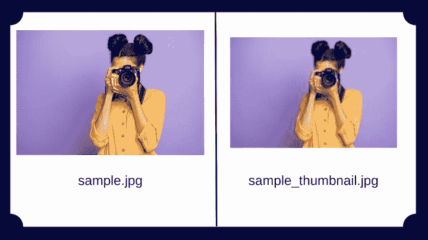
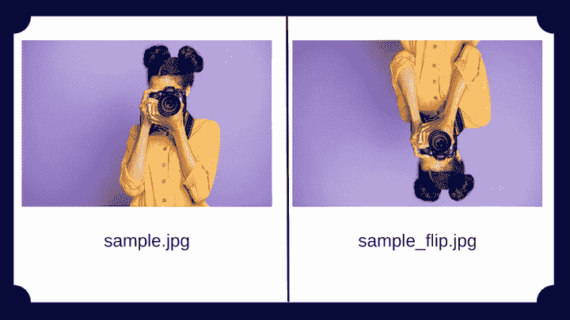
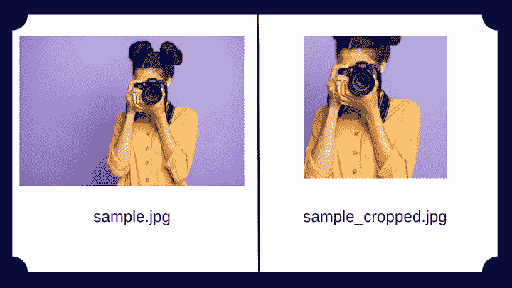
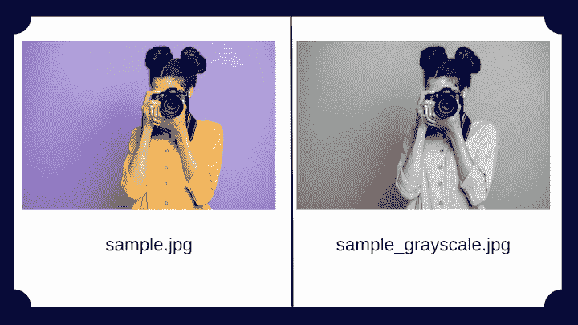
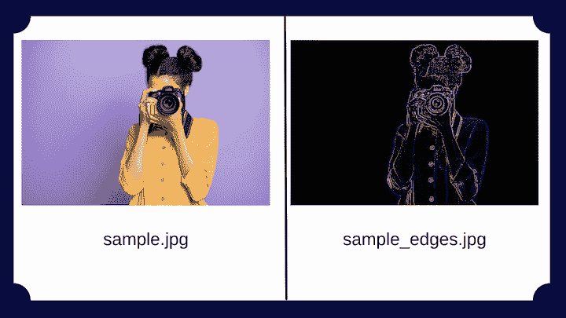

# 使用 Pillow - LogRocket Blog 在 Python 中进行图像处理

> 原文：<https://blog.logrocket.com/image-processing-in-python-using-pillow/>

Python 现在是世界上使用最广泛的编程语言之一。它可以使用简单的语法来执行各种功能和任务。

Python 可以执行的一个重要功能是自动处理数字图像，这可以使用 Pillow 来完成。

在本教程中，我们将向您展示如何使用枕头模块处理图像。然后，我们将更进一步，演示如何实现一些基本的图像操作。

要跟随本教程，您应该对 Python 和安装在本地机器上的 [Python 3 解释器](https://www.python.org/downloads/)有基本的了解。

## 枕头是什么？

Pillow 是 Python 图像库(PIL)的一个分支。这是一个用于操作和处理图像的免费开源库。

PIL 本身就是一个强大的库，但它自 2009 年以来就没有更新过，并且不支持 Python 3。Pillow 为 Python 3 提供了更多的特性和支持。

Pillow 支持一系列图像文件格式，例如。PNG，。JPEG，。PPM，。GIF，。您可以使用这个库对图像执行各种操作，如裁剪、调整大小、添加文本、旋转、灰度缩放等等。

## 安装和项目设置

您可以使用 Python 包的包管理器 [pip](https://pypi.org/project/pip/) 安装 Pillow:

```
python3 -m pip install --upgrade pip
python3 -m pip install --upgrade Pillow

```

Pillow 提供了`Image`对象，该对象具有内置的函数和属性，可以在这些函数和属性上执行操作。

首先，将`I``mage`对象导入 Python 文件。

```
from PIL import Image

```

接下来，通过调用`Image.open()`函数加载图像，该函数返回一个`Image`对象数据类型的值。

```
image = Image.open('sample.jpg')

```

对于我们的示例，我们将使用来自 [Unsplash](https://unsplash.com/s/photos/purple-pictures) 的样本图像。

同样值得注意的是，这些图像与正在运行的 Python 脚本文件位于同一个目录中。

## `Image`对象的属性

为了从图像中获取更多数据，我们可以访问图像的几个属性:

*   `image.width`返回图像的宽度
*   `image.height`返回图像的高度
*   `image.format`返回图像的文件格式(例如，JPEG，。BMP，。PNG 等。)
*   `image.size`返回图像的元组高度和权重
*   `image.palette`返回调色板表，如果存在的话
*   `image.mode`返回图像的像素格式(如 1，L，RGB，CMYK)

## 基本图像操作

我们还能够使用各种操作来处理和操作我们的图像。

对`Image`对象的任何更改都可以用`save()`方法保存到图像文件中。所有的旋转、调整大小、裁剪、绘图和其他图像操作都是通过调用这个`Image`对象来完成的。

让我们放大并更详细地探究其中的一些操作。

### 更改图像格式

Pillow 支持多种图像格式。图像可以从一种格式转换为另一种格式，如下所示:

```
image = Image.open('sample.jpg')
image.save('sample_formatted.png')

```

首先，加载图像。然后，Pillow 看到指定为`PNG`的文件扩展名，因此它将图像转换为。PNG 文件，然后将其保存到文件。

### 创建缩略图

您可以通过使用 Pillow 创建图像的缩略图来调整图像的大小。

使用`thumbnail()`功能，调整图像大小以保持其纵横比。这需要两个值来表示缩略图的最大宽度和最大高度。

```
image = Image.open('sample.jpg')
image.thumbnail((200, 200))
image.save('sample_thumbnail.jpg')

```



然后在最大限度内调整图像大小，以免过度拉伸或模糊。

### 翻转和旋转图像

如果你需要图像面向不同的方向，枕头可以让你翻转它。这是通过使用`transpose`函数完成的，该函数采用以下任何参数:

*   `Image.FLIP_LEFT_RIGHT`，水平翻转图像
*   `Image.FLIP_TOP_BOTTOM`，垂直翻转图像
*   `Image.ROTATE_90`，根据角度将图像旋转一定角度

```
image = Image.open('sample.jpg')

image.transpose(Image.FLIP_TOP_BOTTOM)
image.save('sample_flip.jpg')
```



生成的图像垂直翻转。

或者，您可以使用`rotate()`方法旋转图像。它接受一个表示旋转度数的整数或浮点参数，并返回旋转图像的一个新的`Image`对象。旋转是逆时针的。

```
image = Image.open('sample.jpg')

image.rotate(90)
image.save('image_rotate90.jpg')

```


图像旋转了 90 度。

### 裁剪图像

裁剪图像就是只剪切掉特定的部分。在为 web 应用程序编辑图像时，裁剪经常会发挥作用。

Pillow 中的`crop()`功能要求将该部分裁剪为矩形。该方法采用一个定义裁剪区域的位置和大小的盒子元组，并返回一个表示裁剪图像的`Image`对象。该区域由一个 4 元组定义，其中坐标为(左、上、右、下)。

```
image = Image.open('sample.jpg')

image.crop(200, 50, 450, 300)
image.save('sample_cropped.jpg')

```



在上面的例子中，前两个值代表从左上角开始的位置；第三和第四个值表示从起始位置向右下方的距离，以像素为单位。

裁剪图像的完整大小可以计算为 250×250 像素。

### 颜色转换

有各种形式的像素表示，包括 L(亮度)、RGB 和 CMYK。

Pillow 允许您使用`convert()`方法在不同的像素表示之间转换图像。该库支持每种支持模式之间的转换，以及“L”和“RGB”模式。要在其他模式之间转换，您可能需要使用“RGB”图像。

```
image = Image.open('sample.jpg')

grayscale_image = image.convert('L')
grayscale_image.save('sample_grayscale.jpg')

```



使用转换功能，样本图像从 RGB 转换为 L(亮度)模式，这将产生灰度图像。

### 滤像

修改和增强图像以改善外观的行为称为过滤。

使用 Pillow 中的`ImageFilter`模块，您可以访问 filter()方法并使用各种过滤技术，包括:

*   `BLUR`
*   `CONTOUR`
*   `DETAIL`
*   `EDGE_ENHANCE`
*   `EDGE_ENHANCE_MORE`
*   `EMBOSS`
*   `FIND_EDGES`
*   `SHARPEN`
*   `SMOOTH`
*   `SMOOTH_MORE`

例如，我们来看看`FIND_EDGES`滤镜:

```
from PIL import Image, ImageFilter

image = Image.open('sample.jpg')
edges_image = image.filter(ImageFilter.FIND_EDGES)
edges_image.save('sample_edges.jpg')

```



过滤器处理图像以显示图像的边缘。

可以使用任何可用的滤波器来处理任何图像，以产生所需的输出。

## 用枕头处理图像:一个实际例子

现在我们对这个库有了基本的了解，让我们创建一个简单的 python 脚本来自动处理各种类型的图像。

假设给你一组图像，要求你给每张图像添加一个水印。

要解决这个问题，您可以在与图像相同的文件夹中创建一个名为`script.py`的 Python 文件。

首先，导入所有必需的模块:

```
import os
from PIL import Image

```

Python 中的 OS 模块提供了创建和删除目录以及更改和标识当前目录的功能。

为处理后的图像创建一个目录:

```
os.makedirs('watermarked_images')

```

存储徽标图像的宽度和高度:

```
logo_image = Image.open('watermark_logo.png')
logo_image = logo_image.resize((50, 50))
logo_width, logo_height = logo_image.size

```

将`os.listdir`函数与 for 循环一起使用:

```
for image in os.listdir('./images'):
    try:
    # Separting the filepath from the image's name
       path, filename = os.path.split(image)
       filename = os.path.splitext(filename)[0]

```

打开图像:

```
       image = Image.open('./images/'+image)
#Resizing the image to a set size.
       edited_image = image.resize((300, 300))
#Setting the position for the placement
       width = edited_image.width
       height = edited_image.height

```

使用粘贴功能将徽标放置在图像上:

```
edited_image.paste(logo_image, (width - logo_width, height - logo_height), logo_image)

```

将图像保存在新目录中:

```
  edited_image.save('./watermarked_Images/' + filename + ".jpg")

```

目录中的每个图像都经过处理并添加了水印。这个脚本使我们能够在更短的时间内高效地完成任务。

您也可以查看与本教程相关的完整代码和资源。

## 结论

Pillow 是一个强大的 Python 图像处理库。在本教程中，我们初步了解了如何使用 Pillow 在 Python 中对图像执行基本操作。

如果你想了解更多，请查看官方的[枕头文档](https://pillow.readthedocs.io/en/)。

## 使用 [LogRocket](https://lp.logrocket.com/blg/signup) 消除传统错误报告的干扰

[](https://lp.logrocket.com/blg/signup)

[LogRocket](https://lp.logrocket.com/blg/signup) 是一个数字体验分析解决方案，它可以保护您免受数百个假阳性错误警报的影响，只针对几个真正重要的项目。LogRocket 会告诉您应用程序中实际影响用户的最具影响力的 bug 和 UX 问题。

然后，使用具有深层技术遥测的会话重放来确切地查看用户看到了什么以及是什么导致了问题，就像你在他们身后看一样。

LogRocket 自动聚合客户端错误、JS 异常、前端性能指标和用户交互。然后 LogRocket 使用机器学习来告诉你哪些问题正在影响大多数用户，并提供你需要修复它的上下文。

关注重要的 bug—[今天就试试 LogRocket】。](https://lp.logrocket.com/blg/signup-issue-free)