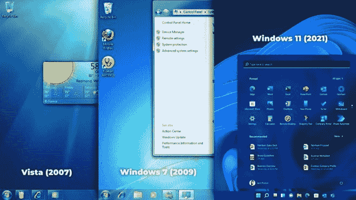
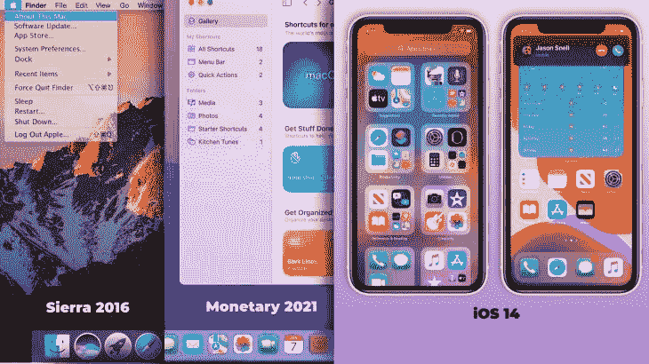
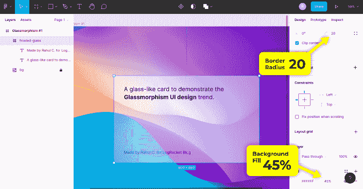
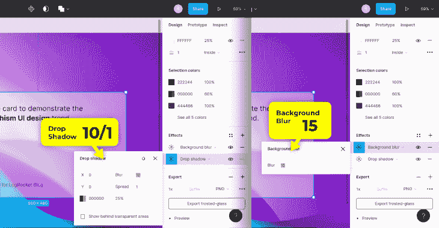
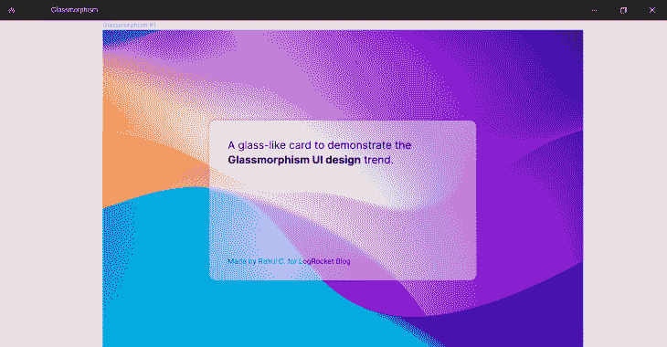
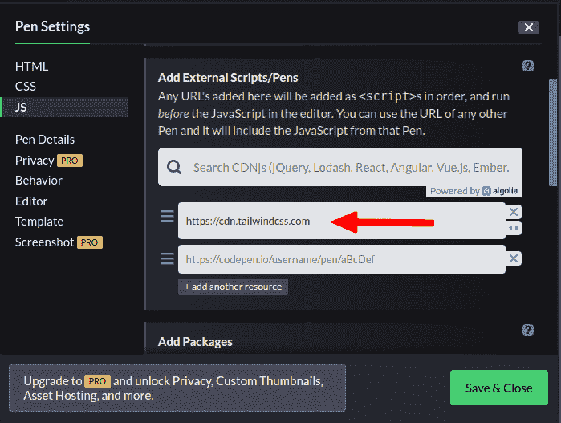

# 如何用 CSS - LogRocket Blog 实现 glassmorphism

> 原文：<https://blog.logrocket.com/implement-glassmorphism-css/>

Glassmorphism 是一种模仿磨砂玻璃外观的 UI 设计趋势。UI 中的元素看起来像是放在玻璃片上，通常设置在对比强烈的背景之上。如果明智地使用，它可以为您的设计增加重要的价值，正如它的使用越来越多所证明的那样。玻璃形态越来越受欢迎，而且可能会持续一段时间。

本教程涵盖了用 CSS 实现 glassmorphism 的理想方法。

### 内容

## 什么是玻璃态？

如果您使用过 macOS、iOS 和 Windows，您以前可能遇到过 glassmorphism，所有这些操作系统都使用了类似 glass 的 UI。这里有一些快速的例子来回顾 glassmorphism，它看起来像什么，以及谁已经实现了它。

Windows Vista 于 2007 年推出，其主菜单、工具栏和窗口边缘都有一个光滑的玻璃般的用户界面。微软在 Windows 7 和 10 中重复了这个概念；而有了 Windows 11，更是进一步强化了这个概念。



苹果的 macOS 在其最新版本中遵循了这一 UI 理念，如 Catalina、Big Sur 和 Monterey。iOS 在相当长的一段时间里也在使用相同的设计理念。



前端 web 开发世界也开始接受 glassmorphism，因为所有现代 web 浏览器最终都支持实现它所需的 CSS 属性。

## 玻璃态射的性质是什么？

让我们通过查看使 UI 元素或对象具有磨砂玻璃外观的不同属性来理解 glassmorphism 的基本概念。

### 半透明

在具有 glassmorphism 效果的对象中，您可以看到它们后面的图像或颜色，但不是完全看到。对象或元素后面的模糊使其无法与主背景融合。这种模糊不仅对保持可读性和可访问性至关重要，而且还提供了光滑的毛玻璃外观。

### 等级制度

Glassmorphism 包括一个阴影效果，它给元素一些提升，使它看起来漂浮在表面上。因此，用户将能够在与 UI 交互时建立深度和层次感。

此外，它的边缘可能会有一些光泽，以支持其玻璃般的外观。

在堆叠或嵌套元素的情况下，最近的对象应该具有更模糊的不透明背景。另一方面，在最远点的那个应该有更多的填充透明度和低背景模糊。

### 背景颜色

一个玻璃状物体的外观在一个普通背景的表面上几乎不会被注意到。它应该放在一个充满活力、色彩丰富或对比鲜明的表面，以最大限度地发挥其毛玻璃外观。

## 在 Figma 中实现玻璃态

我们之前讨论的要点可以帮助我们开发简单的指南来在我们的设计中实现玻璃态。我们将使用这些点在稍后用 [Figma](https://blog.logrocket.com/using-figma-variants-for-better-error-handling-design/) 创建 glassmorphism UIs。

作为一般规则，创建 glassmorphism UI 元素时需要记住五个参数:

1.  充满活力的基底或对比鲜明的背景
2.  对象填充或背景透明度
3.  对象阴影或立面
4.  物体边缘，或发光
5.  对象背景模糊，或“冷若冰霜”的外观

现在我们知道了基础知识，让我们打开 Figma 并实现我们上面讨论的参数。我们将使用 Figma 设计作为稍后在浏览器中使用 CSS 和 HTML 创建内容的蓝图。

### 在 Figma 中创建基本的玻璃形态用户界面

让我们在 Figma 中快速创建一个具有毛玻璃外观的简单卡片。我使用[这张带有渐变网格的彩色图片](https://unsplash.com/photos/E8Ufcyxz514)来保持背景的活力。

接下来，在我们的主背景上添加一个矩形框来放置卡片元素。让我们设置白色为填充颜色，填充透明度为 45。让我们也添加一个半径的角落，使它看起来像一个现代的 UI 元素。



出于演示目的，我还添加了一些文本。确保你设置了**填充**而不是**图层**透明度；这种效果对图层透明度无效。

在边框内添加一个像素将为我们的卡片提供闪亮的边缘。我将它设置为 25 %,给卡片一个微妙的光泽。


我们现在应该添加一个阴影，使它看起来堆叠在背景上。让我们也添加背景模糊，给我们的卡元素一个磨砂玻璃完成。



看起来很完美。这里有一个链接指向[完成的 Figma 文件](https://www.figma.com/file/IukVe5sA8vnRu9RwF196ym/Glassmorphism?node-id=0%3A1)。



现在让我们学习如何用简单的 CSS 在 web 上复制同样的东西。

## 用普通 CSS 实现浏览器中的玻璃态

尽管 glassmorphism 已经存在了相当长的一段时间，但由于浏览器支持不足，web 直到最近才熟悉它。虽然 png 存在，但它们不足以创建灵活的现代设计系统。

有了像`backdrop-filter`这样的 CSS 新增功能，现在可以给网页添加 glassmorphism 效果了。让我们使用 CSS 来实现我们在 Figma 中创建的内容。

### 构建元素

为了简单起见，我将只使用一些 HTML 元素。让我们从一个`div`开始，里面有一些段落标签来处理文本:

```
<div class="card">
  <p>...</p>
</div>

```

在这一点上，我们只关心学习基本的技术来实现网页的效果。我们将在本文后面讨论 UI 细节和装饰。

### 用 CSS 创建一个玻璃形状的元素

让我们从添加背景图片到我们的网页开始。这与我们在上面的 Figma 卡项目中使用的背景相同。

为了更好的演示，我把根字体的尺寸做得大了一点。现在应用`box-sizing` hack 将是避免未来规模问题的明智之举:

```
:root {
  font-size: 20px;
  box-sizing: inherit;
}
*,
*:before,
*:after {
  box-sizing: inherit;
}
body {
  font: 1em/1.618 Inter, sans-serif;
  color: #224;
  background:
    url(path/to/image.format)
    center / cover no-repeat fixed;
}

```

为了我们的卡片的最佳显示，如果身体占据了视窗中所有可用的垂直空间就太好了。为此，将身体的最小高度设置为`100vh` *:*

```
body {
  font: 1em/1.618 Inter, sans-serif;
  color: #224;
  background:
    url(path/to/image.format)
    center / cover no-repeat fixed;
  min-height: 100vh;
}

```

让我们给卡片一些宽度和高度，500 像素乘 300 像素对于类似卡片的布局是理想的。您可以随意选择宽度和高度:

```
.card {
  max-width: 500px;
  height: 300px;
  padding: 35px;
}

```

如果没有颜色，我们的卡片无论大小或内容如何都无法识别。如前所述，让我们添加白色作为背景，填充 45%。

我们将使用 [flexbox](https://blog.logrocket.com/how-to-build-a-basic-flexbox-layout-a-tutorial-with-examples/) 使卡在垂直和水平方向居中:

```
.card {
  max-width: 500px;
  height: 300px;
  padding: 35px;
  display: flex;
  flex-direction: column;
  justify-content: space-between;
  background-color: rgba(255, 255, 255, .45);
}

```

它看起来还不太像浮在水面上。参考 Figma 项目中投影效果的值，让我们为卡片设置一个`box-shadow`属性。

一个 1 像素宽的纯白边框加上 25%的完美透明度很容易为我们的卡片增添一点光彩。让我们也添加一些圆形的角落，就像这样:

```
.card {
  max-width: 500px;
  height: 300px;
  padding: 35px;
  display: flex;
  flex-direction: column;
  justify-content: space-between;
  background-color: rgba(255, 255, 255, .45);
  border-radius: 20px;
  border: 1px solid rgba(255, 255, 255, .25);
  box-shadow: 0 0 10px 1px rgba(0, 0, 0, .25);
}

```

最后，我们将使用`backdrop-filter` CSS 属性对卡片后面的区域应用模糊效果，使其看起来像磨砂玻璃:

```
.card {
  max-width: 500px;
  height: 300px;
  padding: 35px;
  display: flex;
  flex-direction: column;
  justify-content: space-between;
  background-color: rgba(255, 255, 255, .45);
  border-radius: 20px;
  border: 1px solid rgba(255, 255, 255, .25);
  box-shadow: 0 0 10px 1px rgba(0, 0, 0, .25);
  backdrop-filter: blur(15px);
}

```

我们的第一个磨砂玻璃 UI 元素已经准备好了！请看下面的行动；请随意叉笔，并添加您的风格修改。

> 没有描述

### 提高

在上面的演示中，我们将半透明背景(例如，填充 45%的白色)应用于我们的卡片。让我们给我们的对象添加一个背景渐变，这会给卡片增加一点光彩:

```
.card {
  ...
  background: linear-gradient(
    120deg,
    rgba(255, 255, 255, .25),
    rgba(255, 255, 255, .75), 70%, 
    rgba(255, 255, 255, .25)
  );
}

```

> 没有描述

您还可以使用 CSS 渐变背景来创建倾斜的发光效果。[这里有一个例子](https://codepen.io/_rahul/pen/ZEvXWeg)。

我们使用了`backdrop-filter`属性将一个模糊过滤器应用到卡片的背景上。可以在模糊的同时添加更多滤镜，例如饱和度滤镜，以实现不同的效果:

没有描述

```
.card {
  ...
  backdrop-filter:
    blur(15px)
    saturate(1000%);
}

```

> 我们可以进一步删除边界，并添加一个内部阴影，给卡片一个浮雕效果。嵌入框阴影可以帮助我们做到这一点:

没有描述

如果您注意到了，我使用了多个`box-shadow`值，每个值用逗号分隔。它有助于保持常规的投影效果以及新的内部阴影添加。

```
.card {
  ...
  box-shadow:
    inset 4px 4px 5px 0 rgba(255, 255, 255, .25),
    inset -4px -4px 5px 0 rgba(0, 0, 0, 0.125),
    0 0 10px 1px rgba(0, 0, 0, 0.25);
}
```

> 堆叠和嵌套玻璃状元素

正如我们之前讨论的，玻璃形态中最远的对象是最半透明的，并且具有最高的背景模糊度。另一方面，最近的元素在背景中具有较少的不透明度和模糊。

这种调整原则适用于对象的堆叠和嵌套。下面是一个对象堆叠的例子，展示了在实现磨砂玻璃效果时如何进行这些调整。

## 没有描述

对于对象的嵌套，您应该参考[这个示例](https://codepen.io/_rahul/pen/NWXgbRV)，并观察调整与堆叠示例没有任何不同。

带有顺风 CSS 的玻璃形态

> Tailwind CSS 使设计原型变得快速而简单。我们将通过构造一个基于 glassmorphism 的 UI 来看到这一点。假设您知道 Tailwind CSS 是如何工作的，让我们创建一个新的 Tailwind CSS CodePen，并为开发进行设置。

要用 CodePen 设置 Tailwind CSS 开发，请访问 CodePen 网站并创建一个新的笔。在**笔设置**下，点击 **JS** ，添加【https://cdn.TailwindCSS.com】T4 作为外部脚本。保存更改。



## 现在，我们准备在我们的 CodePen 中使用 Tailwind CSS。

我们的目标是基于目前为止我们收集的关于 glassmorphism 的知识，使用 Tailwind CSS 实用程序创建一个漂亮的注册页面。

开始使用 Tailwind CSS 中的组件

我们需要做的第一件事是给正文添加一个背景图片，并设置字体默认值。所有基本级别的重置都已经由 Tailwind CSS 的基本组件负责，由我们在上面添加的 Tailwind CSS 脚本注入:

接下来，添加一个包装元素，它将负责注册表单的绝对居中和填充。它应该应用一些填充，使我们的表单元素远离屏幕边缘。

在下面分享的代码示例中，我使用方括号将相似的实用程序类分组，以便于代码浏览:

### Getting started with a component in Tailwind CSS

将表单元素与带有 flexbox 属性的包装器的绝对中心对齐非常容易。

```
body {
  background: #07c
    url(path/to/image.format)
    center / cover no-repeat fixed;
  font: 1em/1.618 sans-serif;
}

```

只有当我们的包装高度更大时，这种居中对齐才有意义。为了实现这一点，我使用了`min-h-screen`实用程序让包装器使用所有可用的垂直空间作为它的最小高度:

创建表单元素

```
<div
  class="form-wrapper 
         [ p-4 md:p-6 lg:p-8 ]">
  ...
</div>

```

让我们添加一个表单元素，并给它一些宽度、填充和圆角，以获得更整洁的外观:

下一步是给表单元素添加一点白色作为背景色。我用背景渐变工具从上到下绘制了一个半透明的白色渐变。让我们通过使用`backdrop-blur-lg`工具来模糊表单的背景。

`border-solid, border-[1px]`和`border-opacity`实用程序为闪亮的边缘提供像素宽的实心边框。让我们也用`shadow-2xl`工具给表单添加一个阴影。我还使用了`shadow-black/70`不透明度修改器来改变阴影:

```
<div
  class="form-wrapper 
         min-h-screen
         [ p-4 md:p-6 lg:p-8 ]
         [ flex justify-center items-center ]">
  ...
</div>

```

### Creating a form element

是时候给表单添加一些内容了。这里，我们有一个标题和一个描述元素的段落。我还修改了这些字体的颜色、文本大小和间距:

```
<div
  class="form-wrapper ...">
  <form class="signup-form
               max-w-sm
               rounded-2xl
               [ p-8 md:p-10 lg:p-10 ]">
      ...
  </form><!-- .signup-form -->
</div><!-- .form-wrapper -->
```

The next step is to add a tint of white as a background color to our form element. I’ve used the background gradient utilities to draw a translucent white gradient from top to bottom. Let’s also blur the form’s background by using the `backdrop-blur-lg` utility.

接下来，我们将添加两个输入字段来接受电子邮件和密码。这些字段中的每一个都包含在一个带有 SVG 图标的标签中，并做了一些位置调整。输入字段的左边有稍微大一点的空白，以便为图标腾出空间。

```
  <form class="signup-form
               max-w-sm
               rounded-2xl
               text-[#1A2421]
               backdrop-blur-lg
               [ p-8 md:p-10 lg:p-10 ]
               [ bg-gradient-to-b from-white/60 to-white/30 ]
               [ border-[1px] border-solid border-white border-opacity-30 ]
               [ shadow-black/70 shadow-2xl ]">
    ...
  </form>

```

是否添加任何图标由您决定。我使用了来自谷歌字体库的 SVG 图标。您可以添加不同的图标或省去它们。

让我们添加一个带有圆角、填充和一点颜色的提交按钮，该按钮在悬停时也会改变:

```
<form class="signup-form ...">
    <h3 class="mb-1 text-md text-[#1A2421]/80">...</h3>
    <h1 class="mb-6 uppercase font-bold
               [ text-xl md:text-2xl lg:text-2xl ]">...</h1>
    <p class="mb-6
              [ text-sm text-[#1A2421]/70 text-opacity-50 ]">...</p>
</form>

```

创建表单页脚

页脚是可选的，由一个段落元素和三个排列在无序列表中的 SVG 图标组成。同样，我们正在管理与 flexbox 和 gap 属性的一致性:

最终产品:带有顺风 CSS 的 Glassmorphism

我们的 CSS 支持的注册表单已经完成，可以使用了。请看下面的最终产品。

```
<form class="signup-form ...">
  ...
  <label
         for="email"
         class="form-label relative block mb-4 text-black/50 focus-within:text-[#333]">

    <svg class="label-icon 
                transition pointer-events-none
                [ w-6 h-6 ] 
                [ absolute top-1/2 left-3 ] 
                [ transform -translate-y-1/2 ]" ...>
      ...
    </svg>
    <input 
      class="form-input 
             block w-full rounded-lg leading-none
             focus:outline-none placeholder-black/50 
             [ transition-colors duration-200 ] 
             [ py-3 pr-3 md:py-4 md:pr-4 lg:py-4 lg:pr-4 pl-12 ] 
             [ bg-black/20 focus:bg-black/25 ] 
             [ text-[#333] focus:text-black ]" 
      type="email" name="email" id="email" placeholder="Email">
  </label><!-- form-label -->
  ...
  <button
    class="form-input w-full rounded-lg font-bold text-white focus:outline-none
           [ p-3 md:p-4 lg:p-4 ] 
           [ transition-colors duration-500 ] 
           [ bg-blue-800 hover:bg-blue-700 ]">Continue</button><!-- .form-input -->
</form><!-- .signup-form -->

```

### 没有描述

具有玻璃态的黑暗模式

```
<form class="signup-form ...">
  ...
  <div class="form-footer mt-8 text-center">
    <p class="text-xs">...</p>
      <ul class="form-list mt-4 flex justify-center">
      <li class="mx-1">
        <a href="#"
           class="rounded-full bg-[#DB4437] hover:shadow-lg
                  [ transform transition hover:-translate-y-1 ]
                  [ w-10 h-10 ]
                  [ flex justify-center items-center ]">
          <svg class="[ w-3 h-3 ] fill-white" ...>...</svg>
        </a>
      </li>
      ...
    </ul><!-- .form-list -->
  </div><!-- .form-footer -->
</form><!-- .signup-form -->

```

### 用玻璃形态元素实现[黑暗模式](https://blog.logrocket.com/dark-mode-in-react-an-in-depth-guide/)类似于我们已经做的。你唯一需要注意的是可读性和对比度。确保选择不太暗或暗淡的背景，并明智地选择磨砂玻璃的颜色。

没有描述

> 这是另一个深色的玻璃形态 UI 例子,有不同的阴影。

挑战自我

## 此外，如果你正在寻找一个媒体丰富的磨砂玻璃实施，我有你涵盖。你可以认为这是一个任务，并进一步扩展它，使其具有响应性。

没有描述

> 可访问性注释

在设计 glassmorphic 元素时，有几个技巧你应该记住，以确保所有用户都可以访问它们。

首先，因为玻璃形态的物体需要一个生动的表面来工作，它们的主要背景必须足够亮。仔细选择背景图片和颜色是至关重要的，这样一切都是可读和可访问的。

## 在黑暗模式下使用磨砂玻璃效果需要格外小心，因为如果背景太暗，就看不到它。在这种情况下，您可能需要使用高度不透明的白色，而不是黑色。

其次，确保对象背景的填充透明度不会影响其中元素的可读性。

> 第三，避免将`backdrop-filter` CSS 属性应用到基础背景层，因为它会在一些浏览器中无用的玻璃物体上渲染背景滤镜效果，特别是 Chrome。

第四，总是在主背景图片后面加一个纯色。即使主背景图像无法加载，它也能保持 UI 元素的可见性和易用性。这也有助于 UI 的整体 UX。

## 背景 CSS 属性允许你很容易地做到这一点。这里有一个简单的例子:

最后，始终考虑在产品中为 background-filter CSS 属性添加供应商前缀，因为一些浏览器仍然需要带前缀的属性才能运行。这里有更多关于`backdrop-filter`支持的[。](https://caniuse.com/css-backdrop-filter)

结论

当适度使用时，玻璃形态可以增强你的设计，使它们更加生动和现代。在本文中，我们学习了什么是 glassmorphism，如何创建它，以及如何使用它通过 vanilla CSS 和 Tailwind CSS 为 web 创建更好的 ui。

我们还学习了如何在 Figma 中实现一个简单的磨砂玻璃效果，用它我们可以进一步规划我们的 ui，并把它们变成设计系统。

谢谢你一直关注这个教程。如果你遇到了问题或者发现了错误，请在评论中告诉我。

你的前端是否占用了用户的 CPU？

随着 web 前端变得越来越复杂，资源贪婪的特性对浏览器的要求越来越高。如果您对监控和跟踪生产环境中所有用户的客户端 CPU 使用、内存使用等感兴趣，

```
body {
  background:
    #07c /* This color will act as a "fallback" to background-image */
    url(path/to/image.format)
    ...;
}

```

.

## LogRocket 就像是网络和移动应用的 DVR，记录你的网络应用或网站上发生的一切。您可以汇总和报告关键的前端性能指标，重放用户会话和应用程序状态，记录网络请求，并自动显示所有错误，而不是猜测问题发生的原因。

现代化您调试 web 和移动应用的方式— [开始免费监控](https://lp.logrocket.com/blg/css-signup)。

We also learned how to implement a simple frosted glass effect in Figma, with which we can plan our UIs further and turn them into design systems.

Thank you for following this tutorial till the end. If you are stuck or spot a mistake, please let me know in the comments.

## Is your frontend hogging your users' CPU?

As web frontends get increasingly complex, resource-greedy features demand more and more from the browser. If you’re interested in monitoring and tracking client-side CPU usage, memory usage, and more for all of your users in production,

[try LogRocket](https://lp.logrocket.com/blg/css-signup)

.

[](https://lp.logrocket.com/blg/css-signup)[https://logrocket.com/signup/](https://lp.logrocket.com/blg/css-signup)

[LogRocket](https://lp.logrocket.com/blg/css-signup) is like a DVR for web and mobile apps, recording everything that happens in your web app or site. Instead of guessing why problems happen, you can aggregate and report on key frontend performance metrics, replay user sessions along with application state, log network requests, and automatically surface all errors.

Modernize how you debug web and mobile apps — [Start monitoring for free](https://lp.logrocket.com/blg/css-signup).