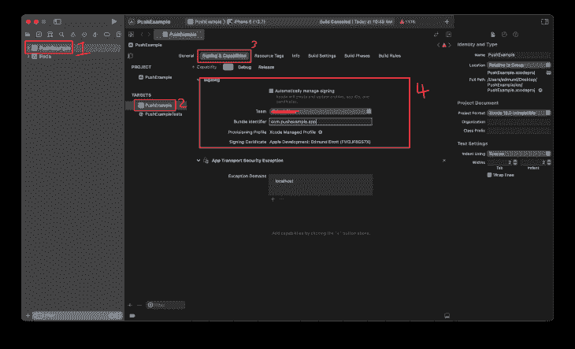
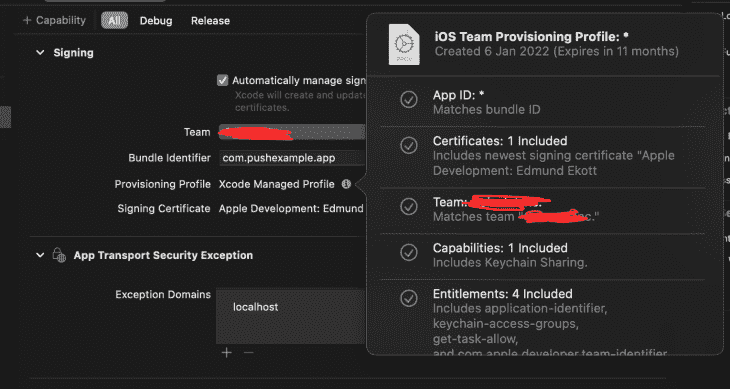
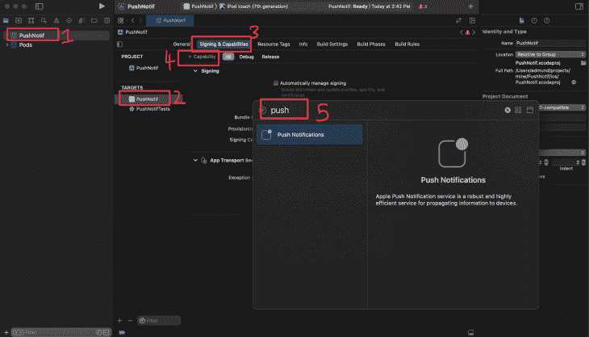
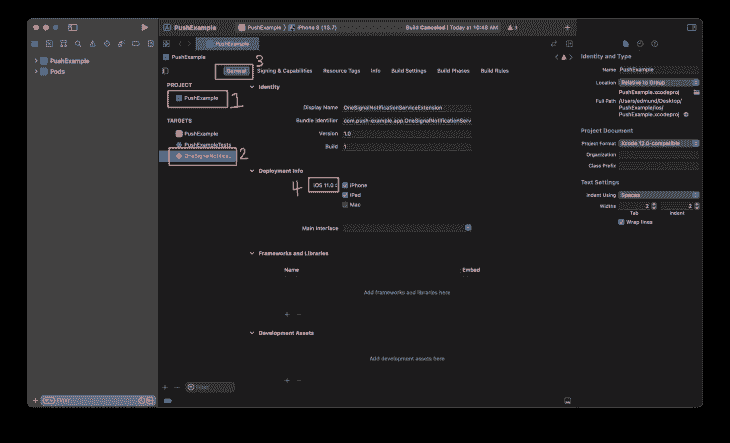
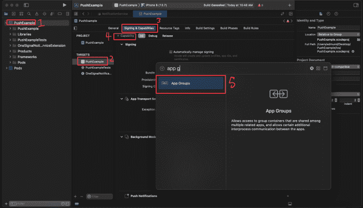
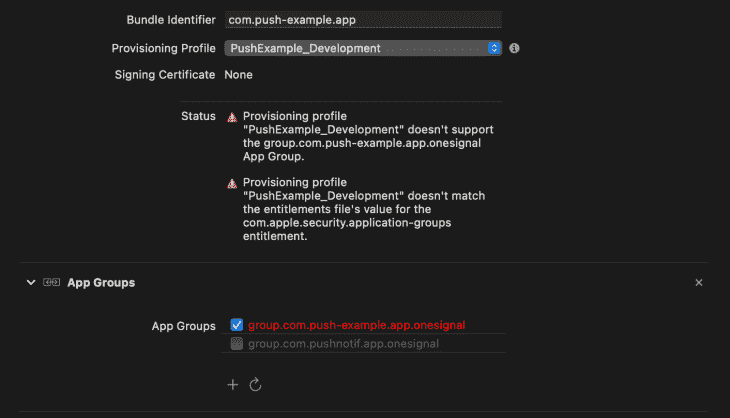
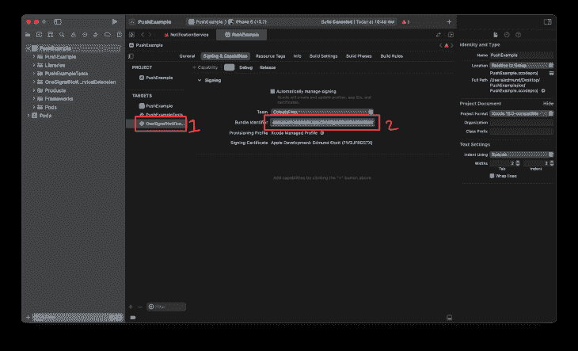
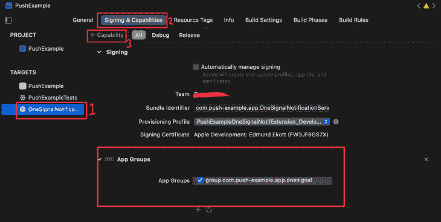

# 在 React Native 中实现推送通知

> 原文：<https://blog.logrocket.com/implement-push-notifications-react-native-onesignal/>

推送通知是由应用程序自动发送到用户手机的消息，即使该应用程序没有打开。它们被用来向用户发送重要的提醒，比如当他们收到一条短信，收到一笔交易，甚至当他们最喜欢的购物应用程序有特别折扣时。

推送通知对于移动应用程序来说是必不可少的，因为它们是与用户沟通的电子邮件的丰富替代品。此外，它们可以提高用户参与度，这对你的应用总是有好处的。

在本文中，我们将通过在 React 本地应用程序示例中实现推送通知，来了解如何在 iOS 和 Android 上为 React 本地应用程序添加推送通知。

## 教程指南

## 先决条件

*   Node.js 和 Yarn 安装在您的本地机器上
*   适用于 iOS 应用程序的 Xcode 12+
*   iOS 9+物理设备(推送通知在模拟器上不起作用)
*   具有管理员角色的 Apple 开发者帐户
*   安装了 Google Play 服务的 Android 4+设备或模拟器
*   煽动性的报道
*   单一信号账户

## 创建新的 React 本机项目

要向一个 [React Native](https://blog.logrocket.com/tag/react-native/) 应用添加推送通知，我们首先需要创建一个。如果您有一个现有的项目，您可以跳到下一节，该节将指导您为 iOS 推送通知设置一个信号。

```
npx react-native init PushExample 

```

上述命令创建了一个名为“PushExample”的新 React Native CLI 项目。

创建项目后，我们需要生成 OneSignal 所需的凭证，以便它可以将消息传递到我们用户的设备。这些凭证是 iOS 推送证书和 Firebase Server API 密钥。

## 为 ios 推送通知设置一个信号

要在 OneSignal 上设置 iOS 平台，我们需要一个`p12` iOS 推送证书。为了创建 iOS 推送证书，我们还需要执行几个步骤。

例如，我们需要更新应用程序的包标识符，并创建一个配置文件，以便启用所需的功能并在开发设备上运行应用程序。我们将在下面的小节中介绍这些需求。

### 创建新的应用 ID 和预置描述文件

首先，打开新创建项目的`ios`文件夹中的`.xcworkspace`文件，并转到**签名&功能**选项卡。

在**签名**部分下，从默认标识符更新**包标识符**，并在**团队**字段下选择您拥有**管理员**角色的适当团队(这仅适用于您启用了 XCode 自动签名的情况)。



通过单击信息图标( **i** )确认新更新的标识符不是作为通配符创建的:



如果应用 ID 与我们之前设置的**捆绑包标识符**完全匹配，您可以跳到[的下一部分](#creating-push-certificate)。

从上面的截图可以看出，标识符是一个通配符，所以我们必须手动创建一个。首先，取消选中 Xcode 中的**自动管理签名**字段。

接下来，转到开发人员中心并删除通配符标识符。然后，转到**标识符**部分创建一个新的标识符。点击加号图标( **+** )开始，选择 **App IDs** 。

在下一页上，选择 **App** ，因为我们将为一个应用程序使用此标识符。

输入描述和唯一的捆绑包 ID(与 Xcode 中的捆绑包标识符相同)。向下滚动到**功能**部分，检查**应用组**和**推送通知**功能。启用这些功能对于使用 Xcode 正确实现推送通知非常重要。


现在，您应该在**标识符**页面上看到新创建的 ID。

接下来，通过单击加号在**配置文件**部分创建一个配置文件。选择您想要创建的配置文件类型(理想情况下，我们想要创建一个 App Store 分发配置文件，但是因为这个应用程序是一个演示，所以我将创建一个 **iOS 应用程序开发**配置文件)。

从下拉列表中选择我们之前创建的标识符。


点击**继续**按钮，选择合适的证书。如果不存在，请按照页面上的指南创建新证书。

当您进入页面命名您的个人资料时，请确保输入一个唯一的名称。建议你遵循这个命名模式:`AppName_ProfileType`。一旦你命名了你的档案，点击**生成**按钮并下载文件。

一旦描述文件下载到您的机器上，返回 Xcode 上的**签名&功能**标签，并从**预置描述文件**字段中选择**导入描述文件**选项。

接下来，选择新创建的概要文件，我们应该准备好创建推送证书了。

> 如果收到捆绑包 id 不匹配的警告，只需在 Xcode 上更新捆绑包标识符，以匹配预置描述文件的标识符。

### 创建推送证书

创建推送证书有两个过程:自动和手动。自动过程并不总是有效，所以如果您遇到工具错误，您可以遵循手动过程。

#### 自动化过程

OneSignal 团队开发了一个名为 [Provisionator](https://onesignal.com/provisionator) 的工具，可以减少创建推送证书的步骤。打开 Provisionator 工具，使用您的 Apple ID 登录，选择我们之前创建的标识符，然后生成证书。

#### 手动过程

要手动生成推送证书，请遵循 OneSignal 文档中的本指南。

### 将推送证书添加到一个信号中

获取证书并前往 OneSignal，在您的帐户上创建一个新的应用程序。务必记下用`p12`文件生成的密码。

暂时选择**苹果 iOS** 作为平台(我们稍后可以启用更多)。在下一页，上传`p12`证书，并输入证书生成的密码。如果您在手动过程中没有设置密码，请忽略密码字段。

上传证书后点击**下一个**按钮，选择 **React Native / Expo** 作为目标 SDK。

继续操作后，您将找到您的 OneSignal 应用 ID 和在 React 本地项目中安装 OneSignal SDK 的指南。

我们以后可以找到所有这些信息，但是现在，我们将为 Android 平台开始一个类似的过程。

## 为 android 推送通知设置一个信号

为了向 Android 设备发送推送通知，我们需要向 OneSignal 添加一个 Firebase Server API 键和一个发送者 id。

首先，我们将创建一个新的 [Firebase](https://blog.logrocket.com/push-notifications-with-react-and-firebase/) 项目。首先点击侧面菜单中的齿轮图标，然后点击**项目设置**链接。

在**云消息**标签中，你会找到**服务器密钥**和**发送者 ID** 。

要在 OneSignal 上完成 Android 平台设置，请进入您的应用程序的**设置**页面，然后进入**平台**，然后进入**谷歌 Android** 。

将 Firebase 中的服务器密钥和发送者 ID 粘贴到字段中，并点击**保存**。选择 **React Native / Expo** ，你应该会再次看到你的应用 ID。

## 配置 react native one 信号 sdk

我们已经能够为两个平台生成必要的凭证，并将它们添加到 OneSignal，现在我们希望在项目中配置 SDK，并在我们的设备上安装应用程序以进行测试。

用 Yarn 或 npm 安装 SDK，如下所示:

```
yarn add react-native-onesignal

```

如果您现有的项目是世博会管理的项目，请使用 [OneSignal Expo 插件](https://github.com/OneSignal/onesignal-expo-plugin):

```
expo install onesignal-expo-plugin

```

如果您的项目使用 React Native v0.59 和更低版本，您需要使用下面的命令手动链接包:

```
react-native link react-native-onesignal

```

对于 React 本机 CLI 项目(就像这个项目一样)，接下来的步骤是必不可少的。

### 使用 Gradle 设置 Android 项目

将下面的代码片段添加到`android/app/build.gradle`文件的顶部:

```
buildscript {
    repositories {
        gradlePluginPortal()
    }
    dependencies {
        classpath 'gradle.plugin.com.onesignal:onesignal-gradle-plugin:[0.12.10, 0.99.99]'
    }
}

apply plugin: 'com.onesignal.androidsdk.onesignal-gradle-plugin'

```

### 使用 Cocoapods 和 Xcode 设置 iOS 项目

首先在您的终端中运行以下命令:

```
cd ios && pod install

```

安装完 pods 后，在 Xcode 中打开 React 原生项目的`/ios`文件夹中的`.xcworkspace`文件。

点击**签约&能力**选项卡下的 **+能力**按钮，添加推送通知能力。



再次点击 **+能力**按钮，开启**背景模式**能力。添加后，检查**远程通知**选项。这将使我们的应用程序在后台接收推送通知。

接下来，我们将添加一个通知服务扩展，以便我们的应用程序可以接收带有图像和按钮的推送通知。

在 Xcode 中，进入**文件** > **新建** > **目标…** ，选择**通知服务扩展**，然后按**下一步**。

输入“onesignaltonificationserviceextension”作为产品名称，并填写其他字段。
记下所选语言，完成后点击**完成**按钮。不要在下一个对话框中按**激活**！

相反，按下对话框上的**取消**。点按“取消”会让 Xcode 继续调试我们的应用程序，而不是这个新创建的扩展。

接下来，我们需要更改通知服务扩展的部署目标，以支持尽可能多的旧 iOS 版本。

打开**onesignaltonificationserviceextension**目标下的 **General** 选项卡，将部署目标更改为 **iOS 11** 。



在默认的代码编辑器中，将下面的代码片段粘贴到`ios`文件夹的`Podfile`中。它应该低于主要目标:

```
# main target
target 'PushExample' do
end

# copy from here
target 'OneSignalNotificationServiceExtension' do
  pod 'OneSignalXCFramework', '>= 3.0', '< 4.0'
end

```

粘贴代码片段后，关闭 Xcode，在`ios`目录下再次运行`pod install`。

接下来，在 Xcode 中再次打开`.xcworkspace`文件，项目打开后，在项目导航器中检查`OneSignalNotificationServiceExtension`文件夹。您应该会看到一个`NotifiicationService.swift`文件或一个`NotificationService.m`文件，这取决于我们之前创建通知服务扩展时所选择的语言。

如果文件是一个`NotificationService.swift`文件，用下面的代码替换内容:

```
// 
//  NotificationService.swift
//  OneSignalNotificationServiceExtension
//

import UserNotifications

import OneSignal

class NotificationService: UNNotificationServiceExtension {

    var contentHandler: ((UNNotificationContent) -> Void)?
    var receivedRequest: UNNotificationRequest!
    var bestAttemptContent: UNMutableNotificationContent?

    override func didReceive(_ request: UNNotificationRequest, withContentHandler contentHandler: @escaping (UNNotificationContent) -> Void) {
        self.receivedRequest = request
        self.contentHandler = contentHandler
        self.bestAttemptContent = (request.content.mutableCopy() as? UNMutableNotificationContent)

        if let bestAttemptContent = bestAttemptContent {
            //If your SDK version is < 3.5.0 uncomment and use this code:
            /*
            OneSignal.didReceiveNotificationExtensionRequest(self.receivedRequest, with: self.bestAttemptContent)
            contentHandler(bestAttemptContent)
            */

            /* DEBUGGING: Uncomment the 2 lines below to check this extension is excuting
                          Note, this extension only runs when mutable-content is set
                          Setting an attachment or action buttons automatically adds this */
            //OneSignal.setLogLevel(.LL_VERBOSE, visualLevel: .LL_NONE)
            //bestAttemptContent.body = "[Modified] " + bestAttemptContent.body

            OneSignal.didReceiveNotificationExtensionRequest(self.receivedRequest, with: bestAttemptContent, withContentHandler: self.contentHandler)
        }
    }

    override func serviceExtensionTimeWillExpire() {
        // Called just before the extension will be terminated by the system.
        // Use this as an opportunity to deliver your "best attempt" at modified content, otherwise the original push payload will be used.
        if let contentHandler = contentHandler, let bestAttemptContent =  bestAttemptContent {
            OneSignal.serviceExtensionTimeWillExpireRequest(self.receivedRequest, with: self.bestAttemptContent)
            contentHandler(bestAttemptContent)
        }
    }

}

```

如果它是一个`NotificationService.m`文件，这意味着所选择的语言是 Objective-C，用下面的内容替换它:

```
//  NotificationService.m
//  OneSignalNotificationServiceExtension
#import <OneSignal/OneSignal.h>

#import "NotificationService.h"

@interface NotificationService ()

@property (nonatomic, strong) void (^contentHandler)(UNNotificationContent *contentToDeliver);
@property (nonatomic, strong) UNNotificationRequest *receivedRequest;
@property (nonatomic, strong) UNMutableNotificationContent *bestAttemptContent;

@end

@implementation NotificationService

- (void)didReceiveNotificationRequest:(UNNotificationRequest *)request withContentHandler:(void (^)(UNNotificationContent * _Nonnull))contentHandler {
    self.receivedRequest = request;
    self.contentHandler = contentHandler;
    self.bestAttemptContent = [request.content mutableCopy];

    //If your SDK version is < 3.5.0 uncomment and use this code:
    /*
    [OneSignal didReceiveNotificationExtensionRequest:self.receivedRequest
                       withMutableNotificationContent:self.bestAttemptContent];
    self.contentHandler(self.bestAttemptContent);
    */

    /* DEBUGGING: Uncomment the 2 lines below and comment out the one above to ensure this extension is excuting
                  Note, this extension only runs when mutable-content is set
                  Setting an attachment or action buttons automatically adds this */
    // NSLog(@"Running NotificationServiceExtension");
    // self.bestAttemptContent.body = [@"[Modified] " stringByAppendingString:self.bestAttemptContent.body];

    // Uncomment this line to set the default log level of NSE to VERBOSE so we get all logs from NSE logic
    //[OneSignal setLogLevel:ONE_S_LL_VERBOSE visualLevel:ONE_S_LL_NONE];
    [OneSignal didReceiveNotificationExtensionRequest:self.receivedRequest
                       withMutableNotificationContent:self.bestAttemptContent
                                   withContentHandler:self.contentHandler];
}

- (void)serviceExtensionTimeWillExpire {
    // Called just before the extension will be terminated by the system.
    // Use this as an opportunity to deliver your "best attempt" at modified content, otherwise the original push payload will be used.

    [OneSignal serviceExtensionTimeWillExpireRequest:self.receivedRequest withMutableNotificationContent:self.bestAttemptContent];

    self.contentHandler(self.bestAttemptContent);
}

@end

```

如果您遇到任何构建错误，一旦我们将 OneSignal 库导入到我们的`.js`文件中，这些错误就会得到解决。

在我们开始使用 SDK 之前，还有一个步骤需要完成:添加应用程序组功能。在我们的例子中，应用程序组功能将使我们的 iOS 应用程序能够显示徽章，并在仪表板上看到已确认的交付，用于分析目的。

再次回到主 app 的目标，进入**签约&能力**然后点击 **+能力**添加一个 **App 组**能力。



点击 **App Groups** 功能下的加号按钮，在打开的对话框中，将容器名称设置为“group。yourpbundleidentifier . one signal "。“YOURAPPBUNDLEIDENTIFIER”正是我们之前创建的那个。

一旦创建了您的容器，并且如果您之前手动创建了配置文件，您将得到如下所示的警告:



这是因为我们还没有在开发者中心的应用标识符下配置**应用组**功能。

为此，从标识符页面打开你的应用的标识符，并点击**应用组**功能上的**配置**按钮。

点击**注册应用组**按钮，或者创建一个新的应用组标识符，如果您已经有一个不同项目的现有应用组。

为我们正在创建的应用程序群组设定描述，然后输入我们之前在 Xcode 中创建的应用程序群组的准确标识符。点击**继续**完成注册。

接下来，返回到标识符，单击应用程序组功能的**配置**按钮，然后选择新注册的应用程序组。

当您尝试更新这些功能时，您会收到一条警告，提示您需要重新生成预置描述文件，因为它将被视为无效。点击**确认**。

现在，转到**配置文件**页面，您应该看到配置文件现在无效了。

删除该概要文件，并按照前面的步骤创建一个与您刚刚删除的概要文件完全相同的概要文件。

下载新生成的描述文件，并再次导入 Xcode。导入配置文件后，单击应用程序组功能下的刷新图标进行同步。

接下来，转到**OneSignalNotificationServiceExtension**目标。我们需要重复一些我们之前做过的事情。

如果 Xcode 不自动管理签名，请按照以下步骤操作:

首先，从这里复制包标识符，并在开发者中心的**标识符**下创建一个新的应用 ID。



启用功能下的**应用程序组**，并确保设置捆绑包 ID 以匹配 Xcode 中**OneSignalNotificationExtension**的捆绑包标识符。

一旦创建了标识符，再次打开它，并配置**应用程序组**功能，以启用之前的“推送示例应用程序组”(或您命名的任何内容)。

其次，为**OneSignalNotificationServiceExtension**创建一个配置文件。步骤和我们之前做的一模一样。下载配置文件，并将其导入到**签名&功能**下。

最后，为通知服务扩展添加应用程序组功能，并检查我们为应用程序 ID 启用的应用程序组。



## 在我们的 javascript 中初始化一个信号 sdk

在编辑器中打开 React 本地项目，并将下面的代码片段粘贴到`index.js`文件中:

```
import OneSignal from 'react-native-onesignal';

//OneSignal Init Code
OneSignal.setLogLevel(6, 0);
OneSignal.setAppId("YOUR_ONESIGNAL_APP_ID");
//END OneSignal Init Code

//Prompt for push on iOS
OneSignal.promptForPushNotificationsWithUserResponse(response => {
  console.log("Prompt response:", response);
});

//Method for handling notifications received while app in foreground
OneSignal.setNotificationWillShowInForegroundHandler(notificationReceivedEvent => {
  console.log("OneSignal: notification will show in foreground:", notificationReceivedEvent);
  let notification = notificationReceivedEvent.getNotification();
  console.log("notification: ", notification);
  const data = notification.additionalData
  console.log("additionalData: ", data);
  // Complete with null means don't show a notification.
  notificationReceivedEvent.complete(notification);
});

//Method for handling notifications opened
OneSignal.setNotificationOpenedHandler(notification => {
  console.log("OneSignal: notification opened:", notification);
});

```

初始化完成后，运行您的应用程序，您应该会看到一个提示，提示“您的应用程序”将向您发送推送通知。

请注意，iOS 模拟器无法接收推送通知，因此您必须在物理 iOS 设备上运行该应用程序。

## 发送测试推送通知

如果您在 OneSignal dashboard 中的**观众** > **所有用户**下查看您的应用，您将会看到订阅推送通知的所有活动设备。

前往**消息**选项卡，发送您的第一条推送通知；您应该会在您的设备上收到通知。最棒的是，您可以在 OneSignal 仪表盘上看到所有指标。

## 结论

这篇文章是一个快速指南，介绍如何使用 OneSignal 将推送通知添加到 React 原生移动应用程序中。您可能还想做更多的事情，比如设置[外部用户 id](https://documentation.onesignal.com/docs/external-user-ids)以便向特定用户发送通知。了解更多您可以在 [OneSignal 文档中利用的功能。](https://documentation.onesignal.com/docs)

## [LogRocket](https://lp.logrocket.com/blg/react-native-signup) :即时重现 React 原生应用中的问题。

[](https://lp.logrocket.com/blg/react-native-signup)

[LogRocket](https://lp.logrocket.com/blg/react-native-signup) 是一款 React 原生监控解决方案，可帮助您即时重现问题、确定 bug 的优先级并了解 React 原生应用的性能。

LogRocket 还可以向你展示用户是如何与你的应用程序互动的，从而帮助你提高转化率和产品使用率。LogRocket 的产品分析功能揭示了用户不完成特定流程或不采用新功能的原因。

开始主动监控您的 React 原生应用— [免费试用 LogRocket】。](https://lp.logrocket.com/blg/react-native-signup)