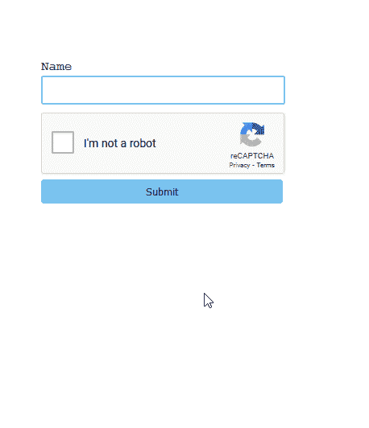
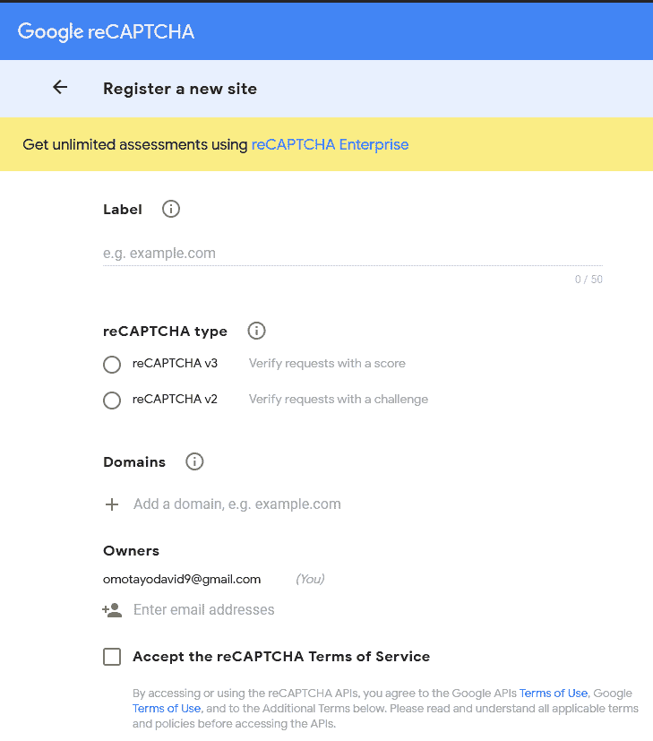
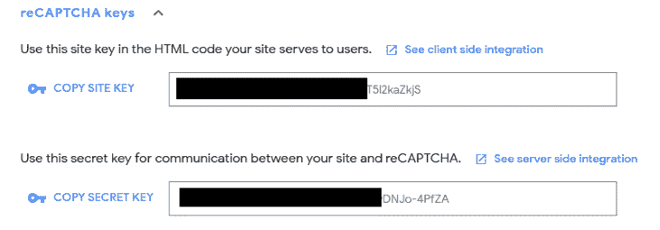
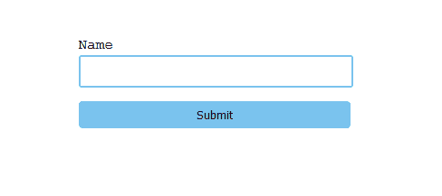
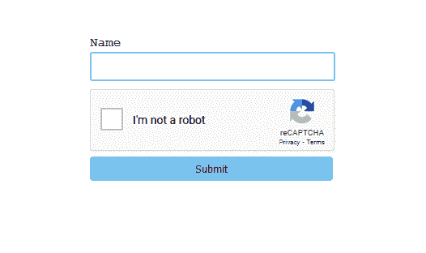
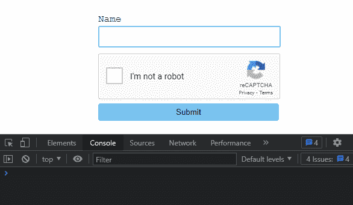
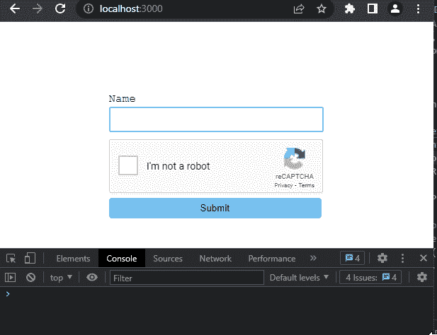

# 如何在 React 应用程序中实现 reCAPTCHA

> 原文：<https://blog.logrocket.com/implement-recaptcha-react-application/>

在本文中，我们将演示如何在 React 应用程序中实现 [reCAPTCHA v2](https://developers.google.com/recaptcha) ，以及如何在 Node.js 后端验证用户令牌。

*向前跳转:*

## 先决条件

要理解本文教程部分中的示例，您应该具备以下基础知识:

*   React 及其概念
*   使用 Node.js 和 Express.js 创建服务器
*   HTTP 请求

## 什么是验证码？

CAPTCHA(区分计算机和人类的全自动公共图灵测试)是一种挑战-响应安全措施，旨在区分真实的网站用户和自动用户，如机器人。

许多 web 服务使用验证码来帮助防止未经授权和非法的活动，如垃圾邮件和密码解密。验证码要求用户完成一个简单的测试，证明他们是人而不是机器人，然后才允许他们访问敏感信息。

## 什么是 reCAPTCHA？

有几种类型的验证码系统，但最广泛使用的系统是 reCAPTCHA，谷歌的一个工具。Luis von Ahn 是 Duolingo 的联合创始人，[在 2007 年](https://digital.hbs.edu/platform-digit/submission/recaptcha-the-brilliant-business-model-that-only-one-man-could-create/)创建了这个工具，目前有超过 600 万个网站在使用它，包括 BBC、彭博和脸书。

reCAPTCHA 的第一个版本由随机生成的扭曲的字母和数字字符序列以及一个文本框组成。


[https://developers.google.com/recaptcha/old/docs/customization](https://developers.google.com/recaptcha/old/docs/customization)

要通过测试，用户需要去掉扭曲的字符并将它们键入文本框。虽然计算机能够创建图像和产生响应，但它们不能像人一样阅读或解释信息来通过测试。

reCAPTCHA 为用户的每个请求生成一个响应令牌，并将其发送给 Google 的 API 进行验证。API 返回一个分数来确定用户是人类还是自动化程序。

reCAPTCHA 目前有两个工作版本:v2 和 v3。虽然 v3 是 reCAPTCHA 的最新版本(2018 年发布)，但大多数网站仍然使用 2014 年发布的 reCAPTCHA v2。

reCAPTCHA v2 有两种变体:复选框和不可见。复选框变体，也被称为“我不是机器人”，是最受欢迎的。这种变体的一个选项是显示一个 checkbox 小部件，用户可以与之交互来验证他们的身份。


不可见的变体显示一个 reCAPTCHA 标记，表示该服务正在后台运行。

在某些情况下，用户的行为引发了怀疑，reCAPTCHA v2 将提供一个挑战，用户必须通过才能证明他们不是机器人。



## 在 React 中实现 reCAPTCHA

现在我们已经了解了 reCAPTCHA 是什么，让我们看看如何在 React 应用程序中实现它。但是首先，我们需要在 Google reCAPTCHA 控制台中为我们的应用程序注册一个 API 密钥。密钥对由两个密钥组成:站点密钥和秘密密钥。

站点密钥调用我们应用程序中的 reCAPTCHA 服务。秘密密钥验证用户的响应。它通过授权我们的应用后端和 reCAPTCHA 服务器之间的通信来做到这一点。

在这里创建您的密钥对[。](https://www.google.com/recaptcha/admin/create)

首先，你需要用你的谷歌账户登录。然后，您将被重定向到管理控制台。接下来，您将填写页面上的注册表单来生成您站点的密钥对。



注册相当简单，但是为了清楚起见，我将解释每个表单字段的含义以及如何填写每个字段。

### 密钥对注册

#### 标签

对于标签字段，提供一个名称以帮助您识别您正在创建的密钥对的用途。如果您的帐户设置了多个密钥对，标签将帮助您区分它们。

#### 类型

类型选择器指的是您希望在站点上使用的 reCAPTCHA 版本。您可以选择 v3 或 v2。因为本教程将只涵盖 v2 实现，所以继续选择 v2 和“我不是机器人”变体。

#### 域

“域”字段是您设置将与 reCAPTCHA 一起使用的域名的地方。如果您的项目仍在开发中，您可以输入有效的域名或“localhost”，然后单击 **+** 添加域。

#### 物主

在所有者字段中，您可以向其他人提供对应用程序 reCAPTCHA 的访问权限。默认情况下，您将是所有者，但您可以通过提供他们的 Google 电子邮件来添加更多个人。

完成表单字段后，选中必要的框并点击**提交**。

现在，您应该能够看到您的站点密钥和秘密密钥了。它们看起来与此处所示的类似:



接下来，我们将建立一个 React 示例项目，并使用我们刚刚创建的密钥对实现 reCAPTCHA。

## 设置一个示例 React 项目

为了用 reCAPTCHA 验证用户的输入，我们需要一个能与 Google 的 API 通信的服务器。所以我们在建立项目时需要记住这一点。

首先，创建一个文件夹。对于这个示例项目，我将把文件夹命名为`react-node-app`，但是您可以使用自己选择的不同名称。

* * *

### 更多来自 LogRocket 的精彩文章:

* * *

接下来，在首选 IDE 中打开该文件夹，并运行以下命令:

```
npm init -y

```

这将创建一个`package.json`文件，帮助我们管理我们的依赖关系并跟踪我们的脚本。

通过在终端中键入以下命令，使用`create-react-app`引导 React 应用程序:

```
npx create-react-app my-app

```

该命令将在`react-node-app`文件夹中创建一个`my-app`文件夹，并将在`my-app`文件夹中安装 React。

安装完成后，打开`my-app`文件夹，清理掉项目文件夹中不必要的样板代码和文件，然后在`src`文件夹中创建一个`Form.js`组件。

接下来，将下面的代码添加到表单组件中，并将其导入到`App.js`主组件中。

```
const Form = () =>{

    return(
        <form>
            <label htmlFor="name">Name</label>
                <input type="text" id="name" className="input"/>
            <button>Submit</button>
        </form>
    )
}

export default Form

```

上面的代码是一个简单的登录表单，有一个`input`元素和一个`Submit`按钮。

没有必要设计表单组件的样式，但是如果您想增加一点趣味，可以在项目文件夹的`App.css`文件中添加下面的 CSS 代码。

```
.input{
  width: 295px;
  height: 30px;
  border: rgb(122, 195, 238) 2px solid;
  display: block;
  margin-bottom: 10px;
  border-radius: 3px;
}

.input:focus{
  border: none;
}

label{
  display: block;
  margin-bottom: 2px;
  font-family: 'Courier New', Courier, monospace;
}

button{
  padding: 7px;
  margin-top: 5px;
  width: 300px;
  background-color: rgb(122, 195, 238);
  border: none;
  border-radius: 4px;
}

```

现在，在终端中用命令`npm start`启动开发服务器。

您应该会在浏览器上看到类似如下的表单:



***N.B.** 在制作类似的东西时，建议使用支持 SSR(服务器端渲染)的框架，像 Next.js 或者 Remix。*

### 安装`react-google-recaptcha`

`react-google-recaptcha`库支持在 React 中集成 Google reCAPTCHA v2。该包提供了一个组件，在 React 中借助有用的道具简化了处理和渲染 reCAPTCHA 的过程。

要安装`react-google-recaptch` a，请键入并运行以下命令:

```
npm install --save react-google-recaptcha

```

### 添加 reCAPTCHA

安装`react-google-recaptcha`后，转到`form.js`组件文件并导入它，就像这样:

```
import reCAPTCHA from "react-google-recaptcha"

```

现在将`reCAPTCHA`组件添加到表单中，就在`Submit`按钮之前或之后。组件的位置是可选的，reCAPTCHA 小部件将出现在呈现时表单中放置`reCAPTCHA`组件的任何地方。

```
<form >
            <label htmlFor="name">Name</label>
                <input type="text" id="name" className="input"/>
                <reCAPTCHA />
            <button>Submit</button>
</form>

```

如前所述，`reCAPTCHA`组件接受几个道具。然而，`sitekey`道具是我们渲染组件所需的唯一道具。这个道具方便了我们之前从 reCAPTCHA 密钥对生成的站点密钥和`reCAPTCHA`组件之间的连接。

以下是`reCAPTCHA`组件的其他可选道具:

*   `theme`:将小工具的主题更改为`light`或`dark`
*   `size`:改变验证码的大小或类型
*   `onErrored`:如果测试返回一个错误，触发一个回调函数
*   `badge`:改变加盖徽章的位置(`bottomright`、`bottomleft`或`inline`)
*   `ref`:用于访问组件实例 API

```
<reCAPTCHA
sitekey={process.env.REACT_APP_SITE_KEY}
/>
```

这里我们向`reCAPTCHA`组件添加了一个`sitekey` prop，并通过 reCAPTCHA 站点键向其传递一个环境变量。

要在您的项目中做同样的事情，在项目的根文件夹中创建一个`.env`文件。接下来，将以下代码添加到文件中:

```
/*.env*/
REACT_APP_SECRET_KEY = "Your secret key"
REACT_APP_SITE_KEY = "your site key"

```

这样，您可以在应用程序中安全地使用您的密钥，方法是在需要的地方引用变量名。

现在，如果保存您的代码并转到浏览器，reCAPTCHA 框应该出现在代码中 reCAPTCHA 组件所在的位置。在本例中，它出现在提交按钮之前。



每次验证后，我们需要重置 reCAPTCHA 以进行后续检查。为了实现这一点，我们需要向`reCAPTCHA`组件添加一个`ref`道具。

要使用`ref`道具，首先，从 React 导入`useRef`钩子:

```
import React, { useRef } from 'react';

```

接下来，将`ref`值存储在一个变量中，如下所示:

```
const captchaRef = useRef(null)

```

然后，将`ref`道具添加到`reCAPTCHA`组件，并将其传递给`captchaRef`变量:

```
<reCAPTCHA
sitekey={process.env.REACT_APP_SITE_KEY}
ref={captchaRef}
/>

```

以下是到目前为止我们的`Form`组件中的全部代码:

```
import reCAPTCHA from "react-google-recaptcha"

const Form = () =>{
    return(
            <form>
                <label htmlFor="name">Name</label>
                    <input type="text" id="name" className="input"/>
                    <reCAPTCHA
                    sitekey={process.env.REACT_APP_SITE_KEY} 
                    ref={captchaRef}
                    />
                <button>Submit</button>
            </form>
    )
}
export default Form

```

现在我们有了一个可以工作的小部件，我们只需要完成三个步骤就可以让 reCAPTCHA 正常工作了:

1.  从`reCAPTCHA`组件获取响应令牌
2.  重置`reCAPTCHA`组件以进行后续检查
3.  在后端验证响应令牌

### 获取响应令牌

我们还可以使用`ref`属性从我们的 reCAPTCHA 中获取生成的令牌。我们所要做的就是用下面的代码获取`ref`的值:

```
const token = captchaRef.current.getValue();

```

### 为后续检查重置 reCAPTCHA

如果我们将上述代码添加到表单组件中，实际上会导致错误。这是因为`ref`的值仍然为空，因为 reCAPTCHA 处于未检查状态。为了解决这个问题，我们将在表单中添加一个`onSubmit`事件处理程序，其中包含一个封装代码的函数:

```
const handleSubmit = (e) =>{
        e.preventDefault();
        const token = captchaRef.current.getValue();
        captchaRef.current.reset();
    }

return(
        <form onSubmit={handleSubmit} >
            …
        </form>
    )    

```

在上面的代码中，我们创建了一个`handleSubmit`函数。在这个函数中，我们添加了用于从 reCAPTCHA 获取响应令牌的`token`变量，以及在每次提交表单时重置 reCAPTCHA 的代码。

这样，当点击提交按钮时，`getValue()`方法将只尝试获取 ref 的值，即响应标记。

现在，如果您将`token`变量记录到控制台，选中 reCAPTCHA 框，并提交表单，您应该会在控制台中看到一个类似于下面的响应标记:



### 验证 Node.js 后端中的令牌

我们在上一节中生成的令牌只在两分钟内有效，这意味着我们需要在它过期之前验证它。为此，我们需要设置应用程序的后端，并将令牌发送给 Google 的 API 来检查用户的分数。

#### 设置 Node.js 后端

要设置 Node.js 服务器，请导航回`react-node-app`文件夹，创建一个新文件夹，并将其命名为`server`。在`server`文件夹中，创建一个新文件，命名为`index.js`。这个文件将作为我们的节点应用程序的入口点。

接下来，将 cd 放入`server`文件夹，并运行以下命令来安装 Express.js 和 Axios:

```
npm i express axios dotenv --save

```

现在，在`index.js`文件中添加以下代码:

```
const express = require("express");
const router = express.Router();
const app = express();
const cors = require('cors');
const axios = require('axios');
const dotenv = require('dotenv').config()
const port = process.env.PORT || 2000;

//enabling cors
app.use(cors());

//Parse data
app.use(express.json());
app.use(express.urlencoded({extended: true}));

//add router in express
app.use("/", router);

//POST route
router.post("/post", async (req, res) => {
//Destructuring response token from request body
    const {token} = req.body;

//sends secret key and response token to google
    await axios.post(
      `https://www.google.com/recaptcha/api/siteverify?secret=${process.env.SECRET_KEY}&response=${token}`
      );

//check response status and send back to the client-side
      if (res.status(200)) {
        res.send("Human 👨 👩");
    }else{
      res.send("Robot 🤖");
    }
});

app.listen(port, () =>{
    console.log(`server is running on ${port}`);
});

```

在上面的代码中，我们设置了一个 Express 服务器，并为`/post`路由创建了一个`POST` API 端点。在端点函数内部，我们析构了请求体，以获取将从客户端发送的`token`数据。

然后我们创建了一个对 Google API 的`axios.post`请求，我们的`SECRET_KEY`作为环境变量传入，还有来自客户端的`token`。

要在 Node.js 中设置环境变量，请回到`react-node-app`文件夹并运行以下命令:

```
npm install dotenv --save

```

安装后，在`react-node-app`文件夹中创建一个`.env`文件，打开该文件，然后添加您站点的密钥。

在`axios.post`请求下面是一个`if`语句，它检查 API 返回的响应的状态，并将其发送到客户端。

好了，我们继续。导航回`react-node-app`文件夹，打开`package.json`文件，并用以下内容替换脚本命令:

```
…
"scripts": {
  "start": "node server/index.js"
},
…

```

当我们在终端中运行时，上面的代码将让我们使用`npm start`命令启动我们的服务器。

保存项目。然后，转到您的终端，打开一个新的终端标签，cd 到`server`文件夹，并通过运行`npm start`启动服务器。

#### 检查用户的分数

接下来，我们将从客户端(React app)向我们的服务器发送一个`axios.post`请求，将生成的令牌作为数据。

为此，导航回 React 应用程序，并将以下代码粘贴到我们之前创建的`handleSubmit`函数中:

```
 const handleSubmit = async (e) =>{
        e.preventDefault();

        const token = captchaRef.current.getValue();
        captchaRef.current.reset();

        await axios.post(process.env.REACT_APP_API_URL, {token})
        .then(res =>  console.log(res))
        .catch((error) => {
        console.log(error);
        })
    }

```

这段代码是一个`axios.post`请求，它将生成的令牌从 reCAPTCHA 发送到 Node.js 后端。

如果您保存代码并运行应用程序，您应该会看到一个 reCAPTCHA 表单，如下所示:



## 使用`reaptcha`包装器

react.captcha (Reaptcha)是 react 中实现 reCAPTCHA 的替代解决方案。该库与 react-google-recaptcha 共享类似的功能，但与前者不同的是，Reaptcha 在 react 组件内处理 recaptcha 的回调，并自动将 reCAPTCHA 脚本注入到 head DOM 元素中。

这样，您的应用程序在部署时就不必依赖于库并直接与 reCAPTCHA API 通信。

要安装 Reaptcha，请在终端中运行以下命令:

```
npm install --save reaptcha

```

安装后，转到`form.js`文件并导入 Reaptcha 组件，如下所示:

```
import Reaptcha from 'reaptcha';

```

Reaptcha 组件提供了几个可用于定制呈现的道具。以下是可用道具的列表:

*   这个 prop 接受客户端密钥(我们在前面几节中生成的站点密钥)
*   `theme`:改变小工具外观(亮或暗)的可选道具
*   `onLoad`:一个可选的回调函数，当 Google reCAPTCHA 脚本被加载时被调用
*   可选的回调函数，当用户完成验证码时被调用
*   `onExpire`:一个可选的回调函数，当质询过期并且必须重做时调用该函数
*   `explicit`:可选道具，允许小工具显式渲染，即不可见
*   一个可选的道具，允许你改变小工具的大小:紧凑，正常，不可见
*   `ref`:用于访问组件实例方法的道具

尽管大多数这些道具看起来类似于 react-google-recaptcha 组件所公开的那些，但并不是所有的道具都像你所期望的那样工作。one 的`ref` prop 没有类似于`getValue()`的方法来获取响应令牌。相反，它使用一个`getResponse()`实例方法返回带有承诺的令牌。

因此，将组件添加到表单组件并检索响应令牌将如下所示:

```
const [captchaToken, setCaptchaToken] = useState(null);
const captchaRef = useRef(null);

const verify = () =>{
        captchaRef.current.getResponse().then(res => {
            setCaptchaToken(res)
        })

    }

return(
        <form onSubmit={handleSubmit} >
            <Reaptcha 
       sitekey={process.env.REACT_APP_SITE_KEY}
       ref={captchaRef}
       onVerify={verify} 
      >
        </form>
    )
}

```

这里，我们创建了一个`verify`函数。在其中，我们使用`getResponse()`实例方法从`ref`变量获取响应令牌。由于该方法返回一个承诺，我们将一个`then`方法链接到它，并将响应传递给`captchaToken`状态变量。

我们还将`verify`函数传递给组件上的`onVerify`属性，这样当用户完成验证码时，该函数将只尝试获取响应令牌。

组件的实例方法是可以被调用来执行某些操作的实用函数。正如我们之前使用`getResponse`方法获取响应令牌一样，我们可以使用其他方法来执行不同的操作，比如在每次表单提交后重置小部件。以下是可用实例方法的列表:

*   `reset`
*   `renderExplicitly`
*   `execute`
*   `getResponse`

访问[文档](https://github.com/sarneeh/reaptcha)以了解更多关于这些方法和 Reapatcha 库的信息。

就是这样！您已经成功地实现了一个可工作的 Google reCAPTCHA 和一个在 React 中验证用户响应的后端服务器。

## 结论

在本文中，我们研究了什么是 reCAPTCHA 以及它是如何工作的。我们还浏览了一个教程，演示如何在 React 应用程序中实现 reCAPTCHA，以及如何用 Node.js 后端服务器验证用户的响应令牌。

我希望这篇文章能帮助你构建安全和无 bot 的 React 应用程序。

## 使用 LogRocket 消除传统反应错误报告的噪音

[LogRocket](https://lp.logrocket.com/blg/react-signup-issue-free)

是一款 React analytics 解决方案，可保护您免受数百个误报错误警报的影响，只针对少数真正重要的项目。LogRocket 告诉您 React 应用程序中实际影响用户的最具影响力的 bug 和 UX 问题。

[ ](https://lp.logrocket.com/blg/react-signup-general) [  ](https://lp.logrocket.com/blg/react-signup-general) [LogRocket](https://lp.logrocket.com/blg/react-signup-issue-free)

自动聚合客户端错误、反应错误边界、还原状态、缓慢的组件加载时间、JS 异常、前端性能指标和用户交互。然后，LogRocket 使用机器学习来通知您影响大多数用户的最具影响力的问题，并提供您修复它所需的上下文。

关注重要的 React bug—[今天就试试 LogRocket】。](https://lp.logrocket.com/blg/react-signup-issue-free)