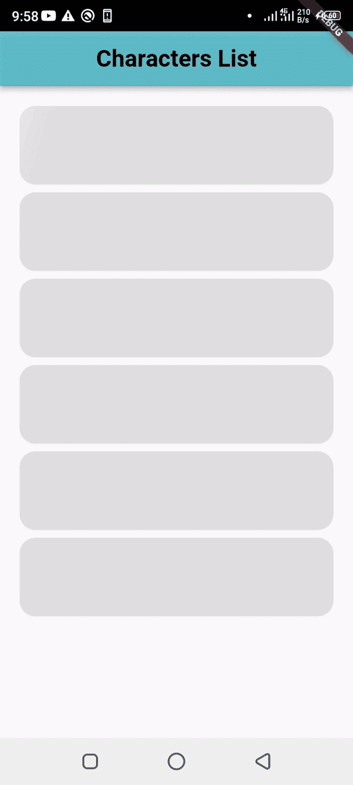

# 如何在 Flutter 中实现微光效果

> 原文：<https://blog.logrocket.com/implement-shimmer-effect-flutter/>

## 介绍

从应用程序启动的那一刻到用户退出应用程序的那一刻，他们的体验决定了他们是否会返回应用程序，或者与应用程序进一步互动——所以良好的用户体验真的不能被过分强调。如果出现故障、不必要的延迟、流量不均衡或任何更令人沮丧的问题，你也可以知道你在那个月失去了一个用户。

对良好用户体验的一个重要贡献是选择和[实现加载指示器](https://blog.logrocket.com/choosing-right-progress-indicators-async-flutter-apps/)。加载指示器及其效果为应用程序的内容建立了一个健康的预期(只要不是太长)。

例如，当用户登录应用程序时，如果在用户点击**登录**按钮后，屏幕上没有变化，用户可能会认为某处出现了故障，并可能会继续重新点击该按钮。如果相关检查不到位，用户可能会提出太多的请求，给应用程序带来不必要的压力，因此它最终可能会崩溃。

这只是指标成为便利工具的几个用例之一。在这篇文章中，我们将讨论如何实现微光效果，一种特殊的装载指示器。让我们开始吧！

## 什么是微光效果？

闪烁效果是从本地或远程数据源获取数据时使用的加载指示器。它描绘了一个视图，该视图可能类似于当数据可用时在屏幕上呈现的实际数据。



与常见的圆形渐进指示器或线性渐进指示器不同，微光效果为用户呈现了一个更具美感的视图，在某些情况下，有助于在数据呈现在屏幕上之前建立一些对数据的预期。

在我们将要构建的示例应用程序中，我们将从一个 [Rick 和 Morty API](https://rickandmortyapi.com/) 中获取角色数据，并将其显示在我们的应用程序中。获取数据时，将显示微光效果。我们开始吧。

## 实现微光效果

让我们从创建一个新的颤振项目开始。

```
flutter create shimmer_effect_app

```

在我们的`pubspec.yaml`文件中导入应用程序中需要的以下依赖项和开发依赖项:

*   [http:](https://pub.dev/packages/http) 向 [Rick 和 Morty API](https://rickandmortyapi.com/api/character) 发出`GET`请求，以获取角色列表及其数据
*   [微光](https://pub.dev/packages/shimmer):产生微光效果
*   [stacked](https://pub.dev/packages/stacked) :我们将在这个包中使用的架构解决方案
*   [stacked_services](https://pub.dev/packages/stacked_services) :堆叠包提供的现成可用的服务
*   [build_runner](https://pub.dev/packages/build_runner) :提供从注释自动生成文件的运行命令
*   [stacked_generator](https://pub.dev/packages/stacked_generator) :用于从堆叠标注生成文件

```
dependencies:
 cupertino_icons: ^1.0.2
 flutter:
  sdk: flutter
 http: ^0.13.4
 shimmer: ^2.0.0
 stacked: ^2.2.7+1
dev_dependencies:
 flutter_lints: ^1.0.0
 flutter_test:
  sdk: flutter
 build_runner: ^2.1.5
 stacked_generator: ^0.5.6

```

### 设置实用程序

在 lib 目录中，创建一个名为`utils`的文件夹。这个文件夹将包含一个文件，我们的`api_constants.dart`文件，它是从 API 获取字符的端点。这个文件使得跨整个代码库调用 getCharacters 端点变得更加容易，而不必在每个文件中声明它。我们的应用程序很小，但最好是始终有干净的可重用代码。

```
class ApiConstants {
 static const scheme = 'https';
 static const host = 'rickandmortyapi.com';
 static get getCharacters =&gt;
   Uri(host: host, scheme: scheme, path: '/api/character/');
}

```

### 建立模型

接下来是创建模型类。我们将创建两个模型类。第一个是`CharacterResponseModel`，它从端点获取响应，并将其分类为信息和实际数据。第二个是`CharacterModel`，里面会保存每个角色的细节。

对于应用程序中的每个角色，我们只需要两条信息:每个角色的名字和物种。

下面是`CharacterResponseModel`:

```
class CharacterResponseModel {
 //The InfoModel class which holds additional information e.g total number of characters, next, previous pages etc
 Info? info;
 //The CharacterModel class which holds the actual data/results
 List&lt;CharacterModel&gt;? results;
 CharacterResponseModel({this.info, this.results});

 //The fromJson method, which takes the JSON response, checks if the results are not null and then loops through the values, creating a List of CharacterModels.
 CharacterResponseModel.fromJson(Map&lt;String, dynamic&gt; json) {
  info = json['info'] != null ? Info.fromJson(json['info']) : null;
  if (json['results'] != null) {
   results = [];
   json['results'].forEach((v) {
    results!.add(CharacterModel.fromJson(v));
   });
  }
 }
 //The toJson method which creates a map from the given CharacterModel details
 Map&lt;String, dynamic&gt; toJson() {
  final Map&lt;String, dynamic&gt; data = {};
  if (info != null) {
   data['info'] = info!.toJson();
  }
  if (results != null) {
   data['results'] = results!.map((v) =&gt; v.toJson()).toList();
  }
  return data;
 }
}

```

这里是`CharacterModel`:

```
class CharacterModel {
 String? name;
 String? species;
 CharacterModel({
  this.name,
  this.species,
 });
 //The fromJson method which takes the JSON response and creates a CharacterModel from it
 CharacterModel.fromJson(Map&lt;String, dynamic&gt; json) {
  name = json['name'];
  species = json['species'];
 }
 Map&lt;String, dynamic&gt; toJson() {
  final Map&lt;String, dynamic&gt; data = {};
  data['name'] = name;
  data['species'] = species;
  return data;
 }
}

```

最后，我们有`InfoMode` l:

```
//Handles general information on the response from the endpoint
class Info {
 int? count;
 int? pages;
 String? next;
 String? prev;
 Info({this.count, this.pages, this.next, this.prev});
 Info.fromJson(Map&lt;String, dynamic&gt; json) {
  count = json['count'];
  pages = json['pages'];
  next = json['next'];
  prev = json['prev'];
 }
 Map&lt;String, dynamic&gt; toJson() {
  final Map&lt;String, dynamic&gt; data = {};
  data['count'] = count;
  data['pages'] = pages;
  data['next'] = next;
  data['prev'] = prev;
  return data;
 }
}

```

## 提取字符数据

接下来是设置负责获取字符列表及其数据的服务。姑且称之为`DashboardService`。它将只包含一个方法，即`getCharactersDetails()`方法。

导入 [http](https://pub.dev/packages/http) 包、dart convert 文件(允许我们从 dart 访问`json.decode`和`json.encode`函数)、`character_model`文件和`api_constants`文件。接下来是创建`getCharactersDetails`方法，

```
//Import the necessary packages
import 'dart:convert';
import 'package:http/http.dart' as http;
import 'package:shimmer_effect_app/models/character_model.dart';
import 'package:shimmer_effect_app/utils/api_constant.dart';

class DashboardService {
 //Creating the getCharacterDetails method
 Future&lt;List&lt;CharacterModel&gt;?&gt; getCharactersDetails() async {}
}

```

在`getCharactersDetails`方法中，我们使用 HTTP 包调用`getCharacters` API 端点并获取数据。这个数据然后被传递给`CharacterResponseModel.fromJson()`方法，然后我们返回结果。

```
 Future&lt;List&lt;CharacterModel&gt;?&gt; getCharactersDetails() async {

  // Make the call to the getCharacters endpoint of the Rick and Morty's API
  final response = await http.get(ApiConstants.getCharacters);

  // pass the response to the fromJson method of the CharacterResponseModel and access the results data in it
  final charactersList =
    CharacterResponseModel.fromJson(json.decode(response.body)).results;

  // return the list of characters gotten from the CharacterResponseModel
  return charactersList;
 }

```

## 设置用户界面

在 lib 目录中，创建一个名为`UI`的文件夹。在这个文件夹中新建一个名为`home`的文件夹，并添加两个文件:`home_view.dart`和`home_viewmodel.dart`文件。

我们将在接下来的步骤中执行一个基本的设置，稍后再完整地充实它们。

在`home_viewmodel.dart`文件中，创建一个名为`HomeViewModel`的新类。这个类从堆栈包中扩展了`BaseViewModel`。

```
class HomeViewModel extends BaseViewModel{}

```

在`home_view.dart`文件中，创建一个无状态小部件，命名为`HomeView`；这个文件将保存主页的所有 UI 相关代码。这个小部件从堆栈包中返回`ViewModelBuilder.reactive()`构造函数，该构造函数将视图链接/绑定到它的`ViewModel`。

```
class HomeView extends StatelessWidget {
 const HomeView({Key? key}) : super(key: key);
 @override
 Widget build(BuildContext context) {
  return ViewModelBuilder&lt;HomeViewModel&gt;.reactive(
    viewModelBuilder: () =&gt; HomeViewModel(),
    builder: (context, viewModel, child) {
     return Scaffold();
    });
 }
}

```

我们不会在这里放任何东西，因为我们需要设置一个定位器并注册我们将在`ViewModel`中使用的依赖项。让我们直接讨论这个问题。

### 设置定位器

在 lib 目录中，创建一个名为`app`的新文件夹。在这个文件夹中，创建一个名为`app.dart`的新文件。这是我们注册我们将使用的视图和服务的地方。

首先，创建一个名为`AppSetup`的新类，并用`@StackedApp`注释对其进行注释。它接受两个参数，路由和依赖关系。我们将`HomeView`和`DashboardService`分别传递给路由和依赖项。

```
import 'package:shimmer_effect_app/services/dashboard_services.dart';
import 'package:shimmer_effect_app/ui/home/home_view.dart';
import 'package:stacked/stacked_annotations.dart';

@StackedApp(
 routes: [
  AdaptiveRoute(page: HomeView, initial: true),
 ],
 dependencies: [
  LazySingleton(classType: DashboardService),
 ],
)
class AppSetup {}
>
```

接下来，运行 Flutter 命令来生成文件。

* * *

### 更多来自 LogRocket 的精彩文章:

* * *

```
flutter pub run build_runner build --delete-conflicting-outputs  

```

该命令生成`app.locator.dart`和`app.router.dart`文件，它们将处理依赖关系和路由。

### 完成 HomeViewModel

回到`HomeViewModel`文件，创建一个`getCharacters`方法。这个方法将到达仪表板，并从中获取`CharacterModel`的列表。然后我们将这个列表分配给`charactersList`，它最初是作为一个空列表创建的。然后我们利用定位器访问`DashboardService`。

```
class HomeViewModel extends BaseViewModel {

 // This gives us access to the DashboardService using the locator
 final _dashboardService = locator&lt;DashboardService&gt;();

 // This is the list, initially empty, but would contain the List of CharacterModels after the getCharacter function runs.
 List&lt;CharacterModel&gt;? charactersList = [];

 Future&lt;void&gt; getCharacters() async {
 // We assign the result from the call to the dashboardService to the charactersList which can then be displayed in the HomeView
 // The runBusyFuture here would set the entire ViewModel to a busy state until the call finishes, this is pretty handy as it helps us display the shimmer while the call to get the data is still ongoing
  charactersList =
    await runBusyFuture(_dashboardService.getCharactersDetails());
 }

}

```

这样，我们就把`ViewModel`都设置好了，可以开始了。

## 整理`HomeView`

接下来是完全设置视图。我们将为这个应用程序创建一个基本视图，当`ViewModel`忙碌时显示微光——即获取数据——然后当它完成并且数据准备好时显示卡片列表。

shimmer 包让我们可以访问两个构造函数:

*   一个直接`Shimmer()`构造器:

    ```
     Shimmer(   // The gradient controls the colours of the Shimmer effect, which would be painted over the child widget   gradient: gradient,   child: child,  )
    ```

*   `Shimmer.fromColors()` :

    ```
    Shimmer.fromColors(  // The baseColor and highlightColor creates a LinearGradient which would be painted over the child widget   baseColor: baseColor,   highlightColor: highlightColor,   child: child,  )
    ```

在我们的示例应用程序中，我们将使用`Shimmer.fromColors()`构造函数。当`V``iewModel`忙于获取数据时，我们将显示一个卡片小部件，在其上实现微光效果。这是一个占位符，其中没有子元素。当`ViewModel`完成加载时，我们将显示一张类似大小的卡片，上面有实际数据。

```
Expanded(
// First we check if the ViewModel is busy (isBusy :) definitely) and display the Shimmer
  child: viewModel.isBusy
    ? Shimmer.fromColors(
      baseColor: Colors.grey[300]!,
      highlightColor: Colors.grey[100]!,
      child: ListView.builder(
       itemCount: 6,
       itemBuilder: (context, index) {
        return Card(
         elevation: 1.0,
         shape: RoundedRectangleBorder(
          borderRadius: BorderRadius.circular(16),
         ),
         child: const SizedBox(height: 80),
        );
       },
      ),
     )
    : ListView.builder(
      itemCount: viewModel.charactersList!.length,
      itemBuilder: (context, index) {
       return Card(
         elevation: 1.0,
         // This is just a little play with colors changing the colors everytime the app is refreshed or restarted :)
         color: Colors.primaries[Random()
               .nextInt(Colors.primaries.length)]
             .withOpacity(0.5),
         shape: RoundedRectangleBorder(
            borderRadius: BorderRadius.circular(16),
           ),
         child: Container()
       );
      },
     ),
 )

```

你可以点击查看`HomeView` [的完整代码。](https://gist.github.com/Blazebrain/c26fd8ee1dddf1b09f9ab34cab315644)

## 设置`main.dart`文件

在`main.dart`文件中，我们将从`app.locator.dart`生成的文件中添加`setupLocator`函数，从 [stacked_services](https://pub.dev/packages/stacked_services) 包中添加 navigator 键，从`app.router.dart`文件中添加`onGenerate` route，最终将应用从头到尾链接起来。

```
import 'package:flutter/material.dart';
import 'package:shimmer_effect_app/app/app.locator.dart';
import 'package:shimmer_effect_app/app/app.router.dart';
import 'package:stacked_services/stacked_services.dart';
void main() {
 WidgetsFlutterBinding.ensureInitialized();
 setupLocator();
 runApp(const MyApp());
}
class MyApp extends StatelessWidget {
 const MyApp({Key? key}) : super(key: key);
 @override
 Widget build(BuildContext context) {
  return MaterialApp(
   title: 'Material App',
   onGenerateRoute: StackedRouter().onGenerateRoute,
   navigatorKey: StackedService.navigatorKey,
  );
 }
}  

```


## 结论

是啊！我们完了。我们已经成功地在应用程序上设置了一个微光效果。看起来很酷，是吧？肯定！你提高了应用的整体用户体验。您可以在您的应用程序中实现这一点，改善您的应用程序的美学外观和感觉。

查看[示例应用程序的完整源代码](https://github.com/Blazebrain/shimmer_effect_app)。如果您有任何问题或咨询，请随时在 Twitter: [@Blazebrain](https://www.twitter.com/Blazebrain01) 或 LinkedIn: [@Blazebrain](https://www.linkedin.com/in/david-adegoke) 联系我。

## 使用 [LogRocket](https://lp.logrocket.com/blg/signup) 消除传统错误报告的干扰

[](https://lp.logrocket.com/blg/signup)

[LogRocket](https://lp.logrocket.com/blg/signup) 是一个数字体验分析解决方案，它可以保护您免受数百个假阳性错误警报的影响，只针对几个真正重要的项目。LogRocket 会告诉您应用程序中实际影响用户的最具影响力的 bug 和 UX 问题。

然后，使用具有深层技术遥测的会话重放来确切地查看用户看到了什么以及是什么导致了问题，就像你在他们身后看一样。

LogRocket 自动聚合客户端错误、JS 异常、前端性能指标和用户交互。然后 LogRocket 使用机器学习来告诉你哪些问题正在影响大多数用户，并提供你需要修复它的上下文。

关注重要的 bug—[今天就试试 LogRocket】。](https://lp.logrocket.com/blg/signup-issue-free)