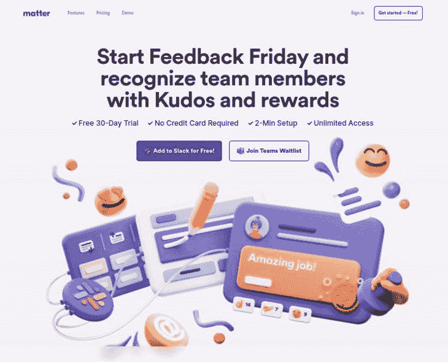
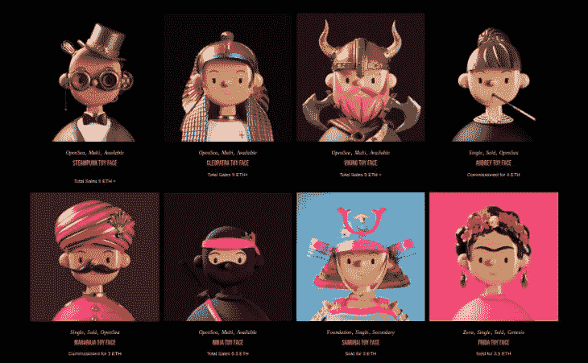
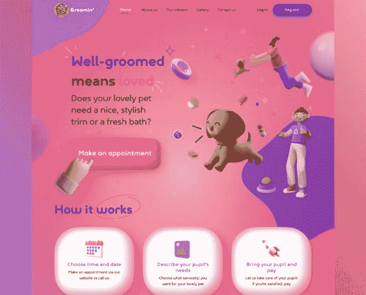
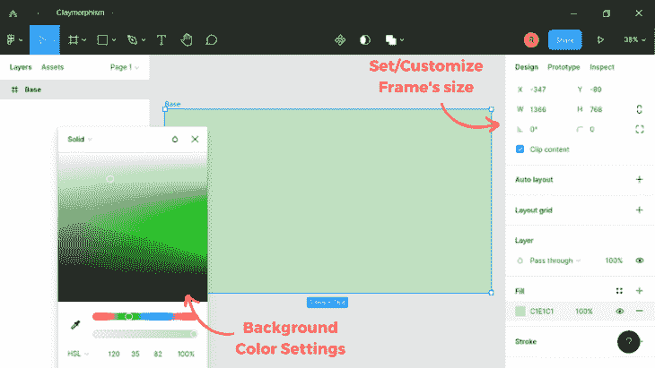
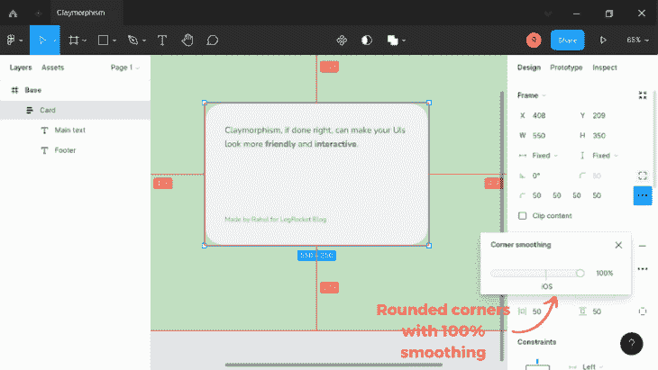
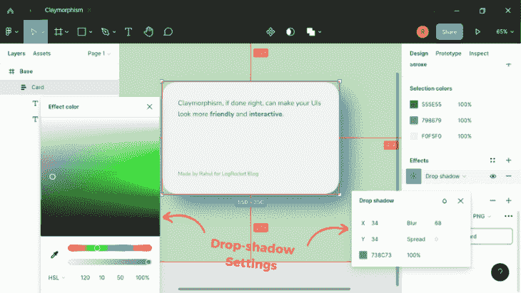
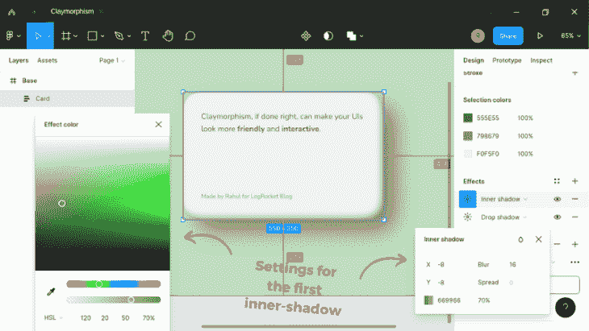
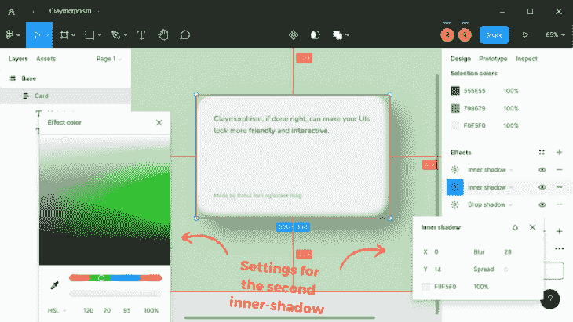

# 用 CSS - LogRocket 博客实现 claymorphism

> 原文：<https://blog.logrocket.com/implementing-claymorphism-css/>

Claymorphism 是一个围绕类似粘土的用户界面的设计概念。它对用户友好的吸引力在 UI 设计界越来越受欢迎，尤其是在 Web3 中。

前端开发人员的一项基本技能是了解流行的 UI 设计趋势，并能够将这些设计转化为实用的布局。

本教程将帮助你学习用 CSS 实现 claymorphism 用户界面。到本文结束时，您将能够使用 Figma、CSS 和 Tailwind CSS 创建泥塑设计元素。

### 内容

## 粘土矿物的例子

顾名思义，claymorphism 将艺术的、粘土般的美学融入到数字空间中来表现 UI。



由于 NFTs 和元宇宙经常在设计中使用这些友好的图形，艺术 3D 变得更加流行。

这些天来，NFT 运用泥塑艺术的作品售价高得离谱。在 Web3 的世界中粘土形态流行的最好例子是阿姆里特·帕尔·辛格的这个 [NFT 系列。](https://amritpaldesign.com/nfts)



这些化身的孩子般的氛围表明了一种友好、温暖和快乐的感觉。

粘土形态也是根据图形塑造布局元素。这里有一个更好的例子来说明这一点。



粘土形态学遵循类似于神经形态学的原理，但是更容易理解也更漂亮。与神经形态中的凹形元素相比，粘土形态的 UI 元素看起来更柔和、更容易，因此更吸引人、更容易理解、更友好。

## 粘土矿物性质

你可以直接跳到[编码部分](#claymorphism-figma)，但是在通过代码实现之前理解任何设计概念的核心属性总是一个好主意。

所以在动手之前，让我们看看 claymorphism UIs 的关键特性和属性。

### 明亮柔和的颜色

实施泥塑的第一步是选择正确的颜色。最好让粘土元素的背景和前景保持较亮的柔和颜色，因为阴影对较暗的变化往往无效。

### 光滑的角落

圆角赋予了粘土元素所需要的特性。它的柔和度高度依赖于角的半径和内/外阴影。

### 3D 外观

粘土元素应该看起来像一个三维粘土对象，这是可能的内部阴影。

粘土状物体通常有两个内部阴影；一个在左上角，另一个在右下角。第一个阴影表示当对象具有不透明背景时出现的发光边缘。第二个阴影补充了第一个阴影，并为对象添加了深色浮雕效果。

内部阴影也有助于元素的深度，可以染成与主背景相同的颜色。

### 深度

除了内部阴影，外部阴影或投影使对象在主背景上更容易接近和识别。它控制元素的深度，应该比背景色稍暗。

### 粘土状图形

我们已经在上面看到了一些例子，展示了在粘土形态中使用蓬松的粘土状 3D 图形。毫不奇怪，具有粘土般外观和感觉的图形与粘土形态界面配合得很好。它们的加入使得 UI 元素看起来更现代，更友好，更具交互性。

## 具有 Figma 的粘土形态

让我们用六个简单的步骤在 Figma 中创建一个粘土卡片。我们将在后面的 CSS 实现中引用这一部分。

首先，让我们在新的 Figma 文档中添加一个`1366x768`桌面框架，作为 claymorphic 对象的基础。现在，给我们的基本桌面框架添加一些颜色。我选择了两种绿色来给基础框架添加渐变。



然后让我们在我们的基地中间画一个`550x350`框。这个矩形框在 UI 中代表我们的粘土卡。


接下来，给这个卡片元素的角添加一些圆角。50 像素的半径看起来足够好了。此外，添加一个`100%`的角落平滑，给它一个圆角正方形的软边。



下一步，提供一个阴影，并保持阴影比主要背景颜色暗一点。这里阴影的技巧是保持 x 和 y 偏移相同，并将模糊量设置为这个值的两倍。



给卡片加上内阴影会产生浮雕效果。这将为卡片的左上方添加一些阴影。



类似地，在左上方添加一个内部阴影，它更像一个“内部发光”而不是一个阴影。



现在你有了它，一个由 Figma 制造的普通粘土元素，你可以通过自己的实验进一步扩展它。点击查看[完成的文件。](https://www.figma.com/file/zywNb7Rbl2PWfNhqGzKtsp/Claymorphism?node-id=14%3A3)

## 带有 CSS 的 Claymorphism

如果你知道如何聪明地使用盒子阴影，在 CSS 中实现 claymorphism 就变得很容易。

正如我们在 Figma 中注意到的，我们的泥塑物体将获得多个(三个)阴影，两个内部阴影和一个投影。

从标记开始，让我们首先添加一个布局容器和一个带有一些段落标记的 card 元素:

```
<div class="container">
  <div class="card">
    <p>...</p>
    <p>...</p>
  </div><!-- .card -->
</div><!-- .container -->
```

如您所见，标记非常简单。

让我们跳到 CSS 部分，添加一些简单的样式。我使用了[规格化 CSS 重置](https://github.com/necolas/normalize.css/)来保持所有浏览器的一致性。我还使用了传统的`box-sizing`重置来保持间距的合理和顺畅。

Nunito 谷歌字体有一个柔和的外观，在我们的用户界面上看起来会很棒。如果您注意到了，它也用在了我们的 Figma 示例中:

```
/* Box sizing reset */
:root {
  box-sizing: border-box;
}

* {
  &,
  &:before,
  &:after {
    box-sizing: inherit;
  }
}

body {
  font: 1em/1.618 Nunito, sans-serif;
}

```

我们将把卡片元素设计成一个粘土状的物体。让我们对 Figma 教程中使用的元素应用相同的颜色。

我使用 HSL 颜色功能进行简单的颜色修改，这在 RGB 中是不可能的:

```
body {
  font: 1em/1.618 Nunito, sans-serif;

  color: hsl(120deg 5% 35%);
  background-color: hsl(120deg 35% 82%);
}

```

正如你所看到的，用 HSL 修改饱和度或亮度(或两者)可以给我们一个相同颜色的阴影或色调。

接下来，让我们为容器元素定义一些对齐设置，以将其子元素与绝对中心对齐:

```
body { ... }

.container {
  display: flex;
  flex-direction: column;
  align-items: center;
  justify-content: center;

  min-height: 100vh;
  padding: 2em;
}

```

接下来，让我们向 card 元素添加一些大小、填充、圆角半径和对齐值:

```
body { ... }
.container { ... }

.card {
  display: flex;
  flex-direction: column;
  justify-content: space-between;

  max-width: 550px;
  min-height: 350px;
  padding: 50px;
  border-radius: 50px;
}

```

我们现在应该给卡片添加内外阴影。可以使用多个`box-shadow`值，如下所示:

```
body { ... }
.container { ... }

.card {
  ...

  background-color: hsl(120deg 20% 95%);
  box-shadow:
    34px 34px 68px hsl(120deg 10% 50%), 
    inset -8px -8px 16px hsl(120deg 20% 50% / 70%), 
    inset 0px 14px 28px hsl(120deg 20% 95%); 
}

```

我们已经完成了 claymorphism 的一般 CSS 实现！

> 没有描述

保持外部阴影较大将为元素提供更多的深度。您可以通过修改 x 和 y 值来更改阴影的方向。检查一下[底部](https://codepen.io/_rahul/pen/gOvGWQO)和[左侧](https://codepen.io/_rahul/pen/BaYwRvo)的阴影变化。

我们在上面的代码中跳过了`box-shadow`的 spread 参数，因为它不适用于这个用例。如果你仔细观察，边缘没有我们在 Figma 演示中制作的那么柔软。我们将在下一节讨论这个问题。

磨平角落

### 我们不能通过 CSS border-radius 属性平滑拐角来实现圆角。使用 SVG 有很多方法可以做到这一点，但是每个实现都需要不同的 SVG，这是不灵活的。

然而，我们可以使用[CSS Houdini API](https://developer.mozilla.org/en-US/docs/Web/Guide/Houdini)，它公开 CSS 引擎来方便地创建 CSS 扩展。这些扩展可以填充不可用的浏览器功能或实验，比如为给定的 HTML 元素提供平滑的圆角。

让我们用 CSS Paintworklet 和 CSS Houdini 扩展进行实验，看看这种组合能带给我们什么。

从 CSS Paintworklet 开始的正确方法是检查它的支持，然后通过 Paintworklet 模块方法加载扩展:

在上面的代码中，我们加载了一个 CSS Houdini 扩展来平滑任何给定元素的角。在幕后，这个扩展为我们的 web 文档添加了一个`mask-image`属性支持来应用效果，我们可以用一些定制属性进一步配置它。

```
<script>
if ("paintWorklet" in CSS) {
  CSS.paintWorklet.addModule(
    "https://www.unpkg.com/[email protected]/squircle.min.js"
  );
}
</script>

```

接下来，添加`mask-image`属性，并为拐角平滑提供一些自定义属性。`1`表示 100%的拐角平滑:

正如你在演示中看到的，我们的卡的阴影由于遮蔽而被剪切。要解决这个问题，我们必须将 card 元素包装在一个 division 中，然后为这个包装器 division 提供阴影:

```
body { ... }
.container { ... }

.card {
  ...

  /* Squircle settings */
  --squircle-radius: 50px;
  --squircle-smooth: 1;
  -webkit-mask-image: paint(squircle); 
  mask-image: paint(squircle);
}

```

让我们用 filter CSS 属性给这个包装元素添加一个投影。我们使用的是`drop-shadow`滤镜，而不是`box-shadow`属性，因为它按照预期绘制阴影，而不考虑盒子模型的不规则性:

```
<div class="container">
  <div class="card-wrapper">
    <div class="card">
      <p>...</p>
      <p>...</p>
    </div><!-- .card -->
  </div><!-- .card-wrapper -->
</div><!-- .container -->
```

CSS `drop-shadow`滤镜的模糊量并不完全像`box-shadow`属性那样工作。这几乎是我们看到的`box-shadow`地产模糊程度的两倍。我已经调整了模糊量来解决这个问题。

```
.card-wrapper {
  border-radius: 50px;
  filter: drop-shadow(34px 34px 34px hsl(120deg 10% 50%));
}

```

没有描述

> No Description

警告

### 使用 [CSS 绘画 API](https://developer.mozilla.org/en-US/docs/Web/API/CSS_Painting_API) 来实现圆角方形效果是昂贵且耗时的。
这是一项实验性技术[，目前只在基于 Chromium 的浏览器](https://caniuse.com/css-paint-api)上受支持。它还需要添加一个包装元素来处理投影，这也需要一些额外的工作。

带顺风 CSS 的粘土形态

## 用顺风实现泥塑效果有点棘手。让我们在 CodePen 中快速设置 Tailwind，并看看如何完成。

访问 CodePen 并创建一个新笔。点击 **JS** ，然后添加`cdn.tailwindcss.com`作为外部脚本。


保存您的更改，您就可以开始了。

让我们在顺风设置中添加一些定制的实用程序。这样做将使我们避免重复许多内部和阴影的自定义值:

在上面的配置中，我们添加了一个字体实用程序来使用 Nunito 字体，`box-shadow`实用程序用于我们的卡片和按钮元素，还有一个`drop-shadow`实用程序用于卡片包装器。

```
tailwind.config = {
  theme: {
    extend: {
      fontFamily: {
        nunito: ["Nunito", "sans-serif"]
      },
      boxShadow: {
        "clay-card":
          "inset -10px -10px 20px hsl(302deg 25% 50% / 70%), inset 0 16px 32px hsl(302deg 25% 95%)",
        "clay-btn":
          "16px 16px 32px 0 hsl(277deg 50% 65% / 50%), inset -16px -16px 32px 0 hsl(277deg 50% 65%), inset 8px 8px 16px 0 hsl(227deg 65% 75% / 45%)"
      },
      dropShadow: {
        'clay': '35px 35px 35px hsl(302deg 25% 50%)',
      }
    }
  }
};

```

我们现在必须添加 CSS Houdini 模块，就像我们在上面的例子中为圆角正方形效果所做的那样。然后，我们必须添加 CSS 来加载 web 字体，并为圆角正方形定义设置和遮罩:

没有描述

```
<div class="[ p-8 w-full h-screen ] 
            [ flex justify-center items-center ] 
            [ bg-gradient-to-b from-[hsl(302,33%,70%)] to-[hsl(302,33%,95%)] ] 
            [ text-[hsl(302,20%,30%)] font-nunito ]">
  <div class="drop-shadow-clay">
    <div class="card 
                [ p-[50px] max-w-lg rounded-[50px] ] 
                [ bg-white shadow-clay-card ] 
                [ flex items-center gap-5 flex-col md:flex-row lg:flex-row ]">
      <!-- Product image -->
      <div class="text-center md:text-left lg:text-left">
        <h3 class="text-xl font-bold mb-5">...</h3><!-- Product title -->
        <p class="text-sm mb-10">...</p><!-- Product description -->
        <a href="#" class="[ py-4 px-6 rounded-[50px] in-flex ] 
                           [ font-bold text-white ] 
                           [ bg-gradient-to-r from-[hsl(227,65%,75%)] 
                             to-[hsl(277,50%,65%)] 
                             hover:bg-gradient-to-r 
                             hover:from-[hsl(277,50%,65%)] 
                             hover:to-[hsl(227,65%,75%)] ] 
                           [ shadow-clay-btn ]">...</a><!-- Order button -->
      </div><!-- Card content -->
    </div><!-- Card -->
  </div><!-- Card wrapper -->
</div><!-- The container -->
```

> 你注意到添加一个蓬松的 3D 图形是如何增强效果的吗？您可以进一步修改图像和对齐方式，以创造更具冲击力的变化。这里是[另一个例子](https://codepen.io/_rahul/pen/wvyrBQO)。

粘土形态和玻璃形态

我们可以把粘土形态和玻璃形态混合在一起。在继续之前，我希望你先浏览一下[glassmorphism](https://blog.logrocket.com/implement-glassmorphism-css/#what-properties-glassmorphism)的基础知识，然后回到这里观察下面的演示。

## 没有描述

可访问性注释

> 让这些效果变得容易理解只取决于一个方面:选择正确的颜色。确保物体和表面或主背景之间有足够的对比度。

同样的道理也适用于较暗的泥塑物体。对象的颜色应该总是比背景浅，内部的阴影应该是可见的，以获得更好的可视性和可访问性。

## 没有描述

你还应该检查[这个深色版本的彩色实现](https://codepen.io/_rahul/pen/wvyrBQO)。

同样的，当混合 claymorphism 和 glassmorphism 时，确保用于背景的图像不会杂乱、太暗或太亮。

> 结论

在这篇文章中，我们探讨了粘土形态设计的趋势及其特性。我们还看了说明这个概念的不同应用的例子。

然后我们在 Figma 中创建了一个粘土形态效果，我们后来在 CSS 中复制了这个效果。我们讨论了它在带有明暗模式的 Tailwind CSS 中的实现。

我们还混合了玻璃形态和粘土形态，并做了笔记，让粘土形态的元素更容易理解。

## 本教程中使用的所有演示都可以在[CodePen collection](https://codepen.io/collection/jbmNxW)中找到。我希望你用这些新知识创造出奇妙的 ui！

你的前端是否占用了用户的 CPU？

随着 web 前端变得越来越复杂，资源贪婪的特性对浏览器的要求越来越高。如果您对监控和跟踪生产环境中所有用户的客户端 CPU 使用、内存使用等感兴趣，

.

LogRocket 就像是网络和移动应用的 DVR，记录你的网络应用或网站上发生的一切。您可以汇总和报告关键的前端性能指标，重放用户会话和应用程序状态，记录网络请求，并自动显示所有错误，而不是猜测问题发生的原因。

## 现代化您调试 web 和移动应用的方式— [开始免费监控](https://lp.logrocket.com/blg/css-signup)。

As web frontends get increasingly complex, resource-greedy features demand more and more from the browser. If you’re interested in monitoring and tracking client-side CPU usage, memory usage, and more for all of your users in production,

[try LogRocket](https://lp.logrocket.com/blg/css-signup)

.

[](https://lp.logrocket.com/blg/css-signup)[https://logrocket.com/signup/](https://lp.logrocket.com/blg/css-signup)

[LogRocket](https://lp.logrocket.com/blg/css-signup) is like a DVR for web and mobile apps, recording everything that happens in your web app or site. Instead of guessing why problems happen, you can aggregate and report on key frontend performance metrics, replay user sessions along with application state, log network requests, and automatically surface all errors.

Modernize how you debug web and mobile apps — [Start monitoring for free](https://lp.logrocket.com/blg/css-signup).