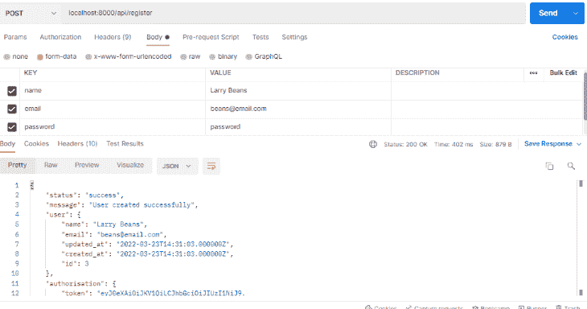
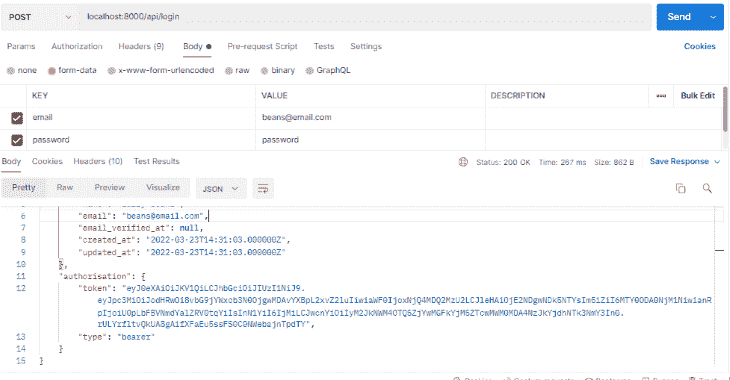
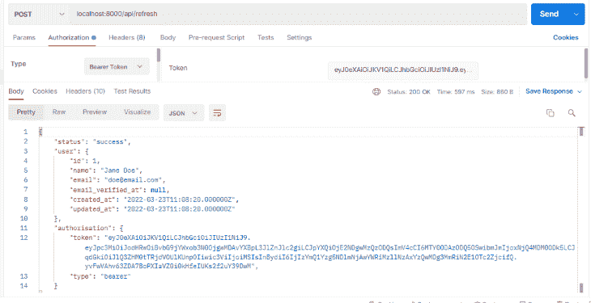
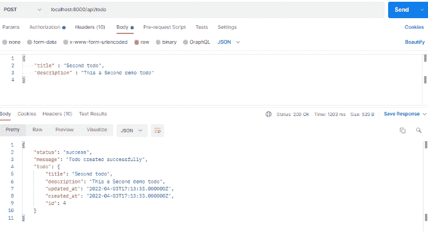

# 在 Laravel 9 中实现 JWT 认证

> 原文：<https://blog.logrocket.com/implementing-jwt-authentication-laravel-9/>

JSON web 令牌(JWT)身份验证用于验证 JSON 数据的所有权。JWT 不是加密，而是确定数据是否可信，因为其所有权是经过验证的。JWT 是一个开放标准( [RFC 7519](https://tools.ietf.org/html/rfc7519) )，它使信息能够作为一个 JSON 对象在双方之间安全地传输。jwt 是使用公钥/私钥对或秘密进行数字签名的。

在本文中，我们将演示在 Laravel 9 中实现 JWT 认证的过程。我们还将回顾 Laravel 的一些特性，并将 JWT 与 Laravel 的内置认证包(圣地和护照)进行比较。

我们的演示将遵循以下步骤:

在开始演示之前，让我们先简要了解一下 Laravel。

## 什么是 Laravel？

Laravel 是一个免费的开源 PHP web 框架，由 Taylor Otwell 基于 Symfony 框架构建。它是为构建遵循模型-视图-控制器(MVC)架构范例的在线应用程序而设计的。

PHP 框架经常受到新开发者的青睐；PHP 有很好的文档，并且有一个活跃的资源社区。Laravel 是最流行的 PHP 开发框架,通常是新手和经验丰富的开发者的首选框架。它用于构建标准业务应用程序以及企业级应用程序。

根据[公司的网站](http://laravel.com)，以下大公司使用 Laravel:迪士尼、华纳兄弟、Twitch、纽约时报、辉瑞和 BBC 等。

## 为什么要用 Laravel？

基于 GitHub stars， [Laravel 据报道是 2021 年最受欢迎的后端框架](https://statisticsanddata.org/data/most-popular-backend-frameworks-2012-2022/)。以下是开发人员喜欢用 Laravel 构建的一些原因:

*   **MVC 支持:** Laravel 支持使用 MVC 架构范例的开发工作，使其易于使用，并且是小型和大型应用程序的理想选择。MVC 简化了编码结构，使其更易于维护
*   健壮的 ORM: Laravel 的 ORM，雄辩的，使处理数据库变得轻而易举。雄辩简化了在相互连接的数据库对象之间创建关系的过程
*   **内置模板引擎:** Laravel 的内置模板引擎(Blade)将一个或多个模板与数据模型结合起来生成视图，将模板转换成缓存的 PHP 代码以提高效率。Blade 也有一组控制结构，比如条件和循环，它们在内部被翻译成 PHP 的对应物
*   **强大的 CLI:** Laravel 的 CLI Artisan 用于发布包资产、管理数据库迁移，以及为新的控制器、模型和迁移生成样板代码。Artisan 的功能可以通过添加自定义命令来扩展
*   **多文件系统:** Laravel 包括对亚马逊 S3 和 Rackspace 云存储等云存储系统的支持，以及本地存储。每个系统的 API 都是相同的，这使得在不同的存储备选方案之间切换变得非常简单。在分布式环境中，可以将这三种方法结合到一个应用程序中，为来自多个位置的文件提供服务
*   **内置认证系统:** Laravel 为安全的、基于会话的认证提供了脚手架，并通过 Sanctum 为 API 和移动应用程序提供了无痛认证
*   优秀的文档: Laravel 的官方文档广泛而简洁，对初学者和专家都很有用
*   **广泛的测试:** Laravel 通过 [PHPUnit](https://laravel.com/docs/9.x/testing) 提供内置的测试支持。Laravel 还提供了有吸引力的测试 API、数据库播种和无痛浏览器测试
*   **选择 Monolith 或 API:** Laravel 可以和 [Livewire](https://laravel-livewire.com) 一起使用，用 PHP 创建健壮的全栈应用。类似地，Laravel 可以和[惯性](https://inertiajs.com)结合起来，创建一个单一的 JavaScript 驱动的前端。或者，Laravel 可以用作移动应用程序、Next.js 项目或您选择的另一个前端的强大后端 API
*   **大型、互动的社区:** Laravel 拥有一个[广泛的开发者社区](https://laravel.io)，他们对框架充满热情，能够适应各种技能水平的开发者
*   **可扩展性:**Laravel 生态系统提供了一系列工具和资源(例如 [Forge](https://forge.laravel.com) 、 [Octane](https://laravel.com/docs/9.x/octane) 、 [Vapor](https://vapor.laravel.com) )来实现企业级的可扩展性，而没有相关的复杂性
*   **美码:** Laravel 非常强调审美；每个功能都经过仔细研究，旨在提供卓越的用户体验。其简单、优雅的语法将增强的功能置于开发人员的指尖

## 拉勒维尔 JWT 认证与密室或护照

选择在 Laravel 应用程序中使用的认证类型是基于您正在构建的应用程序的类型。Sanctum 提供基于会话和基于令牌的身份验证，适合单页面应用程序(SPA)身份验证。Passport 使用 JWT 身份验证作为标准，但也实现了完整的 OAuth 2.0 授权。

OAuth 允许来自 Google、GitHub 和脸书等第三方应用程序的授权，但并不是每个应用程序都需要这个特性。如果您想要实现遵循 JWT 标准的基于令牌的身份验证，但是没有 OAuth extras，那么 Laravel JWT 身份验证是您的最佳选择。

## JWT 认证演示

现在，让我们看看如何在 Laravel 9 中实现 JWT 认证。这个项目的完整代码可以在 GitHub 上找到。请随意叉和跟随。

### 先决条件

本教程旨在进行实践演示。开始之前，请确保您已满足以下要求:

*   安装在你机器上的 PHP
*   [XAMPP](https://www.apachefriends.org/download.html) ，安装在您的机器上
*   PHP 基础知识

### 安装 Laravel 9

我们将从创建一个新的 Laravel 9 项目开始。

使用以下命令安装并导航到新的 Laravel 项目:

```
composer create-project laravel/laravel laravel-jwt
cd laravel-jwt

```

### 创建数据库

创建一个名为`laravel-jwt`的 MySQL 数据库。对于这个演示，我使用的是[xamp](https://www.apachefriends.org/download.html)，但是任何数据库管理系统都足够了。

### 连接到数据库

为了让我们的 Laravel 应用程序与新形成的数据库进行交互，我们必须首先建立一个连接。为此，我们需要将数据库凭证添加到`.env`文件中:

```
DB_CONNECTION=mysql
DB_HOST=127.0.0.1
DB_PORT=3306
DB_DATABASE=laravel-jwt
DB_USERNAME=root
DB_PASSWORD=

```

### 进行迁移

Laravel 中预装了`User`表迁移，所以我们所要做的就是运行它在我们的数据库中创建表。要创建`User`表，使用以下命令:

```
php artisan migrate

```

### 安装和设置 JWT

既然我们的数据库已经设置好了，我们将安装和设置拉韦尔 JWT 认证包。我们将使用`tymondesign/jwt-auth`的一个分支`php-open-source-saver/jwt-auth`，因为`tymondesign/jwt-auth`似乎已经被放弃，并且与 Laravel 9 不兼容。

使用以下命令安装最新版本的软件包:

```
 composer require php-open-source-saver/jwt-auth

```

接下来，我们需要公开包配置。使用以下命令将供应商的 JWT 配置文件复制到`confi/jwt.php`:

```
php artisan vendor:publish --provider="PHPOpenSourceSaver\JWTAuth\Providers\LaravelServiceProvider"

```

现在，我们需要生成一个密钥来处理令牌加密。为此，请运行以下命令:

```
php artisan jwt:secret

```

这将更新我们的`.env`文件，如下所示:

```
JWT_SECRET=xxxxxxxx

```

这是将用于签署我们的令牌的密钥。

### 配置自动保护

在`config/auth.php`文件中，我们需要做一些修改来配置 Laravel 使用 JWT AuthGuard 来支持应用程序认证。

首先，我们将对文件进行以下更改:

```
'defaults' => [
        'guard' => 'api',
        'passwords' => 'users',
    ],

    'guards' => [
        'web' => [
            'driver' => 'session',
            'provider' => 'users',
        ],

        'api' => [
                'driver' => 'jwt',
                'provider' => 'users',
        ],

    ],

```

在这段代码中，我们告诉 API `guard`使用 JWT `driver`并将 API `guard`设为默认值。

现在，我们可以使用 Laravel 的内置认证机制，由`jwt-auth`来处理繁重的工作！

### 修改`User`模型

为了在我们的`User`模型上实现`PHPOpenSourceSaverJWTAuthContractsJWTSubject`契约，我们将使用两种方法:`getJWTCustomClaims()`和`getJWTIdentifier()`。

用以下代码替换`app/Models/User.php`文件中的代码:

```
namespace App\Models;
use Illuminate\Contracts\Auth\MustVerifyEmail;
use Illuminate\Database\Eloquent\Factories\HasFactory;
use Illuminate\Foundation\Auth\User as Authenticatable;
use Illuminate\Notifications\Notifiable;
use PHPOpenSourceSaver\JWTAuth\Contracts\JWTSubject;

class User extends Authenticatable implements JWTSubject
{
    use HasFactory, Notifiable;

    /**
     * The attributes that are mass assignable.
     *
     * @var array<int, string>
     */
    protected $fillable = [
        'name',
        'email',
        'password',
    ];

    /**
     * The attributes that should be hidden for serialization.
     *
     * @var array<int, string>
     */
    protected $hidden = [
        'password',
        'remember_token',
    ];

    /**
     * The attributes that should be cast.
     *
     * @var array<string, string>
     */
    protected $casts = [
        'email_verified_at' => 'datetime',
    ];

     /**
     * Get the identifier that will be stored in the subject claim of the JWT.
     *
     * @return mixed
     */
    public function getJWTIdentifier()
    {
        return $this->getKey();
    }

    /**
     * Return a key value array, containing any custom claims to be added to the JWT.
     *
     * @return array
     */
    public function getJWTCustomClaims()
    {
        return [];
    }

}

```

这就是我们的模型设置！

### 创建身份验证控制器

现在，我们将创建一个控制器来处理认证过程的核心逻辑。

首先，我们将运行这个命令来生成控制器:

```
php artisan make:controller AuthController

```

然后，我们将用下面的代码片段替换控制器的内容:

```
namespace App\Http\Controllers;
use Illuminate\Http\Request;
use Illuminate\Support\Facades\Auth;
use Illuminate\Support\Facades\Hash;
use App\Models\User;

class AuthController extends Controller
{

    public function __construct()
    {
        $this->middleware('auth:api', ['except' => ['login','register']]);
    }

    public function login(Request $request)
    {
        $request->validate([
            'email' => 'required|string|email',
            'password' => 'required|string',
        ]);
        $credentials = $request->only('email', 'password');

        $token = Auth::attempt($credentials);
        if (!$token) {
            return response()->json([
                'status' => 'error',
                'message' => 'Unauthorized',
            ], 401);
        }

        $user = Auth::user();
        return response()->json([
                'status' => 'success',
                'user' => $user,
                'authorisation' => [
                    'token' => $token,
                    'type' => 'bearer',
                ]
            ]);

    }

    public function register(Request $request){
        $request->validate([
            'name' => 'required|string|max:255',
            'email' => 'required|string|email|max:255|unique:users',
            'password' => 'required|string|min:6',
        ]);

        $user = User::create([
            'name' => $request->name,
            'email' => $request->email,
            'password' => Hash::make($request->password),
        ]);

        $token = Auth::login($user);
        return response()->json([
            'status' => 'success',
            'message' => 'User created successfully',
            'user' => $user,
            'authorisation' => [
                'token' => $token,
                'type' => 'bearer',
            ]
        ]);
    }

    public function logout()
    {
        Auth::logout();
        return response()->json([
            'status' => 'success',
            'message' => 'Successfully logged out',
        ]);
    }

    public function refresh()
    {
        return response()->json([
            'status' => 'success',
            'user' => Auth::user(),
            'authorisation' => [
                'token' => Auth::refresh(),
                'type' => 'bearer',
            ]
        ]);
    }

}

```

下面是对`AuthController`中公共函数的快速解释:

*   `constructor`:我们在`controller`类中建立了这个函数，这样我们就可以使用其中的`auth:api`中间件来阻止对控制器中某些方法的未经授权的访问
*   `login`:该方法使用用户的电子邮件和密码来验证用户。当用户成功通过身份验证时，`Auth` facade `attempt()`方法返回 JWT 令牌。生成的令牌被检索并作为 JSON 与用户对象一起返回
*   `register`:该方法创建用户记录，并使用令牌代登录用户
*   `logout`:该方法使用户`Auth`令牌失效
*   `refresh`:该方法使用户`Auth`令牌失效，并生成一个新令牌

我们已经完成了 JWT 身份验证的设置！

如果这就是你来这里的全部目的，你可以跳到[测试应用部分](#test-application)。

但是，看在 Laravel 的份上，让我们为我们的项目添加一个简单的 todo 特性吧！

### 创建 todo 模型、控制器和迁移

我们将使用以下命令一次性创建`Todo`模型、控制器和迁移:

```
php artisan make:model Todo -mc

```

### 修改待办事项迁移

接下来，转到`database/migrations/….create_todos_table.php`文件，用以下代码替换内容:

```
use Illuminate\Database\Migrations\Migration;
use Illuminate\Database\Schema\Blueprint;
use Illuminate\Support\Facades\Schema;

return new class extends Migration
{
    /**
     * Run the migrations.
     *
     * @return void
     */
    public function up()
    {
        Schema::create('todos', function (Blueprint $table) {
            $table->id();
            $table->string('title');
            $table->string('description');
            $table->timestamps();
        });
    }

    /**
     * Reverse the migrations.
     *
     * @return void
     */
    public function down()
    {
        Schema::dropIfExists('todos');
    }
};

```

### 修改 todo 模型

现在，导航到`app/Models/Todo.php`文件，用下面的代码替换内容。

```
namespace App\Models;

use Illuminate\Database\Eloquent\Factories\HasFactory;
use Illuminate\Database\Eloquent\Model;

class Todo extends Model
{
    use HasFactory;
    protected $fillable = ['title', 'description'];

}

```

### 修改 todo 控制器

接下来，转到`app/Http/Controllers/TodoController.php`文件，用以下代码替换内容:

```
namespace App\Http\Controllers;

use Illuminate\Http\Request;
use App\Models\Todo;

class TodoController extends Controller
{
    public function __construct()
    {
        $this->middleware('auth:api');
    }

    public function index()
    {
        $todos = Todo::all();
        return response()->json([
            'status' => 'success',
            'todos' => $todos,
        ]);
    }

    public function store(Request $request)
    {
        $request->validate([
            'title' => 'required|string|max:255',
            'description' => 'required|string|max:255',
        ]);

        $todo = Todo::create([
            'title' => $request->title,
            'description' => $request->description,
        ]);

        return response()->json([
            'status' => 'success',
            'message' => 'Todo created successfully',
            'todo' => $todo,
        ]);
    }

    public function show($id)
    {
        $todo = Todo::find($id);
        return response()->json([
            'status' => 'success',
            'todo' => $todo,
        ]);
    }

    public function update(Request $request, $id)
    {
        $request->validate([
            'title' => 'required|string|max:255',
            'description' => 'required|string|max:255',
        ]);

        $todo = Todo::find($id);
        $todo->title = $request->title;
        $todo->description = $request->description;
        $todo->save();

        return response()->json([
            'status' => 'success',
            'message' => 'Todo updated successfully',
            'todo' => $todo,
        ]);
    }

    public function destroy($id)
    {
        $todo = Todo::find($id);
        $todo->delete();

        return response()->json([
            'status' => 'success',
            'message' => 'Todo deleted successfully',
            'todo' => $todo,
        ]);
    }
}

```

### 添加 API 路由

为了访问我们新创建的方法，我们需要定义我们的 API 路由。

* * *

### 更多来自 LogRocket 的精彩文章:

* * *

导航到`routes/api.php`文件，并用以下代码替换内容:

```
use Illuminate\Http\Request;
use Illuminate\Support\Facades\Route;
use App\Http\Controllers\AuthController;
use App\Http\Controllers\TodoController;

Route::controller(AuthController::class)->group(function () {
    Route::post('login', 'login');
    Route::post('register', 'register');
    Route::post('logout', 'logout');
    Route::post('refresh', 'refresh');

});

Route::controller(TodoController::class)->group(function () {
    Route::get('todos', 'index');
    Route::post('todo', 'store');
    Route::get('todo/{id}', 'show');
    Route::put('todo/{id}', 'update');
    Route::delete('todo/{id}', 'destroy');
}); 

```

在上面的代码中，我们使用了 Laravel 9 语法。如果您使用的是较低版本的 Laravel，您需要以正常方式声明您的路线。

### 测试应用程序

在我们转移到 Postman 并开始测试 API 端点之前，我们需要启动我们的 Laravel 应用程序。

运行以下命令启动 Laravel 应用程序:

```
php artisan serve

```

### 注册 API

要启动 Postman 应用程序，在地址栏中添加注册 API，从下拉列表中选择 **POST** HTTP 请求方法，在 Body 选项卡上选择 **form-data** 选项，并选择 name、email 和 password 输入字段。

然后点击**发送**查看服务器响应。



### 登录到 API

在上一步中，我们在 Postman 应用程序中创建了一个帐户。要登录 API，将电子邮件和密码添加到输入字段，然后单击**发送**以查看响应。



### 测试端点

`refresh`、`logout`和`todo`端点都受到`auth:api`中间件的保护，因此需要我们发送一个带有授权头的有效令牌。

要从我们的登录响应中复制令牌，请从授权选项卡的下拉列表中选择**不记名令牌**，将复制的令牌粘贴到令牌字段中，然后单击**发送**以刷新 API。



### 创建待办事项

现在您已经有了一个授权令牌，将该令牌添加到请求头中，并创建一个 todo，如下所示:



现在，测试其他端点以确保它们正常工作。

## 结论

在本文中，我们讨论了使用 Laravel 构建的好处，并将 JWT 身份验证与 Sanctum 和 Passport(Laravel 的内置身份验证包)进行了比较。我们还构建了一个演示项目，展示如何在 Laravel 9 中使用 JWT 创建 REST API 认证。我们创建了一个示例 todo 应用程序，将该应用程序连接到数据库，并执行 CRUD 操作。

要了解更多关于 Laravel 的信息，请查看官方文档。

## 使用 [LogRocket](https://lp.logrocket.com/blg/signup) 消除传统错误报告的干扰

[](https://lp.logrocket.com/blg/signup)

[LogRocket](https://lp.logrocket.com/blg/signup) 是一个数字体验分析解决方案，它可以保护您免受数百个假阳性错误警报的影响，只针对几个真正重要的项目。LogRocket 会告诉您应用程序中实际影响用户的最具影响力的 bug 和 UX 问题。

然后，使用具有深层技术遥测的会话重放来确切地查看用户看到了什么以及是什么导致了问题，就像你在他们身后看一样。

LogRocket 自动聚合客户端错误、JS 异常、前端性能指标和用户交互。然后 LogRocket 使用机器学习来告诉你哪些问题正在影响大多数用户，并提供你需要修复它的上下文。

关注重要的 bug—[今天就试试 LogRocket】。](https://lp.logrocket.com/blg/signup-issue-free)