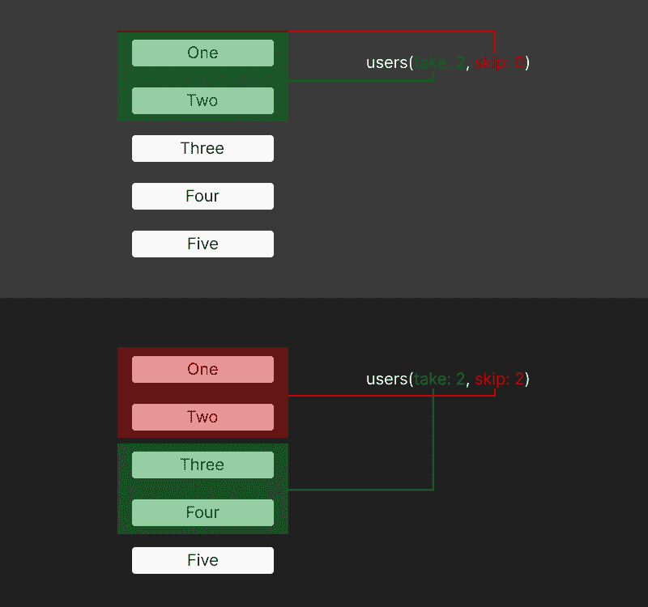

# 在 NestJS - LogRocket 博客中用 GraphQL 实现分页

> 原文：<https://blog.logrocket.com/implementing-pagination-graphql-nestjs/>

# 在 NestJS 中用 GraphQL 实现分页

分页是许多数据驱动的应用程序中常见的 UX 问题。我们需要限制屏幕上显示的内容；如果我的内容需要太多的滚动，在我的网站上导航对我的用户来说是一种痛苦的经历。

在这篇文章中，我们将看到一种解决这个问题的常见方法，用 GraphQL 构建一个 NestJS 服务器，然后在 React 前端使用它。通过一步一步地学习下面的内容，我们将构建一个简单的分页系统，它可以应用于各种应用程序。

本指南将分为三个主要部分:

1.  [分页算法](#pagination-algorithm)
2.  [使用 NestJS、GraphQL 和 Mongoose 建立 API](#setting-api-using-nestjs-graphql)
3.  [构建一个 React 前端来使用 API](#building-react-frontend)

这是用 NestJS 和 GraphQL 实现简单分页系统的实用指南。您可以改进我们将在本指南中构建的应用程序，以创建更适合生产的东西。

我推荐编码来巩固概念。本指南所写的所有代码都可以在我的 GitHub 上找到[。](https://github.com/ovieokeh/graphql-nestjs-pagination-guide)

## 我们在建造什么？

我们将构建的应用程序是一个简单的 React 前端，允许用户浏览用户列表。它非常简单，足以轻松理解我们将涉及的不同概念，同时也足够实用，可以针对现有应用程序进行修改。


This should be getting an AWWWARDS nomination anytime now

在设置项目之前，浏览一下我们将要实现的分页算法是值得的。当我们开始创建文件和编写代码时，这将帮助您理解项目的每个部分。

让我们跳过这一步，看看我们将调用的最后一个 GraphQL 查询，以获取用户列表并对其进行分页。

```
{
  count
  users(take: 20, skip: 0) {
    firstName
    lastName
  }
}

```

该查询由两个资源组成，`count`和`users`。

第一个是`count`，从名字就可以看出，它只是返回数据库中所有用户的数量。另一个资源，`users`让我们指定要检索多少个用户(`take`)，以及开始获取的偏移量(`skip`)。

我们如何用这个简单的查询实现分页呢？

考虑一个场景，我们有五种资源:

```
[one, two, three, four, five] 
```

如果我们使用参数`take = 2, skip = 0`运行上面的查询，我们将获得以下资源:

```
[one, two] 
```

如果我们再次运行相同的查询，但是使用以下参数:

`take = 2, skip = 2`

我们会得到以下资源:

```
[three, four] 
```



How `take` and `skip` work, but visually

通过跟踪我们在前端检索了多少用户，我们可以将一个数字传递给`skip`参数来检索下一个用户的正确数量。当我们实现前端时，这将变得更加清晰。

现在，让我们设置 API 来实现到目前为止讨论的功能。

## 使用 NestJS、GraphQL 和 Mongoose 设置 API

通常，我们会从建立一个新的 NestJS 项目和安装一些依赖项开始。

然而，为了跳过按照教程设置项目的所有痛苦部分，我已经开始用所有必要的库和设置文件建立一个存储库。

存储库是一个包含后端和前端组件的 monorepo。这使得我们可以在一个 repo 中构建 API 和前端，从而加快开发速度。

它依赖于 [Y](https://classic.yarnpkg.com/lang/en/docs/workspaces/) [arn 工作空间](https://classic.yarnpkg.com/lang/en/docs/workspaces/)，所以你需要安装 npm 和 Yarn。

克隆存储库并运行以下命令开始。

```
git clone https://github.com/ovieokeh/graphql-nestjs-pagination-guide.git
npm install

cd ../workspaces/frontend
npm install

cd workspaces/backend
npm install

mkdir src && cd src

```

如果您运行`package.json`文件中的任何命令，它们很可能会出错。如果您配置了编辑器，也可能会看到`eslint`错误。这很好。我们将在阅读指南的过程中解决这些问题。

现在您已经安装了所有需要的包，我们可以开始构建 API 的不同组件了。

### Mongoose 模式设置

首先，我们需要建立一个查询 GraphQL 的数据库。我决定使用 Mongoose 作为本指南，因为它是目前最流行的数据库 ORM 之一，但是您应该能够将相同的概念应用于其他 ORM。

我们将首先创建一个`src/mongoose`文件夹和一个`src/mongoose/schema.ts`文件来保存我们的数据库类型、模型和模式。

```
mkdir mongoose
touch mongoose/schema.ts

```

现在，让我们配置我们的`schema.ts`文件。

```
// src/mongoose/schema.ts

import { Prop, Schema, SchemaFactory } from '@nestjs/mongoose'
import { Document } from 'mongoose'

export type UserDocument = UserModel & Document

@Schema()
export class UserModel {
  @Prop()
  firstName: string

  @Prop()
  lastName: string

  @Prop()
  email: string

  @Prop()
  dateOfBirth: Date
}

export const UserSchema = SchemaFactory.createForClass(UserModel)

```

*   `UserDocument`是表示用户模型和 Mongoose 文档的 TypeScript 类型
*   `UserModel`表示要存储在数据库中的单个用户
*   `UserSchema`是从`UserModel`派生出来的一个猫鼬模式

当我们完成 API 的设置时，我们将会用到它们。

## nestjs 和 GraphQL

接下来，我们需要创建一些文件和文件夹，这些将在我们填充内容时解释。

```
mkdir users && cd users

mkdir dto entities
touch dto/fetch-users.input.ts entities/user.entity.ts 

```

### **T2`dto/fetch-users.input.ts`**

* * *

```
// dto/fetch-users.input.ts

import { Field, Int, ArgsType } from '@nestjs/graphql'
import { Max, Min } from 'class-validator'

@ArgsType()
export class FetchUsersArgs {
  @Field(() => Int)
  @Min(0)
  skip = 0

  @Field(() => Int)
  @Min(1)
  @Max(50)
  take = 25
}

```

`FetchUsersArgs`是一个[数据传输对象(DTO)](https://docs.nestjs.com/controllers#request-payloads) ，这意味着它描述了一段通过网络发送的数据。在本例中，它描述了参数`skip`和`take`，我们将在查询用户时将它们传递给 API。

我们将创建的下一组文件是用户服务、解析器和模块。

### 创建`**users.service.ts**`文件

```
touch users.service.ts users.resolver.ts users.module.ts

import { Model } from 'mongoose'
import { Injectable } from '@nestjs/common'
import { InjectModel } from '@nestjs/mongoose'

import { UserDocument, UserModel } from '../../mongoose/schema'
import { FetchUsersArgs } from './dto/fetch-users.input'
import { User } from './entities/user.entity'

@Injectable()
export class UsersService {
  constructor(
    @InjectModel(UserModel.name) private userModel: Model<UserDocument>,
  ) {}

... continues below (1) ...

```

NestJS 使用`@InjectModel`装饰将我们之前创建的 Mongoose 数据库注入到`UsersService`类中。这允许我们使用`getCount`和`findAll`方法查询数据库。

```
... continues from (1) ...
  async getCount(): Promise<number> {
    const count = await this.userModel.countDocuments()
    return count
  }
... continues below (2) ...

```

`UsersService.getCount()`是一种允许我们获取数据库中用户总数的方法。这个计数将有助于在前端实现编号分页组件。

```
... continues from (2) ...
  async findAll(args: FetchUsersArgs = { skip: 0, take: 5 }): Promise<User[]> {
    const users: User[] = (await this.userModel.find(null, null, {
      limit: args.take,
      skip: args.skip,
    })) as User[]

    return users
  }
}

```

`UsersService.findAll({ skip, take })`是一个获取指定数量的用户(带有`take`参数)和偏移量(`skip`)的方法。

这两个方法构成了我们将要构建的分页系统的基础。

### 创建`users.resolver.ts`文件

```
import { Resolver, Query, Args } from '@nestjs/graphql'

import { User } from './entities/user.entity'
import { UsersService } from './users.service'
import { FetchUsersArgs } from './dto/fetch-users.input'

@Resolver(() => User)
export class UsersResolver {
  constructor(private readonly usersService: UsersService) {}

  @Query(() => Number, { name: 'count' })
  async getCount(): Promise<number> {
    return this.usersService.getCount()
  }

  @Query(() => [User], { name: 'users' })
  async findAll(@Args() args: FetchUsersArgs): Promise<User[]> {
    return this.usersService.findAll(args)
  }
}

```

`UsersResolver`类是用于`count`和`users`查询的 GraphQL 解析器。这些方法简单地调用相应的`UsersService`方法。

### 创建 **`users.module.ts`** 文件

```
import { Module } from '@nestjs/common'
import { MongooseModule } from '@nestjs/mongoose'

import { UserModel, UserSchema } from '../../mongoose/schema'
import { UsersService } from './users.service'
import { UsersResolver } from './users.resolver'

@Module({
  imports: [
    MongooseModule.forFeature([{ name: UserModel.name, schema: UserSchema }]),
  ],
  providers: [UsersResolver, UsersService],
})
export class UsersModule {}

```

`UsersModule`类导入 Mongoose 模式并配置解析器和服务类，如上所述。这个模块被传递给主应用程序模块，并允许前面定义的查询。

### 创建`app.module.ts`文件

最后，为了将一切联系在一起，让我们创建一个`app.module.ts`文件来使用我们到目前为止定义的所有模块。

```
import { Module } from '@nestjs/common'
import { GraphQLModule } from '@nestjs/graphql'
import { ApolloDriver, ApolloDriverConfig } from '@nestjs/apollo'
import { MongooseModule } from '@nestjs/mongoose'

import { UsersModule } from './users/users.module'
import { ConfigModule, ConfigService } from '@nestjs/config'
import configuration from '../nest.config'

@Module({
  imports: [
    UsersModule,
    ConfigModule.forRoot({
      load: [configuration],
    }),
    MongooseModule.forRootAsync({
      imports: [ConfigModule],
      useFactory: async (configService: ConfigService) => ({
        uri: configService.get('databaseUrl'),
      }),
      inject: [ConfigService],
    }),
    GraphQLModule.forRoot<ApolloDriverConfig>({
      driver: ApolloDriver,
      autoSchemaFile: 'schema.gql',
      include: [UsersModule],
    }),
  ],
})
export class AppModule {}

```

如果您已经有了使用 GraphQL 和 NestJS 的经验，应该对这些都很熟悉。我们正在导入:

*   `GraphQLModule`用于设置图表 QL
*   `MongooseModule`为数据库
*   `UsersModule`对于用户资源
*   `ConfigModule`用于设置环境变量

现在，在添加您的数据库连接 URI 之前，确保设置一个 [MongoDB 数据库](https://www.mongodb.com/docs/drivers/node/current/fundamentals/connection/)并使用`.env.example`作为向导创建一个`.env`文件。

此时，您可以通过执行以下操作来测试 API:

1.  确保您位于后端目录— `cd src/workspaces/backend`
2.  运行`yarn seed`植入一些虚假的用户数据
3.  运行`yarn start:dev`在端口 3000 上启动服务器
4.  在浏览器上导航到`[http://localhost:3000/graphql](http://localhost:3000/graphql)`打开 GraphQL playground，在这里您可以尝试来自“[分页算法](https://blog.logrocket.com/?p=119650&preview=true#pagination-algorithm)”部分的查询，如下所示:

    ```
    {   count   users(take: 20, skip: 0) {     firstName     lastName   } }
    ```

如果你能走到这一步，你就是摇滚明星😎。

这是一个休息一下，再次浏览后端代码的好时机。花点时间理解它，也许可以喝杯果汁(或者茶，如果你喜欢的话)，然后继续前端。

## 构建一个 React 前端来使用 API

设置好后端之后，我们现在可以创建一个闪亮的 React 前端来实现一个基本的分页系统。

## 构建组件

您可以利用`workspaces/frontend`文件夹，而不是建立一个全新的前端项目，该文件夹已经安装了一个 React 应用程序，并安装了所有必要的依赖项。

```
cd ../frontend/src

```

让我们从自底向上的方法开始构建组件，然后在最后集成所有组件。

我们需要以下组件:

*   `Users` —查询 API 并呈现用户列表
*   `Pagination` —提供分页逻辑并呈现控件
*   `App` —呈现用户和分页
*   `Index` —将应用程序包装在 Apollo 提供程序中，并呈现给 DOM

### 编写我们的`**users.tsx**`组件


Just a list of names

该组件将使用`@apollo/client`库查询 GraphQL API，并在查询完成时呈现一个用户列表。

```
// ensure you're in /workspaces/frontend/src
touch Users.tsx

```

打开新创建的文件。

```
// Users.tsx
import { gql, useQuery } from '@apollo/client'

const GET_USERS = gql`
  query GetUsers($skip: Int!, $amountToFetch: Int!) {
    users(skip: $skip, take: $amountToFetch) {
      id
      firstName
      lastName
    }
  }
`

type User = {
  id: string
  firstName: string
  lastName: string
}
... continues below (3) ...

```

在文件的顶部，我们从前面提到的`@apollo/client`库中导入`gql`和`useQuery`。

允许我们构建一个 GraphQL 查询，具有动态变量替换等功能。`GET_USERS`变量是一个查询，它从偏移量`$skip`请求长度`$amountToFetch`的`users`列表。

我们正在查询每个用户的`id`、`firstName`和`lastName`属性。`User`变量是指定用户结构的 TypeScript 类型。

```
... continues from (3) ...

const Users = (props: { skip?: number; amountToFetch?: number }) => {
  const { data } = useQuery<{ count: number; users: User[] }>(GET_USERS, {
    variables: props,
  })

  const renderedUsers = data?.users?.map(({ id, firstName, lastName }) => {
    const name = `${firstName} ${lastName}`
    return (
      <div key={id}>
        <p>{name}</p>
      </div>
    )
  })

  return <div className="Users">{renderedUsers}</div>
}

export default Users

```

最后，我们有一个接受两个道具的`Users`组件:`skip`和`amountToFetch`。

它立即启动对 API 的查询`GET_USERS`查询，并将`props`作为`variables`传递。

然后，我们映射用户数组(使用三元运算符，以防数据尚未准备好),并返回包含每个用户姓名的`div`。

最后，return 语句完成了这个组件。

### `**pagination.tsx**`组件


The glorious pagination component

希望你熟悉 React 中的`renderProps`技术。该组件利用`renderProps`来呈现带有道具的组件，以及呈现选择输入和一些按钮。

创建一个新的`Pagination.tsx`文件并打开它。

```
// ensure you're in /workspaces/frontend/src
touch Pagination.tsx

```

我们首先从 React 导入一些类型和实用程序，并设置一些状态变量来跟踪分页组件的当前状态。

```
import { ChangeEvent, cloneElement, FunctionComponentElement, useState } from 'react'

const Pagination = ({ count, render }: {
  count: number
  render: FunctionComponentElement<{ skip: number; amountToFetch: number }>
}) => {
  const [step, setStep] = useState(0)
  const [amountToFetch, setAmountToFetch] = useState(10)

... continues below (4) ...

```

`Pagination`组件接受两个道具:

1.  `count` —数据库中的用户总数。用于计算在 UI 中呈现的步骤数
2.  `render` —将从`Pagination`组件接收额外道具的 React 组件

它还有两个状态变量:

1.  `step` —正在渲染的当前步骤
2.  `amountToFetch` —在任何给定时间获取的用户数量

```
... continues from (4) ...

const steps = count ? Math.ceil(count / amountToFetch) : 0
const renderedSteps = new Array(steps).fill(0).map((num, index) => (
  <button
    data-is-active={index === step}
    key={index}
    type="button"
    onClick={() => setStep(index)}
  >
    {index + 1}
  </button>
))

const renderWithProps = cloneElement(render, {
  skip: step * amountToFetch,
  amountToFetch,
})

... continues below (5) ...
```

接下来，定义三个变量:

1.  `steps` —这执行一些简单的算术来获得渲染的步骤数
    *>如果 count = 10 个用户，amountToFetch = 5*
    *>步骤数= 2/<1 2>*
    *>如果 count = 10 个用户，amountToFetch = 2**>步骤数= 5/<1 2 3 4 5>*
2.  `renderedSteps` —利用`steps`呈现来自`1..steps`的按钮数组。每个按钮都有一个更新`step`状态的`onClick`处理器
3.  `renderWithProps` —克隆在`render`道具中传递的组件，并向其添加两个新道具:

    ```
     ... continues from (5) ...  return ( <> {renderWithProps}  <select     name="amount to fetch"     id="amountToFetch"     value={amountToFetch}     onChange={(e: ChangeEvent<HTMLSelectElement>) => {       const newAmount = +e.target.value       setAmountToFetch(newAmount)       setStep(0)     }}   >     <option value={10}>10</option>     <option value={20}>20</option>     <option value={50}>50</option>   </select>   <button     type="button"     disabled={step === 0}     onClick={() => setStep((prevstep) => prevstep - 1)}   >     {'<'}   </button>    {renderedSteps}    <button     type="button"     disabled={(step + 1) * amountToFetch > count}     onClick={() => setStep((prevstep) => prevstep + 1)}   >     {'>'}   </button> </> ) }  export default Pagination
    ```

    1.  `skip` —查询用户时跳过多少
    2.  `amountToFetch` —要检索的用户数量

最后，我们向 DOM 呈现五个元素:

1.  `renderWithProps`:添加道具克隆的`render`组件
2.  `select`:控制`amountToFetch`状态变量，允许用户改变每页取多少用户。我们目前已经对 20、50 和 100 这三个步骤进行了硬编码。`onChange`处理器更新`amountToFetch`状态并重置`step`
3.  `button`:允许用户后退一步
4.  `renderedSteps`:允许切换到相应步骤的按钮列表
5.  `button`:允许用户向前移动一步

再次，花一些时间呼吸，放松，理解到目前为止所涵盖的概念。散步可能不是一个坏主意😉

### 反应和阿波罗

我们现在离终点线很近了！剩下的工作就是将`Users`组件与`Pagination`组件连接起来并进行渲染。

创建一个`App.tsx`文件并打开它。

```
// ensure you're in /workspaces/frontend/src
touch App.tsx

```

以下是我们的文件内容:

```
import { gql, useQuery } from '@apollo/client'

import Users from './Users'
import Pagination from './Pagination'

import './App.css'

const GET_USERS_COUNT = gql`
  query GetUsersCount {
    count
  }
`

function App() {
  const { data } = useQuery<{ count: number }>(GET_USERS_COUNT)

  return (
    <div className="App">
      <Pagination count={data?.count || 0} render={(<Users />) as any} />
    </div>
  )
}

export default App

```

这是一个相对简单的组件。我们进口:

*   `gql`和`useQuery`我们将在下面定义一个查询
*   `Users`和`Pagination`组件
*   项目附带的 CSS 样式表

然后我们定义了`GET_USERS_COUNT`查询，它简单地请求数据库中的用户总数。

`App`函数请求`GET_USERS_COUNT`查询，并将结果存储在`data`变量中。
在`return`语句中，我们在一个 div 中呈现了`Pagination`组件，并且—

*   将`data.count`变量作为`count`属性传递
*   将`Users`组件作为`render`道具传递

只剩下最后一部分，您将能够在浏览器中测试您的结果。咻！

现在，创建一个`index.tsx`文件并打开它。

```
// ensure you're in /workspaces/frontend/src
touch index.tsx

```

以下是我们的文件内容:

```
import React from 'react'
import ReactDOM from 'react-dom/client'
import { ApolloClient, InMemoryCache, ApolloProvider } from '@apollo/client'

import App from './App'

import './index.css'

const client = new ApolloClient({
  uri: process.env.REACT_APP_API_GRAPHQL_URL,
  cache: new InMemoryCache(),
})

const root = ReactDOM.createRoot(document.getElementById('root') as HTMLElement)

root.render(
  <React.StrictMode>
    <ApolloProvider client={client}>
      <App />
    </ApolloProvider>
  </React.StrictMode>
)

```

这个文件中的大部分内容现在应该很熟悉了。有趣的是，我们正在创建一个新的 Apollo 客户机来连接我们的 API，并在`root.render`语句中将其传递给 Apollo 提供者。

注意:确保使用`.env.example`作为向导创建一个`.env`文件，并添加您的 API URL(很可能是`http:localhost:3000/graphql`)。

此时，您现在可以在浏览器中启动前端，并惊叹您的创造。

*   确保后端正在运行(`yarn start:dev`)
*   确保您在`workspaces/frontend`并运行`yarn start`
*   导航到 [http://localhost:3001](http://localhost:3001)


Tada!

## 结论

继续与分页控件进行交互。也许你可以找到一种方法来截断中间部分，甚至添加一些漂亮的造型；这是一个基本的分页系统，您可以根据任何数据类型或场景进行定制。

你可以在我的 GitHub 上找到这篇文章的源代码。

如果你设法坚持到最后，你应该受到表扬。我知道它有时有点晦涩，但希望这对你有用。

## 监控生产中失败和缓慢的 GraphQL 请求

虽然 GraphQL 有一些调试请求和响应的特性，但确保 GraphQL 可靠地为您的生产应用程序提供资源是一件比较困难的事情。如果您对确保对后端或第三方服务的网络请求成功感兴趣，

[try LogRocket](https://lp.logrocket.com/blg/graphql-signup)

.

[](https://lp.logrocket.com/blg/graphql-signup)[https://logrocket.com/signup/](https://lp.logrocket.com/blg/graphql-signup)

LogRocket 就像是网络和移动应用的 DVR，记录下你网站上发生的每一件事。您可以汇总并报告有问题的 GraphQL 请求，以快速了解根本原因，而不是猜测问题发生的原因。此外，您可以跟踪 Apollo 客户机状态并检查 GraphQL 查询的键值对。

LogRocket 检测您的应用程序以记录基线性能计时，如页面加载时间、到达第一个字节的时间、慢速网络请求，还记录 Redux、NgRx 和 Vuex 操作/状态。

[Start monitoring for free](https://lp.logrocket.com/blg/graphql-signup)

.