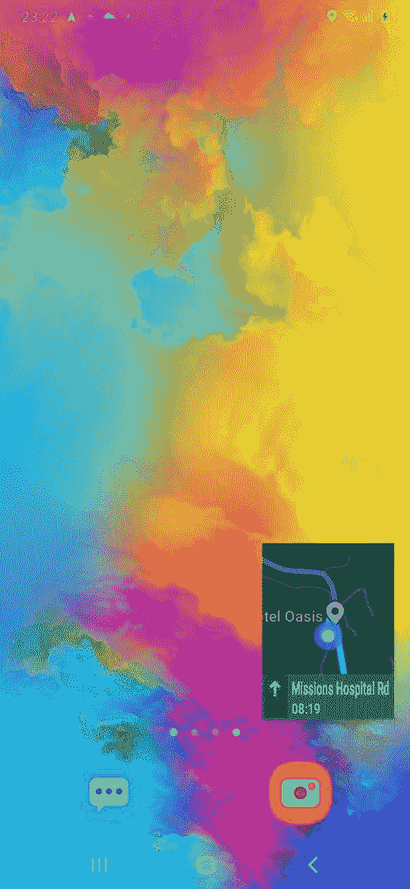
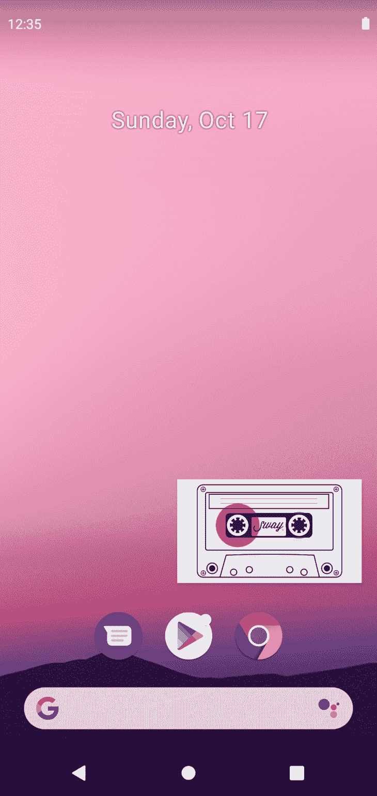
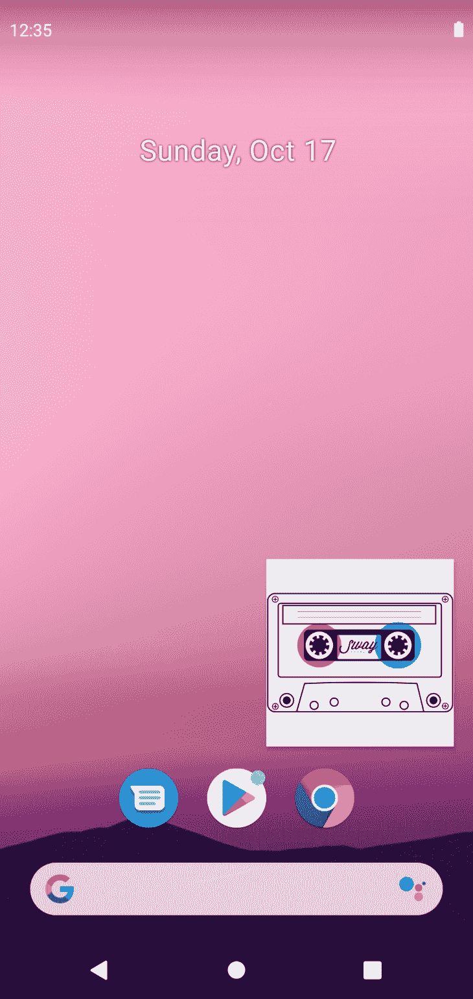
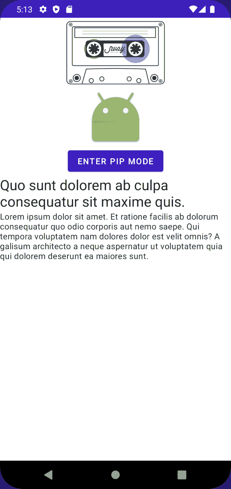

# 在 Android 上实现画中画模式

> 原文：<https://blog.logrocket.com/implementing-picture-in-picture-mode-android/>

在您的移动应用中实现画中画(PiP)模式对您的用户非常有益，尤其是当您的应用显示高优先级的数据或内容时。例如，即使用户导航离开应用程序，您的应用程序也可以在 PiP 窗口中显示导航方向、体育动态或运行视频通话。

在本教程中，我们将学习实现画中画模式，以增强我们的用户体验。

## 什么是画中画模式？

PiP 模式允许用户利用 Android 的多窗口 API 同时打开多个应用程序。如果用户正在运行一个应用程序并按下主屏幕按钮，该应用程序不会完全关闭，可以继续以画中画模式运行，在用户与其他应用程序交互时悬停在屏幕上。



## 设置我们的 Android 应用程序

只有 Android 8.0(API 26 级)及以上版本的设备才支持画中画模式。转到你的应用程序的`build.gradle`文件，将`minSdk`版本设置为`26`，就像这样:

```
defaultConfig {
    applicationId "com.example.pip"
    minSdk 26
    targetSdk 30
    ...
}

```

接下来，决定应用程序中的哪个屏幕需要画中画模式。你的应用程序中的所有屏幕不一定都需要画中画模式，因为 Android 只允许你为应用程序的特定屏幕设置画中画模式。

要为任何活动启用画中画模式，请转到`AndroidManifest.xml`文件，对该活动进行以下更改:

```
<activity
    android:name=".MainActivity"
    android:exported="true"
    //Add the following line
    android:supportsPictureInPicture="true">
</activity>

```

为了本教程的简洁，我们应用程序的主屏幕播放一个简单的动画循环。我们希望它在用户与其他应用程序交互时以画中画模式显示。

目前，如果用户按下 home 键，我们的应用程序就会消失。现在让我们为我们的应用程序加入画中画模式。

## 在 Android 上实现画中画模式

我们希望在两种情况下在我们的 Android 应用中触发画中画模式:

*   当用户按下 **Home** 按钮时
*   当用户按下应用程序中的**进入画中画模式**按钮时

要实现画中画模式，转到`MainActivity`文件并进行以下更改:

```
override fun onCreate(savedInstanceState: Bundle?) {
    //listener for button click
    button.setOnClickListener {
        enterPipMode()
    }
}
  //This method is triggered when 
  //Home button is pressed.
override fun onUserLeaveHint() {
    enterPipMode()
}

private fun enterPipMode() {
    val params = PictureInPictureParams.Builder().build();
    enterPictureInPictureMode(params)
}

```

在我们的代码块中进行上述更改后，我们可以正确地转换到 PiP 模式。

## 更改画中画窗口的纵横比

根据您的应用，您还可以自定 PiP 窗口的纵横比。如果您的应用程序屏幕以横向视图显示重要内容，如视频，您可能想要以 16:9 的宽高比显示 PiP 窗口。

这将有助于从 PiP 窗口中剔除不必要的信息，以便只有您想要显示的重要内容才会占据 PiP 窗口的整个宽度和高度。

我们还可以通过使用`setAspectRatio()`方法来修改 PiP 窗口的纵横比。纵横比可以设置为`PictureInPictureParams`，如下图所示。

```
private fun enterPipMode() {
    val aspectRatio = Rational(16, 9)
    val params = PictureInPictureParams
        .Builder()
        .setAspectRatio(aspectRatio)
        .build()
    enterPictureInPictureMode(params)
}

```

上面的代码将纵横比设置为 16:9，因此我们的应用程序在画中画模式下应该是这样的:



要使 PiP 窗口变成方形，您可以通过进行以下更改将纵横比设定为 1:1:

```
val aspectRatio = Rational(1, 1)
val params = PictureInPictureParams
    .Builder()
    .setAspectRatio(aspectRatio)
    .build()
enterPictureInPictureMode(params)

```



现在是正方形了！

## 在画中画模式下调整窗口大小

既然我们已经学会了如何实现画中画模式和调整窗口的纵横比，我们需要考虑应用程序的画中画窗口大小。

在画中画模式下，请注意窗口大小比正常活动屏幕小得多。这意味着用户可能无法与屏幕交互，甚至无法看到屏幕上更小的细节。

在 PiP 模式下，只显示应用程序中至关重要的细节，隐藏所有不重要的细节是一个好主意。当用户切换到正常的全屏活动时，恢复视图也很重要。

让我们来看一个例子。下面，我们的 Android 应用程序包含大量在 PiP 模式下不可用或不适用的不重要的细节，例如 Android 图标、按钮和多余的文本。

当用户进入画中画模式时，我们需要隐藏这个文本，但是当用户全屏查看屏幕时，我们需要显示它。



要隐藏和恢复这些视图，转到`MainActivity`文件并添加以下代码:

```
override fun onPictureInPictureModeChanged(isInPictureInPictureMode: Boolean, newConfig: Configuration) {
    if (isInPictureInPictureMode) {
        //hide all unimportant views
        image.visibility = GONE
        button.visibility = GONE
        heading.visibility = GONE
        description.visibility = GONE
    } else {
        //show all unimportant views
        image.visibility = VISIBLE
        button.visibility = VISIBLE
        heading.visibility = VISIBLE
        description.visibility = VISIBLE
    }
}
```

正如你所看到的，现在只有我们的应用程序的重要方面显示在画中画模式。当用户点击我们的应用程序时，它会扩展到全屏并显示文本。

## 在 Android 的画中画模式下设置自定义动作

画中画模式确实为用户提供了一种与应用程序交互的方式。当应用程序处于画中画模式时，您可以使用`RemoteAction`设置用户可用的自定义操作列表。

远程操作由以下属性定义:

```
- Icon
- Title
- Content description
- Pending intent

```

您可以在 PiP 窗口中添加要执行的远程操作列表。对于本例，我们将在 PiP 窗口中添加一个信息按钮，单击该按钮将打开一个 web 浏览器。

要添加此操作，请对`MainActivity`文件进行以下更改。

```
private fun enterPipMode() {
    val actions: ArrayList<RemoteAction> = ArrayList()
    val remoteAction = RemoteAction(
        Icon.createWithResource([email protected], 
          android.R.drawable.ic_menu_info_details),
          "Info","Info Details",
        PendingIntent.getActivity([email protected], 0, 
        Intent(Intent.ACTION_VIEW, Uri.parse("http://www.google.com")), 0)
    )
    //Add the above action to the List
    actions.add(remoteAction)
    val aspectRatio = Rational(16, 9)
    val params = PictureInPictureParams
        .Builder()
        .setAspectRatio(aspectRatio)
    //Set the list of actions to the params
        .setActions(actions)
        .build()
    enterPictureInPictureMode(params)
}

```

现在，当窗口中的 info 按钮被按下时，一个自定义操作将打开 web 浏览器。使用这段代码，您可以为应用程序中的用例添加几个不同的操作。

🗒️注意:如果一个应用程序有视频播放，那么默认情况下会出现播放、暂停、下一个和上一个控件。

## 实施画中画模式时的最佳实践

为了确保没有运行同一个活动的多个实例，我们需要在`AndroidManifest`文件中将 PiP 活动的启动模式设置为`singleTask`。

```
android:launchMode="singleTask"

```

一旦我们这样做了，无论是在全屏模式下还是在画中画模式下，活动的相同实例都将被保持。

我们还需要确保当活动的配置发生变化时，活动不会丢失任何数据。为此，将这段代码添加到`AndroidManifest`文件中:

```
android:configChanges="screenSize|smallestScreenSize|screenLayout|orientation"

```

现在,`AndroidManifest`文件应该是这样的:

```
<activity
    android:name=".MainActivity"
    android:configChanges="screenSize|smallestScreenSize|screenLayout|orientation"
    android:exported="true"
    android:launchMode="singleTask"
    android:supportsPictureInPicture="true">
    <intent-filter>
        <action android:name="android.intent.action.MAIN" />
        <category android:name="android.intent.category.LAUNCHER" />
    </intent-filter>
</activity>

```

## 结论

在本教程中，我们已经成功地在 Android 应用程序中实现了 PiP 模式，包括如何将 PiP 添加到 Android 活动中，设置 PiP 窗口的纵横比和大小，以及检测从活动到 PiP 的转换，反之亦然。

画中画模式应该只在你的应用程序需要向用户显示关键信息时使用，否则它会变得很突兀。在 [GitHub](https://github.com/Shivamdhuria/pip_mode) 上查看我们应用的最终代码。

## 使用 [LogRocket](https://lp.logrocket.com/blg/signup) 消除传统错误报告的干扰

[](https://lp.logrocket.com/blg/signup)

[LogRocket](https://lp.logrocket.com/blg/signup) 是一个数字体验分析解决方案，它可以保护您免受数百个假阳性错误警报的影响，只针对几个真正重要的项目。LogRocket 会告诉您应用程序中实际影响用户的最具影响力的 bug 和 UX 问题。

然后，使用具有深层技术遥测的会话重放来确切地查看用户看到了什么以及是什么导致了问题，就像你在他们身后看一样。

LogRocket 自动聚合客户端错误、JS 异常、前端性能指标和用户交互。然后 LogRocket 使用机器学习来告诉你哪些问题正在影响大多数用户，并提供你需要修复它的上下文。

关注重要的 bug—[今天就试试 LogRocket】。](https://lp.logrocket.com/blg/signup-issue-free)

## LogRocket :即时重现你的安卓应用中的问题。

[](https://lp.logrocket.com/blg/kotlin-signup)

[LogRocket](https://lp.logrocket.com/blg/kotlin-signup) 是一款 Android 监控解决方案，可以帮助您即时重现问题，确定 bug 的优先级，并了解您的 Android 应用程序的性能。

LogRocket 还可以向你展示用户是如何与你的应用程序互动的，从而帮助你提高转化率和产品使用率。LogRocket 的产品分析功能揭示了用户不完成特定流程或不采用新功能的原因。

开始主动监控您的 Android 应用程序— [免费试用 LogRocket】。](hhttps://lp.logrocket.com/blg/kotlin-signup)