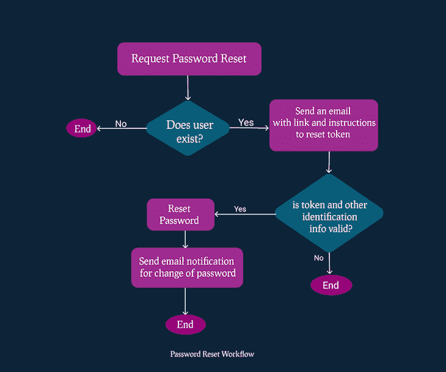
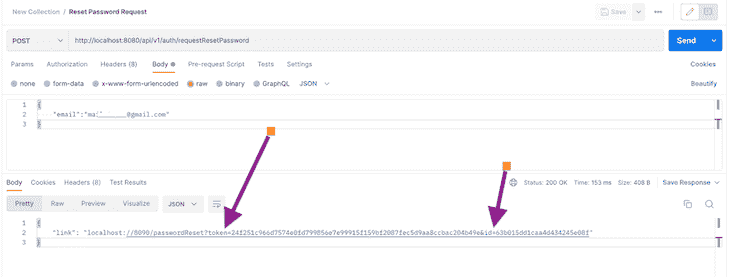
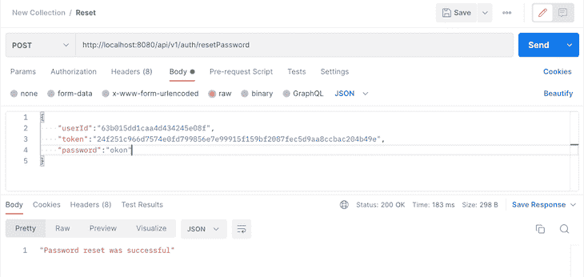

# 在 Node.js - LogRocket 博客中实现安全密码重置

> 原文：<https://blog.logrocket.com/implementing-secure-password-reset-node-js/>

***编者按:**这篇关于在 Node.js 中实现安全密码重置的指南最后一次更新是在 2023 年 1 月 6 日，更新了所有过时的信息，增加了关于 Postman 中 API 测试的一节，并澄清了关于在 Node.js 中实现忘记密码重置的一节，你可以在这里了解更多关于 web 安全的[。](https://blog.logrocket.com/web-security-101/)*

创建一个你能记住的强密码并不容易。为不同网站使用唯一密码的用户(这是理想的)更容易忘记他们的密码。因此，添加一个允许用户在忘记密码时安全重置密码的功能至关重要。

这篇文章是关于用 [Node.js](http://nodejs.org) 和 [Express.js](https://expressjs.com/) 构建一个安全的重置密码特性。现在，让我们开始吧。

*向前跳转:*

## 为您的密码重置功能创建工作流程

首先，按照本教程，这里有一些需要注意的要求:

*   你应该对 [JavaScript](https://blog.logrocket.com/12-tips-for-writing-clean-and-scalable-javascript-3ffe30abfe20/) 和 [Node.js](https://blog.logrocket.com/node-js-logging-best-practices-essential-guide/) 有基本的了解
*   您已经安装了 Node.js，或者您可以下载并安装最新版本的 [Node.js](https://nodejs.org/en/)
*   你已经安装了 [MongoDB](https://www.mongodb.com/) 数据库，或者在 [MongoDB](http://mongodb.com) 网站上创建一个账户并设置一个免费的数据库

密码重置的工作流可以采用不同的形状和大小，这取决于您希望应用程序的可用性和安全性。

在本文中，我们将逐步实现一个标准的、安全的密码重置设计。下图说明了此功能的工作流程。以下是涉及的关键步骤:

*   请求密码重置:如果用户存在，他们可以通过请求重置来启动密码重置过程
*   验证用户信息:系统将通过对照用户帐户记录检查所提供的信息来验证用户的身份
*   提供身份信息:系统会提示用户提供额外的身份信息，如回答安全问题或输入发送到其电子邮件或电话的代码
*   重置密码或拒绝请求:如果用户的身份验证成功，系统将重置他们的密码。如果验证失败，密码重置请求将被拒绝

按照这些步骤，您可以创建一个既安全又易于用户使用的密码重置功能。以下是重设密码工作流程的可视化示例:



## 如何在 Node.js 中实现忘记密码

让我们创建一个简单的项目来演示如何实现密码重置特性。注意，你可以在 GitHub 上用 Node.js 找到[完成的关于密码重置的项目，也可以跳转到本教程的密码重置部分。让我们首先用](https://github.com/ezesundayeze/forgotpassword) [npm 包管理器](https://blog.logrocket.com/advanced-package-manager-features-npm-yarn-pnpm/)初始化我们的项目。

在您的终端/命令提示符下运行`npm init`,并按照说明设置项目。

### 文件夹结构和文件

我们的文件夹结构将如下所示:

*   控制器
*   服务
*   模型
    *   `user.model.js`
    *   `token.model.js`
*   路线
*   实用工具
    *   `Emails`
        *   `Template`
            *   `requestResetPassword.handlebars`
            *   `resetPassword.handlebars`
        *   `sendEmail.js`
*   `index.js`
*   `db.js`
*   `package.json`

### 使用密码重置设置项目的依赖关系

运行以下代码，安装我们将在此项目中使用的 npm 依赖项:

```
npm install bcrypt, cors, dotenv, express, express-async-errors, handlebars, jsonwebtoken, mongoose, nodemailer, nodemon
```

我们将使用以下内容:

*   `bcrypt`:哈希密码，重置令牌
*   `cors`:禁用[跨产地资源共享](https://blog.logrocket.com/the-ultimate-guide-to-enabling-cross-origin-resource-sharing-cors/)，至少为了开发目的
*   `dotenv`:允许我们的节点进程访问环境变量
*   `express-async-errors`:捕捉所有的`async`错误，这样我们的整个代码库就不会被`try-catch`弄得乱七八糟
*   `handlebars`:作为[模板引擎](https://blog.logrocket.com/top-express-js-template-engines-for-dynamic-html-pages/)发送 HTML 邮件
*   `mongoose`:作为与 MongoDB 数据库接口的驱动程序
*   `nodemailer`:发送电子邮件
*   `nodemon`:文件改变时重启服务器

### 创建环境变量

在我们的应用程序中，一些变量会根据我们运行应用程序的环境而变化——生产、开发或试运行。对于这些变量，我们将把它们添加到环境变量中。

首先，在根目录下创建一个`.env`文件，并将以下变量粘贴到其中。我们正在添加一个`bcrypt salt`，我们的`database URL`，一个`JWT_SECRET`，和一个`client URL`。在接下来的过程中，您将看到我们将如何使用它们:

```
# .env
BCRYPT_SALT=10
DB_URL=mongodb://127.0.0.1:27017/testDB
JWT_SECRET=mfefkuhio3k2rjkofn2mbikbkwjhnkj
CLIENT_URL=localhost://8090

```

## 连接到 MongoDB 数据库

让我们创建一个到 MongoDB 的连接。这段代码应该在你的`db.js`文件的根目录下:

```
// db.js
const mongoose = require("mongoose");
let DB_URL = process.env.DB_URL;// here we are using the MongoDB Url we defined in our ENV file

module.exports = async function connection() {
  try {
    await mongoose.connect(
      DB_URL,
      {
        useNewUrlParser: true,
        useUnifiedTopology: true,
        useFindAndModify: false,
        useCreateIndex: true,
        autoIndex: true,
      },
      (error) => {
        if (error) return new Error("Failed to connect to database");
        console.log("connected");
      }
    );
  } catch (error) {
    console.log(error);
  }
};

```

## 设置 Express.js 应用程序

让我们构建我们的应用程序入口点，并在`port 8080`提供服务。复制并粘贴到根目录下的`index.js`文件中:

```
// index.js
require("express-async-errors");
require("dotenv").config();
const express = require("express");
const app = express();
const connection = require("./db");
const cors = require("cors");

const port = 8080;
(async function db() {
  await connection();
})();

app.use(cors());
app.use(express.json());
app.use("/api/v1", require("./routes/index.route"));
app.use((error, req, res, next) => {
  res.status(500).json({ error: error.message });
});

app.listen(port, () => {
  console.log("Listening to Port ", port);
});

module.exports = app;

```

## 设置`token`和`user`模型

为了创建一个密码重置系统，我们需要建立两个独立的模型:一个`user`模型和一个`token`模型。`user`模型将包含每个用户的信息，比如他们的电子邮件地址、用户名和散列密码。该模型将用于验证请求密码重置的用户的身份，并在请求重置后更新其密码。

### `token`型号

我们的`token`模型将有大约一个小时的到期时间。在此期间，用户需要完成密码重置过程。否则，`token`将从数据库中删除。使用 MongoDB，您不必编写额外的代码来实现这一点。就像这样在你的日期字段中设置`expires`:

```
createdAt: {
  type: Date,
  default: Date.now,
  expires: 3600,// this is the expiry time
},

```

您应该将这段代码添加到模型目录中的文件`token.model.js`中。这是我们的模型的样子:

```
// models/token.model.js
const mongoose = require("mongoose");
const Schema = mongoose.Schema;
const tokenSchema = new Schema({
  userId: {
    type: Schema.Types.ObjectId,
    required: true,
    ref: "user",
  },
  token: {
    type: String,
    required: true,
  },
  createdAt: {
    type: Date,
    default: Date.now,
    expires: 3600,// this is the expiry time in seconds
  },
});
module.exports = mongoose.model("Token", tokenSchema);

```

### `user`型号

`user`模型将定义用户数据如何保存在数据库中。确保安全存储密码非常重要，因为以明文形式存储密码存在安全风险。为了避免这种情况，我们可以使用一个安全的单向散列算法，比如 bcrypt ，它包含一个 salt 来进一步增加散列的强度。

在下面的代码中，我们使用 [bcrypt](https://www.npmjs.com/package/bcrypt) 对密码进行哈希处理以保护它们，并且即使数据库遭到破坏，也几乎不可能逆转哈希过程。即使作为管理员，我们也不应该知道用户的明文密码，使用安全哈希算法也有助于确保这一点:

```
// user.model.js
const mongoose = require("mongoose");
const bcrypt = require("bcrypt");
const Schema = mongoose.Schema;
const bcryptSalt = process.env.BCRYPT_SALT;
const userSchema = new Schema(
  {
    name: {
      type: String,
      trim: true,
      required: true,
      unique: true,
    },
    email: {
      type: String,
      trim: true,
      unique: true,
      required: true,
    },
    password: { type: String },
  },
  {
    timestamps: true,
  }
);
userSchema.pre("save", async function (next) {
  if (!this.isModified("password")) {
    return next();
  }
  const hash = await bcrypt.hash(this.password, Number(bcryptSalt));
  this.password = hash;
  next();
});
module.exports = mongoose.model("user", userSchema);

```

在保存密码之前，使用`pre-save` [MongoDB 钩子](https://blog.logrocket.com/mern-stack-tutorial/)对密码进行哈希处理，如下面的代码所示。如在`.env`文件中所指定的，使用`10`的盐来增加散列的强度，并降低密码被恶意参与者猜到的可能性:

```
...
userSchema.pre("save", async function (next) {
  if (!this.isModified("password")) {
    return next();
  }
  const hash = await bcrypt.hash(this.password, Number(bcryptSalt));
  this.password = hash;
  next();
});

```

## 为密码重置过程创建服务

我们将有三个服务来完全启动和处理我们的密码重置周期:

*   注册过程:允许用户创建帐户的设置
*   密码重置请求:该服务将允许用户请求密码重置令牌来验证用户的帐户所有权
*   密码重置:输入收到的密码重置令牌，创建并确认新密码，并用新密码更新帐户

### 注册服务

当然，如果用户没有帐户，我们无法重置他们的密码。因此，该服务将为新用户创建一个帐户。

下面的代码应该在`service/auth.service.js`文件中:

```
// service/auth.service.js
const JWT = require("jsonwebtoken");
const User = require("../models/User.model");
const Token = require("../models/Token.model");
const sendEmail = require("../utils/email/sendEmail");
const crypto = require("crypto");
const bcrypt = require("bcrypt");

const signup = async (data) => {
  let user = await User.findOne({ email: data.email });
  if (user) {
    throw new Error("Email already exist");
  }
  user = new User(data);
  const token = JWT.sign({ id: user._id }, JWTSecret);
  await user.save();
  return (data = {
    userId: user._id,
    email: user.email,
    name: user.name,
    token: token,
  });
};

```

## 设置密码重置请求服务

按照我们的工作流程，第一步是请求密码重置令牌，对吗？

是的，让我们从这里开始。在下面的代码中，我们检查用户是否存在。如果用户存在，我们检查是否已经为该用户创建了一个现有的`token`。如果存在，我们删除`token`,如下所示:

```
//auth.service.js  
const user = await User.findOne({ email });

  if (!user) {
      throw new Error("User does not exist");
  }
  let token = await Token.findOne({ userId: user._id });
  if (token) { 
        await token.deleteOne()
  };

```

现在，注意这部分！在这段代码中，使用 [Node.js crypto API](https://nodejs.org/api/crypto.html) 生成了一个新的随机数`token`。此`token`将发送给用户，并可用于重置其密码:

```
let resetToken = crypto.randomBytes(32).toString("hex");
```

现在，为这个`token`创建一个`hash`，我们将把它保存在数据库中，因为在我们的数据库中保存普通的`resetToken`会暴露漏洞，这将破坏设置安全密码重置的整个目的:

```
const hash = await bcrypt.hash(resetToken, Number(bcryptSalt));
```

然而，我们将把普通的`token`发送到用户的电子邮件，如下面的代码所示，然后在下一部分，我们将验证`token`并允许他们创建一个新密码:

```
// service/auth.service.js
const JWT = require("jsonwebtoken");
const User = require("../models/User.model");
const Token = require("../models/Token.model");
const sendEmail = require("../utils/email/sendEmail");
const crypto = require("crypto");
const bcrypt = require("bcrypt");

const requestPasswordReset = async (email) => {

  const user = await User.findOne({ email });

  if (!user) throw new Error("User does not exist");
  let token = await Token.findOne({ userId: user._id });
  if (token) await token.deleteOne();
  let resetToken = crypto.randomBytes(32).toString("hex");
  const hash = await bcrypt.hash(resetToken, Number(bcryptSalt));

  await new Token({
    userId: user._id,
    token: hash,
    createdAt: Date.now(),
  }).save();

  const link = `${clientURL}/passwordReset?token=${resetToken}&id=${user._id}`;
  sendEmail(user.email,"Password Reset Request",{name: user.name,link: link,},"./template/requestResetPassword.handlebars");
  return link;
};

```

重置密码链接包含`token`和`userID`，两者都将用于在用户重置密码之前验证用户的身份。

它还包含`clientURL`，这是用户必须单击才能继续重置过程的根域:

```
const link = `${clientURL}/passwordReset?token=${resetToken}&id=${user._id}`;

```

对于重置用户密码的请求，用户将发送一个 POST 请求，其电子邮件是请求正文中的唯一项目:

```
{
   email:"[email protected]"
}

```

在 [GitHub 库](https://github.com/ezesundayeze/forgotpassword/blob/master/utils/email/sendEmail.js)可以找到函数`sendEmail`，在这里可以找到邮件模板[。我们使用](https://github.com/ezesundayeze/forgotpassword/blob/master/utils/email/template/requestResetPassword.handlebars)[node mailer](https://nodemailer.com/about/)(node . js 的 npm 包，使开发人员能够通过各种电子邮件服务提供商轻松地从他们的应用程序发送电子邮件)和 [handlebars](https://handlebarsjs.com/) 模板引擎来发送电子邮件。

### 重置密码服务

哦，看哪！我收到了一封电子邮件，确认我提出了密码重置请求。现在，接下来我将点击**链接**:


一旦你点击**链接**，它会把你带到密码重置页面。你可以用任何你想要的技术来构建这个前端，因为这只是一个 API。

此时，我们将发回一个`token`、一个新的`password`和一个`userID`来验证用户，然后创建一个新的密码。

下面是我们将发送回重置密码 API 的内容:

```
{
    "token":"4f546b55258a10288c7e28650fbebcc51d1252b2a69823f8cd1c65144c69664e",
    "userId":"600205cc5fdfce952e9813d8",
    "password":"kjgjgkflgk.hlkhol"
}

```

它将由下面的代码处理:

```
// service/auth.service.js
const resetPassword = async (userId, token, password) => {
  let passwordResetToken = await Token.findOne({ userId });
  if (!passwordResetToken) {
    throw new Error("Invalid or expired password reset token");
  }
  const isValid = await bcrypt.compare(token, passwordResetToken.token);
  if (!isValid) {
    throw new Error("Invalid or expired password reset token");
  }
  const hash = await bcrypt.hash(password, Number(bcryptSalt));
  await User.updateOne(
    { _id: userId },
    { $set: { password: hash } },
    { new: true }
  );
  const user = await User.findById({ _id: userId });
  sendEmail(
    user.email,
    "Password Reset Successfully",
    {
      name: user.name,
    },
    "./template/resetPassword.handlebars"
  );
  await passwordResetToken.deleteOne();
  return true;
};

```

注意我们是如何使用 bcrypt 来比较服务器收到的`token`和数据库中的散列版本的？：

```
const isValid = await bcrypt.compare(token, passwordResetToken.token);
```

如果它们相同，那么我们继续散列新密码:

```
  const hash = await bcrypt.hash(password, Number(bcryptSalt));

```

然后，用新密码更新用户帐户:

```
await User.updateOne(
    { _id: userId },
    { $set: { password: hash } },
    { new: true }
  );

```

只是为了让用户了解每一步，我们将向他们发送一封电子邮件来确认`password`中的更改，并从数据库中删除`token`。

到目前为止，我们已经能够创建服务来注册新用户并重置他们的密码。

太棒了。

## 密码重置服务的控制器

以下是这些服务的控制器。控制器从用户处收集数据，将它们发送给服务以处理数据，然后将结果返回给用户:

```
controllers/auth.controller.js
// controllers/auth.controller.js
const {
  signup,
  requestPasswordReset,
  resetPassword,
} = require("../services/auth.service");

const signUpController = async (req, res, next) => {
  const signupService = await signup(req.body);
  return res.json(signupService);
};

const resetPasswordRequestController = async (req, res, next) => {
  const requestPasswordResetService = await requestPasswordReset(
    req.body.email
  );
  return res.json(requestPasswordResetService);
};

const resetPasswordController = async (req, res, next) => {
  const resetPasswordService = await resetPassword(
    req.body.userId,
    req.body.token,
    req.body.password
  );
  return res.json(resetPasswordService);
};

module.exports = {
  signUpController,
  resetPasswordRequestController,
  resetPasswordController,
};

```

## 用 Postman 测试 API

让我们使用 Postman 来测试 API，以确保正确的功能。我们将发出各种请求来模拟整个过程，从请求密码重置令牌到最终重置密码。

### 重置密码请求示例

首先，我们将向密码重置请求端点发出 POST 请求，请求正文中包含用户的电子邮件，如下图所示:



注意，响应包括一个带有`token`和`userId`的链接。您可以设计您的系统以任何适合您需要的方式返回这些数据。前端将使用此信息进行下一步:重置密码。

要重置密码，客户端将向重置密码端点发送一个 POST 请求，包含`userId`、`token`和新的`password`，如下图所示:



就是这样。我也收到了一封邮件，😄：


恭喜您，您已经在 Node.js 中为您的用户创建了一个安全的重置密码特性。

接下来你能做什么？您可以做一些事情来使这个密码重置功能更加安全。

您可以要求用户提供他们的安全问题的答案(他们必须已经创建了这些问题和答案)。确保使用安全的托管服务。一个不安全的托管服务可以为你作为管理员创造一个后门。如果你的主机服务没有做好，即使你的系统看起来很安全，坏人也可能会破坏它。

您还可以使用 [Google Authenticator](https://googleauthenticator.net/) 或 SMS 实现双因素认证(2FA)。这样，即使用户的电子邮件已经被攻破，黑客也需要拥有用户的手机。

记住，根本不要存储用户的密码。每次忘记密码都要重新设置，压力很大。相反，你可以允许你的用户使用已经存在的服务登录，比如脸书、GitHub、Gmail 等等。这样，他们就再也不需要记住他们的密码了。他们只需要担心他们在第三方网站上的密码。

如果你想玩玩已经完成的项目，你可以在 [GitHub](https://github.com/ezesundayeze/forgotpassword) 上查看。

## 结论

数字安全不是一个笑话。黑客总是在寻找新的方法来入侵系统，所以你应该总是在寻找新的方法来使他们的生活变得困难。

* * *

### 更多来自 LogRocket 的精彩文章:

* * *

您的用户相信您会保护他们的数据，您不想让他们失望。你有什么其他方法可以让密码重设功能更安全？感谢阅读。

## 200 只显示器出现故障，生产中网络请求缓慢

部署基于节点的 web 应用程序或网站是容易的部分。确保您的节点实例继续为您的应用程序提供资源是事情变得更加困难的地方。如果您对确保对后端或第三方服务的请求成功感兴趣，

[try LogRocket](https://lp.logrocket.com/blg/node-signup)

.

[](https://lp.logrocket.com/blg/node-signup)[https://logrocket.com/signup/](https://lp.logrocket.com/blg/node-signup)

LogRocket 就像是网络和移动应用程序的 DVR，记录下用户与你的应用程序交互时发生的一切。您可以汇总并报告有问题的网络请求，以快速了解根本原因，而不是猜测问题发生的原因。

LogRocket 检测您的应用程序以记录基线性能计时，如页面加载时间、到达第一个字节的时间、慢速网络请求，还记录 Redux、NgRx 和 Vuex 操作/状态。

[Start monitoring for free](https://lp.logrocket.com/blg/node-signup)

.