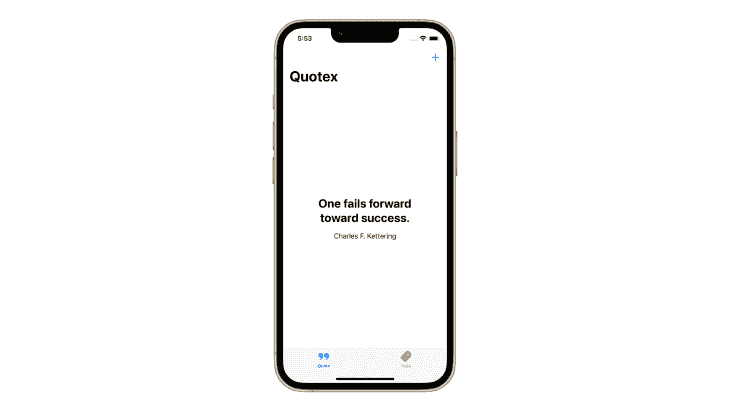
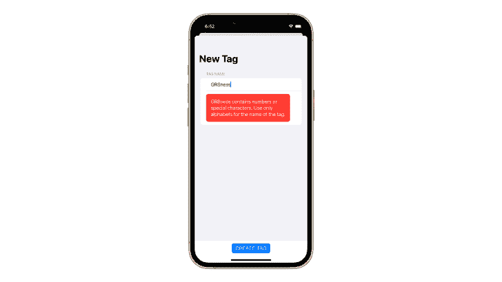
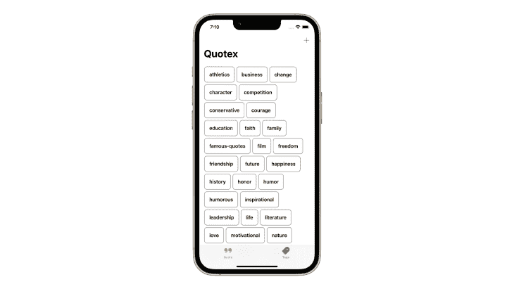

# 使用 SwiftUI 实现标签

> 原文：<https://blog.logrocket.com/implementing-tags-swiftui/>

应用程序和网站经常使用标签来过滤和显示数据。例如，你可能会在旅行应用程序中选择一个**直达**标签，以避免显示有一个或多个停留或中途停留的航班。或者，在一个消费应用程序中，你可以使用标签来更好地了解过去几年你在网飞上花了多少钱。或者，在工作门户中，您可以根据特定的语言标签进行过滤，以仅显示特别需要某种语言(如 Swift、JavaScript、Rust 或 Dart)经验的工作列表。

在许多情况下，标签可能对您的 iOS 应用程序有用。本指南演示了如何在 SwiftUI 中创建使用标签的简单视图。我们将通过在报价查看器应用程序中创建标签视图来说明使用 SwiftUI 的标签的实际用例。标签将从 API 中获取，用户将能够添加自定义标签。我们将为应用程序创建逻辑，以忽略重复的标签并拒绝不符合特定格式的标签。

所以，让我们开始添加一些标签吧！

*向前跳转:*

## 什么是标签？

标签用于区分不同的类型或类别。比如不同流派的电影或者 App Store 里各种类别的应用。标签帮助用户使用预定的标准过滤内容集合。

例如，您可以在引语中添加不同的标签，这样类似的引语就可以按照特定的主题(或标签)进行分类或分组，如哲学、动机等。

每个标签都应该由自己唯一标识，因为它的作用是将内容分隔到不同的唯一数据容器中。因此，您需要确保没有重复的标签，因为这可能会让用户感到困惑。例如，“快乐”和“幸福”应该放在一个单独的类别下。

此外，如果用户有权添加他们自己的标签，您可能希望实现接受特定格式并拒绝其余格式的条件。您可能希望将标签限制为字母，拒绝任何包含数字或特殊字符的标签，或者设置一些关于大写的标准。

现在，让我们开始我们的项目。

## 开源 SwiftUI 标签视图库

GitHub 上有许多使用 SwiftUI 创建的标记视图库可供您利用，而不是从头开始创建。您可以使用这些开源库来创建一个简单的视图，以便在 SwiftUI 中使用标签。在众多可用的标记视图库中，有三个可以考虑在您的项目中使用:

在本文中，我们将演示如何在 SwiftUI 中从头开始创建标记视图，而不是使用第三方库。通过创建您自己的定制标记视图，您将能够根据您的需要修改它，随着项目的增长添加强大的定制。

## SwiftUI 项目入门

为了开始使用 SwiftUI 实现标记，我们将处理一个名为 Quotex 的示例项目，其中包含一组按标记分类的报价。这个项目使用了 [Quotable](https://github.com/lukePeavey/quotable) ，一个免费的开源报价 API。您可以在这里找到示例项目。

示例应用程序已经设置了一些基本的屏幕来获取和显示随机报价:



我们将添加列出标签的功能，并为用户创建一个视图来创建他们自己的标签。

### 在 SwiftUI 中创建标记视图

让我们创建一个自定义视图，将本文中使用的示例标签包装成多行。这将防止标签在屏幕上流动。下面提供的解决方案是受 StackOverflow 上这个问题的启发:[swift ui h stack with wrap and dynamic height](https://stackoverflow.com/questions/62102647/swiftui-hstack-with-wrap-and-dynamic-height)。

我们将从包含符合`RandomAccessCollection`协议的数据的定制视图开始，其中每个元素都符合`Identifiable`和`Hashable`协议。它还有一个符合`View`协议的`RowContent`视图，代表标签集合中的单个标签:

```
struct FlowLayout<Data, RowContent>: View where Data: RandomAccessCollection, RowContent: View, Data.Element: Identifiable, Data.Element: Hashable {
  @State private var height: CGFloat = .zero

  private var data: Data
  private var spacing: CGFloat
  private var rowContent: (Data.Element) -> RowContent

  public init(_ data: Data, spacing: CGFloat = 4, @ViewBuilder rowContent: @escaping (Data.Element) -> RowContent) {
    self.data = data
    self.spacing = spacing
    self.rowContent = rowContent
  }

  // implementation
}

```

然后，我们将添加一个公式来计算每个标签的`size`和`width`，这样标题较长的标签将自动换行:

```
private func content(in geometry: GeometryProxy) -> some View {
  var bounds = CGSize.zero

  return ZStack {
    ForEach(data) { item in
      rowContent(item)
        .padding(.all, spacing)
        .alignmentGuide(VerticalAlignment.center) { dimension in
          let result = bounds.height

          if let firstItem = data.first, item == firstItem {
            bounds.height = 0
          }
          return result
        }
        .alignmentGuide(HorizontalAlignment.center) { dimension in
          if abs(bounds.width - dimension.width) > geometry.size.width {
            bounds.width = 0
            bounds.height -= dimension.height
          }

          let result = bounds.width

          if let firstItem = data.first, item == firstItem {
            bounds.width = 0
          } else {
            bounds.width -= dimension.width
          }
          return result
        }
    }
  }
}

```

为了确保最大高度不超过视图，我们将使用帧局部计算`height`:

```
var body: some View {
  GeometryReader { geometry in
    content(in: geometry)
      .background(viewHeight(for: $height))
  }
  .frame(height: height)
}

private func viewHeight(for binding: Binding<CGFloat>) -> some View {
  GeometryReader { geometry -> Color in
    let rect = geometry.frame(in: .local)

    DispatchQueue.main.async {
      binding.wrappedValue = rect.size.height
    }
    return .clear
  }
}

```

最终的实现将如下所示:

```
import SwiftUI

struct FlowLayout<Data, RowContent>: View where Data: RandomAccessCollection, RowContent: View, Data.Element: Identifiable, Data.Element: Hashable {
  @State private var height: CGFloat = .zero

  private var data: Data
  private var spacing: CGFloat
  private var rowContent: (Data.Element) -> RowContent

  public init(_ data: Data, spacing: CGFloat = 4, @ViewBuilder rowContent: @escaping (Data.Element) -> RowContent) {
    self.data = data
    self.spacing = spacing
    self.rowContent = rowContent
  }

  var body: some View {
    GeometryReader { geometry in
      content(in: geometry)
        .background(viewHeight(for: $height))
    }
    .frame(height: height)
  }

  private func content(in geometry: GeometryProxy) -> some View {
    var bounds = CGSize.zero

    return ZStack {
      ForEach(data) { item in
        rowContent(item)
          .padding(.all, spacing)
          .alignmentGuide(VerticalAlignment.center) { dimension in
            let result = bounds.height

            if let firstItem = data.first, item == firstItem {
              bounds.height = 0
            }
            return result
          }
          .alignmentGuide(HorizontalAlignment.center) { dimension in
            if abs(bounds.width - dimension.width) > geometry.size.width {
              bounds.width = 0
              bounds.height -= dimension.height
            }

            let result = bounds.width

            if let firstItem = data.first, item == firstItem {
              bounds.width = 0
            } else {
              bounds.width -= dimension.width
            }
            return result
          }
      }
    }
  }

  private func viewHeight(for binding: Binding<CGFloat>) -> some View {
    GeometryReader { geometry -> Color in
      let rect = geometry.frame(in: .local)

      DispatchQueue.main.async {
        binding.wrappedValue = rect.size.height
      }
      return .clear
    }
  }
}

```

我们将在 Quotex 应用程序的标签视图中使用`FlowLayout`,为其提供标签集合，如下所示:

```
ScrollView {
  FlowLayout(viewModel.tags) { tag in
    Button(action: {
      viewModel.selectTag(for: tag)
    }, label: {
      Text(tag.name)
        .bold()
        .foregroundColor(.black)
        .padding()
        .overlay(RoundedRectangle(cornerRadius: 8).stroke(.gray, lineWidth: 1.5))
    })
  }
  .padding()
}

```

在 Quotex 应用程序中运行`FlowLayout`，创建一个完美的标签视图，您可以直接在您的应用程序中使用！


### 避免重复

由于用户可能试图创建具有相似字符的标签，如“SaD”或“Sad”，我们将需要实现避免重复的逻辑，而不管字符的大小写。例如，我们可以添加一个条件，即标签必须以大写字母开头，后面跟着小写字母。但是，让用户指定标签并在以后大写第一个字母会提供更好的体验。

解决重复问题的一个简单方法是使用`Set`以便自动删除重复的标签。此外，我们可以将所有字符设置为小写，然后检查是否重复。

### 避免不需要的字符

您可能不希望用户创建带有替代字符的标签。例如，用“L$v€”代替“爱”，或者用“GR8ness”代替“伟大”。为了避免不想要的字符，我们可以设置条件来禁止符合特定条件的标签，并显示错误警告和触发错误触觉反馈。

处理条件的最佳方式是使用正则表达式。考虑只接受字母字符和空格的条件:

```
.*[^A-Za-z ].*

```

以下是验证标记名称并在不满足条件时引发错误的方法:

```
enum ValidationError: Error {
  case containsNumbersOrSpecialCharacters(String)
}

public func validateTag(for name: String) throws {
  let range = NSRange(location: 0, length: name.utf16.count)
  let regex = try NSRegularExpression(pattern: ".*[^A-Za-z ].*")

  let match = regex.firstMatch(in: name, options: [], range: range)

  if match != nil {
    // Condition not met for the tag. Show an error.\
    let errorMessage = "\(name) contains numbers or special characters. Use only alphabets for the name of the tag."
    throw ValidationError.containsNumbersOrSpecialCharacters(errorMessage)
  }
}

```

你也可以使用 iOS 16+中引入的最新 [RegexBuilder](https://developer.apple.com/documentation/regexbuilder) 来添加拒绝不遵循特定格式的标签的逻辑。

当用户试图创建一个名为“GR8ness”而不是“Greatness”的标签时，这在 Quotex 应用程序中看起来是这样的:



既然您已经了解了如何为标签创建条件，那么您就可以在您的标签视图中添加不同的标签条件了！

## 使用 iOS 16 `Layout`协议创建标签视图

在 WWDC 2022 期间，SwiftUI 团队引入了新协议`Layout`，该协议定义了视图集合的几何结构。

对于更复杂的布局行为，如创建自动换行到下一行的标记视图，您可以定义一个自定义布局容器。该结构应符合`Layout`协议，并实现其所需的方法:

*   `sizeThatFits(proposal:subviews:cache:)`报告复合布局视图的大小
*   `placeSubviews(in:proposal:subviews:cache:)`给容器的子视图分配位置

例如，基本布局类型如下所示:

```
struct BasicHStack: Layout {
  func sizeThatFits(
    proposal: ProposedViewSize,
    subviews: Subviews,
    cache: inout ()
  ) -> CGSize {
    // Calculate and return the size of the layout container.
  }

  func placeSubviews(
    in bounds: CGRect,
    proposal: ProposedViewSize,
    subviews: Subviews,
    cache: inout ()
  ) {
    // Tell each subview where to appear.
  }
}

```

您可以通过提供一个`ViewBuilder`和其中的子视图来使用这个新视图:

```
BasicHStack {    
  Text("A Subview")    
  Text("Another Subview")
}

```

苹果发布了一个名为 [FoodTruck app](https://github.com/apple/sample-food-truck) 的示例应用，它有一个`FlowLayout`，可以直接用于使用 SwiftUI 实现标签和标签视图:

```
import SwiftUI

@available(iOS 16.0, *)
struct NewFlowLayout: Layout {
  var alignment: Alignment = .center
  var spacing: CGFloat?

  func sizeThatFits(proposal: ProposedViewSize, subviews: Subviews, cache: inout Void) -> CGSize {
    let result = FlowResult(
      in: proposal.replacingUnspecifiedDimensions().width,
      subviews: subviews,
      alignment: alignment,
      spacing: spacing
    )
    return result.bounds
  }

  func placeSubviews(in bounds: CGRect, proposal: ProposedViewSize, subviews: Subviews, cache: inout Void) {
    let result = FlowResult(
      in: proposal.replacingUnspecifiedDimensions().width,
      subviews: subviews,
      alignment: alignment,
      spacing: spacing
    )
    for row in result.rows {
      let rowXOffset = (bounds.width - row.frame.width) * alignment.horizontal.percent
      for index in row.range {
        let xPos = rowXOffset + row.frame.minX + row.xOffsets[index - row.range.lowerBound] + bounds.minX
        let rowYAlignment = (row.frame.height - subviews[index].sizeThatFits(.unspecified).height) *
        alignment.vertical.percent
        let yPos = row.frame.minY + rowYAlignment + bounds.minY
        subviews[index].place(at: CGPoint(x: xPos, y: yPos), anchor: .topLeading, proposal: .unspecified)
      }
    }
  }

  struct FlowResult {
    var bounds = CGSize.zero
    var rows = [Row]()

    struct Row {
      var range: Range<Int>
      var xOffsets: [Double]
      var frame: CGRect
    }

    init(in maxPossibleWidth: Double, subviews: Subviews, alignment: Alignment, spacing: CGFloat?) {
      var itemsInRow = 0
      var remainingWidth = maxPossibleWidth.isFinite ? maxPossibleWidth : .greatestFiniteMagnitude
      var rowMinY = 0.0
      var rowHeight = 0.0
      var xOffsets: [Double] = []
      for (index, subview) in zip(subviews.indices, subviews) {
        let idealSize = subview.sizeThatFits(.unspecified)
        if index != 0 && widthInRow(index: index, idealWidth: idealSize.width) > remainingWidth {
          // Finish the current row without this subview.
          finalizeRow(index: max(index - 1, 0), idealSize: idealSize)
        }
        addToRow(index: index, idealSize: idealSize)

        if index == subviews.count - 1 {
          // Finish this row; it's either full or we're on the last view anyway.
          finalizeRow(index: index, idealSize: idealSize)
        }
      }

      func spacingBefore(index: Int) -> Double {
        guard itemsInRow > 0 else { return 0 }
        return spacing ?? subviews[index - 1].spacing.distance(to: subviews[index].spacing, along: .horizontal)
      }

      func widthInRow(index: Int, idealWidth: Double) -> Double {
        idealWidth + spacingBefore(index: index)
      }

      func addToRow(index: Int, idealSize: CGSize) {
        let width = widthInRow(index: index, idealWidth: idealSize.width)

        xOffsets.append(maxPossibleWidth - remainingWidth + spacingBefore(index: index))
        // Allocate width to this item (and spacing).
        remainingWidth -= width
        // Ensure the row height is as tall as the tallest item.
        rowHeight = max(rowHeight, idealSize.height)
        // Can fit in this row, add it.
        itemsInRow += 1
      }

      func finalizeRow(index: Int, idealSize: CGSize) {
        let rowWidth = maxPossibleWidth - remainingWidth
        rows.append(
          Row(
            range: index - max(itemsInRow - 1, 0) ..< index + 1,
            xOffsets: xOffsets,
            frame: CGRect(x: 0, y: rowMinY, width: rowWidth, height: rowHeight)
          )
        )
        bounds.width = max(bounds.width, rowWidth)
        let ySpacing = spacing ?? ViewSpacing().distance(to: ViewSpacing(), along: .vertical)
        bounds.height += rowHeight + (rows.count > 1 ? ySpacing : 0)
        rowMinY += rowHeight + ySpacing
        itemsInRow = 0
        rowHeight = 0
        xOffsets.removeAll()
        remainingWidth = maxPossibleWidth
      }
    }
  }
}

private extension HorizontalAlignment {
  var percent: Double {
    switch self {
      case .leading: return 0
      case .trailing: return 1
      default: return 0.5
    }
  }
}

private extension VerticalAlignment {
  var percent: Double {
    switch self {
      case .top: return 0
      case .bottom: return 1
      default: return 0.5
    }
  }
}

```

我们将在 Quotex 应用程序中使用它，方法是创建`NewFlowLayout`并为其提供标签集合:

```
NewFlowLayout(alignment: .leading) {
  ForEach(viewModel.tags) { tag in
    Button(action: {
      viewModel.selectTag(for: tag)
    }, label: {
      Text(tag.name)
    })
  }
}

```

在 Quotex 应用程序中运行`NewFlowLayout`，创建一个完美的标签视图，您可以直接在您的应用程序中使用！



## 结论

标签有助于根据您的需要对项目进行分类和筛选。SwiftUI 有助于轻松创建这样的定制视图，并且还会根据其内容自动调整视图的大小，方法是创建一个小而方便的`FlowLayout`视图，就像我们在本文中创建的那样。

您可以在 [GitHub](https://github.com/rudrankriyam/Quotex) 上找到本文展示的最终示例项目。

只需几个条件和正则表达式，您就可以在 SwiftUI 中创建满足您的条件并帮助您避免重复的完美标记。

我希望这篇文章对你有所帮助，并尝试在你的 iOS 应用中使用标签！

## 使用 [LogRocket](https://lp.logrocket.com/blg/signup) 消除传统错误报告的干扰

[](https://lp.logrocket.com/blg/signup)

[LogRocket](https://lp.logrocket.com/blg/signup) 是一个数字体验分析解决方案，它可以保护您免受数百个假阳性错误警报的影响，只针对几个真正重要的项目。LogRocket 会告诉您应用程序中实际影响用户的最具影响力的 bug 和 UX 问题。

然后，使用具有深层技术遥测的会话重放来确切地查看用户看到了什么以及是什么导致了问题，就像你在他们身后看一样。

LogRocket 自动聚合客户端错误、JS 异常、前端性能指标和用户交互。然后 LogRocket 使用机器学习来告诉你哪些问题正在影响大多数用户，并提供你需要修复它的上下文。

关注重要的 bug—[今天就试试 LogRocket】。](https://lp.logrocket.com/blg/signup-issue-free)