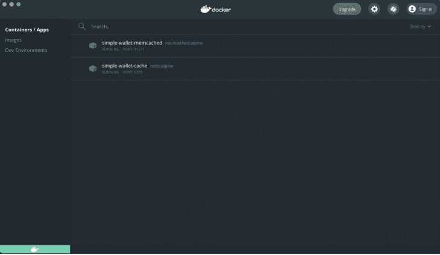
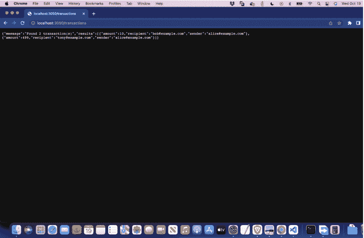

# 使用 TypeDI 和策略模式提高 Node.js 应用程序的性能

> 原文：<https://blog.logrocket.com/improve-node-js-app-performance-typedi-strategy-pattern/>

保持应用程序的高性能对于有效的运营目标至关重要。缓存和内存化有助于避免冗余计算，保持应用程序平稳运行。以云为中心的架构模式强调容错，并将状态存储在分布式缓存服务中，如 Redis 和 Memcached。

本教程将研究如何使用 [TypeDI](https://docs.typestack.community/typedi/v/develop/01-getting-started) 和策略模式来提高 Node.js 应用程序的性能。更具体地说，我们将构建一个 API 服务来支持 Redis 和 Memcached 之间的切换，并使用策略模式来保持服务提供者设计的灵活性。我们还将使用依赖注入，并依赖 TypeDI 包来提供控制反转(IoC)容器。你可以在 [GitHub 库](https://github.com/creatrixity/simple-wallet)中阅读完整的代码。

*向前跳转:*

## 什么是策略模式？

策略模式是一种[软件设计模式](https://blog.logrocket.com/understanding-design-patterns-typescript-node-js/)，它将相关的实现(策略)组合在一起，并允许其他模块使用一个名为`Context`的中心类进行交互。使用这种模式，我们可以在一个应用程序中支持多个支付和消息提供者。

## 依赖注入和松散耦合

[依赖注入](https://blog.logrocket.com/dependency-injection-node-js-typedi/)是一种软件设计模式，它使一个方法能够接收一个依赖作为参数。依赖注入对于避免紧密耦合的软件设计是至关重要的，并帮助您在设计软件时避免糟糕的架构决策。

## 为什么要在 Node.js 中使用 TypeDI 作为依赖注入容器？

正确的 IoC 需要依赖关系解析。依赖性解析过程将依赖性建模为具有节点和连接边的图。获得这种权利以防止无意中引入循环依赖是至关重要的。

TypeDI 是正确执行依赖关系解析过程的优秀工具，它允许我们通过构造函数将值注入到类属性中。TypeDI 使我们能够定义不变的[单体服务](https://blog.logrocket.com/youre-wrong-about-singletons/)和瞬态服务，这在构建利用请求-响应模型的软件时很有帮助。

## 使用 TypeDI 和策略模式创建概念验证 API

在本文中，我们将创建一个基于 Express.js 的 Node.js 应用程序来存储和读取交易记录，类似于财务应用程序中的记录。

我们将从高性能缓存中读写事务记录，这些缓存使用机器上可用的 RAM，而不是读取磁盘数据时通常遇到的缓慢且不确定的顺序 I/O。

为了允许环境变量的覆盖，我们将默认缓存提供者设置为`Redis`，并支持`Redis`和`Memcached`作为我们的高性能缓存。

### 设置和安装

我们的应用程序具有以下外部依赖性:

我更喜欢将 Memcached 和 Redis 作为 Docker 容器运行。要将它们直接安装在您的计算机上，请执行以下命令:

```
mkdir simple-wallet
cd simple-wallet
npm init -y
npm i typescript concurrently @types/dotenv @types/memcached @types/express @types/node nodemon --save-dev
npm i redis memcached memcache-plus typedi express body-parser dotenv --save

```

接下来，我们需要在我们的工作目录中启动一个[类型脚本项目](https://blog.logrocket.com/tag/typescript/)。如果您已经全局安装了 TypeScript，请运行以下命令:

```
tsc --init

```

如果您希望将 TypeScript 保留为本地安装，请运行以下命令:

```
./node_modules/.bin/tsc --init

```

然后，编辑`tsconfig.json`并允许诸如装饰器和发出装饰器元数据之类的类型脚本特性:

```
{
  "compilerOptions": {
    "outDir": "./dist",
    "baseUrl": "./",
    "experimentalDecorators": true,
    "emitDecoratorMetadata": true,
    "skipLibCheck": true,
    "strict": true,
    "esModuleInterop": true,
    "strictPropertyInitialization": true
  }
}

```

现在，我们将为`Redis`和`Memcached`设置 Docker 容器。我更喜欢使用下面最小的`alpine`图片:

```
# We need to create an isolated bridge network to allow us to connect to our instances 
docker create network simple-wallet-network --driver bridge
docker pull redis:alpine memcached:alpine
docker run --name simple-wallet-redis -d -p 6379:6379 redis:alpine
docker run --name simple-wallet-memcached -d -p 11211:11211 memcached:alpine

```



运行我们的`Redis`和`Memcached`实例，用下面的代码连接它们:

```
npx redis-cli -p 6379
npx memcached-cli localhost:11211

```

然后，添加一个`declarations.d.ts`文件来声明第三方包的类型，并将以下内容输入到`.env`:

```
PORT=3050
CACHE_PROVIDER=redis
REDIS_PORT=6379
MEMCACHED_PORT=11211

```

### 配置 Express.js 应用程序

我们需要创建一个`config singleton`对象来导出在其他模块中使用的值。创建`src/config.ts`并粘贴以下代码:

```
import dotenv from "dotenv";
dotenv.config();

function getEnvVariable(name: string, fallback: string = ""): string {
  const envVariable = process.env[name];
  const fallbackProvided = fallback.length;
  if (!envVariable && !fallbackProvided) {
    throw new Error(`Environment variable ${name} has not been set.`);
  }
  return envVariable || fallback;
}

const config = {
  server: {
    port: getEnvVariable("PORT"),
  },
  cache: {
    provider: getEnvVariable("CACHE_PROVIDER", "redis"),
  },
  redis: {
    port: getEnvVariable("REDIS_PORT"),
  },
  memcached: {
    port: getEnvVariable("MEMCACHED_PORT"),
  },
};

export default config;

```

然后，我们需要在应用程序启动时建立到 Redis 和 Memcached 服务的持久 TCP 连接，并将这些连接公开给应用程序的其余部分。

我们将使用`memcache-plus`作为基本`memcache`包的包装器，因为`memcache-plus`为我们提供了语法糖，比如 async/await，而不是回调。将这些添加到`src/connections`:

```
import MemcachePlus from "memcache-plus";
import { createClient } from "redis";
import { RedisClientType } from "@redis/client";

let redisClient;

// The Redis client must be created in an async closure
(async () => {
  redisClient = createClient();
  redisClient.on("error", (err) =>
    console.log("🐕‍🦺[Redis] Redis Client Error: ", err)
  );
  await redisClient.connect();
  console.log("🐕‍🦺[Redis]: Successfully connected to the Redis server");
})();

const createMemcachedClient = (location: string) => {
  const handleNetworkError = function () {
    console.error(
      `🎖️[Memcached]: Unable to connect to server due to network error`
    );
  };
  const memcache = new MemcachePlus({
    hosts: [location],
    onNetError: handleNetworkError,
  });
  console.log("🎖️[Memcached]: Successfully connected to the Memcached server");
  return memcache;
};

export default {
  redis: redisClient,
  memcached: createMemcachedClient("localhost:11211"),
};

```

### 引导我们的应用程序

接下来，我们将在`src/index.ts`中引导我们的 Express 应用程序。因为`TypeDI`使用实验性的类型脚本`Reflection` API，我们将首先导入`reflect-metadata`。为此，将下面的代码添加到`src/index.ts`:

```
import "reflect-metadata";
import express, { Express, Request, Response } from "express";
import config from "./config";
import transactionsRouter from "./modules/transaction/transaction.routes";
import bodyParser from "body-parser";

const app: Express = express();
const { server } = config;

app.use(bodyParser.json());
app.use("/transactions", transactionsRouter);

app.get("/", (_req: Request, res: Response) => {
  res.send("Hello! Welcome to the simple wallet app");
});

app.listen(server.port, () => {
  console.log(`☁️ Server is running at http://localhost:${server.port}`);
});

```

完成引导后，我们需要设置事务模块。在这样做之前，我们必须为缓存构建一个抽象，将缓存提供者定义为在两者之间切换的策略。

### 构建缓存提供程序

要构建缓存提供者，将第一个类定义为`Context`。您可以将`Context`视为缓存提供者的大脑，当使用策略模式时，它识别所有可用的策略，并为消费者提供在它们之间切换的方法。

我们将在`src/providers/cache/cache.definitions.ts`定义缓存提供者中使用的`Strategy`类接口和类型:

```
export interface Strategy {
  get(key: string): Promise<string>;
  has(key: string): Promise<boolean>;
  set(key: string, value: string): void;
}

export type strategiesList = {
  [key: string]: Strategy;
};

```

接下来，我们需要定义一个可供`Context`选择的策略列表，我们将为`Redis`和`Memcached`策略创建具体的实现类。

编辑`src/providers/cache/cache.context.ts`并添加:

```
import { Service } from "typedi";
import connections from "../../connections";
import config from "../../config";
import { Strategy, strategiesList } from "./cache.definitions";
import RedisStrategy from "./strategies/redis.strategy";
import MemcachedStrategy from "./strategies/memcached.strategy";
import { RedisClientType } from "@redis/client";

```

我们的策略类实现将接收一个连接实例，以使我们的策略尽可能灵活:

```
const strategies: strategiesList = {
  redis: new RedisStrategy(connections.redis as RedisClientType),
  memcached: new MemcachedStrategy(connections.memcached),
};

```

在`CacheContext`中，将环境中默认的缓存提供者值注入到构造函数中，并执行方法委托或代理。

尽管我们手动委托给所选的策略类，但这也可以通过使用 [ES6 代理](https://blog.logrocket.com/use-es6-proxies-to-enhance-your-objects/)来动态实现。我们将剩余的`CacheContext`添加到下面的块中:

```
@Service()
class CacheContext {
  private selectedStrategy: Strategy;
  private strategyKey: keyof strategiesList;

  constructor(strategyKey: keyof strategiesList = config.cache.provider) {
    this.strategyKey = strategyKey;
    this.selectedStrategy = strategies[strategyKey];
  }

  public setSelectedStrategy(strategy: keyof strategiesList) {
    this.selectedStrategy = strategies[strategy];
  }

  public async has(key: string) {
    const hasKey = await this.selectedStrategy.has(key);
    return hasKey
  }

  public async get(key: string) {
    console.log(`Request for cache key: ${key} was served by ${this.strategyKey}`);
    const value = await this.selectedStrategy.get(key);
    return value;
  }

  public async set(key: string, value: string) {
    await this.selectedStrategy.set(key, value);
  }
}

export default CacheContext;

```

接下来，我们将通过向`src/providers/cache/strategies/redis.strategy.ts`添加下面的代码来创建`RedisStrategy`的最小实现:

```
import { RedisClientType } from "@redis/client";
import { Strategy } from "../cache.definitions";

class RedisStrategy implements Strategy {
  private connection;

  constructor(connection: RedisClientType) {
    this.connection = connection;
  }

  public async get(key: string): Promise<string | null> {
    const result = await this.connection.get(key);
    return result;
  }

  public async has(key: string): Promise<boolean> {
    const result = await this.connection.get(key);
    return result !== undefined && result !== null;
  }

  public async set(key: string, value: string) {
    await this.connection.set(key, value);
  }
}

export default RedisStrategy;

```

因为`MemcachedStrategy`类似于`RedisStrategy`，我们将跳过它的实现。如需查看`MemcachedStrategy`，可点击查看实施[。](https://github.com/creatrixity/simple-wallet)

### 使用 TypeDI 设置事务模块

需要公开 API 端点来保存和检索事务。为此，从 TypeDI 导入`TransactionController`和`Container`。

因为我们是在`TransactionController`内部动态注入`TransactionService`，所以我们必须从 TypeDI 容器中获取一个`TransactionController`实例。

创建`src/modules/transactions/transaction.routes.ts`并添加以下代码:

```
import { Request, Response, NextFunction, Router } from "express";
import Container from "typedi";
import TransactionController from "./transaction.controller";

const transactionsRouter = Router();
const transactionController = Container.get(TransactionController);

transactionsRouter.post(
  "/",
  (req: Request, res: Response, next: NextFunction) =>
    transactionController.saveTransaction(req, res, next)
);

transactionsRouter.get("/", (req: Request, res: Response, next: NextFunction) =>
  transactionController.getRecentTransactions(req, res, next)
);

export default transactionsRouter;

```

接下来，我们要定义`TransactionController`。当我们将`TransactionService`注入到构造函数中时，依赖关系会自动解决。为了实现这一点，我们必须用`Service`装饰器将该类注释为一个`typedi`服务。

创建`src/modules/transactions/transaction.service.ts`并添加以下代码:

```
import { NextFunction, Request, Response } from "express";
import { Service } from "typedi";
import TransactionService from "./transaction.service";

@Service()
class TransactionController {
  constructor(private readonly transactionService: TransactionService) {}

  async getRecentTransactions(
    _req: Request,
    res: Response,
    next: NextFunction
  ) {
    try {
      const results = await this.transactionService.getTransactions();
      return res
        .status(200)
        .json({ message: `Found ${results.length} transaction(s)`, results });
    } catch (e) {
      next(e);
    }
  }

  async saveTransaction(req: Request, res: Response, next: NextFunction) {
    try {
      const transaction = req.body;
      await this.transactionService.saveTransaction(transaction);
      return res.send("Transaction was saved successfully");
    } catch (e) {
      next(e);
    }
  }
}

export default TransactionController;

```

最后，我们需要创建`TransactionService`并注入`CacheProvider`。

然后，在`saveTransaction`方法中，从缓存中反序列化任何现有的事务记录，更新事务列表，并序列化更新后的列表。

创建`/src/modules/transaction/transaction.service.ts`并添加以下代码:

```
import { Service } from "typedi";
import CacheProvider from "../../providers/cache";
import Transaction from "./transaction.model";

@Service()
class TransactionService {
  constructor(private readonly cacheProvider: CacheProvider) {}

  async saveTransaction(transaction: Transaction[]) {
    let cachedTransactions = await this.cacheProvider.get("transactions");
    let updatedTransactions: Transaction[] = [];

    if (cachedTransactions && cachedTransactions.length > 0) {
      updatedTransactions = [...JSON.parse(cachedTransactions), transaction];
    }

    await this.cacheProvider.set(
      "transactions",
      JSON.stringify(updatedTransactions)
    );
  }

  async getTransactions(): Promise<Transaction[]> {
    const cachedTransactions = await this.cacheProvider.get("transactions");
    if (!cachedTransactions) return [];
    return JSON.parse(cachedTransactions);
  }

```

### 手动测试应用程序

现在，我们准备好手动测试应用程序了。继续启动终端，用`curl`执行一些 HTTP 请求:

```
curl -X "POST" --data '{"amount":10,"recipient":"[email protected]","sender":"[email protected]"}' http://localhost:3050/transactions

```

然后，添加第二个事务:

```
curl -X "POST" --data '{"amount":499,"recipient":"[email protected]","sender":"[email protected]"}' http://localhost:3050/transactions

```

如果我们在浏览器中访问`localhost:3050/transactions`，我们应该会看到下面的响应:



## 结论

设计模式和策略模式一样，是解决需要多种实现的问题的便利工具。依赖注入是一种有价值的技术，有助于保持模块随时间推移的可维护性，具有回退功能的分布式缓存有助于提高构建云应用程序时的性能。

我强烈建议探索其他功能设计模式，如代理和适配器模式。请随意从这个教程中克隆这个项目，并尝试一下。

## 200 只显示器出现故障，生产中网络请求缓慢

部署基于节点的 web 应用程序或网站是容易的部分。确保您的节点实例继续为您的应用程序提供资源是事情变得更加困难的地方。如果您对确保对后端或第三方服务的请求成功感兴趣，

[try LogRocket](https://lp.logrocket.com/blg/node-signup)

.

[](https://lp.logrocket.com/blg/node-signup)[https://logrocket.com/signup/](https://lp.logrocket.com/blg/node-signup)

LogRocket 就像是网络和移动应用程序的 DVR，记录下用户与你的应用程序交互时发生的一切。您可以汇总并报告有问题的网络请求，以快速了解根本原因，而不是猜测问题发生的原因。

LogRocket 检测您的应用程序以记录基线性能计时，如页面加载时间、到达第一个字节的时间、慢速网络请求，还记录 Redux、NgRx 和 Vuex 操作/状态。

[Start monitoring for free](https://lp.logrocket.com/blg/node-signup)

.