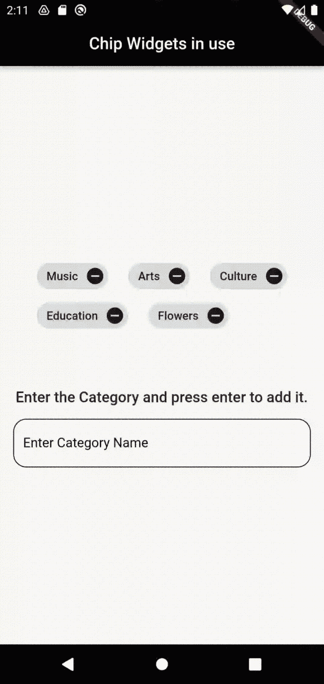

# 用 Chip widget 改进 Flutter UI

> 原文：<https://blog.logrocket.com/improving-flutter-ui-chip-widget/>

## 介绍

如果有一件事 Flutter 是众所周知的，那就是创建漂亮的用户界面。通过组合各种顶级小部件和适当的布局，我们可以创建一个让用户惊叹的 UI。Flutter 更进了一步，它提供了一些小部件，使我们能够在用户界面上添加交互式动画，这有助于为我们的用户创造独特的体验。

有许多顶级小部件聚集在一起，形成了我们看到并与之交互的 ui 的基础:从用于布局的列和行，`SingleChildScrollView`用于垂直和水平滚动，`GestureDetector`用于交互性，各种隐式动画小部件，等等。从 Flutter 提供的顶级小部件的海洋中识别合适的组合，可以让我们获得广泛的组合和功能，并帮助实现我们想要的 UI。

在本文中，我们将研究这样一个小部件:芯片小部件。

我们将看到它是如何在 Flutter 中被用作构建和改进用户界面的组件的。我们走吧。

Chip 小部件是一个顶级小部件，它提供一个带有文本和自定义交互的圆形框。通过它的属性，我们可以访问一系列的动作，这些动作可以用来美化我们的用户界面，使它们具有交互性。

一个流行的用例是分类磁贴。使用 Chip widgets，我们可以定制类别磁贴，还可以在我们的 UI 中轻松流畅地添加和删除类别，增强我们的移动应用程序中的 UX。

Chip 小部件公开了一系列属性，允许您添加不同的样式和执行不同的操作。

```
const Chip(
    {Key? key, 
    Widget? avatar, 
    required Widget label, 
    TextStyle? labelStyle, 
    EdgeInsetsGeometry? labelPadding, 
    Widget? deleteIcon, 
    VoidCallback? onDeleted, 
    Color? deleteIconColor, 
    String? deleteButtonTooltipMessage, 
    BorderSide? side, 
    OutlinedBorder? shape, 
    Clip clipBehavior = Clip.none, 
    FocusNode? focusNode, 
    bool autofocus = false, 
    Color? backgroundColor, 
    EdgeInsetsGeometry? padding, 
    VisualDensity? visualDensity, 
    MaterialTapTargetSize? materialTapTargetSize, 
    double? elevation, 
    Color? shadowColor, 
)

```

让我们来看看其中的一些属性:

*   `label`:在`Chip`小部件中占据中心位置，因为它是一个必需的属性。很多时候，它被用来显示一个`Text`小部件来提供关于`Chip`的信息
*   `labelStyle`:将样式应用到`label`
*   `avatar`:显示图标、图像等。，在`label`道具之前
*   `deleteIcon`:获取调用`onDeleted`属性时要显示的图标
*   `onDeleted`:当用户点击`deleteIcon`属性删除芯片时调用
*   `elevation`:取一个双精度值，定义`Chip`的提升高度
*   `padding`:在芯片内容和外部之间应用填充

*   `InputChip`:用于以简洁的形式表示一条复杂的信息
*   `ChoiceChip`:允许用户从提供的一组选项中进行选择
*   `FilterChip`:利用标签/文字过滤内容
*   `ActionChip`:用于表示与芯片主要用途相关的动作，即添加过滤器

这些芯片部件中的任何一个都可以与 Flutter 中的其他部件相结合，以创建一个漂亮的交互式 UI。在下一节中，我们将深入到一个示例实现中，看看我们如何使用芯片小部件来丰富我们的用户界面。

最后，是时候认真对待了。我们将构建一个示例应用程序，它利用 Chip 小部件来显示类别列表。用户将能够在不影响用户界面的情况下添加和删除类别。

首先，通过运行下面的命令创建一个项目。

```
flutter create chip_project

```

这将创建代码库，以及运行我们的应用程序所需的各种文件。

接下来，删除`main.dart`文件中默认生成的代码，用返回`MaterialApp`的[无状态小部件](https://blog.logrocket.com/difference-between-stateless-stateful-widgets-flutter/)替换它。将`Stateless`小部件命名为`MyApp`。

```
void main() => runApp(const MyApp());

class MyApp extends StatelessWidget {
  const MyApp({Key? key}) : super(key: key);
  @override
  Widget build(BuildContext context) {
    return const MaterialApp(
      title: 'Material App',
      home: Scaffold(),
    );
  }
}

```

接下来，创建一个新的有状态小部件，并将其命名为`HomeView`。我们将使用这个小部件创建一个简单的用户界面，向我们展示显示、添加和删除芯片小部件的方法。

```
class HomeView extends StatefulWidget {
  const HomeView({Key? key}) : super(key: key);
  @override
  State<HomeView> createState() => _HomeViewState();
}
class _HomeViewState extends State<HomeView> {
  @override
  Widget build(BuildContext context) {
    return Container();
  }
}

```

在我们继续之前，将`HomeView`小部件链接到上一步中创建的`MyApp`小部件。

```
....  
@override
  Widget build(BuildContext context) {
    return const MaterialApp(
      title: 'Material App',
      home: HomeView(),
    );
  }
....

```

现在我们可以开始填写`HomeView`小部件，并在屏幕上显示筹码。为了在我们的用户界面中动态布局芯片，我们将使用一个`Wrap`小部件并将芯片作为子部件传递给它。

接下来发生的是，根据屏幕宽度，芯片自动以最佳方式布局，避免用户界面溢出或结块。实际上，这意味着如果屏幕的宽度无法将剩余的芯片全部显示在同一行上，剩余的芯片可以顺利地进入下一行并进行布局。

出于本文的目的，我们将创建一个使用 Chip 小部件显示的静态类别列表。这个列表可以表示来自任何地方的数据，所以在您的情况下，它可以是来自 API 端点的信息列表。

```
....
  List<String> categories = [
    'Music',
    'Arts',
    'Culture',
    'Education',
    'Flowers',
  ];
 ....

```

接下来，我们将创建两个函数，我们将使用它们在列表中添加和删除数据。这也意味着添加和删除芯片，因为芯片根据列表中的数据进行渲染，即`categories`。

```
  void addCategories(String categoryName) {
    categories.add(categoryName);
    setState(() {});
  }
  void removeCategories(String categoryName) {
    categories.remove(categoryName);
    setState(() {});
  }

```

添加一个带有`Appbar`和填充的 Scaffold 小部件，使用户界面看起来更好。此时，我们的`HomeView`有状态小部件的代码看起来是这样的:

```
class HomeView extends StatefulWidget {
  const HomeView({Key? key}) : super(key: key);
  @override
  State<HomeView> createState() => _HomeViewState();
}
class _HomeViewState extends State<HomeView> {
  List<String> categories = [
    'Music',
    'Arts',
    'Culture',
    'Education',
    'Flowers',
  ];

  void addCategories(String categoryName) {
    categories.add(categoryName);
    setState(() {});
  }
  void removeCategories(String categoryName) {
    categories.remove(categoryName);
    setState(() {});
  }
  @override
  Widget build(BuildContext context) {
    return Scaffold(
      appBar: AppBar(
        title: const Text('Chip Widgets in use'),
        centerTitle: true,
        backgroundColor: Colors.black,
      ),
      body: SafeArea(
        child: Padding(
          padding: const EdgeInsets.all(16.0),
          child: Center(
            child: Column(
              mainAxisAlignment: MainAxisAlignment.center,
              children: [
               // .... 
              ],
            ),
          ),
        ),
      ),
    );
  }
}

```

我们现在可以继续添加 Wrap 和 Chip 小部件。我们将根据列表中的数据显示筹码，这意味着如果我们的`categories`列表中有一个项目，屏幕上会出现一个`Chip`。为此，我们将列表中的每个项目映射到一个芯片小部件，并将项目名称显示为芯片上的标签。

为了从列表中删除一个`Chip`，我们将把之前创建的`removeCategories`函数传递给`Chip`小部件提供的`onDeleted`回调函数。

* * *

### 更多来自 LogRocket 的精彩文章:

* * *

如果`categories`列表为空，我们向用户显示一个`Text`通知他们为空状态，即**没有可用的类别**。

```
....
  [
    const SizedBox(height: 16),
    Wrap(
      spacing: 24,
      children: categories.map(
        (category) {
          return Chip(
            onDeleted: () {
              removeCategories(category);
            },
            deleteIcon: const Icon(Icons.remove_circle),
            label: Text(category),
          );
        },
      ).toList(),
    ),
    if (categories.isEmpty)
      const Center(
        child: Text('No Categories available!'),
      ),
  ],
....

```

### 添加和删除类别

接下来，我们添加一个`TextField`。`TextField`允许我们手动添加一个新的类别到类别列表中，从而增加屏幕上`Chip`部件的数量。

在对`TextField`的`onSubmitted`回调中，调用`addCategories`函数，并从用户检索的文本输入中传递类别。您可以给`TextField`小部件添加一些样式，让它在屏幕上看起来更好。

```
....
    const SizedBox(height: 64),
    const Text(
      'Enter the Category and press enter to add it.',
      style: TextStyle(
        fontSize: 18,
        fontWeight: FontWeight.w500,
      ),
    ),
    const SizedBox(height: 16),
    TextField(
        onSubmitted: (category) {
            addCategories(category);
          },
        cursorColor: Colors.black,
        decoration: InputDecoration(
          labelText: 'Enter Category Name',
          hintText: 'Enter Category Name',
          labelStyle: TextStyle(color: Colors.black),
          enabledBorder: OutlineInputBorder(
          borderRadius: BorderRadius.circular(16),
          ),
          focusedBorder: OutlineInputBorder(
            borderRadius: BorderRadius.circular(16),
          ),
        ),    
      ),
....

```

有了这些，我们就可以走了！让我们测试一下我们的应用程序。运行下面的命令来运行应用程序。

```
flutter run

```

下面是结果:



Chip widget in use

点击查看示例应用程序[的完整代码。](https://github.com/Blazebrain/chip_project.git)

## 结论

万岁！你在这一部分做得很好。您已经了解了什么是 Chip 小部件，各种类型的 Chip 小部件，它公开的各种属性，以及我们如何一起构建一个示例应用程序，展示使用中的 Chip 小部件以及它如何极大地帮助我们的开发。现在，您可以放心地在您的应用程序中使用它。

如果您有任何问题，请随时通过我的社交媒体平台联系我[。我很乐意帮助和回答任何问题。直到我再次给你写信，快乐的飞翔。](https://linktr.ee/blazebrain)

## 使用 [LogRocket](https://lp.logrocket.com/blg/signup) 消除传统错误报告的干扰

[](https://lp.logrocket.com/blg/signup)

[LogRocket](https://lp.logrocket.com/blg/signup) 是一个数字体验分析解决方案，它可以保护您免受数百个假阳性错误警报的影响，只针对几个真正重要的项目。LogRocket 会告诉您应用程序中实际影响用户的最具影响力的 bug 和 UX 问题。

然后，使用具有深层技术遥测的会话重放来确切地查看用户看到了什么以及是什么导致了问题，就像你在他们身后看一样。

LogRocket 自动聚合客户端错误、JS 异常、前端性能指标和用户交互。然后 LogRocket 使用机器学习来告诉你哪些问题正在影响大多数用户，并提供你需要修复它的上下文。

关注重要的 bug—[今天就试试 LogRocket】。](https://lp.logrocket.com/blg/signup-issue-free)