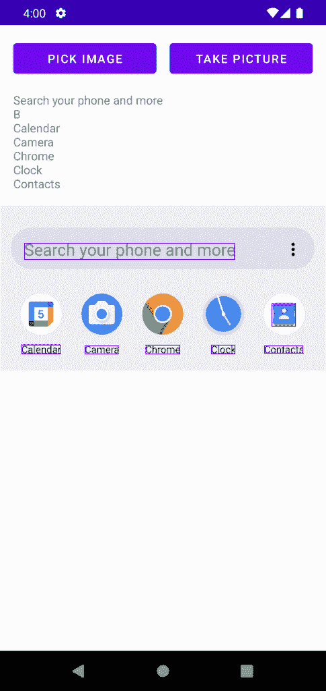
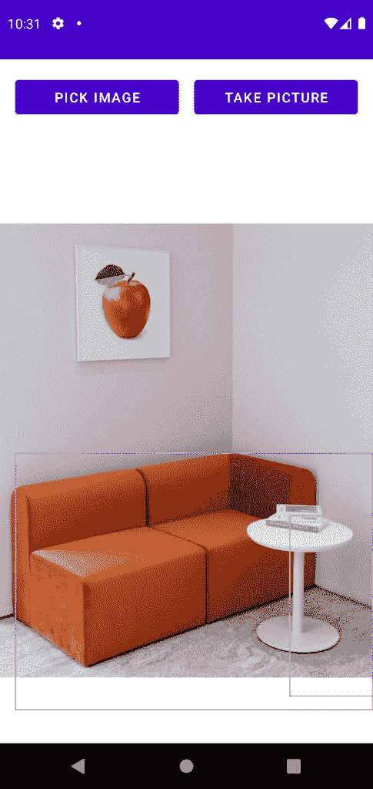

# 将机器学习融入您的 Android 应用

> 原文：<https://blog.logrocket.com/incorporating-machine-learning-android-app/>

[ML Kit](https://developers.google.com/ml-kit) 是一个机器学习 API 的集合，可以用于 Android 和 iOS。ML Kit 允许开发人员轻松地将机器学习功能集成到他们的移动应用程序中，而无需广泛了解机器学习算法和技术。你可以使用这个库来执行机器学习任务，比如文本识别、图像标记、条形码扫描、文本翻译等等。

在本文中，我们将演示如何在 Android Studio 中应用机器学习。在我们的教程中，我们将使用[文本识别 API](https://developers.google.com/ml-kit/vision/text-recognition) 来扫描和提取文本。我们还将展示如何使用[对象检测和跟踪 API](https://developers.google.com/ml-kit/vision/object-detection) 来识别和定位图像中的对象。

*向前跳转:*

## 了解 ML 套件

ML Kit 的一个关键优势是，它允许开发人员在设备上运行机器学习模型，而不是将数据发送到远程服务器进行处理。这在需要实时结果的情况下特别有用，因为它允许更快的数据处理。此外，在设备上运行模型有助于提高用户数据的隐私性，因为它减少了需要传输到远程服务器的数据量。

ML Kit 还有一个很大的好处就是不需要自己训练模型。相反，可以使用已经在大型数据集上训练过的预训练模型。

在开发机器学习应用程序时，使用预先训练的模型可以节省时间和资源。这种策略可以帮助您的应用程序快速启动并运行，而不需要大量的训练数据或计算资源。但是，使用预训练模型也有一些潜在的限制。例如，它们可能不如针对您的应用程序的特定用例而训练的模型准确或高性能。

## 设置 Android 项目

所有 ML Kit APIs 都需要 Android API 级别 19 或更高，所以要确保你的 minSdkVersion 至少设置为 19。在本教程中，我将使用 Android Studio 作为我的 IDE 它在组织文件方面做得很好。

如果您使用的是 Gradle v7.6 或更高版本，请修改您的`settings.gradle`以包含以下存储库:

```
pluginManagement {
   repositories {
       google()
    ...
   }
}

dependencyResolutionManagement {
   repositories {
      google()
    ...
   }
}
```

现在，在您的`app/build.gradle`文件中添加以下依赖项:

```
dependencies {
   // This is the dependency for text recognition
   implementation 'com.google.android.gms:play-services-mlkit-text-recognition:18.0.2'
   // This is the dependency for object detection
   implementation 'com.google.mlkit:object-detection:17.0.0'
}
```

接下来，将你的项目与 Gradle 文件同步，它将下载库。

首次使用时，机器学习模型会通过 Google Play 服务动态下载，但您可以更改这一点，以便在安装应用程序时下载模型。为此，将以下代码添加到您的`AndroidManifest.xml`文件中:

```
<application ...>
   <meta-data
       android:name="com.google.mlkit.vision.DEPENDENCIES"
       android:value="ocr" />
   <!-- This will cause the model for text recognition(ocr) to be downloaded -->
</application>

```

## 添加文本识别

ML Kit 文本识别 API 旨在从各种语言和格式的图像或视频中识别和提取文本。

文本识别最常见的应用之一是光学字符识别(OCR)，它涉及使用机器学习算法来解释图像或扫描文档中的文本。OCR 可用于从名片或扫描文档中自动提取信息，或将手写笔记转录为数字文本。

鉴于我们之前已经导入了 ML 工具包库，我们不需要再这样做了。我将演示扫描和提取文本的两个选项。

扫描和提取文本的第一种方法是使用文件选择器。

首先，我将创建一个变量来获取文本识别客户端；我稍后会用它来处理图像。`TextRecognition`类充当机器学习模型的接口；它抽象了所有的复杂性:

```
private val recognizer by lazy {
   TextRecognition.getClient(TextRecognizerOptions.DEFAULT_OPTIONS)
}
```

如果您想设置自己的执行者，您可以向它传递自定义选项:

```
val options = TextRecognizerOptions.Builder()
   .setExecutor(executor)
   .build()

TextRecognition.getClient(options)
```

在这里，我在一个`Activity`中定义了这个变量，所以我使用了 lazy 函数来推迟这个对象的创建，直到它真正被需要的时候。在您的`Activity`或`Fragment`中，注册一个活动成果合同，用于拾取图像:

```
private val pickImage = registerForActivityResult(
   ActivityResultContracts.OpenDocument()
) { uri ->
   if (uri != null) {
       processImage(uri) // We'll define this later
   } else {
       Toast.makeText(this, "Error picking image", Toast.LENGTH_SHORT).show()
   }
}
```

如果你之前没用过活动结果 API，可以在这里了解更多[。](https://developer.android.com/training/basics/intents/result)

现在，决定你想从哪里启动图像拾取器并调用`pickImage.launch(arrayOf("image/*"))`。在我的例子中，我通过一个按钮启动它:

```
pickImageButton.setOnClickListener { pickImage.launch(arrayOf("image/*")) }
```

接下来，定义使用我们之前创建的识别器来处理图像的方法:

```
// uri of the file that was picked
private fun processImage(uri: Uri) {
   val image = InputImage.fromFilePath(this, uri)

   recognizer.process(image)
       .addOnSuccessListener { result -> extractResult(result) }
       .addOnFailureListener { Log.e("MainActivity", "Error processing image", it) }
}
```

`TextRecognizer.process`函数返回一个`Task`。您可以通过添加成功和失败侦听器来观察它的结果。现在，让我们创建一个接收成功结果的方法:

```
private fun extractResult(result: Text) {
   recognizedTextView.text = result.text
}
```

现在，我只是从结果中提取文本并显示在一个`TextView.`
中，让我们测试一下。这是它在我的设备主屏幕上的显示方式:


如你所见，这种方法在读取图像方面做得很好，即使它扫描的是图像中不存在的“B”。如前所述，机器学习模型不是 100%准确的，所以这将是你必须自己处理的事情。

这个结果很酷，但是我们能做得更多吗？是的，我们可以！

除了给我们扫描的文本，库还返回图像中文本的位置。让我们在识别出的文本周围画一些边框。首先，让我们定义一下油漆:

```
private val paint by lazy {
   Paint().apply {
       style = Paint.Style.STROKE
       strokeWidth = 4f
       color = Color.MAGENTA
   }
}
```

我会添加两个新变量。一个是对`rootView`的引用；另一个是我将添加到我们的布局中的`imageView`,这样我们可以看到修改后的图像:

```
private val rootView by lazy { findViewById<View>(android.R.id.content).rootView }
private val imageView by lazy { findViewById<ImageView>(R.id.image) }
```

接下来，修改 processImage 以显示在添加到布局的`ImageView`中拾取的图像:

```
private fun processImage(uri: Uri) {
   val image = InputImage.fromFilePath(this, uri)
   imageView.setImageURI(uri)
   ...
}
```

现在，让我们修改提取结果的函数，以便在识别的文本周围绘制边框:

```
private fun extractResult(result: Text) {
   recognizedTextView.text = result.text

   // I'm using post here to make sure this code runs on the main thread
   rootView.post {
     // Let's first convert the image to a bitmap so we can draw on it.
       val bitmap = imageView.drawToBitmap()
       val canvas = Canvas(bitmap)

     // textBlocks is an array that contains all the individual blocks of text
     // that were recognized
     result.textBlocks
          // the boundingBox represents where the given text is in the image
        .mapNotNull { it.boundingBox }
        .forEach { box -> canvas.drawRect(box, paint)
     }

     // Set the modified bitmap in the ImageView
       imageView.setImageBitmap(bitmap)
   }
}
```

这是结果。所有已识别的文本都有边框:



现在我们可以看到“B”是从哪里来的；它来自联系人应用程序图标。

使用相机是我们用来扫描和提取文本的第二种方法。大部分代码与上一节非常相似，所以我在这里只描述不同之处。

我将演示如何使用活动结果 API 来拍照，但是如果您愿意，您可以使用像 [CameraX](https://developer.android.com/training/camerax) 这样的库来创建自己的相机。

首先将下面的代码添加到您的`AndroidManifest.xml`文件中:

```
<provider
   android:name="androidx.core.content.FileProvider"
   android:authorities="${applicationId}.provider"
   android:exported="false"
   android:grantUriPermissions="true">
   <meta-data
       android:name="android.support.FILE_PROVIDER_PATHS"
       android:resource="@xml/provider_paths" />
</provider>

```

接下来，在`res/xml`中，创建一个名为`provider_paths.xml`的文件，并添加以下内容:

```
<?xml version="1.0" encoding="utf-8"?>
<paths>
   <cache-path
       name="cache_folder"
       path="." />
</paths>

```

现在，返回到`Activity`或`Fragment`，为您想要存储图像的位置定义一个 URI:

```
private val imageUri by lazy {
   val tempFile = File.createTempFile("ml_image", ".png", cacheDir).apply {
       createNewFile()
       deleteOnExit()
   }

   FileProvider.getUriForFile(
       applicationContext,
       "${BuildConfig.APPLICATION_ID}.provider",
       tempFile
   )
}
```

我们也注册一下拍照的`takePicture`合同吧。这样做的好处是，您不需要编写自己的代码来拍照:

```
private val takePicture = registerForActivityResult(
   ActivityResultContracts.TakePicture()
) { success ->
   if (success) {
       processImage(imageUri)
   } else {
       Toast.makeText(this, "Error taking picture", Toast.LENGTH_SHORT).show()
   }
}
```

你以前看过`processImage`，之后的一切都是一样的。

## 添加对象检测和跟踪

对象检测和跟踪是一种特定类型的图像识别，涉及识别和定位图像或视频中的对象。

一个常见的用例是在运输行业，其中对象检测和跟踪可用于提高任何车辆的安全性，尤其是那些使用自动驾驶技术的车辆。使用安装在车辆上的摄像头，机器学习模型可以检测和跟踪道路上的其他物体，如其他车辆、行人和交通标志。目标检测和跟踪可以帮助车辆安全导航和避免碰撞。

我们之前已经添加了依赖项，所以不需要再次添加。让我们从配置对象检测器开始:

```
private val objectDetector by lazy {
   val options = ObjectDetectorOptions.Builder()
       .setDetectorMode(ObjectDetectorOptions.SINGLE_IMAGE_MODE)
       .enableMultipleObjects()
       .build()

   ObjectDetection.getClient(options)
}
```

有几个选项可以设置；让我们回顾一下每一项，以了解它们的作用:

*   `setDetectorMode(ObjectDetectorOptions)`:有两种模式(`STREAM_MODE`和`SINGLE_IMAGE_MODE`)。有一种`STREAM_MODE`更快，但产生的结果不太准确；`SINGLE_IMAGE_MODE`运行时间稍长，但结果更好
*   `enableMultipleObjects()`:定义是只检测主物体还是检测更多物体
*   `enableClassification()`:定义是否将检测到的物体分成大类。如果启用，它会将对象分为五类:时尚商品、食物、家居用品、地点和植物。如果它不能对一个对象进行分类，结果可能为空

现在在`processImage`函数中，您可以调用之前创建的`objectDetector`:

```
rivate fun processImage2(uri: Uri) {
   val image = InputImage.fromFilePath(this, uri)
   imageView.setImageURI(uri)

   objectDetector.process(image)
       .addOnSuccessListener { result -> extractResult(result) }
       .addOnFailureListener { Log.e("MainActivity", "Error processing image", it) }
}
```

`extractResult`函数非常类似于前面文本识别部分使用的函数:

```
private fun extractResult(result: List<DetectedObject>) {
   rootView.post {
       val bitmap = imageView.drawToBitmap()
       val canvas = Canvas(bitmap)

       result.forEach { box ->
           canvas.drawRect(box.boundingBox, paint)
       }

       imageView.setImageBitmap(bitmap)
   }
}
```

这是最终结果。它能识别两个物体——沙发和桌子:



如你所见，这个模型并不是 100%准确。例如，它没有检测到绘画或书籍。尽管如此，它在识别物体在图像中的位置方面做得很好。

## 额外收获:使用文本识别 V2 API

ML 工具包文本识别 v2 API 是文本识别 API 的改进版本。在撰写本文时，它仍处于测试阶段。

这两个版本的最大区别之一是 V2 支持中文、梵文、日文和韩文文本。

文本识别 V2 API 非常类似于 V1，所以如果你熟悉 V1，你应该不会有任何问题实现 V2。你可以在这里阅读更多关于新版本[的信息。](https://developers.google.com/ml-kit/vision/text-recognition/v2/android#3_process_the_image)

## ML 工具包替代方案:Firebase 机器学习

[Firebase Machine Learning](https://firebase.google.com/docs/ml) 和 ML Kit 都是允许开发人员将机器学习功能融入其 Android 和 iOS 应用程序的工具。

Firebase 机器学习提供了比 ML Kit 更广泛的功能集。除了为常见任务提供预先培训的模型之外，它还提供了用于培训和部署自定义机器学习模型的工具。

如果你想从 ML 工具包迁移到 Firebase 机器学习，有一个[迁移指南](https://developers.google.com/ml-kit/migration)可以遵循。

## 结论

使用实时 ML Kit APIs 进行文本识别和对象检测是一种高效且有效的方式，可以为您的应用程序添加强大的机器学习功能。

在本文中，我们演示了如何使用文件选择器和相机来选择输入图像。最后，两种方法产生了相同的结果。

虽然机器学习可能非常强大，但它不是可以解决所有问题的灵丹妙药。为了在应用程序中有效地使用机器学习，了解它的局限性非常重要。

## LogRocket :即时重现你的安卓应用中的问题。

[](https://lp.logrocket.com/blg/kotlin-signup)

[LogRocket](https://lp.logrocket.com/blg/kotlin-signup) 是一款 Android 监控解决方案，可以帮助您即时重现问题，确定 bug 的优先级，并了解您的 Android 应用程序的性能。

LogRocket 还可以向你展示用户是如何与你的应用程序互动的，从而帮助你提高转化率和产品使用率。LogRocket 的产品分析功能揭示了用户不完成特定流程或不采用新功能的原因。

开始主动监控您的 Android 应用程序— [免费试用 LogRocket】。](hhttps://lp.logrocket.com/blg/kotlin-signup)