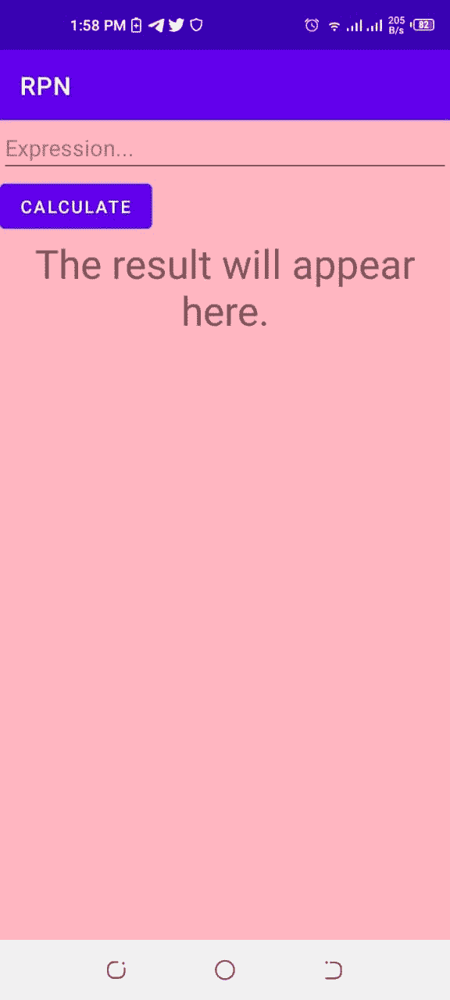

# 将 Rust 模块集成到 Android 应用程序中

> 原文：<https://blog.logrocket.com/integrating-rust-module-android-app/>

由于我有交叉编译和构建自动化的经验，我经常选择 Rust 作为我的主要编程语言。此外，Rust 仍然是一门相对较新的语言，利用过去十年的任何技术都会失败。有时候，跟随炒作列车是最快的成功之路。

如果你希望你的项目的卖点之一是用户可以控制他们自己的数据，你不能使用完全基于浏览器的服务。相反，你需要提供一些消费者可以在他们自己的 Android 设备上操作的东西。如果您已经有了一些在内部运行的 headless 实例，只需要再多一点努力，您就可以为 Windows 和 Linux 开发可再发行的包。

然而，请记住，只有桌面版本的应用程序将是一个重大的障碍。如果你想让你的应用真正起飞，你还需要一个移动版本。因此，你需要弄清楚如何让你的应用程序在 Android 上运行。

这个 [GitHub repo](https://github.com/martinwairegi/rustonandroid.git) 有一个基本的内置反向波兰符号计算器，演示了如何将 Rust 模块集成到 Android 应用程序中。然而，我们的项目，如下图所示，将使用一种更低级的方法，直接使用 C 和 Rust 编译器。所有与交叉编译相关的问题，比如编译器标志、链接器标志等等，都得到了明确的解决。

我们使用 Gradle 主要是为了将所有东西组装成一个`.apk`包。如果你正在寻找一个快速简单的解决方案，你可以使用一个 Rust 插件来大大简化这个过程。我们开始吧！



## 目录

## 先决条件

首先，我们将介绍一些项目实现所需的工具和平台。你需要:

*   Android 原生开发套件 r21
*   （同 groundcontrolcenter）地面控制中心
*   尝试
*   Android 软件开发套件

你可以从 Android 开发者门户获得 Android 工具。只需要 SDK，而不是整个 Android Studio 安装。请务必获得 NDK 的 r21 LTS 版本，而不是最新的 r22 版本。

## 与交叉编译器的冲突

先用`rustup-init`装锈。安装 Rust 后，使用`rustup`安装对 Android 目标的支持。首先，您需要获得 Rust 交叉编译器。幸运的是，Rust 通过调用以下代码使这变得非常简单:

```
rustup target add aarch64-linux-android
rustup target add armv7-linux-androideabi
rustup target add x86_64-linux-android

```

## Java 运行时环境

我们的示例项目利用 Gradle 来生成`.apk`，这需要一个 JRE 来运行。虽然 Android Studio 为您提供了下载和指定一个 JRE 和 Gradle 来运行它的选项，但这个项目使用您系统的默认 JRE。

## 环境变量

你还需要 Android 开发工具。尽管 SDK 包的大小超过 80 MB，但它包含了最少的必需工具，因此您可以利用 SDK 管理器来添加推荐的额外工具。从 [Android Studio 下载](https://developer.android.com/studio/command-line)页面下载命令行工具档案。

虽然 Android 可以运行本机代码，但大多数应用程序都是用 Java 或 Kotlin 编写的，这在 SDK 中有所反映。最后，要使用本机代码，您需要本机开发工具包。在 NDK 下载页面上有许多版本的 NDK 可供下载，但是如前所述，我们想要使用 r21 版本。

最后，在开始构建之前，设置如下所示的环境变量:

*   `ANDROID_SDK_ROOT`:指向 Android SDK 目录
*   `ANDROID_NDK_ROOT`:指向安卓 NDK r21 目录
*   `ANDROID_API`:指定您想要定位的 Android API 级别，即 29

## 目录

主目录包含用于完成构建并将其结合在一起的脚本。

### `android/`

`android/`目录包括 Android 应用程序文件、`AndroidManifest.xml`文件、带有基本 UI 的活动和用于与 Rust 代码交互的`glue`类。

### `rust/`

我们将把我们的 Rust 代码保存在`rust/`文件夹中。它分为三个部分:

*   `android.rs`
*   `lib.rs`
*   `main.rs`

该应用程序可以构建为独立的可执行文件，它将从`stdin`中一次读取一行输入，对其进行评估，并输出结果。

## 构建应用程序和活动

要了解如何[将 Rust 代码与提供用户界面的 Java 代码](https://blog.logrocket.com/deep-dive-concurrency-rust-programming-language/)结合，可以研究“如何将 Rust 代码 APK 与 Java 代码结合”。很快，你可能会注意到，如果不了解 Android 应用程序，这是不容易做到的。至少，不是在一个干净简单的事情。

大多数文章建议采用不同的方法:将活动集成到一个应用程序中:

```
package pl.martin.blog.RustOnAndroid;

import androidx.appcompat.app.AppCompatActivity;
import android.graphics.Color;
import android.os.Bundle;
import android.view.View;
import android.widget.Button;
import android.widget.EditText;
import android.widget.TextView;

public class MainActivity extends AppCompatActivity {
        private Button button;
        private EditText input;
        private TextView resultBox;

        private int colourRed;
       private int colourGreen;

        @Override
        protected void onCreate(Bundle savedInstanceState) {
               super.onCreate(savedInstanceState);
               setContentView(R.layout.activity_main);

                button = (Button)findViewById(R.id.button);
                input = (EditText)findViewById(R.id.exprInput);
                resultBox = (TextView)findViewById(R.id.exprResult);

                colourRed = Color.parseColor("#AA0000");
                colourGreen = Color.parseColor("#007F00");

                button.setOnClickListener(new View.OnClickListener() {
                        public void onClick(View v) {
                                String expr = input.getText().toString();
                                Result result = RpnCalculator.rpn(expr);
                                if(result.isOk()) {
                                        resultBox.setTextColor(colourGreen);
                                        resultBox.setText(result.getValue());
                                } else {
                                        resultBox.setTextColor(colourRed);
                                        resultBox.setText(result.getError());
                                }
                        }
                });
        }
}

```

如果你以前从未接触过 Android，那么活动就是你在开发应用程序时会考虑的屏幕或视图。例如，考虑一个购物应用程序。一些活动可能是登录屏幕和收银台购物车。

可能会包括一些交互式组件，如标志性的汉堡菜单。如果你愿意，理论上你可以把整个程序放在一个单独的活动中，但是这很难实现。当然，关于活动还有更多要讨论的，但这不是本文的重点。

现在，让我们回到 Rust 应用程序。虽然将活动集成到一个应用程序中似乎是我的困境的解决方案，但我不确定我的`Rust.apk`如何适应这一切。在研究了 [cargo-apk](https://crates.io/crates/cargo-apk) 代码后，我发现它将我的代码包装在一些神奇的胶水代码中，并生成一个`NativeActivity`供 Android 运行。

您可能需要修改`AndroidManifest.xml`并在文档中添加一个活动节点，以便将活动合并到一个应用程序中。当 cargo-apk 完成任务时，它会创建一个小的`AndroidManifest.xml`文件，并将其保存在最终的 apk 旁边。你可以用这个文件找出`NativeActivity`有什么属性。

继续将下面的代码添加到 Java 应用程序的清单中:

```
 <?xml version="1.0" encoding="utf-8"?>
<manifest xmlns:android="http://schemas.android.com/apk/res/android"
package="pl.martin.blog.RustOnAndroid">

<application
android:allowBackup="true"
android:icon="@mipmap/ic_launcher"
android:label="@string/app_name"
android:roundIcon="@mipmap/ic_launcher_round"
android:supportsRtl="true"
android:theme="@style/Theme.RustOnAndroid">
<activity android:name="pl.martin.blog.RustOnAndroid.MainActivity">
<intent-filter>
<action android:name="android.intent.action.MAIN" />

<category android:name="android.intent.category.LAUNCHER" />
</intent-filter>
</activity>
</application>

</manifest>

```

Java 应用程序的构建过程不会自动计算出您的`libstartup.so`文件包含在哪里。你需要将库文件复制到一个特定的目录，Android 应用的构建机制 Gradle 会自动检测到它们。这样做向应用程序清单添加了一个声明，声明该应用程序将包含某些活动:

```
$ mkdir -p android/app/src/main/jniLibs/arm64-v8a
$ cp sqlite-autoconf-3340000/.libs/libsqlite3.so android/app/src/main/jniLibs/arm64-v8a/
$ cp target/aarch64-linux-android/debug/libstatup.so android/app/src/main/jniLibs/arm64-v8a/
$ cd android/ &amp;&amp; ./gradlew &amp;&amp; ./gradlew build

```

之后，开始构建。你会看到它正在工作，所以你可以在你的 Android 智能手机上安装`.apk`。

## 完成构建

要完成该过程，请使用`build-all.sh`脚本。它会将生成的`.apk`文件保存在`build/`目录中该脚本旁边。您还将构建 GMP 和 Rust 代码:

```
build-libgmp.sh

```

以上脚本仅用于创建 GMP 库:

```
build-librpn.sh

```

该脚本仅用于生成 Rust 代码。注意，您必须首先创建 GMP 和`.so`文件。LIBS 目录中必须有 GMP，否则链接将失败:

```
build-apk.sh

```

使用上面的脚本只创建`.apk`文件。首先必须创建 GMP 和 Rust 代码。该应用程序可以在没有本地库的情况下编译，但在运行时会崩溃。

## 结论

让我们的 Rust 代码在 Android 上运行并不容易，但我们找到了解决方案。我们用标准 Rust 编写代码，然后编译成共享库，JVM 在运行时加载。虽然 [JNI 第一次出现令人恐惧](https://docs.rs/jni/latest/jni/)，但是采用这种标准化的方法意味着 Java 代码和 Gradle 构建系统都是不必要的，因为我们用 Rust 编写了原生代码。

用 Cargo 进行交叉编译仍然是一个挑战，因为我们必须用 cargo-apk 配置许多环境变量才能让它正常工作。我们的代码所依赖的外部库也有问题，但是我们用几个 shell 脚本解决了所有这些问题。

请随意查看关于如何将 Rust 模块集成到 Android 应用程序中的 GitHub 知识库。我希望你喜欢这篇文章，如果你有任何问题，一定要留下评论。编码快乐！

## [log rocket](https://lp.logrocket.com/blg/rust-signup):Rust 应用的 web 前端的全面可见性

调试 Rust 应用程序可能很困难，尤其是当用户遇到难以重现的问题时。如果您对监控和跟踪 Rust 应用程序的性能、自动显示错误、跟踪缓慢的网络请求和加载时间感兴趣，

[try LogRocket](https://lp.logrocket.com/blg/rust-signup)

.

[](https://lp.logrocket.com/blg/rust-signup)

LogRocket 就像是网络和移动应用程序的 DVR，记录你的 Rust 应用程序上发生的一切。您可以汇总并报告问题发生时应用程序的状态，而不是猜测问题发生的原因。LogRocket 还可以监控应用的性能，报告客户端 CPU 负载、客户端内存使用等指标。

现代化调试 Rust 应用的方式— [开始免费监控](https://lp.logrocket.com/blg/rust-signup)。