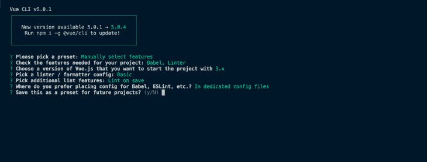
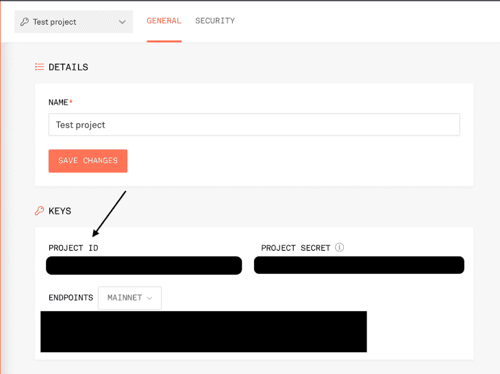
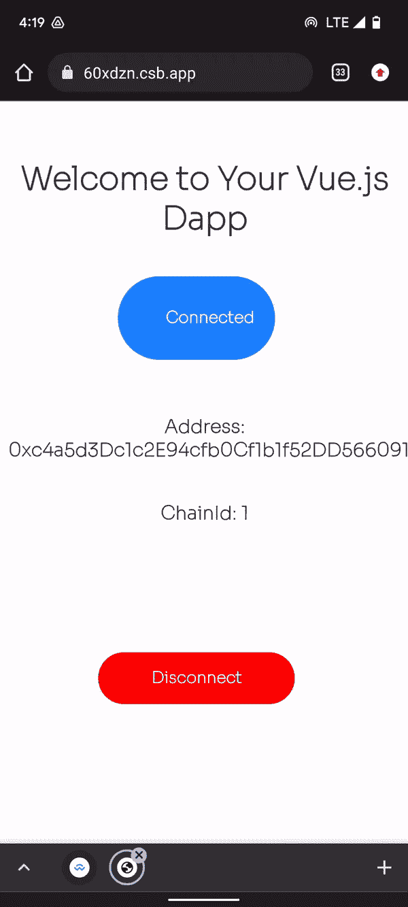
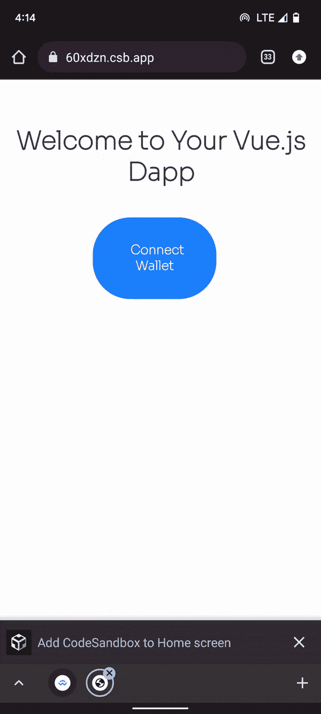

# 将 WalletConnect 集成到 Vue.js DApps 中

> 原文：<https://blog.logrocket.com/integrating-walletconnect-vue-js-dapps/>

分散式应用程序(DApps)的主要功能之一是连接钱包的能力，这反过来允许用户与 DApp 上的交易进行交互。它抽象了交换网络、提供签名者等功能，以及为用户提供某种形式的身份验证的其他特性。连接钱包也可作为网关，允许用户使用其钱包地址作为授权身份，通过 DApp 在区块链上执行和读取操作。

[WalletConnect](https://walletconnect.com/) 是一个免费的开源协议，可以将我们的 DApps 连接到多个钱包，包括 [MetaMask](https://blog.logrocket.com/understanding-resolving-metamask-error-codes/) ，Trust Wallet，Rainbow 等等。该协议通过在 DApp 和钱包之间建立连接来抽象这个过程，在整个会话期间保持它们的同步。

在本文中，我们将使用 WalletConnect 将我们的钱包应用程序链接到我们的 DApp，在前端使用 Vue.js。需要注意的一点是，WalletConnect 可以在任何兼容 wallet-connect 的 DApp、链和钱包(保管和非保管)上使用。

你可以在这里找到本教程的[源代码，以及我们将在这里](https://github.com/Atanda1/vue-wallet-connect)构建的应用程序的[演示。](https://60xdzn.csb.app/)


### 内容

## Vue.js 应用程序入门

首先，让我们使用 Vue CLI 来启动项目。如果您的系统上已经安装了 Vue CLI，您可以直接创建 Vue 项目。

您可以使用以下命令进行全局安装:

```
npm install -g @vue/cli

```

我们现在可以使用 Vue CLI 来创建我们的项目。使用以下命令创建一个新项目:

```
vue create vue-wallet-connect

```

您需要选择一个预设。选择`Manually select features`，然后选择如下所示的选项:



创建项目后，导航到新项目文件夹:

```
cd vue-wallet-connect

```

我们将在 Vue 应用中使用 [Ethers.js](https://blog.logrocket.com/building-dapp-ethers-js/) 来直接与区块链互动，同时连接我们的钱包:

```
npm i ethers

```

这里，我们将 WalletConnect 库安装到您的项目中:

```
npm install --save web3 @walletconnect/web3-provider

```

接下来，要在 Vue 3 中直接使用 WalletConnect 库，我们需要安装`[node-polyfill-webpack-plugin](https://www.npmjs.com/package/node-polyfill-webpack-plugin)`:

```
npm i node-polyfill-webpack-plugin

```

我们正在安装它，因为我们的项目使用 webpack v5，其中 polyfill 节点核心模块已被删除。因此，我们安装它来访问项目中的这些模块。

现在，打开`vue.config.js`文件，用这段代码替换它:

```
const { defineConfig } = require("@vue/cli-service");
const NodePolyfillPlugin = require("node-polyfill-webpack-plugin");
module.exports = defineConfig({
  transpileDependencies: true,
  configureWebpack: {
    plugins: [new NodePolyfillPlugin()],
    optimization: {
      splitChunks: {
        chunks: "all",
      },
    },
  },
});

```

完成后，您现在可以启动服务器:

```
npm run serve

```

## 构建用户界面

让我们进入 components 文件夹，创建一个名为`StatusContainer.vue`的新文件。这个组件包含我们的主页。

It it，我们有我们的欢迎信息，帮助我们连接的**连接钱包**按钮，以及我们的**断开连接**按钮来断开我们与钱包的连接。最后，当我们成功连接到钱包时，会显示**已连接**按钮:

```
<template>
  <div class="hello">
    <h1>Welcome to Your Vue.js Dapp</h1>
    <div >
       <button class="button">Connected</button>
       <button class="disconnect__button">Disconnect</button>
    </div>

    <button class="button"> Connect Wallet</button>
  </div>
</template>
<script>
export default {
  name: 'StatusContainer'
}
</script>

```

完成后，打开`App.vue`文件并导入`StatusContainer`组件，如下所示:

```
<template>
  <status-container/>
</template>
<script>

import StatusContainer from './components/StatusContainer.vue'
export default {
  name: 'App',
  components: {
    StatusContainer
  }
}
</script>
<style>
@import url('https://fonts.googleapis.com/css2?family=Sora:[email protected]&display=swap');
#app {
  font-family: 'Sora', sans-serif;
  -webkit-font-smoothing: antialiased;
  -moz-osx-font-smoothing: grayscale;
  text-align: center;
  color: #2c3e50;
  margin-top: 60px;
}
.button {
      background-color: #1c82ff;
    border: none;
    color: #ffffff;
    font-family: "Sora";
    border-radius: 3rem;
    padding: 2rem 3rem;
    font-weight: 600;
    font-size: 2rem;
    margin: 1rem 1rem 1rem auto;
    width: 40%;
}
.disconnect__button {
     background-color: red;
    border: none;
    color: #ffffff;
    font-family: "Sora";
    border-radius: 3rem;
    padding: 1rem 1.3rem;
    font-weight: 600;
    font-size: 1rem;
    margin: 8rem 1rem 1rem auto;
    width: 20%;
}
</style>

```

在我们的样式标签中，我们现在为之前创建的按钮添加样式:`.button`和`.disconnect__button`。此外，我们从谷歌字体中导入了黑脸田鸡自定义字体，并将其用作我们的`font-family`。

## 实例化 WalletConnect

我们将需要一个 RPC 提供者来实例化我们的 WalletConnect 库。对于这个例子，我们将使用 [Infura](https://blog.logrocket.com/alchemy-vs-infura-which-node-provider-best/) 。打开 Infura，创建一个新项目，并抓取**项目 ID** 。



现在，在 src 文件夹下创建一个新的`walletConnect`文件夹:`src/walletConnect`。在这个文件夹中，让我们创建一个`provider.js`文件。在这里，我们导入 WalletConnect 库，使用我们的 Infura ID 实例化它，并导出它用于其他文件。

`src/walletConnect/provider.js`会是这样的:

```
import WalletConnectProvider from "@walletconnect/web3-provider";
export const provider = new WalletConnectProvider({
  infuraId: process.env.VUE_APP_INFURA_ID,
});

```

Infura ID 应该用作环境变量。因此，将以下内容添加到您的`.env`文件中:

```
VUE_APP_INFURA_ID={{INFURA__ID}}

```

## 使用组件添加功能

创建接口并成功实例化库之后，下一步是实现我们的功能。为此，我们将使用 Vue composables，因为它允许我们在应用程序中的任何组件中使用我们的状态和操作，类似于我们对 [Pinia](https://blog.logrocket.com/complex-vue-3-state-management-pinia/) 和 Vuex 的使用。

### 创建可组合的

在`src`文件夹内，添加`src/composables/connect`。在`connect`文件夹中，让我们创建一个`index.js`文件。

这里，我们导入了`reactive`和`watch`，我们将在这个文件中使用它们。让我们创建名为`defaultState`的状态对象:

```
import { reactive, watch } from "vue";

const defaultState = {
  address: "",
  chainId: "",
  status: false,
};

const state = defaultState

```

为了保持我们的状态一致，我们将状态与本地存储中的项目同步。让我们将此项命名为`"userState"`，并将其赋给一个名为`STATE_NAME`的变量。这样做是为了避免在多个地方重复`"userState"`时出错:

```
const STATE_NAME = "userState";

```

现在，一旦我们的状态发生任何变化，我们就使用`watch`来更新我们的本地存储:

```
watch(
  () => state,
  () => {
    localStorage.setItem(STATE_NAME, JSON.stringify(state));
  },
  { deep: true }
);

```

接下来，我们创建一个`getDefaultState`函数，它检查本地存储中的`STATE_NAME`项是否存在，并将本地存储项分配给状态。如果我们的本地存储项不存在，它将把`defaultState`分配给`state`。

现在，我们可以删除`const state = defaultState`并使用`reactive`来分配`const state = reactive(getDefaultState());`:

```
const getDefaultState = () => {
  if (localStorage.getItem(STATE_NAME) !== null) {
    return JSON.parse(localStorage.getItem(STATE_NAME));
  }
  return defaultState;
};
const state = reactive(getDefaultState());

```

最后，我们导出我们的状态。我们还添加了一个`if`语句来检查我们的本地存储项是否不存在。如果没有，它会创建该项并将`state`分配给本地存储:

```
 export default () => {
  if (localStorage.getItem(STATE_NAME) === null) {
    localStorage.setItem(STATE_NAME, JSON.stringify(state));
  }
  return {
    state,
  };
};

```

现在，我们的状态总是与本地存储同步，确保一致性。

我们来看看`src/composables/connect/index.js`:

```
import { reactive, watch } from "vue";

const defaultState = {
  address: "",
  chainId: "",
  status: false,
};

const STATE_NAME = "userState";
const getDefaultState = () => {
  if (localStorage.getItem(STATE_NAME) !== null) {
    return JSON.parse(localStorage.getItem(STATE_NAME));
  }
  return defaultState;
};
const state = reactive(getDefaultState());

watch(
  () => state,
  () => {
    localStorage.setItem(STATE_NAME, JSON.stringify(state));
  },
  { deep: true }
);
export default () => {
  if (localStorage.getItem(STATE_NAME) === null) {
    localStorage.setItem(STATE_NAME, JSON.stringify(state));
  }
  return {
    state,
  };
};

```

## 创建操作

我们的操作包括将在我们的应用程序中使用的功能。我们将创建三个函数:

*   `connectWalletConnect`，触发 WalletConnect 模式连接钱包
*   `autoConnect`，它在 DApp 连接后处理 WalletConnect 会话内的一致性，因此当 DApp 连接且您刷新页面时，用户的会话仍处于活动状态
*   `disconnectWallet`，断开 DApp 与钱包的连接，并结束用户的会话

让我们直接进入代码！

### `connectWalletConnect`

仍然在我们的`connect`文件夹(`src/composables/connect`)中，创建`connectWalletConnect`文件。首先，我们从`ethers`导入我们的索引文件`providers`，以及我们之前在`src/walletConnect/provider.js`文件中创建的`provider`:

```
import { providers } from "ethers";
import connect from "./index";
import { provider } from "../../walletConnect/provider";

const connectWalletConnect = async () => {
  try {
    const { state } = connect();
    //  Enable session (triggers QR Code modal)
    await provider.enable();
    const web3Provider = new providers.Web3Provider(provider);
    const signer = await web3Provider.getSigner();
    const address = await signer.getAddress();
    state.status = true;
    state.address = address;
    state.chainId = await provider.request({ method: "eth_chainId" });

    provider.on("disconnect", (code, reason) => {
      console.log(code, reason);
      console.log("disconnected");
      state.status = false;
      state.address = "";
      localStorage.removeItem("userState");
    });

    provider.on("accountsChanged", (accounts) => {
       if (accounts.length > 0) {
        state.address = accounts[0];
      }
    });

    provider.on("chainChanged", (chainId) => {
      state.chainId = chainId
    });
  } catch (error) {
    console.log(error);
  }
};
export default connectWalletConnect;
```

接下来，我们有一个`try-catch`语句。在我们的`try`语句中，我们从`connect()`获取状态，并弹出我们的 QR 模式进行连接。一旦连接上，我们就将我们的`address`和`chainId`分配给状态属性，并使我们的`state.status`读为`true`。

然后我们用`provider` : `disconnect`、`accountsChanged`和`chainChainged`观看三个事件。

*   一旦用户直接断开钱包连接，就会触发`disconnect`
*   如果用户切换钱包中的账户，则触发`accountsChanged`。如果`account`数组的长度大于零，我们将`state.address`赋给数组中的第一个地址(`accounts[0]`，这是当前地址
*   如果用户切换他们的链/网络，则触发`chainChainged`。例如，如果他们将他们的链从以太坊 mainnet 切换到 rinkeby testnet，我们的应用程序会将`state.chainId`从`1`更改为`4`

然后，我们的`catch`语句简单地将任何错误记录到控制台。

回到`connect`文件夹中的`index.js`文件，导入`connectWalletConnect`动作。在这里，我们创建一个`actions`对象并用我们的`state`导出它:

```
import { reactive, watch } from "vue";
import connectWalletConnect from "./connectWalletConnect";

const STATE_NAME = "userState";
const defaultState = {
  address: "",
  chainId: "",
  status: false,
};
const getDefaultState = () => {
  if (localStorage.getItem(STATE_NAME) !== null) {
    return JSON.parse(localStorage.getItem(STATE_NAME));
  }
  return defaultState;
};
const state = reactive(getDefaultState());
const actions = {
  connectWalletConnect,
};
watch(
  () => state,
  () => {
    localStorage.setItem(STATE_NAME, JSON.stringify(state));
  },
  { deep: true }
);
export default () => {
  if (localStorage.getItem(STATE_NAME) === null) {
    localStorage.setItem(STATE_NAME, JSON.stringify(state));
  }
  return {
    state,
    ...actions,
  };
};
```

### `autoConnect`

让我们继续到`autoConnect.js`，和我们的`actions`。类似于`connectWalletConnect`，创建一个`autoConnect.js`文件。我们导入索引文件并使用`connect()`对其进行析构以获得我们的`state`和`connectWalletConnect`:

```
import connect from "./index";

const autoConnect = () => {
  const { state, connectWalletConnect } = connect();
  if (state.status) {
    if (localStorage.getItem("walletconnect") == null) {
      console.log("disconnected");
      console.log("disconnected");
      state.status = false;
      state.address = "";
      localStorage.removeItem("userState");
    }
    if (localStorage.getItem("walletconnect")) {
      (async () => {
        console.log("start");
        connectWalletConnect();
      })();
    }
  }
};
export default autoConnect;

```

您应该知道的一件事是，一旦 WalletConnect 成功连接到 DApp，所有关于该钱包的信息(包括地址和链 ID)都存储在本地存储中一个名为`walletconnect`的项目下。一旦会话断开，它就会被自动删除。

`autoConnect`检查我们的`state.status`是否为真。如果是，我们检查本地存储中是否有一个`walletConnect`项目。如果它不在本地存储中，我们删除我们状态中的所有现有数据和本地存储中的`userState`项。

然而，如果`walletconnect`存在于您的本地存储中，我们有一个异步函数，它通过触发`connectWalletConnect();`为我们的 DApp“重新激活”现有会话。因此，如果我们刷新页面，连接仍然有效，可以监听我们的`provider`事件。

### `disconnectWallet`

再来看我们的最后一个动作:`disconnectWallet`。此操作允许我们从 DApp 本身结束会话。

首先，我们导入提供者和州。然后，我们使用`provider.disconnect();`来断开会话，之后我们将状态重置回默认值，并删除本地存储中的`"userState"`项:

```
import { provider } from "../../walletConnect/provider";
import connect from "./index";
const disconnectWallet = async () => {
    const { state } = connect();
    await provider.disconnect();
    state.status = false;
    state.address = "";
    localStorage.removeItem("userState");
  }
export default disconnectWallet;

```

我们现在可以回到我们的`src/composables/connect/index.js`并像这样更新`actions`对象:

```
const actions = {
  connectWalletConnect,
  autoConnect,
  disconnectWallet
};

```

## 在我们的组件中实现逻辑

让我们打开我们的`StatusContainer`组件，并将组件中的逻辑连接到接口。像往常一样，导入您的可组合文件并析构它以获得动作(连接和断开)和我们的状态:

```
<script>
import connect from '../composables/connect/index';
export default {
  name: 'StatusContainer',
  setup: () => {
    const { connectWalletConnect, disconnectWallet, state } = connect();
    const connectUserWallet = async () => {
      await connectWalletConnect();
    };

    const disconnectUser = async() => {
      await disconnectWallet()
    }
    return {
      connectUserWallet,
      disconnectUser,
      state
    }
  }
}
</script>

```

然后我们返回要在模板中使用的函数(`disconnectUser`、`connectUserWallet`)和`state`:

```
 <template>
  <div class="hello">
    <h1>Welcome to Your Vue.js Dapp</h1>
    <div v-if="state.status">
       <button  @click="connectUserWallet" class="button">Connected</button>
       <h3>Address: {{state.address}}</h3>
       <h3>ChainId: {{state.chainId}}</h3>
       <button  @click="disconnectUser" class="disconnect__button">Disconnect</button>
    </div>

    <button v-else @click="connectUserWallet" class="button"> Connect Wallet</button>
  </div>
</template>

```

首先，我们使用`v-if`有条件地显示事物，使用`state.status`。如果我们已连接并且`state.status`为真，我们显示**已连接**按钮、用户`address`和`chainId`。此外，我们将显示一个**断开**按钮，该按钮触发我们的`disconnectUser`功能。



如果用户没有连接并且`state.status`是`false`，我们只显示**连接钱包**按钮，当我们点击时触发我们的`connectUserWallet`功能。



## 添加自动连接

让我们进入我们的`App.vue`组件，并将我们的`autoConnect`逻辑添加到组件中。类似于我们之前所做的，我们导入我们的可组合组件，然后析构它以获得`autoConnect`动作。使用 Vue 的`onMounted`，我们将启动`autoConnect()`功能。如前所述，即使我们刷新页面，我们也可以通过钱包收听实时事件:

```
<script>
import StatusContainer from './components/StatusContainer.vue'
import connect from './composables/connect/index';
import {onMounted} from "vue";
export default {
  name: 'App',
  components: {
    StatusContainer
  },
  setup: () => {
    const { autoConnect} = connect();
     onMounted(async () => {
      await autoConnect()
    })
  }
}
</script>

```

## 结论

如果你一路走到这里，恭喜你！**🎉**

在本文中，我们逐步介绍了在 Vue DApps 中实现 WalletConnect 的细节。从使用正确的配置设置我们的项目和构建我们的界面，到编写必要的逻辑以确保我们的应用程序始终与钱包同步。

## 像用户一样体验您的 Vue 应用

调试 Vue.js 应用程序可能会很困难，尤其是当用户会话期间有几十个(如果不是几百个)突变时。如果您对监视和跟踪生产中所有用户的 Vue 突变感兴趣，

[try LogRocket](https://lp.logrocket.com/blg/vue-signup)

.

[](https://lp.logrocket.com/blg/vue-signup)[https://logrocket.com/signup/](https://lp.logrocket.com/blg/vue-signup)

LogRocket 就像是网络和移动应用程序的 DVR，记录你的 Vue 应用程序中发生的一切，包括网络请求、JavaScript 错误、性能问题等等。您可以汇总并报告问题发生时应用程序的状态，而不是猜测问题发生的原因。

LogRocket Vuex 插件将 Vuex 突变记录到 LogRocket 控制台，为您提供导致错误的环境，以及出现问题时应用程序的状态。

现代化您调试 Vue 应用的方式- [开始免费监控](https://lp.logrocket.com/blg/vue-signup)。