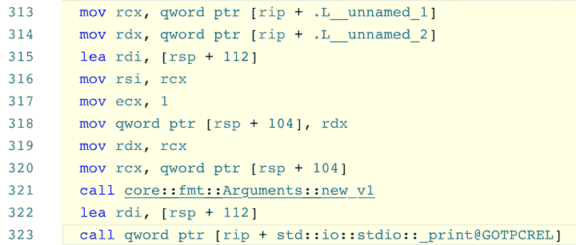

# 在 Rust - LogRocket 博客中与程序集交互

> 原文：<https://blog.logrocket.com/interacting-with-assembly-in-rust/>

对于许多 Rust 开发人员来说，从他们的 Rust 代码生成二进制代码的过程是一个简单的过程，不需要太多思考。然而，现代编译器本身是复杂的程序，可能会产生二进制文件，它们在响应源代码的微小变化时表现非常不同。

在诊断类似这样的性能问题时，检查编译器的输出会很有帮助。Rust 编译器发出各种类型的输出，其中一种是汇编。Rust 也有嵌入程序集的设施。在本指南中，我们将探索 Rust 社区为提取和嵌入程序集提供了什么。

## 观察组件

为了查看每个工具的汇编输出，我们将使用下面的示例程序。

```
const NAMES: [&'static str; 10] = [
    "Kaladin", "Teft", "Drehy", "Skar", "Rock", "Sigzil", "Moash", "Leyten", "Lopen", "Hobber",
];

fn main() {
    roll_call();
}

pub fn roll_call() {
    println!("SOUND OFF");
    for name in NAMES.iter() {
        println!("{}: HERE!", name);
    }
    let num_present = NAMES.len();
    println!("All {} accounted for!", num_present);
}

```

### `rustc`

生成汇编最快最简单的方法是使用编译器本身。这种方法不需要安装任何额外的工具，但是输出可能很难导航。`rustc`可以用 [`--emit asm`](https://doc.rust-lang.org/rustc/command-line-arguments.html#--emit-specifies-the-types-of-output-files-to-generate) 选项发出装配。

要使用英特尔语法(而不是默认的美国电话电报公司语法)格式化输出，您还可以将`-C llvm-args=-x86-asm-syntax=intel`选项传递给`rustc`。然而，与`cargo`互动比直接与`rustc`互动更常见。

您可以通过两种方式之一将此选项传递给`rustc`:

```
$ cargo rustc -- --emit asm -C llvm-args=-x86-asm-syntax=intel
$ RUSTFLAGS="--emit asm -C llvm-args=-x86-asm-syntax=intel" cargo build

```

组件将被放置在`target/debug/deps/<crate name>-<hash>.s`中。如果在发布模式下编译，它将在`target/release`下。装配文件包含板条箱的所有装配，可能难以导航。

### Godbolt 编译器资源管理器

检查简短代码片段的一个简单方法是通过 [Godbolt 编译器浏览器](https://godbolt.org/)运行它。该工具是一个 web 应用程序，因此不需要您安装任何其他工具。

在左窗格中输入的代码被编译为程序集，并显示在右窗格中。在左窗格中输入的代码就像在`main`函数内部一样，所以您不需要输入自己的`main`函数。

左窗格中的代码部分是用颜色编码的，以便可以很容易地识别右窗格中的程序集。例如，在左窗格中输入`roll_call`函数和`NAMES`数组会显示下面的`roll_call`函数视图。


您可以通过右键单击该行并选择“显示链接代码”或通过搜索以相同颜色突出显示的程序集来识别对应于`println!("SOUND OFF")`宏的程序集。



### `cargo-asm`

[`cargo-asm`](https://github.com/gnzlbg/cargo-asm) 是一个货物子命令，一次显示一个功能的装配。这个工具的美妙之处在于它能够解析符号名称并显示与相应程序集交错的源代码。

然而，`cargo-asm`似乎只适用于图书馆的板条箱。将`NAMES`数组和`roll_call`函数放入名为`asm_rust_lib`的库箱中，然后如下调用`cargo-asm`(注意:`--rust`选项交错源代码，因为这不是默认选项)。

```
$ cargo asm --rust asm_rust_lib::roll_call

```

输出的前几行应该如下所示:


Rust 开发人员学习汇编时会发现，将不熟悉的汇编与相应的(熟悉的)Rust 代码进行比较的能力特别有用。

## 包括装配

我们总是可以将汇编编译成一个目标文件，并将其链接到我们的二进制文件中，但是这增加了我们不希望的复杂性，尤其是如果我们只需要包含几行汇编的话。幸运的是，Rust 提供了一些工具来简化这个过程，尤其是在简单的情况下。

### `llvm_asm!`

直到最近，将内联汇编包含到 Rust 代码中的官方方法是`asm!`宏，它需要每晚 Rust。这个宏本质上是 LLVM 的[内联汇编指令](https://github.com/gnzlbg/cargo-asm)的包装器。这个宏已经被重命名为`llvm_asm!`，而一个新的`asm!`宏正在 Rust nightly 中工作，但是仍然需要一个每夜编译器来使用`llvm_asm!`。

宏的语法如下。

```
llvm_asm!(assembly template
   : output operands
   : input operands
   : clobbers
   : options
   );

```

`assembly template`部分是包含程序集的模板字符串。输入和输出操作数处理值应该如何跨越 Rust/assembly 边界。`clobbers`部分列出了汇编可以修改的寄存器，以表明编译器不应该依赖这些寄存器中保持不变的值。正如你所想象的,`options`部分包含选项，特别是使用英特尔语法的选项。宏的每个部分都需要特定的语法，所以我强烈推荐阅读[文档](https://github.com/gnzlbg/cargo-asm)以获得更多信息。

注意，使用`llvm_asm!`宏需要一个`unsafe`块，因为汇编绕过了编译器通常提供的所有安全检查。

### `asm!`

新的`asm!`宏提供了比`llvm_asm!`宏更好的使用内联汇编的语法。理解 LLVM 内联汇编指令不再是必要的，而且[文档](https://github.com/gnzlbg/cargo-asm)比`llvm_asm!`的内容更广泛。

新的语法更接近与`println!`和`format!`宏一起使用的标准格式字符串语法，同时仍然允许精确跨越 Rust/assembly 边界。考虑下面显示的小程序。

```
let mut x: u64 = 3;
unsafe {
    asm!("add {0}, {number}", inout(reg) x, number = const 5);
}

```

`inout(reg) x`语句表示编译器应该找到一个合适的通用寄存器，用`x`的当前值准备该寄存器，将`add`指令的输出存储在同一个通用寄存器中，然后将该通用寄存器的值存储在`x`中。考虑到跨越 Rust/assembly 边界的复杂性，语法非常简洁。

## 结论

汇编语言是一种许多开发人员并不日常使用的语言，但是看到代码如何直接操纵 CPU 仍然是有趣且有教育意义的。上面没有提到调试器，但是现代调试器(GDB，LLDB)也允许你反汇编代码，一条指令一条指令的调试。

有了上面的工具和调试器，您应该能够以多种方式探索代码被翻译成的程序集。

## 使用 [LogRocket](https://lp.logrocket.com/blg/signup) 消除传统错误报告的干扰

[](https://lp.logrocket.com/blg/signup)

[LogRocket](https://lp.logrocket.com/blg/signup) 是一个数字体验分析解决方案，它可以保护您免受数百个假阳性错误警报的影响，只针对几个真正重要的项目。LogRocket 会告诉您应用程序中实际影响用户的最具影响力的 bug 和 UX 问题。

然后，使用具有深层技术遥测的会话重放来确切地查看用户看到了什么以及是什么导致了问题，就像你在他们身后看一样。

LogRocket 自动聚合客户端错误、JS 异常、前端性能指标和用户交互。然后 LogRocket 使用机器学习来告诉你哪些问题正在影响大多数用户，并提供你需要修复它的上下文。

关注重要的 bug—[今天就试试 LogRocket】。](https://lp.logrocket.com/blg/signup-issue-free)