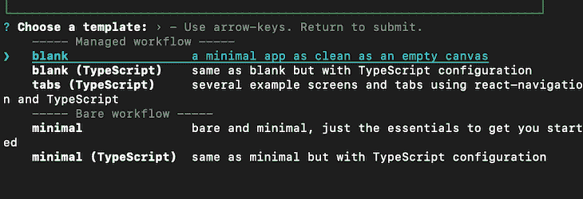

# React Native - LogRocket 博客的国际化和本地化

> 原文：<https://blog.logrocket.com/internationalization-and-localization-in-react-native/>

国际化，或称为 i18n，是构建能够适应不同文化、地区和语言的应用程序的过程。

然而，本地化(或 l10n)涉及翻译成用户指定的地区或语言，并通过国际化成为可能。

本地化应用程序意味着构建它以支持多种语言和地区，使应用程序可供更广泛的用户访问和使用。

在移动应用程序开发中，本地化从用户的设备获取语言和区域设置，这与用户的地理位置不同，并编写相应的软件来适应。

本地化一个应用程序通常是具有挑战性的，但是在`expo-localization`和`i18n-js`的帮助下，我们将学习如何在 Expo 和 bare React 本地应用程序中实现本地化。

## 要求

在开始本教程之前，请确保您具备以下条件:

此外，除了`[expo-localization](https://docs.expo.io/versions/v41.0.0/sdk/localization/)` SDK，我们也可以使用像 [react-native-localize](https://github.com/zoontek/react-native-localize) 这样的库。但是，这个工具箱只支持 React Native，不支持 Expo 应用程序，因为它是一个本机模块。

## 使用`expo-localization`

`expo-localization` SDK 让我们能够访问用户本地设备的地区数据，包括`[isoCurrencyCodes](https://docs.expo.io/versions/v41.0.0/sdk/localization/#localizationisocurrencycodes/)`常量，它返回用户设备中所有支持的货币代码的数组，以及`[timezone](%22https://docs.expo.io/versions/v41.0.0/sdk/localization/#localizationtimezone)`常量，它返回设备的时区。

现在，让我们从使用`expo-localization`和`i18n-js`本地化 Expo 应用程序开始。

## 创建世博应用程序

首先，让我们使用 Expo CLI 生成一个 Expo 应用程序。打开一个新的终端并运行以下命令来生成 Expo 应用程序:

```
expo init name-of-your-app

```

选择一个空白模板。这给了我们最少的依赖，我们需要开始。



要打开应用程序，请导航到我们新创建的应用程序的根目录，并相应地运行以下命令:

```
# For iOS
yarn ios
# or
npm run ios

# For Android
yarn android
# or
yarn android

```

该命令输出以下屏幕:


### 安装依赖项

现在我们已经生成了一个 Expo 应用程序，我们可以在导航到应用程序目录后安装`expo-localization`和`i18n-js`作为依赖项。

运行以下任一命令来安装这两个软件包:

```
yarn add expo-localization i18n-js
#or
npm i expo-localization i18n-js

```

### 提取和集中应用程序的文本

本地化我们的应用程序的一个重要步骤是提取和集中用户将要交互的文本到一个单独的文件中。这使我们能够根据用户设备的语言环境有条件地向用户呈现文本。

首先在`i18n/supportedLanguages.js`中创建一个文件；这是我们想要放置用户交互的所有非代码文本的地方。

在本教程中，我们的应用程序将支持三种语言:英语，中文和西班牙语。通过添加下面几行代码，我们创建了一个键值对的 JavaScript 对象。每种语言都有相同的关键字，但值不同:

```
const en = {
  welcome: 'Internationalization and Localization in React Native',
  signoutBtn: 'Sign out',
  signOutAlertTitle: 'Cancel',
  signOutAlertMess: 'Are you sure you want to sign out?',
  confirm: 'Okay',
  resetBtn: 'Reset password',
};
const zh = {
  welcome: 'React Native 中的国际化和本地化',
  signoutBtn: '登出',
  signOutAlertTitle: '取消',
  signOutAlertMess: '您确定要退出吗？',
  confirm: '好的',
  resetBtn: '重设密码',
};
const es = {
  welcome: 'Internacionalización y localización en React Native',
  signoutBtn: 'desconectar',
  signOutAlertTitle: 'Cancelar',
  signOutAlertMess: '¿Estás segura de que quieres cerrar sesión?',
  confirm: 'Okey',
  resetBtn: 'Restablecer la contraseña',
};
export { zh, en, es };

```

稍后，我们将导入这些不同的语言，用代表用户地区文本的键值替换当前字符串。

### 获取用户的设备区域设置

`expo-localization` SDK 通过调用`locale`常量来访问设备的语言代码，从而为我们提供用户的设备语言环境。

### 添加国际化功能

让我们导入最近安装的两个包和我们的语言配置文件，以添加国际化功能:

```
import * as Localization from 'expo-localization';
import i18n from 'i18n-js';
import { zh, en, es } from './i18n/supportedLanguages';

```

在`import`语句之后，添加下面一行代码:

```
i18n.fallbacks = true;
i18n.translations = { en, zh, es };
i18n.locale = Localization.locale;

```

通过指定`i18n.fallbacks = true`，我们启用了语言环境回退特性。这意味着，例如，如果我们不指定“重置密码”的西班牙语文本是什么，该文本将退回到默认语言。

设置`i18n.translations = { en, zh, es }`指定了我们希望在应用程序中支持的语言的键值对。

而且，通过`i18n.locale = Localization.locale`，我们可以根据用户的设备设置来设置应用程序的语言环境。

### 使用`i18n-js`本地化应用程序文本

为了将本地化的文本放到应用程序中，我们需要调用`i18n.t()`函数，并传递我们想要翻译为字符串的键。

假设我们想要本地化应用程序的`welcome`文本。我们可以添加以下内容:

```
>// jsx
<Text>{i18n.t('welcome')}</Text>

```

这给了我们基于用户设备的地区导入的配置对象中的`welcome`键的值。


`Welcome` key of device set to English.


`Welcome` key of device set to Chinese.

要在 iOS 模拟器上演示设备的本地化，请打开设备设置，并导航至**常规** > **语言&地区** > **iPhone 语言**。选择**中文**或**西班牙文**以查看文本将如何根据所选语言有条件地呈现。

在 Android iOS 模拟器上，打开**菜单** > **设置** > **语言&键盘** > **选择区域设置**。

选择语言环境后，iOS 模拟器上最终本地化的 Expo 应用程序如下所示:


如果我们想在不进入设备设置的情况下更改设备区域设置，我们可以将`i18n.locale = Localization.locale`更改为`i18n.locale =` `'es'`以获得西班牙语或该应用程序支持的任何语言代码的本地化版本。

请注意，这仅用于测试目的。

## 裸 React 原生应用

### 生成新的 React 本机项目

要开始使用我们的 React Native 应用程序，让我们使用以下命令生成一个 React Native 项目:

```
npx react-native init ReactNativeLocalize

```

这将生成一个空的 React 本地项目，并安装所有必需的依赖项。

要打开应用程序，请导航到我们新创建的应用程序的根目录，并相应地运行以下命令:

```
# To start Metro
npx react-native start

#open a new terminal and run:
npx react-native run-android
# or
react-native run-ios

```

让我们看看如何在一个简单的 React 本地应用中使用`expo-localization` SDK 和`18n-js`。首先，在我们裸露的 React 本地项目中安装并配置`[react-native-unimodules](https://docs.expo.io/bare/installing-unimodules/)`包，包含以下依赖项:

```
yarn add react-native-unimodules
yarn add pod-install

#or

npm install react-native-unimodules
npx pod-install

```

接下来，按照这些额外的配置来为 [iOS](https://docs.expo.io/bare/installing-unimodules/#configuration-for-ios) 和 [Android](https://docs.expo.io/bare/installing-unimodules/#configuration-for-android) 应用程序。

现在，我们可以安装所需的依赖项了。运行以下任一命令来安装这两个软件包:

```
yarn add expo-localization i18n-js
#or
npm i expo-localization i18n-js

```

安装完成后，按照我们在 Expo 应用程序中使用的相同步骤来本地化裸露的 React 本地应用程序。

这是一个带有`expo-localization` SDK 和`18n-js`的本地化 bare React 原生应用的工作演示。


## 结论

有了[国际化](https://blog.logrocket.com/react-intl-internationalize-your-react-apps/)，我们轻松地本地化了一个 [Expo 和 bare React 原生 app](https://blog.logrocket.com/getting-started-with-react-native-and-expo-sdk/) 。通过使用`expo-localization`和`i18n-js`国际化库，我们使用`i18n.t()`函数呈现了两个应用程序文本的本地化版本。

本教程中用于 Expo 和 bare [React 原生项目](https://github.com/ejirocodes/React-Native-i18n-L10n)的完整代码可以在 GitHub 上获得。请随意发表评论，让我知道你对这篇文章的看法。你也可以在[推特](https://twitter.com/ejirocodes)和 [GitHub](https://github.com/ejirocodes) 上找到我。感谢您的阅读！

## [LogRocket](https://lp.logrocket.com/blg/react-native-signup) :即时重现 React 原生应用中的问题。

[](https://lp.logrocket.com/blg/react-native-signup)

[LogRocket](https://lp.logrocket.com/blg/react-native-signup) 是一款 React 原生监控解决方案，可帮助您即时重现问题、确定 bug 的优先级并了解 React 原生应用的性能。

LogRocket 还可以向你展示用户是如何与你的应用程序互动的，从而帮助你提高转化率和产品使用率。LogRocket 的产品分析功能揭示了用户不完成特定流程或不采用新功能的原因。

开始主动监控您的 React 原生应用— [免费试用 LogRocket】。](https://lp.logrocket.com/blg/react-native-signup)