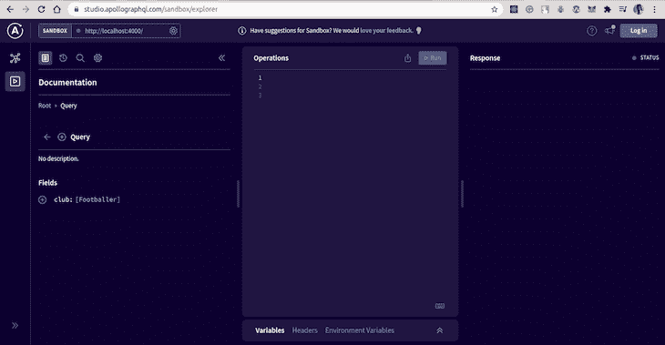
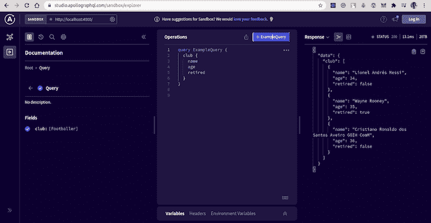

# 介绍阿波罗服务器 3 和阿波罗沙盒-日志火箭博客

> 原文：<https://blog.logrocket.com/intro-apollo-server-3-apollo-sandbox/>

Apollo Server 支持处理大型数据查询的后端应用程序，使用现有数据完成查询，并通过 GraphQL 提供高效的 API 操作方法。有了这些功能，开发人员可以构建和发布更多可用于生产的、自我文档化的 GraphQL APIs，这些 API 可以从任何来源获取数据。

我们将探索 Apollo Server 3 中的一些最新特性，学习如何使用`apollo-server`实现一个简单的后端应用程序，并使用 Apollo 沙箱测试我们的应用程序。

## 阿波罗服务器 3 简介

Apollo Server 3 更侧重于改进，而不是向库中添加更多的新功能。

对最近的 Apollo Server 2 版本进行了一些改进，重点是消除硬编码的依赖关系，提高了服务器的灵活性，这意味着通过消除这些依赖关系而失去的功能可以很容易地集成到服务器中。

这种方法使得添加和发布新特性的过程更加快速。对于 Apollo Server 3，该版本提供了一个更轻、更灵活的代码库，通过减少非硬编码的依赖性和增加 Apollo Server 的可扩展性，为未来版本的向后可伸缩性奠定了基础。

用 Apollo Server 2 编写的代码库在升级到 Apollo Server 3 时不一定需要做任何代码更新，尤其是如果是“自带电池”`apollo-server`库提供了基本的、必要的服务器库需求。

让我们来看看阿波罗服务器 3 中的一些更新。

### 阿波罗服务器 3 更新

随着 Apollo Server 3 的发布，用 Fastify (v3)和哈比神等最新版本的后端框架构建的项目现在可以兼容了。

使用这些无服务器框架，包括 Express.js 和其他框架，需要用户在将服务器集成到所选框架之前，使用新的`await server.start()` ES6 `async/await`语法异步调用`server.start()`。

然而，请注意，这个要求并不适用于`apollo-server`库。

另一方面，使用`apollo-server-lambda`构建一个无服务器的应用程序，更新为`createHandler`，现在被调用为一个异步函数来返回一个`Promise`，去掉了可选的回调。

对于所有允许定制的集成，通过定制头处理 CORS 现在默认为`access-control-allow-origin:`。

对于请求中的错误，比如无效的 JSON 数据或缺失的主体，它们现在在不同的集成中是一致的，一致地返回一个`4xx`状态代码，而不是波动地返回`5xx`状态代码。

最后，Apollo Server 3 的发布需要最新版本的`graphql`库，需要注意的是成功和错误的 GraphQL 响应都会受到`requestContext.response.http.status`设置的影响。

## 阿波罗沙盒简介

在 Apollo Server 3 版本中引入了 Apollo Sandbox **，**这是一个新的平台，通过向服务器查询响应来快速测试运行应用程序。

使用以前版本构建的项目，如 Apollo Server 2，使用 GraphQL Playground 来查询服务器。但是现在，Apollo Sandbox 的实践经验引入了智能字段和路径搜索功能等特性，可以轻松导航项目图表。

现在，让我们快速探索如何构建一个简单的 GraphQL 项目，并使用 Apollo Sandbox 在我们的服务器上查询响应。在本教程中，我们将使用 VIM 文本编辑器、Ubuntu OS 和全局安装在本地机器上的 [Nodemon 包。](https://blog.logrocket.com/nodemon-tutorial-automatically-restart-node-js-apps-with-nodemon/)

## 创建一个简单的 GraphQL 项目

让我们创建一个项目文件夹，并在终端上使用以下命令将目录更改到其中。然后，通过使用 npm 生成`package.json`文件来初始化项目:

```
mkdir simple-apollo-sandbox
cd simple-apollo-sandbox
npm init -y

```

使用`-y`标志将`yes`作为生成`package.json`文件及其内容时所提问题的默认答案。

接下来，让我们更新我们的`package.json`文件中的以下字段:

```
...
  "description": "A quick intro to apollo-server and apollo sandbox",
  "main": "server.js",
  "keywords": ["graphql", "apollo-server", "apollo-sandbox"],
...

```

我们现在可以创建`server.js`文件，在我们的`simple-apollo-sandbox`目录中包含这个项目的代码:

```
touch server.js

```

在创建了将作为我们项目的入口文件的`server.js`文件之后，继续安装项目所需的依赖项:

```
npm install apollo-server graphql

```

上面的命令为 Apollo Server 3 安装核心库，以定义数据的确切形状以及如何与之通信。`graphql`库让我们能够[实现一个 GraphQL 模式](https://blog.logrocket.com/speeding-up-changes-to-the-graphql-schema/)并对其执行查询。

我们将继续定义我们的 GraphQL 模式，即查询时在前端返回的响应的数据结构。将以下代码添加到您的`server.js`文件中:

```
const { ApolloServer, gql } = require('apollo-server');

const typeDefs = gql`
  type Footballer {
    name: String
    age: Int
    retired: Boolean
  }

  type Query {
    club: [Footballer]
  }
`;

```

上面的代码定义了我们的 GraphQL 模式，当一个`club`的查询通过这个项目的客户端在它上面执行时，它返回一个`Footballers`的数组。

为了让我们的服务器理解和使用上面的模式，我们必须定义一个解析器。解析器是一个对象，它告诉 Apollo 服务器如何解释所请求的数据类型:

```
...
const resolvers = {
  Query: {
    club: () => club,
  },
};

```

为了继续我们的项目，让我们按照我们之前定义的 GraphQL 模式对这个项目中的样本数据进行硬编码。请注意，我们可以从任何来源获取数据，如外部 API、[另一个 GraphQL 服务器](https://blog.logrocket.com/swapping-graphql-servers-with-least-effort/)或数据库:

```
...
const club = [
  {
    name: 'Lionel Andrés Messi',
    age: 34,
    retired: false,
  },
  {
    name: 'Wayne Rooney',
    age: 35,
    retired: true,
  },
  {
    name: 'Cristiano Ronaldo dos Santos Aveiro GOIH ComM',
    age: 36,
    retired: false,
  },
];
...

```

当我们用有效的 GraphQL 查询查询服务器时，上面的对象返回，并且响应结构反映了我们的模式。

现在，让我们使用下面的代码启动我们的 Apollo 服务器，同时将`typeDefs`和`resolvers`传递给它:

```
...
const server = new ApolloServer({ typeDefs, resolvers});

server.listen().then(({ url }) => {
  console.log(`Our server is spinned and ready at this ${url} 🚀🚀`)
});

```

## 测试阿波罗服务器

现在我们已经创建了我们的服务器，让我们对它进行一次测试运行，并确保一切功能正常。通过使用 nodemon 包或 npm 在终端上运行以下命令来启动服务器:

```
nodemon server.js

```

现在，让我们导航到`[http://localhost:4000/](http://localhost:4000/)`查看登录页面，该页面提供了访问 Apollo Sandbox 的链接:


让我们单击**查询您的服务器**按钮导航到 Apollo 沙盒。沙盒用户界面包括:

*   用于编写和执行查询的**操作**面板
*   用于查看查询结果的**响应**面板
*   模式浏览、搜索和设置选项卡
*   用于连接其他 GraphQL 服务器的 URL 栏



让我们使用下面的 GraphQL 查询字符串开始查询我们的服务器，以便在 Apollo 沙箱上执行`club`查询:

```
query ExampleQuery {
  club {
    name
    age
    retired
  }
}

```

将上述查询粘贴到**操作**面板中，点击**运行**按钮，在如下所示的**响应**面板上得到响应:



现在，我们已经成功地实现了一个 Apollo 服务器项目，并使用新的 Apollo 沙箱来查询我们的后端应用程序以获得响应。

在上面的截图中，阿波罗沙箱向我们后端的服务器发出请求，请求存储在`name`、`age`和`retired`变量中的数据。这个请求是一个`GET`请求，它返回任何前端应用程序都可以使用的 JSON 数据。

我们可以选择一次只获取一个字段、两个字段或所有三个字段，我们在上面的代码中就是这样做的。

## 结论

在本教程中，我们学习了新的阿波罗服务器 3，阿波罗沙箱，如何设置和安装阿波罗服务器，实现一个简单的项目，并使用阿波罗沙箱发送 GraphQL 查询到服务器。

Apollo Server 3 上的新更新带来的好处是在使用 Apollo Server 时具有较少依赖的代码库。这使得它非常适合使用 Apollo Server 构建后端服务器来处理大型数据查询，并使用 GraphQL 为外部数据定义自定义路由。

## 使用 [LogRocket](https://lp.logrocket.com/blg/signup) 消除传统错误报告的干扰

[](https://lp.logrocket.com/blg/signup)

[LogRocket](https://lp.logrocket.com/blg/signup) 是一个数字体验分析解决方案，它可以保护您免受数百个假阳性错误警报的影响，只针对几个真正重要的项目。LogRocket 会告诉您应用程序中实际影响用户的最具影响力的 bug 和 UX 问题。

然后，使用具有深层技术遥测的会话重放来确切地查看用户看到了什么以及是什么导致了问题，就像你在他们身后看一样。

LogRocket 自动聚合客户端错误、JS 异常、前端性能指标和用户交互。然后 LogRocket 使用机器学习来告诉你哪些问题正在影响大多数用户，并提供你需要修复它的上下文。

关注重要的 bug—[今天就试试 LogRocket】。](https://lp.logrocket.com/blg/signup-issue-free)