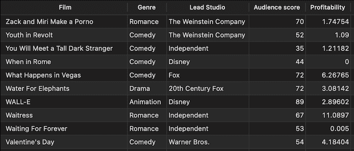
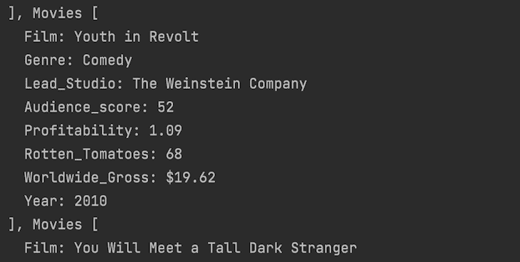

# SQLDelight - LogRocket 博客简介

> 原文：<https://blog.logrocket.com/intro-sqldelight/>

根据其官方文档，SQLDelight 库以从 SQL 语句生成类型安全的 Kotlin APIs 而闻名。通过其模式验证、语句和编译时迁移，SQLDelignt 提供了 IDE 功能，使编写和维护 SQL 变得容易。

那么 SQLDelight 做了哪些其他库没有做的事情呢？我们以最著名的原生 Android 开发库 Room 为例。

这两个库都围绕着 SQLite 数据库，通过提供 Kotlin 和 Java APIs 来推理大多数带有编译时验证的 CRUD 操作，从而防止我们使用噩梦般的`SQLiteOpenHelper`。

SQLDelight 与众不同的地方在于，除了 Android 之外，它还具有跨平台支持，可以选择将底层数据库更改为`MySQL`、`Postgress`或`HSQL/H2`。

通过使用 Kotlin 多平台移动设备，SQLDelight 还提供了与平台无关的 API 的跨平台兼容性，以便在不同平台(如 Android、iOS 等)之间共享业务逻辑代码。

此外，SQLDelight 提供了语法高亮显示和自动完成、迁移测试和导出、为 Java 虚拟机(JVM)项目切换底层数据库的能力，并支持协程和 RxJava。

在本文中，我们将涵盖以下内容:

1.  [设置 SQLDelight](https://blog.logrocket.com/intro-to-sqldelight/)
2.  [设置并连接到数据库](https://blog.logrocket.com/intro-to-sqldelight/)
3.  [使用 SQLDelight](https://blog.logrocket.com/intro-to-sqldelight/) 对`Insert`、`Update`、`Select`和`Delete`查询进行 CRUD 操作
4.  [事务操作和原子回滚](https://blog.logrocket.com/intro-to-sqldelight/)

好吧，让我们开始吧！

## 设置 SQLDelight

由于 JVM 项目对于 iOS 或 Android 开发人员来说是最中立的，所以这里提到的所有操作都适用于本地移动开发。唯一的变化是添加的数据库驱动程序的依赖性。

首先，打开`IntelliJ`并在其中创建一个新项目。然后，[选择`Kotlin`](https://blog.logrocket.com/kotlin-vs-java-for-android-development/) ，将以下依赖关系添加到`Console Application`:

```
buildscript {
  repositories {
    google()
    mavenCentral()
    maven { url "https://www.jetbrains.com/intellij-repository/releases" }
    maven { url "https://jetbrains.bintray.com/intellij-third-party-dependencies" }
  }
  dependencies {
    classpath 'com.squareup.sqldelight:gradle-plugin:1.5.0'
  }
}

apply plugin: 'com.squareup.sqldelight'

dependencies {
    implementation 'com.squareup.sqldelight:jdbc-driver:1.5.1'
    implementation 'com.zaxxer:HikariCP:5.0.0'
    implementation 'org.slf4j:slf4j-simple:1.7.32'
    implementation 'mysql:mysql-connector-java:8.0.26'
    testImplementation 'org.jetbrains.kotlin:kotlin-test:1.5.31'
}

sqldelight {
  Database { // This will be the name of the generated database class.
    packageName = "com.example"
    dialect = "mysql"
  }
}

```

## 设置 MySQL 数据库

现在我们已经为 SQLDelight 设置好了一切，让我们继续设置一个 MySQL 数据库。

首先为你的设备下载并安装 MySQL([点击这里下载](https://flaviocopes.com/mysql-how-to-install/) [mac](https://flaviocopes.com/mysql-how-to-install/) [OS](https://flaviocopes.com/mysql-how-to-install/) )

然后，您可以安装一个可视化工具来可视化数据，如 [TablePlus](https://tableplus.com/) 或 [Workbench](https://www.mysql.com/products/workbench/) ，并将您的数据库连接到可视化工具，这样我们就可以实时看到数据变化。

创建一个名为`movies_db`的数据库；您可以通过[导入](https://gist.githubusercontent.com/jobinlawrance/224d536afe2b2cff015461bf27f375df/raw/89ca39a71e5ef37eebca40733c23f843d7594bac/movies.csv) [这个 csv 作为新表](https://gist.githubusercontent.com/jobinlawrance/224d536afe2b2cff015461bf27f375df/raw/89ca39a71e5ef37eebca40733c23f843d7594bac/movies.csv)到我们的`movies_db database`来导入一个样本数据集用于本教程。

我们的`db`看起来是这样的:



## 将 SQLDelight 连接到 MySQL 数据库

现在，让我们回到我们的 Java 项目！

为了让 SQL light[连接到 MySQL 数据库](https://blog.logrocket.com/creating-scalable-graphql-api-mysql-apollo-node/creating-database-models-mysql)，它需要一个`DataSource`的实例，我们可以从 HikariCP 这样的连接管理器中获得这个实例。

然后我们可以创建下面的函数将`Datasource`放入`Main.kt`文件:

```
private fun getSqlDriver(): SqlDriver {
    val ds = HikariDataSource()
    ds.jdbcUrl = "jdbc:mysql://localhost:3306/movies_db"
    ds.driverClassName = "com.mysql.jdbc.Driver"
    ds.username = "root"
    ds.password = "mysqlroot"
    return ds.asJdbcDriver()
}

```

接下来，让我们在`src/sqldelight`目录下创建一个`Movie.sq`文件，并添加一条`SELECT`语句:

```
CREATE TABLE movies (
  Film text,
  Genre text,
  `Lead Studio` text,
  `Audience score` int DEFAULT NULL,
  Profitability float DEFAULT NULL,
  `Rotten Tomatoes` int DEFAULT NULL,
  `Worldwide Gross` text,
  Year int DEFAULT NULL
);

selectAll:
SELECT *
FROM movies;

```

随着我们项目的构建，SQLDelight 创建所需的模型和查询文件。这可以帮助我们稍后进行调试和测试。


为了测试我们的初始代码，我们可以在我们的`main`函数中编写以下代码并运行:

```
fun main(args: Array<String>) {

    val database = Database(getSqlDriver())
    val moviesQueries = database.movieQueries

    val movies = moviesQueries.selectAll().executeAsList()
    println(movies)

}

```

这将在终端中打印我们的`Movies`表:



请注意，在生产中，我们应该只初始化数据库代码一次，并将其作为一个单体重用，以防止内存问题。

## SQLDelight 中的 CRUD 操作

所有的[基本 CRUD 操作保持与编写 SQL 查询相同的](https://blog.logrocket.com/crud-react-graphql-examples/#crud), SQL 查询以`.sq`文件中的方法名为前缀，SQLDelight 构建所需的函数和数据模型。

### `Insert`

正如我们从 SQLDelight 构建文件中看到的，我们有一个从数据库中的 movies 表创建的`Movies`数据类。

我们有两个插入选项:用`movies`表中的每个值创建一个函数，或者传递整个`movie`对象。

如果我们通过值创建一个函数，我们有如下结果:

```
insert:
INSERT INTO movies(Film, Genre, `Lead Studio`, `Worldwide Gross`, Year)
VALUES(?, ?, ?, ?,?);

```

如果我们通过对象创建一个函数，我们有如下结果:

```
insertObject:
INSERT INTO movies(Film, Genre, `Lead Studio`, `Audience score`, Profitability, 
`Rotten Tomatoes`, `Worldwide Gross`, Year)
VALUES ?;

```

现在，我们可以在我们的`main`函数中构建并运行这些方法:

```
fun main(args: Array<String>) {
  ....

// Insert by values
  insert(
      "Deadpool",
      "Action/Adventure",
      "20th Century Fox",
      "$734",
      2016
  )

  // Insert object
  val movie = Movies(
      Film = "Wonder Woman",
      Genre = "Action/Adventure",
      Lead_Studio = "DC Films",
      Audience_score = null,
      Profitability = null,
      Rotten_Tomatoes = null,
      Worldwide_Gross = "$66",
      Year = 2017
  )
  insert(movie)
}

private fun insert(
    film: String,
    genre: String,
    leadStudio: String,
    worldwideGross: String,
    year: Int
) {
    moviesQueries.insert(film, genre, leadStudio, worldwideGross, year)
}

private fun insert(movies: Movies) {
    moviesQueries.insertObject(movies)
}

```

通过打印或在查看器中查看我们的表格，我们可以验证以下值:


### `Update`

这里没有什么特别的，只是普通的`Update`查询，使我们能够更新数据库中的任何现有字段:

```
update:
UPDATE movies
SET `Worldwide Gross`=? WHERE Film=?;

```

然后，它在 Kotlin 中构建以下内容:

```
private fun update(worldwideGross: String, film: String) {
    moviesQueries.update(worldwideGross, film)
}

```

### `Delete`

继续我们的查询，我们可以添加`delete`查询:

```
delete:
DELETE FROM movies WHERE Film=?;

```

然后这在科特林建立起来:

```
private fun delete(film: String) {
    moviesQueries.delete(film)
}

```

### `Select`

在打印表格时，我们已经看到了上面的简单选择查询，所以让我们看看带有`named`和`variable`参数的`Select`查询。

要向`Select`查询添加命名参数，我们必须添加以下内容:

```
filmOrGenre:
SELECT * FROM movies
WHERE Film LIKE :searchQuery
OR Genre LIKE :searchQuery;

```

这将在 Kotlin 中构建以下内容:

```
private fun searchFilmOrGenre(query: String): List<Movies> {
    return moviesQueries.filmOrGenre(searchQuery = query).executeAsList()
}

```

在这里，我们可以传递一组值作为参数，以启用应用程序中的搜索功能:

```
filmByNames:
SELECT * FROM movies
WHERE Film IN ?;

```

然后建在科特林:

```
private fun searchFilmsByName(films: List<String>): List<Movies> {
    return moviesQueries.filmByNames(films).executeAsList()
}

```

最后，在`main`函数中，我们可以传递一个电影列表进行搜索:

```
searchFilmsByName(listOf("Penelope", "Valentine's Day", "Mamma Mia!"))

```

## 处理

我们还可以选择使用`transaction`函数在一个事务下执行多个语句，并选择回调或回滚。

当我们有许多必须组合的查询时，这很有帮助，因为单独运行多个查询会导致内存开销。

因此，让我们将多部电影插入到一个函数中，如下所示:

```
val bunchOfMovies = listOf(
    Movies(
        Film = "Sunny",
        Genre = "",
        Lead_Studio = "Dreams N Beyond",
        Audience_score = null,
        Profitability = null,
        Rotten_Tomatoes = null,
        Worldwide_Gross = "",
        Year = 2021
    ),
    Movies(
        Film = "Kala",
        Genre = "Crime",
        Lead_Studio = "Juvis Productions",
        Audience_score = null,
        Profitability = null,
        Rotten_Tomatoes = null,
        Worldwide_Gross = "",
        Year = 2020
    ),
)

moviesQueries.transaction {
    bunchOfMovies.forEach { movie ->
        moviesQueries.insertObject(movie)
    }
}

```

现在，假设我们需要在运行时基于某种条件取消整个事务；我们可以选择使用`rollback()`进行回滚:

```
moviesQueries.transaction {
    bunchOfMovies.forEach { movie ->
        if (movie.Genre.isNullOrEmpty())
            rollback()
        moviesQueries.insertObject(movie)
    }
}

```

如果我们的任何要求没有得到满足，我们还可以选择获得事务完成或回滚的回调:

```
// Rollback
moviesQueries.transaction {
    afterCommit {
      println(
          "Transaction complete: ${bunchOfMovies.size} movies inserted"
      )
    }
    afterRollback { println("Rollback: No movies were inserted") }

    bunchOfMovies.forEach { movie ->
        if (movie.Genre.isNullOrEmpty())
            rollback()
        moviesQueries.insertObject(movie)
    }
}

```

## 结论

到此为止，我们已经介绍了使用 SQLDelight 进行类型安全的 Kotlin 式数据库操作的基础知识。从这里，您可以深入一些高级操作，如迁移、快速文本搜索、定制适配器等等。

完整的工作应用程序可以在这个 [Github Repo](https://github.com/jobinlawrance/SqlDelightSample) 中找到。

## 使用 [LogRocket](https://lp.logrocket.com/blg/signup) 消除传统错误报告的干扰

[](https://lp.logrocket.com/blg/signup)

[LogRocket](https://lp.logrocket.com/blg/signup) 是一个数字体验分析解决方案，它可以保护您免受数百个假阳性错误警报的影响，只针对几个真正重要的项目。LogRocket 会告诉您应用程序中实际影响用户的最具影响力的 bug 和 UX 问题。

然后，使用具有深层技术遥测的会话重放来确切地查看用户看到了什么以及是什么导致了问题，就像你在他们身后看一样。

LogRocket 自动聚合客户端错误、JS 异常、前端性能指标和用户交互。然后 LogRocket 使用机器学习来告诉你哪些问题正在影响大多数用户，并提供你需要修复它的上下文。

关注重要的 bug—[今天就试试 LogRocket】。](https://lp.logrocket.com/blg/signup-issue-free)

## LogRocket :即时重现你的安卓应用中的问题。

[](https://lp.logrocket.com/blg/kotlin-signup)

[LogRocket](https://lp.logrocket.com/blg/kotlin-signup) 是一款 Android 监控解决方案，可以帮助您即时重现问题，确定 bug 的优先级，并了解您的 Android 应用程序的性能。

LogRocket 还可以向你展示用户是如何与你的应用程序互动的，从而帮助你提高转化率和产品使用率。LogRocket 的产品分析功能揭示了用户不完成特定流程或不采用新功能的原因。

开始主动监控您的 Android 应用程序— [免费试用 LogRocket】。](hhttps://lp.logrocket.com/blg/kotlin-signup)