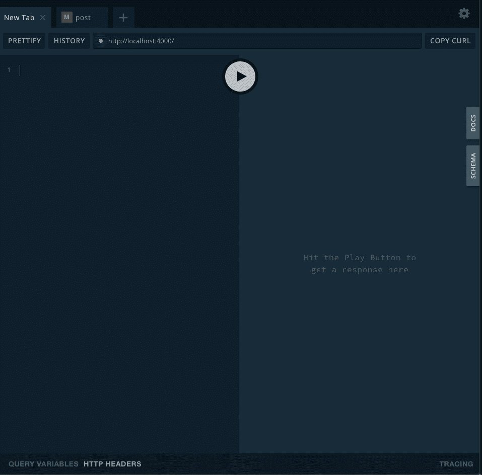
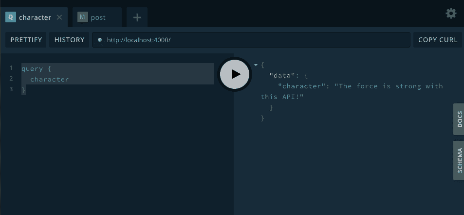
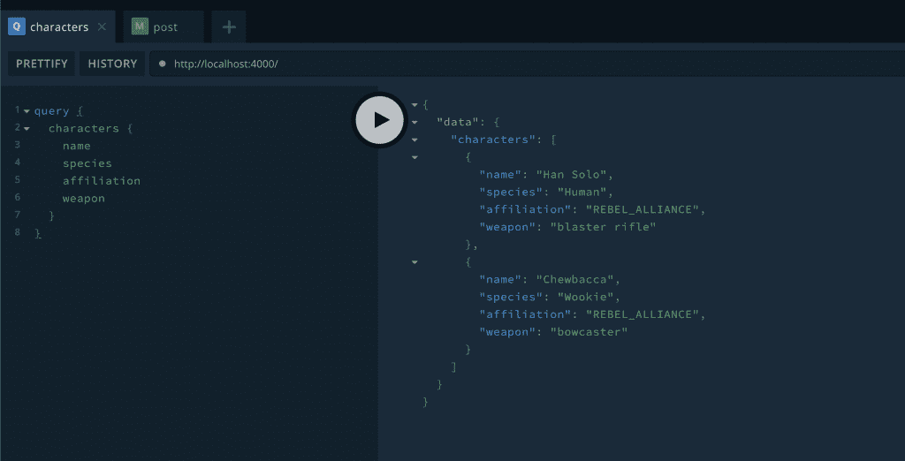
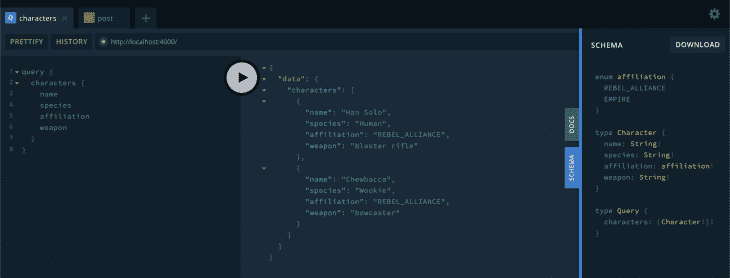
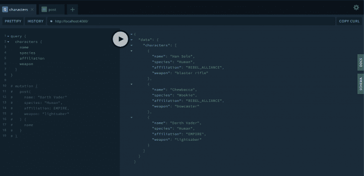
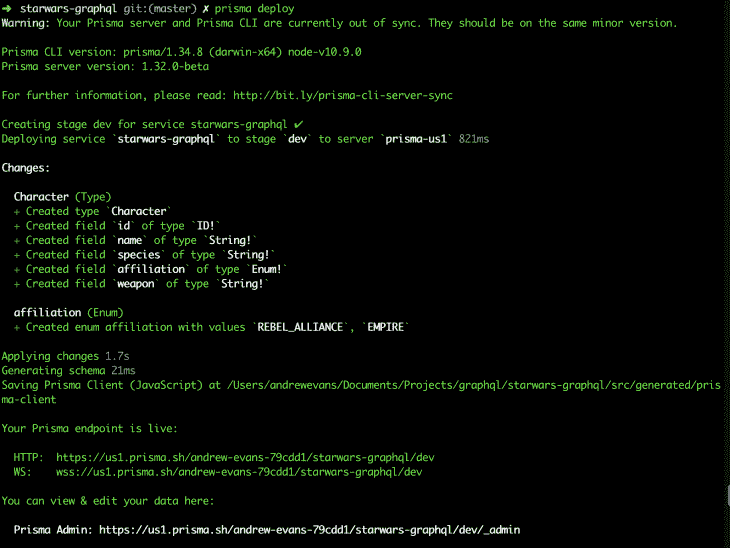
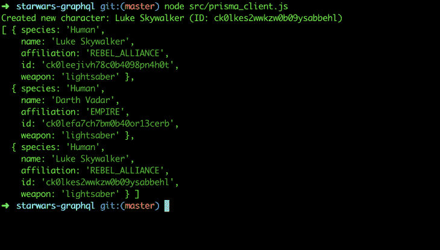
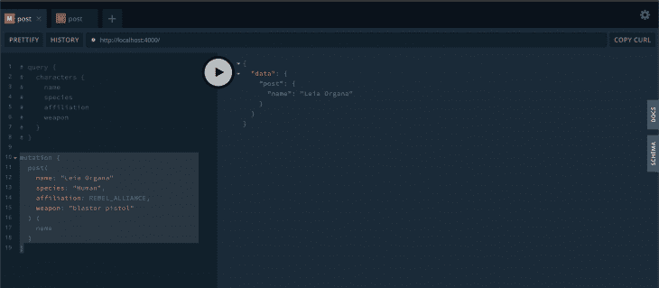
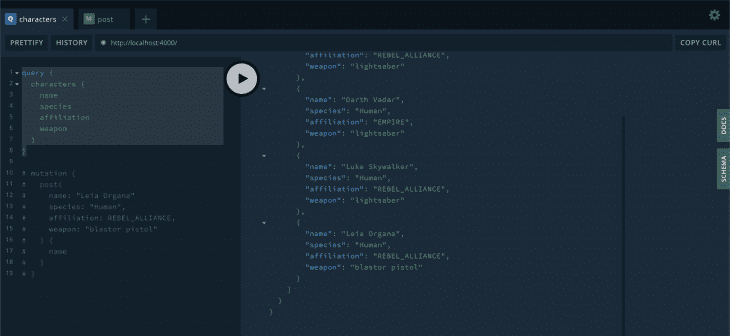
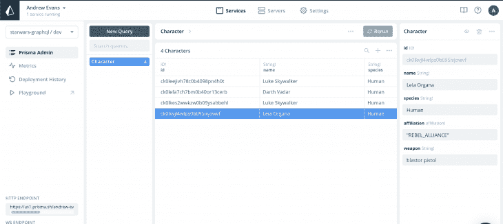

# Prisma - LogRocket 博客介绍 GraphQL

> 原文：<https://blog.logrocket.com/intro-to-graphql-with-prisma/>

## 介绍

传统的 API 专注于 REST 服务，使用标准端点和 HTTP 动词，如 GET、POST、PUT 和 DELETE。随着 [**GraphQL**](https://graphql.org/) 的出现，REST 现在有了一个替代方案，对于任何项目来说都一样强大和可行。

关于使用 GraphQL 有很多可用的[信息](https://graphql.org/learn/)，但是一个常见的问题是将 GraphQL 服务器连接到数据库。 [Prisma](https://www.prisma.io/) 是一个优秀的工具，它通过 GraphQL API 极大地简化了与数据库的交互。

这篇文章将介绍 GraphQL 的一些基础知识，然后展示如何在 GraphQL 实例中使用 Prisma。

我们将与一个 GraphQL 项目合作，该项目与《星球大战》角色数据库进行交互。这个项目可以在 Github [这里](https://github.com/andrewevans0102/starwars-graphql)找到。我将在 Mac 上浏览这篇文章，但是只要你安装了 [Bash Shell](https://en.wikipedia.org/wiki/Bash_(Unix_shell)) ，命令应该是一样的。

此外，如果你想有一个有趣的方法来为你的数据库查找星球大战人物，请点击查看[星球大战数据库。](https://www.starwars.com/databank)

## 一些背景

GraphQL 最初是由脸书在 2012 年开发的，由一种用于 API 的查询和操作语言组成。GraphQL 使您能够通过特定的查询与应用程序的数据进行交互，而不是构建传统的请求/响应模型。这可以是实际的查询，或者您可以使用[突变](https://graphql.org/learn/queries/)来更新您的数据。当您关心 API 的效率，并且只检索必要的内容时，这是特别有益的。

使用 GraphQL，您可以构建一个[数据模式](https://graphql.org/learn/schema/)和[解析器](https://graphql.org/learn/execution/)来控制返回什么数据以及如何与之交互。通过数据库连接数据可能会变得复杂，但这正是 **Prisma** 的闪光点。

Prisma 为你的 GraphQL API 提供了一个数据库客户端。这个客户机使您作为开发人员的生活变得非常容易，因为它为您自动生成基本的数据库命令。

Prisma CLI 甚至只需几个命令就能在 docker 容器中启动数据库。Prisma 目前支持 TypeScript、JavaScript、Flow 和 Go。

在接下来的部分中，我们将创建一个与星球大战角色数据库交互的 GraphQL API。我们将首先设置 GraphQL API，然后用 Prisma 将其连接到一个数据库。

## 图形 SQL 设置

首先，转到您的终端，让我们创建一个文件夹，并用以下内容初始化一个项目:

```
mkdir starwars-graphql
cd starwars-graphql
yarn init -y
```

**(注意:我们在这里使用的是纱线，但是你也可以很容易地使用 npm)**

这只是创建一个基本的`package.json`，然后让您有一个工作空间来开始创建您的 GraphQL 服务器。

现在让我们用传统的`index.js`文件为您的服务器创建一个源目录:

```
mkdir src
touch src/index.js
```

接下来，安装 [graphql-yoga](https://www.npmjs.com/package/graphql-yoga) 包来自动创建 graphql 的完整实例:

```
yarn add graphql-yoga
```

现在我们已经有了依赖项，让我们添加以下内容:

*   **类型定义** =定义我们的数据和操作
*   **解析器** =处理我们数据的 GraphQL 查询的方法
*   **服务器** =我们的 GraphQL 实例的正式实例化

在您的`index.js`文件中继续添加以下内容:

```
const { GraphQLServer } = require('graphql-yoga')

// Type Definition
const typeDefs = `
type Query {
  character: String!
}
`

// Resolvers
const resolvers = {
  Query: {
    character: () => `The force is strong with this API!`
  }
}

// Server
const server = new GraphQLServer({
  typeDefs,
  resolvers,
})
server.start(() => console.log(`Server is running on http://localhost:4000`))
```

现在让我们继续用下面的代码测试您的 GraphQL 实例:

```
node src/index.js
```

这应该会在`[http://localhost:4000](http://localhost:4000)`启动您的服务器。如果你打开那个端口的浏览器，你应该会看到类似这样的内容:


这是什么？这是 [GraphQL 游乐场](https://github.com/graphcool/graphql-playground)。GraphQL Playground 使您能够在本地与 GraphQL 服务器进行交互。在左边的面板中，您可以放置将直接与您的数据交互的查询。您还可以打开右边的**模式**，它显示了服务器正在期待的数据(稍后会有更多相关内容)。

出于我们初始测试的目的，继续将以下内容复制并粘贴到左侧面板中，然后单击小箭头运行您的第一个查询:

```
query {
  character
}
```

运行查询后，您应该会看到以下内容:



这做了什么？它刚刚运行了您的第一个 GraphQL 查询！

现在让我们一行一行地看代码:

```
// Type Definition
const typeDefs = 
`type Query {
  character: String!
}`;
```

`typeDefs`设置你如何与你的数据交互，这也被称为 [GraphQL 模式](https://graphql.org/learn/schema/)。在这种情况下，数据非常简单，只有一个名为`character`的字符串字段。感叹号(`!`)表示`character`字段不会返回空值。

一个 **GraphQL 模式**决定你的 API 的行为，并使用特殊的**根类型**。这些**根类型**是 GraphQL 用来确定 API 如何与数据交互的特殊值。

常用的三种不同的**根类型**是:

*   **查询** =选择数据
*   **突变** =改变数据
*   **订阅** =订阅数据流

*注意:对于我们的项目，我们将创建一个查询和一个变异。关于订阅的更多信息，请参考[graph QL 的博客文章](https://graphql.org/blog/subscriptions-in-graphql-and-relay/)。*

```
// Resolvers
const resolvers = {
  Query: {
    character: () => `The force is strong with this API!`
  }
};
```

`resolver`决定了如何处理来自类型定义的响应。在这种情况下，每当为`character`创建一个查询时，字符串“这个 API 的作用很大！”被退回。

## 如何设置我们的星球大战图表服务器

因此，对于我们的星球大战 GraphQL 服务器，我们将与具有以下字段的角色数据库进行交互:

*   名字
*   种类
*   从属关系(叛军联盟或帝国)
*   武器

让我们首先改变我们的`typeDefs`部分来反映一个`character`对象，如下所示:

```
// Type Definition
const typeDefs = `
type Query {
  characters: [Character!]!
}

type Character {
  name: String!,
  species: String!,
  affiliation: affiliation!
  weapon: String!
}

enum affiliation {
  REBEL_ALLIANCE,
  EMPIRE
}`;
```

*注意关于 GraphQL 类型和字段的更多信息，请查看[这里的官方文档](https://graphql.org/learn/schema/#object-types-and-fields)。*

那么这个做了什么？我们一段一段来。

```
type Query {
  characters: [Character!]!
}
```

首先，我们定义了查询的外观。在这里，值为“characters”的查询将返回一个由`Character`对象组成的数组。感叹号(`!`)表示返回类型不会为空。

```
type Character {
  name: String!,
  species: String!,
  affiliation: affiliation! 
  weapon: String!
}
```

接下来，我们定义我们的角色对象。

```
enum affiliation {
  REBEL_ALLIANCE,
  EMPIRE
}
```

最后，我们定义了一个可能的从属关系值的枚举(在这个例子中，要么是反抗军联盟，要么是帝国)。

现在设置好查询和对象定义，让我们用**定义解析器**来处理实际的查询。

用以下内容替换上述解析器部分:

```
// local storage of characters, this will be moved later
const characters = [
  {
    name: "Han Solo",
    species: "Human",
    affiliation: "REBEL_ALLIANCE",
    weapon: "blaster rifle"
  },
  {
    name: "Chewbacca",
    species: "Wookie",
    affiliation: "REBEL_ALLIANCE",
    weapon: "bowcaster"
  }
];

// resolving queries
const resolvers = {
  Query: {
    characters: () => characters
  },
  Character: {
    name: parent => parent.name,
    species: parent => parent.species,
    affiliation: parent => parent.affiliation,
    weapon: parent => parent.weapon
  }
};
```

这做了什么？

```
// local storage of characters, this will be moved later
const characters = [
  {
    name: "Han Solo",
    species: "Human",
    affiliation: "REBEL_ALLIANCE",
    weapon: "blaster rifle"
  },
  {
    name: "Chewbacca",
    species: "Wookie",
    affiliation: "REBEL_ALLIANCE",
    weapon: "bowcaster"
  }
];
```

首先，我们定义角色的本地存储版本。一旦 Prisma 安装完毕，我们将直接从数据库中检索这些数据。在这里，我们只是在本地数组中定义它们，这样我们就可以在连接 Prisma 之前构建我们服务器的基础。

```
// resolving queries
const resolvers = {
  Query: {
    characters: () => characters
  },
  Character: {
    name: parent => parent.name,
    species: parent => parent.species,
    affiliation: parent => parent.affiliation,
    weapon: parent => parent.weapon
  }
};
```

接下来，我们为查询定义一个解析器来选择字符。为什么我们在这里使用`parent`？这是为了让 GraphQL 能够解析`nested`查询。

基本上，我们首先必须定义`Query`操作来返回一个`characters`数组。使用这里的`parent`字段，我们说对于来自`characters`数组的每条记录，让我们拉回相应的字符字段。

现在继续，用`node src/index.js`重启你的服务器。

打开`[http://localhost:4200](http://localhost:4200)`打开 GraphQL 游乐场。

将以下查询复制到操场:

```
query {
  characters {
    name
    species
    affiliation
    weapon
  }
}
```

运行您的查询，您应该会看到类似这样的内容:



Note: If you saw an error about null fields (or something to that effect), it just means that GraphQL was unable to return a value based on your query. You probably just have a syntax error, and I’d recommend just consulting the final [GitHub project](https://github.com/andrewevans0102/starwars-graphql) to make sure your code matches.

如果您点击`SCHEMA`按钮，您将看到我们在上面定义的值。这是验证 GraphQL 在寻找什么的一个很好的方法。



## 用突变改变数据

回顾一下，有三种不同的常用根字段:

*   **查询** =选择数据
*   **突变** =改变数据
*   **订阅** =订阅数据流

到目前为止，我们已经建立了一个可以应用于内存数组的查询。现在让我们写一个**突变**，它将使你能够更新数组值并创建一个角色。

将以下内容添加到`typeDefs`部分:

```
type Mutation {
  post(name: String!, species: String!, affiliation: affiliation!, weapon: String!): Character!
}
```

也就是说，对于带有相关参数(名称、物种、隶属关系和武器)的`post`,创建一个`Character`对象。

接下来在`resolvers`中添加一个函数来处理`Mutation`操作，如下所示:

```
Mutation: {
  post: (parent, args) => {
    const character = {
      name: args.name,
      species: args.species,
      affiliation: args.affiliation,
      weapon: args.weapon
    };
    characters.push(character);
    return character;
  }
}
```

这就是说，对于一个**突变**，用提供的`args`创建一个角色，并将其推送到`characters`数组。

如果您使用`node src/index.js`运行您的服务器，那么在`localhost:4000`在浏览器中打开 GraphQL IDE。

在 GraphQL IDE 中运行以下命令:

```
mutation {
  post(
    name: "Darth Vader"
    species: "Human",
    affiliation: EMPIRE,
    weapon: "lightsaber"
  ) {
    name
  }
}
```

现在继续运行我们之前创建的查询，您应该会看到如下所示的内容:


然后，如果您注释掉这个突变并运行原始查询，您应该会看到数组更新为“Darth Vader”的值，如下所示:



恭喜你！现在，您的 GraphQL 服务器已经有了一个**突变**设置！

## 创建 Prisma 客户端

什么是 [Prisma](https://www.prisma.io/) ？正如介绍中提到的，Prisma 提供了一个客户机，GraphQL 可以用它来与您的数据库进行交互。

为什么这很重要？当您使用 GraphQL 时，您会希望将您的服务器连接到一个实际的数据库。数据库访问需要构建直接的 SQL 查询或使用传统的[对象关系映射(ORM)](https://stackoverflow.com/questions/1279613/what-is-an-orm-how-does-it-work-and-how-should-i-use-one) 与数据库交互。 **SQL 查询**容易出错，因为它们必须作为字符串发送。**ORM**通常非常简单，很难扩展以适用于复杂的应用程序。

***…输入棱镜***

Prisma 通过(1)一个生成的客户机和(2)一个将 GraphQL 调用翻译成数据库命令的服务器来处理将服务器连接到数据库的挑战。

产生的流应该如下所示:


生成的客户机成为 GraphQL 服务器的一部分，并作为将查询、变更和订阅转换成数据库调用的手段。

Prisma 有一个 CLI 使整个过程变得非常简单。对于我们的项目，我们将使用 Prisma CLI 建立一个由 [AWS Aurora DB](https://aws.amazon.com/rds/aurora/) 托管的演示数据库。

所以让我们开始吧！

首先，让我们在项目中创建一个 Prisma 目录:

```
mkdir prisma
touch prisma/prisma.yml
touch prisma/datamodel.prisma
```

打开`datamodel.prisma`文件并添加以下内容:

```
type Character {
  id: ID! @id
  name: String!
  species: String!
  affiliation: affiliation!
  weapon: String!
}

enum affiliation {
  REBEL_ALLIANCE
  EMPIRE
}
```

这为 Prisma 定义了`Character`对象。如果您注意到我们在这里创建了`@id`值，那么用 Prisma 创建的每个记录都是唯一的。Prisma 会自动为我们生成 ID 值，每个新记录。

接下来，打开`prisma.yml`文件并添加以下内容:

```
# HTTP Endpoint
endpoint: ""

# location of the datamodel file
datamodel: datamodel.prisma

# identifiy the language and location of the Prisma Client
generate:
  - generator: javascript-client
    output: ../src/generated/prisma-client
```

该文件执行以下操作:

*   为您的客户端标识 HTTP 端点(注意，当我们运行`deploy`命令时，这将由 CLI 填写)
*   定义`datamodel`文件的位置
*   定义应用程序语言
*   定义(生成的)Prisma 客户端的位置

现在我们已经准备好实际构建客户端，让我们使用以下命令在全球范围内安装 Prisma CLI:

```
yarn global add prisma
```

一旦完成，我们将需要生成 Prisma 客户端代码。Prisma CLI 中的任何命令都以`prisma`为前缀，并会让您回答有关数据库类型、位置等信息的提示。

在您的终端中，转到项目的根目录并运行以下命令:

```
prisma deploy
```

在您的终端中，选择“演示服务器+ MySQL 数据库”，使 Prisma 能够在云端为您构建一个演示(这是免费的)。您的终端应该类似于以下内容:



现在，基础设施已经部署到云中，您可以通过运行以下命令(在项目的根目录下):
`prisma generate`来生成 Prisma 客户端，供您的 GraphQL API 使用。

现在，Prisma 客户端已经设置好，您的 Prisma 服务器也已经部署好了。

为了与我们的 Prisma 客户端一起工作，我们需要安装带有`yarn add prisma-client-lib`的`prisma-client-lib`包

一旦安装了客户端库，您就可以通过运行下面的代码(在[示例项目](https://github.com/andrewevans0102/starwars-graphql)中保存为`prisma_client.js`)来测试在您的数据库实例上创建一个记录:

```
const { prisma } = require("./generated/prisma-client");

async function main() {
  // Create a new character
  const newCharacter = await prisma.createCharacter({
    name: "Luke Skywalker",
    species: "Human",
    affiliation: "REBEL_ALLIANCE",
    weapon: "lightsaber"
  });
  console.log(
    `Created new character: ${newCharacter.name} (ID: ${newCharacter.id})`
  );

  const allCharacters = await prisma.characters();
  console.log(allCharacters);
}

main().catch(e => console.error(e));
```

一旦你运行了这段代码，如果你去[https://app.prisma.io/](https://app.prisma.io/)，你也可以在 Prisma 控制台中查看它。

运行`prisma_client.js`应该会产生如下结果:



然后，如果你在[https://app.prisma.io/](https://app.prisma.io/)打开浏览器，你可以直接看到我们刚刚处理的数据:


祝贺您获得客户端设置！🎉

## 连接到 Prisma 客户端

所以最后一步是将我们的 GraphQL 服务器连接到我们生成的客户端。`prisma_client.js`文件是一个独立的文件，运行它是为了直接向数据库添加值。我们想使用我们之前创建的**查询**和**变异**来直接与我们的数据库交互。

首先，在`src/index.js`打开我们的服务器文件，并添加一行来拉进 Prisma 客户机。


然后在服务器文件的底部，让我们用下面的代码重新定义我们的服务器实例:

```
// Server
const server = new GraphQLServer({
  typeDefs,
  resolvers,
  context: { prisma }
});
server.start(() => console.log(`Server is running on http://localhost:4000`));
```

如果你注意到这里我们正在定义一个`context`对象，它本质上是我们的 Prisma 客户端。我们以前没有这个，因为我们只是在内存中运行它。在这里将`context`定义为我们的 Prisma 客户机，使得所有的请求都能够使用同一个连接到我们的 Prisma 服务器并支持数据库。关于 GraphQL 中的`context`对象的更多信息，请[参考这里的文档](https://graphql-modules.com/docs/introduction/context)。

最后，让我们将`src/index.js`文件中的解析器修改如下:

```
// // local storage of characters, this will be moved later
// const characters = [
//   {
//     name: "Han Solo",
//     species: "Human",
//     affiliation: "REBEL_ALLIANCE",
//     weapon: "blaster rifle"
//   },
//   {
//     name: "Chewbacca",
//     species: "Wookie",
//     affiliation: "REBEL_ALLIANCE",
//     weapon: "bowcaster"
//   }
// ];

// resolving queries
const resolvers = {
  Query: {
    characters: (root, args, context, info) => {
      return context.prisma.characters();
    }
  },
  Mutation: {
    post: (root, args, context) => {
      return context.prisma.createCharacter({
        name: args.name,
        species: args.species,
        affiliation: args.affiliation,
        weapon: args.weapon
      });
    }
  }
};
```

这是在做什么？这修改了查询和变异，指向 Prisma 客户机和服务器，而不是我们的本地数组。此外，注释掉我们的字符数组，因为我们现在不需要它们。

现在一切都设置好了，让我们继续用`node src/index.js`重启我们的服务器，然后在 [https://localhost:4000](https://localhost:4000) 打开 GraphQL 游乐场。

运行以下变异，将一个值写入我们的数据库:

```
mutation {
  post(
    name: "Leia Organa"
    species: "Human",
    affiliation: REBEL_ALLIANCE,
    weapon: "blastor pistol"
  ) {
    name
  }
}
```

您应该看到以下内容:



然后运行查询，查看 Leia 是否在我们的数据库中:



注意:我在测试过程中添加了一些字符，所以你可能会得到稍微不同的结果。重要的是莱娅在名单上。

您可以打开 Prisma 客户端站点，查看数据库中的记录:



您现在已经将我们的 GraphQL 服务器连接到数据库了！

注意:此时，您还可以重构应用程序。通常较大的应用程序都有存放一个`resolvers`文件和一个`definitions`文件的地方(而不是在一个地方定义它们)。这里我们的 API 非常简单，所以我让文件保持原样。

## 结论

因此，在这篇文章中，我们学习了一些关于 GraphQL 的基础知识，以及如何使用强大的工具 Prisma。我们构建了一个查询和一个 GraphQL 服务器的变体。我们还了解了 GraphQL 游乐场。我希望这篇文章有助于开始使用 GraphQL，并帮助您接触开发。

GraphQL 是一项真正强大的技术，它使应用程序既高效又易于使用。Prisma 也是一个非常有用的工具，它极大地简化了构建 GraphQL 应用程序。

该项目的下一步是考虑实际部署您的 GraphQL 服务器实例，并构建一个可以调用您的 API 的前端客户端。

Prisma 还有很多我们在这里没有谈到的特性。我强烈推荐[去他们的网站](https://www.prisma.io/)看看他们的例子。

欢迎发表评论，在 Twitter 上关注我，地址: [@AndrewEvans0102](https://twitter.com/AndrewEvans0102) ！

## 监控生产中失败和缓慢的 GraphQL 请求

虽然 GraphQL 有一些调试请求和响应的特性，但确保 GraphQL 可靠地为您的生产应用程序提供资源是一件比较困难的事情。如果您对确保对后端或第三方服务的网络请求成功感兴趣，

[try LogRocket](https://lp.logrocket.com/blg/graphql-signup)

.

[](https://lp.logrocket.com/blg/graphql-signup)[https://logrocket.com/signup/](https://lp.logrocket.com/blg/graphql-signup)

LogRocket 就像是网络和移动应用的 DVR，记录下你网站上发生的每一件事。您可以汇总并报告有问题的 GraphQL 请求，以快速了解根本原因，而不是猜测问题发生的原因。此外，您可以跟踪 Apollo 客户机状态并检查 GraphQL 查询的键值对。

LogRocket 检测您的应用程序以记录基线性能计时，如页面加载时间、到达第一个字节的时间、慢速网络请求，还记录 Redux、NgRx 和 Vuex 操作/状态。

[Start monitoring for free](https://lp.logrocket.com/blg/graphql-signup)

.