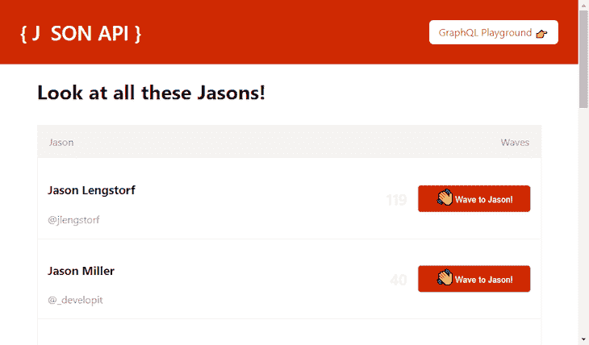

# 介绍 RE:JAMstack - LogRocket 博客

> 原文：<https://blog.logrocket.com/introducing-the-rejamstack/>

JAMstack 指的是用于创建某种类型网站的工具，它的受欢迎程度有了强劲的增长。事实上，它的受欢迎程度已经上升到现在有[整个会议](https://jamstackconf.com/)致力于这种方法的网站建设。

## 什么是 JAMstack？

**JAM** 首字母缩写代表 **J** avaScript、 **A** PIs、 **M** arkup。

JavaScript 是处理任何动态编程需求的编程语言。API 是那种你的网站通过互联网与之对话来完成各种各样的任务，从收集数据到发送电子邮件。标记通常指 HTML。

### JAMstack 是个坏名字！？

JAM 没有提到很多重要/激动人心的部分。JAMstack 的一个典型特征是没有服务器。

在构建步骤中，通常会预渲染 arkup。在你的网站被放到万维网上之前，有一个过程会把你的网站变成一堆静态文件。这些文件随后被托管在 CDN 上并提供给全世界。

对于你的站点被认为是一个 JAMstack 站点来说，这些都不是硬性要求。一个完全由完全填充的 HTML 页面组成的站点是非常 JAMstack-y 的，但是填充较少的 HTML 仍然是 JAMstack。

> JAMstack 是一种滑动秤。

更进一步，Chris Coyier 指出包含`<div id="root"></div>`和一些 JavaScript 的 HTML 文档也适合 JAMstack。

> 我会说“是的”。也许多一点 SSR 对所有的理由来说都是好的，但是不需要 jamstack 勋章。

与生活中的许多事情一样，关于什么是 JAMstack 站点的大多数问题的答案是“视情况而定”。同样的批评也适用于术语无服务器。这个词也…不太好。

顺便说一下，JAMstack 和 serverless 经常一起使用，就像花生酱和果冻一样。它们各自独立使用，但经常一起使用。更多信息请见下文。


在我列出一些优点和缺点之前，我想用一句“视情况而定”的话来描述它们。因为 JAMstack 非常灵活，所以对于您的特定用例，它们中的许多可能或多或少有些苛刻。

## 对等

#### 表演

你的网站变成了一堆静态文件。一旦浏览器收到这些文件，它们就会变成一个网站。浏览器擅长这个；这是他们的工作。

这些文件通常存放在 CDN 上。这意味着他们分布在世界各地，蓄势待发。如果你在比利时，访问一个由美国人创建的网站，请求和响应不需要穿越大西洋。

这些文件很有可能就在你身边。准备就绪的文件的组合，加上这些文件的邻近性，导致了更好的性能。

#### 安全性

JAMstack 通常不使用传统的服务器，所以你不需要担心不存在的东西的安全性。相反，使用 API 意味着大多数安全问题在于您所使用的 API 的创建者。

#### (缺乏)成本

如果你使用尽可能多的预渲染的 JAMstack 类型，并且在你的访问者的机器上做剩下的工作，那么托管是便宜的(甚至是免费的)。

#### 可量测性

与前一点紧密相关。如果托管归结为给访问者提供一组文件，那么伸缩就变得简单多了。通常，作为开发人员，你甚至不必关心这个:你把那些文件上传到 CDN，然后坐在那里，看着你的关于 CORBA 的网站一夜之间爆炸。

#### 开发者体验

因为 JAMstack 非常灵活，所以在选择想要使用的工具时有很大的自由度。最终，一个网站由 JavaScript、CSS、HTML 和媒体组成。如何到达那里取决于你自己。

#### 多得多…

由于许多 JAMstack 站点的静态性质，SEO 通常非常好。

* * *

### 更多来自 LogRocket 的精彩文章:

* * *

下降趋势

## 不全是(柯基)小狗和彩虹。如果对静态文件有如此高的重视，从定义上来说，这难道不会阻止动态内容/动态行为吗？

嗯，不一定。其中一种文件是 JavaScript 文件。果酱中的**A**pi 是为混合物添加一点活力的好方法。向静态托管的资产添加动态性的程度取决于您。

许多[静态站点生成器(SSG)](https://serverless.css-tricks.com/services/ssgs/)通过使用流行的框架为你处理动态行为部分。您可以用自己喜欢的框架来编写代码，静态生成器会将您的框架代码转换成完整的静态文件。

最重要的是，通过使用 JavaScript，一旦你在浏览器中打开这些文件，一个叫做水合的过程就发生了，很快:它就好像根本不是一个静态网站，而是一个完全成熟的框架网站。

React 的 Gatsby 和 Vue 的 [Gridsome](https://gridsome.org/) 是由框架支持的两个最受欢迎的 SSG。最近，[斯考利](https://github.com/scullyio/scully)以《棱角分明》中的 SSG 的身份加入了派对。王自如正在为苗条身材设计一款，巧妙地取名为 SSG。

当您对源文件进行更改时，必须重复生成静态文件。为整个站点重新生成这些文件所导致的长构建时间排除了许多大型站点的静态生成类型。

想象一下，如果在某处纠正了一个产品描述中的拼写错误后，整个 Amazon.com 都必须重建。增量构建是减少这种痛苦的一种方式。它仍然处于早期阶段，或者对于许多 SSG 来说还不可用。

克服不利因素

## 这就是无服务器的闪光点。因为没有传统的服务器，所以存在许多漏洞，可以通过添加一些无服务器功能来填补。

无服务器函数不是托管在一个位置。它们是对 JAM 的补充。他们*给*注入果酱。

🎵无服务器功能不想要一个停留的地方🎵
🎵他们今晚在地板上得到他们的战利品，让我开心一天🎵
🎵让我快乐，让我快乐，让我快乐，让我快乐🎵

> [https://www.youtube.com/embed/9EcjWd-O4jI?version=3&rel=1&showsearch=0&showinfo=1&iv_load_policy=1&fs=1&hl=en-US&autohide=2&wmode=transparent](https://www.youtube.com/embed/9EcjWd-O4jI?version=3&rel=1&showsearch=0&showinfo=1&iv_load_policy=1&fs=1&hl=en-US&autohide=2&wmode=transparent)
> 
> 视频

数据崩溃(头韵很有趣)

### 我想强调的一个具体难点是数据。考虑这两个选项:

您使用完全预先生成的数据

1.  当有人在客户端时间访问你的站点时，你获取数据
2.  对于第一种情况，数据就在那里，随时可以使用，但是当任何人查看它时，它可能已经过时了。

对于第二个，数据将是最新的，但是在获取数据的过程中，用户必须查看一个微调器。如果你付出一些额外的努力，他们可能不得不去看一个骨架状态。

两种结果都不理想。但是，如果您的数据完全是静态的，那么第一个选项显然是最佳选择；如果您正在处理(几乎)完全动态的数据，那么第二种方法更好。

双管齐下

### 如果只有一部分数据经常更改，而其余的数据保持静态，那么在构建和客户机运行时都请求更改可能是一个合适的解决方案。

当有人访问您的网站时，构建期间收集的数据已经在那里了。这就产生了一种流畅的体验，用户看到的不是屏幕上的圆圈，而是实际有用的数据。

当用户看到这些数据时，其中的一部分可能已经过时了(例如，这可以用灰色的数字来表示)。这就是为什么当您访问网站时，同样的数据会被再次请求。一旦更新的数据到达，它可能会与构建时收集的(可能是陈旧的)数据交换。

一个例子:JaSON API

### JaSON API 是我用来探索一些令人兴奋的 JAMstack 技术的一个玩笑网站。这是一个 Gatsby 站点，使用上述技术来获取数据。这些数据来自一个[无服务器的 GraphQL](https://nickymeuleman.netlify.com/blog/serverless-graphql/) 端点。

它列出了一些名为 Jason 的人，可选地显示他们的 Twitter 账号，并显示网站访问者点击按钮向他们“挥手”的次数。数据的前两部分很少改变(如果有的话),是静态生成的理想选择。然而，waves 的数量经常变化，应该在用户访问站点时获取。

当给定一组数据时，React 组件负责显示 Jasons 列表。

为了在构建期间获得`jasonArray`，从 GraphQL 端点收集数据。使用 [gatsby-source-graphql](https://www.gatsbyjs.org/packages/gatsby-source-graphql/) ，该查询如下所示:

```
<JasonList jasons={jasonArray} />
```

一旦有人访问主页，就会请求完全相同的数据。使用 [Apollo GraphQL](https://www.apollographql.com/) ，该查询如下所示:

```
export const GATSBY_QUERY = graphql`
  {
    JasonAPI {
      allJasons {
        id
        name
        twitter
        likes
      }
    }
  }
`;
```

请注意，这些查询的结果数据是完全相同的。这两个查询请求相同的数据，唯一的区别是何时请求数据。

```
const APOLLO_QUERY = gql`
  {
    allJasons {
      id
      name
      twitter
      likes
    }
  }
`;
```

但是要小心:客户机时收集的数据与构建时收集的数据不同，但只有一点点不同。否则，将构建数据(可能是陈旧的)交换为最新的客户端数据的体验可能会从流畅和爽快变成刺耳和华而不实。

在示例中，从 GraphQL 端点返回的数据总是以相同的顺序返回，唯一改变的是`likes`的数量。因为 React 很聪明，它只会更新 DOM 中发生变化的部分。

这是整个 Gatsby 页面组件，在构建过程中由`GATSBY_QUERY`收集的数据可以在`data` prop 上获得。客户端时由`APOLLO_QUERY`指定的数据收集由来自 [@apollo/react-hooks](https://www.apollographql.com/docs/react/api/react-hooks/) 的`useQuery`处理。

RE:JAMstack

```
const IndexPage = props => {
  const allBuildTimeJasons = props.data.JasonAPI.allJasons;
  const { loading, data: apolloData } = useQuery(APOLLO_QUERY);
  const allClientTimeJasons = apolloData.allJasons;
  return (
    <div>
      <h1>Look at all these Jasons!</h1>
      {loading ? (
        <JasonList grayOutWaveCount jasons={allBuildTimeJasons} />
      ) : (
        <JasonList jasons={allClientTimeJasons} />
      )}
    </div>
  );
};
```



While loading


After loading

## 我称之为 RE:JAMstack，代表实时增强的 jam stack(T2)。

这是用词不当！有点像每个正方形都是长方形，但不是每个长方形都是正方形。这种模式并不意味着 JAMstack 这个术语不再适用。

此外，我想激怒任何尖叫的人，“但那仍然是 JAMstack！”我很乐意抓住任何机会命名“新”堆栈，这似乎是一个热门趋势。

请停止命名堆栈。谢谢你

> Please stop naming stacks. Thank you

使用 [LogRocket](https://lp.logrocket.com/blg/signup) 消除传统错误报告的干扰

## [LogRocket](https://lp.logrocket.com/blg/signup) 是一个数字体验分析解决方案，它可以保护您免受数百个假阳性错误警报的影响，只针对几个真正重要的项目。LogRocket 会告诉您应用程序中实际影响用户的最具影响力的 bug 和 UX 问题。

[](https://lp.logrocket.com/blg/signup)

然后，使用具有深层技术遥测的会话重放来确切地查看用户看到了什么以及是什么导致了问题，就像你在他们身后看一样。

LogRocket 自动聚合客户端错误、JS 异常、前端性能指标和用户交互。然后 LogRocket 使用机器学习来告诉你哪些问题正在影响大多数用户，并提供你需要修复它的上下文。

关注重要的 bug—[今天就试试 LogRocket】。](https://lp.logrocket.com/blg/signup-issue-free)

Focus on the bugs that matter — [try LogRocket today](https://lp.logrocket.com/blg/signup-issue-free).