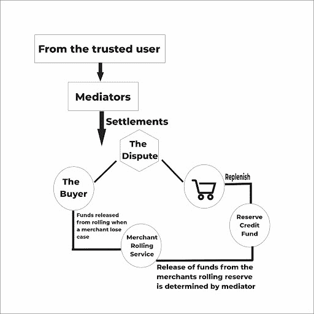
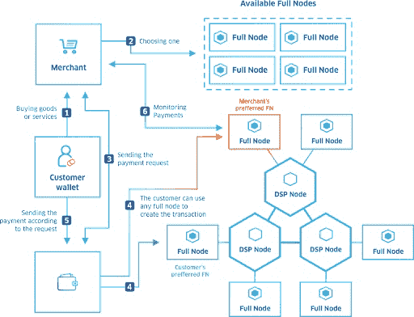

# COTI 和 Trustchain 简介

> 原文：<https://blog.logrocket.com/introduction-coti-trustchain/>

基于区块链的系统已经被开发出来，以通过寻求高销售额来解决开发者面临的许多成本相关问题。区块链网络支付系统面临的一些问题包括:

*   **安全问题**:不法分子利用加密货币购买非法设备。他们还要求加密货币作为赎金
*   **高能耗**:大部分区块链技术都需要你用电脑或者其他硬件设备来解决复杂的方程。因此，当你开始挖掘加密货币时，你的设备需要越来越多的能量来完成方程式
*   **法规**:这是在商业环境中实施区块链技术最困难的方面之一。许多企业有兴趣采用区块链技术来实现不同的交易，但由于区块链不受监管，组织无法对接受和处理数字货币的安全措施百分百有信心
*   **缺乏对区块链技术的广泛信任**:也许使用区块链技术的最大障碍是许多人，包括更广泛的开发者社区中的人，对加密货币和支持加密货币的区块链技术缺乏信任。[抽水转储骗局](https://www.cnet.com/personal-finance/crypto/cryptocurrency-pump-and-dump-schemes-what-you-should-know-about-these-scams/)和[闪贷攻击](https://www.coindesk.com/learn/2021/02/17/what-is-a-flash-loan/)不像法定货币，不会给这些骗局的受害者留下身份痕迹

除了缺乏公众信任之外，这也导致了在区块链私下交流的陌生人之间缺乏信任，从而导致大量的退货和销售取消。基于用户与特定企业的历史合作，而不是他们在交易时的意图，用户被不断地标记为“高威胁”或“低威胁”，这可能比之前的交互可能传达的上下文负载更少。

在这篇文章中，你将会更好地理解 COTI 和信任链是怎么回事，以及他们如何解决我们列出的这些问题。

## 什么是 COTI？

COTI 是互联网货币的首字母缩写，是一个分散的高性能加密货币生态系统，为创建数字支付网络和稳定的货币而优化。

COTI 的基础-子群协议是从一段时间内进行的交易中收集的有向、非循环、基于图的记录构建而成的。COTI 还构建了覆盖、捕捉和防御可能攻击的机制，提高了网络安全性。这项服务使用博弈论的思想，以确保在出现分歧的情况下公平的结果。

### COTI 与“传统的”区块链有什么不同？

COTI 是第一层区块链生态系统。与传统的区块链不同，COTI 不需要使用工作证明(PoW)或利益证明(PoS)来验证交易。它采用了一种被称为[信任证明(PoT)](https://coti.io/technology) 的独一无二的协议算法，这种算法将有向无环图(DAG)数据结构与 PoW 相结合——我们将在下面详细讨论这一点。

PoT 可以显著降低销售成本，提高 TPS 的性能。

隐私也是 COTI 的突出问题，因为数据保护是 COTI 的关键原则之一。交易不能追溯到特定的用户—每次销售都使用单向散列来执行多重寻址。用户必须履行[了解客户(KYC)](https://www.coindesk.com/learn/what-is-kyc-and-why-does-it-matter-for-crypto/#:~:text=KYC%20means%20%22know%20your%20customer,use%20to%20fight%20money%20laundering.) 义务，并遵循反洗钱流程，才能加入 COTI 生态系统。

## 什么是信任链？

信任链是 COTI 系统和产品的基础结构。COTI 结构的核心在于 Trustchain，这是一种基于机器读写能力的个人协议算法，它通过为交易分配信任分数并将其聚集在链中，大幅降低销售成本并提高回收速度。

如前所述，信任链位于[多向无环图(DAG)数据结构](https://en.wikipedia.org/wiki/Directed_acyclic_graph)上，这更像是一个图而不是区块链，并且协同工作以提高可扩展性。这项技术通过提供多个可以同时进行交易的节点来彻底改造加密挖掘和交易，这与区块链不同，后者的节点是按顺序构建和发布的。

## COTI 和信任链是如何运作的

COTI 是下一代支付选择，提供高销售额和低费用。像 IOTA，Nano 和 Obyte 这样的硬币——我们可以统称为 DAG 硬币——在 COTI 的 DAG 框架内工作。

### 基本子广播协议 DAG

COTI 提出了一种独特的、基于 DAG 的分布式计数系统作为其基础协议，该协议涉及在选择新的、未经确认的交易进行验证之前，使用信任分数来评估以前的交易。通过这种方式，交易建立在双方通过其先前交易的质量而建立的基础上。

基于 DAG 的分布式计数技术似乎在解决可扩展性挑战方面特别有效，这些挑战使得基于区块链的支付网络出现不足。尽管增加基于区块链的网络的容量对网络可用性有负面影响，但是关于基于 DAG 的网络的应用增加的讨论是真实的:它们确实提供了更好的网络可扩展性。

换句话说，活跃网络参与者的数量与交易被验证的速度之间存在正相关关系。因此，DAG 数据结构非常适合作为 COTI 的基础协议，因为它在网络运行和可扩展性之间具有正相关性。这使得网络可以实现完全去中心化，而不会危及 COTI 对可扩展性、实时性和低(或零)费用的承诺。

### 多天

COTI 的多 DAG 生态系统类似于以太坊。一个通用的分散结构作为许多不同智能合同的基础，并支持数字支付的一个主要硬币。COTI 创建了几个集群供 different 使用。

在 COTI 所有的图收集都是满疙瘩的责任。出于这个原因，充分颠簸必须产生数字支付交易的主要硬币，DAG，销售前附件。COTI 多 DAG 中的所有集群使用相同的识别和 KYC 过程，这创建了一个通用的友好的加密整体。

## COTI 的主要目标

让我们仔细看看 COTI 的一些主要目标。

### 低费用

信用卡网络通常对执行销售的各种固定和随机运费收费，当交易被确定为跨境或跨货币时，会评估新的成本。为了开发一个持续的和不可知的支付系统，销售费用应该保持在最低限度，并根据各方对网络的具体捐赠来征收。

### 可量测性

支付系统应该适当地提供快速支付选项，以便有效地适应典型的交易。虽然信用卡提供商提供快速汇款，但总部位于区块链的数字货币已经计划克服可扩展性问题，并在网络流量增加的情况下保持性能。

### 法规遵循

卡网络与中央银行和法律系统协同工作，并有严格的限制来确保符合反洗钱规范。由于数字货币通常是伪匿名的、不受审查的和不受约束的，所以遵守 COTI 商人和买家居住的所有当局的法律要求将是重要的，以便使数字的、特定于货币的、非监管的织物可用于广泛的消费者销售。

### 速度和一致性

比特币网络上的交易完成时间不仅缓慢，而且变化巨大。因为一笔比特币交易必须经过六次验证才能再次使用，所以完成一笔交易的过程平均需要 30 分钟到 16 个小时。同样的销售在 COTI 网络上可能需要大约不到 20 秒。

### 波动性和可替代性

接受比特币的商家要么高度暴露于汇率变动，要么产生额外支出以对冲比特币市场的波动。此外，当前的 stablecoins 在不合适的基础设施上运行，这降低了采用率，同时没有提供对波动性的真实响应。

* * *

### 更多来自 LogRocket 的精彩文章:

* * *

此外，先进的回溯技术可以将加密货币与非法行为历史联系起来，因为某些加密货币是非法的，这降低了它们被体面机构接受的程度。

### 不变

虽然不变性通常被认为是一种安全优势，但数字货币的最终性和不可持续性限制了该货币在常规支付场景中的效用。交易完成后不能进行任何更改，因此客户不能要求换货或换货，也不能退货。

### 创建分散的链上智能合同

COTI 正在为 DAG 引入分散的链上智能合同，这在同类产品中尚属首次。所有智能合同都记录在 COTI 多 DAG 集群中，并在确认之前由各种完整节点进行多次验证。

## COTI 的特征和结构

在这一节中，我们将探索 COTI 提供的优于其他区块链技术的特性，以及它的结构有何不同。

### 仲裁服务

COTI 提供随时可用的仲裁服务，允许用户对欺诈行为提起上诉，并在整个生态系统中分享对协议的争议判决。这项服务使用个人用户的滚动储备来支付隐性索赔，以及“全系统储备信贷基金(RCF)来担保它”，引用他们的白皮书。必要的 COTI 硬币和代币储备由个人信托用户评估和支持。

### COTI 一角硬币

COTI 一角硬币是 COTI 的稳定硬币，是 COTI 支付网络的核心，促进了消费者和商家之间的交易。COTI 硬币是一种建立在第一层协议之上的高性能加密货币。

在 COTI 的生态系统中，这种稳定币可以用作所有费用和赌注的常见支付形式。COTI 一角硬币价值 0.1 美元，可以在任何接受 COTI 支付的商户使用。

### COTI 交易结构

为了进行交易，从 COTI 钱包发送的交易需要信任分数，所以我们要做的第一件事是向信任分数节点发送请求。

一旦钱包有了信任分数，它就将它添加到交易中，并且交易移动到完整节点。然后，full 节点验证事务并选择要验证的源。最后，它使用优化的 DAG 结构执行 PoT 操作；如果成功，交易将记录在 DAG 网络中。

接下来，full 节点将交易发送到两个[双花费](https://en.wikipedia.org/wiki/Double-spending#:~:text=Prevention%20of%20double%2Dspending%20is,both%20availability%20and%20trust%20viewpoints.)防止(DSP)节点，以防止欺诈。一旦交易收到来自两个 DSP 节点的绿灯，它就被发送到整个 DSP 网络、信任分数网络和零花费服务器。同时具有 DSP 确认(DSPC)和信托确认(TC)的交易被视为已确认。

下图是 COTI 交易结构的图解说明。

Image source: [COTI’s Medium channel](https://medium.com/cotinetwork/everything-you-want-to-know-about-cotis-full-nodes-and-staking-model-425fce17f613)

## 了解信任链算法

COTI 的信任链算法是以这样一种方式构建的，即那些具有高信任分数的人比那些具有低信任分数的人获得更快的证据时间。这是可以预见的，因为个人在与他们不信任的商家或买家交易时会更加保守，因为他们希望在接受交易之前确保交易得到验证。

信任链通过在 DAG 之上建立信任子组来工作，DAG 还与排名媒介相结合来跟踪网络现实行为。

### 群集中交易的信任分数

信任分数是 COTI 网络的关键点，因为它们用于 effective 销售处理、威胁缓解和网络构建。信任分数通过专用和分散的信任分数凸起来计算。支付网络中的所有交易也有一个信任分数。

### 信任分数的用途

信任分数极大地改善了为信任链算法安排交易的过程，并提供了最佳的销售处理时间。它还提高了很大程度上受信任的买家和商家的表现，并对那些不太受信任的人提供了新的检查。

信任分数还定义了跟单商的滚动储备条件，确定图形情况，设置 PoW 情况(可以横向 affect 图形情况)，并设置裁判阈值。这有助于确定哪些网络参与者可以被选为法官并被纳入仲裁员人才库。

最后，节点信任分数帮助您定义网络拓扑和销售传播路径，同时优化节点工作负载。

[信任分数算法](https://medium.com/cotinetwork/introducing-cotis-global-trust-system-gts-an-advanced-layer-of-trust-for-any-blockchain-7e44587b8bda#id_token=eyJhbGciOiJSUzI1NiIsImtpZCI6IjU4YjQyOTY2MmRiMDc4NmYyZWZlZmUxM2MxZWIxMmEyOGRjNDQyZDAiLCJ0eXAiOiJKV1QifQ.eyJpc3MiOiJodHRwczovL2FjY291bnRzLmdvb2dsZS5jb20iLCJuYmYiOjE2NDg4NDI4NjIsImF1ZCI6IjIxNjI5NjAzNTgzNC1rMWs2cWUwNjBzMnRwMmEyamFtNGxqZGNtczAwc3R0Zy5hcHBzLmdvb2dsZXVzZXJjb250ZW50LmNvbSIsInN1YiI6IjExMDAwNjQ2NDc0NTc4ODYxODcwNCIsImVtYWlsIjoiZGF5dmVlZG8yMTlAZ21haWwuY29tIiwiZW1haWxfdmVyaWZpZWQiOnRydWUsImF6cCI6IjIxNjI5NjAzNTgzNC1rMWs2cWUwNjBzMnRwMmEyamFtNGxqZGNtczAwc3R0Zy5hcHBzLmdvb2dsZXVzZXJjb250ZW50LmNvbSIsIm5hbWUiOiJEYXZpZCBBZGV3YWxlIiwicGljdHVyZSI6Imh0dHBzOi8vbGgzLmdvb2dsZXVzZXJjb250ZW50LmNvbS9hLS9BT2gxNEdqNzFtc05Qd3RoZGhraEQzOE1oWGR3MENoYWluckhSMjUwR0pfUldnPXM5Ni1jIiwiZ2l2ZW5fbmFtZSI6IkRhdmlkIiwiZmFtaWx5X25hbWUiOiJBZGV3YWxlIiwiaWF0IjoxNjQ4ODQzMTYyLCJleHAiOjE2NDg4NDY3NjIsImp0aSI6Ijk3Nzc2NjNkY2FkMmUzMmQ5MzcwZTZhMDRiY2VkM2M3Njk4YmRkYjQifQ.jTL1so5d69huo2CeQQGFUFpghr2Vv205fwFydMxEVe8eSCbXSpJZVZXcV6OyaB6BjNNK-RnitPi8PTqiTeR0G1ocUaURwJQgQHoapkB4knVCFd1MczLnjXS2_8f-t_yNwJgmx8nWM7NtHFqkaOm6tHWFmzRoNwfPDB07hpf3F4-kgUOaLCjEzZRaidU0uCobQY-t15lgGUp6qyA8SxlgyLUCdVIuPbrYanW2ZR_uJB33p2Dtk6u-xdTDvsfYbwmbpntkyHKHdSoBrGlgxl7KS4skQ9GWbIM-U6AbNrxpp3qkMQCIr2T53-Vg63H5-1dGK3Me6XAgTyjekCXoC2Xgmg)被设计成确保基于信任分数的源选择算法的最低性能。

### 源选择算法

信任分数算法选择两个具有查询度的交易。最终要做的是建立一个依赖于销售发送者信任分数的聚类。在一个聚类中，每一笔交易都与另外两笔交易相关联，每笔交易都有自己的信任分数。

### 交易过程

输入新销售时，将执行以下步骤:

*   **地址确认**:检查每笔基础销售
*   **余额检查**:检查每个地址的钱包余额，以确保他们有足够的资金参与交换
*   **预平衡检查**:这确保防止从同一个分类账重复支出
*   **源选择、确认和连接**:采取这些步骤是为了确保双方都连接到原始 DAG 和完整节点

在销售经过本地验证、测试并附加到一个完整的结之后，它会传播到其他 bumps，并得到信任链和 DSP 的一致认可。

进入销售后，其他凸块不会对销售进行任何 PoW 处理或其他厚度验证。根据来源选择算法，当其他颠簸附加新的交易时，销售被检查。

如果没有通过这些检查，销售将被拒绝。由同一种子发起或由同一完整节点创建的其他交易不能批准交易。

### 信任链协议

信任链算法利用信任来更快地验证和确认交易。信任链随着新交易与两个具有相似信任度的前交易相联系而扩展。结果，创建了新的基于协议的证据媒介，其中由于与具有高信任度(即，快速证据时间)相关联的益处，每个用户被激励在参与信任结构时具有高信任度。

## 结论

COTI 的目的是让用户能够像在互联网上传输信息一样自由地转移价值，而 COTI 使用 DAG 结构比传统的区块链更节能。

任何需要高吞吐量和可靠性的市场都可以使用信任链协议。因此，COTI 具有得天独厚的优势，可以为需要大规模可扩展性的行业提供所有必要的基础设施，以及处理争议、欺诈(如重复支付)和错误的仲裁机制。

## 加入像 Bitso 和 Coinsquare 这样的组织，他们使用 LogRocket 主动监控他们的 Web3 应用

影响用户在您的应用中激活和交易的能力的客户端问题会极大地影响您的底线。如果您对监控 UX 问题、自动显示 JavaScript 错误、跟踪缓慢的网络请求和组件加载时间感兴趣，

[try LogRocket](https://lp.logrocket.com/blg/web3-signup)

.

[https://logrocket.com/signup/](https://lp.logrocket.com/blg/web3-signup)

LogRocket 就像是网络和移动应用的 DVR，记录你的网络应用或网站上发生的一切。您可以汇总和报告关键的前端性能指标，重放用户会话和应用程序状态，记录网络请求，并自动显示所有错误，而不是猜测问题发生的原因。

现代化您调试 web 和移动应用的方式— [开始免费监控](https://lp.logrocket.com/blg/web3-signup)。