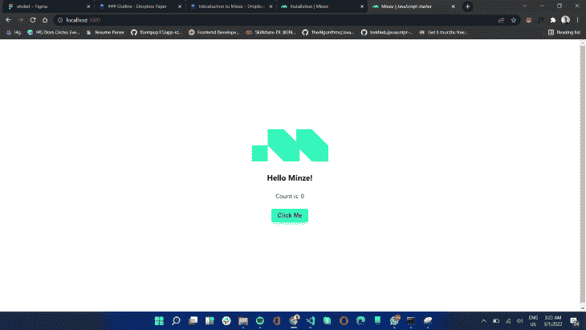
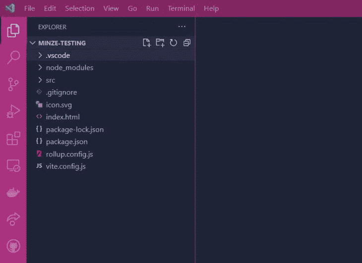
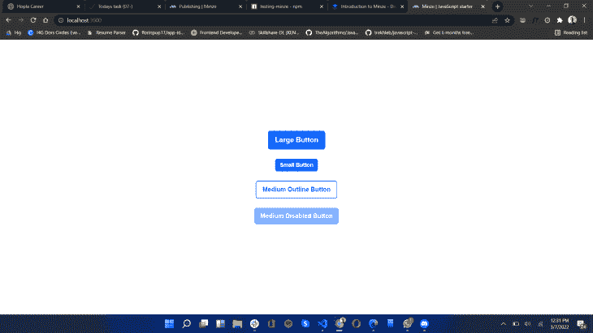

# Minze - LogRocket 博客简介

> 原文：<https://blog.logrocket.com/introduction-minze/>

随着 JavaScript 生态系统中引入了大量的新框架，一个问题出现了，团队现在需要他们的代码库来支持几个不同的框架，同时处理一个项目。这增加了他们要做的工作量，因为这要求开发人员用不同的框架语法编写相同的组件。

[敏泽](https://minze.dev/)就是为了减少这种压力而发明的。使用 Minze，您可以编写一个在任何地方都是本地的组件。如果你的团队正在使用 React、Vue 和 HTML，Minze 允许你的组件在所有这些组件中本地运行。

在本文中，我们将了解 Minze，并通过构建一个可以在大多数流行的 JavaScript 框架中本机工作的示例按钮组件，来了解如何在您的下一个项目中开始使用这个美妙的新框架。

## 先决条件

为了完成本教程，您应该具备以下条件:

*   JavaScript 的工作知识
*   安装在您电脑上的 Node.js
*   终端(CMD 或您选择的任何其他终端)
*   文本编辑器(Visual Studio 代码或您喜欢的任何其他代码)

## 敏泽是什么？

根据他们的网站，Minze 是一个“非常简单的本地 web 组件框架”它是构建跨框架组件库或设计系统的现代工具。主要目标是在没有框架障碍的情况下提高代码的可重用性，这在过去是 JavaScript 开发人员的一个大问题。

就拿[蚂蚁设计](https://blog.logrocket.com/introduction-to-ant-design/)来说吧，这是 React 的一个设计系统。如果一个团队想要使用 Ant Design 和 Vue，那么开发人员将不得不重新编写代码库来支持 Vue 语法。这就是为什么许多组件库或设计系统决定坚持只使用一个框架，除非他们有大量的开发人员在这个项目上工作，或者它是开源的，有一个强大的贡献者社区。

Minze 让我们能够创建一个可共享的组件，只需定义一次，就可以在任何地方使用。这些组件被压缩成很小的文件大小，以便于使用。

## 如何用 Minze 构造组件

每个 JavaScript 框架都有特定的组件结构可以遵循，Minze 也不例外。

您可以通过下面的代码看到 Minze 是如何构造组件的:

```
import { MinzeElement } from 'minze'
export class ComponentName extends MinzeElement {
  //attribute and method declaration section

  //html section
  html = () => `

  `

  css = () => `

  `
}

```

Minz 组件结构分为三个部分:声明部分、HTML 部分和 CSS 部分。声明部分是管理数据的地方。它可能以变量声明或方法声明的形式出现。HTML 部分显示了组件的视觉结构，而 CSS 部分添加了样式以使其更具代表性。

## 用 Minze 定义数据

Minze 有多种定义数据的方式。每种方式都有自己的用途，但是所有形式的数据最终都可以以属性的形式被组件访问。

### `this`

`this`是访问组件中已定义的方法或属性所必需的。`This`指组件本身。

让我们看看这个代码示例来理解:

```
import Minze, { MinzeElement } from 'minze'

const count = "two"

class Element extends MinzeElement {
  count = 'three'

  onReady() {
    console.log(
      count, // two
      this.count// three
    )
  }
}

Minze.defineAll([Element])

```

查看上面的代码，在组件外部声明的常量充当全局变量，而在组件内部声明的属性充当可以在组件内部访问的局部变量。

### 性能

特性是非反应性数据，或者是添加到组件中的特性。它们充当不接受动态变化的组件变量。

下面的代码演示了属性的工作方式:

```
import Minze, { MinzeElement } from 'minze'

class Element extends MinzeElement {
  greet = 'Hello World!'

  onReady() {
    console.log(this.greet) // Hello World!
  }
}

Minze.defineAll([Element])

```

上面的语法显示了如何通过`this`方法声明和使用一个属性，以将其与其父元素分类。

### 反应性质

反应式属性是一种接受更改的属性类型，尽管属性的每次更改都会触发组件重新呈现，但它是以包含一个或多个字符串或元组的数组形式声明的。下面的代码语法解释了如何声明反应性属性:

```
import Minze, { MinzeElement } from 'minze'

class Element extends MinzeElement {
  reactive = [
    'time',
    ['name', 'Emmanuel Yusuf'],
    ['favNum', 6]
  ]

  onReady() {
    console.log(
      this.time, // null
      this.name, // Emmanuel Yusuf
      this.favNum // 6
    )
  }
}

Minze.defineAll([Element])

```

请注意，仅用一个字符串声明一个反应性属性会给该属性一个没有附加值的名称。将它添加到具有两个值的元组中会使第一个值成为名称，第二个值成为分配给它的值。

### 属性特性

特性属性是动态的、反应性的属性，允许在声明组件时添加属性值。您可能会注意到，这与 React 中的 props 非常相似。

特性属性使用与反应性属性相同的语法，只是在调用组件时，如果指定了属性值，则属性值可以被覆盖。

## Minze 入门

在这一节中，我们将学习如何建立我们的第一个 Minze 项目。

首先，打开您的终端并运行以下命令:

```
npm i -g minze

```

这个命令将全局安装 Minze。

接下来，运行以下命令来搭建一个新项目:

```
npm init [email protected]

```

运行上面的命令将向您展示一个使用 JavaScript 或 TypeScript 的模板。选择一个你想使用的。

选择后，它将建立整个项目如下:


现在，按照响应中列出的命令进行操作:

```
cd minze-testing

```

这将带你到项目目录。注意`minze-testing`只是我在这个例子中使用的名字，但是你可以随意命名。

接下来，运行:

```
npm install

```

最后:

```
npm run dev

```

成功编译后，您将看到一个响应，告诉您转到 localhost:3000(或用于运行项目的端口)。端口应显示以下内容:



我们已经成功地与敏泽建立了我们的第一个项目！接下来，我们来看看项目结构。

## Minze 应用程序中的文件结构

下面，你可以看到我们刚刚设置的 Minze 应用程序中的文件结构:



你可以看到我们有一个`vite.config`文件，因为 Minze 使用 [Vite](https://blog.logrocket.com/whats-new-in-vite-2-0/) 作为它的构建工具来帮助改善前端体验。我们还有一个`[rollup.config](https://blog.logrocket.com/benchmarking-bundlers-2020-rollup-parcel-webpack/)`文件，它被用作模块捆绑器，将一小段代码编译成更大更复杂的代码。

`src`文件夹包含`assets`和`lib`文件夹。`Assets`包含程序运行所需的外部资产，而`libs`文件夹包含将要创建的组件。

src 文件夹还包括`module.js`文件，项目中创建的所有组件都将被导出到该文件中。`Template.js`是项目启动时渲染的内容。

最后，`vite.js`文件作为主入口点，在这里模板文件被分配给应用程序 ID。

## 用 Minze 创建动态按钮组件

首先，我们需要设置一些 CSS 变量来帮助在整个项目中声明一致的样式。

打开`assets`文件夹中的`vite.css`，添加以下代码:

```
:root {
  --primary-default: #0B5FFF;
  --primary-hover: #0053F0;
  --primary-active: #004AD7;
  --primary-disabled: rgba(11, 95, 255, 0.5);
  --white: #ffffff;
  --padding-y-sm: .5rem;
  --padding-x-sm: .75rem;
  --padding-y-md: .75rem;
  --padding-x-md: 1rem;
  --padding-y-lg: .875rem;
  --padding-x-lg: 1.125rem;
  --border-radius: .4rem;
  --font-size-sm: .875rem;
  --font-size-md: 1rem;
  --font-size-lg: 1.125rem;
}

```

上面的代码包含我们将用于组件的颜色、填充、边框半径和字体大小。

为了创建动态按钮组件，我们需要删除`lib`文件夹中除了`minze-button.js`和`minze-counter.js`之外的所有组件。

现在，打开`minze-button.js`，用下面的代码替换内容:

```
import { MinzeElement } from 'minze'

export class MinzeButton extends MinzeElement {
  html = () => `
    <button class="button">
      <slot></slot>
    </button>
  `
}

```

在上面的代码中，我们通过扩展`MinzeElement`类来创建一个按钮组件。按照 Minze 组件结构，我们然后创建服务于按钮的 HTML。这个 HTML 添加了一个 slot，使按钮能够向按钮组件添加子元素。

为了使按钮动态，我们将添加一些变化给用户一些选择。为此，我们将向组件添加一些属性，以便接受基于用户需求的值，例如按钮大小或按钮类型。

您可以使用添加到 HTML 部分上方的以下代码来实现这一点:

```
attrs = [
  ['size', 'small'],
  ['outline', false],
  ['disabled', false],
]

```

查看上面的代码，我们正在向组件添加值为`size`、`outline`和`disabled`的属性。每个属性都有一个默认值，以防在调用组件时没有声明它。

这样，我们可以继续添加按钮的样式。使用以下代码将 CSS 添加到组件中:

```
css = () => `
    .button {
      background: ${this.outline ? 'none' : this.disabled ? 'var(--primary-disabled)' : 'var(--primary-default)'};
      color: ${this.outline ? 'var(--primary-default)' : 'var(--white)'};
      font-size: ${this.size === 'small' ? 'var(--font-size-sm)' : this.size === 'medium' ? 'var(--font-size-md)' : 'var(--font-size-lg)'};
      font-weight: 600;
      border: ${this.outline ? '2px solid var(--primary-default)' : 'none'};
      border-radius: var(--border-radius);
      padding: ${this.size === 'small' ? 'var(--padding-y-sm) var(--padding-x-sm)' : this.size === 'medium' ? 'var(--padding-y-md) var(--padding-x-md)' : 'var(--padding-y-lg) var(--padding-x-lg)'}; 
      cursor: pointer;
      transition: background 0.3s ease-in-out;
    }
    .button:hover {
      background: ${this.outline ? 'none' : this.disabled ? 'var(--primary-disabled)' : 'var(--primary-default)'};
      color: ${this.outline ? 'var(--primary-default)' : 'var(--white)'};
      boder-color: ${this.outline ? 'var(--primary-active)' : 'none'};
    }
  `

```

在上面的代码中，我们添加了针对按钮样式和悬停状态的 CSS。我们使用[三元运算符](https://developer.mozilla.org/en-US/docs/Web/JavaScript/Reference/Operators/Conditional_Operator)调用属性，根据分配给每个属性的值添加动态样式。

要查看自项目开始以来我们所做的工作，打开`minze-counter.js`文件并粘贴以下代码:

```
import { MinzeElement } from 'minze'
export class MinzeCounter extends MinzeElement {
  html = () => `
    <minze-button size="large">
      Large Button
    </minze-button>
    <minze-button size="small">
      Small Button
    </minze-button>
    <minze-button size="medium" outline=true>
      Medium Outline Button
    </minze-button>
    <minze-button size="medium" disabled=true>
      Medium Disabled Button
    </minze-button>
  `
  css = () => `
    :host {
      width: 100%;
      min-height: calc(100vh - 2rem);
      display: flex;
      flex-direction: column;
      justify-content: center;
      align-items: center;
      gap: 1.5rem;
      padding: 40px;
    }
  `
}

```

上面的代码为`MinzeButton`创建了一个组件。查看代码，您会看到用不同的属性调用了`Button`组件，以便检查可供用户探索的不同变量。

在 CSS 中，我们使用`:host`来定位整个组件，我们给出 100%的宽度和 100 VH–2 rem 的高度。

我们的最终产品应该是这样的:



## 结论

希望在本文结束时，您能够用 Minze 创建一个动态按钮组件。您应该能够在所有框架中使用该组件，包括 React、Vue、Svelte、常规 HTML 等等。

这个解决方案将有助于减轻开发人员在将组件从一种框架语法转换成另一种语法时必须经历的压力。你可以在我的 GitHub 上查看这个项目的代码。

## 使用 [LogRocket](https://lp.logrocket.com/blg/signup) 消除传统错误报告的干扰

[](https://lp.logrocket.com/blg/signup)

[LogRocket](https://lp.logrocket.com/blg/signup) 是一个数字体验分析解决方案，它可以保护您免受数百个假阳性错误警报的影响，只针对几个真正重要的项目。LogRocket 会告诉您应用程序中实际影响用户的最具影响力的 bug 和 UX 问题。

然后，使用具有深层技术遥测功能的 session replay，准确查看用户看到了什么以及是什么导致了问题，就好像您在从他们的角度进行观察一样。

LogRocket 自动聚合客户端错误、JS 异常、前端性能指标和用户交互。然后 LogRocket 使用机器学习来告诉你哪些问题正在影响大多数用户，并提供你需要修复它的上下文。

关注重要的 bug—[今天就试试 LogRocket】。](https://lp.logrocket.com/blg/signup-issue-free)