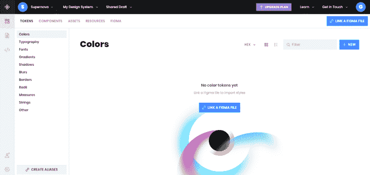
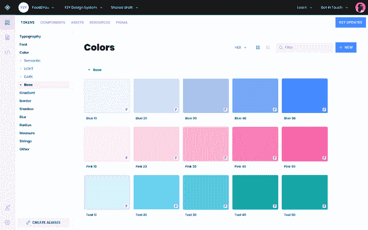

# Supernova 简介:Flutter web 应用程序的设计系统

> 原文：<https://blog.logrocket.com/introduction-supernova-design-system-flutter-web-apps/>

开源的 Android 和 iOS 应用开发框架 Flutter 由谷歌创建，Flutter 的首个稳定版本于 2018 年 12 月发布。

Flutter 是一个开源项目，旨在实现快速、简单的编程，具有类似本机的性能。另外，为了替代 JavaScript，Flutter 使用了 Dart。

现在，Flutter for web 已经发布并且稳定。这对于网页设计师来说是一个好消息，他们现在可以构建高度安全和有吸引力的网站，此外还可以使用相同的代码库将 Flutter 移动应用发布到网络上。

除此之外，Flutter 是一个动态用户界面元素的设计框架——其用户界面的丰富性和交互性使其适合在线应用。

## 超新星简介

Flutter 在 2019 年推出了一项早期采用者计划，用于准备使用 Flutter 平台提供的网络功能进行创建的企业。Flutter 引起了早期采用者之一的注意，而 [Supernova](https://www.supernova.io/) 想用它来创建一个网络协作设计系统平台。

### 设计系统

测试代码和选择具有基本功能的吸引人的设计是一项协作工作。

设计师使用鲜艳的颜色、图案和基本工具制作工具和组件设计。无数次升级最终揭晓最终结局。因此，设计系统在不断发展。

许多设计现在都与许多平台上的顶级软件兼容。这些设计需要端到端加密。

各种组件和工具有助于产品的创造和发展，因此设计人员总是在完善策略，使安全加密易于使用。

### 哲学和积木

Supernova 可让您快速轻松地获得任何导出设计中任何设计系统的全面、有组织的信息。

在[模型中描述了单个主动设计系统，用于访问数据设计系统](https://developers.supernova.io/design-system-data#accessing-the-data)。这意味着您可以运行导出器并生成一组输出，然后打开另一个设计系统并生成一组完全不同的输出——所有这些仍然使用同一个导出器。

您可以通过预定义的功能访问设计系统中的数据，这些功能消除了与数据下载和解析相关的任何复杂性。

在撰写本文时，可以获得以下模型。此外，每个类别都有一个获取设计系统数据的综合策略列表:

*   设计令牌:底层对象，是`Color`、`Font`、`Gradient`、`Shadow`、`Border`、`Measure`、`Typography`、`Text`等对象类型的基础
*   令牌组:由`colors`、`fonts`、`gradients`或任何此类设计令牌组成的逻辑组。每个令牌组始终只持有一个相应的令牌
*   设计系统:保存一个特定设计系统的元数据的对象
*   设计系统版本:每个设计系统由一个或多个版本组成，当您运行特定的导出器时，您总是以一个版本为目标。version 对象允许您访问特定版本的元信息；比如它的语义标签、名称，甚至完整的发行说明

## 超新星是如何工作的

超新星的设计基于两个基本原则:个人编码和定制设计。

两个团队都是不同的，独立运作。以下是对超新星系统工作原理的解释:

### 产品团队

这个团队使用 Figma 的设计方法创造出引人注目的元素。Figma 设计工具结合了所有的设计风格。

生成的设计是一个独特的编码转换器。该过程是安全的、加密的，并且不能被复制。他们通过增加自动化选项来升级设计。

数据会自动更新和同步。该系统旨在使用钩子自动更新新版本。个别代码用于导出设计令牌。它避免了缺陷，并为许多设计平台提供了输出程序。

不同自动化引擎的风格、资产和设计由独特的代码管理。

### 设计组

现在代码完成了，设计阶段开始了。Supernova 设计系统文档使用许多工具和组件制作和破坏设计。

像代码一样，设计是抽象的。supernova 配色方案使用独特而生动的色调。

* * *

### 更多来自 LogRocket 的精彩文章:

* * *

## 关键特征

由于 Supernova 的设计系统，每个部门都可以使用自己的技术。为了给每个团队提供发挥创造力和使用全方位技术的机会，它将整个开发整合在一个界面上。

让我们来看看这两个团队之间的一些差异:

### 特定于设计者

*   通过它的同步，与 Figma 的集成可以保持标记、字体和样式的设计
*   令牌引用包含许多不同的令牌，每个令牌都有单独的名称和用途
*   用于令牌传输的自动化技术结合差分技术允许令牌的导入和再导入
*   进口时间正在改变；设计工具扩展更改了导入和重新导入操作的时间
*   字体定制包括来自 Google 字体的可变标记、来自 Figma 的标记、测试标记和度量符号，以及非设计的时间标记

### 特定于开发人员

*   系统指定将用于将设计数据转换成代码的代码生成过程
*   有效的代码集成确保每个设计元素都有自己的一套编码基础
*   为不同平台分发大量代码库；多平台的编码技能是可能的
*   Pulsar 为各种编程语言及其模板提供了特殊的导出器包
*   Supernova Flutter exporter 是一个样式和词典专家，它从设计系统中发送数据，具有可变的样式和词典设置

### 特定于维护者

*   使用团队管理来管理团队角色和职责很简单
*   版本控制是为文档的每个修改版本建立快照和新版本的过程
*   观看或访问设计系统是免费的，因为观众是无限的
*   创建发行说明包括更新关于设计系统的信息，以及通过使用创造性的发行说明来更新信息

## Supernova 如何与 Flutter Web 配合使用？

根据用户反馈，基于 web 的 Supernova 版本被开发出来，以响应用户对 MacOS 替代品的需求。

因此，该团队对 Flutter 很感兴趣，因为它允许他们使用单个代码库在多个平台上部署他们的工具——特别是考虑到他们的工具比绝大多数网站更计算密集型，并且有更严格的性能要求。

Flutter 提供了一种直接的方法来访问底层渲染引擎，而不是从 WebGL 开始，然后从那里开始。

### 超新星如何帮助颤动网络

使用 Dart 的 web 专用库节省了他们的时间，因为代码预览小部件不能包含在 HTML 中；开发人员必须使用 JavaScript 库来突出语法。

超新星完全是用旋舞和飞镖写成的。由于应用程序的复杂逻辑，显示层是在 Flutter 中开发的。开发人员意识到 Dart 的语言对于设计和维护复杂的程序至关重要。随着时间的推移，Dart 的注释处理和代码生成能力得到了很大提高。

Figma 数据模型是使用 Flutter 的 CanvasKit 引擎渲染的。该团队选择了 CanvasKit，而不是在 Flutter 中构建自定义 WebGL 着色器。CanvasKit 的高级渲染功能允许翻译 Figma 的非标准矢量模型。Supernova 可以处理设计师选择的任何字体，这一点至关重要。Flutter 和 Google Fonts 包都可以直接从 Google 的服务器上下载字体。

### 超新星适应颤振网的结果

经过两年的早期访问，Supernova 推出了一个新的设计系统平台，该平台利用了 Flutter 框架。

Supernova 现在允许您导入所有 Figma 作品，并利用它们来创建 Flutter 脚本(或任何其他框架)。

通过使用 Supernova 文档编辑器中的自动化引擎，您可以编写随着设计的变化而自动更新的文档。

## 超新星建筑

每个人现在都可以利用超新星。要开始，请访问 [Supernova 网站](https://www.supernova.io/)并创建一个帐户，同时提供一个到您的 Figma 设计文件的链接。

那么，可以说，从那时起，整个世界都是你的了。您可以立即开始导出 Flutter(或任何其他框架)的代码，或者您可以获得图标的资产，以便您可以开始创作文档。

### 演示项目

是时候亲身体验 Supernova 了。注册完成后，请继续下面的步骤，提供您和您的企业的信息。

完成后，您将看到如下所示的 Supernova 仪表盘。

您可以使用右上角可见的新按钮创建一个新的`color token`，或者使用中间的按钮链接您现有的 Figma 文件。

为了本文的简洁，这个演示项目链接了 Figma 文件，现在可以进行修改了，如下所示:

Figma 文件导入后，将作为设计系统的源添加(链接)。不需要再次添加它，而是可以从文件中获取更新。

Supernova 会定期自动检查 Figma 文件的修改情况。如果您在 Figma 中进行了更新并希望立即检查更改，或者如果您的 Figma 文件更新模式设置为手动，也可以按需获得更新。

标记(键/值对)是 Supernova 中设计系统的风格特征——使用您的设计系统的代码库和项目可能会使用它们。

在传统的名称和值字段之上，每个令牌都有一个可选的描述字段。超新星令牌的价值因其用途而异。带有颜色、渐变和阴影等样式参数的标记可以导入到您的设计编辑器中；所有其他令牌必须手动创建。

要编辑 Supernova 令牌:

*   打开令牌菜单，点击**编辑**
*   编辑令牌名称、描述或值
*   点击**确认**保存

此外，要定义或编辑令牌的自定义属性，请执行以下步骤:

*   在您的设计系统中，导航至**设计系统设置**，然后导航至**属性**
*   点击**新建**创建新属性，或者**编辑**属性的*名称*或者*默认值*
*   点击**保存(或 **x** 取消)**

 **### 利用 Flutter 导出器

设计系统数据可以通过导出器转换成生产代码(例如，相当于 npm 包)。

它生成的代码以及它所针对的平台、技术和栈使得每个导出器包都是独一无二的。通过使用由 [Pulsar](https://developers.supernova.io/pulsar-language) 驱动的模板，您可以修改生成的代码以满足您的需求。Pulsar 就像 Handlebars 和 Mustache 一样，是一种熟悉的模板语言。

构建自己的导出器时，默认情况下它们是私有的，如果您觉得对其他开发人员有用，以后可以选择将导出器发布到市场。

要使用导出器，您必须首先在您的工作区中安装一个导出器。然后，导出器将对工作区的所有团队成员可用。您可以通过两种方式安装导出器:

*   从导出器存储安装现有的导出器
*   链接包含导出器包的 GitHub 存储库

(注:此处提供了此过程的分步指南

一旦安装了导出器，您需要[安装](https://learn.supernova.io/latest/code-integration/exporters/using-exporters.html)一个 VS 代码扩展来使用 Supernova，以便从它生成您的构建——构建是指向具有特定版本的特定设计系统的导出器。

建议使用 VS 代码扩展来运行导出器和检索生产代码。

在配置默认的项目导出器之前，确保您的 VS 代码扩展中至少安装了一个导出器。默认的导出器可以在 Supernova 面板中定制，它可以在左下角找到。

要更改 VS 代码中的默认导出器，选择**配置默认导出器**并提供以下数据:

*   工作区:您选择的设计系统将被托管的位置
*   设计系统:你希望出口商关注的设计系统
*   版本:设计系统的当前版本。使用共享草稿，您将始终拥有最新的信息
*   导出者:您希望用于此项目的导出者

作为最后一步，将请求一个应该写入代码的目录。

当您设置默认导出器时，一个名为`supernova.json`的新文件将出现在工作空间的根文件夹中。导出器配置包含在这个文件中，它由 VS 代码扩展占用。

强烈建议您将此文件保存在源代码管理中，以便您的所有团队成员可以随时访问设计系统的数据，无论他们处于开发过程的哪个阶段。

设置默认导出器后，用于启动配置活动的按钮现在会显示**同步当前代码库**。要请求新的生产就绪代码，只需点击此按钮。导出器将下载当前的设计系统数据，并将代码生成到您指定的文件夹中。这下方便了！

导出器由一种叫做 Pulsar 的超新星模板语言驱动。Pulsar 允许您精确定义输出的外观，精确到最后一个字符。因此，从这里开始，你可能想[探索更多关于脉冲星语言的](https://developers.supernova.io/pulsar-language)。

## 结论

技术总是在发展。每种设计都针对安全性和编码能力进行了加密，利用定制的代码和框架强调独特、创新和技术复杂的数据呈现，这些方面融合了技术专长、艺术天赋和安全性。

为了在早期阶段对 Supernova 的安全性、选择和性能进行微调，他们只能有限地使用系统的一小部分功能。

然而，随着 Supernova 的发展，您将能够接触到广泛的设计系统方面。你可以在 Discord [这里](https://discord.com/invite/9Au3xFTG7x/)加入超新星社区。

使用 Supernova 时，您的团队不再需要在工具之间转换或管理独特的程序和界面。一切都可以以与您现在的运营方式一致的方式实现自动化。

## 使用 [LogRocket](https://lp.logrocket.com/blg/signup) 消除传统错误报告的干扰

[LogRocket](https://lp.logrocket.com/blg/signup) 是一个数字体验分析解决方案，它可以保护您免受数百个假阳性错误警报的影响，只针对几个真正重要的项目。LogRocket 会告诉您应用程序中实际影响用户的最具影响力的 bug 和 UX 问题。

然后，使用具有深层技术遥测的会话重放来确切地查看用户看到了什么以及是什么导致了问题，就像你在他们身后看一样。

LogRocket 自动聚合客户端错误、JS 异常、前端性能指标和用户交互。然后 LogRocket 使用机器学习来告诉你哪些问题正在影响大多数用户，并提供你需要修复它的上下文。

关注重要的 bug—[今天就试试 LogRocket】。](https://lp.logrocket.com/blg/signup-issue-free)**