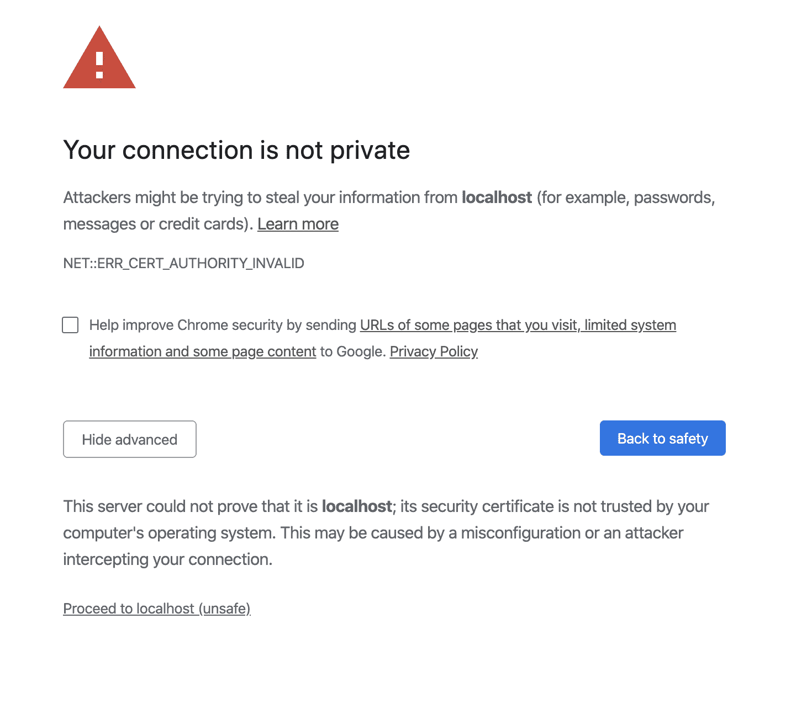
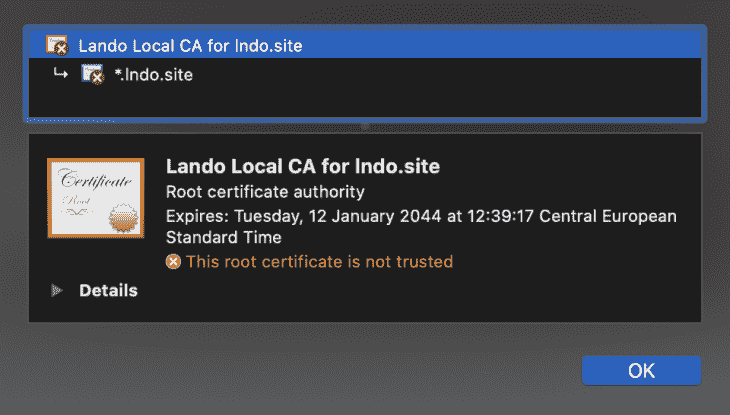

# Lando - LogRocket 博客简介

> 原文：<https://blog.logrocket.com/introduction-to-lando/>

## 兰多是什么？

Lando 将是你开发、运行和自动化项目的助手。可以把它看作是开发环境的一个抽象层，它在所有主要的操作系统中都是标准化的，比如 MacOS、Windows 和 Linux。请注意，Lando 团队不鼓励也不支持在生产中使用 Lando，因为它的主要目的是模拟本地的生产环境。

通过使用 Lando，任何开发人员都可以在代码库中设置应用程序运行所需的服务、工具和配置。一旦设置好了，所有团队成员要做的就是打开存储库，运行`lando start`，在一个隔离的开发环境中开始项目工作，而不用担心他们的开发环境中的不一致性。

## Lando 是如何工作的，我们为什么要使用它？

现在，你可能已经意识到我们上面描述的与 [Docker](https://www.docker.com/) 及其相关服务有很多相似之处。你可能会问自己:

*   他们谈论的 Lando 设置配置与`[docker compose](https://docs.docker.com/compose/)`非常相似，对吗？
*   孤立的开发环境看起来和`[docker containers](https://www.docker.com/resources/what-container)`很像，是不是这样？

这两种情况你都是对的。但是，既然如此，当我们有`docker compose`和`docker containers`的时候，为什么我们的项目还需要兰多呢？

通过使用 Lando:

*   我们可以通过使用预定义的[配方](https://docs.lando.dev/config/recipes.html#recipes)来访问定义 Docker 容器的更简化的过程
*   即使我们需要的`docker container`环境不被 Lando 方法支持，我们也有一个更简单的定义容器的过程，通过定义一个 [Lando 服务](https://docs.lando.dev/config/services.html#services)，与`docker compose`相比，它只公开必要的配置。这可以帮助我们摆脱设置`[Dockerfiles](https://docs.docker.com/engine/reference/builder/)`和必须键入长`[docker exec](https://docs.docker.com/engine/reference/commandline/exec/)`命令
*   如果我们仍然需要自己的定制`docker compose`文件来定义开发环境，我们可以用它们来代替 Lando 的配方和服务，同时获得一些额外的好处，比如[本地开发网络](https://docs.lando.dev/config/networking.html#automatic-hostnames)
*   除此之外，我们还获得了很多好处，比如每个容器的 SSL 处理、为每个服务设置代理和自定义 URL、简化构建和运行步骤、CI 本地设置等等。点击此处阅读更多关于使用 Lando 可能获得的额外好处的信息

现在是时候看看 Lando 的实际操作了，看看它如何帮助我们的开发工作。我们首先安装 Lando，然后为一个简单的 NodeJS web 服务器项目进行设置。

## 安装兰多

我们需要做的第一件事是在我们的机器上安装 Lando。以下是一些需要记住的事情:

然而，即使您满足这些要求，Lando 安装也存在一些问题:

*   即使您满足最低硬件要求，Lando 也有可能无法顺利运行。以下是兰多的[首选要求](https://nodejs.org/en/knowledge/HTTP/servers/how-to-create-a-HTTP-server/)。我在具有这些特征的机器上运行 Lando，到目前为止还没有遇到任何问题:

```
- 2,6 GHz 6-Core Intel Core i7
- 16 GB 2667 MHz DDR4
- 420GB+ of available disk space

```

*   Lando 依赖于 [Docker](https://www.docker.com/) 来运行，这就是为什么安装文件的大小有点大，因为兼容的 Docker 安装与 Lando 的安装一起发货。因此，如果您没有 Docker，它将作为 Lando 安装过程的一部分进行安装

> 如果你已经有了 Docker，你需要知道你的 Docker 版本可能存在兼容性问题，以及 Lando 依赖于哪个 Docker 版本。但是，您仍然可以在安装 Lando 的过程中跳过 Docker 的安装。作为额外的安全措施，您可以将 Docker 设置重置为出厂默认值

*   检查完上面的要求后。请遵循基于您的操作系统的安装指南[此处](https://docs.lando.dev/basics/installation.html)
*   安装完成后，只需在您的机器上打开一个终端，键入以下命令以确保安装成功:

```
lando version
// You should get the version of Lando that you installed .
// v3.0.0-rrc.1
```

## 用节点 HTTP 服务器初始化 Lando

我们将一起构建一个简单的节点 HTTP 服务器，并使用 Lando 作为 DevOPS 工具来帮助我们运行、开发和测试项目。最后，我们的目标是，当您从 GitHub 获取节点服务器示例时，您只需键入`lando start`就可以准备好应用程序上的所有配置。

首先，让我们专注于构建我们的节点 HTTP 服务器应用程序。

## 节点 HTTP 服务器

NodeJS 是运行服务器端服务、web 应用程序和前端工具的强大工具。在本文中，我们将关注它最常见的用例之一，即设置一个简单的 HTTP 服务器并处理基本的路由。

## 设置 HTTP 服务器

我们将使用流行的名为`[http](https://nodejs.org/api/http.html#http_http)`的 NodeJS 模块来处理这个问题；默认情况下，NodeJS:

```
// global dependencies
const http = require("http");

const requestHandler = function (req, res) {
  res.header('Content-type', 'text/html');
  res.end('I have built my own http server!');
};

http
  .createServer(requestHandler) //create a server object
  .listen(8080); //the server object listens on port 8080
```

如您所见，`http`有一个名为`[createServer](https://nodejs.org/api/http.html#http_http_createserver_options_requestlistener)`的方法，它返回一个新的 [http 实例。服务器](https://nodejs.org/api/http.html#http_class_http_server)，当我们通过`requestHandler`收到新的请求时。这个函数接受一个`request`和一个`response`对象。

这样，当不同的`request`参数如`url path`进来时，我们可以处理不同的场景，并相应地发送正确的`response`结果，如`header`或`response code`。在这里，我们通过将响应主体设置为`string`来简化事情。

这个设置适用于一个简单的例子，但是我们需要一个更复杂的过程来处理其他常见的 web 应用程序用例，比如路由、错误处理、请求和响应处理。我们的一个选择是使用类似于`[Express](https://expressjs.com/)`的 web 框架来实现这个目的。

让我们看一个分别处理来自不同 URL 路径的请求的例子:

```
// global dependencies
const http = require("http");
const express = require('express');
const app = express();

// request handlers
const homepageHandler = function (req, res) {
  res.header('Content-type', 'text/html');
  return res.end('I am on homepage');
};
const aboutpageHandler = function (req, res) {
  res.header('Content-type', 'text/html');
  return res.end('I am on about page');
};

http
  .createServer(app) //create a server object
  .listen(8080); //the server object listens on port 8080

// Basic HTTP response
app.get('/', homepageHandler);
app.get('/about', aboutpageHandler);
```

在初始化`const app = express()`并将其作为参数传递给`createServer`之后，服务器开始在端口`8080`上监听不同的 URL 路径。例如，当浏览器点击 URL `/about`，`app.get('/about')`调用它的回调函数`aboutPageHandler`。在这个沙盒中自己看看:

配置 Lando

## 现在我们已经准备好了节点服务器应用程序，我们可以专注于设置 Lando 了。我们将建立一个简单的节点 Docker 容器，为我们的项目提供支持的补丁版本，然后处理一些构建步骤流程，并在初始加载时为应用程序提供服务。作为最终目标，我们想探索为我们的项目设置两个 Docker 容器，一个服务于`http`服务器，而另一个支持`https`服务器。

设置基本 Lando 配置有两个选项:

通过传递[支持的配方](https://docs.lando.dev/config/recipes.html#usage)的必要参数来调用`[lando init](https://docs.lando.dev/basics/init.html#usage)`，并让 Lando 为我们设置配置。到今天为止，Lando 已经支持了好几个菜谱，比如`drupal`、`joomla`、`laralvel`、`wordpress`等等，所以一定要检查你需要的栈是否被支持

*   如果您需要的堆栈不被支持，不要担心。您所需要的只是一个[服务](https://docs.lando.dev/config/services.html#services)，可以通过在应用程序的根目录下创建一个`[lando.yml](https://docs.lando.dev/config/lando.html#base-file)`文件来配置它
*   由于我们的 NodeJS 服务器栈不被当前的配方支持，我们将专注于自己创建配置。我们首先在根目录下创建一个`lando.yml`文件。

在`lando.yml`中设置基本配置

## 在这个文件中，我们将定义应用程序开发所需的基本服务。让我们从定义被称为`node-http`的`name`和`node service`开始:

我们使用 Node 的补丁版本 **12** ，它与我们的`express`依赖项兼容:

```
// lando.yml
name: lando-node-server
services:
  node-http:
    type: node:12
```

Lando 允许我们在 shell 中针对我们的服务运行命令。因此，我们可以测试用我们的 Lando `defaults`服务设置的容器的节点版本实际上是正确的:

```
// express's node compatibility

"engines": {
  "node": ">=0.10.0"
}
```

构建步骤

```
// terminal
lando ssh --service defaults --command "env | grep NODE_VERSION"

// You get
NODE_VERSION=12.16.2
// which is what we expect
```

## 首先，我们将关注应用程序的构建步骤。一般来说，我们有四个配置参数，用于在我们的服务中安装依赖项或构建应用程序。这些配置是[构建，构建为根，运行为根](https://docs.lando.dev/config/services.html#build-steps)。请注意，这些命令仅在 Lando 第一次初始化我们的应用程序时运行。如果我们希望构建步骤再次运行，我们可以调用`lando rebuild`。

例如，`build`允许我们使用`[yarn](https://yarnpkg.com/)`来安装依赖项，这在我们的应用程序运行之前是需要的。如果我们需要安装一个需要管理员权限的低级服务器包，我们可以在这里使用`build_as_root`。

让我们试一试:

因此，此时，如果我们在终端中运行`lando start`，Lando 将使用我们为 Node 定义的指定补丁版本设置 Docker 容器，运行我们的构建步骤，并在`package.json`中安装所有依赖项。

```
// lando.yml

name: lando-node-12
services:
  defaults:
    type: node:12
    build: yarn

// Result we get in terminal
Your app has started up correctly.
Here are some vitals:

 NAME           lando-node-12                        
 LOCATION       /Users/USERNAME/Projects/node12
 SERVICES       defaults
```

服务/运行容器

## 因此，我们已经解决了依赖关系，但是运行应用程序本身呢？我们不希望在应用程序的服务容器启动后键入另一个命令来运行应用程序。

原来我们在上一步中拥有的是我们服务的 CLI 容器，我们可以对它运行命令来运行它。这正是我们在`lando.yml`配置中要做的，以自动完成这一步:

为了检查依赖项在容器中的安装位置，我们可以像这样`ssh`进入我们的服务:

```
// lando.yml

name: lando-node-12
services:
  defaults:
    ...
    command: /app/node_modules/.bin/nodemon src/app-http.js --watch src

// Now we get a URL where our application is served
Your app has started up correctly.
Here are some vitals:
DEFAULTS URLS  http://localhost:32847
```

使用 SSL

```
// listing all the files in the root directory
lando ssh --service defaults --command "ls -ls /"

// we get several folders listed in our container
0 drwxr-xr-x  10 node dialout  320 Apr 12 19:48 app
4 drwxr-xr-x   1 root root    4096 Mar 31 02:07 bin
4 drwxr-xr-x   2 root root    4096 Feb  1 17:09 boot
...

// We then try to cd to places we assume hold the no_modules intallation
lando ssh -t --service defaults --command 'cd /app && exec bash -l'

// and we see our node_modules directory here under app/
README.md  node_modules  package.json  src  yarn.lock
```

## 让我们旋转另一个服务容器，看看 Lando 如何处理多个服务。我们将要构建的额外服务将为我们的开发环境建立一个安全的 HTTPS 服务器。

我们可以这样做的方式是通过一个[自签名证书，它通常是使用 OpenSSL](https://devcenter.heroku.com/articles/ssl-certificate-self) 构建的，但这是 Lando 将为我们处理的事情。证书和密钥文件将位于`/certs`目录下，我们可以在新的节点服务器中使用它来保护某个端口(在 Lando 中默认为`443`)。让我们来看看实际情况:

现在，在运行`lando rebuild`之后，我们可以看到有两个服务已经启动并运行:

```
//app-https.js

'use strict';

// global dependencies
const fs = require('fs');
const http = require('http');
const https = require('https');
const express = require('express');

// initialization
const app = express();
const key = fs.readFileSync('/certs/cert.key');
const cert = fs.readFileSync('/certs/cert.crt');

// request handlers
const homepageHandler = function (req, res) {
  res.header('Content-type', 'text/html');
  return res.end('I am on homepage');
};

const aboutpageHandler = function (req, res) {
  res.header('Content-type', 'text/html');
  return res.end('I am on about page');
};

// Create our servers
https.createServer({key, cert}, app).listen(443);
http.createServer(app).listen(3000);

// Basic HTTP response
app.get('/', homepageHandler);
app.get('/about', aboutpageHandler);
```

```
// lando.yml
// setting a new service for a node server with SSL support

name: lando-node-12
services:
  ...
  custom:
    type: node:12
    ssl: true
    port: 3000
    build:
      - yarn
    command: /app/node_modules/.bin/nodemon src/app-https.js --watch src --ignore *.test.js
```

同样，在将`ssh`调用到`custom`服务之后，我们可以看到生成了哪些证书文件:

```
NAME           lando-node-12                        
 LOCATION       /Users/USERNAME/Projects/node12
 SERVICES       defaults, custom                     
 DEFAULTS URLS  http://localhost:32898               
 CUSTOM URLS    http://localhost:32899               
                https://localhost:32900
```

此时，如果我们转到提供的 URL `[https://localhost:32900](https://localhost:32900)`，我们会看到浏览器抱怨证书无效。这很好，因为我们自己签署了它。

```
lando ssh -t --service defaults --command 'cd /certs && ls'

// generated certificates
cert.crt  cert.csr  cert.ext  cert.key  cert.pem  server.crt  server.key
```



在此页面上继续操作后，我们可以看到 HTTPS 连接已经成功建立:



要了解更多关于在 Lando 中处理 SSL 的信息，请务必通读本指南。

测试设置

## 现在，是时候测试我们的设置了。假设您是团队中的一名新开发人员，您想要处理这个节点服务器存储库。你所要做的就是拉动[这个 Github repo](https://github.com/kasrakhosravi/lando-node-server) ，在你的机器上安装 Lando，然后运行`lando start`，你就可以开始了。

结论

## 我们一起研究并构建了一个简单的流程，用于为节点 web 服务器构建和运行我们的开发环境。

下一步？

### 我们可以和兰多一起探索更多的东西:

一定要更彻底地阅读兰多[食谱](https://docs.lando.dev/config/recipes.html)和[服务](https://docs.lando.dev/config/recipes.html)。为数据库、前端、api、监控和分析工具等不同部分添加额外的组件

*   如果需要复杂的工装工艺，可以考虑使用 Lando [工装](https://docs.lando.dev/config/tooling.html)。有了这个，你可以用一个命令在所有容器中构建复杂的构建步骤。此外，您可以在工具中设置 CI 测试，并在本地运行它
*   考虑用 Lando 优化运行和构建 Docker 容器的流程
*   最重要的是，解决值得解决的问题。不要过度工程化，只专注于构建在应用程序生命周期中多次出现的配置
*   资源

## [https://www.edureka.co/blog/what-is-docker-container](https://www.edureka.co/blog/what-is-docker-container)

[https://nodejs . org/en/knowledge/HTTP/servers/how-to-create-a-HTTP-server/](https://nodejs.org/en/knowledge/HTTP/servers/how-to-create-a-HTTP-server/)

[https://developer . Mozilla . org/en-US/docs/Learn/Server-side/Express _ Nodejs/Introduction](https://developer.mozilla.org/en-US/docs/Learn/Server-side/Express_Nodejs/Introduction)

[https://flavio copes . com/express-https-自签名-证书/](https://flaviocopes.com/express-https-self-signed-certificate/)

[https://docs . Lando . dev/guide/Lando-info . html](https://docs.lando.dev/guides/lando-info.html)

[https://docs.lando.dev/guides/lando-info.html](https://docs.lando.dev/guides/lando-info.html)