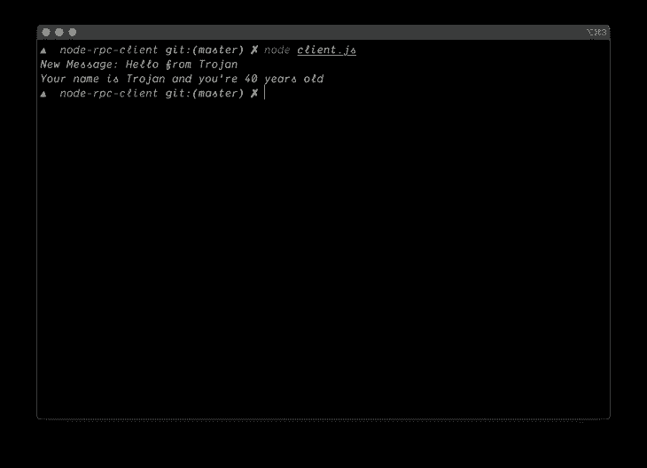
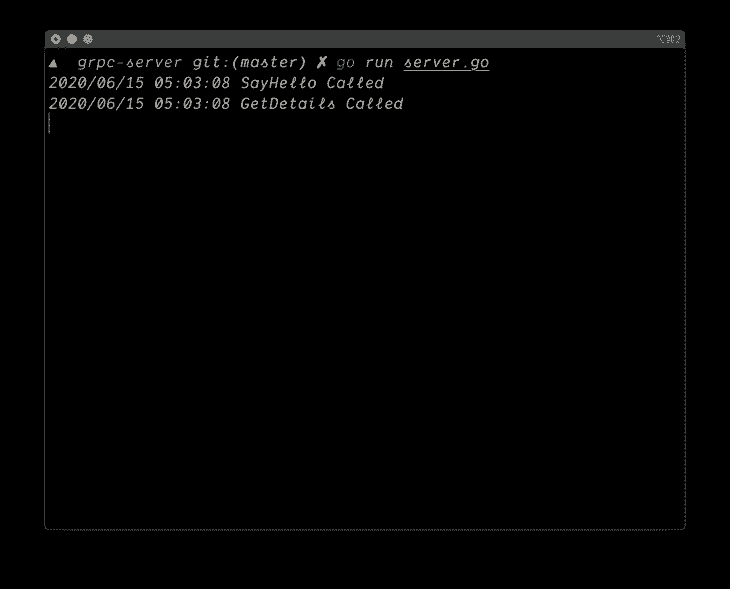

# 使用 Go 和 Node 介绍 RPC

> 原文：<https://blog.logrocket.com/introduction-to-rpc-using-go-and-node/>

## 介绍

[RPC(远程过程调用)](https://en.wikipedia.org/wiki/Remote_procedure_call)简而言之，是一种用于客户端-服务器应用的协议，它允许软件开发者向远程服务器请求过程或函数调用。在本教程中，您将学习如何在 Go 中构建一个 RPC 服务器，以及在 Node.js 中构建一个 RPC 客户端。

## 先决条件

你需要:

*   安装在本地机器上的 [Go](https://golang.org)
*   安装在本地机器上的[节点](https://nodejs.org/en/download)
*   安装在本地机器上的协议缓冲区

## 目标

在本文中，我们将构建一个聊天 RPC 服务器来发送消息并返回用户的描述性细节。send message 过程将接受消息正文，而另一个过程将接受用户的姓名和年龄。

## 创建服务器

在这一步中，您将构建您的 RPC 服务器。运行以下命令，创建一个新的项目目录:

```
mkdir rpc-server
```

将目录更改为新创建的文件夹:

```
cd rpc-server
```

## 配置协议缓冲区

协议缓冲区是 Google 创建的一种数据格式，使开发人员能够基于为任何编程语言指定的数据和服务生成源代码。

创建一个名为`chat.proto`的`proto`文件:

```
touch chat.proto
```

用您想要的编辑器打开`chat.proto`,粘贴以下代码:

```
syntax = "proto3";

package chat;

message Message {
  string body = 1;
}

message Details {
  string name = 1;
  int32 age = 2;
}

message Response {
  string body = 1;
}

service ChatService {
  rpc SayHello(Message) returns (Response) {}
  rpc GetDetails(Details) returns (Response) {}
}

```

让我们来看看每个模块的功能:

```
syntax = "proto3";
```

这指定了我们打算写什么版本的 protobuf。

```
message Message {
  string body = 1;
}

```

这声明了一个`Message`数据对象，它只能包含一个带有标签`body`的字符串元素。

```
message Details {
  string name = 1;
  int32 age = 2;
}
```

这声明了一个`Details`数据对象，它只能包含一个带有标签`name`的字符串元素和一个带有标签`age`的整数元素。

```
message Response {
  string body = 1;
}
```

这声明了一个`Response`数据对象，它只能包含一个带有标签`body`的字符串元素。

```
service ChatService {
  rpc SayHello(Message) returns (Message) {}
  rpc GetDetails(Details) returns (Details) {}
}
```

这声明了一个名为`ChatService`的新服务，它将包含两个方法，接受`Message`数据对象并返回`Response`的`SayHello`方法和接受`Details`并返回`Response`的`GetDetails`方法。保存并退出文件。

*注:你可以在这里了解更多关于 protobuf [的信息。](https://developers.google.com/protocol-buffers/)*

## 生成 Go 代码

我们将基于上一步中编写的`proto`文件生成一个协议缓冲区 Go 代码。仍然在`rpc-server`目录中，运行以下命令:

```
 mkdir chat
```

这将在`rpc-server`目录中生成一个名为`chat`的新文件夹。这是您放置我们生成的 Go 代码以及您的`chat.proto`文件的实现的地方。运行以下命令，从`chat.proto`文件中生成 go 代码:

```
protoc --go_out=plugins=grpc:chat chat.proto
```

*注:你可以在这里了解更多关于 Go 生成代码[的信息。](https://developers.google.com/protocol-buffers/docs/reference/go-generated#invocation)*

这将在之前创建的`chat`目录中生成一个名为`chat.pb.go`的新文件。

*注意:不要修改`chat.pb.go`的内容。*

## 实现方法

在这一步中，我们将实现在`chat.proto`中定义的`ChatService`中的方法。

创建一个名为`chat.go`的新文件:

```
touch chat.go
```

用您想要的编辑器打开`chat.go`,粘贴以下代码:

```
package chat

import (
    "fmt"
    "golang.org/x/net/context"
    "log"
)

type Server struct{}

func (s *Server) SayHello(ctx context.Context, message *Message) (*Response, error) {
    log.Println("SayHello Called")
    return &Response{Body: fmt.Sprintf("New Message: %s", message.Body)}, nil
}

func (s *Server) GetDetails(ctx context.Context, message *Details) (*Response, error) {
    log.Println("GetDetails Called")
    return &Response{Body: fmt.Sprintf("Your name is %s and you're %d years old", message.Name, message.Age)}, nil
}
```

让我来分解一下要点:

```
type Server struct{}
```

这充当了这个`ChatService`实现的服务器接口，我们稍后将使用它来插入 RPC 服务器。

第一个函数实现了`SayHello`函数，当被调用时，它会将
`SayHello Called`记录到控制台，同时将`Response`对象以及传递给它的消息体返回给客户端。

第二个函数实现了`GetDetails`函数，当被调用时，它会将
`GetDetails Called`记录到控制台，同时返回`Response`对象以及一条包含传回客户端的数据的自定义消息。

两个方法都返回`error`和一个指针引用`Response`，它作为一个结构存在于基于我们在`chat.proto`中定义的内容生成的`chat.pb.go`文件中。

*注意:实现的方法必须返回在`proto`声明和错误中定义的指针引用。*

## 配置服务器

在这一步中，您将通过 RPC 服务于`ChatService`。将目录从`/chat`转到你的`rpc-server`目录的根目录。

```
cd ..
```

生成`mod`文件:

```
go mod init grpc-server/chat
```

创建一个名为`server.go`的新文件:

```
touch server.go
```

用您想要的编辑器打开`server.go`,粘贴以下代码:

```
package main

import (
    "fmt"
    "grpc-server/chat"
    "log"
    "net"

    "google.golang.org/grpc"
)

func main() {
    listener, err := net.Listen("tcp", fmt.Sprintf(":%d", 9000))

    if err != nil {
        log.Fatal(err)
    }

    chatServer := chat.Server{}

    grpcServer := grpc.NewServer()

    chat.RegisterChatServiceServer(grpcServer, &chatServer)

    if err := grpcServer.Serve(listener); err != nil {
        log.Fatal(err)
    }
}

```

在除 Go 标准库之外的导入块中，我们正在导入聊天包，它允许您调用在`chat.go`中声明的服务器结构接口，并调用在`chat.pb.go`中为我们自动生成的`RegisterChatServiceServer`方法，该方法接受两个参数，一个新的服务器实例`grpc`和聊天服务器的内存位置。

最后一个块通过`TCP`服务于我们在端口`9000`上的 RPC 服务器，如之前在`listener`中声明的。保存并退出文件。`rpc-server`的内容结构应该类似于下面的内容:

```
🗂rpc-server/
  🗂chat/
    🗒 chat.go
    🗒 chat.pb.go
  🗒 chat.proto
  🗒 go.mod
  🗒 server.go
```

通过运行以下命令启动 RPC 服务器:

```
go run server.go
```

## 创建客户端

打开一个新的终端实例，通过运行以下命令在`rpc-server`之外创建一个名为`rpc-client`的不同文件夹:

```
mkdir rpc-client
```

将目录更改为`rpc-client`:

```
cd rpc-client
```

启动`npm`:

```
npm init
```

通过按 return/enter 键接受默认选项。接下来，安装 RPC 包:

```
npm i node-grpc-client
```

创建一个`chat.proto`文件:

```
touch chat.proto
```

将位于`rpc-server`中的`chat.proto`的内容复制到您新创建的`chat.proto`中。创建一个名为`client.js`的新文件:

```
touch client.js
```

用您想要的编辑器打开`client.js`,粘贴以下代码:

```
const GRPCClient = require('node-grpc-client')

const path = require("path")

const PROTO_PATH = path.resolve(__dirname, 'chat.proto')

const client = new GRPCClient(PROTO_PATH, 'chat', 'ChatService', 'localhost:9000')

const message = {
    body: "Hello from Trojan",
}

const details = {
    name: "Trojan",
    age: 40
}

client.runService('SayHello', message, (err, res) => {
    console.log(res.body);
});

client.runService('GetDetails', details, (err, res) => {
    console.log(res.body);
});

```

您可以查看 [node-grpc-client](https://www.npmjs.com/package/node-grpc-client) 包文档来全面了解这是做什么的。保存并退出。

`rpc-server`的内容结构应该类似于下面的内容:

```
🗂rpc-client/
  🗂node_modules/
  🗒 chat.proto
  🗒 client.js
  🗒 package.json
  🗒 package-lock.json

```

通过执行以下命令，运行您的客户端代码来调用 RPC 服务器:

```
node client.js
```

这将从服务器返回以下输出:

它工作了，继续在它的终端标签/窗口上检查服务器的日志输出:


As you can see in the image above, `SayHello Called` and `GetDetails Called` was logged as expected as the functions were accessed by the client.

## 结论

在本教程结束时，您应该了解了如何在 Go 中构建 RPC 服务器，以及如何通过 Node 编写的客户端调用服务器上的过程。你可以在 GitHub 上找到 [RPC 服务器](https://github.com/ichtrojan/grpc-server)和 [RPC 客户端](https://github.com/ichtrojan/node-rpc-client)的存储库。

## 200 只显示器出现故障，生产中网络请求缓慢

部署基于节点的 web 应用程序或网站是容易的部分。确保您的节点实例继续为您的应用程序提供资源是事情变得更加困难的地方。如果您对确保对后端或第三方服务的请求成功感兴趣，

[try LogRocket](https://lp.logrocket.com/blg/node-signup)

.

[](https://lp.logrocket.com/blg/node-signup)[https://logrocket.com/signup/](https://lp.logrocket.com/blg/node-signup)

LogRocket 就像是网络和移动应用程序的 DVR，记录下用户与你的应用程序交互时发生的一切。您可以汇总并报告有问题的网络请求，以快速了解根本原因，而不是猜测问题发生的原因。

LogRocket 检测您的应用程序以记录基线性能计时，如页面加载时间、到达第一个字节的时间、慢速网络请求，还记录 Redux、NgRx 和 Vuex 操作/状态。

[Start monitoring for free](https://lp.logrocket.com/blg/node-signup)

.