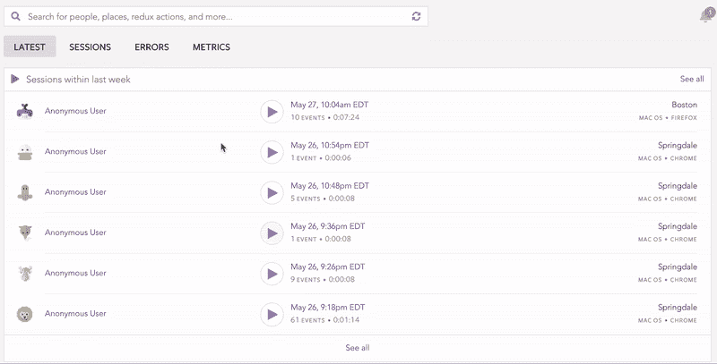

# 研究 JavaScript 管道操作符提案

> 原文：<https://blog.logrocket.com/investigating-javascript-pipe-operator-proposal/>

ECMAScript 委员会不断接受和鼓励创新的想法，使 JavaScript 开发人员的开发更加容易。虽然并不是所有的想法都在语言中实现了，但是一个特别的并且经常被提出的概念已经开始获得关注:JavaScript [管道操作符](https://github.com/tc39/proposal-pipeline-operator)。

新的操作符提案已经进入了第二阶段，因为与当前方法相比，它使开发人员能够以更好的语法、可读性和便利性对输入值执行连续的操作。

在本文中，我们将介绍当前对输入值执行并发操作的多种方法，每种方法的优缺点，并讨论引入管道操作符对 JavaScript 开发人员的意义。

## JavaScript 的当前设计范例

在今天的 JavaScript 中，可以用几个常用选项连续执行操作——每个选项都有自己的权衡。

### JavaScript 中的深层嵌套

使用[深度嵌套函数](https://en.wikipedia.org/wiki/Nested_function)调用是我们完成连续操作的一种方式。这里有一个例子:

```
function exclaim(sentence) {
        return sentence + '!';
}

function addIntroGreeting(sentence) {
        return 'Hello friend, ' + sentence
}

function addInspiration(sentence) {
        sentence + 'You are destinated for greatness!'
}

let sentence = 'live life to the fullest';

const modifiedSentence = addInspiration(addIntroGreeting(exclaim(sentence)).trim());
console.log(modifiedSentence);

// "Hello my friend, live life to the fullest! You are destinated for greatness!"

```

要阅读下面的代码，下面是一个开发人员必须做的事情:

1.  向右扫描，找到嵌套最多的函数在哪里，以及哪个值被传递给它
2.  找到函数来确定`exclaim`返回什么
3.  向左看，见`addGreeting`
4.  浏览代码，找到函数，确定它返回什么
5.  向右看，看到有一个与`addGreeting`在同一层的`trim`呼叫
6.  最后，我们来看看最后一个函数，`addInspiration`

这些步骤结合在一起，特别是上面执行的简单操作，很难在我们的头脑中一次阅读和跟踪；从左向右阅读而不来回移动你的眼睛是不可能的。

此外，随着时间的推移，一旦您添加了一些编辑内容，多个参数被传递给不同嵌套级别的每个函数，再加上需要他们自己的认知负荷来处理的复杂操作，代码将变得难以维护。

嵌套函数确实起作用，但是对我们的代码库来说代价是什么呢？

### 在 JavaScript 中使用临时变量

创建临时变量可以减轻上述可读性问题，而不是使用深度嵌套的函数调用。

```
function exclaim(sentence) {
        return sentence + '!';
}

function addIntroGreeting(sentence) {
        return 'Hello friend, ' + sentence
}

function addInspiration(sentence) {
        sentence + ' You are destinated for greatness!'
}

const sentence = 'live life to the fullest';
const exclaimedSentence = exclaim(sentence);
const introAndExclaimedSentence = addIntroGreeting(exclaimedSentence);
const trimmedSentence = introAndExclaimedSentence.trim();
const finalInspirationalSentence = addInspiration(trimmedSentence)
console.log(finalInspirationalSentence)

// "Hello my friend, live life to the fullest! You are destinated for greatness!"

```

上面代码的可读性很好，也很容易理解，但是临时变量增加了开发人员的麻烦，代码冗长，命名变量也很耗时。

此外，由于异步代码(例如回调、`async/await`或承诺)，变量本身可能在意外的时间具有意外的值。如果变量在多个地方发生了变异，那么追踪 bug 可能会很困难。

临时变量是一个可行的选择，但是我相信新的管道操作符解决了许多这样的问题，而没有带来这些缺点，使得这个过程不那么繁琐，也没有冗长的代价。

### JavaScript 中的方法链接

执行连续操作的另一种设计模式是方法链接。开发人员对这个选项很熟悉，这要归功于当前实现它的 JavaScript 数组方法。

```
console.log([1, 2, 3].map(num => num * 2).filter(num => num > 2));
// [4, 6]

```

这种风格允许代码从左到右阅读，使其易于理解。它不像临时变量那样冗长，也不需要我们从里到外阅读代码。那么，问题是为什么方法链不够好？

这一次，它的有限应用使得在所有用例中使用它变得困难，因为被操作的值必须有可用的类的方法。

在上面的数组示例中，操作的每个返回值都是另一个数组，并且可以访问数组方法——否则，我们将无法链接它们。它也不能使用 JavaScript 的其他语法或操作符，比如`await`。

## 为什么使用管道运算符？

像科技领域的大多数事物一样，上述每种常见模式都有优点和缺点。开发人员的判断力允许我们根据我们试图编写的代码进行权衡，我们尽最大努力编写可维护、可读的代码。

在架构或代码评审讨论中，持不同意见的人不一定是对的或错的，这是很常见的。这就是为什么科技领域的许多答案都归结为:“视情况而定。”

管道操作符接受所有选项，并返回一个结合了所有选项中最佳选项的备选解决方案。它没有去掉任何旧的模式，而是增加了一个选项，可以让开发人员和语言变得更好。双赢，如果你愿意的话。

话虽如此，让我们更深入地研究管道操作符。

* * *

### 更多来自 LogRocket 的精彩文章:

* * *

## JavaScript 中的管道操作符建议是什么？

管道操作符结合了当今最好的选项，并表示我们正在对一个值执行连续的操作(比如函数调用)，这些操作可以结合成多个步骤，上一个操作的值被传递给下一个管道。

该提案提到了两种不同的操作符语法和功能，但建议继续使用 [hack pipe 操作符](https://github.com/tc39/proposal-pipeline-operator)。另一方面，F#操作符的目的是用不同的语法简化并发操作(注意:到目前为止，它已经被 TC39 委员会阻止了两次)。语法争论归结为对常见用例的优化，使它们不那么冗长，这就是提案作者推荐 hack pipe 向前发展的原因。

## 使用 hack 管道运算符

hack pipe 操作符的语法非常简单:

*   `|>`:管道工
*   `%`:值的占位符符号(在获得批准之前可能会改变)

它的优先级与箭头函数、赋值运算符和生成器运算符相同。这意味着在使用任何具有相同优先级的运算符时，都应该使用括号，否则将会引发错误。

```
function exclaim(sentence) {
        return sentence + '!';
}

function addIntroGreeting(sentence) {
        return 'Hello friend, ' + sentence
}

function addInspiration(sentence) {
        sentence + ' You are destined for greatness!'
}

const sentence = 'live life to the fullest';

// Nested
const modifiedSentence = addInspiration(addIntroGreeting(exclaim(sentence)).trim());

// pipe operator as 1 line
const finalSentence = sentence |> exclaim(%) |> addIntroGreeting(%) |> %.trim() |> console.log(%);

// pipe operator split per line
const finalSentence = sentence 
  |> exclaim(%) 
  |> addIntroGreeting(%) 
  |> %.trim()
  |> console.log(%);

// "Hello my friend, live life to the fullest! You are destined for greatness!

```

我非常喜欢管道操作符的语法和感觉，尤其是与嵌套选项相比，因为它真正提供了方法链接的可读性，而没有有限的适用性。

你可以很容易地从左到右阅读它，既可以看到初始变量开始的地方，也可以看到顺序操作。我是你的超级粉丝！

### 为什么提案没有进展

该想法和各种提案的完整历史可在[提案的历史文档](https://github.com/tc39/proposal-pipeline-operator/blob/main/HISTORY.md)中阅读。一般来说，人们关注的是它的语法以及它如何与其他数据流提案重叠。委员会成员对它有不同程度的支持，从强烈支持到微弱反对，并且关于 JavaScript 中数据流操作的整体方法的讨论还在继续。

为了跟上最新的信息，我建议跟随历史文档及其链接。

## 结论

管道运营商提案已经成为 web 开发人员感兴趣的话题。目前它还处于第二阶段，我们还不知道它是否会被批准并加入到语言中。此外， [F#管道运营商过去的提案被拒绝](https://github.com/tc39/proposal-pipeline-operator#tc39-has-rejected-f-pipes-multiple-times)。

通过将通用模式的优点结合到一个易于使用和学习的语法中，我认为新的操作符将对开发人员有很大的用处。我建议通读一下[提案](https://github.com/tc39/proposal-pipeline-operator)或者在你的项目中用[巴别塔插件](https://babeljs.io/docs/en/babel-plugin-proposal-pipeline-operator)来探索它，以了解更多。

## 通过理解上下文，更容易地调试 JavaScript 错误

调试代码总是一项单调乏味的任务。但是你越了解自己的错误，就越容易改正。

LogRocket 让你以新的独特的方式理解这些错误。我们的前端监控解决方案跟踪用户与您的 JavaScript 前端的互动，让您能够准确找出导致错误的用户行为。

[](https://lp.logrocket.com/blg/javascript-signup)

LogRocket 记录控制台日志、页面加载时间、堆栈跟踪、慢速网络请求/响应(带有标题+正文)、浏览器元数据和自定义日志。理解您的 JavaScript 代码的影响从来没有这么简单过！

[Try it for free](https://lp.logrocket.com/blg/javascript-signup)

.