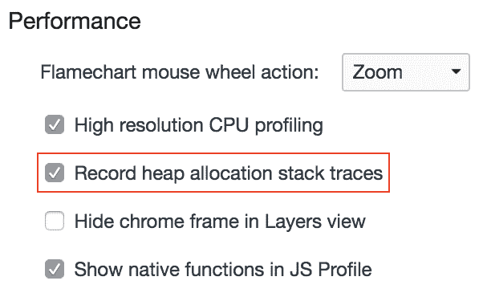
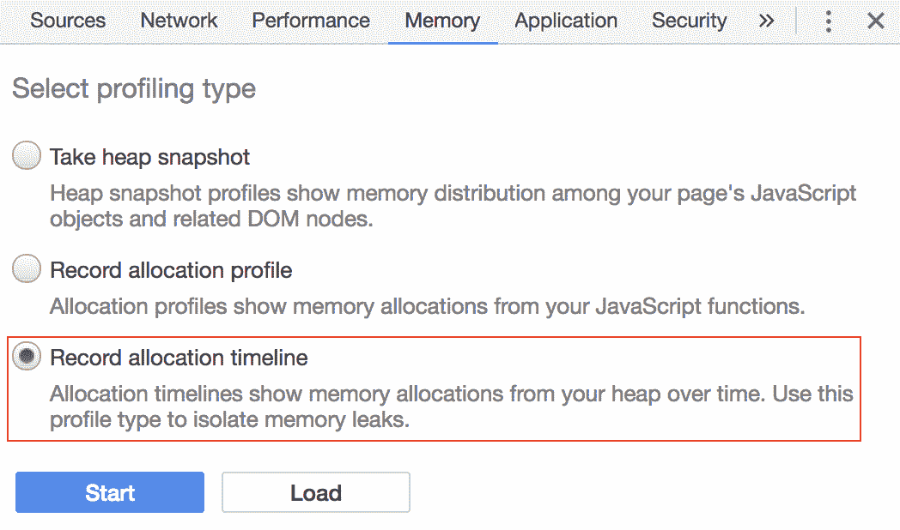
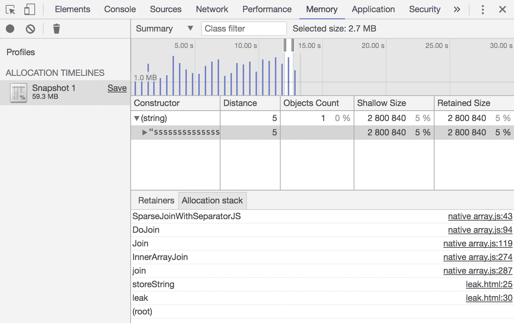

# 用 Chrome 的分配时间线隔离内存泄漏

> 原文：<https://blog.logrocket.com/isolating-memory-leaks-with-chromes-allocation-timeline-244fa9c48e8e/>

当程序使用的内存不再需要时，它应该被归还给操作系统可用的空闲内存池，以便可以重用。当您的程序没有释放这些未使用的内存时，您就遇到了所谓的“内存泄漏”。内存泄漏会降低你的应用程序的速度，最终可能导致它崩溃。它们是复杂 JavaScript 应用程序中性能问题的常见原因。

追踪内存泄漏的根本原因可能很困难。我在努力提高我们的 JavaScript SDK 的性能和内存使用时，在 log rocket 学到了这一点。

JavaScript 是一种垃圾收集语言。它会自动尝试释放你的程序不再使用的内存。当内存不能被释放时，意味着你在代码中的某个地方保留了对它的引用。这些不想要的引用通常很微妙。通过通读代码来找到它们可能需要几个小时。

幸运的是，有更好的方法来解决这个问题。特别是，Chrome 的分配时间线是隔离和调查应用程序内存泄漏的绝佳工具。

分配时间线将向您显示堆栈跟踪，这些跟踪可以帮助您确定代码的哪一部分负责分配特定的对象。要使用此功能，您需要启用默认情况下禁用的 DevTools 设置。打开您的 DevTools 设置，找到 Performance 部分，并检查“记录堆分配堆栈跟踪”



[](https://logrocket.com/signup/)

现在，让我们来看一下我们的例子。我们将使用以下页面:

```
<!doctype html>
<html lang="en">
<head>
  <meta charset="UTF-8">
  <title>Leak</title>
</head>
<body>
  <button id="allocate">Allocate</button>
  <button id="release">Release</button>

  const allocate = document.getElementById("allocate");
  const release = document.getElementById("release");
  let strings = [];
  let interval;

  randomInteger = (min, max) => {
    // Min is inclusive, max is exclusive.
    min = Math.ceil(min);
    max = Math.floor(max);

    return Math.floor(Math.random() * (max - min)) + min;
  }

  storeString = (size) => {
    const s = new Array(size).join('s')
    strings.push(s);
  }

  leak = () => {
    // Allocate 1-3 MB.
    const size = randomInteger(1e6, 3e6);
    storeString(size);
  }

  allocate.onclick = () => {
    interval = setInterval(leak, 500);
  };

  release.onclick = () => {
    clearInterval(interval);
    strings = [];
  };

</body>
</html>
```

这里有一个[版本的](https://codepen.io/rlucioni/pen/KywbMg)，你可以在你的浏览器里玩。单击“分配”按钮时，页面上的脚本会重复分配 1-3mb 的内存来存储字符串。对这些字符串的引用在`strings`数组中累积，直到点击“释放”按钮。

打开 Chrome 的任务管理器，让脚本运行几秒钟。您应该会看到页面消耗了越来越多的内存。


将对我们正在创建的字符串的引用保存在一个数组中，通过防止 JavaScript 的垃圾收集器清理它们来模拟内存泄漏期间发生的情况。用于存储每个字符串的内存永远不会被释放，导致我们脚本的内存使用量攀升。

现在假设我们还不知道内存使用量增加的原因。分配时间线可以帮助我们找到泄漏的来源(例如，什么在使用无法释放的内存)。要使用它，选择“记录分配时间线”，位于 DevTools 的“内存”选项卡下。



单击“开始”按钮运行 profiler，然后在我们的示例页面上单击“分配”按钮。你会看到蓝色条出现在时间线上。


蓝色条代表尚未释放的已分配内存。如果你点击“释放”按钮，蓝色条变成灰色条。


灰色条表示已经释放的先前分配的内存。使用左上角的圆圈停止分析器。

当您停止录制时，分配时间线上仍保留的蓝色条表示潜在的内存泄漏。要研究这种情况，请重新运行分析器，单击“分配”按钮，然后在单击“释放”按钮之前停止分析器。你应该会看到一条充满蓝色线条的时间线。通过放大，将焦点缩小到一个蓝色条。


这将“构造函数”列表限制为在突出显示的范围内分配的对象。在这种情况下，我们看到在这段时间内分配了 2.8 MB 的字符串。(要了解浅大小和保留大小之间的差异，请参阅 DevTools 文档的[内存术语](https://developers.google.com/web/tools/chrome-devtools/memory-problems/memory-101#shallow_size)部分。)

展开`(string)`构造函数的条目会发现这里分配了一个 2.8 MB 的字符串。我们可以看到字符串本身，通过打开“分配堆栈”选项卡，我们可以看到一个堆栈跟踪，告诉我们这个字符串是在哪里创建的。



在许多情况下，这种堆栈跟踪可以为您指出代码中需要修复的地方，这比您在没有堆栈跟踪的情况下试图找到那个地方要快得多。

请记住，您可以通过单击侧边栏中的“保存”链接来导出分配时间表快照。如果您发现自己在分析一个特别繁忙或有漏洞的应用程序，尤其是一个容易崩溃的应用程序，这是很有帮助的。这可能会降低 DevTools 的速度，使其无法使用，或者在崩溃的情况下，导致您完全丢失时间线。

当你疯狂地检查时间线时，不要让应用程序继续运行，保存一个快照，关闭应用程序运行的标签，深呼吸，打开一个新标签，打开 DevTools，然后加载你保存的快照。

内存泄漏时有发生。下次你遇到一个，记住分配时间线是你的朋友。

## 使用 [LogRocket](https://lp.logrocket.com/blg/signup) 消除传统错误报告的干扰

[](https://lp.logrocket.com/blg/signup)

[LogRocket](https://lp.logrocket.com/blg/signup) 是一个数字体验分析解决方案，它可以保护您免受数百个假阳性错误警报的影响，只针对几个真正重要的项目。LogRocket 会告诉您应用程序中实际影响用户的最具影响力的 bug 和 UX 问题。

然后，使用具有深层技术遥测的会话重放来确切地查看用户看到了什么以及是什么导致了问题，就像你在他们身后看一样。

LogRocket 自动聚合客户端错误、JS 异常、前端性能指标和用户交互。然后 LogRocket 使用机器学习来告诉你哪些问题正在影响大多数用户，并提供你需要修复它的上下文。

关注重要的 bug—[今天就试试 LogRocket】。](https://lp.logrocket.com/blg/signup-issue-free)