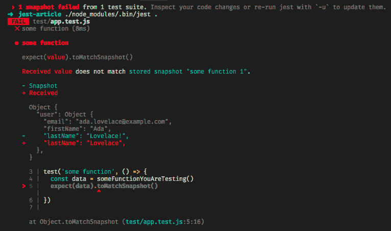
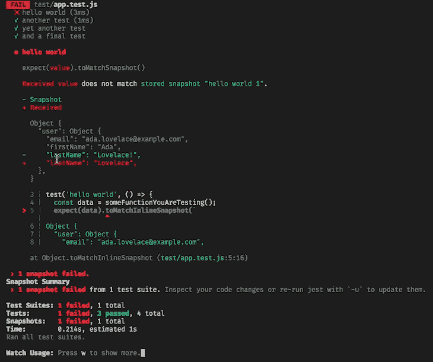

# Jest 测试:顶级特性和如何使用它们

> 原文：<https://blog.logrocket.com/jest-testing-top-features/>

***编者按:*** *这篇文章是在 2022 年 6 月 10 日更新的，以包括更有效地使用扩展和更多关于 Jest 的最新信息。*

Web 开发人员知道测试是构建应用程序的一个重要部分，因为它可以防止回归并确保代码有效执行。使用 Jest 作为测试运行程序是实现这一点的一种方式。我经常使用 [Jest](https://jestjs.io/) 已经有一段时间了。最初，我像其他测试运行程序一样使用它，但在某些情况下，我使用它只是因为它是 Create React 应用程序中的[默认测试框架](https://blog.logrocket.com/testing-react-apps-jest-react-testing-library/)。

很长一段时间，我都没有充分发挥 Jest 的潜力。现在，我想告诉你为什么我认为它是最好的测试框架。永远不会。

### 内容

## 什么是玩笑？

Jest 是由脸书构建的 JavaScript 测试框架，主要是为基于 React 的应用程序设计的，但也用于 Babel、JavaScript、Node、Angular 和 Vue。它也可以用来测试 [NestJS](https://blog.logrocket.com/unit-testing-nestjs-applications-with-jest/) 、 [Next.js](https://blog.logrocket.com/testing-next-js-apps-jest/) 和 [GraphQL](https://blog.logrocket.com/writing-end-to-end-tests-for-graphql-servers-using-jest/) 。让我们来看看 Jest 的一些最佳特性。

## 笑话的主要特点

### 快照测试

什么是快照，为什么它们如此方便？

我第一次看到这个功能时，我以为它仅限于酶和反应单元测试。但其实不是！快照用于跟踪用户界面的变化。快照测试在特定时间捕获组件的代码，将其与测试旁边存储的参考快照进行比较。您可以对任何可序列化的对象使用快照。

让我们来看看。

假设您想测试一个函数是否返回一个非平凡值，就像一个具有一些嵌套数据结构的对象。我发现自己多次编写这样的代码:

```
const data = someFunctionYouAreTesting()
assert.deepEqual(data, {
  user: {
    firstName: 'Ada',
    lastName: 'Lovelace',
    email: '[email protected]'
  }
  // etc.
})

```

但是，如果某个嵌套属性不是您所期望的，您只会得到一个错误，您需要直观地找到不同之处:

```
assert.js:83
  throw new AssertionError(obj);
  ^

AssertionError [ERR_ASSERTION]: { user:
   { firstName: 'Ada',
     lastName: 'Lovelace!',
     email: '[email protected]' } } deepEqual { user:
   { firstName: 'Ada',
     lastName: 'Lovelace',
     email: '[email protected]' } }

```

如果您正在测试的函数返回随机的东西(例如，当您生成一个随机的 API 键时)，您就不能再使用这种机制了。在这种情况下，您必须手动逐个字段地检查:

```
const data = someFunctionYouAreTesting()
assert.ok(data.user)
assert.equal(data.user.firstName, 'Ada')
assert.equal(data.user.lastName, 'Lovelace')
assert.equal(data.user.email, '[email protected]')
// and it goes on...

```

从测试的角度来看，这更好，但是工作量要大得多。

如果你发现自己在做这些事情，你会爱上快照的！你会写出这样的东西:

```
const data = someFunctionYouAreTesting()
expect(data).toMatchSnapshot()

```

测试第一次运行时，Jest 会将数据结构存储在一个快照文件中，您可以手动打开并验证该文件。每当您再次运行测试时，Jest 将加载快照，并将其与从测试中接收到的数据结构进行比较。如果有任何差异，Jest 将在输出中打印一个彩色的 diff。厉害！



现在，如果我们不想比较整个结构(因为有些字段可以是动态的，或者可以从一个测试到另一个测试发生变化)，该怎么办呢？没问题:

```
const data = someFunctionYouAreTesting()
expect(data).toMatchSnapshot({
  createdAt: expect.any(Date),
  id: expect.any(Number),
})

```

这些被称为[属性匹配器](https://jestjs.io/docs/en/snapshot-testing#property-matchers)。

但是还有更多。我发现这种验证数据结构的方法的一个问题是快照文件与测试代码是分离的。因此，有时您需要从一个文件跳到另一个文件，以检查快照是否包含您所期望的内容。

没问题！如果快照足够小，您可以使用内联快照。你只需要使用:

```
const data = someFunctionYouAreTesting()
expect(data).toMatchInlineSnapshot()

```

就是这样！等等…但是快照在哪里？

快照还没有出现。第一次运行测试时，Jest 将接受数据结构，而不是将它存储在快照文件中，而是将它放在您的代码中。

它将改变您的测试代码，结果如下:

```
const { someFunctionYouAreTesting } = require("../src/app");
test("hello world", () => {
  const data = someFunctionYouAreTesting();
  expect(data).toMatchInlineSnapshot(`
Object {
  "user": Object {
    "email": "[email protected]",
    "firstName": "Ada",
    "lastName": "Lovelace",
  },
}
`);
});

```

如果代码没有为您自动更改，请尝试在代码编辑器中重新打开该文件，更改将立即出现！

这让我大吃一惊，我很喜欢。无缝更改代码的开发工具是一个简单而优雅的解决方案，在其他场景中会非常有用。想象一下，有一个 React/Angular/Vue 开发模式，您可以在浏览器中可视化地编辑组件，代码会为您更新以匹配这些更改。

顺便说一下，如果测试不够小，不能使用内联快照，您仍然可以获得一些帮助。如果你使用 VSCode 和这个扩展名，你可以看到一个选项来查看你的快照。您还可以使用这个扩展来自动运行您的测试，它为您提供了一些很棒的 IntelliSense 条目，以便您的测试开发能够顺利进行。

### 对话方式

一开始，我认为交互模式只是许多 CLI 应用程序所具有的典型手表功能的一个花哨术语。但后来我学到了一些东西。

Jest 集成了 Git 和 [Mercurial](https://www.mercurial-scm.org/) 。默认情况下，监视模式将只运行受自上次提交以来所做更改影响的测试。这很酷，也让我编写了更多的原子提交。如果您想知道 Jest 如何知道哪些测试受到提交更改的影响，您并不孤单。

Jest 做的第一件事是加载测试，从而加载应用程序的源代码，解析`requires()`和`imports`以生成相互依赖关系图。

但是使用 Git 或 Mercurial 并不是限制每次运行测试数量的唯一方法。当我对源代码进行修改并且看到许多失败的测试时，我会关注最简单的失败测试。你可以通过使用`test.only`来做到这一点，但是有一个更好的方法(我尤其不喜欢`test.only`或`test.skip`，因为很容易忘记它并把它留在你的代码中)。

“交互方式”更加优雅便捷。在不编辑测试代码的情况下，您可以限制测试以不同的方式运行。让我们来看看。

最简单的方法是点击 **t** ，输入测试名称。如果你有测试`hello world`，点击 **t** ，写 **hello world** ，打**回车**。


这在大多数情况下是可行的，如果你有一个测试(`hello world 2`)，它也会运行，因为你输入了一个正则表达式。为了避免这种情况，我通常在模式的末尾添加`$`。

在有许多集成测试触及数据库的项目中，我发现运行测试仍然很慢。为什么？

通过测试名过滤不会阻止所有的`before()`和`after()`回调在所有其他测试中运行。通常，在集成测试中，这些回调是您放置重要内容的地方，比如打开和关闭到数据库的连接。

所以，为了防止这种情况，我通常也按文件名过滤。只需点击 **p** (路径)并输入包含测试的文件名。你会发现现在测试运行得快多了(要返回只需点击 **t** 并通过点击**回车来清理过滤器。**用 **p** 和 **enter** 对文件名做同样的过滤。

另一个超级方便的功能是升级。如果你看到新的快照没问题，旧的已经过时了，只要点击 **u** (升级)，快照就会被覆盖！



两个更有用的选项是 **a** 运行所有测试，以及 **f** 再次运行失败的测试。

### 开箱即用的易用性

我喜欢的另一件事是 Jest 是一个“包含电池”的框架，这意味着你通常不必添加插件或库来添加通用功能。它只是附带的！

一些例子:

在调用 Jest 时添加覆盖率，以便从您的测试中获得覆盖率报告，并且能够在几个内置报告器或自定义报告器之间进行选择。您甚至可以设置一个覆盖率阈值，这样如果没有达到这个阈值，您的测试(以及您的 CI)就会失败。这对于在代码中保持良好的测试覆盖率来说是完美的。

添加 notify，当测试运行结束时，您将收到桌面通知。如果您有数千个测试，它们可能需要一段时间才能完成。添加此标志可以节省时间。

为了开始编写强大而有用的断言，您不需要在项目中添加断言库。您已经内置了广泛的 [expect 功能](https://jestjs.io/docs/en/expect),并准备好与有趣的功能一起使用，例如我们在快照功能中也看到的彩色差异。

你不需要一个库来模拟函数或服务。您有大量的实用程序来模拟函数和模块，并检查它们是如何被调用的。

您不需要导入任何 Jest 特性。您在 Jest 测试中使用的所有函数都不需要导入，因为它们是由 Jest 自动导入的，所以您可以轻松地开始编写测试，而不用担心导入函数。

### 使用 VSCode 调试 Jest 测试

随着每天新的 VSCode 扩展的出现，开发和测试变得前所未有的容易。现在，您可以使用不同的 VSCode 扩展来运行 Jest 测试，而无需在终端上运行命令。

VSCode marketplace 上的 [Jest 扩展](https://marketplace.visualstudio.com/items?itemName=Orta.vscode-jest)有很多特性可以使测试更容易。您可以:

*   通过保存文件直接运行测试
*   查看 Jest 创建的任何快照
*   查看测试中的任何错误，并查看错误发生在哪一行
*   有了智能感知支持，用自动完成更快地编写测试

## 结论

不管很多人怎么想，Jest 不仅仅是一个测试运行程序——它是一个完整的测试框架，将测试带到了另一个层次。它很强大，但很容易使用，所以试试吧。我保证你不会后悔的。

## 使用 [LogRocket](https://lp.logrocket.com/blg/signup) 消除传统错误报告的干扰

[](https://lp.logrocket.com/blg/signup)

[LogRocket](https://lp.logrocket.com/blg/signup) 是一个数字体验分析解决方案，它可以保护您免受数百个假阳性错误警报的影响，只针对几个真正重要的项目。LogRocket 会告诉您应用程序中实际影响用户的最具影响力的 bug 和 UX 问题。

然后，使用具有深层技术遥测的会话重放来确切地查看用户看到了什么以及是什么导致了问题，就像你在他们身后看一样。

LogRocket 自动聚合客户端错误、JS 异常、前端性能指标和用户交互。然后 LogRocket 使用机器学习来告诉你哪些问题正在影响大多数用户，并提供你需要修复它的上下文。

关注重要的 bug—[今天就试试 LogRocket】。](https://lp.logrocket.com/blg/signup-issue-free)