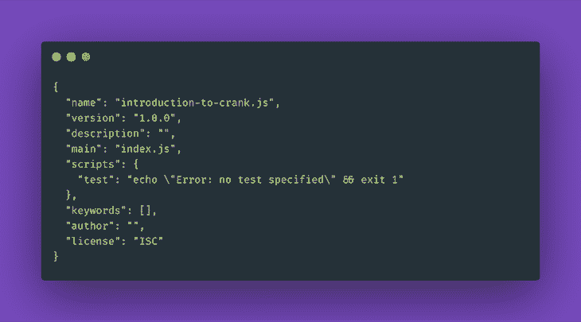
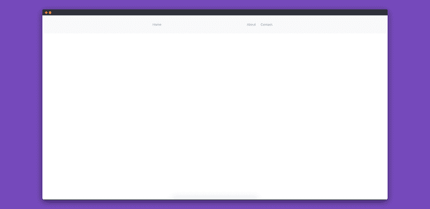
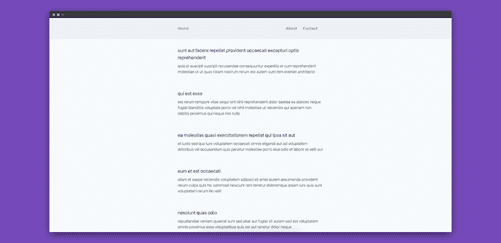
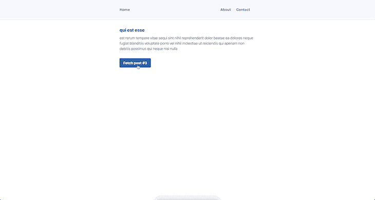

# JSX 驱动的组件与 Crank.js 

> 原文：<https://blog.logrocket.com/jsx-driven-components-crank-js/>

在本教程中，我们将通过理解什么是 Crank.js 以及为什么创建它来介绍它。然后，我们将通过构建一个博客应用程序来使用这些知识，该应用程序将使用 [JSONPlaceholder](https://jsonplaceholder.typicode.com/) API。

## Crank.js 是什么，解决什么问题？

js 是一个新的框架，用于创建具有函数、承诺和生成器的 JSX 驱动的组件。它的灵感很大程度上来自于 [React](https://reactjs.org/) 库。

虽然 [Vue](https://vuejs.org/) 和 [Svelte](https://svelte.dev/) 为开发者面临的问题提供了解决方案，但他们主要使用 HTML 模板语言作为使用它们的主要方式。虽然有其他使用 JSX 的框架(像 [Preact](https://preactjs.com/) )，他们也跟随 react 从“一个视图层”转换成“一个 UI 运行时”

Crank.js 是一个框架，它验证了“基于 JSX 的组件不仅可以用同步函数编写，还可以用异步函数、同步和异步生成器函数编写”的观点更多关于为什么曲柄被创造的信息可以在这里找到[。](https://crank.js.org/blog/introducing-crank)

作为本教程一部分构建的应用程序代码可在 [GitHub](https://github.com/ghoshnirmalya/crank.js-tailwind-css) 上获得，并托管在 [Vercel](https://crank-js-tailwind-css.now.sh/) 上。

## 在我们的应用程序中安装曲柄

让我们创建应用程序将驻留的目录:

```
mkdir introduction-to-crank.js && cd introduction-to-crank.js
```

然后用 [npm](https://www.npmjs.com/) 初始化我们的应用程序:

```
npm init -y
```

这将创建一个包含以下内容的`package.json`文件:



Our default package.json file.

在我们的项目中添加 [Crank.js](https://github.com/bikeshaving/crank) 作为依赖项:

```
yarn add @bikeshaving/crank
```

并添加[包裹](https://parceljs.org/)作为我们的捆扎机:

```
yarn add parcel-bundler --dev
```

上述命令将把 parcel 作为 dev 依赖项添加。

现在让我们用以下内容创建一个`i``ndex.html`文件:

```
// index.html

<!DOCTYPE html>
<html>
  <head>
    <title>Introduction to Crank.js</title>
    <meta charset="UTF-8" />
  </head>
  <body>
    <script src="src/index.js"></script>
  </body>
</html>
```

接下来，我们将在一个新的 src 目录中创建一个`index.js`文件，内容如下:

```
// src/index.js

import { renderer } from "@bikeshaving/crank/dom";

renderer.render(<div id="hello">Hello world</div>, document.body);
```

并将以下两个脚本添加到我们的`package.json`文件中:

```
// package.json

..
"scripts": {
  "dev": "parcel index.html",
  "build": "parcel build index.html",
  ..
},
..
```

现在，如果我们运行`yarn dev`，我们将得到以下输出:


We seen an error when starting our dev server.

让我们在接下来的步骤中解决这个问题。将 babel-preset-crank 添加到我们的开发依赖列表中:

```
yarn add babel-preset-crank --dev
```

最后，创建一个包含以下内容的`.babelrc`文件:

```
// .babelrc

{
  "presets": [
    "crank"
  ]
}
```

现在，如果我们启动开发服务器，我们将能够在`[http://localhost:1234/](http://localhost:1234/)`上查看我们的应用程序:

```
yarn dev
```


The output from starting our dev server.

我们应该能够看到以下屏幕:


Our basic Crank.js application setup.

## 向我们的应用程序添加 Tailwind CSS

为了给我们的应用程序添加一些样式，我们将使用 [TailwindCSS](https://tailwindcss.com/) 。我们可以通过在我们的`index.html`文件中添加下面一行来将 Tailwind CSS 添加到我们的应用程序中:

```
// index.html

<link href="https://unpkg.com/[email protected]^1.0/dist/tailwind.min.css" rel="stylesheet">
```

请注意，这不是向项目添加 Tailwind CSS 的推荐方式。然而，为了使我们的教程简短，我们加入了它的 CDN 版本。关于如何正确安装 Tailwind CSS 的更多信息可以在它的[文档](https://tailwindcss.com/docs/installation)中找到。

现在我们可以在我们的项目中使用顺风。为了验证这一点，我们可以在`src/components/navbar`目录中创建一个`Navbar`组件，它应该包含以下内容:

```
// src/components/navbar/index.js

import { createElement } from "@bikeshaving/crank";

const Navbar = () => {
  return (
    <div className="bg-gray-100">
      <div className="max-w-2xl mx-auto p-8 flex justify-between">
        <div>
          <ul class="flex">
            <li class="mr-6">
              <a class="text-blue-500 hover:text-blue-800" href="#">
                Home
              </a>
            </li>
          </ul>
        </div>
        <div>
          <ul class="flex">
            <li class="mr-6">
              <a class="text-blue-500 hover:text-blue-800" href="#">
                About
              </a>
            </li>
            <li class="mr-6">
              <a class="text-blue-500 hover:text-blue-800" href="#">
                Contact
              </a>
            </li>
          </ul>
        </div>
      </div>
    </div>
  );
};

export default Navbar;
```

我们现在可以将该组件导入到我们的`src/index.js`文件中并使用它:

```
// src/index.js

import { createElement } from "@bikeshaving/crank";
import { renderer } from "@bikeshaving/crank/dom";
import Navbar from "./components/navbar";

const App = () => {
  return (
    <div>
      <section>
        <Navbar />
      </section>
    </div>
  );
};

renderer.render(<App />, document.body);
```

现在，如果我们访问`[http://localhost:1234/](http://localhost:1234/)`，我们应该会看到以下屏幕:



Our page displaying the Navbar component.

因此，使用 Tailwind CSS，我们创建了第一个 Crank.js 组件。

## 从 JSONPlaceholder 获取数据

JSONPlaceholder 是一个免费服务，它提供了一个用于测试和原型制作的伪在线 REST API。使用这个服务，我们将获取一个博客文章列表。

我们将在一个名为`Posts`的独立组件中显示帖子:

```
// src/components/posts/index.js

import { createElement } from "@bikeshaving/crank";

const Posts = async () => {
  const response = await fetch("https://jsonplaceholder.typicode.com/posts");
  const data = await response.json();

  return (
    <div className="bg-gray-100">
      <div className="max-w-2xl mx-auto p-8 flex justify-between">
        <div>
          <ul class="flex">
            <li class="mr-6">
              <a class="text-blue-500 hover:text-blue-800" href="#">
                Home
              </a>
            </li>
          </ul>
        </div>
        <div></div>
      </div>
    </div>
  );
};

export default Posts;
```

让我们也将组件导入并添加到我们的`src/index.js`文件中:

```
// src/index.js

const App = () => {
  return (
    <div>
      ..
      <section>
        <Posts />
      </section>
    </div>
  );
};
```

现在，如果我们访问 [http://localhost:1234/](http://localhost:1234/) ，我们会在浏览器的控制台上看到一个错误:

```
index.js:3 Uncaught ReferenceError: regeneratorRuntime is not defined
```

关于这个问题的更多信息可以在这个 GitHub [问题](https://github.com/bikeshaving/crank/issues/80)中找到，但是我们可以通过添加[再生器-运行时包](https://www.npmjs.com/package/regenerator-runtime)来解决它:

```
yarn add regenerator-runtime
```

现在我们需要将这个包导入到我们的`src/index.js`文件中:

```
// src/index.js

import "regenerator-runtime/runtime";
..
```

现在，如果我们再次访问 [http://localhost:1234/](http://localhost:1234/) ，我们将不会再看到该问题。

让我们展示一下`Navbar`组件下面的所有帖子。为此，我们需要用以下代码更新我们的`Posts`组件:

```
// src/components/posts/index.js

import { createElement } from "@bikeshaving/crank";

const Posts = async () => {
  const response = await fetch("https://jsonplaceholder.typicode.com/posts");
  const data = await response.json();

  return (
    <div className="bg-gray-100">
      <div className="max-w-2xl mx-auto p-8">
        {data.map((post) => {
          return (
            <div className="mb-16">
              <h2 className="font-bold text-xl mb-2">{post.title}</h2>
              <p className="font-light">{post.body}</p>
            </div>
          );
        })}
      </div>
    </div>
  );
};

export default Posts;
```

现在，如果我们访问`[http://localhost:1234/](http://localhost:1234/)`，我们应该能够查看所有的帖子。



Our page displaying the Posts component.

## 显示获取帖子时的加载程序

到目前为止，一旦所有的 API 请求完成，我们就会显示所有的帖子。但是，可能会有一个 API 请求需要一些时间来完成。因此，当 API 请求挂起时，我们需要显示一个加载程序。接下来让我们实现它。

为此，我们需要修改我们的`src/components/posts/index.js`文件:

```
// src/components/posts/index.js

import { createElement, Fragment } from "@bikeshaving/crank";
import Spinner from "../spinner";
import Button from "../button";

const BlogPosts = async ({ postCount }) => {
  const res = await fetch(
    `https://jsonplaceholder.typicode.com/posts/${postCount}`
  );
  const post = await res.json();

  return (
    <Fragment>
      <h2 className="font-bold text-xl mb-2">{post.title}</h2>
      <p className="font-light">{post.body}</p>
    </Fragment>
  );
};

async function* PostsLoader({ isLoading, postCount }) {
  for await ({ isLoading, postCount } of this) {
    yield <Spinner />;
    yield <BlogPosts postCount={postCount} />;
  }
}

function* Posts() {
  let isLoading = false;
  let postCount = 1;

  this.addEventListener("click", (e) => {
    if (e.target.tagName === "BUTTON") {
      isLoading = !isLoading;
      postCount++;
      this.refresh();
    }
  });

  while (true) {
    yield (
      <div className="bg-white">
        <div className="max-w-2xl mx-auto p-8">
          <div className="mb-8">
            <PostsLoader isLoading={isLoading} postCount={postCount} />
          </div>
          <Fragment>
            <Button text={`Fetch post #${postCount + 1}`} />
          </Fragment>
        </div>
      </div>
    );
  }
}

export default Posts;
```

在上面的代码片段中，我们默认获取第一篇文章，然后将`postCount`的值加 1。我们每点击一次按钮，计数就增加一次。向 JSONPlaceholder 发出 API 请求，这取决于`postCount`变量的值。

js 使用生成器组件来获取异步组件。更多相关信息可在其[文档](https://crank.js.org/guides/async-components)中找到。

如果我们现在访问`[http://localhost:1234/](http://localhost:1234/)`，我们应该能够看到以下屏幕:



我们现在可以看到，每次我们获取一个新帖子时，都会显示一个加载器。

## 结论

在本教程中，我们学习了什么是 Crank，以及如何使用它来构建应用程序。作为本教程一部分构建的应用程序的源代码可以在 [Github](https://github.com/ghoshnirmalya/crank.js-tailwind-css) 上获得，并且托管在 [Vercel](https://crank-js-tailwind-css.now.sh/) 上。

就我个人而言，我觉得虽然它很新，但它有一些强大的功能。像 Crank 的作者一样，我也更喜欢 JSX 语法而不是 HTML 模板。然而，我认为如果在适当的用例中使用，Crank 有很大的潜力。

## 您是否添加了新的 JS 库来提高性能或构建新特性？如果他们反其道而行之呢？

毫无疑问，前端变得越来越复杂。当您向应用程序添加新的 JavaScript 库和其他依赖项时，您将需要更多的可见性，以确保您的用户不会遇到未知的问题。

LogRocket 是一个前端应用程序监控解决方案，可以让您回放 JavaScript 错误，就像它们发生在您自己的浏览器中一样，这样您就可以更有效地对错误做出反应。

[](https://lp.logrocket.com/blg/javascript-signup)[https://logrocket.com/signup/](https://lp.logrocket.com/blg/javascript-signup)

[LogRocket](https://lp.logrocket.com/blg/javascript-signup) 可以与任何应用程序完美配合，不管是什么框架，并且有插件可以记录来自 Redux、Vuex 和@ngrx/store 的额外上下文。您可以汇总并报告问题发生时应用程序的状态，而不是猜测问题发生的原因。LogRocket 还可以监控应用的性能，报告客户端 CPU 负载、客户端内存使用等指标。

自信地构建— [开始免费监控](https://lp.logrocket.com/blg/javascript-signup)。