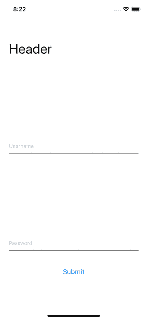
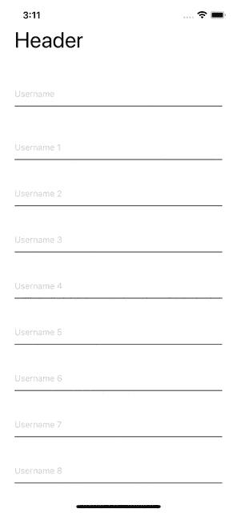

# 在 React Native 中使用 KeyboardAwareScrollView 和 KeyboardAvoidingView

> 原文：<https://blog.logrocket.com/keyboardawarescrollview-keyboardavoidingview-react-native/>

在 React Native 中开发移动屏幕时，需要考虑的最重要的事情之一就是滚动。在 web 上，当内容超出屏幕大小时，浏览器会自动处理滚动。您还可以使用 CSS overflow 属性来处理 web 上的滚动行为。

然而，反应原生动物并非如此。在 react native 中，您必须使用由 React Native 提供的 ScrollView 组件或通过第三方组件(如`KeyboardAwareScrollView`、`KeyboardAwareSectionList`、或`KeyboardAwareFlatList`)来处理滚动。

## 什么是`KeyboardAwareScrollView`和`KeyboardAvoidingView`？

一般来说，当你的内容大于设备高度时，你应该使用由[react-native-keyboard-aware-scroll-view 包](https://github.com/APSL/react-native-keyboard-aware-scroll-view)提供的组件，这样你的屏幕就可以滚动了。

但是，当你不需要在屏幕上滚动，但需要确保输入字段不隐藏在键盘后面时，你应该使用 React Native 提供的`[KeyboardAvoidingView](https://reactnative.dev/docs/keyboardavoidingview)`组件。

下面是几个使用`KeyboardAvoidingView`，以及 react-native-keyboard-aware-scroll-view 的例子。

## 在 React Native 中使用`KeyboardAvoidingView`

当您的屏幕上有输入字段时，您不希望键盘出现在它们前面，否则，用户将看不到输入字段。

为了处理这种情况，您将希望使用`KeyboardAvoidingView`以便每当键盘打开时，您的焦点字段将被向上提升以出现在键盘上方。

让我们首先看看我们试图使用`KeyboardAvoidingView`解决的问题的例子。考虑以下组件，其中我们有几个文本字段，但它们不与`KeyboardAvoidingView`结合使用:

```
import React from 'react';
import {
  View,
  KeyboardAvoidingView,
  TextInput,
  StyleSheet,
  Text,
  TouchableWithoutFeedback,
  Button,
  Keyboard,
} from 'react-native';
const KeyboardAvoidingComponent = () => {
  return (
    <TouchableWithoutFeedback onPress={Keyboard.dismiss}>
      <View style={styles.inner}>
        <Text style={styles.header}>Header</Text>
        <TextInput placeholder="Username" style={styles.textInput} />
        <View style={styles.btnContainer}>
          <TextInput placeholder="Password" style={styles.textInput} />
          <Button title="Submit" onPress={() => null} />
        </View>
      </View>
    </TouchableWithoutFeedback>
  );
};
const styles = StyleSheet.create({
  container: {
    flex: 1,
  },
  inner: {
    padding: 24,
    flex: 1,
    justifyContent: 'space-around',
  },
  header: {
    fontSize: 36,
    marginBottom: 48,
  },
  textInput: {
    height: 40,
    borderColor: '#000000',
    borderBottomWidth: 1,
    marginBottom: 36,
  },
  btnContainer: {
    backgroundColor: 'white',
    marginTop: 12,
  },
});
export default KeyboardAvoidingComponent;

```

上述组件产生以下行为:



如您所见，当键盘打开时，输入字段隐藏在键盘后面。这是一个问题，而这正是`KeyboardAvoidingView`来拯救的地方。

让我们看看如何在`KeyboardAvoidingView`中包装文本字段。

考虑下面的组件，我们在`KeyboardAvoidingView`中包装了几个文本字段:

```
import React from 'react';
import {
  View,
  KeyboardAvoidingView,
  TextInput,
  StyleSheet,
  Text,
  TouchableWithoutFeedback,
  Button,
  Keyboard,
} from 'react-native';
const KeyboardAvoidingComponent = () => {
  return (
    <KeyboardAvoidingView behavior="padding" style={styles.container}>
      <TouchableWithoutFeedback onPress={Keyboard.dismiss}>
        <View style={styles.inner}>
          <Text style={styles.header}>Header</Text>
          <TextInput placeholder="Username" style={styles.textInput} />
          <View style={styles.btnContainer}>
            <TextInput placeholder="Username" style={styles.textInput} />
            <Button title="Submit" onPress={() => null} />
          </View>
        </View>
      </TouchableWithoutFeedback>
    </KeyboardAvoidingView>
  );
};
const styles = StyleSheet.create({
  container: {
    flex: 1,
  },
  inner: {
    padding: 24,
    flex: 1,
    justifyContent: 'space-around',
  },
  header: {
    fontSize: 36,
    marginBottom: 48,
  },
  textInput: {
    height: 40,
    borderColor: '#000000',
    borderBottomWidth: 1,
    marginBottom: 36,
  },
  btnContainer: {
    backgroundColor: 'white',
    marginTop: 12,
  },
});
export default KeyboardAvoidingComponent;

```

上述组件产生以下行为:


正如您在上面看到的，当键盘打开时，输入字段被提升到键盘上方，因为我们在`KeyboardAvoidingView`中包装了我们的组件。

`KeyboardAvoidingView`当我们知道我们的内容不会超出设备高度时，效果很好。然而，总有一些设计的内容比设备高度多。

在那些情况下，`KeyboardAvoidingView`帮不了你多少。这就是`KeyboardAwareScrollView`的用武之地。让我们在下一节看看`KeyboardAwareScrollView`。

## 在 React Native 中实现`KeyboardAwareScrollView`

与`KeyboardAvoidingView`不同的是，`KeyboardAwareScrollView`让你的整个屏幕可以滚动。您可以添加任意数量的组件，并且仍然可以滚动屏幕。

如果您不使用`KeyboardAwareScrollView`并且您的内容不适合屏幕，您的内容将被截断，用户将无法滚动。

通过使用`KeyboardAwareScrollView`，您的整个屏幕变得可滚动。此外，它会自动处理输入字段焦点，并在打开键盘时向上提升字段。

考虑下面的组件，我们已经在`KeyboardAwareScrollView`中包装了一些文本字段:

```
import React from 'react';
import {
  View,
  KeyboardAvoidingView,
  TextInput,
  StyleSheet,
  Text,
  TouchableWithoutFeedback,
  Button,
  Keyboard,
} from 'react-native';
import {KeyboardAwareScrollView} from 'react-native-keyboard-aware-scroll-view';
const KeyboardAwareScrollViewComponent = () => {
  return (
    <KeyboardAwareScrollView>
      <View style={styles.inner}>
        <Text style={styles.header}>Header</Text>
        <TextInput placeholder="Username" style={styles.textInput} />
        <View style={styles.btnContainer}>
          <TextInput placeholder="Username 1" style={styles.textInput} />
          <TextInput placeholder="Username 2" style={styles.textInput} />
          <TextInput placeholder="Username 3" style={styles.textInput} />
          <TextInput placeholder="Username 4" style={styles.textInput} />
          <TextInput placeholder="Username 5" style={styles.textInput} />
          <TextInput placeholder="Username 6" style={styles.textInput} />
          <TextInput placeholder="Username 7" style={styles.textInput} />
          <TextInput placeholder="Username 8" style={styles.textInput} />
          <TextInput placeholder="Username 9" style={styles.textInput} />
          <TextInput placeholder="Username 10" style={styles.textInput} />
          <TextInput placeholder="Username 11" style={styles.textInput} />
          <TextInput placeholder="Username 12" style={styles.textInput} />
          <TextInput placeholder="Username 13" style={styles.textInput} />
          <Button title="Submit" onPress={() => null} />
        </View>
      </View>
    </KeyboardAwareScrollView>
  );
};
const styles = StyleSheet.create({
  container: {
    flex: 1,
  },
  inner: {
    padding: 24,
    flex: 1,
    justifyContent: 'space-around',
  },
  header: {
    fontSize: 36,
    marginBottom: 48,
  },
  textInput: {
    height: 40,
    borderColor: '#000000',
    borderBottomWidth: 1,
    marginBottom: 36,
  },
  btnContainer: {
    backgroundColor: 'white',
    marginTop: 12,
  },
});
export default KeyboardAwareScrollViewComponent;

```

当键盘打开时，上面的组件会将文本字段推到键盘上方，如下所示:



`KeyboardAwareScrollView`接受[滚动查看](https://reactnative.dev/docs/scrollview#props)的所有道具。此外，在[react-native-keyboard-aware-scroll-view](https://www.npmjs.com/package/react-native-keyboard-aware-scroll-view)包中，还有其他可用的组件，比如`KeyboardAwareSectionList`和`KeyboardAwareFlatList`。你可以点击查看这些组件的道具列表[。](https://github.com/APSL/react-native-keyboard-aware-scroll-view#props)

## 结论

在本教程中，我们介绍了什么是`KeyboardAvoidingView`和`KeyboardAwareScrollView`以及如何使用它们。请记住，这些组件有不同的用途。

使用`KeyboardAvoidingView`组件的主要目的是确保您的输入字段不会隐藏在键盘后面。这样，每当用户点击文本字段时，键盘就会打开，字段就会向上抬起，显示在键盘上方。

另一方面，`KeyboardAwareScrollView`服务于两个不同的目的:

1.  它将孩子包装在`ScrollView`中，这样屏幕就可以滚动了
2.  当键盘打开时，它会提升输入栏

可以肯定地说，`KeyboardAwareScrollView`是`KeyboardAvoidingView`的超集。在大多数情况下，使用`KeyboardAwareScrollView`应该足够了，因为它处理滚动和键盘行为。你应该只在你不希望用户滚动的屏幕上使用`KeyboardAvoidingView`。感谢阅读！

## [LogRocket](https://lp.logrocket.com/blg/react-native-signup) :即时重现 React 原生应用中的问题。

[](https://lp.logrocket.com/blg/react-native-signup)

[LogRocket](https://lp.logrocket.com/blg/react-native-signup) 是一款 React 原生监控解决方案，可帮助您即时重现问题、确定 bug 的优先级并了解 React 原生应用的性能。

LogRocket 还可以向你展示用户是如何与你的应用程序互动的，从而帮助你提高转化率和产品使用率。LogRocket 的产品分析功能揭示了用户不完成特定流程或不采用新功能的原因。

开始主动监控您的 React 原生应用— [免费试用 LogRocket】。](https://lp.logrocket.com/blg/react-native-signup)