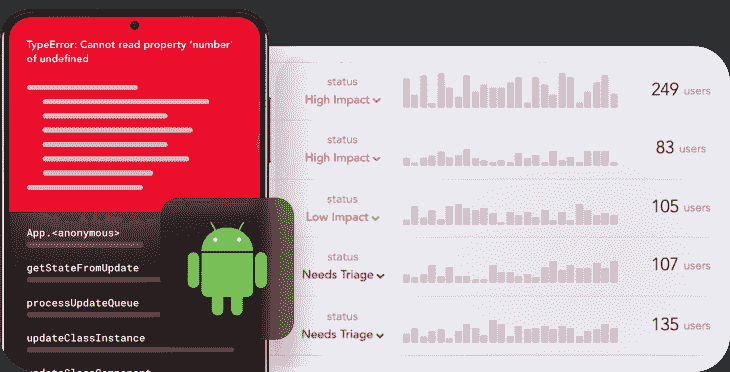

# Kotlin 和 Swift 中控制流语句的比较

> 原文：<https://blog.logrocket.com/kotlin-swift-control-flow-statements/>

控制流语句采用决策来有条件地执行特定的代码块，并用于分解典型的自顶向下的执行流。这类语句的一些例子是众所周知的`if-else`语句，像`for`或`while`这样的循环语句，以及更通用的`switch`或`when`语句。

在本文中，我将比较 Swift 编程语言中的传统`switch`语句和 Kotlin 中的类似`when`语句。

两个控制流语句[都定义了一个带有多个分支](https://kotlinlang.org/docs/control-flow.html#when-expression)的条件表达式，然后依次将它们的参数与所有分支进行匹配，直到满足某个分支条件。最后，它们执行匹配分支的代码块，并继续执行任何后续代码段。

在这篇文章中:

## Swift 和 Kotlin 中`switch`和`when`语句的相似性

虽然 Swift 和 Kotlin 有许多不同之处，但它们的`switch`和`when`控制流语句也有一些相似之处。

### 斯威夫特和科特林案中的默认情况

`switch`和`when`控制流语句之间最明显的相似之处是默认情况。

Swift 的`switch`语句简单地继承了其 C 前辈的`default`关键字，而 Kotlin 则选择使用不同但众所周知的`else`关键字来定义其现代`when`语句的默认情况。

以下是 Swift 中的一个`switch`语句示例:

```
switch (expression) {
    case value1:
        // content
    case value2:
        // content
    ...
    default:
        // content of default case
}

```

这里有一个 Kotlin 中的`when`语句的例子:

```
when (expression) {
    value1 -> //content
    value2 -> //content
    ...
    else -> // content of default case
}

```

这两个语句都可以被一系列的`if-else-if`语句主动替换，其中后面的`else`语句作为默认情况。然而，`switch`和`when`语句与具有多个分支的`if-else`语句实现了相同的功能，但是代码更少，语法更简单:

```
if (expression == value1) {
    // content
} else if (expression == value2) {
    // content
...
} else {
    // content of default case
} 

```

### 作为表达式的对象类型

相反，两个条件语句都可以使用任何种类的本机数据类型作为主体或表达式，用于分支内的比较。

他们可以使用的不同数据类型的一些例子包括`Integer`、`Double`、`Char`和`String`类型。

以下是 Swift 中比较`Character`类型的`switch`语句的示例:

```
let charToCompare: Character = "i"
switch someCharacter {
    case "a":
        // content
    case "i":
        // content
    case "n":
        // content
    case "v":
        // content
}

```

此外，这两个语句都支持使用`Enumeration`类型，也称为`enum`，作为用于比较的条件表达式。

下面是一个在 Kotlin 中比较`enum`类型的`when`语句的例子:

```
enum class Color { BLUE, PURPLE, BLACK, GOLD }
when (getColor()) {
    Color.BLUE -> // content
    Color.PURPLE -> // content
    Color.BLACK -> // content
    Color.GOLD -> // content
}

```

请注意，在上面的示例中，枚举的所有情况都已用尽。这允许我们忽略默认情况，这将是一个`else`分支。

### 在 Swift 和 Kotlin 中使用数值范围

`when`和`switch`的另一个相似之处是能够使用数值范围作为与提供的表达式进行比较的值。

以下是 Swift 中使用数值范围的`switch`语句的示例:

```
let count = 42
switch count {
    case 0..25:
        // content
    case 26..50:
        // content
    case 51..75:
        // content
    case 76..100:
        // content
    default:
        // default case content
}

```

下面是一个在 Kotlin 中使用数值范围的`when`语句的例子:

```
val count = 42
when (count) {
    in 0..25 -> // content
    in 26..50 -> // content
    in 51..75 -> // content
    in 76..100 -> // content
    else -> // default case content
}

```

### 在`switch`和`when`语句中捕获多个案例

使用`switch`和`when`语句，也可以通过简单地用逗号分隔所有附加条件，将多个案例分组到同一个条件分支中。

下面是一个在 Kotlin 的一个分支中捕获多个案例的`when`语句示例:

```
val x = 6
when (x) {
    in 1, 2 -> // content
  in 3, 4 -> // content
    in 5, 6 -> // content
    else -> // default case content
}

```

### 在 Swift 和 Kotlin 中检查继承

另一个强大的相似之处是`when`和`switch`都有检查继承的能力。只要要比较的表达式是超类的一个实例，我们就可以通过检查我们正在处理哪种对象来做到这一点。

这里有一个在 Swift 中检查对象类型的`switch`语句的例子:

```
let vehicle: Vehicle = Car()
switch vehicle {
    case is Car:
        // content
    case is Motorcycle:
        // content
    case is Tricycle:
        //content
} // where Car, Motorcycle & Tricycle all extend the Vehicle class

```

### `switch`和`when`语句中的变量赋值

我们要讨论的最后一个相似之处是两个表达式都可以做的事情，因为 Swift 和 Kotlin 都将函数式编程模式集成到了他们的语言库中。

我们可以使用`switch`或`when`语句作为变量的赋值，两者都将得到结果，并将其用作任何类型变量的值。

下面是一个在 Kotlin 中将`when`语句赋给变量的例子:

```
val seasonOfTheYear: String = when (getMonthByNumber()) {
    3, 4, 5 -> "Spring"
    6, 7, 8 -> "Summer"
    9, 10, 11 -> "Autumn"
    12, 1, 2 -> "Winter"
}

```

## `switch`和`when`语句的区别

尽管 Swift 的`switch`和 Kotlin 的`when`语句有很多相似之处，但由于各自编程语言的独特性，它们也有一些根本性的差异。

### Swift `switch`声明中的详尽性

`switch`和`when`之间值得注意的第一个区别是，尽管 Swift 的`switch`语句必须在任何时候都是详尽的，尽管添加一个默认分支可能足以在编译器级别使其详尽，但 Kotlin 的`when`语句并非如此。

Kotlin `when`语句只有在用作表达式时才需要是详尽的——例如，每当它被赋给一个变量时，或者当一个`else`分支可能被用来捕获一个默认行为时。另一方面，每当`when`模式被用作语句时，它的行为就像一个常规的`if-else-if`语句，其中条件块的所有分支都将被评估，但是除非匹配，否则不会执行任何分支。

* * *

### 更多来自 LogRocket 的精彩文章:

* * *

### `Fallthrough`斯威夫特和科特林案

回到代码中，`switch`和`when`表达式的一个很大的区别是使用了`fallthrough`关键字。

Swift 中的`fallthrough`行为与基于 C 语言的行为非常相似。例如，在下面的 Java 代码块中，省略`break`关键字会通过执行`switch`语句的下一个条件分支包含的代码来触发`fallthrough`行为。

```
final int x = 6;
switch {
    case 1, 2:
        // not executed
        break;
    case 3, 4:
        // not executed
        break;
    case 5, 6:
        // executed
    case 7, 8, 9:
        // also executed because it will fall through
    break;
}

```

在契约中，Swift `switch`语句需要一个特殊的关键字，即`fallthrough`，以表明我们希望`switch`语句的任何给定条件分支落入下一个分支，并执行那里的代码。

以下是 Swift 中带有`fallthrough`行为的`switch`语句的示例:

```
let x = 6
switch x {
    case 1, 2:
        // not executed
    case 3, 4:
        // not executed
    case 5, 6:
        // executed
        fallthrough
    case 7, 8, 9:
        // also executed because it will fall through
}

```

### `when`优点:带有空表达式的条件语句

转到 Kotlin 场景中，`when`语句有一个优势:它可以与显式主体或表达式一起使用，允许它进入典型的`if-else-if`模式，但语法要干净得多。

无论何时采用这种方法，`else`分支也可以作为默认情况使用，但并不是在所有情况下都需要。

下面是一个 Kotlin 中带有空表达式的`when`语句的示例:

```
when {
    x.isOdd() -> // content
    x.isEven -> // content
    else -> // default case content
}

```

> 额外收获:在`switch`语句中有一种简单的方法可以实现这一点，你只需将`true`作为你的表达式，然后逐一检查每个分支，但是这种情况不应该选择常规的`if-else-if`表达式树。

### 使用元组作为`switch`语句的表达式

我们将讨论的`when`和`switch`之间的最后一个区别来自于 Swift 中根深蒂固的一种模式，这种模式包括传递一个元组作为`switch`语句的表达式。

尽管这种数据结构类型类似于常规的 Java 或 Kotlin `Pair`，但它并不直接支持将此作为表达式接收的`when`语句，并且它的使用方式与 Swift 通过一次比较两个值来使用它的方式不同。

下面是一个在 Swift 中使用元组的`switch`语句的例子:

```
let coordinates = (0, 1)
switch coordinates {
    case (0, 0):
        // point is at the center
    case (_, 0):
        // point is on the x-axis
    case (0, _):
        // point is on the y-axis
}

```

## 结论

众所周知，虽然 Swift 建立在基于 C 语言的`switch`语句的传统用法之上，但 Kotlin 通过用条件分支转换其`when`语句而有点误入歧途。

然而，这些语句有许多相似之处，同时也有基于每种编程语言所支持的模式和范例的差异。

最终，`switch`和`when`语句都应该带着相同的目标使用:打破通常的自顶向下的执行顺序，为我们的类增加决策、灵活性和多功能性。

## LogRocket :即时重现你的安卓应用中的问题。

[](https://lp.logrocket.com/blg/kotlin-signup)

[LogRocket](https://lp.logrocket.com/blg/kotlin-signup) 是一款 Android 监控解决方案，可以帮助您即时重现问题，确定 bug 的优先级，并了解您的 Android 应用程序的性能。

LogRocket 还可以向你展示用户是如何与你的应用程序互动的，从而帮助你提高转化率和产品使用率。LogRocket 的产品分析功能揭示了用户不完成特定流程或不采用新功能的原因。

开始主动监控您的 Android 应用程序— [免费试用 LogRocket】。](hhttps://lp.logrocket.com/blg/kotlin-signup)