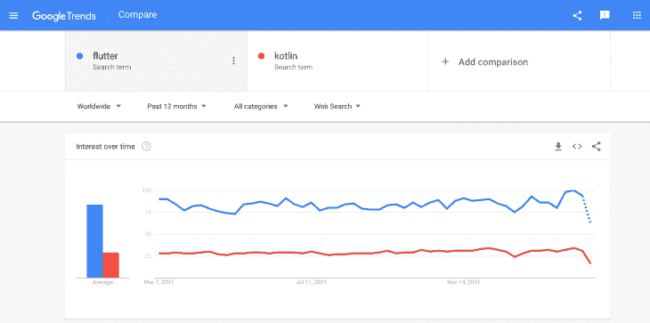

# Kotlin vs. Flutter for Android 开发

> 原文：<https://blog.logrocket.com/kotlin-vs-flutter-android-development/>

***编者按:*** *本文于 2022 年 3 月 23 日更新，包含了关于最新发布的颤振* *(v2.10)和**Kotlin 多平台* *的信息。*

如今，技术生态系统出现了大爆炸——根据联合市场研究公司的数据，全球移动应用市场份额预计将在 2026 年达到 4077 亿美元。这为用于创建移动应用程序的工具和框架的主导地位留下了一个主要战场。

在本文中，我们将探索两种最流行的用于创建移动应用程序的框架和编程语言，同时比较和对比是什么使它们成为开发下一个移动应用程序的好选择。

## 内容

## 什么是颤振？

根据官方的 Flutter 文档，Flutter 是谷歌的便携式 UI 工具包，用于从单一代码库制作时尚、本地编译的移动、网络和桌面应用。

Flutter 使用现有的代码运行，并被全世界的开发者和组织免费和公开地使用。

Flutter 于 2013 年首次被谷歌收购，并已开始与科技巨头合作。从根本上来说，Flutter 是一个免费的开源平台，用于开发具有 Android 和 iOS 原生感觉的应用程序，所有这些都来自一个代码库。

## 科特林是什么？

Kotlin 是一种免费、静态、开源的编程语言，主要用于 Android 和 JVM，具有 OOP 和函数式编程语言的特性。

Kotlin 还捆绑了多平台功能，允许开发人员与 Android、iOS 等平台共享他们的代码、业务逻辑和数据层。

在撰写本文时，Kotlin 多平台目前处于 [alpha](https://kotlinlang.org/docs/multiplatform.html#:~:text=Multiplatform%20projects%20are%20in%20Alpha.%20Language%20features%20and%20tooling%20may%20change%20in%20future%20Kotlin%20versions.) 版本。

Kotlin 的一些顶级特性包括:

*   互用性
*   安全
*   工具和支持

自 Android 诞生以来，官方编程语言就是著名的 Java 和 C++。但在 Google IO 2017 上，谷歌宣布他们支持 Kotlin 作为官方 Android 编程语言，并将 Kotlin 支持直接集成到 Android Studio 中。这使得开发人员能够将以前的 Java 代码转换成 Kotlin，并在他们的项目中同时运行 Kotlin 和 Java 代码。

## Flutter 会取代 Kotlin 吗？

这是一个棘手的问题，也是一个在开发者和技术爱好者之间引发了很多争论的问题。然而，在 Kotlin 和 Flutter 之间进行选择更多的是个人偏好，而不是一刀切的最佳选择。

如果你在这两者之间进行选择，你应该仔细考虑你正在做的项目的独特需求。例如，依赖性能的应用程序应该选择 Kotlin，因为它具有更高的性能。

此外，如果您的应用程序要访问许多本机组件，如蓝牙或 NFC，那么 Kotlin 仍然是一个很好的选择，因为它已经存在了很长时间，并且有更多的资源用于这些组件。

但是，如果你在一个相当小的创业团队中工作，并且想要更快地构建出你的[最小可行产品(MVP)](https://blog.logrocket.com/product-management/what-is-minimum-viable-product-mvp-how-to-define/) 并且有很好的 UI 吸引力，那么使用 Flutter 会更便宜，并且提供一些额外的好处。

## 颤振与科特林:发展趋势、统计和采用

虽然统计数据没有显示出巨大的差异，但 GitHub 在编程语言方面将 Kotlin 排在第 14 位，在 2021 年最后一个季度 PRs 的数量最高。

Flutter SDK 使用的编程语言 Dart 在 2021 年最后一个季度的受欢迎程度和公关数量上都排名第 16 位。从那以后，在框架性能方面已经有了大量的特性改进，在 Flutter 社区中也有了许多协作努力。

基于 GitHub 星叉， [Kotlin](https://github.com/JetBrains/kotlin) 有 40k 星叉和 5k 叉， [Flutter](https://github.com/flutter/flutter) 领先 138k 星叉和 21k 叉。

此外，Flutter 的最新版本 2.10 于 2022 年 2 月 3 日发布，已有多达 50，000 个 Flutter 应用程序上传到 play store，最高速度为每月 1 万个新应用程序。大约三个月后，有超过 90，000 个 Flutter 应用程序，表明增长了近 80%。

即使 Kotlin 在谷歌 Play 商店上有更多的应用程序，但与 Kotlin 在移动应用程序开发方面的同行相比，Flutter 的发展势头和采用率确实要高得多。

这张谷歌趋势图显示了过去 12 个月中 Flutter 和 Kotlin 的搜索量。这种趋势数据是这两者之间随着时间推移的注意力和兴趣的指示器。



并且，据 [Flutter showcase 网站](https://flutter.dev/showcase)报道，几家大公司已经将他们的代码库从 Kotlin 移植到 Flutter。这些公司包括房地产经纪人、腾讯、纽约时报、谷歌助手和 Square。

## 比较 Kotlin 和 Flutter 的移动应用程序开发

下面简单对比一下 Flutter 和 Kotlin 对于移动应用开发的作用。

### 表演

Kotlin 和 Flutter 都有各自的性能优缺点。Flutter 最显著的特性之一是热重新加载和热重启特性，这使开发人员能够对他们的代码进行更改，并立即看到用户界面的变化，从而加快开发时间，并使构建应用程序变得更容易。

另一方面，Kotlin 提供了更多对本机特性和组件的访问，如相机和蓝牙，而在 Flutter 中，这些是使用用本机语言编写的库来实现的，如 Kotlin、Java、Swift 或 objective C。

### 语言和句法

说到语言语法，Kotlin 和 Dart 在许多方面更相似。

虽然 Kotlin 不使用分号，Dart 使用分号，但在编写注释和处理空白时，两种语言的工作方式是一样的。另外，Dart 和 Kotlin 都是面向对象的编程语言。

科特林和颤振都有很大的社区参与。但从与 Kotlin 相比相对较新的 Flutter 来看，它有着越来越受欢迎的更积极的成员参与。

颤振文档也是非常详细和最新的。对于没有框架知识的人来说，这是一个很好的起点，因为它提供了基于经验的信息。

* * *

### 更多来自 LogRocket 的精彩文章:

* * *

### 定价

这里的定价指的是使用 Kotlin 进行本地应用程序开发或使用 Flutter 框架进行跨平台开发的成本。说到定价，Flutter 是开源的，可以免费使用，它提供了构建 MVP 的最快方法。

使用 Flutter 创建移动应用程序的时间因素和成本明显更少，因为 Android 和 iOS 应用程序都可以同时从单个代码库构建和管理。

Kotlin 也是免费和开源的，尽管它主要用于构建 Android 应用程序。然而，使用这种框架构建一个成熟的移动应用程序需要额外的成本来雇人为 iOS 构建相同版本的应用程序，因此，运行两个独立的代码库会增加复杂性和成本。

### 速度

说到速度，Flutter 表现很好，但与 Kotlin 相比要慢一些，kot Lin 通常更快，因为它编译成目标平台的格式。

如果速度对你很重要，科特林是更好的选择。

### 项目设置和配置

Kotlin 使用的是 JetBrains IDE，其中包括流行的 Android Studio。

另一方面，Flutter 可以设置在比 Kotlin 更多的开发环境上，例如 Visual Studio 代码和 Android Studio 本身。与 Kotlin 相比，设置 Flutter 和开始项目的时间框架相对较短。

## Kotlin 在移动应用开发中的优势和劣势

优势:

*   出色的表现
*   适合可扩展性
*   简单学习曲线
*   良好的社区支持和维护

缺点:

*   昂贵的开发成本
*   增加应用程序开发时间
*   更少的第三方库

## Flutter 对于移动应用开发的利与弊

优势:

*   更快的应用程序开发时间
*   热重装功能
*   优雅的用户界面
*   奇妙的社区支持
*   低成本应用程序开发

缺点:

*   更大的应用程序大小
*   更新的框架生态系统
*   相当新的就业市场

## 颤振和科特林的代码比较

让我们看看一个简单计数器应用程序中的 Flutter 代码片段。该应用程序在启动时只显示一个零值，并有一个增量和重置按钮，用于显示屏幕上的值:

> 导入‘package:flutter/material . dart’；void main(){ runApp(const MyApp())；}类 MyApp 扩展 StatelessWidget { const MyApp({ Key？key}):超级(key:key)；@ override Widget build(build context context){ return material app(title:' Flutter Demo '，theme data(primary watch:colors . blue，visual density:visual density . adaptiveplatformdensity，)Home:const my Home Page(title:' Home Page ')，)；} }类 MyHomePage 扩展 stateful widget { const my home page({ Key？

上面代码笔的代码如下所示:

```
import 'package:flutter/material.dart';

void main() {
  runApp(const MyApp());
}

class MyApp extends StatelessWidget {
  const MyApp({Key? key}) : super(key: key);

  @override
  Widget build(BuildContext context) {
    return MaterialApp(
      title: 'Flutter Demo',
      theme: ThemeData(
        primarySwatch: Colors.blue,
        visualDensity: VisualDensity.adaptivePlatformDensity,
      ),
      home: const MyHomePage(title: 'Home Page'),
    );
  }
}

class MyHomePage extends StatefulWidget {
  const MyHomePage({Key? key, this.title}) : super(key: key);
  final String? title;

  @override
  _MyHomePageState createState() => _MyHomePageState();
}

class _MyHomePageState extends State<MyHomePage> {
  int _counter = 0;

  //increase the value of the counter
  void _incrementCounter() {
    setState(() {
      _counter++;
    });
  }

  //reset the counter value to 0-
  void _reset() {
    setState(() {
      _counter = 0;
    });
  }

  @override
  Widget build(BuildContext context) {
    return Scaffold(
      appBar: AppBar(
        title: Text(widget.title!),
      ),
      body: Center(
        child: Column(
          mainAxisAlignment: MainAxisAlignment.center,
          children: <Widget>[
            Text(
              '$_counter',
              style: Theme.of(context).textTheme.headline4,
            ),
            ElevatedButton(
              child: const Text("Increase"),
              onPressed: () => _incrementCounter(),
            ),
            const SizedBox(height: 10),
            ElevatedButton(child: const Text("Reset"), onPressed: () => _reset())
          ],
        ),
      ),
    );
  }
}

```

**MainActivity.kt**

```
package com.example.kotlin_demo

import androidx.appcompat.app.AppCompatActivity
import android.os.Bundle
import android.view.View
import android.widget.TextView
import kotlinx.android.synthetic.main.activity_main.*
import kotlinx.android.synthetic.main.activity_main.view.*

class MainActivity : AppCompatActivity() {
    var count = 0

    override fun onCreate(savedInstanceState: Bundle?) {
        super.onCreate(savedInstanceState)
        setContentView(R.layout.activity_main)

        textView.text = count.toString()
    }

    fun reset(view : View){
        count = 0
       increment.text = count.toString()
    }

    fun increment(view : View){
        count++
        increment.text = count.toString()
    }
}

```

**main_activity.xml**

```
   <?xml version="1.0" encoding="utf-8"?>
<androidx.constraintlayout.widget.ConstraintLayout xmlns:android="http://schemas.android.com/apk/res/android"
    xmlns:app="http://schemas.android.com/apk/res-auto"
    xmlns:tools="http://schemas.android.com/tools"
    android:layout_width="match_parent"
    android:layout_height="match_parent"
    tools:context=".MainActivity">
    <TextView
        android:id="@+id/textView"
        android:layout_width="wrap_content"
        android:layout_height="wrap_content"
        android:text=""
        app:layout_constraintBottom_toBottomOf="parent"
        app:layout_constraintLeft_toLeftOf="parent"
        app:layout_constraintRight_toRightOf="parent"
        app:layout_constraintTop_toTopOf="parent" />

    <Button
        android:id="@+id/increment"
        android:layout_width="wrap_content"
        android:layout_height="wrap_content"
        android:layout_marginTop="15dp"
        android:onClick="increment"
        android:text="Increase"
        app:layout_constraintEnd_toEndOf="@+id/textView"
        app:layout_constraintHorizontal_bias="0.0"
        app:layout_constraintStart_toStartOf="@+id/textView"
        app:layout_constraintTop_toBottomOf="@+id/textView" />

    <Button
        android:id="@+id/reset"
        android:layout_width="wrap_content"
        android:layout_height="wrap_content"
        android:layout_marginTop="12dp"
        android:onClick="reset"
        android:text="Reset"
        app:layout_constraintEnd_toEndOf="@+id/increment"
        app:layout_constraintHorizontal_bias="0.0"
        app:layout_constraintStart_toStartOf="@+id/increment"
        app:layout_constraintTop_toBottomOf="@+id/increment" />

</androidx.constraintlayout.widget.ConstraintLayout> 

```

在一台配备 8GB 内存和酷睿 i3 处理器的简单机器上，为 Flutter 设置上述项目不到 10 分钟。在同一台机器上设置 Kotlin 项目并完成它需要 30 多分钟。由此，您可以看到使用 Flutter 创建应用程序更加容易。

这也是 Flutter 最适合 MVP 和创业公司的原因。除了减少开发时间和成本，它还可以在 Android 和 iOS 平台上运行。此外，对 Windows、Linux 和 macOS 的 Flutter 支持已经测试了一段时间，但随着最新版本的发布，Windows 是第一个达到稳定状态的。

这意味着它很快就可以投入生产使用。Flutter 将能够在 Android、iOS、web 和桌面上运行，简化未来公司和科技公司的工程流程和结构。

## 结论

当要在 Flutter 或 Kotlin 之间做出移动应用程序开发的选择时，所有的框架和编程语言都有起有落。但是对于那些希望以相对较低的成本打造 MVP 的初创公司或公司来说，Flutter 是一个很好的选择。

## LogRocket :即时重现你的安卓应用中的问题。

[](https://lp.logrocket.com/blg/kotlin-signup)

[LogRocket](https://lp.logrocket.com/blg/kotlin-signup) 是一款 Android 监控解决方案，可以帮助您即时重现问题，确定 bug 的优先级，并了解您的 Android 应用程序的性能。

LogRocket 还可以向你展示用户是如何与你的应用程序互动的，从而帮助你提高转化率和产品使用率。LogRocket 的产品分析功能揭示了用户不完成特定流程或不采用新功能的原因。

开始主动监控您的 Android 应用程序— [免费试用 LogRocket】。](hhttps://lp.logrocket.com/blg/kotlin-signup)