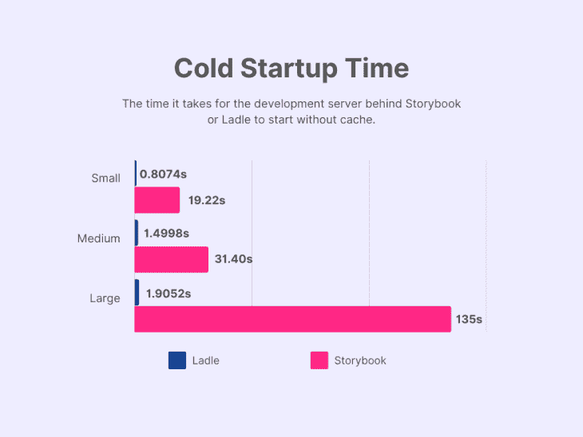
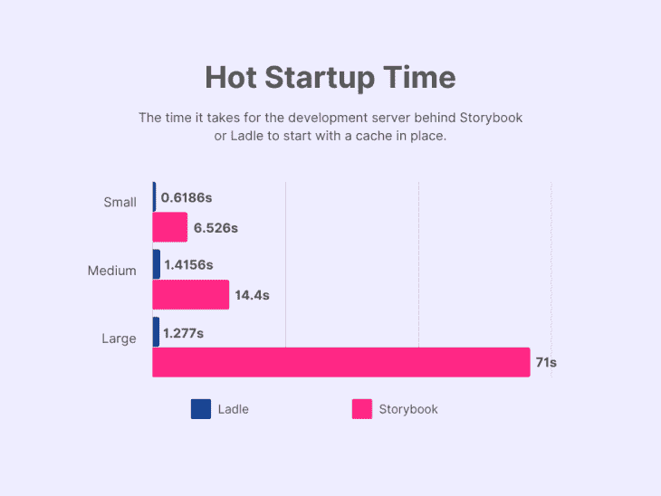
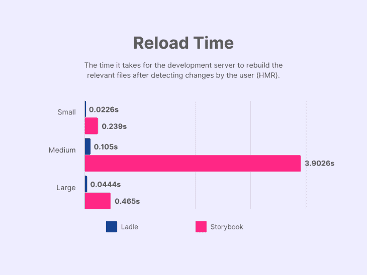
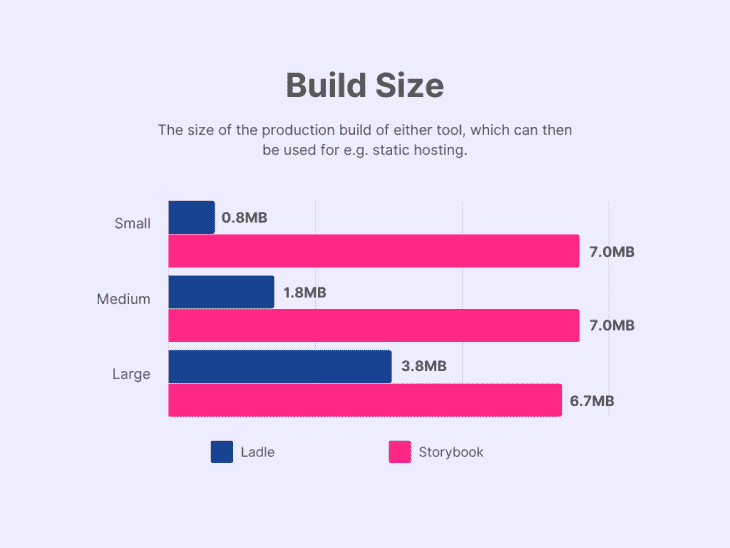

# 勺子与故事书:跨项目规模测量绩效

> 原文：<https://blog.logrocket.com/ladle-storybook-performance-project-sizes/>

多年来，故事书作为一种工具已经成为前端项目中的一个重要部分。它实现了快速的开发速度、更高质量和更易维护的前端代码，以及与设计部门的平滑集成。对于任何与前端相关的项目或库，现在更常见的是包含或涉及故事书。

然而，Storybook 的一个主要缺点是其内部服务器的速度。尽管 Storybook 带来了好处，但它的性能是开发人员经常发现的一个主要缺点。当在现有服务器上添加定制配置、样式或插件时，这一点变得更加突出。在 Storybook 自己的[基准测试](https://storybook.js.org/blog/storybook-performance-from-webpack-to-vite/)中可以找到一些测量结果，他们将自己的 webpack 服务器与 Vite 进行了比较。

这就是这个街区的新成员的用武之地:[勺子](https://ladle.dev/)。由优步的团队创造的“勺子”旨在成为(并被宣传为)故事书的替代物。构建在 Vite 之上，使用 esbuild，并包含 ES 模块，Ladle 显然被定位为一个更具性能的竞争对手。

在[钢包自己的基准](https://ladle.dev/blog#performance-numbers-%EF%B8%8F)中，性能改进是巨大的，非常有希望，范围从减少因子 4 到 25。然而，这个基准测试和 Storybook 的测试都是在一个超过 250 个故事的非常大的项目上进行的。

虽然从长远来看，这确实可以突出性能上的差异，但是该场景并不能代表所有可以从这两种工具中受益的前端项目。大多数项目都没有这么大，因此在选择故事书还是长柄勺时，不会有太多的故事需要考虑。一些项目将会非常小，例如当团队认为任一工具是起点时；其他人将在中等规模且仍在增长时做出决定。

本文将在现有基准的基础上进行扩展，以确定潜在的性能改进和采用勺子而不是故事书的用例。我们将进行一项实验，涵盖代表上述不同场景的不同项目规模，基于现有基准测量指标，并比较不同环境中的勺子和故事书的性能。

以下是我们将要介绍的内容:

## 我们的方法

为了比较这两种工具的性能，我们将考察几个指标。我们将结合来自[故事书](https://storybook.js.org/blog/storybook-performance-from-webpack-to-vite/)和[勺子](https://ladle.dev/blog)的先前基准中使用的指标，而不是重新发明轮子:

*   **冷启动**:story book 或勺子背后的开发服务器在没有缓存的情况下启动所需的时间
*   **热启动**:与冷启动时间相同的指标，但是有一个缓存。对于这两种工具，该缓存都是在冷启动后创建的
*   **重新加载时间**:开发服务器在检测到用户(HMR)的更改后，重新构建相关文件所需的时间
*   **构建规模**:任一工具的生产构建的规模，然后可以用于静态托管等事情

不幸的是，我无法让审计工具 [@storybook/bench](https://github.com/storybookjs/bench) 在大多数故事书项目上工作。因此，相反，故事书项目的启动时间指标将由故事书本身记录的数字来衡量。为了测量热重新加载时间，我们将使用 Storybook 后面的 webpack 服务器记录的时间。最后，我们将通过最终工件的磁盘大小来度量项目的构建规模。

对于 make 项目，我必须进行一些手工测量，因为 make 服务器本身并不记录任何性能数据。对于启动时间，我们将在 Pavel 的 CLI 开始构建服务器时启动计时器，并在服务器指示它已连接时停止计时器。

对于热重新加载时间，底层服务器跟踪触发更改的时间。我们将使用它并记录服务器指示 HMR 完成时的持续时间。最后，构建规模的度量方式与故事书项目相同。

除此之外，我们将对代表不同项目类别的三个不同规模的项目进行基准测试:

1.  有两个故事的基本项目:这代表一个**小的**项目，并且模拟了一个想要从开始或者早期阶段采用任一工具的项目的场景
2.  有 47 个故事的 react-bootstrap-typeahead :这代表了一个**中型**项目，模拟了一个项目在开发过程中决定采用其中一种工具的场景
3.  超过 250 个故事的基础网站:这代表了一个**大型**项目，模拟了一个既有项目想要采用其中一种工具的场景

## 我们如何衡量结果

对于结果，我们将分别研究所有指标。对于它们中的每一个，我们将比较 Storybook 和勺子之间的结果，但也将三个不同的项目规模相互比较，以便我们可以:

*   分析勺子相对于故事书的性能优势
*   验证潜在性能改进的因素，以及
*   比较不同类型项目的潜在差异

所有的测量都是在我的个人电脑上进行的，这是一台 2016 年的英特尔 Macbook Pro，运行 macOS 10.15.3，内存为 8GB。对于每个指标，我将进行五次测量，并将这些测量的平均值作为最终值。

## 冷启动时间

我们要研究的第一个指标是冷启动时间。对于没有现有缓存的开发人员来说，这是这两种工具让服务器运行所需的时间。

该指标不仅适用于服务器第一次启动时，也适用于缓存失效时。想象一下开发环境的配置发生变化时的情形:这会使缓存失效，并导致服务器执行另一次冷启动。更短的启动时间意味着更少的等待，从而带来更好的体验和性能。

乍一看，随着项目规模和故事数量的增长，我们可以发现冷启动时间有增加的趋势。这适用于钢包和反应，是我们预期观察到的趋势。

另一个预期的观察结果是，无论项目大小如何，勺子都比故事书表现得更好。在我们的实验中，大型、中型和小型项目的加速比分别是 71、21 和 23。

虽然这两个项目之间的性能改进差异很大，但中型和小型项目之间的差异并不明显。

## 热启动时间

热启动时间是开发人员可能会比冷启动时间更频繁遇到的一个指标。通常，当启动任一工具的开发服务器时，缓存仍然有效，初始设置的大部分可以忽略。

与冷启动时间一样，热启动时间越短，意味着等待时间越短，因此被认为越好。

在 Storybook 的例子中，我们可以再次观察到启动时间随着项目规模的增加而增加，即使有缓存也是如此。

出乎意料的是，对于钢包，我们大型项目的热启动时间比中型项目短。虽然这种差异并不显著，但这可能表明勺子的性能并不受项目中故事数量的严格限制。

对于热启动时间，sapphire 和 Storybook 之间的性能差异如下:

*   大型项目的系数为 56
*   中型项目的系数为 10，以及
*   小项目的 11 倍

同样，测量结果表明，中小型项目的性能有类似的提高，而大型项目的差异更明显。

## 再装入时间

这两种工具的重新加载时间很可能是开发人员最常遇到的问题。该指标是开发服务器在检测到变更后，重新构建相关文件并重新提供给开发人员所花费的时间。重新加载时间越长，开发人员等待他们的代码更改反映在屏幕上的时间就越长。因此，较低的数字表示较短的重新加载时间，被认为是更好的。

当把故事书换成勺子时，小型和大型项目在重新加载时间上表现出几乎相同的性能增益。对于小型项目，重新加载时间从 0.239 秒下降到 0.0226 秒(系数为 10.58)，而对于后者，重新加载时间从 0.465 秒下降到 0.0444 秒(系数为 10.47)。最大的性能增益来自中型项目，其系数为 37。

最令人惊讶的观察结果是，中型项目在这两种工具的指标中表现最差。Storybook 在这个项目的重新加载时间上几乎花了 4 秒，而大型项目甚至从未接近 1 秒。与大型项目相比，即使是钢包也花费了更多的时间来重新加载这个项目的标准。

## 构建大小

构建规模度量是关于任一工具的生产构建的规模。这些资产主要用于在内部或外部静态托管设计系统。这个指标的相关性并不一定适用于 Storybook 或勺子的所有用户，因为这取决于他们如何决定托管应用程序。但是对于他们自己托管应用程序的场景，构建规模会影响托管应用程序的性能。较小的构建规模会带来更好的应用程序性能。

对于 Storybook，构建规模在这个实验中测试的不同项目中保持相对相同；所有这些银行都产出价值约 700 亿英镑的资产。另一方面，Pavel 产生的构建大小比小于 1MB 的小型项目输出小 8.75 倍。

中型和大型项目仍然产生相对较小的包，分别为 1.8MB 和 3.8MB。但是，随着项目规模的增加，相对于 Storybook 的大小因子减小，分别为 3.89 和 1.76。

## 外卖食品

为了这篇文章和小规模实验，我做了几个决定来保持它在范围内，这涉及到改变方法的部分，同时试图解决不可预见的困难或方法之外的任何事情。在此，我将陈述并简要讨论它们。反过来，这些也意味着作为改进未来工作或扩展这个实验的指针。

### 选择项目大小

本实验中使用的项目是根据其规模选择的，代表了前端项目的主要不同阶段，其中可以考虑勺子或故事书。关于这些场景的确切细节在方法部分有所陈述。

然而，设计系统中的故事数量并不总是项目规模的完美反映。不幸的是，生态系统中项目的可用性，无论是故事书还是勺子，都限制了我在这个实验中可以使用的东西。尽管有这些限制，我相信在这个实验中使用的项目的选择仍然反映了它们所代表的场景。

### 自定义配置可能出错

没有前端项目同时使用故事书和勺子。虽然这绝对有意义，但在一个项目中对这两种工具进行基准测试确实很重要。

由于这个原因，我不得不根据项目使用的工具手动安装另一个工具。在 react-bootstrap-typeahead 的情况下，我安装了钢包，而对于 Base Web，我安装了 Storybook。

虽然我确保应用程序能够正确启动，并以可用的状态加载故事，但很难确认没有遗漏任何一个定制配置或内部代码。

### 我们实验规模的限制

与之前的基准测试相比，我们的实验扩展了基准测试，根据项目的规模考虑了多种类型的项目。虽然这是一个进步，但这个实验的规模仍然有限。

在未来的实验中，人们可以决定在每个类别中包含更多的项目，扩展类别，或者对每个指标进行五次以上的测量。

## 结论

勺子被宣传为故事书的更高性能的替代物，来自现有基准的数字非常有希望。然而，这些基准测试只关注它在一个有大量故事的大型项目中的性能，这并不是所有项目的典型场景。为此，我们进行了一项实验来探索不同规模的项目中勺子和故事书的性能差异。

最终，这个实验的结果只是增强了与性能相关的陈述。大多数与时间相关的开发指标的一个趋势是，在大型项目中发现了最大的性能差异。与此相比，中型项目的性能改进较少，与小型项目没有太大的不同。

但是，不管这些项目之间的差异，有一个结论性的发现。对于这个实验中的所有指标来说，无论在什么场景下，与 Storybook 相比，采用 Ladle 带来的性能提升都是显著的。

## 使用 [LogRocket](https://lp.logrocket.com/blg/signup) 消除传统错误报告的干扰

[LogRocket](https://lp.logrocket.com/blg/signup) 是一个数字体验分析解决方案，它可以保护您免受数百个假阳性错误警报的影响，只针对几个真正重要的项目。LogRocket 会告诉您应用程序中实际影响用户的最具影响力的 bug 和 UX 问题。

然后，使用具有深层技术遥测的会话重放来确切地查看用户看到了什么以及是什么导致了问题，就像你在他们身后看一样。

LogRocket 自动聚合客户端错误、JS 异常、前端性能指标和用户交互。然后 LogRocket 使用机器学习来告诉你哪些问题正在影响大多数用户，并提供你需要修复它的上下文。

关注重要的 bug—[今天就试试 LogRocket】。](https://lp.logrocket.com/blg/signup-issue-free)