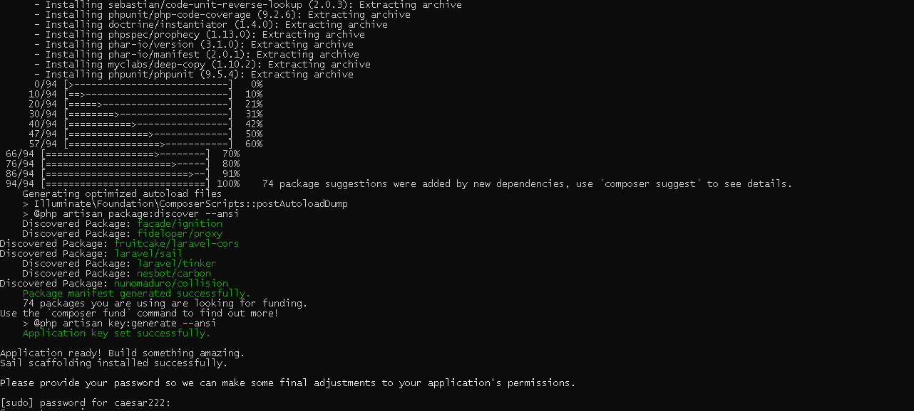
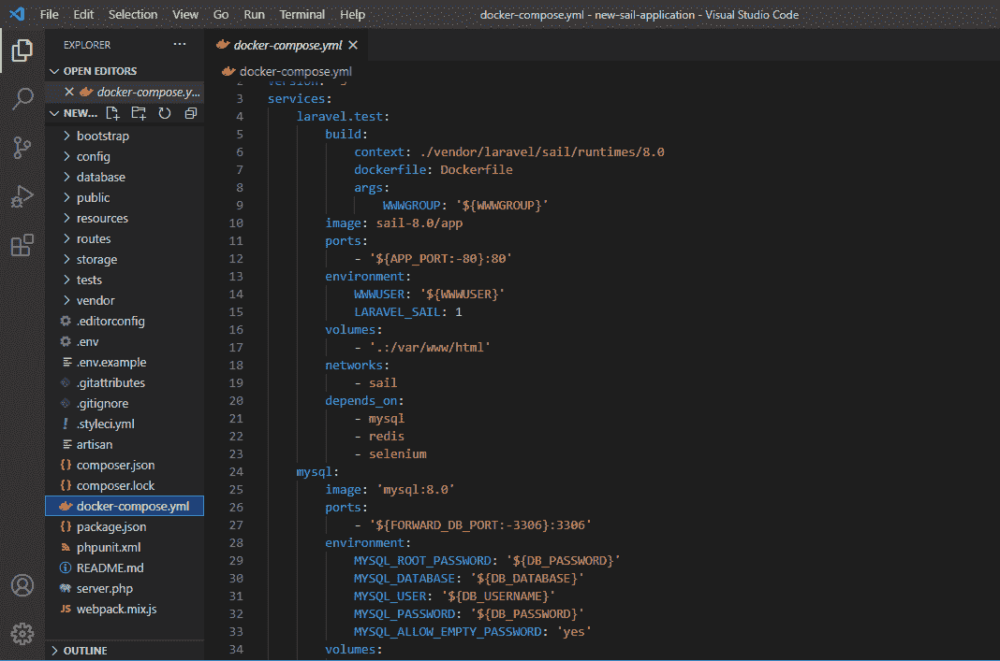

# Laravel 和 Docker:Laravel 航海日志博客使用指南

> 原文：<https://blog.logrocket.com/laravel-and-docker-a-guide-to-using-laravel-sail/>

## 介绍

[Docker](https://www.docker.com/) 是一个用来为应用程序创建容器的工具。这些容器用于打包应用程序，因此它们可以在任何环境(或操作系统)中顺利运行，而不需要任何特殊的设置或配置。

[Sail](https://laravel.com/docs/sail) 为你的 Laravel 应用提供了一个 Docker 开发环境。有了它，您不必为您的 Laravel 应用程序手动创建 Docker 容器。它将为你提供一个本地开发环境，默认由 PHP、MySQL 和 Redis 组成，尽管你可以[选择你想要的特定服务](https://laravel.com/docs/#choosing-your-sail-services)。这意味着 Laravel 开发人员不再需要做任何特殊的配置(比如安装 PHP、MySQL、本地服务器等)。)开始构建一个 Laravel 应用程序。有了帆，他们就能立即投入运行。

Sail 提供的另一个优势是，开发人员不必担心在他们的系统上安装正确版本的配置软件。使用 Sail 容器，如果由于兼容性而出现中断，您可以简单地删除容器并创建一个新的容器，所有这些都包含在远离本地环境的地方，不会留下任何痕迹。

如果你在一个项目上与其他开发者合作，Sail 将使分享变得简单直接，因为不需要考虑其他开发者使用的操作系统。

Sail 在 Laravel 开发环境中进行了一系列尝试，如 [Homestead](https://laravel.com/docs/homestead) 、 [Valet](https://laravel.com/docs/valet) 、 [Laragon](https://laragon.org/) 、[外卖](https://github.com/tighten/takeout)、 [Laradock](http://laradock.io/) 和[船只](https://vessel.shippingdocker.com/)。

整个包由两个文件组成:一个是保存应用程序 Docker 容器的`docker-compose.yml`文件，另一个是为您提供与这些容器交互的 CLI 的 Sail 脚本。`docker-compose.yml`文件位于项目的根目录中，而 Sail 脚本位于 vendor/bin 目录中。

在这篇文章中，我们将学习如何安装和使用 Laravel 帆。我们将创建一个新项目，并仔细研究一些基本的导航命令。

## 先决条件

Sail 唯一的要求是将 [Docker](https://www.docker.com/products/docker-desktop) 安装在运行它的操作系统上。

[如果你使用的是 Windows](https://laravel.com/docs/8.x/installation#getting-started-on-windows) ，你需要[安装并启用 Linux 2 的 Windows 子系统](https://docs.microsoft.com/en-us/windows/wsl/install-win10) (WSL2)。它将允许您在 Windows 操作系统上运行 Linux 二进制可执行文件。另外，确保[配置 Docker Desktop 使用 WSL2 后端](https://docs.docker.com/docker-for-windows/wsl/)。

否则不需要码头工人经验。

## 步骤 1:安装和配置 Sail

每一款新的 Laravel 应用都自带 Sail。它只需要一个简单的命令来旋转它。

运行以下命令创建一个新的 Laravel 应用程序:

```
curl -s https://laravel.build/new-sail-application | bash

```

上面的命令在名为`new-sail-application`的新目录中创建项目。您可以随意用您希望的项目名称对其进行重命名。



Next, navigate into the project directory:

```
cd new-sail-application

```

要 kickstart Sail，请运行以下命令:

```
./vendor/bin/sail up

```

## 向现有应用程序添加 Sail

您还可以使用 Composer 在现有应用程序中安装 Sail，假设您的本地开发环境已设置为使用它:

```
composer require laravel/sail --dev

```

安装完成后，您可以使用以下命令在项目目录中发布 Sail 的`docker-compose.yml`文件:

```
php artisan sail:install

```

最后，为了 kickstart Sail，运行以下命令:

```
./vendor/bin/sail up

```

## 第二步:仔细看看你的申请

现在您的开发环境已经启动并运行了。使用 Docker，每个容器只能容纳一个服务。这意味着我们的 Sail 应用程序附带了三个服务:一个用于 PHP，一个用于 MySQL，第三个用于 Redis。

这三个容器由 [Docker Compose](https://docs.docker.com/compose/) 使用项目根目录下的`docker-compose.yml`文件来容纳和管理。如果您打开这个文件，您将看到一个包含三个组件的`services`部分:`laravel.test`、`mysql`和`redis`:



处理 PHP 组件，另外两个处理它们名字所暗示的东西。

在`mySQL`服务(该服务管理您的数据库)下，您会发现`image`参数，它指示该容器正在实例化的图像。基本上，图像就像房子的蓝图，而容器就是建造的房子本身。还指定了要安装的 MySQL 版本(8.0):

```
mysql:
    image: 'mysql:8.0'
    ports:
        - '${FORWARD_DB_PORT:-3306}:3306'
    environment:
        MYSQL_ROOT_PASSWORD: '${DB_PASSWORD}'
        MYSQL_DATABASE: '${DB_DATABASE}'
        MYSQL_USER: '${DB_USERNAME}'
        MYSQL_PASSWORD: '${DB_PASSWORD}'
        MYSQL_ALLOW_EMPTY_PASSWORD: 'yes'
    volumes:
        - 'sailmysql:/var/lib/mysql'
    networks:
        - sail
    healthcheck:
      test: ["CMD", "mysqladmin", "ping"]

```

我们需要的所有图片都来自网上最大的图片库。它们附带了一些解释如何使用它们的文档。点击查看 MySQL 的[文档。](https://hub.docker.com/_/mysql)

`ports`参数用于同步你的容器端口和本地端口。`DB_PORT:-3306`是您的本地港口，线路`${FORWARD_DB_PORT:-3306}:3306`将它与您的集装箱港口同步。

在`environment`下，定义了您的数据库凭证。它们当前指向位于项目根目录下的`.env`文件中的值。

Docker 使用卷来持久保存(或保存)容器使用的数据(即使在容器被破坏之后)。出于多种原因，将数据外部化或将数据保存在容器之外非常重要。

根据设计，容器是临时创建的。因此，当它们崩溃或停止时，它们保存的所有数据都会丢失。当数据被写入卷，并且它所属的容器被终止时，数据仍然存在，因此可以由新的容器使用。不同机器上的多个容器也可以共享持久数据。

第`volumes: - 'sailmysql:/var/lib/mysql'`行简单地使用一个名为`sailmysql`的卷来保存`var/lib/mysql`目录中的所有数据(这是我们的 MySQL 数据存储的地方)。

我们容器上的所有服务都必须连接到同一个网络才能协同工作。`networks`参数指定您的容器应该使用哪个内部网络，在本例中是`sail`。

最后，`healthcare`参数指定 Docker 将运行的命令，以检查容器的健康状况，并确保它按预期工作。

如果仔细观察一下`laravel.test`服务，首先出现的参数是`build`。它指向一个位于`./vendor/laravel/sail/runtimes/8.0`的 docker 文件。这个 Docker 文件是由 Laravel 团队创建的，它包含了构建我们这里需要的映像的说明，所以我们不会从 Docker Hub 实例化任何映像:

```
laravel.test:
    build:
        context: ./vendor/laravel/sail/runtimes/8.0
        dockerfile: Dockerfile
        args:
            WWWGROUP: '${WWWGROUP}'
    image: sail-8.0/app
    ports:
        - '${APP_PORT:-80}:80'
    environment:
        WWWUSER: '${WWWUSER}'
        LARAVEL_SAIL: 1
    volumes:
        - '.:/var/www/html'
    networks:
        - sail
    depends_on:
        - mysql
        - redis
        - selenium

```

`image`参数指向要实例化的图像。在这种情况下，是由`build`创建的。`ports`将我们的集装箱和本地港口绘制在一起。`environments`指向将在我们的 PHP 代码中使用的凭证。`volumes`用于保存我们不希望丢失的相关 PHP 数据，`networks`指定该服务应该连接的内部网络。

`depends_on`参数指定在我们的应用程序可以启动之前应该启动和运行哪些服务。我们的应用依赖于`mysql`、`redis`和`selenium`。

最后一个服务`redis`类似于`mysql`服务:

```
redis:
    image: 'redis:alpine'
    ports:
        - '${FORWARD_REDIS_PORT:-6379}:6379'
    volumes:
        - 'sailredis:/data'
    networks:
        - sail
    healthcheck:
      test: ["CMD", "redis-cli", "ping"]

```

首先，实例化一个 [Redis 图像](https://hub.docker.com/_/redis)。然后我们的容器和本地端口被同步。我们使用一个卷来保存我们的 Redis 数据，定义这个服务应该连接到的内部网络，并执行健康检查以确保我们的容器正常工作。

## 步骤 3–尝试一些航行命令

默认情况下，要运行 Sail 命令，行`vendor/bin/sail`应该在命令之前。然而，我们可以配置一个只有一个单词的 bash 别名来缩短我们的命令。

基本上，我们将用单词`sail`替换行`vendor/bin/sail`:

```
alias sail='bash vendor/bin/sail'

```

为了运行我们的`docker-compose.yml`文件中的所有容器并启动我们的应用程序，我们使用以下命令:

```
sail up

```

为了在后台启动容器，我们使用:

```
sail up -d

```

一旦您的应用程序启动并运行，您就可以访问 [http://localhost](http://localhost/) 来查看它。

若要停止容器，请按键盘上的 Control + C。如果它们在后台运行，则运行:

```
sail down

```

运行`artisan`、`composer`和`npm`命令时，`sail`别名必须在命令之前。

例如，不运行:

```
php artisan migrate

```

你跑:

```
sail artisan migrate

```

与其跑:

```
composer require laravel/sanctum

```

你跑:

```
sail composer require laravel/sanctum

```

## 结论

您已经完成了教程的最后部分！我们已经能够创建和设置一个新的 Sail 应用程序。我们仔细阅读了 Sail 的`docker-compose.yml`文件，了解了容器是如何设置的。我们还学习了运行我们的 Sail 应用程序的一些基本命令。但是总有更多的东西需要了解！要了解更多关于 Sail 的信息，请点击查看官方文档。

## 使用 [LogRocket](https://lp.logrocket.com/blg/signup) 消除传统错误报告的干扰

[](https://lp.logrocket.com/blg/signup)

[LogRocket](https://lp.logrocket.com/blg/signup) 是一个数字体验分析解决方案，它可以保护您免受数百个假阳性错误警报的影响，只针对几个真正重要的项目。LogRocket 会告诉您应用程序中实际影响用户的最具影响力的 bug 和 UX 问题。

然后，使用具有深层技术遥测的会话重放来确切地查看用户看到了什么以及是什么导致了问题，就像你在他们身后看一样。

LogRocket 自动聚合客户端错误、JS 异常、前端性能指标和用户交互。然后 LogRocket 使用机器学习来告诉你哪些问题正在影响大多数用户，并提供你需要修复它的上下文。

关注重要的 bug—[今天就试试 LogRocket】。](https://lp.logrocket.com/blg/signup-issue-free)