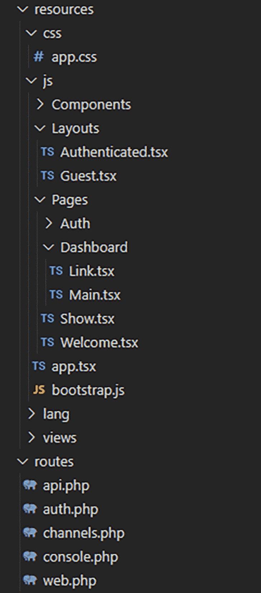
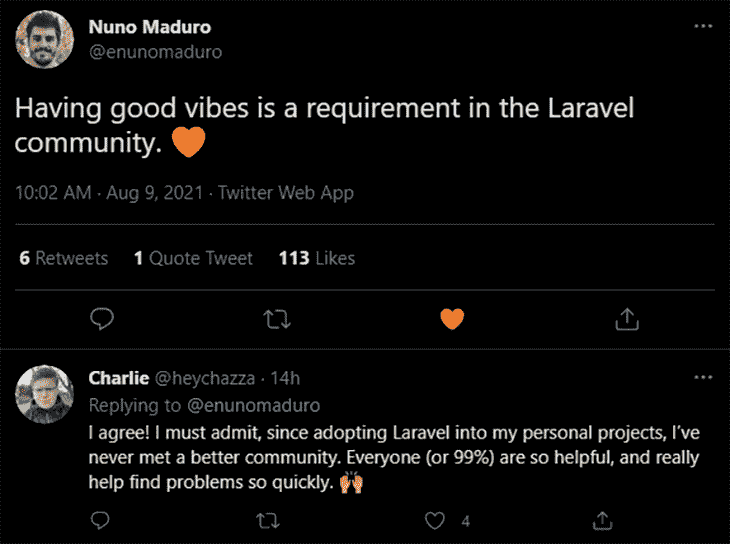

# Laravel Breeze 的惯性反应堆栈与 Next.js 和 Gatsby 

> 原文：<https://blog.logrocket.com/laravel-breeze-inertia-react-stack-vs-next-js-gatsby/>

最近，Laravel 团队只需一个命令就可以轻松建立 React 堆栈，使 Laravel 成为一个可行的全堆栈 React 框架。

你说疯狂？那么，是什么让 Next.js 和其他类似的 React 框架如此伟大呢？

至少可以说，它们很棒，因为它们允许更好的服务器端呈现、路由、认证、状态管理和会话管理。

在本文中，我们将向您展示为什么 Laravel Breeze 的惯性反应堆栈比 Next 或 Gatsby 好得多且更易于使用。尽管这是关于 Laravel 作为 React 框架的适用性，但这些要点中的许多也可以在 Vue 或 Svelte 上下文中理解！

## 什么是拉勒维尔微风？

[Laravel Breeze](https://github.com/laravel/breeze) 是 2020 年秋季 [Laravel 8 推出的入门套件之一](https://blog.logrocket.com/whats-new-in-laravel-8/)——另一个是 [Jetstream](https://jetstream.laravel.com/) 。Laravel Breeze 和 Jetstream 都带有内置的身份验证，以及快速设置大型应用程序所需的路径、控制器和视图。Breeze 还带有前端脚手架。两者都使用了顺风 CSS。

虽然您可以使用 Laravel Breeze 的普通刀片模板，但您也可以使用 [Inertia.js 堆栈](https://laravel.com/docs/8.x/starter-kits#breeze-and-inertia)。

可以把 Inertia.js 想象成一个适配器，它连接两个不能直接相互工作的设备:不需要创建 REST API，Inertia.js 允许开发人员将 React、Vue 或 Svelte 前端与其 Laravel 后端连接起来。

说说你对 PHP 的看法，但是它有很多现成的工具。是的，当使用这样的堆栈而不是全 JavaScript 堆栈时，会有一些权衡，但是这是构建强大的整体的一个很好的方法——这样，我们就可以在后端拥有 PHP 的好处，在前端拥有 JavaScript 框架。

## 为什么您应该选择 Laravel Breeze 作为您的下一个 React 框架？

### 设置是，嗯，轻而易举

开发人员只需要查看`App.js`中的几行代码，就可以让 React 和 Laravel 相互对话。

在 Laravel 团队使惯性反应堆栈变得容易之前，开发人员必须做大量的手工工作来使惯性与反应一起工作，因为 Vue 是默认的。

现在，开发者根本不需要写任何东西，因为搭建是通过运行`php artisan breeze:install react`自动完成的。

`App.js`文件看起来会像这样:

```
js
require('./bootstrap')

// Import modules...
import React from "react"
import { render } from "react-dom"
import { InertiaApp } from "@inertiajs/inertia-react"
import { InertiaProgress } from '@inertiajs/progress'

const el = document.getElementById('app')

render(
    <InertiaApp
        initialPage={el ? JSON.parse(el.dataset.page) : "{}"}
        resolveComponent={(name) => require(`./Pages/${name}`).default}
    />,
    el
);

InertiaProgress.init({ color: '#4B5563' })

```

### Inertia.js 非常容易使用

对于一个已经沉浸在 JavaScript 世界中的开发人员来说，如果他们有一些 PHP 和 Laravel 的知识，实际上没有什么障碍。惯性文档非常容易阅读，涵盖了你构建应用所需的所有用例。

过去，当开发人员希望拥有 Laravel 后端和 JavaScript SPA 时，他们必须用 Laravel 构建 API，并使用单独托管的 JavaScript 框架。现在，开发者可以利用惯性。

它的工作方式是相当天才的:对页面的第一次访问加载纯 HTML，然后数据被加载到页面——没有通过 XHR 和 JSON 完全重新加载。惯性还消除了对 REST API 的需求，并使开发人员能够用 React 前端和 PHP 后端构建一个大而漂亮的 SPA。

它还使得将数据直接从数据库传递到客户端变得非常简单，消除了对 Axios 等其他框架需要做同样事情的额外前端库的需求。

为了更好地理解这一点，让我们比较一下 Laravel API 和 Next 构建的 SPA 将数据从客户端发送到后端的方式，以及我们可以利用惯性做到这一点的新方式。

## Next.js 应用程序中的数据共享与 Laravel Breeze 和 Inertia.js

首先，开发人员安装并设置类似于 [Laravel Sanctum](https://laravel.com/docs/8.x/sanctum) 的东西，以确保请求得到令牌、cookies 或某种组合的授权。然后，他们需要安装和设置 CORS 软件包，以防止 CORS 问题。

当设置完成后，包括防止前端需要 CSRF 保护的中间件，在`routes/api.php`中设置路由。

因此，假设我们需要一个创建银行账户的路径。我们的路由看起来像这样，其中`createAccount`是将处理来自前端的请求的控制器方法:

```
php
Route::post('create-account', [AccountController::class, 'createAccount']);

```

然后在下一个 SPA 中，需要做额外的工作来确保 CORS 和身份验证问题不会发生。

前端开发人员应该非常熟悉 CORS 问题，当前端和后端分开托管时，他们很可能会出现。为了解决这些问题并处理 cookies 和其他因素，开发人员最终安装了一个认证库，如 [NextAuth.js](https://next-auth.js.org/) 或 [next-iron-session](https://github.com/vvo/next-iron-session) 。

当所有这些都设置好后，创建帐户的函数将使用`fetch`或`axios`提交数据并等待 API 的响应。该函数看起来像这样:

```
js
import axios from 'axios'
…
    const [account, setAccount] = useState({
        phone: "", street: "", unit: "", city: "", state: "", zip: ""
    })

    async function handleSubmit(){
        try {
            const accountData = JSON.stringify(account)
            const response = await axios(`${apiUrl}/create-account`, accountData, {
                header: {
                    'Authorization': `Bearer ${user.token}`,
                }
            })

            console.log(response.message)
        }
        catch(e){
            console.log(e.errors)
        }
    }

```

那是很大的工作量！

有了惯性，就不需要安装额外的库或编写这么多行代码来处理 CORS 问题和认证。

开发者唯一要做的就是在 Laravel 和 Inertia 之间共享数据，让数据在第一次访问后随后续渲染一起发送，设置路线，使用 Inertia 访问提交和获取数据。

惯性访问基本上是在[惯性如何工作的核心](https://inertiajs.com/how-it-works):当我们点击一个惯性`<Link />`或者通过手动访问以编程方式做这件事的时候(下面有更多关于它们的内容)，库执行一个 XHR 而不是页面重载。JSON 从服务器返回，惰性的客户端用新数据交换旧数据。

Laravel 和 Inertia 之间共享数据的方式有很多种，但我个人喜欢用 flashed 消息。为此，我简单地在`app/Providers/AppServiceProviders.php`中放置了几行代码:

```
php
<?php

namespace App\Providers;

use Illuminate\Support\Facades\Session;
use Illuminate\Support\ServiceProvider;
use Inertia\Inertia;

class AppServiceProvider extends ServiceProvider
{
    ...

    public function boot()
    {
        Inertia::share('flash', function(){
            return [
                'message' => Session::get('message')
            ];
        });
    }
}

```

路线看起来和上面一样，我可以在我的前端使用[手动访问](https://inertiajs.com/manual-visits)，在那里像`onStart`、`onSuccess`和`onError`这样的方法有助于在数据交换之前、期间和之后执行事件。

人工访问模仿承诺，但是创建和处理事件比链接`then`语句更好。让我来演示一下:

```
js
    const [account, setAccount] = useState({
        phone: "", street: "", unit: "", city: "", state: "", zip: ""
    })

    function handleSubmit(){
        const accountData = JSON.stringify(account)
        Inertia.post(`create-account`, {data: accountData}, {
            onStart: () => {
                // Do something the moment request is made
            },
            onSuccess: response => {
                console.log(response.message)
            },
            onError: e => {
                console.log(e.errors)
            }
        })
    }

```

虽然惰性被认为是框架不可知的，但后端有第一方对 Laravel 和 Rails 的支持，前端有 React、Vue 和 Svelte。

## 使用 Laravel Breeze 进行认证

如果你来自《盖茨比》或《另一个世界》,你应该已经知道认证有多复杂。即使在构建一个简单的库时，您仍然需要花费大量时间来设置登录和注册页面、令牌、cookies、电子邮件验证、密码重置和路由等。

Laravel 最漂亮的地方是他们的[初学者工具包](https://laravel.com/docs/8.x/starter-kits#laravel-breeze)，这是他们让认证变得如此简单的一大原因。使用 Laravel Breeze，您只需一个命令就可以为[构建一个用于登录](https://blog.logrocket.com/magic-login-links-with-laravel/)、注册、密码重置、电子邮件验证和密码确认的系统！

如果您选择了 Inertia-React 堆栈，那么登录、注册和仪表板页面及其相应的路线已经为您完成了！您也可以选择通过使用 Laravel Passport 扩展 Breeze [来实现 OAuth。](https://laravel-guide.readthedocs.io/en/latest/passport/)

与其他方法相比，这是一个巨大的优势，因为您不必使用库来处理复杂的会话和状态管理，以便身份验证正常工作。有了 Laravel，您进行身份验证所需的一切都是现成的。

## 改进的会话和状态管理

React 中大型应用程序的会话和状态管理在不使用任何库或包的情况下是非常痛苦的。尽管如此，在 React 中处理状态对于 Next 和 Gatsby 中的会话管理还是很重要的。

Laravel 使会话和状态管理变得更加容易。对于会话，Laravel 提供了几种存储会话的方法，包括:

*   文件
*   饼干
*   数据库
*   Memcached/Redis
*   AWS DynamoDB
*   数组

您甚至可以使用自己的定制会话驱动程序。从那里，只需两行代码就可以实现与会话的交互和保存。

Laravel Breeze 的 Inertia-React 堆栈进一步消除了客户端对任何状态管理的需求，从而在构建需要复杂状态管理的身份验证系统或其他功能时提供完整而愉快的体验。

您还拥有更复杂的能力来控制您的 Laravel 应用程序如何处理会话，例如限制可以同时发出的 HTTP 请求的数量。

Laravel 中实现这一点的代码让人想起了 JavaScript 中的`async-await`。当发出请求时，会获得一个“会话锁”,因此具有相同会话 ID 的后续请求必须等待第一个会话执行完毕才能执行。

如果您查看下面的代码示例，您会看到 block 方法接受两个参数:

1.  第一个定义了会话锁在被释放之前应该持有的最大秒数
2.  第二个参数定义了请求等待会话锁的秒数

如果获取会话锁的时间太长，就会引发异常。这是规避 PHP 异步限制的天才方法。

```
php
Route::post('/profile', function () {
    //
})->block($lockSeconds = 10, $waitSeconds = 10)

Route::post('/order', function () {
    //
})->block($lockSeconds = 10, $waitSeconds = 10

```

## 更简单的客户端资产编译

就像 Gatsby 和 Next 一样，Laravel 使用 webpack 来编译客户端资产。配置 webpack 并不是一件容易的事情——但是 Laravel 有一个解决方案，就是 Laravel Mix。

Laravel Mix 使您可以轻松地为前端实现各种工具和技术。它通过提供一个 API 来指定编译这些资产的构建步骤。

不相信我？下面是 Laravel 混合文件在使用 Tailwind(和 PostCSS 模块)、TypeScript 和 React 的项目中的样子:

```
js
const mix = require('laravel-mix');

mix.ts('resources/js/app.tsx', 'public/js')
    .react()
    .postCss('resources/css/app.css', 'public/css', [
        require('postcss-import'),
        require('tailwindcss'),
        require('autoprefixer'),
    ])
    .webpackConfig(require('./webpack.config'))

if (mix.inProduction()) {
    mix.version()
}

```

上面的代码告诉 Laravel Mix 在`resources/js`中查找`App.js`或`App.tsx`文件，并将其内容编译到`public/js/app.js`，即网页浏览器读取的 JavaScript 文件。链接`react()`助手让 Laravel Mix 知道期待 React 和 JSX——如果你使用 Vue，还有一个`vue()`助手。

这段代码还告诉 Laravel Mix 使用 PostCSS 将`resources/css/app.css`中的 CSS(即顺风指令)编译成实际的 CSS，并将其放在`public/css`中。如果开发人员想要为路径设置别名，他们可以在 webpack 配置文件中这样做。

就像 Gatsby 和 Next 一样，你不必坚持 Laravel Mix/webpack 的默认设置。如果你想使用 [Vite](https://laravel-vite.netlify.app/) 、 [Esbuild](https://stagerightlabs.com/blog/you-might-not-need-laravel-mix) 或任何其他类似的构建工具，Laravel 也有相关的说明。

## 借助 Laravel Breeze 简化布线

Next 和 Gatsby 都有一个`pages`文件夹，你可以在里面放置与应用程序页面相对应的文件。两者都使用一个路由 API，允许您使用括号(Gatsby 表示花括号，Next 表示方括号)作为文件名来表示动态页面。

这两个框架都努力使路由更容易、更直观，但有时它们需要更多的改动才能正常工作。由于复杂的业务逻辑经常在这些文件中处理，可读性和良好的代码组织经常受到影响。

Laravel 是用[模型-视图-控制器(MVC)架构](https://www.opensourceforu.com/2015/12/the-basics-of-mvc-architecture-in-php/)构建的，所以它有将请求从前端的视图定向到控制器的路径。MVC 架构强制实施良好的代码组织实践，因为您知道您的逻辑将基于您的控制器，并且您的客户机通过将响应返回给客户机的路由发送请求。

Inertia-React 堆栈处理服务器端的路由，这不同于用其他框架构建的 spa。路线可以在`routes`文件夹中找到，在那个文件夹中你可以找到`web.php`，在那里你的大部分路线将被保存。所有 JavaScript 文件——包括项目的 React 页面、组件等。——可以在`resources`文件夹中找到。

查看如何设置带有`resources`和`routes`文件夹的示例 Laravel Breeze 和 React 项目:



## 更灵活的数据管理

Gatsby 对于如何处理数据非常固执己见，并规定在大多数情况下使用 GraphQL。这对喜欢 GraphQL 的开发人员来说很好，但对不喜欢的人来说可能有点麻烦。Next 没有那么固执己见，但是开发人员仍然需要安装和设置许多移动部件，以便将数据从数据库传输到客户端。

Laravel 对它的 ORM 也很固执，但是这个框架的美妙之处在于你可以很容易地不使用它。相反，如果需要的话，您可以用常规的 MySQL 语句直接查询数据库，或者您可以使用自己选择的另一种 PHP 表单。

一个流行的 ORM 是[教条](https://www.doctrine-project.org/projects/orm.html)，它经常与其他框架一起使用，如 Symfony、Zend 和 CakePHP。如果你想要速度和性能，教义当然是要考虑的。

然而，如果你关心它与框架其他部分的融合程度，那么雄辩是其中最好的。为了理解这一点，让我们看看在雄辩和教义中创建数据库表的方式。

**雄辩**

```
php
Schema::create('User', function($table)
{
    $table->id();
    $table->string('name');
});

```

**主义**

```
php
<?php
use Doctrine\ORM\Mapping AS ORM;

class User
{
    private $id;
    private $name;
}
?>

```

就 PHP 兼容哪些数据库而言，你几乎不用担心。PHP 拥有各种数据库系统的驱动程序和扩展，比如 SQLite、MongoDB 和 PostgreSQL，所以你不会仅仅局限于 MySQL。

Laravel 帮助您轻松设置 REST APIs，但是您也可以使用 Laravel 创建 GraphQL APIs！如果你为你的应用程序选择了 GraphQL API，你可以在 [Rebing 的 GraphQL 库](https://github.com/rebing/graphql-laravel)或 [Lighthouse](https://github.com/nuwave/lighthouse) 之间做出选择。

您甚至可以使用 graph QL API——或者您能想到的任何 API——只需几行代码:

```
php
use Illuminate\Support\Facades\Http;

$response = Http::get('http://someapi.com');
dd($response); // dump data

```

## 享受活跃的社区和插件生态系统

尽管它们是以自以为是的方式构建的，但 Gatsby 插件是优秀且丰富的。Next 也是可扩展的。不过，不要被愚弄了——Laravel 的插件生态系统远非微不足道。世界上几乎所有的东西都有一个 Laravel 插件，它们位于一个简单易用的目录中，名为 [Packalyst](https://packalyst.com/) 。

虽然 PHP 只使用几行代码来实现 JavaScript 中需要数百或数千行代码的特性，但对于其他任何东西，都有插件和库可以很容易地安装到您的项目中。

当然，如果你的项目有问题，或者你只想与其他 Laravel 开发人员交流——特别是那些使用惯性堆栈的开发人员——你可以在 Twitter、Stack Overflow、GitHub 和 Discord 上关注成千上万的开发人员。这是一个友好、热情、无毒的社区，显然热爱它所使用的技术，并希望其他人也热爱这项技术。



## 更广泛采用的障碍

### SEO 很难

目前，Inertia.js 在客户端呈现网页。Inertia.js 的创建者认为，Inertia 不是为需要 SEO 的网页设计的，所以创建者应该为这类页面使用 Blade。还有其他的变通办法，比如使用元标签的，[一些人已经开发了变通办法](https://luiyongsheng.medium.com/laravel-inertiajs-seo-workaround-87ad22215e0d)。

不要让这成为一个交易破坏者:[inertia . js 的 SSR 模式](https://github.com/inertiajs/inertia)即将到来。值得一提的是，在本文发表时，GitHub 赞助商已经提前获得了它。还有一些正在生产的 [SaaS 应用](https://builtwithinertia.com/)已经成功使用了 Inertia.js

### PHP 仍然很棘手

虽然我之前把它列为专业版，但公平地说，PHP 在某些方面确实不如 Node.js，包括[并发性](https://blog.logrocket.com/parallelism-concurrency-and-async-programming-in-node-js/)、异步请求和速度。Node 在异步处理方面的优势加快了构建速度，并提高了构建应用程序的灵活性。PHP 确实有一些允许异步处理的插件，但这不一样。

不过，这不应该让你放弃 PHP。由于一个新的充满活力的社区，这种语言正在增加新的特性，并且已经比过去快得多，也灵活得多。它仍然比 Node 更好地处理许多事情，例如:

*   对 MySQL、MongoDB 和 PostgreSQL 等数据库的原生支持
*   与大多数主机服务提供商兼容
*   面向对象编程

### 有限的静态发电能力

像 Gatsby 和 Next 这样的 React 框架可以将页面预先呈现为静态 HTML、CSS 和 JS 文件。随着 Jamstack 和无服务器架构的采用飞速发展，静态站点生成已经成为一种日益增长的模式。

因此，开发人员一直渴望转向这些和其他类似的框架，以便他们可以只关注前端和数据输入应用程序的方式来构建全栈应用程序。

然而，应用程序可以被分成许多小块，其中许多功能和能力由第三方 API 和微服务处理。当然，Laravel Breeze 也可以利用第三方服务，但是增强惰性的概念是，构建强大的 monoliths 是您唯一需要做的事情。

你为什么想要建造一个庞然大物？以下是几个原因:

*   单片复杂性更低，更容易维护——微服务只会增加应用程序的复杂性，因为有更多的移动部件和区域需要监控
*   这是构建应用程序的传统方式，也是大多数开发人员，尤其是更资深的开发人员，学习制作应用程序的方式。对于许多开发人员来说，这使得它们更容易构建
*   部署 monoliths 是一个简单得多的过程，因为所有的部分都在一个地方，而且它们保证可以工作，因为它们是使用相同的语言或框架构建的
*   调试和测试一个完整的应用程序要简单得多——通过一个不可分割的单元，开发人员可以运行简单的端到端测试

如果你想使用 Laravel，但也想使用 Jamstack，你可以看看其他基于 Laravel 的技术，如 [Statamic](https://statamic.com/) 和 [Jigsaw](https://jigsaw.tighten.co/) 。有了这些工具，您可以获得 CMS 功能和用 PHP、Blade 模板和其他 Laravel 特性进行构建的乐趣。

## 结论

一些开发人员抱怨 Laravel 做了太多的“魔术”,他们没有其他 PHP 框架所拥有的控制力。但是他们错了，因为 Laravel 提供了开发人员需要的所有控制，代码抽象有助于更好的开发人员体验。

这就是为什么 Laravel 是迄今为止最受欢迎的 PHP 框架，也是最受欢迎的后端框架。还有，神奇的感觉不就是伟大框架的标志吗？

作为开发人员，我们使用框架来使构建复杂的应用程序变得更容易，而 Laravel，尤其是 Laravel Breeze 的惯性反应堆栈，使构建复杂的反应应用程序变得非常容易。

虽然许多应用程序开发人员没有服务器，将他们的应用程序分成许多部分，但惯性已经证明，您可以构建大而强大的 React SPA 整体。单就状态和会话管理而言，与竞争对手相比，Laravel Breeze 的惯性反应堆栈值得一试。

## 使用 [LogRocket](https://lp.logrocket.com/blg/signup) 消除传统错误报告的干扰

[](https://lp.logrocket.com/blg/signup)

[LogRocket](https://lp.logrocket.com/blg/signup) 是一个数字体验分析解决方案，它可以保护您免受数百个假阳性错误警报的影响，只针对几个真正重要的项目。LogRocket 会告诉您应用程序中实际影响用户的最具影响力的 bug 和 UX 问题。

然后，使用具有深层技术遥测的会话重放来确切地查看用户看到了什么以及是什么导致了问题，就像你在他们身后看一样。

LogRocket 自动聚合客户端错误、JS 异常、前端性能指标和用户交互。然后 LogRocket 使用机器学习来告诉你哪些问题正在影响大多数用户，并提供你需要修复它的上下文。

关注重要的 bug—[今天就试试 LogRocket】。](https://lp.logrocket.com/blg/signup-issue-free)