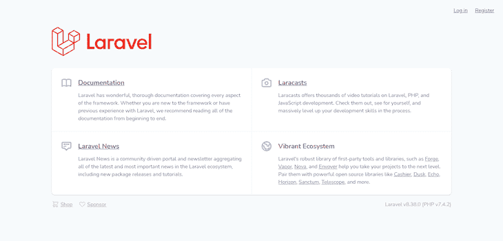
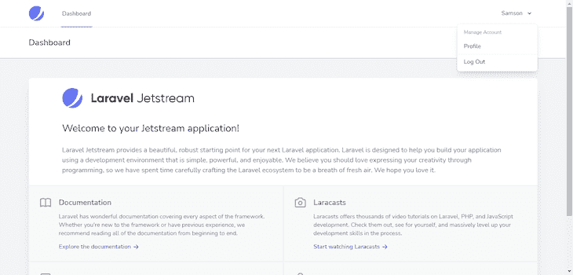
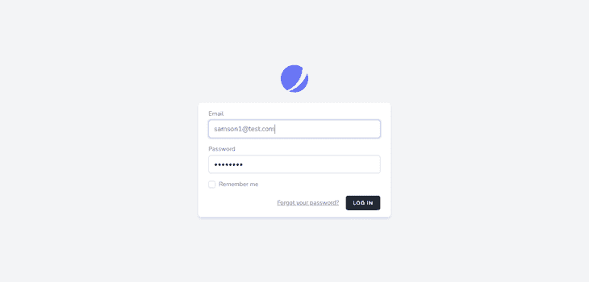

# Laravel 黄昏浏览器测试和自动化- LogRocket 博客

> 原文：<https://blog.logrocket.com/laravel-dusk-browser-testing-and-automation/>

作为一个开源 PHP 框架，Laravel 的创建是为了构建应用程序，同时也是为了优先测试，它得到了名为 PHPUnit 的开箱即用测试包的帮助。然而，尽管 PHPUnit 是在 PHP 中执行单元测试的最流行和最高效的包之一，但 PHPUnit 不能测试 JavaScript 功能，因此需要一个特定于 JavaScript 的测试包。

通常情况下，开发人员可以使用 Selenium 进行 JavaScript 测试，但是设置和学习使用它可能会很有挑战性。因此，Laravel 开发人员决定提供一个更简单的替代方案:黄昏。

Dusk 是一个 Laravel 包，它对 Laravel 应用程序执行端到端(E2E)测试。通过在浏览器中运行测试来提供客户端测试，Dusk 允许开发人员模拟用户使用客户端特性的方式，实时查看测试的客户端特性。

Dusk 建立在 ChromeDriver 和 PHP WebDriver 之上，它还为应用程序提供了浏览器自动化，同时消除了 ChromeDriver 和 PHP WebDriver 分别需要的复杂步骤。

专门为 Laravel 用户量身定制，Dusk 对 JavaScript 和 AJAX 的支持提供了 Symfony BrowserKit 组件无法支持的 JavaScript 功能，而且比 Selenium 更容易使用。有了 Dusk，应用程序中的重复任务现在可以自动化了。

在本文中，我们将在一个应用程序中安装 Laravel Dusk，并用它运行一些浏览器测试，看看它是如何工作的以及它提供的好处。

## 为什么要测试应用程序？

在构建应用程序之后，在发布之前，开发人员必须运行各种测试，以确保应用程序的功能符合预期。但是，即使在发布之后，为改进应用程序而添加的新功能也必须经过测试。

通过运行 E2E 测试，开发人员可以通过模拟用户使用应用程序来确保新添加的功能不会破坏原有的功能。

## 安装和设置黄昏

要开始使用 Dusk，请在您的首选目录中创建一个新的 [Laravel](https://blog.logrocket.com/whats-new-in-laravel-8/) 项目:

```
laravel new project-name

```

接下来，进入新项目的目录:

```
cd project-name

```

您可以通过运行以下命令，使用 Composer 向其添加黄昏:

```
composer require --dev laravel/dusk

```

请注意，Dusk 是一个开发工具，绝不能添加到您的生产环境中。

使用一条`if`语句在`app\Providers\AppServiceProvider.php`中注册服务提供者，该语句仅用于开发:

```
use Laravel\Dusk\DuskServiceProvider;
class AppServiceProvider extends ServiceProvider
{
    /**
     * Register any application services.
     *
     * @return void
     */
    public function register()
    {
        if ($this->app->environment('local', 'testing')) {
            $this->app->register(DuskServiceProvider::class);
         }
    }

}
```

通过导入`DuskServiceProvider`并在`if`语句中实现它，这确保了`DuskServiceProvider`仅在您的本地环境中用于测试目的。

通过运行以下命令，完成项目中的 Dusk 安装:

```
php artisan dusk:install

```

这将在您的`tests`目录中创建一个`Browser`文件夹。文件夹中的`ExampleTest.php`文件包含一个您可以运行或编辑的示例测试。

您还必须指定 Dusk 可以用来测试您的应用程序的浏览器 URL。通常，`[http://localhost:8000](http://localhost:8000)`用于本地环境。导航到您的`.env`文件，并确保您的`APP_URL`键指向您指定的 URL。

如果您不想弄乱您的主数据库，您可以创建它的副本进行测试；只需在根目录下创建一个名为`.env.dusk.local`的文件。

每当你运行一个测试，你的主`.env`文件将被备份，并且`.env.dusk.local`将被重命名为`.env`并被使用。测试之后，这个过程反转，这样您就可以访问您的主`.env`文件。

## 用 Dusk 创建和运行测试

首先，让我们看看 Dusk 安装附带的示例测试，`ExampleTest.php`:

```
<?php

namespace Tests\Browser;

use Tests\DuskTestCase;
use Laravel\Dusk\Browser;
use Illuminate\Foundation\Testing\DatabaseMigrations;

class ExampleTest extends DuskTestCase
{
    /**
     * A basic browser test example.
     *
     * @return void
     */
    public function testBasicExample()
    {
        $this->browse(function (Browser $browser) {
            $browser->visit('/')
                    ->assertSee('Laravel');
        });
    }
}

```

在另一个命令窗口中运行`php artisan serve`。您的应用程序必须在黄昏时运行并可访问，以便对其进行测试。

要执行`ExampleTest.php`，运行以下命令:

```
php artisan dusk

```

这里，`Browser`类导入并创建了它的一个实例。

`Browser`类包含许多有用的方法来在 web 浏览器中执行各种操作。例如，`visit`方法打开浏览器中提供的 URL。由于`[http://localhost:8000](http://localhost:8000)`是应用程序的默认 URL，如果没有任何参数传递给`visit`，它将打开这个默认 URL。

接下来，`assertSee`方法检查页面上的文本是否与提供的参考文本相同。

在`ExampleTest.php`中，`visit`打开你的应用程序的主页，`assertSee`检查“Laravel”这个词是否出现在你的主页上，`browse`方法调用执行这些任务的函数。

可以把断言想象成简单的检查，你可以在你的应用程序上运行它，看看它有什么，没有什么。点击查看[拉勒维尔黄昏断言的完整列表。](https://laravel.com/docs/5.4/dusk#available-assertions)

当测试成功时，您的 CLI 会显示一条简单的“OK”消息。

Dusk 还附带了一个有用的调试特性。如果您运行一个测试并且失败了，失败测试的图片会保存到`screenshots`文件夹中。例如，尝试检查一段不在主页上的文本:

```
public function testBasicExample()
    {
        $this->browse(function (Browser $browser) {
            $browser->visit('/')
                    ->assertSee('exampleText');
        });
    }

```

在这里，您可以看到提供给`assertSee`的文本是否在页面的某个地方。因为不是，所以测试失败，它的截图被保存到`tests\Browser\screenshots`目录。

随着您对 Dusk 基本测试工作原理的理解，您现在可以测试 Laravel 的内置认证系统了。

## 用 Dusk 测试 Laravel 的认证系统

因为您需要一个数据库来保存新的用户信息，所以创建一个数据库并将其详细信息添加到您的`.env`文件中:

```
DB_CONNECTION=mysql
DB_HOST=127.0.0.1
DB_PORT=3306
DB_DATABASE=testDB
DB_USERNAME=root
DB_PASSWORD=

```

使用 [Laravel Jetstream 的](https://jetstream.laravel.com/2.x/introduction.html)认证框架，通过运行以下命令将 Jetstream 添加到您的应用程序中:

```
composer require laravel/jetstream

```

Jetstream 提供了两个前端堆栈选项供选择: [Inertia.js](https://blog.logrocket.com/introduction-to-inertia-js/) 和 [Livewire](https://blog.logrocket.com/deep-dive-into-laravel-livewire/) 。在本例中，使用 Livewire，因为它基于 [Vue.js](https://blog.logrocket.com/livewire-vs-vue/) ，并提供注册、登录和仪表板功能:

```
php artisan jetstream:install livewire

```

要完成 Livewire 设置，请运行以下程序:

```
npm install && npm run dev

```

创建一些包含身份验证系统的表设计的迁移文件后，通过运行以下命令在数据库中生成所需的表:

```
php artisan migrate

```

现在，使用注册、登录和仪表板功能，运行您的应用程序并检查它们:

```
php artisan serve

```

接下来，通过运行以下命令创建一个新的 Dusk 测试，用 Dusk 测试这些特性:

```
php artisan dusk:make AuthTest

```

导航到您的`tests\Browser`目录中新创建的`AuthTest.php`文件。您必须测试您的注册和登录功能。

创建一个测试，该测试注册一个新用户，导航到仪表板，注销，然后使用以下内容重新登录:

```
public function testExample()
    {
        $this->browse(function ($browser) {
            //We'll test the register feature here
            $browser->visit('/')
                    ->clickLink('Register')
                    ->value('#name', 'Samson') 
                    ->value('#email', '[email protected]')
                    ->value('#password', '00000000')
                    ->value('#password_confirmation', '00000000')
                    ->click('button[type="submit"]') 

            //We'll test the login feature here
                    ->press('Samson');
                    if ($browser->seeLink('Log Out')) {
                        $browser->clickLink('Log Out')

                        ->clickLink('Login')
                        ->value('#email', '[email protected]')
                        ->value('#password', '00000000')
                        ->click('button[type="submit"]');
                    }

        });
    }

```

在这里，您正在指示 Dusk 访问您的应用程序的主页，搜索带有显示文本`Register`的链接，然后点击它。这会将你带到 Jetstream 提供的**注册**页面。



`value()`函数为不同的文本框提供了 CSS 选择器作为第一个参数。第二个参数是将值填入文本框。

`click('button[type="submit"]')`点击**注册**按钮，将您提供的值提交给数据库。此后，您将被重定向到仪表板。

这样，注册就成功了！现在是退出并测试登录特性的时候了。

在你的仪表板的右上方，有一个下拉列表，上面有一个**注销**链接。Jetstream 使用一个下拉按钮；要使用黄昏方法点击此按钮，使用`press()`。



首先，指示 Dusk 找到以你的名字作为显示文本的按钮并点击它。接下来，使用`if`语句检查下拉列表中是否有**注销**链接。`clickLink`点击链接，重定向到**欢迎**页面。

`clickLink('Login')`选择**登录**链接，重定向到登录页面。与注册过程类似，使用`value()`填写表单。`click('button[type="submit"]')`点击**登录**按钮，重新登录到仪表板。



要执行测试，请运行以下命令:

```
php artisan dusk

```

注意，默认情况下，Dusk 使用 headless 模式在 Google Chrome 中运行自动化测试，这意味着它通过 CLI 而不是 GUI 工作。这意味着 Dusk 运行浏览器测试，但是你看不到它们被执行。

使用无头模式的一个优点是它比使用 GUI 浏览器运行测试更快。然而，如果你想在 Chrome 浏览器中看到你的测试被执行，你可以禁用 headless 模式。导航到`tests/DuskTestCase.php`并注释掉以下几行:

```
'--disable-gpu',
'--headless',

```

现在，如果你运行黄昏测试，你会看到他们在你的浏览器上执行。

## 结论

最后，你已经来到了本教程的结尾！如果您需要您创建的测试的代码，您可以在 GitHub 上找到它。要了解更多关于 Dusk 的信息和你可以用它来做的测试，请查看 [Dusk 的官方文档](https://laravel.com/docs/8.x/dusk)。

## 使用 [LogRocket](https://lp.logrocket.com/blg/signup) 消除传统错误报告的干扰

[](https://lp.logrocket.com/blg/signup)

[LogRocket](https://lp.logrocket.com/blg/signup) 是一个数字体验分析解决方案，它可以保护您免受数百个假阳性错误警报的影响，只针对几个真正重要的项目。LogRocket 会告诉您应用程序中实际影响用户的最具影响力的 bug 和 UX 问题。

然后，使用具有深层技术遥测的会话重放来确切地查看用户看到了什么以及是什么导致了问题，就像你在他们身后看一样。

LogRocket 自动聚合客户端错误、JS 异常、前端性能指标和用户交互。然后 LogRocket 使用机器学习来告诉你哪些问题正在影响大多数用户，并提供你需要修复它的上下文。

关注重要的 bug—[今天就试试 LogRocket】。](https://lp.logrocket.com/blg/signup-issue-free)