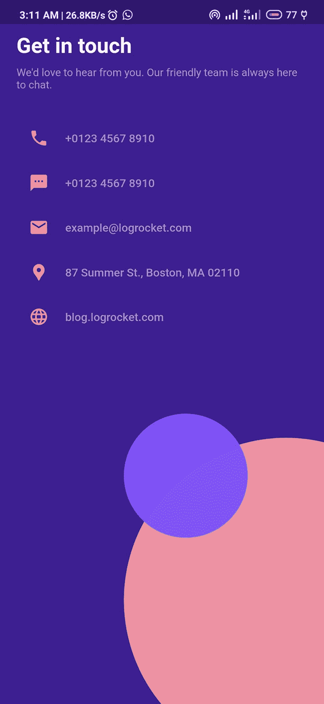
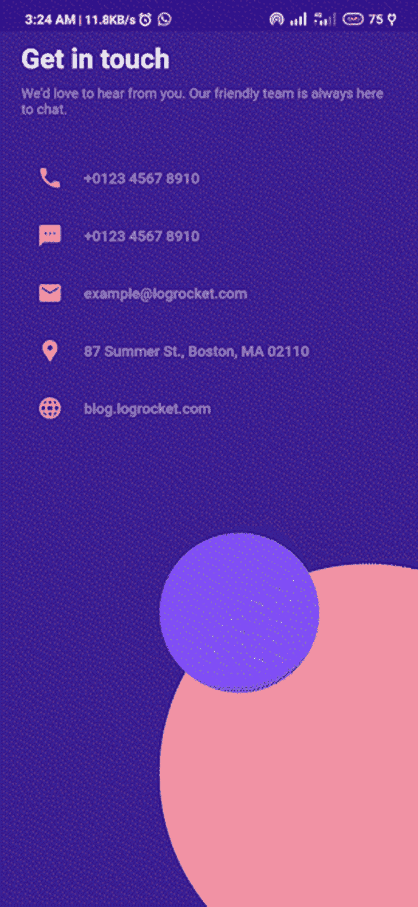
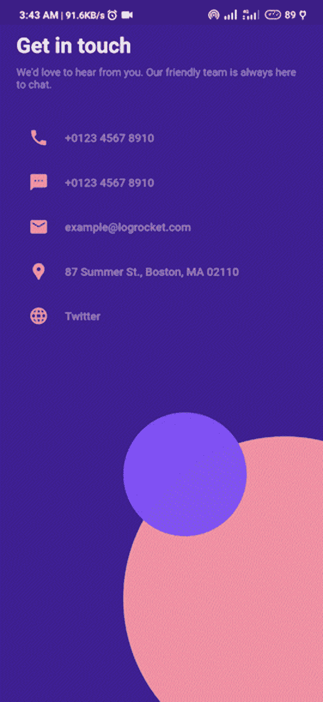
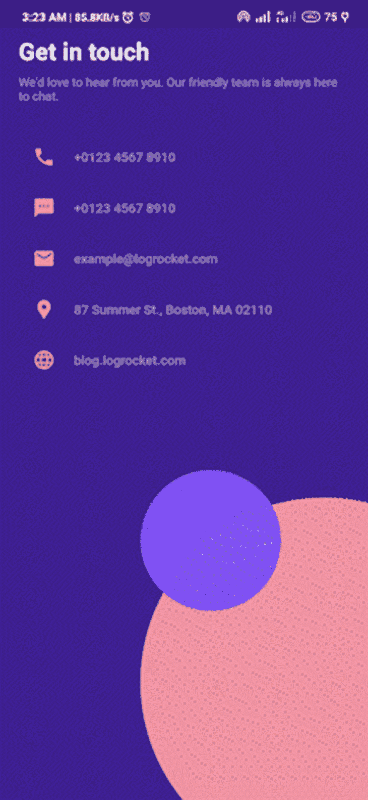

# 用 url_launcher - LogRocket Blog 在 Flutter 中启动 url

> 原文：<https://blog.logrocket.com/launching-urls-flutter-url_launcher/>

URL 启动器是一个 Flutter 插件，允许您的应用程序启动 web 浏览器、地图应用程序、拨号应用程序、邮件应用程序等等。 [URL 启动器插件](https://pub.dev/packages/url_launcher)通过创建意图来打开使用不同 URL 方案的应用程序。

在本文中，我们将构建一个简单的项目来演示如何使用 URL Launcher 插件打开 web 浏览器和拨号程序、邮件和地图应用程序。

## 先决条件

在完成本教程之前，您必须进行以下设置:

本教程用 Flutter v2.5.1 和 Android Studio v3.5 进行了验证。

那么，一切都准备好了，让我们开始吧。

## 项目设置

通过在终端中运行以下命令创建一个新的颤振项目:

```
$ flutter create url_launcher_example

```

接下来，我们需要将`url_launcher`插件作为依赖项添加到我们的项目中。您可以通过在终端中运行以下命令来实现这一点:

```
$ flutter pub add url_launcher

```

结果，`url_launcher`插件将作为一个依赖项添加到我们的`pubspec.yaml`文件中。

接下来，我们需要构建应用程序的 UI。将下面的代码复制并粘贴到您的`main.dart`文件中。

```
import 'package:flutter/material.dart';
import 'package:url_launcher_example/custom_button.dart';
import 'package:url_launcher/url_launcher.dart';
void main() {
  runApp(const MyApp());
}
class MyApp extends StatelessWidget {
  const MyApp({Key? key}) : super(key: key);
  @override
  Widget build(BuildContext context) {
    return MaterialApp(
      title: 'Flutter Demo',
      debugShowCheckedModeBanner: false,
      theme: ThemeData(
        primarySwatch: Colors.blue,
      ),
      home: const MyHomePage(),
    );
  }
}
class MyHomePage extends StatelessWidget {
  const MyHomePage({Key? key}) : super(key: key);
  @override
  Widget build(BuildContext context) {
    return Scaffold(
        backgroundColor: const Color(0xFF3E1F92),
        body: SafeArea(
          child: Padding(
            padding: const EdgeInsets.all(20.0),
            child: Column(
              mainAxisAlignment: MainAxisAlignment.start,
              crossAxisAlignment: CrossAxisAlignment.start,
              children: [
                const Text('Get in touch',
                    style: TextStyle(
                        color: Colors.white,
                        fontSize: 30.0,
                        fontWeight: FontWeight.bold)),
                const SizedBox(height: 10.0),
                const Text(
                    "We'd love to hear from you. Our friendly team is always here to chat.",
                    style: TextStyle(
                        color: Color(0xFFA895D1),
                        fontSize: 15.0,
                        fontWeight: FontWeight.normal)),
                const SizedBox(height: 30.0),
                TextButton(
                  onPressed: () {
                    //logic  goes here
                  },
                  style: TextButton.styleFrom(
                    padding: const EdgeInsets.all(15),
                  ),
                  child: Row(
                    mainAxisSize: MainAxisSize.min,
                    children: const [
                      Icon(Icons.phone, color: Color(0xFFED92A2)),
                      SizedBox(width: 20.0),
                      Text('+0123 4567 8910',
                          style: TextStyle(
                              color: Color(0xFFA294C2),
                              fontSize: 16.0,
                              fontWeight: FontWeight.w500)),
                    ],
                  ),
                ),
                TextButton(
                  onPressed: () {
                    //logic  goes here
                  },
                  style: TextButton.styleFrom(
                    padding: const EdgeInsets.all(15),
                  ),
                  child: Row(
                    mainAxisSize: MainAxisSize.min,
                    children: const [
                      Icon(Icons.sms, color: Color(0xFFED92A2)),
                      SizedBox(width: 20.0),
                      Text('+0123 4567 8910',
                          style: TextStyle(
                              color: Color(0xFFA294C2),
                              fontSize: 16.0,
                              fontWeight: FontWeight.w500)),
                    ],
                  ),
                ),
                TextButton(
                  onPressed: () {
                    //logic  goes here
                  },
                  style: TextButton.styleFrom(
                    padding: const EdgeInsets.all(15),
                  ),
                  child: Row(
                    mainAxisSize: MainAxisSize.min,
                    children: const [
                      Icon(Icons.mail, color: Color(0xFFED92A2)),
                      SizedBox(width: 20.0),
                      Text('[email protected]',
                          style: TextStyle(
                              color: Color(0xFFA294C2),
                              fontSize: 16.0,
                              fontWeight: FontWeight.w500)),
                    ],
                  ),
                ),
                TextButton(
                  onPressed: () {
                    //logic  goes here
                  },
                  style: TextButton.styleFrom(
                    padding: const EdgeInsets.all(15),
                  ),
                  child: Row(
                    mainAxisSize: MainAxisSize.min,
                    children: const [
                      Icon(Icons.location_pin, color: Color(0xFFED92A2)),
                      SizedBox(width: 20.0),
                      Text('87 Summer St., Boston, MA 02110',
                          style: TextStyle(
                              color: Color(0xFFA294C2),
                              fontSize: 16.0,
                              fontWeight: FontWeight.w500)),
                    ],
                  ),
                ),
                TextButton(
                  onPressed: () {
                    //logic  goes here
                  },
                  style: TextButton.styleFrom(
                    padding: const EdgeInsets.all(15),
                  ),
                  child: Row(
                    mainAxisSize: MainAxisSize.min,
                    children: const [
                      Icon(Icons.language, color: Color(0xFFED92A2)),
                      SizedBox(width: 20.0),
                      Text('blog.logrocket.com',
                          style: TextStyle(
                              color: Color(0xFFA294C2),
                              fontSize: 16.0,
                              fontWeight: FontWeight.w500)),
                    ],
                  ),
                ),
              ],
            ),
          ),
        ));
  }
}

```

现在我们已经为我们的应用程序创建了一个基本的 UI，我们可以在模拟器或物理设备上运行代码。当执行完成时，您的设备或仿真器应该显示类似如下的屏幕:



### URL 启动器异步函数

URL Launcher 插件提供了两个异步函数:`canLaunch`和`launch`。`canLaunch`函数返回一个布尔值，表明一个设备是否能处理某个 URL 方案。例如，如果设备没有安装电子邮件应用程序，它将无法使用`mailto`方案启动 URL。

另一方面，`launch`函数需要一个`String`作为 URL 的参数；它解析给定的 URL 字符串，并将其传递给底层平台进行处理。`launch`函数还有其他指定的可选参数，可用于更改 Android 和 iOS 平台上的特定设置，其中一些如下:

*   仅 Android 设置:
    *   `forceWebView`–如果设置为`null`或`false`，URL 将在设备的默认浏览器中打开；否则，将在 WebView 中启动该 URL
    *   `enableJavaScript`–如果设置为`true`，则在 WebView 中启用 JavaScript
    *   `enableDomStorage`–当该值设置为`true`时，WebView 启用 DOM 存储
*   仅限 iOS 的设置:
    *   `forceSafariVC`–如果设置为`true`，则在 Safari 视图控制器中打开 URL 否则，它使用设备的默认处理程序
    *   `statusBarBrightness`–收集一个枚举值，该值可以是`Brightness.dark`或`Brightness.light`，用于设置在 iOS 设备上打开链接后应用程序的状态栏亮度

既然我们已经了解了 URL 启动器插件的工作原理和它所提供的功能，那么让我们看看如何在我们的应用程序中实现它的一些例子。

## 使用 URL 启动器启动网页

下面的代码非常简单明了；请注意，我们使用了`canLaunch`函数来检查设备在调用`launch`函数之前是否可以启动特定的 URL 方案。

```
TextButton(
  onPressed: () async {
      const url = 'https://blog.logrocket.com';
      if(await canLaunch(url)){
        await launch(url);
      }else {
        throw 'Could not launch $url';
      }
    },
    child: const CustomWidget(
      icon: Icons.language,
      label: 'Open a URL',
    ),
),

```

在您的设备上运行代码，并在我们的原始 UI 中点击**打开 URL** 卡来启动网页。


在我们希望浏览器嵌入应用程序的情况下，我们将`forceWebView`设置为`true`。

```
TextButton(
   onPressed: () async {
      const url = 'https://blog.logrocket.com';
      if(await canLaunch(url)){
        await launch(url, forceWebView = true);  //forceWebView is true now
      }else {
        throw 'Could not launch $url';
      }
    },
...//

```



为了提高浏览速度和在线活动，我们可能会选择在网站上禁用 JavaScript 然而，这也带来了一个缺点，如果我们将`enableJavaScript`设置为`false`，您可能无法访问网站上的某些功能。以严重依赖 JavaScript 的 Twitter 官方网站为例:

```
TextButton(
   onPressed: () async {
      const url = 'https://www.twitter.com';  //Twitter's URL
      if(await canLaunch(url)){
        await launch(
          url, 
          forceWebView = true,       //enables WebView
          enableJavaScript = false  //disables JavaScript
        );  
      }else {
        throw 'Could not launch $url';
      }
    },
...//

```



启用 JavaScript 后`enableJavaScript = true`，我们得到如下结果:


## 启动电话拨号器应用程序

要发起一个电话呼叫，我们使用后跟电话号码的`tel:` URL 方案，如下面的代码所示。

```
TextButton(
  onPressed: () async {
    String telephoneNumber = '+2347012345678';
    String telephoneUrl = "tel:$telephoneNumber";
    if (await canLaunch(telephoneUrl)) {
      await launch(telephoneUrl);
    } else {
      throw "Error occured trying to call that number.";
    }
    child: const CustomWidget(
      icon: Icons.call,
      label: 'Call a phone\nnumber',
    ),
),

```


## 启动短信应用程序

为了发送 SMS 消息，我们使用了`sms:` URL 方案和与上面类似的实现。

```
TextButton(
  onPressed: () async {
    String telephoneNumber = '+2347012345678';
    String smsUrl = "sms:$telephoneNumber";
    if (await canLaunch(smsUrl)) {
        await launch(smsUrl);
    } else {
        throw "Error occured trying to send a message that number.";
    }
    child: const CustomWidget(
      icon: Icons.textsms,
      label: 'Send an SMS',
    ),
),

```


## 启动邮件应用程序

要发送一封电子邮件，我们需要将收件人的电子邮件地址、主题行、邮件正文以及除了`mailto:` URL 方案之外的`mailto:` URL 方案传递给`emailUrl`小部件。见下文:

```
TextButton(
    onPressed: () async {
    String email = '[email protected]';
    String subject = 'This is a test email';
    String body = 'This is a test email body';   

    String emailUrl = "mailto:$email?subject=$subject&body=$body";

    if (await canLaunch(emailUrl)) {
      await launch(emailUrl);
    } else {
      throw "Error occured sending an email";
    }
  },
  child: const CustomWidget(
    icon: Icons.forward_to_inbox,
    label: 'Send an email',
  ),
),

```



## 启动地图

为了查看地图上的位置，我们需要将位置的`latitude`和`longitude`值以及`geo:` URL 方案传递给`mapUrl`。

```
TextButton(
  onPressed: () async {
    const String lat = "42.3540";
    const String lng = "71.0586";
    const String mapUrl = "geo:$lat,$lng";
    if (await canLaunch(mapUrl)) {
      await launch(mapUrl);
    } else {
      throw "Couldn't launch Map";
    }
  },
  child: const CustomWidget(
    icon: Icons.near_me,
    label: 'Check location',
  ),
),

```


## 结论

当你需要从你的应用程序与其他应用程序交互时，URL 启动器插件非常方便。我们已经了解了 URL 启动器插件的用例，以及如何实现插件来适应每个用例。

这个项目的完整代码可以在 [GitHub](https://github.com/iloveteajay/url_launcher_example) 上找到。感谢您的阅读。

## 使用 [LogRocket](https://lp.logrocket.com/blg/signup) 消除传统错误报告的干扰

[](https://lp.logrocket.com/blg/signup)

[LogRocket](https://lp.logrocket.com/blg/signup) 是一个数字体验分析解决方案，它可以保护您免受数百个假阳性错误警报的影响，只针对几个真正重要的项目。LogRocket 会告诉您应用程序中实际影响用户的最具影响力的 bug 和 UX 问题。

然后，使用具有深层技术遥测的会话重放来确切地查看用户看到了什么以及是什么导致了问题，就像你在他们身后看一样。

LogRocket 自动聚合客户端错误、JS 异常、前端性能指标和用户交互。然后 LogRocket 使用机器学习来告诉你哪些问题正在影响大多数用户，并提供你需要修复它的上下文。

关注重要的 bug—[今天就试试 LogRocket】。](https://lp.logrocket.com/blg/signup-issue-free)